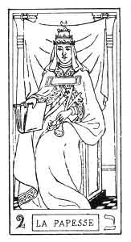
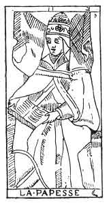

  
[Intangible Textual Heritage](../../index)  [Tarot](../index)  [Tarot
Reading](../pkt/tarot0)  [Index](index)  [Previous](tob14) 
[Next](tob16) 

------------------------------------------------------------------------

p. 112

 

  
THE HIGH PRIESTESS.

   

  
THE HIGH PRIESTESS.

2\. ב

2nd Hebrew letter (Beth).

ORIGIN OF THE SYMBOLISM OF THE SECOND CARD OF THE TAROT.

The Beth hieroglyphically expresses the mouth of man as the organ of
speech. Speech is the production of man's inner self. Therefore Beth
expresses that inner self, central as a dwelling, to which one can
retire without fear of disturbance. From this ideas arise of a
Sanctuary, an inviolate abode for man and for God. But the Beth also
expresses every production that emanates from this mysterious retreat,
every internal activity, and from it issue ideas of Instruction, of the
higher Knowledge, of Law, of Erudition, of occult Science or Kabbalah.

Beth corresponds with the number 2, and astronomically with the moon.
This number has given birth to all the

p. 113

passive significations emanated from the Binary, hence the ideas of
reflection, of Woman; applied to the Moon relatively to the Sun, and to
Woman relatively to Man.

THE SECOND CARD OF THE TAROT.

The High Priestess.

God himself, or God the Father, reflects himself, and gives birth to God
the Man, or God the Son, the negative relatively to his creator. As we
have seen, man is the divine receiver, therefore this second card of the
Tarot will express all the ideas of the first conceived negatively.

The first card represents a man standing; this, on the contrary, bears
the figure of a *seated woman*.

(First idea of passivity) by the woman and by her position.

The man, endowed with all the attributes of Power, was placed in the
midst of nature.

The woman is adorned with all the attributes of Authority and
persuasion, and she is placed under the porch of the temple of Isis,
between two columns.

Idea of a sacred dwelling, of a divine recipient.

The two columns, like the arms of the Juggler, express the Positive and
the Negative.

The woman is crowned with a tiara, surmounted by the lunar crescent, she
is enveloped in a transparent veil falling over her face. On her breast
she bears the solar cross, and upon her knees lies an open book, which
she half covers with her mantle.

This is the picture of Isis, of Nature, whose veil must not be raised
before the profane. The book indicates that the doctrines of Isis are
bidden; but she divulges to the magi the secrets of the true Kabbalah,
and of occult science. We must admire this profound symbol.

p. 114

The first card expressed Osiris in the three worlds; this second gives
us the signification of Isis, the companion of Osiris--

In God it is the reflex of Osiris, the reflex of God the Father, Isis,
or God the Son.

In Man it is the reflex of Adam of the absolute man: Eve, the woman,
life (min).

In the Universe it is the reflex of *natura naturans*: it is *natura
naturata*. [1](#fn_58)

2\. ב

The High Priestess.

<table data-border="" data-cellspacing="1" data-cellpadding="9" width="798">
<colgroup>
<col style="width: 50%" />
<col style="width: 50%" />
</colgroup>
<tbody>
<tr class="odd">
<td width="50%" data-valign="TOP">
AFFINITIES
</td>
<td width="50%" data-valign="TOP">
SIGNIFICATIONS
</td>
</tr>
<tr class="even">
<td width="50%" data-valign="TOP">
Hieroglyphic: The Mouth of Man

Kabbalah: <em>Chocmah</em> 

Astronomy: <em>The Moon</em> ☽

Day of the Week: Monday

Hebrew letter: Beth (Double)
</td>
<td width="50%" data-valign="TOP">
Reflex of God the Father or Osiris

GOD

the Son

ISIS

<em></em>

yod of he  
he he

__________

Reflex of Adam

EVE

the woman

<em></em>

he of he  
he he
</td>
</tr>
<tr class="odd">
<td width="50%" data-valign="TOP">
OBSERVATIONS
</td>
<td width="50%" data-valign="TOP">
Reflex of Natura naturans

NATURA NATURATA

<em></em>

vau of he  
he he

__________

2<em>nd he of he</em> 
</td>
</tr>
</tbody>
</table>

 

------------------------------------------------------------------------

### Footnotes

[114:1](tob15.htm#fr_58) That which follows from
the divine nature.

------------------------------------------------------------------------

[Next: 3. The Empress](tob16)
