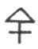

  
[Intangible Textual Heritage](../../index)  [Tarot](../index.md)  [Tarot
Reading](../pkt/tarot0)  [Index](index)  [Previous](tob16.md) 
[Next](tob18.md) 

------------------------------------------------------------------------

  
THE EMPEROR.

   

  
THE EMPEROR.

4\. ד

4th Hebrew letter (Daleth).

ORIGIN OF THE SYMBOLISM OF THE FOURTH CARD OF THE TAROT.

The hieroglyphic meaning of Daleth is the womb. It suggests the idea of
an object giving plentiful nourishment, the source of future growth. The
child is the living

p. 120

link, which in its neutrality reunites the opposition of the sexes; the
Daleth therefore denotes abundance springing from division.

Like the 1, it is a sign of active creation; but this creation is the
result of previous actions easily determinable, whilst the origin of the
Unity is inaccessible to human conceptions. The Daleth expresses a
creation made by a created being. according to divine laws. [1](#fn_59.md)

The Daleth should be the image of the active vivifying principle of the
Universe, Jupiter, the reflex of the Primal cause.

THE FOURTH CARD OF THE TAROT.

The Emperor.

This symbol should express in the *active* form all that the preceding
card expressed in the *passive*.

A man seated in profile.

The man indicates the active; his position, however, shows that this
activity is engendered by a superior term. The 1st arcanum, the Juggler,
the *active absolute*, was represented *standing*, looking to the front;
the 4th arcanum, *active relative*, is seated in profile.

This man holds in his right hand the sceptre, the symbol of generation
or of Venus ♀.

The sceptre is held in the *right hand*, to indicate the *active*
influence, which the vivifying principle exercises in nature, by
opposition to the formative principle (arc. 3).

The man is bearded and wears a helmet with twelve points (six on each
side). He is seated upon a cubic stone, which bears the figure of an
eagle.

p. 121

The helmet indicates the rule of the Divine Will in the Universe, and
its universal action in the creation of Life (eagle).

The position upon the cubic stone indicates realization in all the
worlds.

(1st) Realization of the Divine Word by the creation.

(2nd) Realization of the ideas of the Being shared by the quadruple work
of the spirit--

Affirmation,--Negation,  
Discussion,  
Solution.

(3rd) Realization of the actions conceived by the Will.

The man's legs are crossed, his body forms a triangle  .

Domination of the Spirit over Matter.

Considered more attentively, the figure reproduces the symbol of Jupiter
2 +, represented by the fourth card of the Tarot.

The fourth card of the Tarot corresponds to the *second He*, and
therefore bears two, very distinct aspects.

It first expresses a term of transition uniting the first series (active
and passive forces, the link between the two forces) to the following
series; the passage from one world to the other.

But it also represents this term of transition, itself becoming the
first term in the following series. As the following series taken as a
whole is negative relatively to the first, the fourth symbol represents
the active influence of the first series 1, 2, 3, in the second series
4, 5, 6.

The 4 therefore expresses the reflections of the first card in all its
details. It acts towards the first series exactly as the second card
acted towards the first.

This interprets its meaning--

p. 122

In the Divine. Reflex of God the Father--  
     THE WILL

In the Human. Reflex of Adam--  
     THE POWER.

In the Natural. Reflex of Natura naturans--  
     THE UNIVERSAL CREATIVE FLUID.  
     The soul of the Universe.

4\. ד

The Emperor.

<table data-border="" data-cellspacing="1" data-cellpadding="9" width="798">
<colgroup>
<col style="width: 50%" />
<col style="width: 50%" />
</colgroup>
<tbody>
<tr class="odd">
<td width="50%" data-valign="TOP">
AFFINITIES
</td>
<td width="50%" data-valign="TOP">
SIGNIFICATIONS
</td>
</tr>
<tr class="even">
<td width="50%" data-valign="TOP">
Primitive Hieroglyphic: The Womb

Kabbalah: CHESED

Astronomy: Jupiter

Day: Thursday

Hebrew letter: Daleth (double)
</td>
<td width="50%" data-valign="TOP">
Reflex of God the Father

THE WILL

__________

Reflex of Adam

THE POWER
</td>
</tr>
<tr class="odd">
<td width="50%" data-valign="TOP">
OBSERVATIONS
</td>
<td width="50%" data-valign="TOP">Reflex of
Natura naturans

The universal creative fluid

THE SOUL OF THE UNIVERSE
</td>
</tr>
</tbody>
</table>

 

------------------------------------------------------------------------

### Footnotes

[120:1](tob17.htm#fr_59.md) See the *second He*,
and the study upon the number 4.

------------------------------------------------------------------------

[Next: 5. The Pope](tob18.md)
