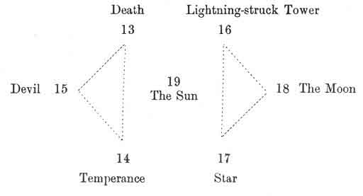
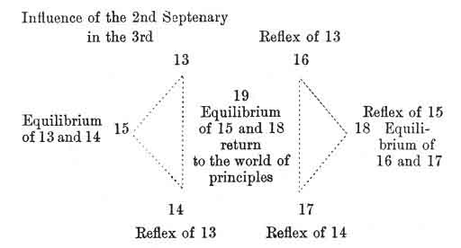

  
[Intangible Textual Heritage](../../index)  [Tarot](../index.md)  [Tarot
Reading](../pkt/tarot0)  [Index](index)  [Previous](tob27.md) 
[Next](tob29.md) 

------------------------------------------------------------------------

p. 156

# CHAPTER XII.

### THIRD SEPTENARY. ARCANA 13-19.

Key of the 3rd Septenary--The Mem and Death--The Nun and Temperance--The
Samech and the Devil--The Ayin and the Lightning--struck Tower--The
Tzaddi and the Moon.

Summary of the 3rd Septenary--Constitution of the Universe.

KEY TO THE THIRD SEPTENARY.

ARRANGEMENT OF THE FIGURES FOR STUDY.

 

 

p. 157

 

CHARACTER OF THE FIGURES.

 

 

The first septenary has shown us the *World of Principles*, or of the
Creation.

The second has developed the *World of Laws*, or of Preservation.

The third will now show us the *World of Facts*, or of Transformation.
We shall now see how the circulation of the forces of the two first
septenaries is established.

------------------------------------------------------------------------

[Next: 13. Death](tob29.md)
