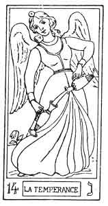
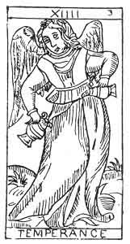

  
[Intangible Textual Heritage](../../index)  [Tarot](../index)  [Tarot
Reading](../pkt/tarot0)  [Index](index)  [Previous](tob29) 
[Next](tob31) 

------------------------------------------------------------------------

p. 161

  
TEMPERANCE.

   

  
TEMPERANCE.

14\. נ

14th Hebrew letter (Nun).

ORIGIN OF THE SYMBOLISM OF THE FOURTEENTH CARD OF THE TAROT.

The hieroglyphic sense of the Nun is the offspring of the female; a son,
a fruit of any kind, all things produced. This letter has therefore
become the image of the being produced or reflected, the sign of
individual and corporeal existence.

As a final it is the sign of augmentation ן (Nun as a final), and gives
to the word which receives it all the individual extension of which the
thing expressed is susceptible.

Astronomically the Nun corresponds with the zodiacal sign of the
Scorpion.

p. 162

In short the Nun expresses the production of any combination, the result
of the action of the ascending or creative forces, and of the descending
or destructive forces figured by the star of Solomon.

FOURTEENTH CARD OF THE TAROT.

Temperance.

The following ideas are expressed by this symbol--

1\. Combination of different fluids.

2\. Individualization of existence.

The genius of the Sun pours the fluid of Life from a golden vase into a
silver one.

(First idea.)

This essence passes from one vase to the other without one drop being
spilt.

(Second idea.)

The fourteenth card represents the young girl whom we have already seen
in the 11th arcanum, and whom we shall see again in the 17th.

The vital current placed upon her head in the 11th arcanum here passes
from one vase into another, but will spread further in the 17th arcanum.

The fourteenth card of the Tarot shows us the fluid, hitherto carefully
preserved, now freely circulated in nature.

1\. Combination of active and passive fluids. Entry of Spirit into
Matter, and reaction of Matter upon the Spirit--

INVOLUTION.

p. 163

2\. Reflex of Justice in the material world--

TEMPERANCE.

3\. Fixation of reflex Life. Incarnation of Life

INDIVIDUAL AND CORPOREAL LIFE.

14\. נ

Temperance.

<table data-border="" data-cellspacing="1" data-cellpadding="9" width="798">
<colgroup>
<col style="width: 50%" />
<col style="width: 50%" />
</colgroup>
<tbody>
<tr class="odd">
<td width="50%" data-valign="TOP">
AFFINITIES
</td>
<td width="50%" data-valign="TOP">
SIGNIFICATIONS
</td>
</tr>
<tr class="even">
<td width="50%" data-valign="TOP">
Primitive Hieroglyphic: A Fruit

Astronomy: The Scorpion

Month: October

Hebrew Letter: Nun (simple)
</td>
<td width="50%" data-valign="TOP">
INVOLUTION

(The Sprit descends towards Matter)

__________

TEMPERANCE
</td>
</tr>
<tr class="odd">
<td width="50%" data-valign="TOP">
OBSERVATIONS
</td>
<td width="50%" data-valign="TOP">
INDIVIDUAL AND CORPOREAL LIFE
</td>
</tr>
</tbody>
</table>

 

------------------------------------------------------------------------

[Next: 15. The Devil](tob31)
