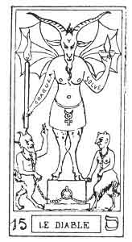
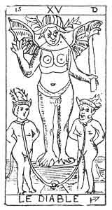

  
[Intangible Textual Heritage](../../index)  [Tarot](../index)  [Tarot
Reading](../pkt/tarot0)  [Index](index)  [Previous](tob30) 
[Next](tob32) 

------------------------------------------------------------------------

p. 164

  
THE DEVIL.

   

  
THE DEVIL.

15\. ס

15th Hebrew letter (Samech).

ORIGIN OF THE SYMBOLISM OF THE FIFTEENTH CARD OF THE TAROT.

The Samech expresses the same hieroglyphic sign as the Zain (7th
arcanum), that is to say, an arrow; a weapon of any kind; but to this
idea is here added that of the arrow making a circular movement, of any
circle defining and delimiting a circumscription.

This idea of an impassable circle has given birth to that of Destiny, of
Fatality, circumscribing the limits of the circle in which the human
will can act freely; so that the Serpent forming a circle of his own
body, biting his own tail, has always been the symbol of this Fatality,
of this Destiny, encircling the world in its embrace. It is the

p. 165

image of the year (the ring), and of the fatal and settled revolutions
of time.

As a letter, the Samech is the link (Zain) reinforced and turned back
upon itself. As a simple letter, it corresponds with the zodiacal sign
of Sagittarius.

FIFTEENTH CARD OF THE TAROT.

The Devil.

In every cosmogony the Devil represents the mysterious astral force, the
origin of which is revealed to us by the hieroglyphic of Samech.

But a little attentive consideration of the symbol will show us that it
contains several of the details which we have already seen in other
figures of the Tarot, but under a different aspect.

If we place the Juggler by the side of the Devil we shall see that the
arms of the two personages are using the same gesture, but in an inverse
sense. The Juggler points his right hand towards the Universe, his left
hand towards God; on the other hand the Devil raises his right band into
the air, whilst his left points to the earth. Instead of the magic
initiating wand of the Juggler, the Demon holds the lighted torch, the
symbol of black magic and of Destruction.

By the side of the Devil, and balanced by him, are two personages
reproducing the same symbolism that we find in the two women of the
Lovers (6), and in the two supports of the gibbet of the Hanged Man
(12).

The universal vivifying force represented by the 3rd arcanum, has here
become the universal destroying force. The sceptre of Venus-Urania has
become the Demon's

p. 166

torch, the Angel's wings have changed into the hideous pinions of the
God of Evil.

The 3rd arcanum symbolizes the Holy Spirit, or the Providence of Fabre
d'Olivet.

The 15th arcanum symbolizes the False Spirit, or the Destiny of Fabre
d'Olivet.

15+3 = 18/2 = 9.

The 9th arcanum, which fills the centre between the two figures,
symbolizes Prudence, or the Human Will of Fabre d'Olivet.

The Devil has materialized upon his head the universal fluid which
surrounded the head of the Juggler; this is indicated by the two
six-pointed horns which adorn him.

He stands upon a cube placed upon a sphere, to indicate the domination
of Matter (the cube) over the Spirit (the Sphere).

The fifteenth card of the Tarot derives its signification from its own
symbolism--

1\. DESTINY (chance).

2\. FATALITY, the result of the *fall* of Adam-Eve.

3\. The astral fluid, which individualizes.

NARASH, the Dragon of the Threshold.

p. 167

15\. ס

The Devil.

<table data-border="" data-cellspacing="1" data-cellpadding="9" width="798">
<colgroup>
<col style="width: 50%" />
<col style="width: 50%" />
</colgroup>
<tbody>
<tr class="odd">
<td width="50%" data-valign="TOP">
AFFINITIES
</td>
<td width="50%" data-valign="TOP">
SIGNIFCATIONS
</td>
</tr>
<tr class="even">
<td width="50%" data-valign="TOP">
Primitive Hieroglyphic: Serpent

Astronomy: Sagittarius

Month: November

Hebrew letter: Samech (simple)
</td>
<td width="50%" data-valign="TOP">
DESTINY

Chance

__________

FATALITY

Result of the fall of Adam-Eve
</td>
</tr>
<tr class="odd">
<td width="50%" data-valign="TOP">
OBSERVATIONS
</td>
<td width="50%" data-valign="TOP">
NAHASH

The Dragon of the Threshold
</td>
</tr>
</tbody>
</table>

 

------------------------------------------------------------------------

[Next: 16. The Lightning-Struck Tower](tob32)
