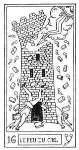
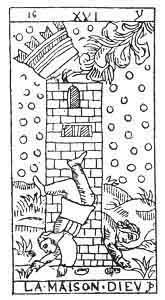

  
[Intangible Textual Heritage](../../index)  [Tarot](../index)  [Tarot
Reading](../pkt/tarot0)  [Index](index)  [Previous](tob31) 
[Next](tob33) 

------------------------------------------------------------------------

p. 168

  
THE FIRE OF HEAVEN (lightning).

   

  
THE LIGHTNING-STRUCK TOWER.

16\. ע

16th Hebrew letter (Ayin).

ORIGIN OF THE SYMBOLISM OF THE SIXTEENTH CARD OF THE TAROT.

The Ayin expresses the same hieroglyphic as the Vau (6), but
materialized. It is the sign of *Material sense*. Again degenerated, it
expresses all that is crooked, false, perverse, and bad.

Astronomically this letter corresponds with the zodiacal sign of
Capricornus.

SIXTEENTH CARD OF THE TAROT.

The Lightning-struck Tower.

This card bears the picture of a tower, with its battlements

p. 169

struck by lightning; two men, one crowned, the other uncrowned, are
falling with the fragments of broken masonry; the attitude of the former
recalls the shape of the letter Ayin.

This card contains the first allusion to a material building in our
pack, but we shall find the same symbol reproduced in the 18th and 19th
arcana.

Here it signifies the invisible or spiritual world, incarnated in the
visible and material world.

The 16th card represents the material fall of Adam. He will gradually
become more materialized until the 18th arcanum, in which he attains the
maximum of his materialization.

The significations of this figure are all derived from this idea of
fall, of the materialization of the spiritual letter (Vau).

1\. Materialization of God the Holy Spirit. (See 3rd arcanum.)

Entrance of the Holy Spirit into the visible World. The Holy Spirit
acting like the God of matter.

DIVINE DESTRUCTION.

2\. The materialization of the Adam-Eve, who have been spiritualized
until now.

Entrance of the Adam-Eve into the visible World--

THE FALL.

3\. Materialization of the Universe-principle--

THE VISIBLE WORLD.

p. 170

16\. ע

The Lightning-struck Tower.

<table data-border="" data-cellspacing="1" data-cellpadding="9" width="798">
<colgroup>
<col style="width: 50%" />
<col style="width: 50%" />
</colgroup>
<tbody>
<tr class="odd">
<td width="50%" data-valign="TOP">
AFFINITIES
</td>
<td width="50%" data-valign="TOP">
SIGNIFICATIONS
</td>
</tr>
<tr class="even">
<td width="50%" data-valign="TOP">
Primitive Hieroglyphic: Link (Vau) materialized

Astronomy: Capricornus

Month: December

Hebrew letter: Ayin (simple)
</td>
<td width="50%" data-valign="TOP">
DIVINE DESTRUCTION

__________

THE FALL
</td>
</tr>
<tr class="odd">
<td width="50%" data-valign="TOP">
OBSERVATIONS
</td>
<td width="50%" data-valign="TOP">
THE VISIBLE WORLD
</td>
</tr>
</tbody>
</table>

 

------------------------------------------------------------------------

[Next: 17. The Stars](tob33)
