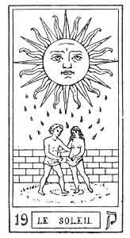
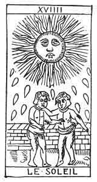

  
[Intangible Textual Heritage](../../index)  [Tarot](../index)  [Tarot
Reading](../pkt/tarot0)  [Index](index)  [Previous](tob36) 
[Next](tob38) 

------------------------------------------------------------------------

p. 179

  
THE SUN.

   

  
THE SUN.

19\. ק

19th Hebrew letter (Qoph).

ORIGIN OF THE SYMBOLISM OF THE NINETEENTH CARD OF THE TAROT.

HIEROGLYPHICALLY the Qoph expresses a sharp weapon, everything that is
useful to man; defends him; makes an effort for him.

The Qoph is therefore a particularly compressive, astringent, and
cutting sign; it is the image of agglomerative, restricting form, and
this gives rise to the idea of *material existence*.

This letter represents the letter ק (Kaph, 11) entirely materialized,
applying itself to purely physical objects. Here is the progression of
the sign--

p. 180

ה (He, 5). Universal life.

ח (Cheth, 8). Elementary existence. The effort of nature.

כ (Kaph, 11). Assimilated life, tending to material forms.

ק (Qoph, 19). Material existence, becoming the medium of forms.

This is a simple letter; it corresponds with the sign of the Gemini.

NINETEENTH CARD OF THE TAROT.

The Sun.

Two naked children are shut into a walled enclosure. The sun sends down
his rays upon them, and drops of gold escape from him and fall upon the
ground.

The spirit resumes its ascendancy. It is no longer a reflected light as
in the preceding arcanum, which illumines the figure, but the direct
creative light of the God of our Universe, which floods it with his
rays.

The walls indicate that we are still in the visible or material world.
The two children symbolize the two creative fluids, positive and
negative, of the new creature.

1\. Awakening of the Spirit. Transition from the material world to the
divine world. Nature accomplishing the functions of God--

THE ELEMENTS.

2\. The body of man is renewed--

NUTRITION. DIGESTION.

3\. The material world commences its ascension towards God--

THE MINERAL KINGDOM.

p. 181

19\. ק

The Sun.

<table data-border="" data-cellspacing="1" data-cellpadding="9" width="798">
<colgroup>
<col style="width: 50%" />
<col style="width: 50%" />
</colgroup>
<tbody>
<tr class="odd">
<td width="50%" data-valign="TOP">
AFFINITIES
</td>
<td width="50%" data-valign="TOP">
SIGNIFICATIONS
</td>
</tr>
<tr class="even">
<td width="50%" data-valign="TOP">
Hieroglyphic Primitive: Axe, sharp-edged weapon

Astronomy: The Gemini

Month: February

Hebrew letter: Qoph (simple)
</td>
<td width="50%" data-valign="TOP">
THE ELEMENTS

__________

NUTRITION

Digestion
</td>
</tr>
<tr class="odd">
<td width="50%" data-valign="TOP">
OBSERVATIONS
</td>
<td width="50%" data-valign="TOP">
THE MINERAL KINGDOM
</td>
</tr>
</tbody>
</table>

 

------------------------------------------------------------------------

[Next: 20. The Judgement](tob38)
