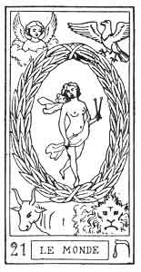
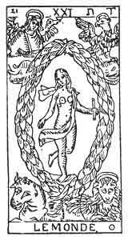
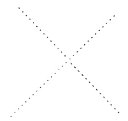
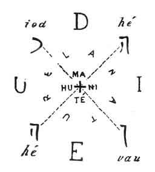
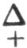
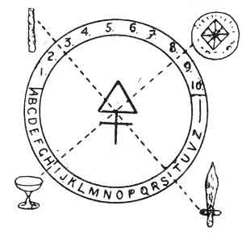

  
[Intangible Textual Heritage](../../index)  [Tarot](../index)  [Tarot
Reading](../pkt/tarot0)  [Index](index)  [Previous](tob39) 
[Next](tob41) 

------------------------------------------------------------------------

p. 188

  
THE WORLD.

   

  
THE WORLD.

22\. ת

22nd Hebrew letter (Tau).

ORIGIN OF THE SYMBOLISM OF THE TWENTY-FIRST CARD OF THE TAROT.

The Tau has the same hieroglyphic meaning as the Daleth (fourth card),
the womb; but it is chiefly the sign of reciprocity, the image of all
that is mutual and reciprocal. It is the sign of signs, for to the
abundance of the letter Daleth ד (fourth card), and by dint of the
resistance and protection of the letter Teth, ט (ninth card), it adds
the idea of PERFECTION, of which it is the symbol.

In the primitive Hebrew alphabet the Teth was represented by a cross
(+). This letter is double, and in astronomy it represents the Sun.

p. 189

TWENTY-FIRST CARD OF THE TAROT.

The World.

A nude female figure, holding a wand in each hand, is placed in the
centre of an ellipsis, her legs crossed (like those of the Hanged Man in
the twelfth card). At the four angles of the card we find the four
animals of the Apocalypse, and the four forms of the Sphinx: the Man,
the Lion, the Bull, and the Eagle.

This symbol represents Macrocosm and Microcosm, that is to say, God and
the Creation, or the Law of the Absolute. The four figures placed at the
four corners represent the four letters of the sacred name, or the four
great symbols of the Tarot.

|              |              |          |
|--------------|--------------|----------|
| The Sceptre  | or *yod*     | = Fire.  |
| The Cup      | or *he*      | = Water. |
| The Sword    | or *vau*     | = Earth. |
| The Pentacle | or 2*nd he*  | = Air.   |

 

These affinities can be represented thus--

|         |                                                       |          |
|---------|-------------------------------------------------------|----------|
| Sceptre |                                                       | Pentacle |
|         |   |          |
| Cup     |                                                       | Sword    |

 

Between the sacred word that signifies GOD and the centre of the figure
is a circle or an ellipsis, representing NATURE and her regular and
fatal course. From this comes the name of *Rota*, wheel, given to it by
Guillaume Postel.

p. 190

Lastly, the centre of the figure represents humanity, ADAM-EVE, the
third term of the great series of the Absolute, which is thus
constructed:--

The impenetrable Absolute, the EN SOPH of the Kabbalists, the PARABRAHM
of the Hindus--

|                                          |                |
|------------------------------------------|----------------|
| The impenetrable Absolute or God         | 1st septenary. |
| The soul of the Absolute or Man          | 2nd septenary. |
| The body of the Absolute or the Universe | 3rd septenary. |

 

This twenty-first card of the Tarot therefore contains in itself a
recapitulation of all our work, and proves to us the truth of our
deductions.

A simple figure will sum up what we have said.

 

 

 

This symbol gives us an exact figure of the construction of the Tarot
itself, if we notice that the figure in the centre represents a triangle
(a head and two extended arms) surmounting a cross (the legs), that is
to say, the figure of the septenary thus formed  .

The four corners therefore reproduce the four great symbols of the
Tarot. The centre represents the action of these symbols between
themselves, represented by the ten numbers of the minor arcana, and the
twenty-two

p. 191

letters of the major arcana. Lastly, the centre reproduces the septenary
law of the major arcana themselves.

As this septenary is in the centre of three circles, representing the
three worlds, we see that the sense of the twenty-one arcana is once
more determined (3 x 7 = 21).

The following figure indicates the application of the twenty-first card
to the Tarot itself.

 

 

 

We shall also see that this card of the Tarot gives the key of all our
applications of the pack to the Year, to Philosophy, to the Kabbalah,
etc., etc.

------------------------------------------------------------------------

[Next: The Ternary of Transition](tob41)
