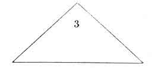
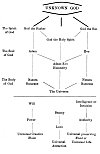
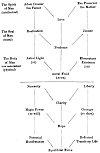
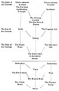
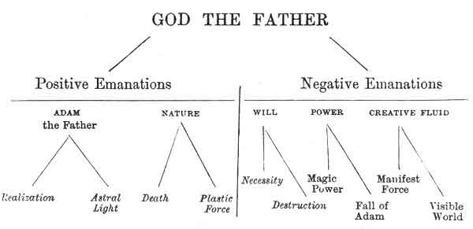
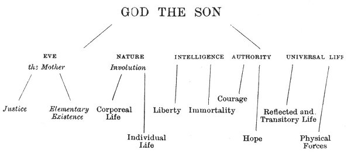
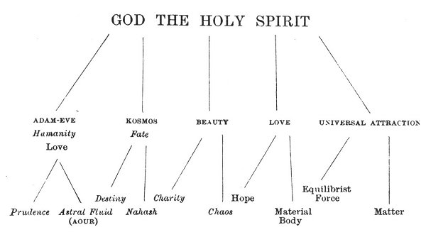

  
[Intangible Textual Heritage](../../index)  [Tarot](../index)  [Tarot
Reading](../pkt/tarot0)  [Index](index)  [Previous](tob41) 
[Next](tob43) 

------------------------------------------------------------------------

p. 193

# CHAPTER XIV.

### GENERAL SUMMARY OF THE SYMBOLICAL TAROT. THEOGONY--ANDROGONY--COSMOGONY.

Involution and Evolution. *Theogony*--The Absolute according to Wronski,
Lacuria, and the Tarot--Theogony of divers Religions identical with that
of the Tarot-Summary. *Androgony*--*Cosmogony*.

Figure containing the Symbolism of all the Major Arcana, enabling the
Signification of each Card to be defined immediately.

GENERAL SUMMARY OF THE SYMBOLISM OF THE MAJOR ARCANA.

THEOGONY--ANDROGONY--COSMOGONY.

Having completed our study of the twenty-two major arcana, considered
separately, we will now review as clearly as possible the knowledge
which may be gathered from the preceding explanations.

Woe have already established from the study of the first card, that
three primary principles are considered throughout their evolution: the
Universe, Man, and God.

We need only recall *grosso modo* the sense of each card of the Tarot to
prove the existence of a well-established progression, which starts from
*God the Holy Ghost* to end in *Matter*, while passing through a number
of varying

p. 194

modalities. Another gradation leads from Matter to God, the primitive
origin of all things.

This double current of the *progressive Materialization* of the Divine,
or INVOLUTION, and of the *Progressive Divinization* of the Material, or
EVOLUTION, has been too well studied by our eminent friend CH. BARLET,
for us intentionally to vary from him in any way; we shall therefore
quote his interesting work *in extenso*, [1](#fn_65) and thus enable the reader to see that our
conclusions are absolutely identical, although we have been led to them
by very different paths.

But our present object is to review as clearly as possible the meanings
of the major arcana of the Tarot, regarded from a synthetic point of
view. From the preceding, chapters it will be seen that this study is
really a COSMOGONY, or study of the creation of the Universe, crowned by
an ANDROGONY, or study of the creation of Man, and even by an essay on
THEOGONY, or study of the innate creation of God.

THEOGONY.

The Tarot places at the origin of all things the Absolute undetermined,
undeterminable, the ONE, both knowing and unknowing, affirmative and
negative, force and matter., unnamable, incomprehensible to man. [2](#fn_66)

The Unity manifests itself to itself by three terms, the highest and
most general terms which the human comprehension can grasp; terms which
form the basis of all theogonies, and which designate the same
principles under a multitude of varying names.

p. 195

1\. The first of these terms symbolizes *Absolute activity* in all its
acceptations, the origin of all movement, of all masculine creative
force.

GOD THE FATHER: OSIRIS--BRAHMA--JUPITER.

2\. The second of these terms symbolizes *Absolute passivity* in all its
acceptations, the origin of all repose, of all feminine preserving
force. It is the humid principle of nature, even as the first is the
igneous principle.

GOD THE SON: ISIS--VISHNU--JUNO.

The third of these terms is the most important to us. Synthetically it
blends the two preceding terms in one UNITY; all study should be
commenced by it, for no being is conceivable unless it be considered
synthetically, and the third term is the origin of all synthesis. It is
*Absolute Union* in all its acceptations, the origin of all reality, of
all equilibrium, of all equilibrist transforming force. It is the
mercurial principle in nature balancing the two first.

GOD THE HOLY GHOST: HORUS--SIVA--VULCAN.

\*  
\*    \*

It is necessary to give a few explanations before we proceed further, in
order that the deductions which follow may be intelligible to our
readers.

We have said that no being is conceivable unless it be considered
synthetically: we must now explain this sentence.

Let us take Man for our example, and follow the advice of Claude de
Saint-Martin: "We must explain nature by man, and not man by nature."

p. 196

Man, regarded synthetically, is composed of an *acting, animated body*.

If we would think of the being man as a body only, without reference to
its animation or to its faculty of acting, its *reality* immediately
disappears, it is no longer a man; we are considering but a phantom
created by our spirit, a phantom which we can *analyze*, study in all
its subdivisions, but which, since it conveys no *synthetic* idea, does
not really exist.

If in the same way we wish to imagine by itself the principle which
animates this body, which makes it live, the reality at once disappears.
It is impossible for us to separate *the life* from the idea of the
body, to conceive what this thing may be which is called the human Life,
if we wish to see in it a kind of metaphysical being. It is on this
point that materialistic savants find the most power in their arguments
against exclusively idealist thinkers.

The difficulty increases considerably if it be a question of the
principle which causes this body to act--of the Will, of the Soul.
Analysis here, as elsewhere, can be brought into use, but we cannot
possibly conceive what the soul can be like unclothed in a *form*, that
is to say, in a principle that differs from itself. We picture to
ourselves a small sphere, a winged head, in fact anything, according to
individual fancy, but never the soul considered individually.

On the other hand, the moment we say A MAN, these three terms, thus
*synthetised*, assume consistence and become the expression of a
*reality*, and a being, formed of a body, a life and a will, defines
itself quite clearly.

This synthetic action, the source of all existence and of all reality,
is the innate property of the third term in

p. 197

our Trinity of principles. This is why the study of all realities should
be commenced by this third term. Henri Wronski has always adopted this
method; he names this principle the *Neuter Element*, and places it at
the commencement of all his studies.

\*  
\*    \*

Consequently, the Trinity, composed of the three terms which we have
specified, should be considered under two aspects.

1\. We should first look at the *synthesis* of this trinity, the cause
of its reality. The third term (God the Holy Spirit) contains these
conditions in itself.

2\. We should then *analyze* this synthesis by dividing it into its
three constituent terms, and by determining the existence of the two
opposite terms, active and passive, positive and negative. We must not
forget that during this analysis we destroy the *reality* of the being
thus divided into fractions.

Every reality, of whatever kind it mar be, is therefore composed of
*three terms*, and these three terms are contained in *one sole whole*.
This truth is quite as applicable to physics as to metaphysics; the
works of Louis Lucas upon physics and chemistry, [1](#fn_67) and of Wronski in mathematics, [2](#fn_68) are an irresistible argument against those
who think that a philosophical principle is a *foolish idea*, without
any practical import.

The third term of our theogonic series, or God the Holy Ghost, therefore
represents the *whole body* of God, who can be *analyzed* in this way--

p. 198

<table data-cellspacing="0" data-border="0" data-cellpadding="9" width="798">
<colgroup>
<col style="width: 33%" />
<col style="width: 33%" />
<col style="width: 33%" />
</colgroup>
<tbody>
<tr class="odd">
<td width="33%" data-valign="TOP">
 
</td>
<td width="33%" data-valign="TOP">
GOD THE HOLY SPIRIT 
<em>Synthesis</em>  
3
</td>
<td width="33%" data-valign="TOP">
 
</td>
</tr>
<tr class="even">
<td width="33%" data-valign="TOP">
GOD THE SON 
<em>Antithesis</em>  
2
</td>
<td width="33%" data-valign="TOP">
 
</td>
<td width="33%" data-valign="TOP">
GOD THE FATHER 
<em>Thesis</em>  
1
</td>
</tr>
</tbody>
</table>

 

 

To sum up all that we have studied so far, we will say that we have
discovered, first of all--

1\. An indeterminable and unnamable principle, of which we are content
to assert the existence only--

2\. This synthetic principle, when *analyzed*, is found to consist of a
Trinity thus constituted--

<table data-cellspacing="0" data-border="0" data-cellpadding="9" width="798">
<colgroup>
<col style="width: 33%" />
<col style="width: 33%" />
<col style="width: 33%" />
</colgroup>
<tbody>
<tr class="odd">
<td width="33%" data-valign="TOP">
 
</td>
<td width="33%" data-valign="TOP"><em></em>

Neuter  
∞ 
SYNTHETIC PRINCIPLE
</td>
<td width="33%" data-valign="TOP">
 
</td>
</tr>
<tr class="even">
<td width="33%" data-valign="TOP"><em></em>

Negative  
- 
NEGATIVE PRINCIPLE 
2
</td>
<td width="33%" data-valign="TOP">
 
</td>
<td width="33%" data-valign="TOP"><em></em>

Positive  
+ 
POSITIVE PRINCIPLE 
1
</td>
</tr>
</tbody>
</table>

 

If we would use a common but very suggestive image, we should say--

The constitution of God is thus defined by the Tarot--

The Spirit of God, or *God the Father*.  
The Soul of God, or *God the Son*.  
The Body of God, or *God the Holy Spirit*. [1](#fn_69)

\*  
\*    \*

 

p. 199

We must now prove that the conclusions which we have reached through the
Tarot agree in all points with those of every author who has treated the
question on a higher level and with all the superior theogonies of
antiquity.

1\. THE PRINCIPAL AUTHORS WHO HAVE STUDIED THIS QUESTION.

We have chosen from amongst the authors who have studied this question
of first principles, two writers who, starting from different points of
view, support the conclusions of the Tarot: Lacuria and Wronski.

F. G. Lacuria.

This eminent writer, in his book on the *Harmonies of the Being
expressed by Numbers*, starts in his deductions from the three words
used by St. John: *Vita, Verbum, Lux*. He analyzes each of these words,
establishes the connection that exists between it and the Christian
Trinity, and defines each of the elements in this trinity--

"Here is the Trinity: the Father, who is *life* or immensity; the Son,
who is *word* or form. and distinction or variety; the Holy Spirit, who
is *light* and love, or unity. And these three persons are only one God.
Their unity is not only in the external fact of their existence, but in
the essence of things, *for they are inseparable in the thought of man*;
no one can imagine one without the others." (p. 43).

"In the commencement was the BEING, the being is not undetermined, but
it *is distinct* from the NON-BEING; it sees that it is the being, and
these two points of view, participating in the unity of the substance
which they affect, produce *by their Union* THE CONSCIENCE, which is
also light or harmony" (vol. ii. p. 333).

p. 200

<table data-cellspacing="0" data-border="0" data-cellpadding="9" width="798">
<colgroup>
<col style="width: 33%" />
<col style="width: 33%" />
<col style="width: 33%" />
</colgroup>
<tbody>
<tr class="odd">
<td width="33%" data-valign="TOP">
+

THE BEING 
The Father 
The Life
</td>
<td width="33%" data-valign="TOP">
 
</td>
<td width="33%" data-valign="TOP">
-

THE NON-BEING 
The Son 
The Word
</td>
</tr>
<tr class="even">
<td width="33%" data-valign="TOP">
 
</td>
<td width="33%" data-valign="TOP">
∞

THE CONSCIENCE 
The Holy Spirit 
The Light
</td>
<td width="33%" data-valign="TOP">
 
</td>
</tr>
</tbody>
</table>

 

First principles of Lacuria.

\_\_\_\_\_\_\_\_\_\_\_\_\_\_\_

Henri Wronski.

This author interests us doubly, for his conclusions not only agree with
the data given by the Tarot, but they also throw great light upon them.
Let us therefore listen to him (*Apodictique*, p. 5)--

"Thus the reality of the absolute, REALITY in itself or reality in
general, is unquestionably the first determination of the very essence
of the absolute, and consequently the *first principle* of reason.
Without it as an indispensable condition, as we have just admitted it to
be, every assertion made by reason would be valueless. And it is upon
this fundamental principle of reason, upon this indestructible and in
every way indispensable condition, that we shall now establish absolute
philosophy itself with the same infallibility.

"In the first place this reality of the absolute, which we now recognize
so profoundly, produces or creates itself; for, as we have already
irrevocably concluded, the absolute, this indispensable term of reason,
is that which is BY ITSELF. Thus this innate generation, this autogeny
of the reality of the absolute, this creation by itself, is manifestly a
*second* 

p. 201

determination of the very essence of the absolute; and the condition by
which alone this determination can take place constitutes quite as
manifestly, and in all its primitive purity, the faculty which is
designated by the name of *Wisdom* (λόγος, *das Wissen*).

"We therefore discover WISDOM as the second essential attribute of the
absolute; this primordial faculty which is the condition of all
*creation*, or rather which is the *creative faculty* itself in its
loftiest puissance, as we have now discerned it, is, if we may thus
express it, the *instrument of autogeny*, that is to say, the faculty of
the creation by itself. And consequently we discover in *Wisdom*, shown
in this highest creative power, the second *principle* of reason, quite
as infallible as the absolute itself, from which we have now deduced it.

"Moreover, in the reality of the absolute, the necessary result of its
wisdom or of its innate creation is PERMANENT STABILITY, because,
precisely through being what it is by itself, the absolute could not be
other than itself. We can therefore understand that this permanent
stability in the reality of. the absolute, which is properly its
autothesis, constitutes a *third determination* of the very essence of
the absolute, and we shall easily recognize that this stability, this
permanent unchangeableness, this *innate unalterability*, is only that
condition of the reality which we name Being (ὤν, *das Seyn*).

"Thus, we discover as the third essential attribute of the absolute,
*the Being*, the condition of stability in reality, and therefore of its
*force* or *innate unalterability*, which in the absolute constitutes
its autothesis itself. And consequently we find in the *Being*,
considered almost in its autothetic origin, the *third principle* of
reason, as infallible as the absolute itself, from which we have deduced
it.

p. 202

"We therefore already possess the three first principles of reason,
which, as we have just seen, are the three first determinations of the
very essence of the absolute. Moreover, if we notice on the one hand
that *Wisdom* and the *Being*, taking them in all their generality, are
opposed to each other, just as autogeny and autothesis--of which they
form the conditions--are opposed, or spontaneity and inertia, which form
their characters; and if on the other hand we notice that *Wisdom* and
the *Being*, these antagonistic conditions, are neutralized in all
REALITY in general, this reality--according to the deductions which we
have given--being the fundamental principle of reason, its primitive
basis, we shall understand that the three principles which we have
discovered in the determinations of the essence itself of the absolute,
are really the three *primitive principles* of the supreme Wisdom, or of
Philosophy."

<table data-cellspacing="0" data-border="0" data-cellpadding="9" width="798">
<colgroup>
<col style="width: 33%" />
<col style="width: 33%" />
<col style="width: 33%" />
</colgroup>
<tbody>
<tr class="odd">
<td width="33%" data-valign="TOP">
+ 
WISDOM 
Autogeny 
Principle of Motion
</td>
<td width="33%" data-valign="TOP">
 
</td>
<td width="33%" data-valign="TOP">
+ 
THE BEING 
Autothesis 
Principle of Stability
</td>
</tr>
<tr class="even">
<td width="33%" data-valign="TOP">
 
</td>
<td width="33%" data-valign="TOP">
∞ 
REALITY 
Principle of Existence
</td>
<td width="33%" data-valign="TOP">
 
</td>
</tr>
</tbody>
</table>

FIRST PRINCIPLES OF WRONSKI.

 

2\. THEOGONIES OF DIFFERENT RELIGIONS.

We have now shown the identity of the three first principles of the
Tarot with the philosophical discoveries of some modern authors. We need
only revert to the study of the first arcanum to see the conclusions
which Fabre d'Olivet and Claude de Saint-Martin have come to upon the
same subject; and we will now say a few

p. 203

words upon the identity of the deductions of the Tarot with the
religious ideas of various nations.

EGYPTIAN THEOGONY.

Osiris is an emanation of the Great Being; he reveals himself in three
persons--

Amen, who brings forth the hidden forms of things, is Power.

Ptah the *demi-urgus*, the eternal workman, embodying the primitive
ideas, is Wisdom.

Osiris, the author of being, the source of all life, is Goodness.

"The Egyptian god is called *Amen* when he is regarded as the hidden
force which brings all things to the light; he is *Ptah* when he
accomplishes all things with skill and truth; lastly, when he is the
good and beneficent god, he is named *Osiris*."--JAMBLIQUE

Indeterminable Principle  
RA  
*Divine Trinity*:

<table data-cellspacing="0" data-border="0" data-cellpadding="9" width="798">
<colgroup>
<col style="width: 33%" />
<col style="width: 33%" />
<col style="width: 33%" />
</colgroup>
<tbody>
<tr class="odd">
<td width="33%" data-valign="TOP">
+ 
AMEN
</td>
<td width="33%" data-valign="TOP">
 
</td>
<td width="33%" data-valign="TOP">
- 
PTAH
</td>
</tr>
<tr class="even">
<td width="33%" data-valign="TOP">
 
</td>
<td width="33%" data-valign="TOP">
∞ 
OSIRIS
</td>
<td width="33%" data-valign="TOP">
 
</td>
</tr>
</tbody>
</table>

 

p. 204

HINDU THEOGONY.  
Indeterminable Principle  
PARABRAHM:

<table data-cellspacing="0" data-border="0" data-cellpadding="9" width="798">
<colgroup>
<col style="width: 33%" />
<col style="width: 33%" />
<col style="width: 33%" />
</colgroup>
<tbody>
<tr class="odd">
<td width="33%" data-valign="TOP">
+ 
BRAHMA 
Creator
</td>
<td width="33%" data-valign="TOP">
 
</td>
<td width="33%" data-valign="TOP">
- 
VISHNU 
Preserver
</td>
</tr>
<tr class="even">
<td width="33%" data-valign="TOP">
 
</td>
<td width="33%" data-valign="TOP">
∞ 
SIVA 
Transformer
</td>
<td width="33%" data-valign="TOP">
 
</td>
</tr>
</tbody>
</table>

 

Here is an analysis of this conception applied to Cosmogony.--

PRIMITIVE, HINDU COSMOGONY, ACCORDING TO THE RIG-VEDA.

There was neither being nor no-being, nor ether, nor the roof of the
heavens; nothing enveloping nor enveloped. There was neither death nor
immortality; nothing separated the darkness of night from the light of
day.

But That One, the HE, breathed alone with HER, whose life was sustained
in his breast. Of all those who have existed since that time, no other
then existed. The darkness covered them like an ocean, which cannot be
lightened. This universe was indistinct, like the fluids mingled with
the waters; but this mass, which was covered by a crust, was at last
organized by the power of contemplation.

The first wish was formed in its intelligence, and it became the
original productive seed. This productive seed became *Providence* or
*sensitive souls*; and *Matter* or *Elements*, SHE who was supported in
his breast was the inferior part, and HE who observes was the superior
part. Who can know exactly, and who in this world can assert, from whom
or how this creation took place? The gods are posterior to this creation
of the world.

p. 205

KABBALISTIC THEOGONY.

Indeterminable Principle   
EN SOPH  
The Absolute  
*Divine Trinity*:

<table data-cellspacing="0" data-border="0" data-cellpadding="9" width="798">
<colgroup>
<col style="width: 33%" />
<col style="width: 33%" />
<col style="width: 33%" />
</colgroup>
<tbody>
<tr class="odd">
<td width="33%" data-valign="TOP">
+ 
CHOCMAH 
<em>Absolute Wisdom</em> 
</td>
<td width="33%" data-valign="TOP">
 
</td>
<td width="33%" data-valign="TOP">
- 
BINAH 
<em>Absolute Intelligence</em> 
</td>
</tr>
<tr class="even">
<td width="33%" data-valign="TOP">
 
</td>
<td width="33%" data-valign="TOP">
∞ 
KETHER 
Absolute Equilibrist Power
</td>
<td width="33%" data-valign="TOP">
 
</td>
</tr>
</tbody>
</table>

 

We might carry these comparisons much further; but it is useless to
prolong our studies unreasonably. The curious reader can refer to the
works on the ancient theogonies, [1](#fn_70) and
see the universal harmony that exists in the primitive principles of all
religions.

It will be sufficient if we determine the universality of the three
first principles, which we name, like the Christians, in order to be
clearly understood--

<table data-cellspacing="0" data-border="0" data-cellpadding="9" width="798">
<colgroup>
<col style="width: 33%" />
<col style="width: 33%" />
<col style="width: 33%" />
</colgroup>
<tbody>
<tr class="odd">
<td width="33%" data-valign="TOP">
+ 
GOD THE FATHER
</td>
<td width="33%" data-valign="TOP">
 
</td>
<td width="33%" data-valign="TOP">
- 
GOD THE SON
</td>
</tr>
<tr class="even">
<td width="33%" data-valign="TOP">
 
</td>
<td width="33%" data-valign="TOP">
∞ 
GOD THE HOLY SPIRIT
</td>
<td width="33%" data-valign="TOP">
 
</td>
</tr>
</tbody>
</table>

 

These principles once defined, we shall see them in action throughout
creation.

The first principle had manifested its existence to itself in the second
principle named by Christians:

p. 206

the Son. Lastly, these two principles had embodied themselves in the
third, which gave them substance. This is why we have named the Holy
Spirit the body of God.

Now the same law of creation acting in the affinities of the first
principle with the second, will manifest itself in the action of the
first ternary upon itself, to give birth to the following Trinity:--

God the Father, the principle of *Will*, is entirely self-reflected in
the rough ADAM, the principle *of Power*; *God the Son*, the principle
of *Intelligence*, is self-reflected in the gentle EVE, the principle of
*Authority*. Lastly, God as a whole, or God the Holy Spirit, clothed
these two mystical unities in a body, and made a reality of them in the
balanced creation of Adam-Eve, or of HUMANITY.

Humanity, the image of *Love*, also contains in itself a rough,
astringent principle (see Jacob Boëhm [1](#fn_71)), and a gentle, insinuating principle
(Jacob Boëhm). The first of these principles, symbolized by Adam, is the
origin of brute Force, of Power in all its manifestations. The second,
symbolized by Eye, is the origin of feminine Grace, of Authority. We
have seen that Power and Authority find their equilibrium in Love.

Each man, a reflected molecule of humanity made in its image, contains
in himself an Adam, the source of the Will--that is the Brain; an Eve,
source of the intelligence--the heart; and he should balance the heart
by the brain, and the brain by the heart, to become a centre of divine
love.

It is the same with man and woman, represented by Adam and Eve (הוה Eve,
the life).

p. 207

But just as the Father and the Son have become realities in the Holy
Spirit, as Adam and Eve are embodied in Humanity, so the third ternary
will take rise in the reciprocal action of the other two.

NATURA NATURANS, or creating, will take her birth under the action and
the reciprocal reaction of God the Father and of Adam, the two active
and passive creative principles. Thus also appears the *Universal
creative Fluid*, balancing and realizing in itself both will and power.

From this again will be born NATURA NATURATA, or preserving, realizing
the union of God the Son and of Eve, at the same time that the
*Universal preserving Fluid*, or *Universal Life*, will appear,
balancing and realizing the Intelligence and Authority which define its
innate qualities.

Lastly, the Holy Spirit and Humanity, the divine and the human bodies,
unite and manifest themselves eternally in the LIVING UNIVERSE, the
source of *Universal Attraction*.

For even as the Holy Spirit was the body of God, the Son his soul, and
the Father his Spirit, even as Humanity was the body of Adam, Eve his
life or soul, and Adam his Spirit; so also--

The Universe is the body of God;  
Humanity is the soul of God;  
God Himself is the Spirit of God.

From this we recognize the truth of the opinion of the Pantheists, who
declared that God was the Universe; but we also see their error, when
they refuse to acknowledge in him any innate consciousness. For as the
consciousness of man is independent of the millions of cells which
compose his body, so the consciousness of God is independent of the
molecules of the Universe and of man which form its body and its soul.
We might partly destroy the

p. 208

\[paragraph continues\] Universe without in any way diminishing the
Divine Personality, even as the four limbs can be cut off a man without
his losing the consciousness of the integrity of his personality. This
is why the conclusions of Schopenhauer and Hartmann are partly
erroneous.

Before leaving this study, we must once more express our admiration for
this wonderful book, this symbolical Tarot, which thus defines God--

God is the Absolute, the essence of which is impenetrable, formed of the
Universe as body, of Humanity as soul, and of himself as Spirit.

p. 209

 

THEOGONY.  
 [  
Click to enlarge](img/20900.jpg)

 

p. 210

ANDROGONY.

Each man contains in himself an *Adam*, source of the Will, *i.e.* the
Brain; an *Eve*, source of the Intelligence, [1](#fn_72) *i.e.* the Heart, and he should balance
the heart by the brain, and the brain by the heart, if he would become a
centre of divine love.

In Humanity, the passive Realistic principle of God Himself, the Father
and the Divine Son, are represented by Man.

Man accomplishing the functions of God the creator is the FATHER; the
woman accomplishing the work of God the preserver is the MOTHER; lastly,
HUMAN LOVE realizes the whole Divinity in Humanity.

The human family is therefore the representation of the Divinity upon
earth. The Tarot also teaches us this fact by its minor arcana (king or
father, queen or mother, knight or young man, knave or child); and it
was so thoroughly understood by ancient science, that the whole social
organization was based upon the *family*, instead of upon the
*individual*, as it is in modern times. [2](#fn_73) That the social organization of China has
been maintained for so many centuries, is solely due to the principle of
basing everything upon the family. [3](#fn_74)

The characteristics of the human Ternary are: Adam, Necessity, the image
and reflection of Will and Power; Eve, Liberty, the image and reflection
of Intelligence and Authority; and Adam and Eve, Charity, the image

p. 211

and reflection of Love and Beauty given by the constituent terms.

REALIZATION and JUSTICE, balanced by PRUDENCE, indicate the moral
constitution of Man, whilst the POSITIVE ASTRAL LIGHT (or OD), the
NEGATIVE ASTRAL LIGHT (or OB), and the EQUILIBRATE ASTRAL FLUID (or
AOUR), demonstrate the origin of his physical constitution.

Magic Power, *Courage*, and *Hope* manifest the moral qualities of man,
whilst *Force potential in its manifestation, reflected Life*, and
*Force* balancing the two preceding qualities, indicate the influence of
the Universe in him.

Thus, the law which governs all these manifestations of God in the
series of his creations is *Emanation*.

From the unique but fathomless centre emanates, in the first place, a
Trinity of absolute principles which serves as a model for all the
posterior emanations of the Being principle itself. Each element of this
Trinity manifests itself in two great principles, of which it is the
source: from the first principle, or the Father, emanate successively
Adam and Nature creating, *naturans*, according, to Spinoza; from the
second principle, or the Son, emanate Eve and Nature *naturata*, or
recipient; lastly, the third principle, or the Holy Spirit, serves as a
model to the similar constitution of Adam-Eve, or Humanity and the
Universe.

In this way also the *Ternary*, emanated from the mysterious Unity, soon
constitutes a *Septenary* formed by the various emanations of these
three Principles, like the *seven colours* of the scale of light formed
by the combination of *three simple colours*, themselves emanated from
one *single light*; or like the *seven notes* of the musical scale,
formed by the fundamental *trinity* of sounds.

The Septenary formed of "two Ternaries in the midst of

p. 212

which the Unity upholds itself," [1](#fn_75) is
therefore the expression of a being completely constituted. This is now
confirmed by the recent data given by Hindu Theosophy upon the *seven
principles of Man*, and upon the *seven principles of the
Universe*. [2](#fn_76)

We could apply the Tarot to the explanation of these data; but we feel
sure that it will soon be done, and we consider it useless to lengthen
our work too much.

We will therefore conclude our study upon man by pointing out his
constitution as given by the Tarot, which teaches that his body comes
from the Universe, his soul from the Astral plane, whilst his Spirit is
a direct emanation from God. [3](#fn_77)

p. 213

ANDROGONY.  
 [  
Click to enlarge](img/21300.jpg)

p. 214

COSMOGONY.

As we descend the ladder of the emanations of the Absolute Being, the
principles become more material and less metaphysical. The Tarot teaches
us that the Universe results from the participation of the Human in the
creative actions of the Divine, a profound mystery, which can throw much
light upon the theological theories of the Fall. Jacob Boëhm, the
sublime visionary shoe maker, and Claude de Saint-Martin, his admirer
and disciple, give upon this subject some explanations which may be
easily understood with the Tarot, and to which we refer curious
inquirers.

God manifests himself in the Universe by his third trinitarian
manifestation: *Natura naturans*, realized in the UNIVERSAL TRANSFORMING
PRINCIPLE, *Natura naturata*, in INVOLUTION; and lastly in the
mysterious cyclic force which we have analyzed, in reference to the 15th
arcanum, and which we name the FATAL FORCE OF DESTINY. This is the God
adored by materialist science, and we see that unconsciously its homage
is offered to the Divinity itself under its most material form, even
whilst it foolishly boasts of Atheism.

DEATH, CORPOREAL LIFE, and the DESTINY which rules their mutual
connection, constitute the preserving principles of the Universe;
lastly, PLASTIC FORCE, INDIVIDUAL LIFE, and the ASTRAL LIGHT IN
CIRCULATION, show us the means of Transformation and of Realization used
by the Cosmos.

But these are abstract principles; if we wish to see them in action we
must consider the following ternary. The *Universal Transforming
Principle* marks its existence

p. 215

by the DESTRUCTION of beings and of things; but the *Opposing
Principle*, *Involution*, at once IMMORTALIZES Destruction by the influx
of new divine currents into CHAOS.

Adam materialized his nature by the FALL of his spirit into matter, the
source of *Death*; but the *Corporeal Life*, the source of HOPE, arises
and provides the means of redeeming the fault, by suffering in the
MATERIAL BODY.

Lastly MATTER itself appears, the final term of involution, after which
recommences the grand Evolution towards the primitive centre.

It is unnecessary to say that we only wished to give a rapid sketch of
the evidence of the Tarot upon Theogony, Androgony, and Cosmogony,
without entering into detail. In fact these are very serious questions,
which require whole volumes to themselves, and we had not the least
intention of discussing them in a few pages.

p. 216

 

COSMOGONY.  
 [  
Click to enlarge](img/21600.jpg)

 

p. 217

Let us now recapitulate a little, so that we may definitely end the
involution of the three grand principles:

From GOD THE FATHER have emanated successively--

<table data-cellspacing="0" data-border="0" data-cellpadding="9" width="610">
<colgroup>
<col style="width: 50%" />
<col style="width: 50%" />
</colgroup>
<tbody>
<tr class="odd">
<td width="50%" data-valign="TOP">
<em>Adam</em> 
</td>
<td width="50%" data-valign="TOP"><em></em>

Will 
</td>
</tr>
<tr class="even">
<td width="50%" data-valign="TOP"><em></em>

Natura Naturans 
</td>
<td width="50%" data-valign="TOP"><em></em>

Power 
</td>
</tr>
<tr class="odd">
<td width="50%" data-valign="TOP">
Then their form
</td>
<td width="50%" data-valign="TOP"><em></em>

The Universal Creative Fluid.
</td>
</tr>
</tbody>
</table>

 

Adam realized in the *Father* has produced *Realization* and the *Astral
Light*; whilst the Will was realized in *Necessity*, Supreme Power is
shown in *Magic Power*, and the universal creative Fluid in *Force
Potential in its Manifestation*.

Natura naturans realized in the *Universal Transforming Principle* has
produced *Death*, and the *Universal Plastic Force*, with their forms,
*Destruction*, the *Fall of Adam*, and the visible world.

These are all the principles that have successively emanated from the
*Father*, and which represent him. We have reproduced them in a
tableau--

 

 

 

The two following figures arranged upon the same plan as this one, give
the emanations of the two other principles of the first ternary.

p. 218

 

 

 

 

In our Introduction to the study of symbolism we have given a numbered
figure which enables us to determine immediately the meaning of any card
in the Tarot.

If we now apply all that we have said upon the symbolism of each of our
cards to this subject, we can condense the whole *symbolism of the major
arcana in one figure*.

The new tableau thus formed will give us the sense of all our
principles, whatever their number may be, and this is how we obtain this
meaning--

p. 219

USE OF THE TABLEAU.

1\. Seek in the *horizontal* column, to the left of the principle under
consideration, the sense written there.

2\. Having ascertained this meaning, return to your principle and search
in the *vertical column* at the bottom the great principle (God, Man, or
the Universe) which is written there.

3\. Combine the meaning first obtained with the name placed in the
vertical column, adding to it the word (itself or manifest) written in
the vertical column which contains the principle of which you are
seeking the meaning.

An example will explain this better.

Let us ascertain the meaning of the MOTHER-- The first term of the 8th
arcanum.

1\. I look in the *horizontal* column containing the word MOTHER and I
find at the end, to the left, the *following meaning*--

Active preserving Principle.

The Mother is the Active preserving Principle. Of what?

2\. In order to know, I seek in the *vertical* column containing the
word *Mother*, and at the bottom I find Man or Humanity.

The Mother is the Active preserving Principle of Humanity.

3\. I add to the word Humanity the word placed in the small vertical
column which contains the word Mother. This word is *Himself* if
relating to man, or *itself* if we take the sense of Humanity. We should
say--

The Mother is the Active preserving Principle of Man himself or of
Humanity itself.

This example clearly indicates how this tableau should be used.

p. 220 p. 221

TABLEAU

Recapitulating the Symbolism of all the Major Arcana, enabling the
definition of any one of these Arcana to be immediately determined.
(*See its use on page* [219](#page_219).)

<table data-border="" data-cellspacing="1" data-cellpadding="8" width="779">
<colgroup>
<col style="width: 12%" />
<col style="width: 12%" />
<col style="width: 12%" />
<col style="width: 12%" />
<col style="width: 12%" />
<col style="width: 12%" />
<col style="width: 12%" />
<col style="width: 12%" />
</colgroup>
<tbody>
<tr class="odd">
<td width="20%" data-valign="TOP">
CREATIVE PRINCIPLE 
(י) Active י
</td>
<td width="11%" data-valign="TOP">
1

God the Father
</td>
<td width="11%" data-valign="TOP">
4

Will
</td>
<td width="11%" data-valign="TOP">
7

The Father
</td>
<td width="11%" data-valign="TOP">
10

Necessity
</td>
<td width="11%" data-valign="TOP">
13

Universal transforming principle
</td>
<td width="11%" data-valign="TOP">
16

Destruction
</td>
<td width="11%" data-valign="TOP">
19

The Elements
</td>
</tr>
<tr class="even">
<td width="20%" data-valign="TOP">
CREATIVE PRINCIPLE 
Passive ה
</td>
<td width="11%" data-valign="TOP">
Adam
</td>
<td width="11%" data-valign="TOP">
Power
</td>
<td width="11%" data-valign="TOP">
Realization
</td>
<td width="11%" data-valign="TOP">
Magic Power
</td>
<td width="11%" data-valign="TOP">
Death
</td>
<td width="11%" data-valign="TOP">
The Fall of Adam
</td>
<td width="11%" data-valign="TOP">
Nutrition
</td>
</tr>
<tr class="odd">
<td width="20%" data-valign="TOP">
CREATIVE PRINCIPLE 
Equilibrist ו
</td>
<td width="11%" data-valign="TOP">
Natura naturata
</td>
<td width="11%" data-valign="TOP">
Universal Creative Fluid
</td>
<td width="11%" data-valign="TOP">
Astral Light
</td>
<td width="11%" data-valign="TOP">
Force potential in its manifestation
</td>
<td width="11%" data-valign="TOP">
Universal Plastic Force
</td>
<td width="11%" data-valign="TOP">
The Visible World
</td>
<td width="11%" data-valign="TOP">
The Mineral Kingdom
</td>
</tr>
<tr class="even">
<td width="20%" data-valign="TOP" data-bgcolor="#000000">
 
</td>
<td width="11%" data-valign="TOP" data-bgcolor="#000000">
 
</td>
<td width="11%" data-valign="TOP" data-bgcolor="#000000">
 
</td>
<td width="11%" data-valign="TOP" data-bgcolor="#000000">
 
</td>
<td width="11%" data-valign="TOP" data-bgcolor="#000000">
 
</td>
<td width="11%" data-valign="TOP" data-bgcolor="#000000">
 
</td>
<td width="11%" data-valign="TOP" data-bgcolor="#000000">
 
</td>
<td width="11%" data-valign="TOP" data-bgcolor="#000000">
 
</td>
</tr>
<tr class="odd">
<td width="20%" data-valign="TOP">
PRESERVING PRINCIPLE 
(ה) Active י
</td>
<td width="11%" data-valign="TOP">
2

God the Son
</td>
<td width="11%" data-valign="TOP">
5

Intelligence
</td>
<td width="11%" data-valign="TOP">
8

The Mother
</td>
<td width="11%" data-valign="TOP">
11

Liberty
</td>
<td width="11%" data-valign="TOP">
14

Involution
</td>
<td width="11%" data-valign="TOP">
17

Immortality
</td>
<td width="11%" data-valign="TOP">
20

Innate Motion
</td>
</tr>
<tr class="even">
<td width="20%" data-valign="TOP">
PRESERVING PRINCIPLE 
Passive (ה)
</td>
<td width="11%" data-valign="TOP">
Eve
</td>
<td width="11%" data-valign="TOP">
Authority
</td>
<td width="11%" data-valign="TOP">
Justice
</td>
<td width="11%" data-valign="TOP">
Courage (TO DARE)
</td>
<td width="11%" data-valign="TOP">
Corporeal Life
</td>
<td width="11%" data-valign="TOP">
Hope
</td>
<td width="11%" data-valign="TOP">
Respiration
</td>
</tr>
<tr class="odd">
<td width="20%" data-valign="TOP">
PRESERVING PRINCIPLE 
Equilibrist ו
</td>
<td width="11%" data-valign="TOP">
Natura naturata
</td>
<td width="11%" data-valign="TOP">
Universal Life
</td>
<td width="11%" data-valign="TOP">
Elementary Existence
</td>
<td width="11%" data-valign="TOP">
Reflected and transitory Life
</td>
<td width="11%" data-valign="TOP">
Individual Life
</td>
<td width="11%" data-valign="TOP">
The Physical Forces
</td>
<td width="11%" data-valign="TOP">
The Vegetable Kingdom
</td>
</tr>
<tr class="even">
<td width="20%" data-valign="TOP" data-bgcolor="#000000">
 
</td>
<td width="11%" data-valign="TOP" data-bgcolor="#000000">
 
</td>
<td width="11%" data-valign="TOP" data-bgcolor="#000000">
 
</td>
<td width="11%" data-valign="TOP" data-bgcolor="#000000">
 
</td>
<td width="11%" data-valign="TOP" data-bgcolor="#000000">
 
</td>
<td width="11%" data-valign="TOP" data-bgcolor="#000000">
 
</td>
<td width="11%" data-valign="TOP" data-bgcolor="#000000">
 
</td>
<td width="11%" data-valign="TOP" data-bgcolor="#000000">
 
</td>
</tr>
<tr class="odd">
<td width="20%" data-valign="TOP">
PRESERVING PRINCIPLE 
(ה) Active י
</td>
<td width="11%" data-valign="TOP">
3

God the Holy Sprit
</td>
<td width="11%" data-valign="TOP">
6

Beauty
</td>
<td width="11%" data-valign="TOP">
9

Love
</td>
<td width="11%" data-valign="TOP">
12

Charity
</td>
<td width="11%" data-valign="TOP">
15

Fate
</td>
<td width="11%" data-valign="TOP">
18

Chaos
</td>
<td width="11%" data-valign="TOP">
0

The Motion of Relative Duration
</td>
</tr>
<tr class="even">
<td width="20%" data-valign="TOP">
PRESERVING PRINCIPLE 
Passive (ה)
</td>
<td width="11%" data-valign="TOP">
Adam-Eve, Humanity
</td>
<td width="11%" data-valign="TOP">
Love
</td>
<td width="11%" data-valign="TOP">
Prudence (be silent)
</td>
<td width="11%" data-valign="TOP">
Hope (WISDOM)
</td>
<td width="11%" data-valign="TOP">
Destiny
</td>
<td width="11%" data-valign="TOP">
The Material Body
</td>
<td width="11%" data-valign="TOP">
Innervation
</td>
</tr>
<tr class="odd">
<td width="20%" data-valign="TOP">
PRESERVING PRINCIPLE 
Equilibrist ו
</td>
<td width="11%" data-valign="TOP">
Kosmos
</td>
<td width="11%" data-valign="TOP">
Universal Attraction
</td>
<td width="11%" data-valign="TOP">
Astral Fluid (AOUR)
</td>
<td width="11%" data-valign="TOP">
Equilibrist Force
</td>
<td width="11%" data-valign="TOP">
Nahash Astral Light in circulation
</td>
<td width="11%" data-valign="TOP">
Matter
</td>
<td width="11%" data-valign="TOP">
The Animal Kingdom
</td>
</tr>
<tr class="even">
<td width="20%" data-valign="TOP">
 
</td>
<td width="11%" data-valign="TOP">
Himself (י)
</td>
<td width="11%" data-valign="TOP">
Manifested
</td>
<td width="11%" data-valign="TOP">
Himself (ה)
</td>
<td width="11%" data-valign="TOP">
Manifested
</td>
<td width="11%" data-valign="TOP">
Itself (ו)
</td>
<td width="11%" data-valign="TOP">
Manifested
</td>
<td width="11%" data-valign="TOP">
Return (ה) to the Unity
</td>
</tr>
<tr class="odd">
<td width="20%" data-valign="TOP">
 
</td>
<td width="11%" data-valign="TOP">
+
</td>
<td width="11%" data-valign="TOP">
-
</td>
<td width="11%" data-valign="TOP">
+
</td>
<td width="11%" data-valign="TOP">
-
</td>
<td width="11%" data-valign="TOP">
+
</td>
<td width="11%" data-valign="TOP">
-
</td>
<td width="11%" data-valign="TOP">
 
</td>
</tr>
<tr class="even">
<td width="20%" data-valign="TOP">
 
</td>
<td width="11%" data-valign="TOP">
GOD
</td>
<td width="11%" data-valign="TOP">
(21)
</td>
<td width="11%" data-valign="TOP">
MAN 
HUMANITY
</td>
<td width="11%" data-valign="TOP">
(21)
</td>
<td width="11%" data-valign="TOP">
UNIVERSE
</td>
<td width="11%" data-valign="TOP">
(21)
</td>
<td width="11%" data-valign="TOP">
 
</td>
</tr>
</tbody>
</table>

 

p. 222

Tableau indicating the revolutions yod-he-vau-he *in numbers* (*positive
arcana*): (*yod* = 1, *he* = 2, *vau* = 3, 2*nd he* = 4).

(Key to the preceding Tableau.)

<table data-border="" data-cellspacing="1" data-cellpadding="8" width="779">
<colgroup>
<col style="width: 11%" />
<col style="width: 11%" />
<col style="width: 11%" />
<col style="width: 11%" />
<col style="width: 11%" />
<col style="width: 11%" />
<col style="width: 11%" />
<col style="width: 11%" />
<col style="width: 11%" />
</colgroup>
<tbody>
<tr class="odd">
<td width="11%" data-valign="MIDDLE">
 
</td>
<td width="11%" data-valign="MIDDLE">
1
</td>
<td width="11%" data-valign="MIDDLE">
 
</td>
<td width="11%" data-valign="MIDDLE">
2
</td>
<td width="11%" data-valign="MIDDLE">
 
</td>
<td width="11%" data-valign="MIDDLE">
3
</td>
<td width="11%" data-valign="MIDDLE">
 
</td>
<td width="11%" data-valign="MIDDLE">
4
</td>
<td width="11%" data-valign="MIDDLE">
 
</td>
</tr>
<tr class="even">
<td width="11%" data-valign="MIDDLE" data-bgcolor="#000000">
 
</td>
<td width="11%" data-valign="MIDDLE" data-bgcolor="#000000">
 
</td>
<td width="11%" data-valign="MIDDLE" data-bgcolor="#000000">
 
</td>
<td width="11%" data-valign="MIDDLE" data-bgcolor="#000000">
 
</td>
<td width="11%" data-valign="MIDDLE" data-bgcolor="#000000">
 
</td>
<td width="11%" data-valign="MIDDLE" data-bgcolor="#000000">
 
</td>
<td width="11%" data-valign="MIDDLE" data-bgcolor="#000000">
 
</td>
<td width="11%" data-valign="MIDDLE" data-bgcolor="#000000">
 
</td>
<td width="11%" data-valign="MIDDLE" data-bgcolor="#000000">
 
</td>
</tr>
<tr class="odd">
<td rowspan="4" width="11%" data-valign="MIDDLE">
I. 1
</td>
<td width="11%" data-valign="MIDDLE">
1
</td>
<td rowspan="4" width="11%" data-valign="MIDDLE">
of 1

in VII.

1
</td>
<td width="11%" data-valign="MIDDLE">
2
</td>
<td rowspan="4" width="11%" data-valign="MIDDLE">
of 1

in XIII.

2
</td>
<td width="11%" data-valign="MIDDLE">
3
</td>
<td rowspan="4" width="11%" data-valign="MIDDLE">
of 1

in XIX.

3
</td>
<td width="11%" data-valign="MIDDLE">
4
</td>
<td rowspan="4" width="11%" data-valign="MIDDLE">
of 1

in

4
</td>
</tr>
<tr class="even">
<td width="11%" data-valign="MIDDLE">
2
</td>
<td width="11%" data-valign="MIDDLE">
3
</td>
<td width="11%" data-valign="MIDDLE">
4
</td>
<td width="11%" data-valign="MIDDLE">
1
</td>
</tr>
<tr class="odd">
<td width="11%" data-valign="MIDDLE">
3
</td>
<td width="11%" data-valign="MIDDLE">
4
</td>
<td width="11%" data-valign="MIDDLE">
1
</td>
<td width="11%" data-valign="MIDDLE">
2
</td>
</tr>
<tr class="even">
<td width="11%" data-valign="MIDDLE">
4
</td>
<td width="11%" data-valign="MIDDLE">
1
</td>
<td width="11%" data-valign="MIDDLE">
2
</td>
<td width="11%" data-valign="MIDDLE">
3
</td>
</tr>
<tr class="odd">
<td width="11%" data-valign="MIDDLE" data-bgcolor="#000000">
 
</td>
<td width="11%" data-valign="MIDDLE" data-bgcolor="#000000">
 
</td>
<td width="11%" data-valign="MIDDLE" data-bgcolor="#000000">
 
</td>
<td width="11%" data-valign="MIDDLE" data-bgcolor="#000000">
 
</td>
<td width="11%" data-valign="MIDDLE" data-bgcolor="#000000">
 
</td>
<td width="11%" data-valign="MIDDLE" data-bgcolor="#000000">
 
</td>
<td width="11%" data-valign="MIDDLE" data-bgcolor="#000000">
 
</td>
<td width="11%" data-valign="MIDDLE" data-bgcolor="#000000">
 
</td>
<td width="11%" data-valign="MIDDLE" data-bgcolor="#000000">
 
</td>
</tr>
<tr class="even">
<td rowspan="4" width="11%" data-valign="MIDDLE">
II. 2
</td>
<td width="11%" data-valign="MIDDLE">
1
</td>
<td rowspan="4" width="11%" data-valign="MIDDLE">
of 2

in VIII.

1
</td>
<td width="11%" data-valign="MIDDLE">
2
</td>
<td rowspan="4" width="11%" data-valign="MIDDLE">
of 2

in XIV.

2
</td>
<td width="11%" data-valign="MIDDLE">
3
</td>
<td rowspan="4" width="11%" data-valign="MIDDLE">
of 2

in XX.

3
</td>
<td width="11%" data-valign="MIDDLE">
4
</td>
<td rowspan="4" width="11%" data-valign="MIDDLE">
of 2

in

4
</td>
</tr>
<tr class="odd">
<td width="11%" data-valign="MIDDLE">
2
</td>
<td width="11%" data-valign="MIDDLE">
3
</td>
<td width="11%" data-valign="MIDDLE">
4
</td>
<td width="11%" data-valign="MIDDLE">
1
</td>
</tr>
<tr class="even">
<td width="11%" data-valign="MIDDLE">
3
</td>
<td width="11%" data-valign="MIDDLE">
4
</td>
<td width="11%" data-valign="MIDDLE">
1
</td>
<td width="11%" data-valign="MIDDLE">
2
</td>
</tr>
<tr class="odd">
<td width="11%" data-valign="MIDDLE">
4
</td>
<td width="11%" data-valign="MIDDLE">
1
</td>
<td width="11%" data-valign="MIDDLE">
2
</td>
<td width="11%" data-valign="MIDDLE">
3
</td>
</tr>
<tr class="even">
<td width="11%" data-valign="MIDDLE" data-bgcolor="#000000">
 
</td>
<td width="11%" data-valign="MIDDLE" data-bgcolor="#000000">
 
</td>
<td width="11%" data-valign="MIDDLE" data-bgcolor="#000000">
 
</td>
<td width="11%" data-valign="MIDDLE" data-bgcolor="#000000">
 
</td>
<td width="11%" data-valign="MIDDLE" data-bgcolor="#000000">
 
</td>
<td width="11%" data-valign="MIDDLE" data-bgcolor="#000000">
 
</td>
<td width="11%" data-valign="MIDDLE" data-bgcolor="#000000">
 
</td>
<td width="11%" data-valign="MIDDLE" data-bgcolor="#000000">
 
</td>
<td width="11%" data-valign="MIDDLE" data-bgcolor="#000000">
 
</td>
</tr>
<tr class="odd">
<td rowspan="4" width="11%" data-valign="MIDDLE">
III. 3
</td>
<td width="11%" data-valign="MIDDLE">
1
</td>
<td rowspan="4" width="11%" data-valign="MIDDLE">
of 3

in IX.

1
</td>
<td width="11%" data-valign="MIDDLE">
2
</td>
<td rowspan="4" width="11%" data-valign="MIDDLE">
of 3

in XV.

2
</td>
<td width="11%" data-valign="MIDDLE">
3
</td>
<td rowspan="4" width="11%" data-valign="MIDDLE">
of 3

in XXI.

3
</td>
<td width="11%" data-valign="MIDDLE">
4
</td>
<td rowspan="4" width="11%" data-valign="MIDDLE">
of 3

in

4
</td>
</tr>
<tr class="even">
<td width="11%" data-valign="MIDDLE">
2
</td>
<td width="11%" data-valign="MIDDLE">
3
</td>
<td width="11%" data-valign="MIDDLE">
4
</td>
<td width="11%" data-valign="MIDDLE">
1
</td>
</tr>
<tr class="odd">
<td width="11%" data-valign="MIDDLE">
3
</td>
<td width="11%" data-valign="MIDDLE">
4
</td>
<td width="11%" data-valign="MIDDLE">
1
</td>
<td width="11%" data-valign="MIDDLE">
2
</td>
</tr>
<tr class="even">
<td width="11%" data-valign="MIDDLE">
4
</td>
<td width="11%" data-valign="MIDDLE">
1
</td>
<td width="11%" data-valign="MIDDLE">
2
</td>
<td width="11%" data-valign="MIDDLE">
3
</td>
</tr>
<tr class="odd">
<td width="11%" data-valign="MIDDLE" data-bgcolor="#000000">
 
</td>
<td width="11%" data-valign="MIDDLE" data-bgcolor="#000000">
 
</td>
<td width="11%" data-valign="MIDDLE" data-bgcolor="#000000">
 
</td>
<td width="11%" data-valign="MIDDLE" data-bgcolor="#000000">
 
</td>
<td width="11%" data-valign="MIDDLE" data-bgcolor="#000000">
 
</td>
<td width="11%" data-valign="MIDDLE" data-bgcolor="#000000">
 
</td>
<td width="11%" data-valign="MIDDLE" data-bgcolor="#000000">
 
</td>
<td width="11%" data-valign="MIDDLE" data-bgcolor="#000000">
 
</td>
<td width="11%" data-valign="MIDDLE" data-bgcolor="#000000">
 
</td>
</tr>
<tr class="even">
<td rowspan="4" width="11%" data-valign="MIDDLE">
IV. 4
</td>
<td width="11%" data-valign="MIDDLE">
1
</td>
<td rowspan="4" width="11%" data-valign="MIDDLE">
of 4

in X.

1
</td>
<td width="11%" data-valign="MIDDLE">
2
</td>
<td rowspan="4" width="11%" data-valign="MIDDLE">
of 4

in XVI.

2
</td>
<td width="11%" data-valign="MIDDLE">
3
</td>
<td rowspan="4" width="11%" data-valign="MIDDLE">
of 4

in XXII.

3
</td>
<td width="11%" data-valign="MIDDLE">
4
</td>
<td rowspan="4" width="11%" data-valign="MIDDLE">
of 4

in

4
</td>
</tr>
<tr class="odd">
<td width="11%" data-valign="MIDDLE">
2
</td>
<td width="11%" data-valign="MIDDLE">
3
</td>
<td width="11%" data-valign="MIDDLE">
4
</td>
<td width="11%" data-valign="MIDDLE">
1
</td>
</tr>
<tr class="even">
<td width="11%" data-valign="MIDDLE">
3
</td>
<td width="11%" data-valign="MIDDLE">
4
</td>
<td width="11%" data-valign="MIDDLE">
1
</td>
<td width="11%" data-valign="MIDDLE">
2
</td>
</tr>
<tr class="odd">
<td width="11%" data-valign="MIDDLE">
4
</td>
<td width="11%" data-valign="MIDDLE">
1
</td>
<td width="11%" data-valign="MIDDLE">
2
</td>
<td width="11%" data-valign="MIDDLE">
3
</td>
</tr>
</tbody>
</table>

 

------------------------------------------------------------------------

### Footnotes

[194:1](tob42.htm#fr_65) See [p.
253](tob45.htm#page_253).

[194:2](tob42.htm#fr_66) Ch. Barlet,
*Initiation*, p. 10,

[197:1](tob42.htm#fr_67) Louis Lucas, *La Chimie
Nouvelle*, Paris, 1854. 18mo.

[197:2](tob42.htm#fr_68) Wronski, *Messianisme*,
1825, fol.; and above all *Apodictique Messianique*, 1876, fol.

[198:1](tob42.htm#fr_69) Spirit is here taken in
the sense of the superior and creative principle: soul in the sense of
median and animator. Since many writers use these words in a different
sense, it is useful to explain what is our meaning in this case.

[205:1](tob42.htm#fr_70) See particularly P.
Renand, *Nouvelle Symbolique*, Paris, 1877. 8vo.

[206:1](tob42.htm#fr_71) Jacob Boëhm, *The Three
Principles*.

[210:1](tob42.htm#fr_72) Intelligence is here
taken in the sense of *Intuition*, and not in the sense usually
attributed to it by the Philosophy of the Universities.

[210:2](tob42.htm#fr_73) See Saint-Yves
d'Alveydre, *Mission des Juifs*, 1884.

[210:3](tob42.htm#fr_74) See Simon, *La Cité
Chinoise*, 1886. 8vo.

[212:1](tob42.htm#fr_75) *Sepher Yetzirah*
(trans. Papus), chap. vi.

[212:2](tob42.htm#fr_76) See Sinnet, *Esoteric
Buddhism*; H. P. Blavatsky, *Secret Doctrine*; and all the publications
of the Theosophical Society.

[212:3](tob42.htm#fr_77) See for further
developments the works of Paracelsus and Van Helmont.

------------------------------------------------------------------------

[Next: Chapter XV. General Key to the Applications of the Tarot](tob43)
