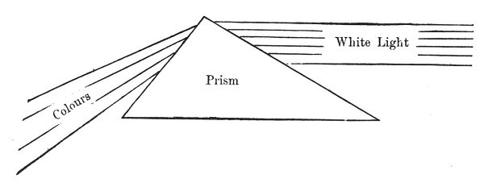
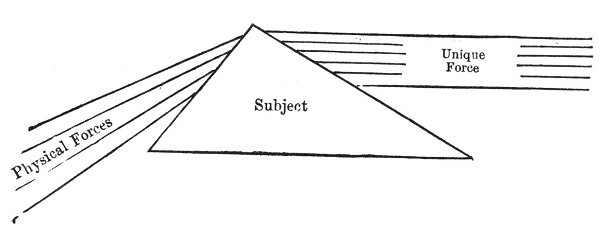
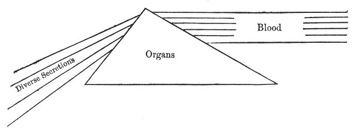
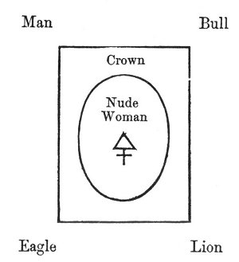
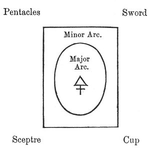
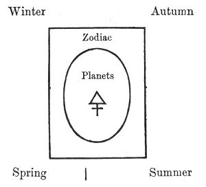
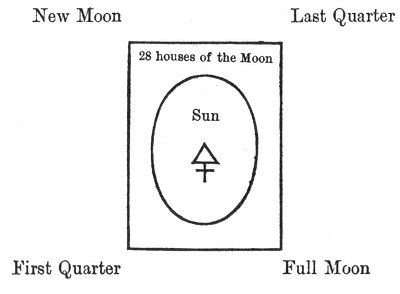
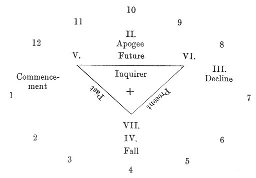
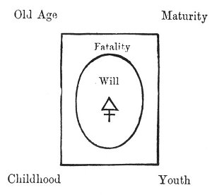
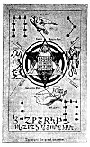

  
[Intangible Textual Heritage](../../index)  [Tarot](../index.md)  [Tarot
Reading](../pkt/tarot0)  [Index](index)  [Previous](tob42.md) 
[Next](tob44.md) 

------------------------------------------------------------------------

p. 223

# PART III.

### APPLICATIONS OF THE TAROT.

p. 225

# CHAPTER XV.

### GENERAL KEY TO THE APPLICATIONS OF THE TAROT.

The Principle and the Forms--The Twenty--first Card of the Tarot is a
Figure--principle--The Tarot--The Year--The Month--The Day--The Human
Life.

GENERAL KEY TO THE APPLICATIONS OF THE TAROT.

WE have already stated that the twenty-first card gives the key to the
construction of the Tarot. The utility of this arcanum does not end
here; we shall now see that it is the *key to every application* of the
Tarot.

Some explanation may be necessary as to the manner in which a symbolical
figure can be applied to conceptions of very different orders, without
undergoing the least transformation.

Let us take one very simple example, chosen in the realm of experimental
science, by applying the analogical method to its study. Let us
represent the well-known phenomenon of the decomposition of the white
light by the prism.

We place the prism, indicated by a triangular figure, in the centre; the
white light, represented by parallel lines, enters it on one side: from
the other the colours issue.

p. 226

\[paragraph continues\] They are represented by the refracted and more
or less oblique lines.

The words *Prism*, *White Light*, and *Colours*, indicate all the phases
of the phenomenon.

 

 

 

If, however, we reflect that after all it is only a general force (the
white light) which undergoes various changes, according to the quantity
of matter with which it comes in contact (the different thicknesses of
the prism), [1](#fn_78.md) we shall easily grasp
another aspect of the figure.

In fact the work of Louis Lucas, unconsciously continued by contemporary
scientific men, proves by evidence the unity of force in action
throughout Nature. The different physical forces, heat, light, or
electricity, are only representations of this unique force differently
modified, according to the quantity of matter with which it comes in
contact.

Thus the white light in contact with the large amount of matter at the
base of the prism becomes violet in the same way the unique force coming
in contact with much matter becomes heat, or placed in contact with
little matter becomes light or electricity.

We can therefore represent this new phenomenon without

p. 227

changing the form of our figure in any way; only the words need vary--

 

 

 

Here the *different quantities of matter* are represented by the
different thicknesses of the prism, the *unique force* corresponding
with the white light by the parallel lines, the *various physical forms*
responding, to the various colours by the refracted lines.

If any one should consider that these two examples belong to the realm
of physics, and are therefore insufficient to generalize a phenomenon to
this point, we can answer by another instance quoted from physiology.

Physiology teaches us that all the organs in man act under the influence
of the blood. Thus the latter, acting upon the salivary glands, produces
the saliva, acting upon the stomach the gastric juice is secreted, upon
the liver in certain cases it produces bile, etc., etc.

In short, this physiological phenomenon reduces itself to *one unique
agent* (the blood), acting upon the different organs (the salivary
glands, stomach, liver), and producing secretions of equally different
natures (saliva, gastric juices, bile).

Can we not therefore represent the different organs by the different
thickness of the prism, the different

p. 228

transformations of the unique force by the refracted rays, and the
unique force itself by the parallel lines?

The correspondence is exact on all points, and the same figure can be
used once more--

 

 

 

Thus the figure has never changed: only the words applied to its
different parts have varied. The basis of all occult science and of the
analogical method resembles this example: one fixed and invariable
figure, which is always the same (Ex.: the figure), to which various
orders of phenomena can be successively applied.

The twenty-first card of the Tarot is a *figure-principle* of the same
nature as the prism which we have just studied, and a few examples of
the various methods in which it can be applied will fully enlighten us
upon this point.

We have seen that the four figures in the corners of the twenty-first
card represent the four animals of the Evangelist. In the centre stands
a woman, the image of Humanity, and between the two symbols is a crown
of elliptic form.

This shows us that there will always be four fixed principles in every
application of this card (since the symbols placed at the four corners
of the square do not move), and a certain number of mobile principles
represented

p. 229

by the wheel, *rota*, which occupies the centre of the symbols.

This figure can never change, since it is a *figure-principle*: the
words alone that may be applied to it can vary.

Thus we have seen the four following symbols--

 

 

 

become

 

 

 

We see that none of the symbols have changed, but the words only.

p. 230

The same rule applies to every application of the Tarot. Thus if we take
astronomy, the four figures will be the four seasons, the crown is the
zodiac, and the nude figure (Eve) the animating system of the zodiac,
the planets; thus--

 

 

 

This shows us the progress of the *sun*, as it gives birth to the
*year*. If we wish to know *that of the moon* as it produces the month,
the four seasons would become the four lunar phases, the zodiac would be
the twenty-eight houses of the moon, and the centre the sun, which
animates the moon; thus--

 

 

 

p. 231

If we wish for the horoscope of a *single day* we find it in the
following figure--

 

 

 

Here the *earth* occupies the position of the moon in the month and of
the sun in the year.

If these astronomical data weary us, we can study the figure will assume
a circle of the *Human Life*, and the figure will assume new aspect.

 

 

 

A profound symbol, which indicates that the *Human Will* creates the
*fatality* in which man moves, under the

p. 232

influence of the *providential* cycle of the four ages of the human
life. If we know that Providence (the outer circle): acts upon the
*Future*, Fatality (the intermediate circle) upon the *Past*, and the
Human Will (centre circle) upon the *Present*, we shall see the basis of
the *divining Tarot*.

We think that these examples are sufficiently clear to enable us to
proceed, and we shall now study some applications of the Tarot, leaving
to the student the work of discovering a larger number.

 

 [  
Click to enlarge](img/23200.jpg.md)

p. 233

------------------------------------------------------------------------

### Footnotes

[226:1](tob43.htm#fr_78.md) See Louis Lucas, Chimie
Nouvelle, chapter upon "Angulaison."

------------------------------------------------------------------------

[Next: Chapter XVI. The Astronomical Tarot](tob44.md)
