  
[Intangible Textual Heritage](../../index)  [Tarot](../index.md)  [Tarot
Reading](../pkt/tarot0)  [Index](index)  [Previous](tob45.md) 
[Next](tob47.md) 

------------------------------------------------------------------------

p. 273

# THE DIVINE NAME IN THE TAROT.

### By Ca. BARLET.

The totality of the symbols which form the Tarot is distributed through
a series of 78 plates or cards, instead of being presented in a single
figure; the reason for this is, that the signification of this totality
is very multiple; for it is at the same time theologic, cosmologic,
psychologic, and divining, and this variety is the result of the
different combinations which can be produced by the arrangement and
comparison of these 78 cards. This variety is not one of the lesser
beauties of this unique masterpiece, in the sense that it adds movement
and consequently life to the usual immobility of every written
representation, without counting the diversity of its appliances, which
include numbers, words, form, and colour.

The Tarot can therefore be *made to speak* when one of its innumerable
combinations has been found; that is to say, when the student knows how
to arrange the whole or part of his cards upon the table, in the order
necessary to discover the answer which he seeks.

We ask him: What is the Creation from man's point of view, that is to
say, what is the life of the Great All, and how can or should man
participate in it? The whole Tarot, with its 22 great arcana and 56
minor arcana, will answer us, as we shall show by quoting only a few of
the profound interpretations which it provides.

p. 274

To obtain this information we must remember that the three first cards
which express the Trinity form at the same time the key to the 22 great
arcana, which, when the 0 is abstracted, are only seven repetitions of
this Trinity. We must also notice that the card M, the fourth term of
the divine tetractys, is both the realization of the Trinity restored to
the unity, and the first term of the following Trinity. The four first
cards thus represent the divine name of 4 letters, IEVE (יהוה) so that
if we repeat the Trinity seven times, to obtain the sequence of the 21
great arcana, the numbers will correspond to the four letters as
follows--

|         |     |     |     |     |     |     |     |     |     |     |     |     |      |
|---------|-----|-----|-----|-----|-----|-----|-----|-----|-----|-----|-----|-----|------|
| Numbers | 1\. | 2\. | 3   | --  | 4\. | 5\. | 6\. | --  | 7\. | 8\. | 9   | --  | etc. |
| Letters | י   | ה   | ו   |     | ה   | י   | ה   |     | ו   | ה   | י   | --  | etc. |
|         | I   | E   | V   | --  | E   | I   | E   |     | V   | E   | I   | --  | etc. |

 

We will assume that these letters are thus attached to the corresponding
arcana, and this remark will be the first key to the arrangement which
we are looking for. '

To find a second key, we must redeal our cards in a. given space; at
first only their place in the plane will appear; then it will be clearly
defined. We know that the Kosmos is conceived as the final expansion of
the mathematical point, that is to say, of the Absolute, which before
this expansion included all force or potentiality in its nothingness.
Let us draw this sphere (see [Fig. 1](#img_27500).md). The centre of it
will be represented by one of the cards, 0, the *Foolish Man* or
*Crocodile*, which is the pivot of the whole pack, at the same time that
it participates in all the other cards, for they include all the
properties of our universe. From some point of the sphere, a point which
becomes our north pole, the movement will start, by which the creation
will appear on its surface.

p. 275

 

 [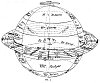  
Click to enlarge](img/27500.jpg.md)  
FIG. 1  

 

p. 276

Around this point upon the sphere, the reflex of the centre, we will
place the cards of our 3 first arcana: I. (the Mage, the Spirit, י); II.
(Knowledge, Substance, ה); III. (Love, the fertile Power, the Being, ו);
and in order that this Trinity may be repeated in the whole septenary of
our distribution we will make it the root of 3 great divisions,
representing the 3 terms of the Trinity, which will divide the surface
of our sphere by 3 meridians.

We can then continue the distribution of our cards upon this surface in
the following way. The head of each partial Trinity will be in division
1; each second term will be in division 2; each third term in division
3. Consequently our IV. card (the Emperor, ה) will be in the L; the V.
card (the Pope, ו) will be in II.; the VI. card (Liberty, ה) will be in
III., and this second sequence will form a new zone upon the sphere. A
third, a little inferior, will be formed by cards VII., VIII. and IX.,
cards XI., X. and XII. will occupy the Equator, and the 9 cards from
XIII. to XXI. will be distributed like the 9 first, in 3 bands placed
upon the lower hemisphere as shown in [Fig. 1](#img_27500.md).

Now our 22 great arcana are placed; let us pause and look at their
significations. Above the Equator we see an ever-increasing expansion of
the North Pole, represented by the 3 upper triangles, then by the 6
trapezes which follow, each larger than the one before. Here are the
three planes of the Creation: The Divine, metaphysic (I., II., III.),
the Intelligible, moral (IV., V., VI.), and the physical, that of the
generative attributes or elements (VII., VIII., and M).

The creation is realized upon the equatorial line (X., XI., XII.), in
which the first term, with the preceding cards, represents the 10
sephiroth of the Kabbalah.

Below the Equator, in the world of material realization,

p. 277

which is quitted by *Death* (XIII.), this expansion is retracted and
synthetized by an inverse and symmetrical movement of the above. The
arcana which follow represent Initiation carried to its extreme limits,
the path by which the creature (X.) returns from its multiplicity to the
unity of the spirit, goes back to the point--the southern pole--a new
reflex of the Absolute, towards which it reascends by the vertical axis
of the sphere. [1](#fn_84.md)

The Neophyte, after his preparation (positive science, magnetism and
alchemy, X., XI., XII.), travels through the sublunar world (XIII.,
XIV., XV.), then through the solar system (XVI., XVII. and XVIII.), and
escapes by the sun in the abyss of the Infinite (XIX., XX., XXI.).

We may now end this short explanation of the practical distribution of
our 22 arcana upon a plane (the reader will do well to imitate it upon a
table with a pack of Tarot cards). The student should imagine that our
sphere is seen from a considerable distance, vertical upon its axis; for
instance, at the distance of the earth from the sun, the upper
hemisphere only will appear, the other being seen but *transparently*;
and it will look like a circle, with the Equator for its circumference.
The limits of the 3 superposed zones appear like 3 concentric circles;
the meridional planes, seen by their dividing lines, only look like 3
equally divided radii, making of the 3 sectors 3 equal axes. This
representation, which geometricians name *projection* upon the plane of
the Equator, gives the second figure (the 4 circles of the centre only);
to it, for the sake of clearness in the symbols, has been added an
equilateral triangle inscribed in the inner circle, with the points
posed upon the 3 meridians. The Roman figures inscribed

p. 278

in the circles represent the numbers of the cards placed m we have said,
and, consequently, also indicate their place upon the table. The arcana
of the lower hemisphere are indicated upon the figure in dotted letters,
in the same circles as the preceding; since the lower zones, seen only
transparently, might be confused with the upper, through their mutual
symmetry.

Here, in its great features, is already an answer to our questions: the
Spirit descends by three trinities from the Absolute into Matter (upper
hemisphere). It is realized by the trinity X. (Malchut), XI. and XII.
(the Equator), and it returns to the Absolute by a trinity of growing
synthesis, which constitutes human progress (lower hemisphere).

We will presently explain some of the philosophic interpretations which
this distribution furnishes; let us first complete it by our 55 minor
arcana. They especially represent our solar world.

Since we are now in the world of realization, 4 is its number, its
fundamental basis; it is the Trinity realized; the divine name of 4
letters IEVE (יהוה). Our cards will be divided into 4 sections: the 4
colours of the pack, spades, hearts, clubs, and diamonds, with their
hieroglyphic and far more significant names: the *Sceptres*, *Cups*,
*Swords*, and *Pentacles*.

Everything is dual in this world, where the equilibrium is unstable,
unable to find any rest, except in the return to the Trinity, from which
it proceeds. Thus these 4 fundamental divisions will divide into 2
duads: the one spiritual, the other material, each composed of a
masculine and feminine principle, namely--

Spiritual duad, the *Sceptre* (spades, a full triangle, masculine); the
*Cup* (heart, an open triangle, feminine); religious attributes;

p. 279

Material duad: the *Sword* (club, a lobed triangle,), and the *Pentacle*
(diamond, double triangle); the attributes of the warrior and of the
artisan.

Four other divisions correspond to these 4 colours, those of the figures
which also form 4 duads, namely--

King and Queen;

Knight or Warrior, and Knave.

As to the numbers which follow these figures, they lead us to another
consideration, which is also essential to the distribution of our
cards--

If 4 is the fundamental number of these minor arcana, the symbols of our
world, we must not forget that it is also connected with the Trinity,
from which it emanates; that it realizes it, and returns to it. We must
then also find the ternary element in it: after the colours and the
figures, which have provided the basis of our word, the numbers, which
are, as it were, the essence of it, will reflect the sephiroth in it,
and by them the act of creation. They pause, in fact, at 10, including 3
trinities besides the tenth, Malchut, which unites them.

Our distribution must also take the two numbers 3 and 4 into account, by
combining them so as to utilize all the elements which we have just
enumerated. This is how we can do this (follow [Fig. 1](#img_27500.md) upon
the plane of the Equator, represented as a ring. outside the sphere)--

We will first separate some of the cards: the Knave of each of the 4
colours (ה), which, as the realization of the Trinity, King (י), Queen
(ה), Knight (ו), serves as the transition from the quaternary to the
ternary; and the 10 of each colour, the unity of complete realization,
the multiple unity 1 and 0--Malchut.

The Knaves, by their participation in the quaternary and ternary, and
their return to the Unity by the Trinity,

p. 280

have a universality which connects them with the unnumbered card 0 of
the great arcana; we will therefore place them round this card, as a
cross, in the centre of our equatorial circle. In this way the centre
will express: By the card 0, the original unity, the source and aim of
creation; by its triangle, the primitive Trinity; by its 4 colours, the
quaternary in which it is realized; by the character of the 4 Knaves,
the return of this quaternary to the ternary; in short, the whole
creation assembled in one point, in potentiality, which is the
characteristic of the Spirit.

On the other hand the four 10 will be placed at the extremities of the
cross formed by the Knaves, outside all our circles, as the expression
of the Unity multiple, in its last term of differentiation.

As to the other cards, they include first 3 kinds of figures, which
correspond with the 3 terms of the Trinity; it is quite simple to
distribute them in the 3 parts of our external equatorial plane,
corresponding with the 3 divisions of the sphere--

The Kings opposite to division I (י);  
The Queens opposite to division E (ה);  
The Knights opposite to division V (ו);

\[paragraph continues\] and, since there are 4 colours for each of them,
4 subdivisions are naturally produced in each of our 3 principal
divisions; these 4 subdivisions, corresponding to the Sceptre (י), the
Cup (ה), the Sword (ו), and the Pentacle (ה), also repeat the Divine
name of 4 letters (IEVE) (יהוה), and form the passage from the ternary
to the quaternary.

Now only the numbers remain to be placed; and we have only to make them
correspond with the terms of the Trinity--

. 281

The four 1 behind the Kings;  
The four 2 behind the Queens;  
The four 3 behind the Knights.

Then, in a still more external circle--

The four 4 outside the Kings and the 1;  
The four 5 outside the Queens and the 2;  
The four 6 outside the Knights and the 3.

Finally, an outlying circle will include the four 7, 8 and 9 in the same
order. As to the four 10, they are placed quite outside, as we have
already said.

We thus obtain the distribution represented by the figures
[1](#img_27500) and [2](#img_28400.md).

Let us now consider their signification.

The living atom descended upon the sphere has reached the point
represented by arcanum X., *the wheel of Ezekiel, which raises man and
lowers the elemental*. From this, the atom falls, so to speak, through
the material world, which he has just entered. He first descends through
the spiritual decade (Sceptre and Cup) (see the figure), traversing
numbers of increasing complexity: King, 1, 4, 7, then 10 By this 10, the
multiple unity, limit of materialization, which unites the two portions
of the decade Sceptre-Cup, he resumes in an inverse sense, as though by
a reascending are, the road which will lead him back to plate X.,
remounting the 4, 7, 10, and King of Cups and Swords, the substantial
duad.

This is only one-third of the voyage which the living atom must
accomplish in the real world; and, in this first excursion through
matter, he has still retained the spiritual character which he received
from Yod (י), the characteristic of plate X.; he must now lose this
character for that of the following E (ה). To this end, he passes

p. 282

from plate X., which he has just re-entered, to plate XI. (ה), the
*Hermit*, the *veiled Lamp*, to pass in the same way as he has already
done through the dual series of the Sceptre-Cup, through the Queens, the
2, 5, and 8, passing by the 10 of Cups, and remounting by it through the
second series, Sword-Pentacles, to the arcanum XI., the starting-point
of this second excursion.

Finally, from this last arcanum he passes to number XII. (י), *the
Sacrifice*, descends the neuter series of the *Knight*, 3, 6, 9 of
Sceptres and Cups, crosses the 10 of Swords and the 10 of Pentacles, and
remounts by the dual Swords and Pentacles to the intelligible world.

His journey across the material world is completed; he has travelled
over the Zodiac; he will now die; the arcanum XIII. is ready for him,
and will give him access to the spiritual world, to the Redemption.

We will now explain some other features of this distribution.

It divides the external circle of the Equator into 3 arcs, subdivided
into 4 portions; in all 12 divisions of different characters. These are
the 12 signs of the Zodiac. The first is naturally ranked with the first
card of the minor arcana in the spiritual sector, *i. e.* the King of
Sceptres (Spades); the second corresponds with the King of Cups, and so
on to the twelfth.

One observation will suffice to justify the connection between the
zodiac and our cards. We must note the 12 divisions of the circle into
the triple repetition of the 4 letters of the Sacred Name; an operation
legitimized by the remark already made, that these 4 colours correspond
with these letters (see [Fig. 2](#img_28400.md), in the intermediate
circle, where the signs of the Zodiac are written). We at once recognize
the 4 trigons of the Zodiac, corresponding

p. 283

with the elements which the 4 colours also represent, and these trigons
are characterized as well as designated.

The *fiery* trigon ( 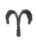,
 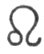,  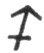), corresponding with the
Sceptre and the letters יוי, is swayed by the spiritual element.

The *earthy* trigon ( 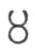,
 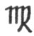,  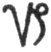), corresponding to the Cup and
to the letters ההה namely, two E's of the name of 3 letters, and the
final E of the name of 4 letters--an essentially feminine character,
substantial, but of superior order.

The *airy* trigon ( 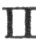,
 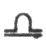,  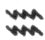), corresponding to the *Sword*
and the letters והה swayed by the masculine element of the second order.

The *watery* trigon ( 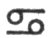,
 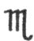,  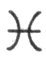), corresponding to the
Pentacle and to the letters ההה, comprising, this time, the final E of
the name of 4 letters twice repeated, and the E of the name of 3
letters--the dominant character, the inferior feminine.

But we must leave the minor arcana to the investigations of the
reader--they would lead us too far--and return to some further notice of
the great arcana.

Let us first notice how the three chief sectors preserve and reproduce
their innate characters in all their divisions.

We find, in the first, that of the letter Yod (י), the Spirit, the
numbers of the unity, I., IV., VII., X. (repeated in the minor arcana);
as *figure*, the Kings; as *colour*, the Sceptre; in the *Zodiac*, the
lines of the ascension of the sun above the Equator from the spring to
the solstice.

In the second sector (ה) the substantial principle is the feminine
numbers II., V., VIII., XI. (repeated in the minor arcana); as *figure*,
the Queens; as *colour*, the Cup; in the *Zodiac*, the four signs of the
descent of the sun towards the Equator; the season of harvests and
vintages, fecundity in all its forms.

p. 284

 

 [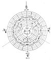  
Click to enlarge](img/28400.jpg.md)  
FIG. 2  

 

p. 285

In the third sector (ו), the Son, the Element, are the sacred numbers
which participate in the two preceding orders, III., VI., IX.; as
*figure*, the Knight; as *colour*, the Pentacle of the practical world,
and the Sword also, which close the preceding sector; in the *Zodiac*,
the signs through which the sun passes in the southern hemisphere; our
winter, the season for the consumption of the produce of the earth, of
renovation for the cycle which follows: *Christmas* is in the centre;
the new birth in the winter of death; the time when the Son was born
into an inferior world to reanimate it.

The divine Name יהוה is not only written in the series of concentric
circles, it is also found upon the lines belonging to those circles,
either in descending or in remounting.

The first sector gives it without transposition, as we see in [Fig.
2](#img_28400.md).

In the second sector the divine Name is preceded by the feminine letter
E, the Mother, and finally pauses at it: E, IEVE, IE. (See [the
figure](#img_28400)..md)

In the third, it commences by the letter of the Son and ends by that of
the Father, to which he returns: VE, IEVE, I.

We shall now inquire from the symbols of the cards the *different ways
of pronouncing the divine Name, and also the various manifestations in
the Kosmos of each of these four letters*. Let us question even the
spirit of these symbols, instead of their number, colour, or form, which
have chiefly occupied us at present.

By first following the regular order of our arrangement we shall find--

In the divine world: the arcana I., II., III., IV., the divine
Tetractys, comprising: (1) the *Absolute Being*; (2) the *Consciousness*
of the Absolute; (3) *Love* or the power

p. 286

of fecundity; (4) the *realization* of the virtualities of the
*Absolute*.

In the world of laws: arcanum V., the laws of the relation of the
Created with the Uncreate (the *Initiator*, *Fear also*). [1](#fn_85) VI. (*Liberty*, *Beauty*.md); knowledge of
good and evil; knowledge of the Law. VII. (Glory); rule of the Spirit
over Matter, the fertile power of the Law; and VIII. (*absolute
Justice*, *Victory*), realization of the Law.

In the physical world: arcana IX. (*the veiled Lamp*), the light
extinguished in the darkness of the substance, the spirit imprisoned in
the material world, *Yesod*. X. (*Wheel of Fortune*), which raises the
fallen spirit to lead it back, with the nature which it has
spiritualized, to all its power, by *Strength* (arcana XI.), and by
*Sacrifice* (arcana XII.).

The phases of spiritualization then follow. XIII.: First phase:
(*Death*) to the physical world. XIV. (*the two Urns*) combination of
the movements of life. XV. (Typhon). Magic. XVI. (*the Lightning-struck
Tower*); the interplanetary force.

Second phase: XVII. (the *flaming Star*), the internal light. XVIII.
(the *Twilight*), the aurora of the divine sun. XIX. (the *Sun*),
central; and XX. (the *Judgment*), after which the supreme realization
is obtained, the *Crown of the Magi*.

We have said that the divine Name is again enunciated in following the
three sectors.

In the first are the arcana I., IV., VII., X. The absolute, the
realization of its virtualities, the dominion of Spirit over Matter, and
the animating principle of beings. Then, in return, XIII., XVI., XIX.
and I. Death (Inertia),

p. 287

the astral light, the central sun, and the Unspeakable himself.

This is the account, by the principles, of the differentiation and
integration of the Absolute.

In the second sector, the one which corresponds to the consciousness of
the Absolute or faith, we have the series, V., VIII., XI., XIV.: the
Hierophant, or religion; Justice, Force, and the combination of the
movements of life; the image of the Saints; the *Mystics* of all
religions, who by absolute Faith and Justice, receptive, feminine
virtues, acquire, without seeking for it, the power of working
prodigies.

Lastly, in the third Sector, that of Love or power of fecundity, we have
the series: IX., Wisdom and Prudence; XII., the Sacrifice; XV.,
self-abandonment to the astral forces; and XVIII., the attainment of the
Infinite. The essence of this series of efforts, both active and
passive, constitutes Initiation, the Redemption.

Let us once more seek for the divine Name, through the three divisions
at once. We shall find, for instance, the arcana L, II., III., VI.,
which demonstrate the divine Trinity, manifesting itself by Beauty and
Liberty in the Intellectual world: it is the passage of the Father (י)
to the Son (ו).

Or again, I., VI., IX., X.: The descent of the Father (י) into the
physical world (X.) by the Son (VI.) and by Yesod (IX.); the Word made
flesh. This is the Redemption, the series which in the *Sepher Yetzirah*
represents the C*o*lumn of the Sephiroth (Kether-Tiphereth-Yesod and
Malchut). [1](#fn_86.md)

p. 288

But we must limit these examples, which the reader will easily multiply
for himself. Let us only add a few more words upon our second problem:
the different manifestations of each of the three persons of the divine
Trinity.

The Yod is found in the arcana I., V., IX., XII. and XIII.; in Keter, in
the Hierophant, in the Wise Old Man; then it presides over *death*,
which will bring the world from the depths of gloomy Inertia to the
resplendent crown of the Magi, by the internal light.

It will be noticed, at the same time, that the Yod is the only one of
the four letters which, by its various positions, forms a complete
spiral round the sphere, from the north to the south poles; a symbol
which may appear very remarkable to any one acquainted with the
mysteries of the life of a planet.

The first E, the celestial Mother (arcana II.), is found in the arcana
VI., X., XIV. and XVIII., that is to say, Beauty, Form, the Angel of
Temperance, which balances the movements of life, and the aurora of the
divine Sun; Diana the Moon.

The V, the Son, is characterized upon the various planes by the arcana
III., VII., XI., XV. and XIX.; Love, the fertile power; the Ruler over
Matter, Force; then Typhon, the mysterious Baphomet of the Templars,
which collects the superior forces to spread them over the Earth; and
lastly, the central Sun. In a word, the *Christ* of the Gospel, the
Spirit of Love, the Master of the Elements, the Word made flesh to
spiritualize the flesh; the divine reflex of the Universal Sun.

Lastly, the second E; the terrestrial Mother is seen in the arcana IV.,
VIII., XII., XVI. and XX. The realization of the divine virtualities,
and also Mercy, absolute Justice, Sacrifice, the overwhelmed and
suffering Spirit,

p. 289

and finally Resurrection; the head of the Serpent crushed beneath the
woman's heel, by the force of abnegation and resigned faith.

We need only follow these various arcana upon the sphere, to see once
more that the Yod has 3 superior arcana (northern hemisphere), and 2
inferior;

That the V (ו) has only 2 superior and 1 medium (upon the Equator);

And that the E has 4 superior, 2 inferior, and 2 medium.

Let us close these remarks, already too lengthy, by a simple observation
upon the general effect of our arrangement.

The three worlds, Divine, Intelligible, and Physical, are found not only
in the three zones of the sphere, but they are again reproduced in the
whole arrangement; the Divine is in the centre, through the Foolish Man
of the Tarot, and the cross of four colours; this we have already
pointed out.

The Intelligible and its developments are provided by the sphere ([Fig.
1](#img_27500).md), or the circular distribution of the 21 great arcana
([Fig. 2](#img_28400).md).

The physical is seen in the external plane of the Equator ([Fig.
1](#img_27500).md), with the distribution of the 56 minor arcana,
representing the Zodiac and the various degrees of the multiplicity of
Force through substance to the extreme pole, the negative unity 10.

Moreover, the whole ([Fig. 1](#img_27500).md) reproduces the form of the
planet Saturn, with its ring, a form which in itself, according to the
theories of our positive sciences, is the clearest manifestation, the
demonstration of the great laws of the formation of the Universe;
namely, the concentration of the substance in a radiant state around

p. 290

a point of attraction, producing with a progressive condensation a
rotatory movement, particularly accentuated at the Equator, and giving
birth to the stars, planets, and satellites, thus descending from the
ethereal *nébuleuse* to the atom, to the solid ultimate; from living
nothingness to inert nothingness, from the unit to an infinite
multiplicity.

Thus the Tarot, the secular fruit of the genius of our ancestors, can
represent not only the creation in its actual state, but its history
even in details, and its future. with that of the human creature, even
to their principles; yet avoiding, by the combination of its analogical
symbols, borrowed from natural life, the rock upon which all philosophy
breaks--namely, the definition of words, the clear, full expression of
the *Word* in the sublunar world.

------------------------------------------------------------------------

### Footnotes

[277:1](tob46.htm#fr_84.md) The details which
justify, this assertion will be found in the first part of this chapter.

[286:1](tob46.htm#fr_85.md) Consult for the
generation and signification of numbers the *Traité Élémentaire de
Science Occulte*, by Papus, a learned author, whose good counsels have
produced the best part of this article.

[287:1](tob46.htm#fr_86.md) The signification of
the cards is borrowed from Fabre d'Olivet, Wronski, E. Levi, Christian,
and the *Sepher Yetzirah* (translation by Papus).

------------------------------------------------------------------------

[Next: Deductions by Etteila upon the Book of Thoth](tob47.md)
