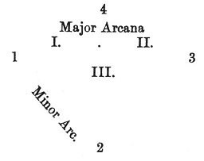
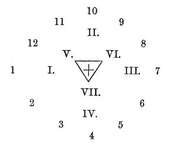

  
[Intangible Textual Heritage](../../index)  [Tarot](../index)  [Tarot
Reading](../pkt/tarot0)  [Index](index)  [Previous](tob54) 
[Next](tob56) 

------------------------------------------------------------------------

p. 322

# FIFTH LESSON.

### FORTUNE-TELLING BY THE TAROT.

I.--RAPID PROCESS:

What must we do if we wish to draw out the horoscope of any matter?

1\. You should take the minor arcana and separate the suit of cards that
refers to the kind of consultation you require.

If it is some *business you are about to undertake*, you must take the
Sceptres or Diamonds.

If it is a *love affair*, take the Cups or Hearts.

For a *law-suit*, or any struggle, take Swords or Spades.

In a *money matter*, the Pentacles or Clubs.

2\. Shuffle the cards selected, then ask the Inquirer to cut them.

3\. Take the four first cards from the top of the pack, and without
looking at them place them in a cross in the following way, from left to
right, as shown by the numbers.

|     |     |     |
|-----|-----|-----|
|     | 4   |     |
| 1   |     | 3   |
|     | 2   |     |

 

4\. Then take your major arcana (which should always be separated from
the minor arcana), shuffle them, and let them be cut for you.

p. 323

5\. You then ask the Inquirer to draw out *seven cards* from the major.
arcana by chance, and to give them to you without looking at them.

6\. Shuffle these seven cards, and when the Inquirer has cut them, take
the three top cards, and without looking at them arrange them in a
triangle, in the following order--

|     |       |      |
|-----|-------|------|
| I.  |       | II\. |
|     | III\. |      |

 

You thus obtain the following figure--

 

 

 

7\. Take up the cards so that you can see them and read the oracles,
noticing that the card placed at number 1 indicates the *commencement*.

The card placed at number 2 indicates the *apogee*, at number 3 the
*obstacles*, lastly, at number 4 the *fall*.

The major arcanum placed at I. indicates the influences that have
weighed in the affair during the *Past*.

The major arcanum in II. indicates the influence exerted over the
*Present*.

The arcanum at number III. shows the influence which will affect and
determine the *Future*.

These cards can be very rapidly deciphered when the habit is once
acquired. But one important point should be noted, that when the rapid
process is used for fortune-telling,

p. 324

the figures do not exclusively represent persons of especial complexion.
The King represents a man, without any other distinction, the Queen a
woman, the Knight a young man, and the Knave a child.

II.--A MORE ELABORATE PROCESS:

1\. Shuffle all the minor arcana together and let them be cut for you.

2\. Take the twelve first cards from the pack, and place them in a
circle thus--

|     |     |     |     |     |     |     |
|-----|-----|-----|-----|-----|-----|-----|
|     |     |     | 10  |     |     |     |
|     |     | 11  |     | 9   |     |     |
|     | 12  |     |     |     | 8   |     |
| 1   |     |     |     |     |     | 7   |
|     | 2   |     |     |     | 6   |     |
|     |     | 3   |     | 5   |     |     |
|     |     |     | 4   |     |     |     |

 

3\. Shuffle the major arcana, and let them be cut by the Inquirer, who
will then choose *seven cards*.

4\. Take the four first of these cards from the pack, and arrange them
opposite the cards placed at numbers 1, 10, 7, 4, thus--

|     |      |       |
|-----|------|-------|
|     | II\. |       |
| I.  |      | III\. |
|     | IV\. |       |

 

5\. Then place the three others in a triangle in the centre of the
figure, thus--

|     |       |      |
|-----|-------|------|
| V.  |       | VI\. |
|     | VII\. |      |

 

p. 325

You thus obtain the following general figure, which we have already
given.

 

 

 

Place the Inquirer in the centre of the figure, unless it has been drawn
amongst the other cards. If the Inquirer has been drawn you must place
it in the centre, and replace it by another major arcanum chosen by the
person whose fate is being studied.

The 12 minor arcana indicate the different phases through which the
individual life will pass, or the evolution of the event during the four
great periods: *Commencement*, indicated by the major arcanum I., which
displays its character; *Apogee* (arc. II.); *Decline* or *Obstacle*
(arc. III.); *Fall* (arc. IV.).

Lastly, the 3 major arcana placed in the centre indicate the especial
character of the horoscope in the *Past* (V.), in the *Present* (VI.),
and in the *Future* (VII.).

The future is indicated in the minor arcana by the cards placed from 7
to 12;

The past by those placed from 1 to 4; and the present by those placed
from 4 to 7.

These numbers only indicate the numbers of the *places* occupied by the
arcana, and never the numbers of the

p. 326

arcana. themselves. It is important to avoid the idea that the arcanum
VII. must always return to the place numbered VII. But our readers are
sufficiently intelligent to make any further insistence upon this point
quite unnecessary.

The explanation of the meaning of the arcana will be perfectly easy,
when the lessons 2 and 3 have been once read.

Practice will teach all these details far better than all the theories
in the world.

------------------------------------------------------------------------

[Next: Sixth Lesson. Etteila's original and unpublished Method of
Fortune-telling by the Tarot](tob56)
