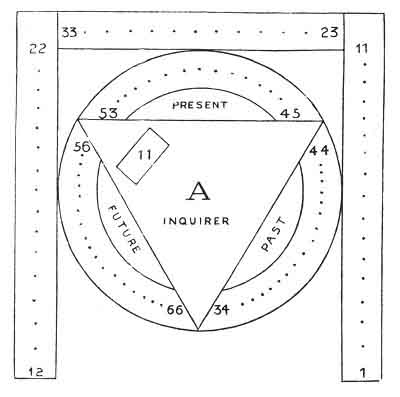

  
[Intangible Textual Heritage](../../index)  [Tarot](../index.md)  [Tarot
Reading](../pkt/tarot0)  [Index](index)  [Previous](tob55.md) 
[Next](tob57.md) 

------------------------------------------------------------------------

p. 327

# SIXTH LESSON.

Etteila's original and unpublished Method of Fortune-telling by the
Tarot (from one of his rarest works).

WE have explained a method which is original in a great measure, but as
we have no intention of monopolizing the art of Cartomancy, we will now
say a few words upon the system used by Etteila, the great master in
this portion of occultism.

Etteila, whose real name was Aliette, was a hairdresser's apprentice who
lived at the time of the French Revolution. Having accidentally found a
pack of Tarot cards, he was interested by its eccentricity and began to
study it. After thirty years he believed that he had discovered the
secret of this Egyptian book. Unfortunately Etteila did not possess any
synthetic knowledge, and this ignorance led him to the most erroneous
conclusions, whilst many of his intuitive solutions are really
marvellous. There is too much inclination to calumniate this ardent
worker; but we must recognize the real truths contained in his works
without laying too much stress upon the ignorant simplicity which
disfigures them.

However this may be, Etteila devoted all his powers to fortune-telling,
and if his contemporaries maybe believed,

p. 328

he succeeded wonderfully in his aim. He therefore became the great
authority for all fortune-tellers by cards.

We will describe his system in some detail, instead of alluding to those
used by his female successors, who as a rule misrepresented without
understanding his explanations.

\*  
\*   \*

Four deals are required before the Tarot can be clearly read according
to this method: we will now enumerate them one by one.

FIRST DEAL: Shuffle all the cards of the Tarot, without making any
distinction between the major and minor arcana. Then let them be cut,
and divide your pack into three heaps, each containing 26 cards. [1](#fn_88.md)

|     |     |     |
|-----|-----|-----|
| 26  | 26  | 26  |

 

Take the central heap and place it on your right--

|     |     |                              |
|-----|-----|------------------------------|
| 26  | 26  | 26 on one side to the right. |

 

You have still two packets of 26 cards. Take them, shuffle the cards,
cut them, and divide them into three heaps, each containing 17 cards--

|     |     |     |
|-----|-----|-----|
| 17  | 17  | 17  |
|     | 1   |     |

 

One card will remain, but you need not trouble about it.

You then take the central packet and put it on your right hand by the
side of the one of 26 cards already there--

|     |     |     |     |                 |
|-----|-----|-----|-----|-----------------|
| 17  | \*  | 17  | 17  | 26 on one side. |
|     | 1   |     |     |                 |

 

p. 329

You then take the 35 cards which are not on one side, shuffle and cut
them, then divide them into three heaps of 11 cards each--

|     |     |     |
|-----|-----|-----|
| 11  | 11  | 11  |
|     | 2   |     |

 

Two cards remain, but these axe of no consequence; take the central
packet as before and place it on your right by the side of those already
there--

|     |     |     |          |
|-----|-----|-----|----------|
| 11  | \*  | 11  | 11 17 26 |
|     | 2   |     |          |

 

This ended, you collect the 21 cards that you have not placed on one
side, and you are then ready to explain the oracle.

\*  
\*   \*

For this purpose you first take the packet of 26 cards from your right
and lay it upon the table card by card, going from right to left--

26................................................1

Then take the packet of 17 cards, which you place beneath the others,
then the 11 cards, which you also spread out beneath the other two. You
then obtain the following arrangement.

|      |                                                     |
|------|-----------------------------------------------------|
| Soul | 26................................................1 |
| Mind | 17...................................1              |
| Body | 11.......................1                          |
|      | Waste packet                                        |
|      | 24                                                  |

 

You then explain the meaning of the cards, remembering that the lowest
line, of 11 refers to the *body*, the centre

p. 330

one to the *mind*, and lastly, the upper line of 26 cards to the *soul*
of the Inquirer.

From this system of arrangement Etteila deduced his subtle arguments
upon the creation of the Universe, the Kabbalah, and the Philosopher's
Stone. But we need not linger over it. We will rather pass on to
complete this study of fortune-telling by the Tarot.

SECOND DEAL: Reshuffle all your cards (78) and let them be cut for you.

Take the 17 first cards and arrange them thus--

 

17.........................1

 

Look quickly at the 18th card (it will be under your hand when you have
placed the 17 first) and the 78th, which will be found beneath the pack.

The meaning of these two cards will tell you whether any fluidic
sympathetic communication is established between the Inquirer and
yourself.

You can then read the oracles spoken by the line of cards, commencing as
usual on the right.

When your line is read, you pass the 17th card to your right and the 1st
to your left, then move the 16th and the 2nd, etc., and so on until the
cards have all changed places except the one in the centre. This card
falls on one side. [1](#fn_89.md)

THIRD DEAL: Take up all your cards, let them be shuffled and cut for
you, then arrange them as shown in the following figure, according to
the order of the numbers.

You thus obtain Etteila's great figure, which gives the key to the Past,
Present, and Future of the person about

p. 331

whose fate you are inquiring. To use this method successfully you must
follow this figure very carefully. The best plan is to draw it with all
its numbers upon a table or a large sheet of cardboard, and then to
arrange the cards according to the order of the numbers.

For reading the results of this figure you must take up

 

 

 

the cards two by two, the 1st with the 34th, the 2nd with the 35th,
etc., for the Past.

The 23rd with the 45th, the 24th with the 46th . . . . . the 33rd with
the 55th, for the Present.

The 12th with the 66th, the 13th with the 65th . . . . . the 22nd with
the 56th, for the Future.

One careful survey of the tableau will render it easily understood.

p. 332

FOURTH DEAL: The fourth deal is only subsidiary. By it answers can be
obtained to any questions asked. Shuffle all the cards, let them be cut,
and then deal out the first seven of the pack thus--

 

7.........................1

 

then read the answer.

The above system of fortune-telling is based upon Etteila's original
method. We have summed up in these few pages, an--on some
points--obscure pamphlet by this author--*The Book of Thoth*. It
contains a portrait of Etteila and is very rare, like the other works of
this author. We must add that his method has never been seriously
elucidated by any of his numerous disciples; and we believe ourselves to
be one of the first to explain it upon simple principles.

------------------------------------------------------------------------

### Footnotes

[328:1](tob56.htm#fr_88.md) Etteila quite realized
that the number 26 corresponded with the divine name יהוה the total
being

10 + 5 + 6 + 5 = 26.

yod he vau he

[330:1](tob56.htm#fr_89.md) Perhaps we have
misunderstood Etteila, who is very obscure in his books, and whom we are
trying to explain; but this last operation seems perfectly useless.

------------------------------------------------------------------------

[Next: Seventh Lesson. Conclusion](tob57.md)
