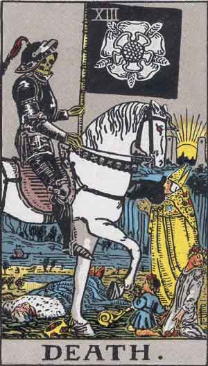
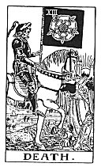
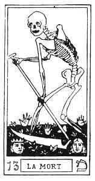

  
[Intangible Textual Heritage](../../index)  [Tarot](../index.md)  [Tarot
Reading](../pkt/tarot0)  [Index](index.md)  
[Previous](ar12)  [Next](ar14.md)

------------------------------------------------------------------------

# 13. Death

<table>
<colgroup>
<col style="width: 33%" />
<col style="width: 33%" />
<col style="width: 33%" />
</colgroup>
<tbody>
<tr class="odd">
<td data-valign="TOP"> 
Pamela Coleman Smith, 1909. 
Courtesy <a href="https://home.comcast.net/~vilex/">Holly Voley</a></td>
<td data-valign="TOP"> 
Pamela Coleman Smith. 
From the <a href="../pkt/pktar13">Pictorial Key to the Tarot</a>, 1911.</td>
<td data-valign="TOP">
 
 
Oswald Wirth 
From <a href="../tob/index">Tarot of the Bohemians</a>, 1896.

 
Marseilles Deck 
From <a href="../tob/index">Tarot of the Bohemians</a>, 1896.</td>
</tr>
</tbody>
</table>

------------------------------------------------------------------------

[Next: 14. Temperance](ar14.md)
