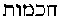

[Intangible Textual Heritage](../../index)  [Theosophy](../index) 
[Index](index)  [Previous](iu102)  [Next](iu104) 

------------------------------------------------------------------------

###### p. 167

### CHAPTER IV.

> "Nothing better than those **M**YSTERIES, by which, from a rough and
> fierce life, we  
> are polished to gentleness (humanity, kindness), and
> softened."--**C**ICERO: *de Legibus,* ii., 14.

> "Descend, O Soma, with that stream with which thou lightest up the
> Sun. . . .  
> Soma, a Life Ocean spread through All, thou fillest creative the Sun
> with beams."--*Rig-Veda,* ii., 143.

> ". . . the beautiful Virgin ascends, with long hair, and she holds two
> ears in her hand, and sits on a seat and feeds a **B**OY as yet
> little, and suckles him and gives him food."--**A**VENAR.

IT is alleged that the *Pentateuch* was written by Moses, and yet it
contains the account of his own death (*Deuteronomy* xxxiv. 6); and in
*Genesis* (xiv. 14), the name Dan is given to a city, which *Judges*
(xviii. 29), tells us was only called by that name at that late day, it
having previously been known as Laish. Well might Josiah have rent his
clothes when he had heard the words of the Book of the Law; for there
was no more of Moses in it than there is of Jesus in the

Gospel according to John.

We have one fair alternative to offer our theologians, leaving them to
choose for themselves, and promising to abide by their decision. Only
they will have to admit, either that Moses was an impostor, or that his
books are forgeries, written at different times and by different
persons; or, again, that they are full of fraudulent interpolations. In
either case the work loses all claims to be considered divine
*Revelation.* Here is the problem, which we quote from the *Bible--*the
word of the God of Truth:

"And I appeared unto Abraham, unto Isaac, and unto Jacob, by the name of
God Almighty, but by my name of **J**EHOVAH was I not known to them"
(*Exodus* vi. 3), spake God unto Moses.

A very startling bit of information that, when, before arriving at the
book of *Exodus,* we are told in *Genesis* (xxii. 14) that "Abraham
called the name of that place"--where the patriarch had been preparing
to cut the throat of his only-begotten son--"**J**EHOVAH-jireh"!
(Jehovah sees.) Which is the inspired text?--both cannot be--which the
forgery?

###### p. 168

Now, if both Abraham and Moses had not belonged to the same holy group,
we might, perhaps, help theologians by suggesting to them a convenient
means of escape out of this dilemma. They ought to call the reverend
Jesuit Fathers--especially those who have been missionaries in India--to
their rescue. The latter would not be for a moment disconcerted. They
would coolly tell us that beyond doubt Abraham had heard the name of
Jehovah and *borrowed* it from Moses. Do they not maintain that it was
they who invented the *Sanscrit,* edited *Manu,* and composed the
greater portion of the

Vedas?

Marcion maintained, with the other Gnostics, the fallaciousness of the
idea of an incarnate God, and therefore denied the corporeal reality of
the living body of Christ. His entity was a mere *illusion;* it was not
made of human flesh and blood, neither was it born of a human mother,
for his divine nature could not be polluted with any contact with sinful
flesh. [\*](#fn_286) He accepted Paul as the
only apostle preaching the pure gospel of truth, and accused the other
disciples of "depraving the pure form of the gospel doctrines delivered
to them by Jesus, mixing up matters of the Law with the words of the
Saviour." [\*\*](#fn_287)

Finally we may add that modern biblical criticism, which unfortunately
became really active and serious only toward the end of the last
century, now generally admits that Marcion's text of the only gospel he
knew anything about--that of Luke, is far superior and by far more
correct than that of our present Synoptics. We find in *Supernatural
Religion* the following (for every Christian) startling sentence: "We
are, therefore, *indebted to Marcion* for *the correct version even* of
*'the Lord's Prayer.*' " [\*\*\*](#fn_288)

If, leaving for the present the prominent founders of Christian sects,
we now turn to that of the Ophites, which assumed a definite form about
the time of Marcion and the Basilideans, we may find in it the reason
for the *heresies* of all others. Like all other Gnostics, they rejected
the Mosaic *Bible* entirely. Nevertheless, their philosophy, apart from
some deductions original with several of the most important founders of
the various branches of Gnosticism was not new. Passing through the
Chaldean kabalistic tradition, it gathered its materials in the Hermetic
books, and pursuing its flight still farther back for its metaphysical
speculations, we find it floundering among the tenets of Manu, and the
earliest Hindu ante-sacerdotal genesis. Many of our eminent antiquarians
trace the Gnostic philosophies right back to Buddhism, which does not
impair in

###### p. 169

the least either their or our arguments. We repeat again, *Buddhism is
but the primitive source of Brahmanism.* It is not against the primitive
*Vedas* that Gautama protests. It is against the sacerdotal and official
state religion of his country; and the Brahmans, who in order to make
room for and give authority to the castes, at a later period crammed the
ancient manuscripts with interpolated slokas, intended to prove that the
castes were predetermined by the Creator by the very fact that each
class of men was issued from a more or less noble limb of Brahma.
Gautama-Buddha's philosophy was that taught from the beginning of time
in the impenetrable secresy of the inner sanctuaries of the pagodas. We
need not be surprised, therefore, to find again, in all the fundamental
dogmas of the Gnostics, the metaphysical tenets of both Brahmanism and
Buddhism. They held that the *Old Testament* was the revelation of an
inferior being, a subordinate divinity, and did not contain a single
sentence of their *Sophia,* the Divine Wisdom. As to the *New
Testament,* it had lost its purity when the compilers became guilty of
interpolations. The revelation of divine truth was sacrificed by them to
promote selfish ends and maintain quarrels. The accusation does not seem
so very improbable to one who is well aware of the constant strife
between the champions of circumcision and the "Law," and the apostles
who had given up Judaism.

The Gnostic Ophites taught the doctrine of Emanations, so hateful to the
defenders of the unity in the trinity, and *vice versa.* The Unknown
Deity with them had *no name;* but his first female emanation was called
Bythos or Depth. [\*](#fn_289) It answered to
the Shekinah of the kabalists, the "Veil" which conceals the "Wisdom" in
the *cranium* of the highest of the *three* heads. As the Pythagorean
Monad, this *nameless* Wisdom was the *Source* of Light, and *Ennoia* or
Mind, is Light itself. The latter was also called the "Primitive Man,"
like the Adam Kadmon, or ancient Adam of the *Kabala.* Indeed, if man
was created after his likeness and in the image of God, then this God
was like his creature in shape and figure--hence, he is the "Primitive
man." The first Manu, the one evolved from Swayambhuva, "he who exists
unrevealed in his own glory," is also, in one sense, the primitive man,
with the Hindus.

Thus the "nameless and the unrevealed," Bythos, his female reflection,
and Ennoia, the revealed Mind proceeding from both, or their Son are the
counterparts of the Chaldean first triad as well as those of the
Brahmanic Trimurti. We will compare: in all the three systems we see

###### p. 170

THE GREAT FIRST CAUSE as the ONE, the primordial germ, the unrevealed
and grand ALL, existing through himself. In the

> INDIAN PANTHEON. Brahma-Zyaus.

> THE CHALDEAN. Ilu, Kabalistic En-Soph.

> IN THE OPHITE. The Nameless, or Secret Name.

Whenever the Eternal awakes from its slumber and desires to manifest
itself, it divides itself into male and female. It then becomes in every
system

> THE DOUBLE-SEXED DEITY, The universal Father and Mother.

> IN INDIA. Brahma. Nara (male), Nari (female).

> IN CHALDEA. Eikon or En-Soph. Anu (male), Anata (female).

> IN THE OPHITE SYSTEM. Nameless Spirit. Abrasax (male), Bythos
> (female).

From the union of the two emanates a third, or creative Principle--the
SON, or the manifested Logos, the product of the Divine Mind.

> IN INDIA. Viradj, the Son.

> IN CHALDEA. Bel, the Son.

> OPHITE SYSTEM. Ophis (another name for Ennoia), the Son.

Moreover, each of these systems has a triple male trinity, each
proceeding separately through itself from one female Deity. So, for
instance:

> IN INDIA. The Trinity--Brahma, Vishnu, Siva, are blended into ONE, who
> is Brahma (neuter gender), creating and being created through the
> Virgin Nari (the mother of perpetual fecundity).

> IN CHALDEA. The trinity--Anu, Bel, Hoa (or Sin, Samas, Bin), blend
> into ONE who is Anu (double-sexed) through the Virgin Mylitta.

> IN THE OPHITE SYSTEM. The trinity consisted of the Mystery named Sige,
> Bythos, Ennoia. These become ONE who is Abrasax, from the Virgin
> Sophia (or Pneuma), who herself is an emanation of Bythos and the
> Mystery-god and emanates through them, Christos.

To place it still clearer, the Babylonian System recognizes first--the
ONE (Ad, or Ad-ad), who is never named, but only acknowledged in thought
as the Hindu Swayambhuva. From this he becomes manifest as Anu or
Ana--the one above all--Monas. Next comes the Demiurge called Bel or
Elu, who is the active power of the Godhead. The third is the principle
of Wisdom, Hea or Hoa, who also rules the sea and the underworld. Each
of these has his divine consort, giving us Anata, Belta,

###### p. 171

and Davkina. These, however, are only like the *Saktis,* and not
especially remarked by theologists. But the female principle is denoted
by Mylitta, the Great Mother, called also Ishtar. So with the three male
gods, we have the Triad or Trimurti, and with Mylitta added, the *Arba*
or Four (Tetraktys of Pythagoras), which perfects and potentializes all.
Hence, the above-given modes of expression. The following Chaldean
diagram may serve as an illustration for all others:

Triad / Anu, Bel, Hoa. / Mylitta--Arba-il, or Four-fold God,

become, with the Christians,

Trinity / God the Father, God the Son, God the Holy Ghost, / Mary, or
mother of these three Gods since they are one, or, the Christian
Heavenly Tetraktys.

Hence, Hebron, the city of the Kabeiri was called Kirjath-Arba, city of
the Four. The Kabeiri were Axieros--the noble Eros, Axiokersos, the
worthy horned one, Axiokersa, Demeter and Kadmiel, Hoa, etc.

The Pythagorean ten denoted the Arba-Il or Divine Four, emblematized by
the Hindu Lingham: Anu, 1; Bel, 2; Hoa, 3, which makes 6. The triad and
Mylitta as 4 make the ten.

Though he is termed the "Primitive Man," Ennoia, who is like the
Egyptian Pimander, the "Power of the Thought Divine," the first
intelligible manifestation of the Divine Spirit in material form, he is
like the "Only-Begotten" Son of the "Unknown Father," of all other
nations. He is the emblem of the first appearance of the divine Presence
in his own works of creation, tangible and visible, and therefore
comprehensible. The mystery-God, or the ever-unrevealed Deity fecundates
through His will Bythos, the unfathomable and infinite depth that exists
in silence (Sige) and darkness (for our intellect), and that represents
the abstract idea of all nature, the ever-producing Cosmos. As neither
the male nor female principle, blended into the idea of a double-sexed
Deity in ancient conceptions, could be comprehended by an ordinary human
intellect, the theology of every people had to create for its religion a
Logos, or manifested word, in some shape or other. With the Ophites and
other Gnostics who took their models direct from more ancient originals,
the unrevealed Bythos and her male counterpart produce Ennoia, and the
three in their turn produce Sophia, [\*](#fn_290) thus completing the Tetraktys, which
will emanate Christos, the very essence of the Father Spirit. As

###### p. 172

the unrevealed One, or concealed Logos in its latent state, he has
existed from all eternity in the Arba-Il, the metaphysical abstraction;
therefore, he is ONE with all others as a unity, the latter (including
all) being indifferently termed Ennoia, Sige (silence), Bythos, etc. As
the revealed one, he is Androgyne, Christos, and Sophia (Divine Wisdom),
who descend into the man Jesus. Both Father and Son are shown by
Irenaeus to have loved the beauty (*formam*) of the primitive
woman, [\*](#fn_291) who is Bythos--Depth--as
well as Sophia, and as having produced conjointly Ophis and Sophia
(double-sexed unity again), male and female wisdom, one being considered
as the unrevealed Holy Spirit, or elder Sophia--the *Pneuma--*the
intellectual "Mother of all things"; the other the revealed one, or
*Ophis,* typifying divine wisdom fallen into matter, or God-man--Jesus,
whom the Gnostic Ophites represented by the serpent (Ophis).

Fecundated by the Divine Light of the Father and Son, the highest spirit
and Ennoia, Sophia produces in her turn two other emanations--one
perfect Christos, the second imperfect Sophia-Achamoth, [\*\*](#fn_292) from 
 hakhamoth (simple wisdom), who becomes the
mediatrix between the intellectual and material worlds.

Christos was the mediator and guide between God (the Higher), and
everything spiritual in man; Achamoth--the younger Sophia--held the same
duty between the "Primitive man," Ennoia and matter. What was
mysteriously meant by the general term, *Christos,* we have just
explained.

Delivering a sermon on the "Month of Mary," we find the Rev. Dr.
Preston, of New York City, expressing the Christian idea of the female
principle of the trinity better and more clearly than we could, and
substantially in the spirit of an ancient "heathen" philosopher. He says
that the "plan of the redemption made it necessary that a mother should
be found, and Mary stands pre-eminently alone as the only instance when
a creature was necessary to the consummation of God's work." We will beg
the right to contradict the reverend gentleman. As shown above,
thousands of years before our era it was found necessary by all the
"heathen" theogonies to find a female principle, a "mother" for the
triune male principle. Hence, Christianity does not present the "only
instance" of such a consummation of God's work--albeit, as this work
shows, there was more philosophy and less materialism, or rather
anthropomorphism, in it. But hear the reverend Doctor express "heathen"
thought in

###### p. 173

Christian ideas. "He" (God), he says, "prepared her (Mary's) virginal
and celestial purity, for a mother defiled could not become the mother
of the Most High. The holy virgin, even in her childhood, was more
pleasing than all the Cherubim and Seraphim, and from infancy to the
maturing maidenhood and womanhood she grew more and more pure. By her
very sanctity she reigned over the heart of God. *When the hour came,
the whole court of heaven was hushed, and the trinity listened for the
answer of Mary, for without her consent the world could not have been
redeemed*."

Does it not seem as if we were reading Irenaeus explaining the Gnostic
"*Heresy*, which taught that the Father and Son loved the beauty
(*formam*) of the celestial Virgin"? or the Egyptian system, of Isis
being both wife, sister, and mother of Osiris-Horus? With the Gnostic
philosophy there were but *two,* but the Christians have improved and
perfected the system by making it completely "heathen," for it is the
Chaldean Anu--Bel--Hoa, merging into Mylitta. "Then while this month (of
Mary)," adds Dr. Preston, "begins in the paschal season--the month when
nature decks herself with fruits and flowers, the harbingers of a bright
harvest--let us, too, begin for a golden harvest. In this month the dead
come up out of the earth, figuring the resurrection; so, when we are
kneeling before the altar of the holy and immaculate Mary, let us
remember that there should come forth from us the bud of promise, the
flower of hope, and the imperishable fruit of sanctity."

This is precisely the substratum of the Pagan thought, which, among
other meanings, emblematized by the rites of the resurrection of Osiris,
Adonis, Bacchus, and other slaughtered sun-gods, the resurrection of all
nature in spring, the germination of seeds that had been dead and
sleeping during winter, and so were allegorically said to be kept in the
underworld (Hades). They are typified by the three days passed in hell
before his resurrection by Hercules, by Christ, and others.

This derivation, or rather *heresy,* as it is called in Christianity, is
simply the Brahmanic doctrine in all its archaic purity. Vishnu, the
second personage of the Hindu trinity, is also the Logos, for he is made
subsequently to incarnate himself in Christna. And Lakmy (or Lakshmy)
who, as in the case of Osiris and Isis, of En-Soph and Sephira, and of
Bythos and Ennoia, is both his wife, sister, and daughter, through this
endless correlation of male and female creative powers in the abstruse
metaphysics of the ancient philosophies--is Sophia-Achamoth. Christna is
the mediator promised by Brahma to mankind, and represents the same idea
as the Gnostic Christos. And Lakmy, Vishnu's spiritual half, is the
emblem of physical nature, the universal mother of all the material and
revealed forms; the mediatrix and protector of nature, like
Sophia-Achamoth, who is made by the Gnostics the mediatrix between the
Great

###### p. 174

Cause and Matter, as Christos is the mediator between him and spiritual
humanity.

This Brahmano-Gnostic tenet is more logical, and more consistent with
the allegory of *Genesis* and the fall of man. When God curses the first
couple, He is made to curse also the earth and everything that is on it.
The *New Testament* gives us a Redeemer for the first sin of mankind,
which was punished for having sinned; but there is not a word said about
a Saviour who would take off the unmerited curse from the earth and the
animals, which had never sinned at all. Thus the Gnostic allegory shows
a greater sense of both justice and logic than the Christian.

In the Ophite system, Sophia, the Androgyne Wisdom, is also the female
spirit, or the Hindu female Nari (Narayana), moving on the face of the
waters--chaos, or future matter. She vivifies it from afar, but not
touching the abyss of darkness. She is unable to do so, for Wisdom is
purely intellectual, and cannot act directly on matter. Therefore,
Sophia is obliged to address herself to her Supreme Parent; but although
life proceeds primally from the Unseen Cause, and his Ennoia, neither of
them can, any more than herself, have anything to do with the lower
chaos in which matter assumes its definite shape. Thus, Sophia is
obliged to employ on the task her *imperfect* emanation,
Sophia-Achamoth, the latter being of a mixed nature, half spiritual and
half material.

The only difference between the Ophite cosmogony and that of the St.
John Nazarenes is a change of names. We find equally an identical system
in the *Kabala, the Book of Mystery* (*Liber Mysterii*). [\*](#fn_293) All the three systems, especially that
of the kabalists and the Nazarenes, which were the *models* for the
Ophite Cosmogony, belong to the pure Oriental Gnosticism. The *Codex
Nazaraeus* opens with: "The Supreme King of Light, Mano, the great first
one," [\*\*](#fn_294) etc., the latter being
the emanation of Ferho--the unknown, formless **L**IFE. He is the chief
of the Æons, from whom proceed (or shoot forth) five refulgent rays of
Divine light. Mano is *Rex Lucis,* the Bythos-Ennoia of the Ophites.
"*Unus est Rex Lucis in suo regno, nec ullus qui eo altior, nullus qui
ejus similitudinem retulerit, nullus qui sublatis oculis, viderit
Coronam quae in ejus capite est.*" He is the Manifested Light around the
highest of the three kabalistic heads, the concealed wisdom; from him
emanate the three *Lives.* Æbel Zivo is the revealed Logos, Christos the
"Apostle Gabriel," and the first Legate or messenger of light. If Bythos
and Ennoia are the Nazarene Mano, then the dual-natured, the
semi-spiritual, semi-material Achamoth must be Fetahil when viewed from
her spiritual aspect; and if regarded in her grosser nature, she is the
Nazarene "Spiritus."

###### p. 175

Fetahil, [\*](#fn_295) who is the reflection of
his father, Lord Abatur, the *third* life--as the elder Sophia is also
the third emanation--is the "newest-man." Perceiving his fruitless
attempts to create a perfect material world, the "Spiritus" calls to one
of her progeny, the Karabtanos--Ilda-Baoth--who is without sense or
judgment ("blind matter"), to unite himself with her to create something
definite out of this confused (*turbulentos*) matter, which task she is
enabled to achieve only after having produced from this union with
Karabtanos the seven stellars. Like the six sons or genii of the Gnostic
Ilda-Baoth, they then frame the material world. The same story is
repeated over again in Sophia-Achamoth. Delegated by her purely
spiritual parent, the elder Sophia, to create the world of *visible
forms,* she descended into chaos, and, overpowered by the emanation of
matter, lost her way. Still ambitious to create a world of matter of her
own, she busied herself hovering to and fro about the dark abyss, and
imparted life and motion to the inert elements, until she became so
hopelessly entangled in matter that, like Fetahil, she is represented
sitting immersed in mud, and unable to extricate herself from it; until,
by the contact of matter itself, she produces the *Creator* of the
material world. He is the Demiurgus, called by the Ophites Ilda-Baoth,
and, as we will directly show, the parent of the Jewish God in the
opinion of some sects, and held by others to be the "Lord God" Himself.
It is at this point of the kabalistic-gnostic cosmogony that begins the
Mosaic *Bible.* Having accepted the Jewish *Old Testament* as their
standard, no wonder that the Christians were forced by the exceptional
position in which they were placed through their own ignorance, to make
the best of it.

The first groups of Christians, whom Renan shows numbering but from
seven to twelve men in *each church,* belonged unquestionably to the
poorest and most ignorant classes. They had and could have no idea of
the highly philosophical doctrines of the Platonists and Gnostics, and
evidently knew as little about their own newly-made-up religion. To
these, who if Jews, had been crushed under the tyrannical dominion of
the "law," as enforced by the elders of the synagogues, and if Pagans
had been always excluded, as the lower castes are until now in India,
from the religious mysteries, the God of the Jews and the "Father"
preached by Jesus were all one. The contentions which reigned from the
first years following the death of Jesus, between the two parties, the
Pauline and the Petrine--were deplorable. What one did, the other deemed

###### p. 176

a sacred duty to undo. If the *Homilies* are considered apocryphal, and
cannot very well be accepted as an infallible standard by which to
measure the animosity which raged between the two apostles, we have the
*Bible,* and the proofs afforded therein are plentiful.

So hopelessly entangled seems Irenaeus in his fruitless endeavors to
describe, to all outward appearance at least, the true doctrines of the
many Gnostic sects of which he treats and to present them at the same
time as abominable "heresies," that he either deliberately, or through
ignorance, confounds all of them in such a way that few metaphysicians
would be able to disentangle them, without the *Kabala* and the *Codex*
as the true keys. Thus, for instance, he cannot even tell the difference
between the Sethianites and the Ophites, and tells us that they called
the "God of all," "*Hominem,*" a MAN, and his mind the SECOND man, or
the "*Son of man.*" So does Theodoret, who lived more than two centuries
after Irenaeus, and who makes a sad mess of the chronological order in
which the various sects succeeded each other. [\*](#fn_296) Neither the Sethianites, (a branch of
the Jewish Nazarenes) nor the Ophites, a purely Greek sect, have ever
held anything of the kind. Irenaeus contradicts his own words by
describing in another place the doctrines of Cerinthus, the direct
disciple of Simon Magus. He says that Cerinthus taught that the world
was not created by the FIRST **GOD**, but by a virtue (virtus) or power,
an Æon so distant from the First Cause that he was even ignorant of HIM
who *is above all things.* This Æon subjected Jesus, he begot him
physically through Joseph from one who was not a virgin, but simply the
wife of that Joseph, and Jesus was born like all other men. Viewed from
this physical aspect of his nature, Jesus was called the "son of man."
It is only after his *baptism,* that *Christos,* the anointed, descended
from the Princeliness of above, in the figure of a dove, and then
announced the UNKNOWN Father through Jesus. [\*\*](#fn_297)

If, therefore, Jesus was physically considered as a son of man, and
spiritually as the Christos, who overshadowed him, how then could the
"GOD OF ALL," the "*Unknown* Father," be called by the Gnostics *Homo,*
a MAN, and his Mind, Ennoia, the SECOND man, or *Son of man?* Neither in
the Oriental *Kabala,* nor in Gnosticism, was the "God of all" ever
anthropomorphized. It is but the first, or rather the second emanations,
for Shekinah, Sephira, Depth, and other first-manifested female virtues
are also emanations, that are termed "primitive men." Thus Adam Kadmon,
Ennoia (or Sige), the *logoi* in short, are the "only-begotten" ones but
not the *Sons* of man, which appellation properly belongs to

###### p. 177

Christos the son of Sophia (the elder) and of the primitive man who
produces him through his own vivifying light, which emanates from the
source or *cause* of all, hence the *cause* of his light also, the
"Unknown Father." There is a great difference made in the Gnostic
metaphysics between the first unrevealed Logos and the "anointed," who
is Christos. Ennoia may be termed, as Philo understands it, the *Second*
God, but he alone is the "Primitive and First man," and by no means the
Second one, as Theodoret and Irenaeus have it. It is but the inveterate
desire of the latter to connect Jesus in every possible way, even in the
*Haeresies,* with the *Highest* God, that led him into so many
falsifications.

Such an identification with the *Unknown* God, even of Christos, the
anointed--the Æon who overshadowed him--let alone of the man Jesus,
never entered the head of the Gnostics nor even of the direct apostles
and of Paul, whatever later forgeries may have added.

How daring and desperate were many such deliberate falsifications was
shown in the first attempts to compare the original manuscripts with
later ones. In Bishop Horseley's edition of Sir Isaac Newton's works,
several manuscripts on theological subjects were cautiously withheld
from publication. The article known as *Christ's Descent into Hell,*
which is found in the later Apostles' Creed, is not to be found in the
manuscripts of either the fourth or sixth centuries. It was an evident
interpolation copied from the fables of Bacchus and Hercules and
enforced upon Christendom as an article of faith. Concerning it the
author of the preface to the *Catalogue of the Manuscripts of the King's
Library* (preface, p. xxi.) remarks: "I wish that the insertion of the
article of *Christ's Descent into Hell* into the Apostles' Creed could
be as well accounted for as the *insertion* of the *said* verse" (*First
Epistle of John,* v. 7). [\*](#fn_298)

Now, this verse reads: "For there are three that bear record in Heaven,
the Father, the Word and the Holy Ghost; and these three are one." This
verse, which has been "appointed to be read in churches," is now known
to be spurious. It is not to be found in any Greek manuscript," save one
at Berlin, which was transcribed from some interpolated paraphrase
between the lines. In the first and second editions of Erasmus, printed
in 1516 and 1519, this allusion to these three heavenly witnesses is
*omitted;* and the text is not contained in any Greek manuscript which
was written earlier than the fifteenth century. [\*\*](#fn_299) It was not

###### p. 178

mentioned by either of the Greek ecclesiastical writers nor by the early
Latin fathers, so anxious to get at every proof in support of their
trinity; and it was omitted by Luther in his German version. Edward
Gibbon was early in pointing out its spurious character. Archbishop
Newcome rejected it, and the Bishop of Lincoln expresses his conviction
that it is spurious. [\*](#fn_300) There are
twenty-eight Greek authors--Irenaeus, Clemens, and Athanasius included,
who neither quote nor mention it; and seventeen Latin writers, numbering
among them Augustine, Jerome, Ambrosius, Cyprian, and Pope Eusebius, who
appear utterly ignorant of it. "It is evident that if the text of the
heavenly witnesses had been known from the beginning of Christianity the
ancients would have eagerly seized it, inserted it in their creeds,
quoted it repeatedly against the heretics, and selected it for the
brightest ornament of every book that they wrote upon the subject of the
Trinity." [\*\*](#fn_301)

Thus falls to the ground the strongest trinitarian pillar. Another not
less obvious forgery is quoted from Sir Isaac Newton's words by the
editor of the *Apocryphal New Testament.* Newton observes "that what the
Latins have done to this text (*First Epistle of John,* v.), the Greeks
have done to that of St. Paul (*Timothy* iii. 16). For, by changing ο
into θ, the abbreviation of θεοσ (God), in the Alexandrian manuscript,
from which their subsequent copies were made, they now read, "*Great is
the mystery of godliness,* **G**OD *manifested in the flesh*"; whereas
all the churches, for the first four or five centuries, and the authors
of all the ancient versions, Jerome, as well as the rest, read: "Great
is the mystery of godliness WHICH WAS *manifested in the flesh.*" Newton
adds, that now that the disputes over this forgery are over, they that
read **G**OD made manifest in the flesh, instead of the *godliness which
was* manifested in the flesh, think this passage "one of the most
obvious and pertinent texts for the business."

And now we ask again the question: Who were the first Christians? Those
who were readily converted by the eloquent simplicity of Paul, who
promised them, with the name of Jesus, *freedom* from the narrow bonds
of ecclesiasticism. They understood but one thing; they were the
"children of promise" (*Galatians* iv. 28). The "allegory" of the Mosaic
*Bible* was unveiled to them; the covenant "from the Mount Sinai which
gendereth *to bondage*" was Agar (Ibid., 24), the old Jewish synagogue,
and she was "in bondage with her children" to Jerusalem, the new and the
free, "the mother of us all." On the one hand the synagogue and the law
which persecuted every one who dared to step across the narrow

###### p. 179

path of bigotry and dogmatism; on the other, Paganism [\*](#fn_302) with its grand philosophical truths
concealed from sight; unveiling itself but to the few, and leaving the
masses hopelessly seeking to discover who was *the* god, among this
overcrowded pantheon of deities and sub-deities. To others, the apostle
of circumcision, supported by all his followers, was promising, if they
obeyed the "law," a life hereafter, and a resurrection of which they had
no previous idea. At the same time he never lost an occasion to
contradict Paul without naming him, but indicating him so clearly that
it is next to impossible to doubt whom Peter meant. While he may have
converted some men, who whether they had believed in the Mosaic
resurrection promised by the Pharisees, or had fallen into the
nihilistic doctrines of the Sadducees, or had belonged to the
polytheistic heathenism of the Pagan rabble, had no future after death,
nothing but a mournful blank, we do not think that the work of
contradiction, carried on so systematically by the two apostles, had
helped much their work of proselytism. With the educated thinking
classes they succeeded very little, as ecclesiastical history clearly
shows. Where was the truth; where the inspired word of God? On the one
hand as we have seen, they heard the apostle Paul explaining that of the
two covenants, "which things are an allegory," the old one from Mount
Sinai, "which gendereth unto bondage," was *Agar* the bondwoman; and
Mount Sinai itself answered to "Jerusalem," which now is "in bondage"
with her circumcised children; and the new covenant meant Jesus
Christ--the "Jerusalem which is above and free"; and on the other Peter,
who was contradicting and even abusing him. Paul vehemently exclaims,
"Cast out the bondwoman and her son" (the old *law* and the synagogue).
"The son of the bondwoman shall not be heir with the son of

###### p. 180

the free woman." "Stand fast, therefore, in the liberty wherewith Christ
hath made us free; be not entangled again with the yoke of bondage. . .
. Behold, I Paul say unto you, that if ye be circumcised, Christ shall
profit you nothing!" (*Gal.* v. 2). What do we find Peter writing? Whom
does he mean by saying, "These who speak great swelling words of vanity.
. . . While they promise them *liberty,* they themselves are servants of
corruption, for of whom a man is overcome, of the same is he brought in
bondage. . . . For if *they have escaped* the pollution of the world
through the knowledge of the Lord and Saviour, they are again entangled
therein, and overcome . . . it had *been better for them not to have
known the way of righteousness,* than after they have known it to turn
from the holy *commandment delivered unto them*" (*Second Epistle*)

.

Peter certainly cannot have meant the Gnostics, for they had never seen
"the holy commandment delivered unto them"; Paul had. They never
promised any one "liberty" from bondage, but Paul had done so
repeatedly. Moreover the latter rejects the "old covenant," Agar the
bondwoman; and Peter holds fast to it. Paul warns the people against the
*powers* and *dignities* (the lower angels of the kabalists); and Peter,
as will be shown further, respects them and *denounces those who do
not.* Peter preaches circumcision, and Paul forbids it.

Later, when all these extraordinary blunders, contradictions,
dissensions and inventions were forcibly crammed into a frame
elaborately executed by the episcopal caste of the new religion, and
called Christianity; and the chaotic picture itself cunningly preserved
from too close scrutiny by a whole array of formidable Church penances
and anathemas, which kept the curious back under the false pretense of
sacrilege and profanation of divine mysteries; and millions of people
had been butchered in the name of the God of mercy--then came the
Reformation. It certainly deserves its name in its fullest paradoxical
sense. It abandoned Peter and alleges to have chosen Paul for its only
leader. And the apostle who thundered against the old law of bondage;
who left full liberty to Christians to either observe the Sabbath or set
it aside; who rejects everything anterior to John the Baptist, is now
the professed standard-bearer of Protestantism, which holds to the *old*
law more than the Jews, imprisons those who view the Sabbath as Jesus
and Paul did, and outvies the synagogue of the first century in dogmatic
intolerance!

But who then *were* the first Christians, may still be asked? Doubtless
the Ebionites; and in this we follow the authority of the best critics.
"There can be little doubt that the author (of the *Clementine
Homilies*) was a representative of Ebionitic Gnosticism, which *had once
been the* 

###### p. 181

*purest form of primitive Christianity*. . . ." [\*](#fn_303) And who were the Ebionites? The pupils
and followers of the early Nazarenes, the kabalistic Gnostics. In the
preface to the *Codex Nazaraeus,* the translator says: "That also the
Nazarenes did not reject . . . the Æons is natural. For of the Ebionites
who acknowledged them (the Æons), these were the instructors." [\*\*](#fn_304)

We find, moreover, Epiphanius, the Christian Homer of *The Heresies,*
telling us that "Ebion had the opinion of the Nazarenes, the form of the
Cerinthians (who fable that the world was put together by angels), and
the appellation of Christians." [\*\*\*](#fn_305) An appellation certainly more
correctly applied to them than to the orthodox (so-called) Christians of
the school of Irenaeus and the later Vatican. Renan shows the Ebionites
numbering among their sect all the surviving relatives of Jesus. John
the Baptist, his cousin and *precursor,* was the accepted Saviour of the
Nazarenes, and their prophet. His disciples dwelt on the other side of
the Jordan, and the scene of the baptism of the Jordan is clearly and
beyond any question proved by the author of *Sod, the Son of the Man,*
to have been the site of the Adonis-worship. [\*\*\*\*](#fn_306) "Over the Jordan and beyond the
lake dwelt the Nazarenes, a sect said to have existed already at the
birth of Jesus, and to have counted him among its number. They must have
extended along the east of the Jordan, and southeasterly among the
Arabians (*Galat.* i. 17, 21; ii. 11), and Sabaeans in the direction of
Bosra; and again, they must have gone far north over the Lebanon to
Antioch, also to the northeast to the Nazarian settlement in Beroea,
where St. Jerome found them. In the desert the Mysteries of Adonis may
have still prevailed; in the mountains Aiai Adonai was still a
cry." [\*\*\*\*\*](#fn_307)

"Having been united (conjunctus) to the Nazarenes, each (Ebionite)
imparted to the other out of his own wickedness, and decided that Christ
*was of the seed of a man,*" writes Epiphanius.

And if they did, we must suppose they knew more about their contemporary
prophet than Epiphanius 400 years later. Theodoret, as shown elsewhere,
describes the Nazarenes as Jews who "honor the Anointed as a just man,"
and use the *evangel* called "*According to Peter.*" Jerome finds the
authentic and original *evangel*, written in Hebrew, by Matthew the
apostle-publican, in the library collected at Caesarea, by the martyr
Pamphilius. "*I received permission from the Nazaraeans,* who at Beroea
of Syria used this (gospel) to translate it," he

###### p. 182

writes toward the end of the fourth century. [\*](#fn_308) "In the *evangel* which the *Nazarenes*
and *Ebionites* use," adds Jerome, "which recently I translated from
Hebrew into Greek, [\*\*](#fn_309) and which is
called by most persons the *genuine Gospel of Matthew,*" etc.

That the apostles had received a "secret doctrine" from Jesus, and that
he himself taught one, is evident from the following words of Jerome,
who confessed it in an unguarded moment. Writing to the Bishops
Chromatius and Heliodorus, he complains that "a difficult work is
enjoined, since this translation has been commanded me by your
Felicities, which *St. Matthew himself, the Apostle and Evangelist,* DID
NOT WISH TO BE OPENLY WRITTEN. For if it had not been SECRET, he
(Matthew) would have added to the *evangel* that which he gave forth was
his; but he made up this book sealed up in the Hebrew characters, which
he put forth *even in such a way* that the book, written in Hebrew
letters and *by the hand of himself,* might be possessed *by the men
most religious,* who also, in the course of time, received it from those
who preceded them. But this very book they never gave to any one to be
transcribed, and its *text* they related some one way and some
another." [\*\*\*](#fn_310) And he adds further
on the same page: "And it happened that this book, having been published
by a disciple of Manichaeus, named Seleucus, who also wrote falsely *The
Acts of the Apostles,* exhibited matter not for edification, but for
destruction; and that this book was approved in a synod which the ears
of the Church properly refused to listen to." [\*\*\*\*](#fn_311)

He admits, himself, that the book which he authenticates as being
written "*by the hand of Matthew*"; a book which, notwithstanding that

###### p. 183

he translated it twice, was nearly unintelligible to him, for it was
arcane or *a secret.* Nevertheless, Jerome coolly sets down every
commentary upon it, except his own, as *heretical.* More than that,
Jerome knew that this *original Gospel of Matthew* was the expounder of
the only true doctrine of Christ; and that it was the work of an
evangelist who had been the friend and companion of Jesus. He knew that
if of the two *Gospels,* the Hebrew in question and the Greek belonging
to our present Scripture, one was spurious, hence heretical, it was not
that of the Nazarenes; and yet, knowing all this, Jerome becomes more
zealous than ever in his persecutions of the "Haeretics." Why? Because
to accept it was equivalent to reading the death-sentence of the
established Church. The *Gospel according to the Hebrews* was but too
well known to have been the only one accepted for four centuries by the
Jewish Christians, the Nazarenes and the Ebionites. And neither of the
latter accepted the *divinity* of Christ.

If the commentaries of Jerome on the Prophets, his famous *Vulgate,* and
numerous polemical treatises are all as trustworthy as this version of
the *Gospel according to Matthew,* then we have a divine revelation
indeed.

Why wonder at the unfathomable mysteries of the Christian religion,
since it is perfectly *human*? Have we not a letter written by one of
the most respected Fathers of the Church to this same Jerome, which
shows better than whole volumes their traditionary policy? This is what
*Saint* Gregory of Nazianzen wrote to his friend and confidant *Saint*
Jerome: "Nothing can impose better on a people than *verbiage;* the less
they understand the more they admire. Our fathers and doctors have often
said, not what they thought, but what circumstances and necessity forced
them to."

But to return to our Sophia-Achamoth and the belief of the genuine,
primitive Christians.

After having produced Ilda-Baoth, Ilda from  , a child, and Baoth from
 , the egg, or  , *Baoth,* a waste, a
desolation, Sophia-Achamoth suffered so much from the contact with
matter, that after extraordinary struggles she escapes at last out of
the muddy chaos. Although unacquainted with the pleroma, the region of
her mother, she reached the middle space and succeeded in shaking off
the material parts which have stuck to her spiritual nature; after which
she immediately built a strong barrier between the world of
intelligences (spirits) and the world of matter. Ilda-Baoth, is thus the
"son of darkness," the creator of our sinful world (the physical portion
of it). He follows the example of Bythos and produces from himself six
stellar spirits (sons). They are all in his own image, and reflections
one of the other, which become darker

###### p. 184

as they successively recede from their father. With the latter, they all
inhabit seven regions disposed like a ladder, beginning under the middle
space, the region of their mother, Sophia-Achamoth, and ending with our
earth, the *seventh* region. Thus they are the genii of the seven
planetary spheres of which the lowest is the region of our earth (the
sphere which surrounds it, our aether). The respective names of these
genii of the spheres are *Iove* (*Jehovah*), *Sabaoth, Adonai, Eloi,
Ouraios, Astaphaios. [\*](#fn_312)* The first
four, as every one knows, are the mystic names of the Jewish "Lord
God," [\*\*](#fn_313) he being, as C. W. King
expresses it, "thus degraded by the Ophites into the appellations of the
subordinates of the Creator; the two last names are those of the genii
of fire and water."

Ilda-Baoth, whom several sects regarded as the God of Moses, was not a
pure spirit; he was ambitious and proud, and rejecting the spiritual
light of the middle space offered him by his mother Sophia-Achamoth, he
set himself to create a world of his own. Aided by his sons, the six
planetary genii, he fabricated man, but this one proved a failure. It
was a monster; soulless, ignorant, and crawling on all fours on the
ground like a material beast. Ilda-Baoth was forced to implore the help
of his spiritual mother. She communicated to him a ray of her divine
light, and so animated man and endowed him with a soul. And now began
the animosity of Ilda-Baoth toward his own creature. Following the
impulse of the divine light, man soared higher and higher in his
aspirations; very soon he began presenting not the image of his Creator
Ilda-Baoth but rather that of the Supreme Being, the "primitive man,"
Ennoia. Then the Derniurgus was filled with rage and envy; and fixing
his jealous eye on the abyss of matter, his looks envenomed with passion
were suddenly reflected in it as in a mirror; the reflection became
animate, and there arose out of the abyss Satan, serpent,
Ophiomorphos--"the embodiment of envy and of cunning. He is the union of
all that is most base in matter, with the hate, envy, and craft of a
spiritual intelligence." [\*\*\*](#fn_314)

After that, always in spite at the perfection of man, Ilda-Baoth created
the three kingdoms of nature, the mineral, vegetable, and animal, with
all evil instincts and properties. Impotent to annihilate the Tree of
Knowledge, which grows in his sphere as in every one of the planetary
regions, but bent upon detaching "man" from his spiritual protectress,
Ilda-Baoth forbade him to eat of its fruit, for fear it should reveal to
mankind

###### p. 185

the mysteries of the superior world. But Sophia-Achamoth, who loved and
protected the man whom she had animated, sent her own genius Ophis, in
the form of a serpent to induce man to transgress the selfish and unjust
command. And "man" suddenly became capable of comprehending the
mysteries of creation.

Ilda-Baoth revenged himself by punishing the first pair, for man,
through his *knowledge,* had already provided for himself a companion
out of his spiritual and material half. He imprisoned man and woman in a
dungeon of matter, in the body so unworthy of his nature, wherein man is
still enthralled. But Achamoth protected him still. She established
between her celestial region and "man," a current of divine light, and
kept constantly supplying him with this *spiritual* illumination.

Then follow allegories embodying the idea of dualism, or the struggle
between good and evil, spirit and matter, which is found in every
cosmoogony, and the source of which is again to be sought in India. The
types and antitypes represent the heroes of this Gnostic Pantheon,
borrowed from the most ancient mythopoeic ages. But, in these
personages, Ophis and Ophiomorphos, Sophia and Sophia-Achamoth,
Adam-Kadmon, and Adam, the planetary genii and the divine Æons, we can
also recognize very easily the models of our biblical copies--the
euhemerized patriarchs. The archangels, angels, virtues and powers, are
all found, under other names, in the *Vedas* and the Buddhistic system.
The Avestic Supreme Being, Zero-ana, or "Boundless Time," is the type of
all these Gnostic and kabalistic "Depths," "Crowns," and even of the
Chaldean En-Soph. The six Amshaspands, created through the "Word" of
Ormazd, the "First-Born," have their reflections in Bythos and his
emanations, and the antitype of Ormazd--Ahriman and his devs also enter
into the composition of Ilda-Baoth and his six *material,* though not
wholly evil, planetary genii.

Achamoth, afflicted with the evils which befall humanity,
notwithstanding her protection, beseeches the celestial mother
Sophia--her antitype-- to prevail on the unknown **D**EPTH to send down
Christos (the son and emanation of the "Celestial Virgin") to the help
of perishing humanity. Ilda-Baoth and his six sons of matter are
shutting out the divine light from mankind. Man must be saved.
Ilda-Baoth had already sent his own agent, John the Baptist, from the
race of Seth, whom he protects--as a prophet to his people; but only a
small portion listened to him--the Nazarenes, the opponents of the Jews,
on account of their worshipping Iurbo-Adunai. [\*](#fn_315) Achamoth had assured her son,
Ilda-Baoth, that the

###### p. 186

reign of Christos would be only temporal, and thus induced him to send
the forerunner, or precursor. Besides that, she made *him cause* the
birth of the *man* Jesus from the Virgin Mary, her own type on earth,
"for the creation of a material personage could only be the work of the
Demiurgus, not falling within the province of a higher power. As soon as
Jesus was born, Christos, the perfect, uniting himself with Sophia
(wisdom and spirituality), descended through the seven planetary
regions, assuming in each an analogous form, and concealing his true
nature from their genii, while he attracted into himself the sparks of
divine light which they retained in their essence. Thus, Christos
entered into the *man* Jesus at the moment of his baptism in the Jordan.
From that time Jesus began to work miracles; before that, he had been
completely ignorant of his mission." [\*](#fn_316)

Ilda-Baoth, discovering that Christos was bringing to an end his own
kingdom of matter, stirred up the Jews against him, and Jesus was put to
death. [\*\*](#fn_317) When on the Cross,
Christos and Sophia left his body and returned to their own sphere. The
material body of the man Jesus was abandoned to the earth, but he
himself was given a body made up of *aether* (astral soul).
"Thenceforward he consisted of merely *soul* and *spirit,* which was the
reason why the disciples did not recognize him after the resurrection.
In this spiritual state of a *simulacrum,* Jesus remained on earth for
eighteen months after he had risen. During this last sojourn, he
received from Sophia that perfect knowledge, that true Gnosis, *which he
communicated to the very few among the apostles* who were capable of
receiving the same."

"Thence, ascending up into the middle space, he sits on the right hand
of Ilda-Baoth, but unperceived by him, and there collects all the souls
which shall have been purified by the knowledge of Christ. When he has
collected all the spiritual light that exists in matter, out of
Ilda-Baoth's empire, the redemption will be accomplished and the world
will be destroyed. Such is the meaning of the re-absorption of all the
spiritual light into the pleroma or fulness, whence it originally
descended."

###### p. 187

The foregoing is from the description given by Theodoret and adopted by
King in his *Gnostics,* with additions from Epiphanius and Irenaeus. But
the former gives a very imperfect version, concocted partly from the
descriptions of Irenaeus, and partly from his own knowledge of the later
Ophites, who, toward the end of the third century, had blended already
with several other sects. Irenaeus also confounds them very frequently,
and the real theogony of the Ophites is given by none of them correctly.
With the exception of a change in names, the above-given theogony is
that of all the Gnostics, and also of the Nazarenes. Ophis is but the
successor of the Egyptian *Chnuphis,* the Good Serpent with a lion's
radiating head, and was held from days of the highest antiquity as an
emblem of wisdom, or Thauth, the instructor and Saviour of humanity, the
"Son of God." "Oh men, live soberly . . . win your immortality" exclaims
Hermes, the thrice-great Trismegistus. "Instructor and guide of
humanity, I will lead you on to salvation." Thus the oldest sectarians
regarded Ophis, the Agathodaemon, as identical with Christos; the
serpent being the emblem of celestial wisdom and eternity, and, in the
present case, the antitype of the Egyptian Chnuphis-serpent. These
Gnostics, the earliest of our Christian era, held: "That the supreme
Æon, having emitted other Æons out of himself, one of them, a female,
*Prunnikos* (concupiscence), descended into the chaos, whence, unable to
escape, she remained suspended in the mid-space, being too clogged by
matter to return above, and not falling lower where there was nothing in
affinity with her nature. She then produced her son Ilda-Baoth, the God
of the Jews, who, in his turn, produced seven Æons, or angels, [\*](#fn_318) who created the seven heavens."

In this plurality of heavens the Christians believed from the first, for
we find Paul teaching of their existence, and speaking of a man "caught
up to the *third* heaven" (2 *Corin.,* xiii.). "From these seven angels
Ilda-Baoth shut up all that was above him, lest they should know of
anything superior to himself. [\*\*](#fn_319)
They then created man in the image of their Father, [\*\*\*](#fn_320) but prone and crawling on the earth
like a worm. But the heavenly mother, Prunnikos, wishing to deprive
Ilda-Baoth of the power

###### p. 188

with which she had unwittingly endowed him, infused into man a celestial
spark--the spirit. Immediately man rose upon his feet, soared in mind
beyond the limits of the seven spheres, and glorified the Supreme
Father, *Him that is above Ilda-Baoth.* Hence, the latter, full of
jealousy, cast down his eyes upon the lowest stratum of matter, and
begot a potency in the form of a serpent, whom they (the Ophites) call
his son. Eve, obeying him as the son of God, was persuaded to eat of the
Tree of Knowledge. [\*](#fn_321) It is a
self-evident fact that the serpent of the *Genesis,* who appears
suddenly and without any preliminary introduction, must have been the
antitype of the Persian Arch-Devs, whose head is Ash-Mogh, the
"two-footed serpent of lies." If the *Bible*-serpent had been deprived
of his limbs before he had tempted woman unto sin, why should God
specify as a punishment that he should go "upon his belly"? Nobody
supposes that he walked upon the extremity of his tail.

This controversy about the supremacy of Jehovah, between the Presbyters
and Fathers on the one hand, and the Gnostics, the Nazarenes, and all
the sects declared heterodox, as a last resort, on the other, lasted
till the days of Constantine, and later. That the peculiar ideas of the
Gnostics about the *genealogy* of Jehovah, or the proper place that had
to be assigned, in the Christian-Gnostic Pantheon, to the God of the
Jews, were at first deemed neither blasphemous nor heterodox is evident
in the difference of opinions held on this question by Clemens of
Alexandria, for instance, and Tertullian. The former, who seems to have
known of Basilides better than anybody else, saw nothing heterodox or
blamable in the mystical and transcendental views of the new Reformer.
"In his eyes," remarks the author of *The Gnostics,* speaking of
Clemens, "Basilides was not a heretic, *i.e.*, an innovator as regards
the doctrines of the Christian Church, but a mere theosophic
philosopher, who sought to express *ancient truths* under new forms, and
perhaps to combine them with the new faith, the truth of which he could
admit without necessarily renouncing the old, exactly as is the case
with the learned Hindus of our day." [\*\*](#fn_322)

Not so with Irenaeus and Tertullian. [\*\*\*](#fn_323) The principal works of the latter
*against the Heretics,* were written after his separation from the
Catholic Church, when he had ranged himself among the zealous followers
of Montanus; and teem with unfairness and bigoted prejudice. [\*\*\*\*](#fn_324)

p. 189

He has exaggerated every Gnostic opinion to a monstrous absurdity, and
his arguments are not based on coercive reasoning but simply on the
blind stubbornness of a partisan fanatic. Discussing Basilides, the
"pious, god-like, theosophic philosopher," as Clemens of Alexandria
thought him, Tertullian exclaims: "After this, Basilides, the *heretic,*
broke loose. [\*](#fn_325) He asserted that
there is a Supreme God, by name Abraxas, by whom Mind was created, whom
the Greeks call *Nous.* From her emanated the Word; from the Word,
Providence; from Providence, Virtue and Wisdom; from these two again,
Virtues, *Principalities, [\*\*](#fn_326) and
Powers* were made; thence infinite productions and emissions of angels.
Among the lowest angels, indeed, and those that made this world, he sets
*last of all* the god of the Jews, whom he denies to be God himself,
affirming that he is but one of the angels." [\*\*\*](#fn_327)

It would be equally useless to refer to the direct apostles of Christ,
and show them as holding in their controversies that Jesus never made
any difference between his "Father" and the "Lord-God" of Moses. For the
*Clementine Homilies,* in which occur the greatest argumentations upon
the subject, as shown in the disputations alleged to have taken place
between Peter and Simon the Magician, are now also proved to have been
falsely attributed to Clement the Roman. This work, if written by an
Ebionite--as the author of *Supernatural Religion* declares in common
with some other commentators [\*\*\*\*](#fn_328)--must have been written either
far later than the Pauline period, generally assigned to it, or the
dispute

###### p. 190

about the identity of Jehovah with God, the "Father of Jesus," have been
distorted by later interpolations. This disputation is in its very
essence antagonistic to the early doctrines of the Ebionites. The
latter, as demonstrated by Epiphanius and Theodoret, were the direct
followers of the Nazarene sect [\*](#fn_329)
(the Sabians), the "Disciples of John." He says, unequivocally, that the
Ebionites believed in the *Æons* (emanations), that the Nazarenes were
*their instructors,* and that "each imparted to the other out of his own
wickedness." Therefore, holding the same beliefs as the Nazarenes did,
an Ebionite would not have given even so much chance to the doctrine
supported by Peter in the *Homilies.* The old Nazarenes, as well as the
later ones, whose views are embodied in the *Codex Nazaraseus,* never
called Jehovah otherwise than *Adonai, Iurbo,* the God of the
*Abortive [\*\*](#fn_330)* (the orthodox Jews).
They kept their beliefs and religious tenets so *secret* that even
Epiphanius, writing as early as the end of the fourth century, [\*\*\*](#fn_331) confesses his ignorance as to their
real doctrine. "Dropping the name of Jesus," says the Bishop of Salamis,
"they neither call themselves *Iessaens,* nor continue to hold the name
of the Jews, nor name themselves Christians, but *Nazarenes* . . . The
resurrection of the dead is confessed by them . . . but concerning
Christ, *I cannot say* whether they think him a *mere man,* or as the
*truth is*, confess that he was born through the *Holy Pneuma* from the
Virgin." [\*\*\*\*](#fn_332)

While Simon Magus argues in the *Homilies* from the standpoint of every
Gnostic (Nazarenes and Ebionites included), Peter, as a true apostle of
circumcision, holds to the old Law and, as a matter of course, seeks to
blend his belief in the divinity of Christ with his old Faith in the
"Lord God" and ex-protector of the "chosen people." As the author of
*Supernatural Religion* shows, the Epitome, [\*\*\*\*\*](#fn_333) "a blending of the other two,
probably intended to purge them from heretical doctrine" [\*\*\*\*\*\*](#fn_334) and, together with a great
majority of critics, assigns to the *Homilies,* a date not earlier than
the end of the third century, we may well infer that they must differ
widely with their original, if there ever was one. Simon the Magician
proves throughout the whole work that the Demiurgus,

###### p. 191

the Architect of the World, is not the highest Deity; and he bases his
assertions upon the words of Jesus himself, who states repeatedly that
"no man knew the Father." Peter is made in the *Homilies* to repudiate,
with a great show of indignation, the assertion that the Patriarchs were
not deemed worthy to know the Father; to which Simon objects again by
quoting the words of Jesus, who thanks the "Lord of Heaven and earth
that what was concealed from the wise" he has "revealed to babes,"
proving very logically that according to these very words the Patriarchs
could not have known the "Father." Then Peter argues, in his turn, that
the expression, "what is *concealed* from the wise," etc., referred to
the concealed *mysteries* of the creation. [\*](#fn_335)

This argumentation of Peter, therefore, had it even emanated from the
apostle himself, instead of being a "religious romance," as the author
of *Supernatural Religion* calls it, would prove nothing whatever in
favor of the identity of the God of the Jews, with the "Father" of
Jesus. At best it would only demonstrate that Peter had remained from
first to last "an apostle of circumcision," a Jew faithful to his old
law, and a defender of the *Old Testament.* This conversation proves,
moreover, the weakness of the cause he defends, for we see in the
apostle a man who, although in most intimate relations with Jesus, can
furnish us nothing in the way of direct proof that he ever thought of
teaching that the all-wise and all-good Paternity he preached was the
morose and revengeful thunderer of Mount Sinai. But what the *Homilies*
do prove, is again our assertion that there was a secret doctrine
preached by Jesus to the few who were deemed worthy to become its
recipients and custodians. "And Peter said: 'We remember that our Lord
and teacher, as commanding, said to us, guard the mysteries for me, and
the sons of my house. Wherefore also he explained to his disciples,
*privately,* the *mysteries of the kingdoms of the heavens.*' " [\*\*](#fn_336)

If we now recall the fact that a portion of the Mysteries of the
"Pagans" consisted of the *aporrheta*, or secret discourses; that the
secret *Logia* or discourses of Jesus contained in the original *Gospel
according to Matthew,* the meaning and interpretation of which St.
Jerome confessed to be "a difficult task" for him to achieve, were of
the same nature; and if we remember, further, that to some of the
interior or final Mysteries only a very select few were admitted; and
that finally it was from the number of the latter that were taken all
the ministers of the holy "Pagan" rites, we will then clearly understand
this expression of Jesus quoted by Peter: "Guard *the Mysteries for me
and the sons of my* 

###### p. 192

*house,*" *i.e.,* of my doctrine. And, if we understand it rightly, we
cannot avoid thinking that this "secret" doctrine of Jesus, even the
technical expressions of which are but so many duplications of the
Gnostic and Neo-platonic mystic phraseology--that this doctrine, we say,
was based on the same transcendental philosophy of Oriental *Gnosis* as
the rest of the religions of those and earliest days. That none of the
later Christian sects, despite their boasting, were the inheritors of
it, is evident from the contradictions, blunders, and clumsy repatching
of the mistakes of every preceding century by the discoveries of the
succeeding one. These mistakes, in a number of manuscripts claimed to be
authentic, are sometimes so ridiculous as to bear on their face the
evidence of being pious forgeries. Thus, for instance, the utter
ignorance of some patristic champions of the very gospels they claimed
to defend. We have mentioned the accusation against Marcion by
Tertullian and Epiphanius of mutilating the *Gospel* ascribed to Luke,
and erasing from it that which is now proved to have never been in that
Gospel at all. Finally, the method adopted by Jesus of speaking in
parables, in which he only followed the example of his sect, is
attributed in the *Homilies* to a prophecy of *Isaiah!* Peter is made to
remark: "For Isaiah said: 'I will open my mouth in parables, and I will
utter things that have been kept secret from the foundation of the
world.' " This erroneous reference to Isaiah of a sentence given in
*Psalms* lxxviii*.* 2, is found not only in the apocryphal *Homilies,*
but also in the Sinaitic *Codex*. Commenting on the fact in the
*Supernatural Religion,* the author states that "Porphyry, in the third
century, twitted Christians with this erroneous ascription by their
inspired evangelist to Isaiah of a passage from a *Psalm,* and reduced
the Fathers to great straits." [\*](#fn_337)
Eusebius and Jerome tried to get out of the difficulty by ascribing the
mistake to an "ignorant scribe"; and Jerome even went to the length of
asserting that the name of Isaiah never stood after the above sentence
in any of the old codices, but that the name of Asaph was found in its
place, only "*ignorant* men had removed it." [\*\*](#fn_338) To this, the author again observes
that "the fact is that the reading 'Asaph' for 'Isaiah' is not found in
any manuscript extant; and, although 'Isaiah' has *disappeared* from all
but a few obscure codices, it cannot be denied that the name anciently
stood in the text. In the Sinaitic *Codex,* which is probably the
earliest manuscript extant . . . and which is assigned to the fourth
century," he adds, "the prophet *Isaiah* stands in the text by the first
hand, *but is erased* by the second." [\*\*\*](#fn_339)

It is a most suggestive fact that there is not a word in the so-called

###### p. 193

sacred *Scriptures* to show that Jesus was actually regarded as a God by
his disciples. Neither before nor after his death did they pay him
divine honors. Their relation to him was only that of disciples and
"master"; by which name they addressed him, as the followers of
Pythagoras and Plato addressed their respective masters before them.
Whatever words may have been put into the mouths of Jesus, Peter, John,
Paul, and others, there is not a single act of adoration recorded on
their part, nor did Jesus himself ever declare his identity with *his
Father.* He accused the Pharisees of *stoning* their prophets, not of
deicide. He termed himself the son of God, but took care to assert
repeatedly that they were all the children of God, who was the Heavenly
Father of all. In preaching this, he but repeated a doctrine taught ages
earlier by Hermes, Plato, and other philosophers. Strange contradiction!
Jesus, whom we are asked to worship as the one living God, is found,
immediately after his Resurrection, saying to Mary Magdalene: "I am not
yet ascended *to my Father;* but go to my brethren, and say unto them, I
ascend unto *my Father* and *your* Father, and to *my* God and *your*
God!" (*John* xx. 17.)

Does this look like identifying himself with his Father? "*My* Father
and *your* Father, *my* God and *your* God," implies, on his part, a
desire to be considered on a perfect equality with his brethren--nothing
more. Theodoret writes: "The haeretics agree with us respecting the
beginning of all things. . . . But they say there is not one Christ
(God), but one above, and the other below. And this last *formerly dwelt
in many;* but *the Jesus,* they at one time say is *from* God, at
another they call him a **S**PIRIT." [\*](#fn_340) This spirit is the Christos, the
*messenger* of life, who is sometimes called the Angel *Gabriel* (in
Hebrew, the mighty one of God), and who took with the Gnostics the place
of the Logos, while the Holy Spirit was considered *Life.* [\*\*](#fn_341) With the sect of the Nazarenes,
though, the Spiritus, or Holy Ghost, had less honor. While nearly every
Gnostic sect considered it a Female Power, whether they called it
*Binah,  , Sophia,*
the Divine Intellect, with the Nazarene sect it was the *Female
Spiritus,* the astral light, the genetrix of all things of *matter,* the
chaos in its evil aspect, made *turbido* by the Demiurge. At the
creation of man, "it was light on the side of the **F**ATHER, and it was
light (material light) on the side of the MOTHER. And this is the
'*two-fold* man,' " [\*\*\*](#fn_342) says the
*Sohar.* "That day (the last one) will perish the seven badly-disposed
stellars, also the sons of man, who have confessed the *Spiritus,* the
Messias (false), the Deus, and the **M**OTHER of the **S**PIRITUS shall
perish."  [\*\*\*\*](#fn_343)

###### p. 194

Jesus enforced and illustrated his doctrines with signs and wonders; and
if we lay aside the claims advanced on his behalf by his deifiers, he
did but what other kabalists did; and only *they* at that epoch, when,
for two centuries the sources of prophecy had been completely dried up,
and from this stagnation of public "miracles" had originated the
skepticism of the unbelieving sect of the Sadducees. Describing the
"heresies" of those days, Theodoret, who has no idea of the hidden
meaning of the word Christos, the *anointed* messenger, complains that
they (the Gnostics) assert *that this Messenger or Delegatus changes his
body from time to time,* "*and goes into other bodies, and at each time
is differently Manifested.* And these (the overshadowed prophets) use
incantations and invocations of various demons and baptisms in the
confession of their principles. . . . They embrace astrology and magic,
and the mathematical error," (?) he says. [\*](#fn_344)

This "mathematical error," of which the pious writer complains, led
subsequently to the rediscovery of the heliocentric system, erroneous as
it may still be, and forgotten since the days of another "magician" who
taught it--Pythagoras. Thus, the wonders of healing and the thaums of
Jesus, which he imparted to his followers, show that they were learning,
in their daily communication with him, the theory and practice of the
new ethics, day by day, and in the familiar intercourse of intimate
friendship. Their faith was progressively developed, like that of all
neophytes, simultaneously with the increase of knowledge. We must bear
in mind that Josephus, who certainly must have been well-informed on the
subject, calls the skill of expelling demons "a science." This growth of
faith is conspicuously shown in the case of Peter, who, from having
lacked enough faith to support him while he could walk on the water from
the boat to his Master, at last became so expert a thaumaturgist, that
Simon Magus is said to have offered him money to teach him the secret of
healing, and other wonders. And Philip is shown to have become an
Æthrobat as good as Abaris of Pythagorean memory, but less expert than
Simon Magus.

Neither in the *Homilies* nor any other early work of the apostles, is
there anything to show that either of his friends and followers regarded
Jesus as anything more than a prophet. The idea is as clearly
established in the *Clementines.* Except that too much room is afforded
to Peter to establish the identity of the Mosaic God with the Father of
Jesus, the whole work is devoted to Monotheism. The author seems as
bitter against Polytheism as against the claim to the divinity of
Christ. [\*\*](#fn_345) He seems

###### p. 195

to be utterly ignorant of the Logos, and his speculation is confined to
Sophia, the Gnostic wisdom. There is no trace in it of a hypostatic
trinity, but the same overshadowing of the Gnostic "wisdom (Christos and
Sophia) is attributed in the case of Jesus as it is in those of Adam,
Enoch, Noah, Abraham, Isaac, Jacob, and Moses. [\*](#fn_346) These personages are all placed on one
level, and called 'true prophets,' and the seven pillars of the world."
More than that, Peter vehemently denies the fall of Adam, and with him,
the doctrine of atonement, as taught by Christian theology, utterly
falls to the ground, *for he combats it as a blasphemy*. [\*\*](#fn_347) Peter's theory of sin is that of the
Jewish kabalists, and even, in a certain way, Platonic. Adam not only
never sinned, but, "as a true prophet, possessed of the Spirit of God,
which afterwards was in Jesus, *could not* sin." [\*\*\*](#fn_348) In short, the whole of the work
exhibits the belief of the author in the kabalistic doctrine of
permutation. The *Kabala* teaches the doctrine of transmigration of the
spirit. [\*\*\*\*](#fn_349) "Mosah is the
*revolutio* of Seth and Hebel." [\*\*\*\*\*](#fn_350)

"Tell me who it is who brings about the *re-birth* (the revolutio)?" is
asked of the wise Hermes. "God's Son, the *only man,* through the will
of God," is the answer of the "heathen." [\*\*\*\*\*\*](#fn_351)

"God's son" is the immortal spirit assigned to every human being. It is
this divine entity which is the "*only man,*" for the casket which
contains our soul, and the soul itself, are but half-entities, and
without its overshadowing both body and astral soul, the two are but an
animal *duad*. It requires a trinity to form the complete "man," and
allow him to remain immortal at every "re-birth," or *revolutio*,
throughout the subsequent and ascending spheres, every one of which
brings him nearer to the refulgent realm of eternal and *absolute* light

.

"God's **F**IRST-BORN, who is the 'holy Veil,' the 'Light of Lights,' it
is he who sends the revolutio of the Delegatus, for he is the *First
Power,*" says the kabalist. [\*\*\*\*\*\*\*](#fn_352)

"The pneuma (spirit) and the dunamis (power), which is from the God, it
is right to consider nothing else than the *Logos,* who is *also* (?)
First-begotten to the God," argues a Christian. [\*\*\*\*\*\*\*\*](#fn_353)

"Angels and powers are in heaven!" says Justin, thus bringing forth a
purely kabalistic doctrine. The Christians adopted it from the

###### p. 196

Sohar and the heretical sects, and if Jesus mentioned them, it was not
in the official synagogues that he learned the theory, but directly in
the kabalistic teachings. In the Mosaic books, very little mention is
made of them, and Moses, who holds direct communications with the "Lord
God," troubles himself very little about them. The doctrine was a secret
one, and deemed by the orthodox synagogue heretical. Josephus calls the
Essenes heretics, saying: "Those admitted among the Essenes must swear
to communicate their doctrines to no one any otherwise *than as he
received them himself,* and equally to preserve the books *belonging to
their sect,* and the *names of the angels*. [\*](#fn_354) The Sadducees did not believe in
angels, neither did the uninitiated Gentiles, who limited their Olympus
to gods and demi-gods, or "spirits." Alone, the kabalists and theurgists
hold to that doctrine from time immemorial, and, as a consequence,
Plato, and Philo Judaeus after him, followed first by the Gnostics, and
then by the Christians.

Thus, if Josephus never wrote the famous interpolation forged by
Eusebius, concerning Jesus, on the other hand, he has described in the
Essenes all the principal features that we find prominent in the
Nazarene. When praying, they sought solitude. [\*\*](#fn_355) "When thou prayest, enter into thy
closet . . . and pray to thy Father which is in secret" (*Matthew* vi.
6). "Everything spoken by them (Essenes) is stronger than an oath.
Swearing is shunned by them" (*Josephus* II., viii., 6). "But I say unto
you, swear not at all . . . but let your communication be yea, yea; nay,
nay" (*Matthew* v. 34-37).

The Nazarenes, as well as the Essenes and the Therapeutae, believed more
in their own interpretations of the "hidden sense" of the more ancient
Scriptures, than in the later laws of Moses. Jesus, as we have shown
before, felt but little veneration for the commandments of his
predecessor, with whom Irenaeus is so anxious to connect him.

The Essenes "enter into the houses of *those whom they never saw
previously,* as if they were their intimate friends" (*Josephus* II.,
viii., 4). Such was undeniably the custom of Jesus and his disciples.

Epiphanius, who places the Ebionite "heresy" on one level with that of
the Nazarenes, also remarks that the Nazaraioi come next to the
Cerinthians, [\*\*\*](#fn_356) so much
vituperated against by Irenaeus. [\*\*\*\*](#fn_357)

p. 197

Munk, in his work on Palestine, affirms that there were 4,000 Essenes
living in the desert; that they had their mystical books, and predicted
the future. [\*](#fn_358) The Nabatheans, with
very little difference indeed, adhered to the same belief as the
Nazarenes and the Sabeans, and all of them honored John the Baptist more
than his successor Jesus. The Persian Iezidi say that they originally
came to Syria from Busrah. They use baptism, and believe in seven
archangels, though paying at the same time reverence to Satan. Their
prophet Iezed, who flourished long prior to Mahomet, [\*\*](#fn_359) taught that God will send a
messenger, and that the latter would reveal to him a book which is
already written in heaven from the eternity. [\*\*\*](#fn_360) The Nabatheans inhabited the
Lebanon, as their descendants do to the present day, and their religion
was from its origin purely kabalistic. Maimonides speaks of them as if
he identified them with the Sabeans. "I will mention to thee the
writings . . . respecting the belief and institutions of the Sabeans,"
he says. "The most famous is the book The Agriculture of the
Nabathaeans, which has been translated by Ibn Waho-hijah. This book is
full of heathenish foolishness. . . . It speaks of the preparations of
**T**ALISMANS, the drawing down of the powers of the **S**PIRITS,
**M**AGIC, **D**EMONS, and ghouls, which make their abode in the
desert." [\*\*\*\*](#fn_361) There are
traditions among the tribes living scattered about beyond the Jordan, as
there are many such also among the descendants of the Samaritans at
Damascus, Gaza, and at Naplosa (the ancient Shechem). Many of these
tribes have, notwithstanding the persecutions of eighteen centuries,
retained the faith of their fathers in its primitive simplicity. It is
there that we have to go for traditions based on historical truths,
however disfigured by exaggeration and inaccuracy, and compare them with
the religious legends of the Fathers, which they call revelation.
Eusebius states that before the siege of Jerusalem the small Christian
community--comprising members of whom many, if not all, knew Jesus and
his apostles personally--took refuge in the little town of Pella, on the
opposite shore of the Jordan. Surely these simple people, separated for
centuries from the rest of the world, ought to have preserved their
traditions fresher than any other nations! It is in Palestine that we
have to search for the clearest waters of Christianity, let alone its
source. The first Christians, after the death of Jesus, all joined
together for a time, whether

###### p. 198

they were Ebionites, Nazarenes, Gnostics, or others. They had no
Christian dogmas in those days, and their Christianity consisted in
believing Jesus to be a prophet, this belief varying from seeing in him
simply a "just man," [\*](#fn_362) or a holy,
inspired prophet, a vehicle used by Christos and Sophia to manifest
themselves through. These all united together in opposition to the
synagogue and the tyrannical technicalities of the Pharisees, until the
primitive group separated in two distinct branches--which, we may
correctly term the Christian kabalists of the Jewish Tanaim school, and
the Christian kabalists of the Platonic Gnosis. [\*\*](#fn_363) The former were represented by the
party composed of the followers of Peter, and John, the author of the
*Apocalypse;* the latter ranged with the Pauline Christianity, blending
itself, at the end of the second century, with the Platonic philosophy,
and engulfing, still later, the Gnostic sects, whose symbols and
misunderstood mysticism overflowed the Church of Rome.

Amid this jumble of contradictions, what Christian is secure in
confessing himself such? In the old Syriac *Gospel according to Luke*
(iii. 22), the Holy Spirit is said to have descended in the likeness of
a dove. "Jesua, full of the sacred Spirit, returned from Jordan, and the
Spirit led him into the desert" (old Syriac, *Luke* iv. 1*,
Tremellius*)*.* "The difficulty," says Dunlap, "was that the Gospels
declared that John the Baptist saw the Spirit (the Power of God) descend
upon Jesus after he had reached manhood, and if the Spirit then first
descended upon him, there was some ground for the opinion of the
Ebionites and Nazarenes who denied his *preceding* existence, and
refused him the attributes of the **L**OGOS. The Gnostics, on the other
hand, objected to the flesh, but conceded the Logos." [\*\*\*](#fn_364)

John's *Apocalypsis,* and the explanations of sincere Christian bishops,
like Synesius, who, to the last, adhered to the Platonic doctrines, make
us think that the wisest and safest way is to hold to that sincere
primitive faith which seems to have actuated the above-named bishop.
This best, sincerest, and most unfortunate of Christians, addressing the
"Unknown," exclaims: "Oh Father of the Worlds . . . Father of the Æons .
. . *Artificer of the Gods,* it is holy to praise!" But Synesius had
Hypatia for instructor, and this is why we find him confessing in all
sincerity his opinions and profession of faith. "The rabble desires

###### p. 199

nothing better than to be deceived. . . . As regards myself, therefore,
*I will always be a philosopher with myself,* but *I must be priest*
with the people."

"Holy is God the Father of all being, holy is God, whose wisdom is
carried out into execution by his own Powers! . . . Holy art Thou, who
through the Word had created all! Therefore, I believe in Thee, and bear
testimony, and go into the LIFE and LIGHT." [\*](#fn_365) Thus speaks Hermes Trismegistus, the
heathen divine. What Christian bishop could have said better than that?

The apparent discrepancy of the four gospels as a whole, does not
prevent every narrative given in the *New Testament--*however much
disfigured--having a ground-work of truth. To this, are cunningly
adapted details made to fit the later exigencies of the Church. So,
propped up partially by indirect evidence, still more by blind faith,
they have become, with time, articles of faith. Even the fictitious
massacre of the "Innocents" by King Herod has a certain foundation to
it, in its allegorical sense. Apart from the now-discovered fact that
the whole story of such a massacre of the Innocents is bodily taken from
the Hindu *Bagaved-gitta,* and Brahmanical traditions, the legend
refers, moreover, allegorically, to an historical fact. King Herod is
the type of Kansa, the tyrant of Madura, the maternal uncle of Christna,
to whom astrologers predicted that a son of his niece Devaki would
deprive him of his throne. Therefore he gives orders to kill the male
child that is born to her; but Christna escapes his fury through the
protection of Mahadeva (the great God) who causes the child to be
carried away to another city, out of Kansa's reach. After that, in order
to be sure and kill the right boy, on whom he failed to lay his
murderous hands, Kansa has all the male newborn infants within his
kingdom killed. Christna is also worshipped by the gopas (the shepherds)
of the land.

Though this ancient Indian legend bears a very suspicious resemblance to
the more modern biblical romance, Gaffarel and others attribute the
origin of the latter to the persecutions during the Herodian reign of
the kabalists and the *Wise men,* who had not remained strictly
orthodox. The latter, as well as the prophets, were nicknamed the
"Innocents," and the "Babes," on account of their holiness. As in the
case of certain degrees of modern Masonry, the adepts reckoned their
grade of initiation by a *symbolic* age. Thus Saul who, when chosen
king, was "a choice and goodly man," and "from his shoulders upward was
higher than any of the people," is described in Catholic versions, as
"child of *one year* when he began to reign," which, in its literal
sense, is a palpa-

###### p. 200

ble absurdity. But in 1 *Samuel* x., his anointing by Samuel and
initiation are described; and at verse 6th, Samuel uses this significant
language: " . . . the Spirit of the Lord will come upon thee and thou
shalt prophesy with them, *and shalt be turned into another man.*" The
phrase above quoted is thus made plain--he had received one degree of
initiation and was symbolically described as "a child one year old." The
Catholic *Bible*, from which the text is quoted, with charming candor
says in a foot-note: "It is extremely difficult to explain" (meaning
that Saul was a child of one year). But undaunted by any difficulty the
Editor, nevertheless, does take upon himself to explain it, and adds:
"*A child of one year.* That is, *he was good and like an innocent
child.*" An interpretation as ingenious as it is pious; and which if it
does no good can certainly do no harm. [\*](#fn_366)

If the explanation of the kabalists is rejected, then the whole subject
falls into confusion; worse still--for it becomes a direct plagiarism
from the Hindu legend. All the commentators have agreed that a literal
massacre of young children is nowhere mentioned in history; and that,
moreover, an occurrence like that would have made such a bloody page in
Roman annals that the record of it would have been preserved for us by
every author of the day. Herod himself was subject to the Roman law; and
undoubtedly he would have paid the penalty of such a monstrous crime,
with his own life. But if, on the one hand, we have not the slightest
trace of this fable in history, on the other, we find in the

###### p. 201

official complaints of the Synagogue abundant evidence of the
persecution of the initiates. The *Talmud* also corroborates it.

The Jewish version of the birth of Jesus is recorded in the
*Sepher-Toldos Jeshu* in the following words:

"Mary having become the mother of a Son, named Jehosuah, and the boy
growing up, she entrusted him to the care of the Rabbi Elhanan, and the
child progressed in knowledge, for he was well gifted with spirit and
understanding.

"Rabbi Jehosuah, son of Perachiah, continued the education of Jehosuah
(Jesus) after Elhanan, and *initiated* him in the *secret* knowledge";
but the King, Janneus, having given orders to slay all the initiates,
Jehosuah Ben Perachiah, fled to Alexandria, in Egypt, taking the boy
with him.

While in Alexandria, continues the story, they were received in the
house of a rich and learned lady (personified Egypt). Young Jesus found
her beautiful, notwithstanding "*a defect in her eyes,*" and declared so
to his master. Upon hearing this, the latter became so angry that his
pupil should find in the land of bondage anything good, that "he cursed
him and drove the young man from his presence." Then follow a series of
adventures told in allegorical language, which show that Jesus
supplemented his initiation in the Jewish *Kabala* with an additional
acquisition of the secret wisdom of Egypt. When the persecution ceased,
they both returned to Judea. [\*](#fn_367)

The real grievances against Jesus are stated by the learned author of
*Tela Ignea Satanae* (the fiery darts of Satan) to be two in number:
1st, that he had discovered the great Mysteries of their Temple, by
having been initiated in Egypt; and 2d, that he had profaned them by
exposing them to the vulgar, who misunderstood and disfigured them. This
is what they say: [\*\*](#fn_368)

"There exists, in the sanctuary of the living God, a cubical stone, on
which are sculptured the holy characters, the combination of which gives
the explanation of the attributes and powers of the incommunicable name.
This explanation is the secret key of all the occult sciences and forces
in nature. It is what the Hebrews call the *Scham hamphorash.* This
stone is watched by two lions of gold, who roar as soon as it is
approached. [\*\*\*](#fn_369) The gates of the
temple were never lost sight of, and the

###### p. 202

door of the sanctuary opened but once a year, to admit the High Priest
alone. But Jesus, who had learned in Egypt the 'great secrets' at the
initiation, forged for himself invisible keys, and thus was enabled to
penetrate into the sanctuary unseen. . . . He copied the characters on
the cubical stone, and hid them in his thigh; [\*](#fn_370) after which, emerging from the temple,
he went abroad and began astounding people with his miracles. The dead
were raised at his command, the leprous and the obsessed were healed. He
forced the stones which lay buried for ages at the bottom of the sea to
rise to the surface until they formed a mountain, from the top of which
he preached." The *Sepher Toldos* states further that, *unable to
displace* the cubical stone of the sanctuary, Jesus fabricated one of
clay, which he showed to the nations and passed it off for the true
cubical stone of Israel.

This allegory, like the rest of them in such books, is written "*inside
and outside*"*--*it has its secret meaning, and ought to be read two
ways. The kabalistic books explain its mystical meaning. Further, the
same Talmudist says, in substance, the following: Jesus was thrown in
prison, [\*\*](#fn_371) and kept there forty
days; then flogged as a seditious rebel; then stoned as a blasphemer in
a place called Lud, and finally allowed to expire upon a cross. "All
this," explains Levi, "because he revealed to the people the truths
which they (the Pharisees) wished to bury for their own use. He had
divined the occult theology of Israel, had compared it with the wisdom
of Egypt, and found thereby the reason for a universal religious
synthesis." [\*\*\*](#fn_372)

However cautious one ought to be in accepting anything about Jesus from
Jewish sources, it must be confessed that in some things they seem to be
more correct in their statements (whenever their direct interest in
stating facts is not concerned) than our good but too jealous Fathers.
One thing is certain, James, the "Brother of the Lord," is silent about
the *resurrection.* He terms Jesus nowhere "Son of God," nor even
Christ-God. Once only, speaking of Jesus, he calls him the "Lord of
Glory," but so do the Nazarenes when writing about their prophet
*Iohanan bar Zacharia,* or John, son of Zacharias (St. John Baptist).
Their favorite expressions about their prophet are the same as those
used by James when speaking of Jesus. A man "of the seed of a man,"
"Messenger of Life," of light, "my Lord Apostle," "King sprung of
Light," and so on. "Have not the faith of our *Lord* **J**ESUS Christ,
*the Lord of Glory,*" etc.,

###### p. 203

says James in his epistle (ii. 1), presumably addressing Christ as
**G**OD. "Peace to thee, my *Lord,* **J**OHN Abo Sabo, Lord of Glory!"
says the *Codex Nazaraeus* (ii., 19), known to address but a prophet.
"Ye have condemned and killed the *Just,*" says James (v. 6). "Iohanan
(John) is the *Just* one, he comes in the way of *justice,*" says
Matthew (xxi. 32, Syriac text).

James does not even call Jesus *Messiah,* in the sense given to the
title by the Christians, but alludes to the kabalistic "King Messiah,"
who is Lord of Sabaoth [\*](#fn_373) (v. 4),
and repeats several times that the "Lord" will come, but identifies the
latter nowhere with Jesus. "Be patient, therefore, brethren, unto the
coming of the Lord . . . be patient, for the coming of the Lord *draweth
nigh*" (v. 7, 8). And he adds: "Take, my brethren, the prophet (Jesus)
*who has spoken in the name of the Lord* for an example of suffering,
affliction, and of patience." Though in the present version the word
"prophet" stands in the plural, yet this is a deliberate falsification
of the original, the purpose of which is too evident. James, immediately
after having cited the "prophets" as an example, adds: "Behold . . . ye
have *heard* of the patience of Job, and *have seen the end* of the
Lord"--thus combining the examples of these two admirable characters,
and placing them on a perfect equality. But we have more to adduce in
support of our argument. Did not Jesus himself glorify the prophet of
the Jordan? "What went ye out for to see? A prophet? Yea, I say unto
you, and more than a prophet. . . . Verily, I say unto you, among them
that are born *of women* there hath not risen a greater than John the
Baptist."

And of whom was he who spoke thus born? It is but the Roman Catholics
who have changed Mary, the mother of Jesus, into a *goddess.* In the
eyes of all other Christians she was a woman, whether his own birth was
immaculate or otherwise. According to strict logic, then, Jesus
confessed John *greater* than himself. Note how completely this matter
is disposed of by the language employed by the Angel Gabriel when
addressing Mary: "Blessed art thou among *women.*" These words are
unequivocal. He does not adore her as the Mother of God, nor does he
call her *goddess;* he does not even address her as "Virgin," but he
calls her *woman,* and only distinguishes her above other women as
having had better fortune, through her purity.

The Nazarenes were known as Baptists, Sabians, and John's Christians.
Their belief was that the Messiah was not the Son of God, but simply a
prophet who would follow John. "Johanan, the Son of the Abo Sabo
Zachariah, shall say to himself, 'Whoever will believe in my *justice* 

###### p. 204

and my **B**APTISM shall be joined to my association; he shall share
with me the seat which is the abode of life, of the supreme Mano, and of
living fire' " (*Codex Nazaraeus,* ii., p. 115). Origen remarks "there
are some who said of John (the Baptist) that he was the *anointed*"
(Christus). [\*](#fn_374) The Angel Rasiel of
the kabalists is the Angel *Gabriel* of the Nazarenes, and it is the
latter who is chosen of all the celestial hierarchy by the Christians to
become the messenger of the 'annunciation.' "The genius sent by the
'Lord of Celsitude' is Æbel Zivo, whose name is also called **G**ABRIEL
Legatus." [\*\*](#fn_375) Paul must have had
the sect of the Nazarenes in mind when he said: "And last of all he
(Jesus) was seen of me also, as *of one born out of due time*" (1
*Corinth.,* xv. 8), thus reminding his listeners of the expression usual
to the Nazarenes, who termed the Jews "the abortions, or born out of
time." Paul prides himself of belonging to a haeresy. [\*\*\*](#fn_376)

When the metaphysical conceptions of the Gnostics, who saw in Jesus the
Logos and the anointed, began to gain ground, the earliest Christians
separated from the Nazarenes, who accused Jesus of perverting the
doctrines of John, and changing the baptism of the Jordan. [\*\*\*\*](#fn_377) "Directly," says Milman, "as it
(the Gospel) got *beyond* the borders of Palestine, and the name of
'Christ' had acquired sanctity and veneration in the Eastern cities, he
became a kind of *metaphysical impersonation,* while the religion lost
its purely moral cast and assumed the character of a *speculative
theogony.*"* [\*\*\*\*\*](#fn_378)* The only
half-original document that has reached us from the primitive apostolic
days, is the *Logia* of Matthew. The real, genuine doctrine has remained
in the hands of the Nazarenes, in this *Gospel of Matthew* containing
the "secret doctrine," the "Sayings of Jesus," mentioned by Papias.
These sayings were, no doubt, of the same nature as the small
manuscripts placed in the hands of the neophytes, who were candidates
for the Initiations into the Mysteries, and which contained the
*Aporrheta,* the revelations of some important rites and symbols. For
why should Matthew take such precautions to make them "*secret*" were it
otherwise?

Primitive Christianity had its grip, pass-words, and degrees of
initiation. The innumerable Gnostic gems and amulets are weighty proofs
of it. It is a whole symbolical science. The kabalists were the first to
embellish the universal Logos, [\*\*\*\*\*\*](#fn_379) with such terms as "Light of
Light," the

###### p. 205

Messenger of **L**IFE and **L**IGHT, [\*](#fn_380) and we find these expressions adopted
*in toto* by the Christians, with the addition of nearly all the Gnostic
terms such as Pleroma (fulness), Archons, Æons, etc. As to the
"First-Born," the First, and the "Only-Begotten," these are as old as
the world. Origen shows the word "Logos" as existing among the
Brachmanes. "The *Brachmanes* say that the God is *Light*, not such as
one sees, nor such as the sun and fire; but they have the *God*
**L**OGOS, not the articulate, the Logos of the Gnosis, through whom the
highest MYSTERIES of the Gnosis are seen by the wise." [\*\*](#fn_381) The *Acts* and the fourth *Gospel*
teem with Gnostic expressions. The kabalistic: "God's first-born
emanated from the Most High," together with *that which is the* "*Spirit
of the Anointing*"; and again "they called him the anointed of the
Highest," [\*\*\*](#fn_382) are reproduced in
Spirit and substance by the author of the *Gospel according to John.*
"That was *the true light*," and "the light shineth in darkness." "And
the WORD *was made flesh.*" "And his *fulness* (pleroma) have all we
received," etc. (*John* i. et seq.).

The "Christ," then, and the "Logos" existed ages before Christianity;
the Oriental Gnosis was studied long before the days of Moses, and we
have to seek for the origin of all these in the archaic periods of the
primeval Asiatic philosophy. Peter's second *Epistle* and Jude's
fragment, preserved in the *New Testament,* show by their phraseology
that they belong to the kabalistic Oriental Gnosis, for they use the
same expressions as did the Christian Gnostics who built a part of their
system from the Oriental *Kabala*. "Presumptuous are they (the Ophites),
self-willed, they are not afraid to speak evil of **D**IGNITIES," says
Peter (2d Epistle ii. 10), the original model for the later abusive
Tertullian and Irenaeus. [\*\*\*\*](#fn_383)
"Likewise (even as Sodom and Gomorrah) also these *filthy* dreamers
defile the flesh, despise **D**OMINION and speak evil of **D**IGNITIES,"
says Jude, repeating the very words of Peter, and thereby expressions
consecrated in the *Kabala. Dominion* is the "Empire," the *tenth* of
the kabalistic sephiroth. [\*\*\*\*\*](#fn_384)
The *Powers* and Dignities are the subordinate

p. 206

genii of the Archangels and Angels of the *Sohar*. [\*](#fn_385) These emanations are the very life and
soul of the *Kabala* and Zoroastrianism; and the *Talmud* itself, in its
present state, is all borrowed from the *Zendavesta.* Therefore, by
adopting the views of Peter, Jude, and other Jewish apostles, the
Christians have become but a dissenting sect of the Persians, for they
do not even interpret the meaning of all such *Powers* as the true
kabalists do. Paul's warning his converts against the worshipping of
angels, shows how well he appreciated, even so early as his period, the
dangers of borrowing from a metaphysical doctrine the philosophy of
which could be rightly interpreted but by its well-learned adherents,
the Magi and the Jewish Tanaim. "Let no man beguile you of your reward
in a voluntary humility and *worshipping of angels,* intruding into
those things which he hath not seen, vainly puffed up by his fleshly
mind," [\*\*](#fn_386) is a sentence laid right
at the door of Peter and his champions. In the *Talmud,* Michael is
Prince of Water, who has *seven* inferior spirits subordinate to him. He
is the patron, the guardian angel of the Jews, as Daniel informs us (v.
21), and the Greek Ophites, who identified him with their Ophiomorphos,
the personified creation of the envy and malice of Ilda-Baoth, the
Demiurgus (Creator of the *material* world), and undertook to prove that
he was also Samuel, the Hebrew prince of the evil spirits, or Persian
devs, were naturally regarded by the Jews as blasphemers. But did Jesus
ever sanction this belief in angels except in so far as hinting that
they were the messengers and subordinates of God? And here the origin of
the later splits between Christian beliefs is directly traceable to
these two early contradictory views.

Paul, believing in all such occult powers in the world "unseen," but
ever "present," says: "Ye walked according to the Æon of this world,
according to the *Archon* (Ilda-Baoth, the *Demiurge*) that has the
domination of the air," and "We wrestle not against flesh and blood, but
against the *dominations,* the *powers;* the lords of darkness, the
mischievousness of spirits in the upper regions." This sentence, "Ye
were dead in sin and error," for "ye walked according to the *Archon,*"
or Ilda-Baoth, the God and creator of matter of the Ophites, shows
unequivocally that: 1st, Paul, notwithstanding some dissensions with the
more important doctrines of the Gnostics, shared more or less their
cosmogonical views on the emanations; and 2d, that he was fully aware
that this Demi-

###### p. 207

urge, whose Jewish name was Jehovah, was *not* the God preached by
Jesus. And now, if we compare the doctrine of Paul with the religious
views of Peter and Jude, we find that, not only did they worship
Michael, the Archangel, but that also they *reverenced* **S**ATAN,
because the latter was also, before his fall, an angel! This they do
quite openly, and abuse the Gnostics [\*](#fn_387) for speaking "evil" of him. No one can
deny the following: Peter, when denouncing those who are not afraid to
speak evil of "*dignities,*" adds immediately, "Whereas angels, which
are greater in power and might, *bring not railing accusations* against
them (the dignities) before the Lord" (ii. 11). Who are the dignities?
Jude, in his general epistle, makes the word as clear as day. The
*dignities* are the DEVILS!! Complaining of the disrespect shown by the
Gnostics to the *powers* and *dominions,* Jude argues in the very words
of Peter: "And yet, Michael, the Archangel, when contending *with the
devil,* he disputed about the body of Moses, *durst not bring against
him a railing accusation,* but said, The Lord rebuke thee" (i. 9). Is
this plain enough? If not, then we have the *Kabala* to prove who were
the

dignities.

Considering that *Deuteronomy* tells us that the "*Lord*" Himself buried
Moses in a valley of Moab (xxxiv. 6), "and no man knoweth of his
sepulchre unto this day," this biblical *lapsus inguae* of Jude gives a
strong coloring to the assertions of some of the Gnostics. They claimed
but what was secretly taught by the Jewish kabalists themselves; to wit:
that the highest supreme God was unknown and invisible; "the King of
Light is a closed eye"; that Ilda-Baoth, the Jewish second Adam, was the
real Demiurge; and that Iao, Adonai, Sabaoth, and Eloi were the
quaternary emanation which formed the unity of the God of the
Hebrews--Jehovah. Moreover, the latter was also called Michael and
Samael by them, and regarded but as an angel, several removes from the
Godhead. In holding to such a belief, the Gnostics countenanced the
teachings of the greatest of the Jewish doctors, Hillel, and other
Babylonian divines. Josephus shows the great deference of the official
Synagogue in Jerusalem to the wisdom of the schools of Central Asia. The
colleges of Sora, Pumbiditha, and Nahaidea were considered the
headquarters of esoteric and theological learning by all the schools of
Palestine. The Chaldean version of the *Pentateuch,* made by the
well-known Babylonian divine, Onkelos, was regarded as the most
authoritative of all; and it is according to this learned Rabbi that
Hillel and other Tanaim after him held that the Being who appeared to
Moses in the burning bush, on Mount Sinai, and who finally buried him,
was the *angel* of the Lord,

###### p. 208

Memro, and not the Lord Himself; and that he whom the Hebrews of the
*Old Testament* mistook for *Iahoh* was but His messenger, one of His
sons, or emanations. All this establishes but one logical
conclusion--namely, that the Gnostics were by far the superiors of the
disciples, in point of education and general information; even in a
knowledge of the religious tenets of the Jews themselves. While they
were perfectly well-versed in the Chaldean wisdom, the well-meaning,
pious, but fanatical as well as ignorant disciples, unable to fully
understand or grasp the religious spirit of their own system, were
driven in their disputations to such convincing logic as the use of
"brute beasts," "sows," "dogs," and other epithets so freely bestowed by
Peter.

Since then, the epidemic has reached the apex of the sacerdotal
hierarchy. From the day when the founder of Christianity uttered the
warning, that he who shall say to his brother, "Thou fool, shall be in
danger of hell-fire," all who have passed as its leaders, beginning with
the ragged fishermen of Galilee, and ending with the jewelled pontiffs,
have seemed to vie with each other in the invention of opprobrious
epithets for their opponents. So we find Luther passing a final sentence
on the Catholics, and exclaiming that "The Papists are all asses, put
them in whatever form you like; whether they are boiled, roasted, baked,
fried, skinned, hashed, they will be always the same asses." Calvin
called the victims he persecuted, and occasionally burned, "malicious
barking dogs, full of bestiality and insolence, base corrupters of the
sacred writings," etc. Dr. Warburton terms the Popish religion "an
impious farce," and Monseigneur Dupanloup asserts that the Protestant
Sabbath service is the "Devil's mass," and all clergymen are "thieves
and ministers of the Devil."

The same spirit of incomplete inquiry and ignorance has led the
Christian Church to bestow on its most holy apostles, titles assumed by
their most desperate opponents, the "Haeretics" and Gnostics. So we
find, for instance, Paul termed the vase of election "*Vas Electionis,*"
a title chosen by *Manes, [\*](#fn_388)* the
greatest heretic of his day in the eyes of the Church, Manes meaning, in
the Babylonian language, the chosen vessel or receptacle. [\*\*](#fn_389)

So with the Virgin Mary. They were so little gifted with originality,
that they copied from the Egyptian and Hindu religions their several

###### p. 209

apostrophes to their respective Virgin-mothers. The juxtaposition of a
few examples will make this clear.

HINDU. *Litany of our Lady Nari:* *Virgin* (Also Devanaki.)

1\. Holy Nari--Mariama, Mother of perpetual fecundity.

2*.* Mother of an incarnated God--Vishnu (Devanaki).

3\. Mother of Christna.

4\. Eternal Virginity--Kanyabava.

5\. Mother--Pure Essence, Akasa.

6\. Virgin most chaste--Kanya.

7\. Mother Taumatra, of the *five* virtues or elements.

8\. Virgin Trigana (of the three elements, power or richness, love, and
mercy.)

9\. Mirror of Supreme Conscience--Ahancara.

10\. Wise Mother--Saraswati.

11\. Virgin of the white Lotos, Pedma or Kamala.

12\. Womb of Gold--Hyrania.

13\. Celestial Light--Lakshmi.

14\. Ditto.

15\. Queen of Heaven, and of the universe--Sakti.

16\. Mother soul of all beings--Paramatma.

17\. Devanaki is conceived without sin, and immaculate herself.
(According to the Brahmanic fancy.)

EGYPTIAN.

Litany of our Lady Isis: Virgin.

1\. Holy Isis, universal mother--Muth.

2\. Mother of Gods--Athyr.

3\. Mother of Horus.

4\. Virgo generatrix--Neith.

5*.* Mother-soul of the universe--Anouke.

6\. Virgin sacred earth--Isis.

7\. Mother of all the virtues--Thmei, with the same qualities.

8\. Illustrious Isis, most powerful, merciful, just. (*Book of the
Dead.*)

9\. Mirror of Justice and Truth--Thmei.

10\. Mysterious mother of the world--*Buto* (secret wisdom).

11\. Sacred Lotus.

12\. Sistrum of Gold.

13\. Astarte (Syrian), Astaroth (Jewish).

14\. Argua of the Moon.

15\. Queen of Heaven, and of the universe--Sati.

16\. Model of all mothers--Athor.

17\. Isis is a Virgin Mother.

ROMAN **C**ATHOLIC. *Litany of our Lady of*

Loretto: Virgin.

1\. Holy Mary, mother of divine grace.

2\. Mother of God.

3\. Mother of Christ.

4 . Virgin of Virgins.

5*.* Mother of Divine Grace.

6\. Virgin most chaste.

7\. Mother most pure.  
Mother undefiled.  
Mother inviolate.  
Mother most amiable.  
Mother most admirable.

8\. Virgin most powerful.  
Virgin most merciful.  
Virgin most faithful.

9\. Mirror of Justice.

10\. Seat of Wisdom.

11\. Mystical Rose.

12\. House of Gold.

13\. Morning Star.

14\. Ark of the Covenant.

15*.* Queen of Heaven.

16\. Mater Dolorosa.

17\. Mary conceived without sin. (In accordance with later orders.)

###### p. 210

If the Virgin Mary has her nuns, who are consecrated to her and bound to
live in chastity, so had Isis her nuns in Egypt, as Vesta had hers at
Rome, and the Hindu Nari, "mother of the world" hers. The virgins
consecrated to her cultus--the Devadasi of the temples, who were the
nuns of the days of old--lived in great chastity, and were objects of
the most extraordinary veneration, as the holy women of the goddess.
Would the missionaries and some travellers reproachfully point to the
modern Devadasis, or Nautch-girls? For all response, we would beg them
to consult the official reports of the last quarter century, cited in
chapter II., as to certain discoveries made at the razing of convents,
in Austria and Italy. Thousands of infants' skulls were exhumed from
ponds, subterranean vaults, and gardens of convents. Nothing to match
*this* was ever found in heathen lands.

Christian theology, getting the doctrine of the archangels and angels
directly from the Oriental *Kabala,* of which the Mosaic *Bible* is but
an allegorical screen, ought at least to remember the hierarchy invented
by the former for these personified emanations. The hosts of the
Cherubim and Seraphim, with which we generally see the Catholic Madonnas
surrounded in their pictures, belong, together with the Elohim and Beni
Elohim of the Hebrews, to the *third* kabalistic world, *Jezirah.* This
world is but one remove higher than *Asiah,* the fourth and lowest
world, in which dwell the grossest and most material beings--the
*klippoth,* who delight in evil and mischief, and whose chief is
*Belial*!

Explaining, in his way, of course, the various "heresies" of the first
two centuries, Irenaeus says: "Our Haeretics hold . . . that
**P**ROPATOR is known but to the *only-begotten* son, that is to the
*mind*" (the nous). It was the Valentinians, the followers of the
"profoundest doctor of the Gnosis," Valentinus, who held that "there was
a perfect **A**ION, who existed before Bythos, or Buthon (the Depth),
called Propator. This is again kabalistic, for in the *Sohar* of Simon
Ben Iochai, we read the following: "*Senior occultatus est et
absconditus; Microprosopus manifestus est, et non manifestus*"
(*Rosenroth: The Sohar Liber Mysteries,* iv., 1).

In the religious metaphysics of the Hebrews, the Highest One is an
abstraction; he is "without form or being," "with no likeness with
anything else." [\*](#fn_390) And even Philo
calls the Creator, the *Logos* who stands next God, "the SECOND God."
"The *second* God who is his WISDOM." [\*\*](#fn_391) God is NOTHING, he is nameless, and
therefore called *Ain-Soph--*the word *Ain* meaning *nothing. [\*\*\*](#fn_392)* But if, according to the older
Jews, Jehovah is *the* God, and He manifested Himself several times to
Moses and the

###### p. 211

prophets, and the Christian Church anathematized the Gnostics who denied
the fact--how comes it, then, that we read in the fourth gospel that
"*No man hath seen God* AT ANY TIME, but the *only-begotten* Son . . .
he hath declared him"? The very words of the Gnostics, in spirit and
substance. This sentence of St. John--or rather whoever wrote the gospel
now bearing his name--floors all the Petrine arguments against Simon
Magus, without appeal. The words are repeated and emphasized in chapter
vi.: "*Not that any man hath seen the Father,* save he which is of God,
he (Jesus) hath seen the Father" (46)--the very objection brought
forward by Simon in the *Homilies.* These words prove that either the
author of the fourth evangel had no idea of the existence of the
*Homilies,* or that he was *not* John, the friend and companion of
Peter, whom he contradicts point-blank with this emphatic assertion. Be
it as it may, this sentence, like many more that might be profitably
cited, blends Christianity completely with the Oriental Gnosis, and
hence with the KABALA.

While the doctrines, ethical code, and observances of the Christian
religion were all appropriated from Brahmanism and Buddhism, its
ceremonials, vestments, and pageantry were taken bodily from Lamaism.
The Romish monastery and nunnery are almost servile copies of similar
religious houses in Thibet and Mongolia, and interested explorers of
Buddhist lands, when obliged to mention the unwelcome fact, have had no
other alternative left them but, with an anachronism unsurpassed in
recklessness, to charge the offense of plagiarism upon the religious
system their own mother Church had despoiled. This makeshift has served
its purpose and had its day. The time has at last come when this page of
history must be written.

------------------------------------------------------------------------

### Footnotes

[168:\*](iu103.htm#fr_286) Tertullian: "Adv.
Marci," iii. 8 ff.

[168:\*\*](iu103.htm#fr_287) "Sup. Rel.," vol.
ii., p. 107; "Adv. Marci," iii. 2, § 2; cf. iii. 12, § 12.

[168:\*\*\*](iu103.htm#fr_288) "Sup. Relig.,"
vol. ii., p. 126.

[169:\*](iu103.htm#fr_289) We give the systems
according to an old diagram preserved among some Kopts and the Druses of
Mount Lebanon. Irenaeus had perhaps some good reasons to disfigure their
doctrines.

[171:\*](iu103.htm#fr_290) Sophia is the
highest prototype of woman--the first *spiritual* Eve. In the Bible the
system is reversed and the intervening emanation being omitted, Eve is
degraded to simple humanity.

[172:\*](iu103.htm#fr_291) See "Irenaeus," book
i., chap. 31-33.

[172:\*\*](iu103.htm#fr_292) In King's
"Gnostics," we find the system a little incorrect. The author tells us
that he followed Bellermann's "Drei Programmen uber die Abraxas Gemmen."

[174:\*](iu103.htm#fr_293) See "Idra Magna."

[174:\*\*](iu103.htm#fr_294) "Codex Nazaraeus,"
part i., p. 9.

[175:\*](iu103.htm#fr_295) See "Codex
Nazaraeus," i., 181. Fetahil, sent to frame the world, finds himself
immersed in the abyss of mud, and soliloquizes in dismay until the
*Spiritus* (Sophia-Achamoth) unites herself completely with matter, and
so creates the material world.

[176:\*](iu103.htm#fr_296) "Irenaeus," 37, and
Theodoret, quoted in the same page.

[176:\*\*](iu103.htm#fr_297) Ibid., i, xxv.

[177:\*](iu103.htm#fr_298) See preface to the
"Apocryphal New Testament," London, printed for W. Hone, Ludgate Hill,
1820.

[177:\*\*](iu103.htm#fr_299) "It is first cited
by Virgilius Tapsensis, a Latin writer of no credit, in the latter end
of the fifth century, and by him it is suspected to have been forged."

[178:\*](iu103.htm#fr_300) "Elements of
Theology," vol. ii., p. 90, note.

[178:\*\*](iu103.htm#fr_301) Parson's "Letters
to Travis," 8vo., p. 402.

[179:\*](iu103.htm#fr_302) The term "Paganism"
is properly used by many modern writers with hesitation. Professor
Alexander Wilder, in his edition of Payne Knight's "Symbolical Language
of Ancient Art and Mythology," says: "It ('Paganism') has degenerated
into slang, and is generally employed with more or less of an
opprobrious meaning. The correcter expression would have been 'the
ancient ethnical worships,' but it would be hardly understood in its
true sense, and we accordingly have adopted the term in popular use, but
not disrespectfully. A religion which can develop a Plato, an Epictetus,
and an Anaxagoras, is not gross, superficial, or totally unworthy of
candid attention. Besides, many of the rites and doctrines included in
the Christian as well as in the Jewish Institute, appeared first in the
other systems. Zoroastrianism anticipated far more than has been
imagined. The cross, the priestly robes and symbols, the sacraments, the
Sabbath, the festivals and anniversaries, are all anterior to the
Christian era by thousands of years. The ancient worship, after it had
been excluded from its former shrines, and from the metropolitan towns,
was maintained for a long time by the inhabitants of humble localities.
To this fact it owes its later designation. From being kept up in the
*Pagi,* or rural districts, its votaries were denominated *Pagans*, or
provincials."

[181:\*](iu103.htm#fr_303) "Super. Relig.,"
vol. ii., p. 5.

[181:\*\*](iu103.htm#fr_304) Norberg: Preface
to "Cod. Naz.," p. v.

[181:\*\*\*](iu103.htm#fr_305) Epiph.: "Contra
Ebionitas."

[181:\*\*\*\*](iu103.htm#fr_306) See preface,
from page 1 to 34.

[181:\*\*\*\*\*](iu103.htm#fr_307) Ibid., p. 7,
preface.

[182:\*](iu103.htm#fr_308) Hieronymus: "De
Virus.," illust., cap. 3. "It is remarkable that, while all church
fathers say that Matthew wrote in *Hebrew*, the whole of them use the
Greek text as the genuine apostolic writing, without mentioning what
relation the *Hebrew* Matthew has to our Greek one! It had many
*peculiar additions* which are wanting in our evangel." (Olshausen:
"Nachweis der Echtheit der sammtlichen Schriften des Neuen Test.," p.
32; Dunlap: "Sod, the Son of the Man," p. 44.)

[182:\*\*](iu103.htm#fr_309) Hieronymus:
"Commen. to Matthew," book ii., ch. xii., 13. Jerome adds that it was
written in the Chaldaic language, but with Hebrew letters.

[182:\*\*\*](iu103.htm#fr_310) "St. Jerome,"
v., 445; "Sod, the Son of the Man," p. 46.

[182:\*\*\*\*](iu103.htm#fr_311) This accounts
also for the rejection of the works of Justin Martyr, who used only this
"Gospel according to the Hebrews," as also did most probably Titian, his
disciple. At what late period was fully established the *divinity* of
Christ we can judge by the mere fact that even in the fourth century
Eusebius did not denounce this book as spurious, but only classed it
with such as the Apocalypse of John; and Credner ("Zur Gesch. des Kan.,"
p. 120) shows Nicephorus inserting it, together with the Revelation, in
his "Stichometry," among the Antilegomena. The Ebionites, the *genuine*
primitive Christians, rejecting the rest of the apostolic writings, made
use only of this Gospel ("Adv. Haer." i., 26), and the Ebionites, as
Epiphanius declares, firmly believed, with the Nazarenes, that Jesus was
but a man "of the seed of a man."

[184:\*](iu103.htm#fr_312) See King's
"Gnostics," p. 31.

[184:\*\*](iu103.htm#fr_313) This Iove, Iao, or
Jehovah is quite distinct from the God of the Mysteries, **I**AO, held
sacred by all the nations of antiquity. We will show the difference
presently.

[184:\*\*\*](iu103.htm#fr_314) King's
"Gnostics."

[185:\*](iu103.htm#fr_315) Iurbo and Adunai,
according to the Ophites, are names of Iao-Jehovah, one of the
emanations of Ilda-Baoth. "Iurbo is called by the Abortions (the Jews)
Adunai" ("Codex Nazaraeus," vol. iii., p. 73).

[186:\*](iu103.htm#fr_316) King: "The Gnostics
and their Remains," p. 31.

[186:\*\*](iu103.htm#fr_317) In the "Gospel of
Nicodemus," Ilda-Baoth is called *Satan* by the pious and anonymous
author;--evidently, one of the final flings at the half-crushed enemy.
"As for me," says Satan, excusing himself to the prince of hell, "I
tempted him (Jesus), and stirred up my old people, the Jews, against
him" (chap. xv. 9). Of all examples of Christian ingratitude this seems
almost the most conspicuous. The poor Jews are first robbed of their
sacred books, and then, in a spurious "Gospel," are insulted by the
representation of Satan claiming them as his "old people." If they were
his people, and at the same time are "God's chosen people," then the
name of this God must be written Satan and not Jehovah. This is logic,
but we doubt if it can be regarded as complimentary to the "Lord God of
Israel."

[187:\*](iu103.htm#fr_318) This is the Nazarene
system; the Spiritus, after uniting herself with Karabtanos (*matter*,
turbulent and senseless), brings forth *seven badly-disposed stellars,*
in the Orcus; "Seven Figures," which she bore "witless" ("Codex
Nazaraeus," i., p. 118). Justin Martyr evidently adopts this idea, for
he tells us of "the sacred prophets, who say that one and the same
*spirit* is divided into *seven* spirits" (pneumata). "Justin ad
Graecos"; "Sod," vol. ii., p. 52. In the Apocalypse the Holy Spirit is
subdivided into "*seven* spirits before the throne," from the Persian
Mithraic mode of classifying.

[187:\*\*](iu103.htm#fr_319) This certainly
looks like the "*jealous* God" of the Jews.

[187:\*\*\*](iu103.htm#fr_320) It is the
*Elohim* (plural) who create Adam, and do not wish man to become "as one
of US."

[188:\*](iu103.htm#fr_321) Theodoret:
"Haeret."; King's "Gnostics."

[188:\*\*](iu103.htm#fr_322) "Gnostics and
their Remains," p. 78.

[188:\*\*\*](iu103.htm#fr_323) Some persons
hold that he was Bishop of Rome; others, of Carthage.

[188:\*\*\*\*](iu103.htm#fr_324) His polemical
work addressed against the so-called orthodox Church--the
Catholic--notwithstanding its bitterness and usual style of
vituperation, is far more fair, considering that the "great African" is
said to have been expelled from the Church of p.
189 Rome. If we believe St. Jerome, it is but the envy and the
unmerited calumnies of the early Roman clergy against Tertullian which
forced him to renounce the Catholic Church and become a Montanist.
However, were the unlimited admiration of St. Cyprian, who terms
Tertullian "The Master," and his estimate of him merited, we would see
less error and paganism in the Church of Rome. The expression of Vincent
of Lerius, "that every word of Tertullian was a sentence, and every
sentence a triumph *over* *error,*" does not seem very happy when we
think of the respect paid to Tertullian by the Church of Rome,
notwithstanding his partial apostasy and the *errors* in which the
latter still abides and has even enforced upon the world as *infallible*
dogmas.

[189:\*](iu103.htm#fr_325) Were not the views
of the Phrygian Bishop Montanus, also deemed a HERESY by the Church of
Rome? It is quite extraordinary to see how easily the Vatican encourages
the abuse of one *heretic* Tertullian, against another *heretic*
Basilides, when the abuse happens to further her own object.

[189:\*\*](iu103.htm#fr_326) Does not Paul
himself speak of "*Principalities* and *Powers* in heavenly places"
(Ephesians iii. 10; i. 21), and confess that there be *gods* many and
*Lords* many (Kurioi)? And angels, powers (Dunameis), and
*Principalities?* (*See* 1 Corinthians, viii. 5; and Epistle to Romans,
viii. 38.)

[189:\*\*\*](iu103.htm#fr_327) Tertullian:
"Praescript."

[189:\*\*\*\*](iu103.htm#fr_328) Baur; Credner;
Hilgenfeld; Kirchhofer; Lechler; Nicolas; Ritschl; Schwegler; Westcott,
and Zeller; see "Supernatural Religion," vol. ii., p. 2.

[190:\*](iu103.htm#fr_329) See Epiphanius:
"Contra Ebionitas."

[190:\*\*](iu103.htm#fr_330) The Ophites, for
instance, made of Adonai the third son of Ilda-Baoth, a malignant
genius, and, like his other five brothers, a constant enemy and
adversary of man, whose divine and immortal spirit gave man the means of
becoming the rival of these genii.

[190:\*\*\*](iu103.htm#fr_331) The Bishop of
Salamis died A. D. 403.

[190:\*\*\*\*](iu103.htm#fr_332) "Epiphanius,"
i., 122, 123.

[190:\*\*\*\*\*](iu103.htm#fr_333) The
"Clementines" are composed of three parts--to wit: the Homilies, the
Recognitions, and an Epitome.

[190:\*\*\*\*\*\*](iu103.htm#fr_334)
"Supernatural Religion," vol. ii., p. 2.

[191:\*](iu103.htm#fr_335) "Homilies," xviii.,
1-15.

[191:\*\*](iu103.htm#fr_336) "Clementine
Homilies"; "Supernatural Religion," vol. ii.

[192:\*](iu103.htm#fr_337) "Supernatural
Religion," p. 11.

[192:\*\*](iu103.htm#fr_338) Hieron.: "Opp.,"
vii., p. 270, ff.; "Supernatural Religion," p. 11.

[192:\*\*\*](iu103.htm#fr_339) Ibid.

[193:\*](iu103.htm#fr_340) Theodoret: "Haeret.
Fab.," ii., vii.

[193:\*\*](iu103.htm#fr_341) See "Irenaeus,"
I., xii., p. 86.

[193:\*\*\*](iu103.htm#fr_342) "Auszuge aus dem
Sohar," p. 12.

[193:\*\*\*\*](iu103.htm#fr_343) "Cod. Naz.,"
vol. ii., p. 149.

[194:\*](iu103.htm#fr_344) Theodoret: "Haeret.
Fab.," ii., vii.

[194:\*\*](iu103.htm#fr_345) "Homilies," xvi.,
15 ff.; ii., 12; iii., 57-59; x., 19. Schliemann: "Die Clementinem," p.
134 ff; "Supernatural Religion," vol. ii., p. 349.

[195:\*](iu103.htm#fr_346) "Homilies," iii., 20
f; ii., 16-18, etc.

[195:\*\*](iu103.htm#fr_347) Ibid., iii., 20
ff.

[195:\*\*\*](iu103.htm#fr_348) Schliemann: "Die
Clementinem," pp. 130-176; quoted also in "Supernatural Religion," p.
342.

[195:\*\*\*\*](iu103.htm#fr_349) We will speak
of this doctrine further on.

[195:\*\*\*\*\*](iu103.htm#fr_350) "Kabbala
Denudata," vol. ii., p. 155; "Vallis Regia."

[195:\*\*\*\*\*\*](iu103.htm#fr_351) "Hermes,"
X., iv., 21-23.

[195:\*\*\*\*\*\*\*](iu103.htm#fr_352) Idra
Magna: "Kabbala Denudata."

[195:\*\*\*\*\*\*\*\*](iu103.htm#fr_353) Justin
Martyr: "Apol.," vol. ii., p. 74.

[196:\*](iu103.htm#fr_354) Josephus: "Wars,"
II., chap. 8, sec. 7.

[196:\*\*](iu103.htm#fr_355) See Josephus;
Philo; Munk (35). Eusebius mentions their semneion, where they perform
the mysteries of a retired life ("Ecclesiastic History," lib. ii., ch.
17).

[196:\*\*\*](iu103.htm#fr_356) "Epiphanius,"
ed. Petau, i., p. 117.

[196:\*\*\*\*](iu103.htm#fr_357) Cerinthus is
the same Gnostic--a contemporary of John the Evangelist--of whom
Ireraeus invented the following anecdote: "There are those who heard him
(Polycarp) say that John, the disciple of the Lord, going to bathe at
Ephesus, and p. 197 perceiving Cerinthus
within, rushed forth from the bath-house . . . crying out, 'Let us fly,
lest the bath-house fall down, Cerinthus, the enemy of the truth, being
within it' " (Irenaeus: "Adv. Haer.," iii. 3, § 4).

[197:\*](iu103.htm#fr_358) Munk: "Palestine,"
p. 525; "Sod, the Son of the Man."

[197:\*\*](iu103.htm#fr_359) "Haxthausen," p.
229.

[197:\*\*\*](iu103.htm#fr_360) "Shahrastani";
Dr. D. Chwolsohn: "Die Ssabier und der Ssabismus," ii., p. 625.

[197:\*\*\*\*](iu103.htm#fr_361) Maimonides,
quoted in Dr. D. Chwolsohn: "Die Ssabier und der Ssabismus," ii., p.
458.

[198:\*](iu103.htm#fr_362) "Ye have condemned
and killed the just," says James in his epistle to the twelve tribes.

[198:\*\*](iu103.htm#fr_363) Porphyry makes a
distinction between what he calls "the *Antique* or *Oriental
philosophy,*" and the properly Grecian system, that of the
Neo-platonists. King says that all these religions and systems are
branches of one antique and common religion, the Asiatic or Buddhistic
("Gnostics and their Remains," p. 1).

[198:\*\*\*](iu103.htm#fr_364) "Sod, the Son of
the Man."

[199:\*](iu103.htm#fr_365) "Hermes
Trismegistus," pp. 86, 87, 90.

[200:\*](iu103.htm#fr_366) It is the correct
interpretation of the Bible allegories that makes the Catholic clergy so
wrathful with the Protestants who freely scrutinize the Bible. How
bitter this feeling has become, we can judge by the following words of
the Reverend Father Parker of Hyde Park, New York, who, lecturing in St.
Teresa's Catholic Church, on the 10th of December, 1876, said: "To whom
does the Protestant Church owe its possession of the Bible, *which they
wish to place in the hands of every ignorant person and child?* To
monkish hands, that laboriously transcribed it before the age of
printing. Protestantism has produced dissension in Church, rebellions
and outbreaks in State, unsoundness in social life, and will never be
satisfied short of the downfall of the Bible! Protestants must admit
that the Roman Church has done more to scatter Christianity and
extirpate idolatry than all their sects. From one pulpit it is said that
there is no hell, and from another that there is immediate and
unmitigated damnation. One says that Jesus Christ was only a man;
another that you must be plunged bodily into water to be baptized, and
refuses the rites to infants. Most of them have no prescribed form of
worship, no sacred vestments, and their doctrines are as undefined as
their service is informal. The founder of Protestantism, Martin Luther,
was the worst man in Europe. The advent of the Reformation was the
signal for civil war, and from that time to this the world has been in a
restless state, uneasy in regard to Governments, and every day becoming
more skeptical. The ultimate tendency of Protestantism is clearly
nothing less than the destruction of all respect for the Bible, and the
disruption of government and society." Very plain talk this. The
Protestants might easily return the compliment.

[201:\*](iu103.htm#fr_367) Eliphas Levi
ascribes this narrative to the Talmudist authors of "Sota" and
"Sanhedrin," p. 19, book of "Jechiel."

[201:\*\*](iu103.htm#fr_368) This fragment is
translated from the original Hebrew by Eliphas Levi in his "La Science
des Esprits."

[201:\*\*\*](iu103.htm#fr_369) Those who know
anything of the rites of the Hebrews must recognize in these lions the
gigantic figures of the Cherubim, whose symbolical monstrosity was well
calculated to frighten and put to flight the profane.

[202:\*](iu103.htm#fr_370) Arnobius tells the
same story of Jesus, and narrates how he was accused of having robbed
the sanctuary of the secret names of the Holy One, by means of which
knowledge he performed all the miracles.

[202:\*\*](iu103.htm#fr_371) This is a
translation of Eliphas Levi.

[202:\*\*\*](iu103.htm#fr_372) "La Science des
Esprits," p. 37.

[203:\*](iu103.htm#fr_373) "Israelite Indeed,"
vol. iii., p. 61.

[204:\*](iu103.htm#fr_374) "Origen," vol. ii.,
p. 150.

[204:\*\*](iu103.htm#fr_375) "Codex Nazaraeus,"
vol. i., p. 23.

[204:\*\*\*](iu103.htm#fr_376) "In the way
these call heresy I worship" (Acts xxiv. 14).

[204:\*\*\*\*](iu103.htm#fr_377) "Codex
Nazaraeus," vol. ii., p. 109.

[204:\*\*\*\*\*](iu103.htm#fr_378) "Milman," p.
200.

[204:\*\*\*\*\*\*](iu103.htm#fr_379) Dunlap
says in "Sod, the Son of the Man": "Mr. Hall, of India, informs us that
he has seen Sanscrit philosophical treatises in which the *Logos*
continually occurs," p. 39, foot-note.

[205:\*](iu103.htm#fr_380) See John i.

[205:\*\*](iu103.htm#fr_381) Origen:
"Philosophumena," xxiv.

[205:\*\*\*](iu103.htm#fr_382) Kleuker: "Natur
und Ursprung der Emanationslehre bei den Kabbalisten," pp. 10, 11; see
"Libri Mysterii."

[205:\*\*\*\*](iu103.htm#fr_383) "These as
natural *brute beasts.*" "The dog has turned to its own vomit again; and
*the sow* that was washed to her wallowing in the mire" (22).

[205:\*\*\*\*\*](iu103.htm#fr_384) The types of
the creation, or the attributes of the Supreme Being, are through the
emanations of Adam Kadmon; these are: "The *Crown, Wisdom, Prudence,
Magnificence, Severity, Beauty, Victory, Glory, Foundation, Empire.*
Wisdom is called *Jeh*; Prudence, *Jehovah*; Severity*, Elohim*;
Magnificence, *El*; Victory and Glory, **S**ABAOTH; Empire or Dominion,
**A**DONAI." Thus when the Nazarenes and other Gnostics of the more
Platonic tendency twitted the Jews as "abortions who worship p. 206 their god Iurbo, *Adunai,*" we need not
wonder at the wrath of those who had accepted the old Mosaic system, but
at that of Peter and Jude who claim to be followers of Jesus and dissent
from the views of him who was also a Nazarene.

[206:\*](iu103.htm#fr_385) According to the
"Kabala," *Empire* or *Dominion* is "the consuming fire, and his wife is
the Temple or the Church."

[206:\*\*](iu103.htm#fr_386) Colossians ii. 18.

[207:\*](iu103.htm#fr_387) It is more likely
that both abused Paul, who preached against this belief; and that the
Gnostics were only a pretext. (See Peter's second Epistle.)

[208:\*](iu103.htm#fr_388) The true name of
Manes--who was a Persian by birth--was *Cubricus.* (See Epiph. "Life of
Manes," Haeret. lxv.) He was flayed alive at the instance of the Magi,
by the Persian King Varanes I. Plutarch says that Manes or Manis means
Masses or ANOINTED. The vessel, or vase of election, is, therefore, the
vessel full of that light of God, which he pours on one he has selected
for his interpreter.

[208:\*\*](iu103.htm#fr_389) See King's
"Gnostics," p. 38.

[210:\*](iu103.htm#fr_390) Franck: "Die
Kabbala," p. 126.

[210:\*\*](iu103.htm#fr_391) Philo: "Quaest. et
Solut."

[210:\*\*\*](iu103.htm#fr_392) See Franck: "Die
Kabbala," p. 153 ff.

------------------------------------------------------------------------

[Next: Chapter V](iu104)
