[Intangible Textual Heritage](../../index)  [Theosophy](../index) 
[Index](index)  [Previous](iu104)  [Next](iu106) 

------------------------------------------------------------------------

###### p. 251

### CHAPTER VI.

> "The curtains of Yesterday drop down, the curtains of To-morrow roll
> up; but Yesterday and Tomorrow both *are.*"*--Sartor Resartus:*
> Natural Supernaturalism.

> "May we not then be permitted to examine the authenticity of the
> Bible? which since the second century has been put forth as the
> criterion of scientific truth? To maintain itself in a position so
> exalted, it must challenge human criticism."--
>
> Conflict between Religion and Science.

> "One kiss of Nara upon the lips of Nari and all Nature
> wakes."--**V**INA **S**NATI (A Hindu Poet).

WE must not forget that the Christian Church owes its present canonical
*Gospels,* and hence its whole religious dogmatism, to the *Sortes
Sanctorum.* Unable to agree as to which were the most divinely-inspired
of the numerous gospels extant in its time, the mysterious Council of
Nicea concluded to leave the decision of the puzzling question to
miraculous intervention. This Nicean Council may well be called
mysterious. There was a mystery, first, in the mystical number of its
318 bishops, on which Barnabas (viii. 11, 12, 13) lays such a stress;
added to this, there is no agreement among ancient writers as to the
time and place of its assembly, nor even as to the bishop who presided.
Notwithstanding the grandiloquent eulogium of Constantine, [\*](#fn_523) Sabinus, the Bishop of Heraclea,
affirms that "except Constantine, the emperor, and Eusebius Pamphilus,
these bishops were a set of *illiterate, simple* creatures, that
understood nothing"; which is equivalent to saying that they were a set
of fools. Such was apparently the opinion entertained of them by Pappus,
who tells us of the bit of magic resorted to to decide which were the
*true* gospels. In his *Synodicon* to that Council Pappus says, having
"promiscuously put all the books that were referred to the Council for
determination under a communion-table in a church, they (the bishops)
besought the Lord that the *inspired* writings might get upon the table,
while the spurious ones remained underneath, and *it happened
accordingly.*" But we are not told who kept the keys of the council
chamber over night!

On the authority of ecclesiastical eye-witnesses, therefore, we are at
liberty to say that the Christian world owes its "Word of God" to a

###### p. 252

method of divination, for resorting to which the Church subsequently
condemned unfortunate victims as conjurers, enchanters, magicians,
witches, and vaticinators, and burnt them by thousands! In treating of
this truly divine phenomenon of the self-sorting manuscripts, the
Fathers of the Church say that God himself presides over the *Sortes.*
As we have shown elsewhere, Augustine confesses that he himself used
this sort of divination. But opinions, like revealed religions, are
liable to change. That which for nearly fifteen hundred years was
imposed on Christendom as a book, of which every word was written under
the direct supervision of the Holy Ghost; of which not a syllable, nor a
comma could be changed without sacrilege, is now being retranslated,
revised, corrected, and clipped of whole verses, in some cases of entire
chapters. And yet, as soon as the new edition is out, its doctors would
have us accept it as a new "Revelation" of the nineteenth century, with
the alternative of being held as an infidel. Thus, we see that, no more
*within* than *without* its precincts, is the infallible Church to be
trusted more than would be reasonably convenient. The forefathers of our
modern divines found authority for the *Sortes* in the verse where it is
said: "The lot is cast into the lap, but the whole disposing thereof is
of the Lord"; [\*](#fn_524) and now, their
direct heirs hold that "the whole disposing thereof is of the Devil."
Perhaps, they are unconsciously beginning to endorse the doctrine of the
Syrian Bardesanes, that the actions of God, as well as of man,

are subject to necessity?

It was no doubt, also, according to strict "necessity" that the
Neoplatonists were so summarily dealt with by the Christian mob. In
those days, the doctrines of the Hindu naturalists and antediluvian
Pyrrhonists were forgotten, if they ever had been known at all, to any
but a few philosophers; and Mr. Darwin, with his modern *discoveries,*
had not even been mentioned in the prophesies. In this case the law of
the survival of the fittest was reversed; the

Neo-platonists were doomed to destruction from the day when they openly
sided with Aristotle.

At the beginning of the fourth century crowds began gathering at the
door of the academy where the learned and unfortunate Hypatia expounded
the doctrines of the divine Plato and Plotinus, and thereby impeded the
progress of Christian proselytism. She too successfully dispelled the
mist hanging over the religious "mysteries" invented by the Fathers, not
to be considered dangerous. This alone would have been sufficient to
imperil both herself and her followers. It was precisely the teachings

###### p. 253

of this Pagan philosopher, which had been so freely borrowed by the
Christians to give a finishing touch to their otherwise incomprehensible
scheme, that had seduced so many into joining the new religion; and now
the Platonic light began shining so inconveniently bright upon the pious
patchwork, as to allow every one to see whence the "revealed" doctrines
were derived. But there was a still greater peril. Hypatia had studied
under Plutarch, the head of the Athenian school, and had learned all the
secrets of theurgy. While she lived to instruct the multitude, no
*divine* miracles could be produced before one who could divulge the
natural causes by which they took place. Her doom was sealed by Cyril,
whose eloquence she eclipsed, and whose authority, built on degrading
superstitions, had to yield before hers, which was erected on the rock
of immutable natural law. It is more than curious that Cave, the author
of the *Lives of the Fathers,* should find it incredible that Cyril
sanctioned her murder on account of his "general character." A saint who
will sell the gold and silver vessels of his church, and then, after
spending the money, lie at his trial, as he did, may well be suspected
of anything. Besides, in this case, the Church had to fight for her
life, to say nothing of her future supremacy. Alone, the hated and
erudite Pagan scholars, and the no less learned Gnostics, held in their
doctrines the hitherto concealed wires of all these theological
marionettes. Once the curtain should be lifted, the connection between
the old Pagan and the new Christian religions would be exposed; and
then, what would have become of the Mysteries into which it is sin and
blasphemy to pry? With such a coincidence of the astronomical allegories
of various Pagan myths with the dates adopted by Christianity for the
nativity, crucifixion, and resurrection, and such an identity of rites
and ceremonies, what would have been the fate of the new religion, had
not the Church, under the pretext of serving Christ, got rid of the
too-well-informed philosophers? To guess what, if the *coup d*'*etat*
had then failed, might have been the prevailing religion in our own
century would indeed, be a hard task. But, in all probability, the state
of things which made of the middle ages a period of intellectual
darkness, which degraded the nations of the Occident, and lowered the
European of those days almost to the level of a Papuan savage--could not
have occurred.

The fears of the Christians were but too well founded, and their pious
zeal and prophetic insight was rewarded from the very first. In the
demolition of the Serapeum, after the bloody riot between the Christian
mob and the Pagan worshippers had ended with the interference of the
emperor, a Latin cross, of a perfect Christian shape, was discovered
hewn upon the granite slabs of the adytum. This was a lucky discovery,
indeed; and the monks did not fail to claim that the cross had

###### p. 254

been hallowed by the Pagans in a "spirit of prophecy." At least,
Sozomen, with an air of triumph, records the fact. [\*](#fn_525) But, archeology and symbolism, those
tireless and implacable enemies of clerical false pretences, have found
in the hieroglyphics of the legend running around the design, at least a
partial interpretation of its meaning.

According to King and other numismatists and archaeologists, the cross
was placed there as the symbol of eternal life. Such a Tau, or Egyptian
cross, was used in the Bacchic and Eleusinian Mysteries. Symbol of the
dual generative power, it was laid upon the breast of the initiate,
after his "new birth" was accomplished, and the Mystae had returned from
their baptism in the sea. It was a mystic sign that his spiritual birth
had regenerated and united his astral soul with his divine spirit, and
that he was ready to ascend in spirit to the blessed abodes of light and
glory--the Eleusinia. The Tau was a magic talisman at the same time as a
religious emblem. It was adopted by the Christians through the Gnostics
and kabalists, who used it largely, as their numerous gems testify, and
who had the Tau (or handled cross) from the Egyptians, and the Latin
cross from the Buddhist missionaries, who brought it from India, where
it can be found until now, two or three centuries B.C. The Assyrians,
Egyptians, ancient Americans, Hindus, and Romans had it in various, but
very slight modifications of shape. Till very late in the mediaeval
ages, it was considered a potent spell against epilepsy and demoniacal
possession; and the "signet of the living God," brought down in St.
John's vision by the angel ascending from the east to "seal the servants
of our God in their foreheads," was but the same mystic Tau--the
Egyptian cross. In the painted glass of St. Dionysus (France), this
angel is represented as stamping this sign on the forehead of the elect;
the legend reads, SIGNVM **TAY.** In King's *Gnostics,* the author
reminds us that "this mark is commonly borne by St. Anthony, an
*Egyptian* recluse." [\*\*](#fn_526) What the
real meaning of the Tau was, is explained to us by the Christian St.
John, the Egyptian Hermes, and the Hindu Brahmans. It is but too evident
that, with the apostle, at least, it meant the "Ineffable Name," as he
calls this "signet of the living God," a few chapters further on, [\*\*\*](#fn_527) the "*Father*'*s name written in
their foreheads.*"

The Brahmatma, the chief of the Hindu initiates, had on his headgear two
keys, symbol of the revealed mystery of life and death, placed

###### p. 255

cross-like; and, in some Buddhist pagodas of Tartary and Mongolia, the
entrance of a chamber within the temple, generally containing the
staircase which leads to the inner daghoba, [\*](#fn_528) and the porticos of some
*Prachida* [\*\*](#fn_529) are ornamented with
a cross formed of two fishes, and as found on some of the zodiacs of the
Buddhists. We should not wonder at all at learning that the sacred
device in the tombs in the Catacombs, at Rome, the "Vesica piscis," was
derived from the said Buddhist zodiacal sign. How general must have been
that geometrical figure in the world-symbols, may be inferred from the
fact that there is a Masonic tradition that Solomon's temple was built
on three foundations, forming the "triple Tau," or three crosses.

In its mystical sense, the Egyptian cross owes its origin, as an emblem,
to the realization by the earliest philosophy of an androgynous dualism
of every manifestation in nature, which proceeds from the abstract ideal
of a likewise androgynous deity, while the Christian emblem is simply
due to chance. Had the Mosaic law prevailed, Jesus should have been
lapidated. [\*\*\*](#fn_530) The crucifix was
an instrument of torture, and utterly common among Romans as it was
unknown among Semitic nations. It was called the "Tree of Infamy." It is
but later that it was adopted as a Christian symbol; but, during the
first two decades, the apostles looked upon it with horror. [\*\*\*\*](#fn_531) It is certainly not the Christian
Cross that John had in mind when speaking of the "signet of the living
God," but *the mystic* Tau--the Tetragrammaton, or mighty name, which,
on the most ancient kabalistic talismans, was represented by the four
Hebrew letters composing the Holy Word.

The famous Lady Ellenborough, known among the Arabs of Damascus, and in
the desert, after her last marriage, as *Hanoum Medjouye,* had a
talisman in her possession, presented to her by a Druze from Mount
Lebanon. It was recognized by a certain sign on its left corner, to
belong to that class of gems which is known in Palestine as a
"*Messianic*" amulet, of the second or third century, B. C. It is a
green stone of a pentagonal form; at the bottom is engraved a fish;
higher, Solomon's seal; [\*\*\*\*\*](#fn_532)

###### p. 256

and still higher, the four Chaldaic letters--Jod, He, Vau, He, **IAHO**,
which form the name of the Deity. These are arranged in quite an unusual
way, running from below upward, in reversed order, and forming the
Egyptian Tau. Around these there is a legend which, as the gem is not
our property, we are not at liberty to give. The Tau, in its mystical
sense, as well as the *crux ansata,* is the

Tree of Life.

It is well known, that the earliest Christian emblems--before it was
ever attempted to represent the bodily appearance of Jesus--were the
Lamb, the Good Shepherd, and *the Fish.* The origin of the latter
emblem, which has so puzzled the archaeologists, thus becomes
comprehensible. The whole secret lies in the easily-ascertained fact
that, while in the *Kabala,* the King Messiah is called "Interpreter,"
or Revealer of the mystery, and shown to be the *fifth* emanation, in
the *Talmud--*for reasons we will now explain--the Messiah is very often
designated as "**D**AG," or the Fish. This is an inheritance from the
Chaldees, and relates--as the very name indicates--to the Babylonian
Dagon, the man-fish, who was the instructor and interpreter of the
people, to whom he appeared. Abarbanel explains the name, by stating
that the sign of his (Messiah's) coming "is the conjunction of Saturn
and Jupiter in the sign *Pisces.*"* [\*](#fn_533)* Therefore, as the Christians were
intent upon identifying their Christos with the Messiah of the *Old
Testament,* they adopted it so readily as to forget that its true origin
might be traced still farther back than the Babylonian Dagon. How
eagerly and closely the ideal of Jesus was united, by the early
Christians, with every imaginable kabalistic and Pagan tenet, may be
inferred from the language of Clemens, of Alexandria, addressed to his
brother co-religionists.

 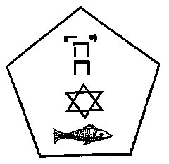

When they were debating upon the choice of the most appropriate symbol
to remind them of Jesus, Clemens advised them in the following words:
"Let the engraving upon the gem of your ring be either *a dove,* or *a
ship running before the wind* (the Argha), or *a fish.*" Was the good
father, when writing this sentence, laboring under the recollection of
Joshua, son of Nun (called *Jesus* in the Greek and Slavonian versions);
or had he forgotten the real interpretation of these Pagan symbols?

###### p. 257

Joshua, son of Nun, or Nave (*Navis*), could have with perfect propriety
adopted the image of a *ship,* or even of a fish, for Joshua means
Jesus, son of the fish-god; but it was really too hazardous to connect
the emblems of Venus, Astarte, and all the Hindu goddesses--the *argha,
dove,* and *fish--*with the "immaculate" birth of their god! This looks
very much as if in the early days of Christianity but little difference
was made between Christ, Bacchus, Apollo, and the Hindu Christna, the
incarnation of Vishnu, with whose first avatar this symbol of the fish
originated.

In the *Hari-purana,* in the *Bagaved-gitta,* as well as in several
other books, the god Vishnu is shown as having assumed the form of a
fish with a human head, in order to reclaim the *Vedas* lost during the
deluge. Having enabled Visvamitra to escape with all his tribe in the
ark, Vishnu, pitying weak and ignorant humanity, remained with them for
some time. It was this god who taught them to build houses, cultivate
the land, and to thank the unknown Deity whom he represented, by
building temples and instituting a regular worship; and, as he remained
half-fish, half-man, all the time, at every sunset he used to return to
the ocean, wherein he passed the night.

"It is he," says the sacred book, "who taught men, after the diluvium,
all that was necessary for their happiness.

"One day he plunged into the water and returned no more, for the earth
had covered itself again with vegetation, fruit, and cattle.

"But he had taught the Brahmas the secret of all things" (*Hari-purana*)

.

So far, we see in this narrative the *double* of the story given by the
Babylonian Berosus about Oannes, the fish-man, who is no other than
Vishnu--unless, indeed, we have to believe that it was Chaldea which
civilized India!

We say again, we desire to give nothing on our sole authority. Therefore
we cite Jacolliot, who, however criticised and contradicted on other
points, and however loose he may be in the matter of chronology (though
even in this he is nearer right than those scientists who would have all
Hindu books written since the Council of Nicea), at least cannot be
denied the reputation of a good Sanscrit scholar. And he says, while
analyzing the word *Oan*, or Oannes, that *O* in Sanscrit is an
interjection expressing an invocation, as O, Swayambhuva! O, God! etc.;
and *An* is a radical, signifying in Sanscrit a spirit, a being; and, we
presume, what the Greeks meant by the word *Daemon,* a semi-god.

"What an extraordinary antiquity," he remarks, "this fable of Vishnu,
disguised as a fish, gives to the sacred books of the Hindus; especially
in presence of the fact that the *Vedas* and *Manu* reckon more *than
twenty-five thousand years of existence,* as proved by the most serious
as the

###### p. 258

most authentic documents. Few peoples, says the learned Halled, have
their annals more authentic or serious than the Hindus." [\*](#fn_534)

We may, perhaps, throw additional light upon the puzzling question of
the fish-symbol by reminding the reader that according to *Genesis* the
first created of living beings, the first type of animal life, was the
fish. "And the Elohim said: 'Let the waters bring forth abundantly the
moving creature that *hath life*' *.* . . and God created great whales .
. . and the morning and the evening were the *fifth day.*" Jonah is
swallowed by a big fish, and is cast out again three days later. This
the Christians regard as a premonition of the three days' sepulture of
Jesus which preceded his resurrection--though the statement of the three
days is as fanciful as much of the rest, and adopted to fit the
well-known threat to destroy the temple and rebuild it again in *three*
days. Between his burial and alleged resurrection there intervened but
*one day--*the Jewish Sabbath--as he was buried on Friday evening and
rose to life at dawn on Sunday. However, whatever other circumstance may
be regarded as a prophecy, the story of Jonah cannot be made to answer
the purpose.

"Big Fish" is Cetus, the latinized form of Keto--Κετος and keto is
Dagon, Poseidon, the female gender of it being Keton Atar-gatis--the
Syrian goddess, and Venus, of Askalon. The figure or bust of Der-Keto or
Astarte was generally represented on the prow of the ships. Jonah (the
Greek Iona, or *dove* sacred to Venus) fled to Jaffa, where the god
Dagon, the man-fish, was worshipped, and dared not go to Nineveh, *where
the dove was revered.* Hence, some commentators believe that when Jonah
was thrown overboard and was swallowed by a fish, we must understand
that he was picked up by one of these vessels, on the prow of which was
the figure of *Keto.* But the kabalists have another legend, to this
effect: They say that Jonah was a run-away priest from the temple of the
goddess where the dove was worshipped, and desired to abolish idolatry
and institute monotheistic worship. That, caught near Jaffa, he was held
prisoner by the devotees of Dagon in one of the prison-cells of the
temple, and that it is the strange form of the cell which gave rise to
the allegory. In the collection of Mose de Garcia, a Portuguese
kabalist, there is a drawing representing the interior of the temple of
Dagon. In the middle stands an immense idol, the upper portion of whose
body is human, and the lower fish-like. Between the belly and the tail
is an aperture which can be closed like the door of a closet. In it the
transgressors against the local deity were shut up until further
disposal. The drawing in question was made from an old tablet covered
with curious drawings and inscriptions in old Phoenician characters,
describing this Venetian

###### p. 259

oubliette of biblical days. The tablet itself was found in an excavation
a few miles from Jaffa. Considering the extraordinary tendency of
Oriental nations for puns and allegories, is it not barely possible that
the "big fish" by which Jonah was swallowed was simply the cell within
the belly of Dagon?

It is significant that this double appellation of "Messiah" and "Dag"
(fish), of the Talmudists, should so well apply to the Hindu Vishnu, the
"Preserving" Spirit, and the second personage of the Brahmanic trinity.
This deity, having already manifested itself, is still regarded as the
future Saviour of humanity, and is the selected Redeemer, who will
appear at its tenth incarnation or *avatar,* like the Messiah of the
Jews, to lead the blessed onward, and restore to them the primitive
*Vedas.* At his first avatar, Vishnu is alleged to have appeared to
humanity, in form like a fish. In the temple of Rama, there is a
representation of this god which answers perfectly to that of Dagon, as
given by Berosus. He has the body of a man issuing from the mouth of a
fish, and holds in his hands the lost *Veda*. Vishnu, moreover, is the
water-god, in one sense, the Logos of the Parabrahm, for as the three
persons of the manifested god-head constantly interchange their
attributes, we see him in the same temple represented as reclining on
the seven-headed serpent, Ananta (eternity), and moving, like the
*Spirit* of God, on the face of the primeval waters.

Vishnu is evidently the Adam Kadmon of the kabalists, for Adam is the
Logos or the first Anointed, as Adam Second is the King Messiah.

Lakmy, or Lakshmi, the passive or feminine counterpart of Vishnu, the
creator and the preserver, is also called Ada Maya. She is the "Mother
of the World," Damatri, the Venus Aphrodite of the Greeks: also Isis and
Eve. While Venus is born from the sea-foam, Lakmy springs out from the
water at the churning of the sea; when born, she is so beautiful that
all the gods fall in love with her. The Jews, borrowing their types
wherever they could get them, made their first woman after the pattern
of Lakmy. It is curious that Viracocha, the Supreme Being in Peru,
means, literally translated, "foam of the sea."

Eugene Burnouf, the great authority of the French school, announces his
opinion in the same spirit: "We must learn one day," he observes, "that
all ancient traditions disfigured by emigration and legend, belong to
the history of India." Such is the opinion of Colebrooke, Inman, King,
Jacolliot, and many other Orientalists.

We have said above, that, according to the secret computation peculiar
to the students of the hidden science, Messiah is the fifth emanation,
or potency. In the Jewish *Kabala,* where the ten Sephiroth emanate from
Adam Kadmon (placed below the crown), he comes fifth. So in

###### p. 260

the Gnostic system; so in the Buddhistic, in which the fifth
Buddha--Maitree, will appear at his last advent to save mankind before
the final destruction of the world. If Vishnu is represented in his
forthcoming and last appearance as the *tenth* avatar or incarnation, it
is only because every unit held as an androgyne manifests itself doubly.
The Buddhists who reject this dual-sexed incarnation reckon but five.
Thus, while Vishnu is to make his last appearance in his tenth, Buddha
is said to do the same in his fifth incarnation. [\*](#fn_535)

The better to illustrate the idea, and show how completely the real
meaning of the avatars, known only to the students of the secret
doctrine was misunderstood by the ignorant masses, we elsewhere give the
diagrams of the Hindu and Chaldeo-Kabalistic avatars and
emanations. [\*\*](#fn_536) This basic and true
fundamental stone of the secret cycles, shows on its very face, that far
from taking their revealed *Vedas* and *Bible* literally, the
Brahman-pundits, and the Tanaim--the scientists and philosophers of the
pre-Christian epochs--speculated on the creation and development of the
world quite in a Darwinian way, both anticipating him and his school in
the natural selection of species, gradual development, and
transformation.

We advise every one tempted to enter an indignant protest against this
affirmation to read more carefully the books of Manu, even in the
incomplete translation of Sir William Jones, and the more or less
careless one of Jacolliot. If we compare the Sanchoniathon Phoenician
Cosmogony, and the record of Berosus with the *Bhagavatta* and *Manu,*
we will find enunciated exactly the same principles as those now offered
as the latest developments of modern science. We have quoted from the
Chaldean and Phoenician records in our first volume; we will now glance
at the Hindu books.

"When this world had issued out of darkness, the subtile elementary
principles produced the vegetal seed which animated first the plants;
from the plants, life passed into fantastical bodies which were born *in
the ilus of the waters;* then, through a series of forms and various
animals, it reached MAN." [\*\*\*](#fn_537)

"He (man, before becoming such) will pass successively through plants,
worms, insects, fish, serpents, tortoises, cattle, and wild animals;
such is the inferior degree."

"Such, from Brahma down to the vegetables, are declared the
transmigrations which take place in this world." [\*\*\*\*](#fn_538)

###### p. 261

In the Sanchoniathonian Cosmogony, men are also evolved out of the ilus
of the chaos, [\*](#fn_539) and the same
evolution and transformation of species are shown.

And now we will leave the rostrum to Mr. Darwin: "I believe that animals
have descended from at most only four or five progenitors." [\*\*](#fn_540)

Again: "I should infer from analogy that probably all the organic beings
which have ever lived on this earth, have descended from some one
primordial form. [\*\*\*](#fn_541) . . . I view
all beings, not as special creations, but as the lineal descendants of
some few beings which lived long *before the first bed of the Silurian
system was deposited.*" [\*\*\*\*](#fn_542)

In short, they lived in the Sanchoniathonian chaos, and in the *ilus* of
Manu. Vyasa and Kapila go still farther than Darwin and Manu. "They see
in Brahma but the name of the universal germ; *they deny the existence
of a First Cause;* and pretend that everything in nature found itself
developed only in consequence of material and fatal forces," says
Jacolliot. [\*\*\*\*\*](#fn_543)

Correct as may be this latter quotation from Kapila, it demands a few
words of explanation. Jacolliot repeatedly compares Kapila and Veda
Vyasa with Pyrrho and Littre. We have nothing against such a comparison
with the Greek philosopher, but we must decidedly object to any with the
French Comtist; we find it an unmerited fling at the memory of the great
Aryan sage. Nowhere does this prolific writer state the repudiation by
either ancient or modern Brahmans of God--the "unknown," universal
Spirit; nor does any other Orientalist accuse the Hindus of the same,
however perverted the general deductions of our savants about Buddhistic
atheism. On the contrary, Jacolliot states more than once that the
learned Pundits and educated Brahmans have never shared the popular
superstitions; and affirms their unshaken belief in the unity of God and
the soul's immortality, although most assuredly neither Kapila, nor the
initiated Brahmans, nor the followers of the Vedanta school would ever
admit the existence of an anthropomorphic creator, a "First Cause" in
the Christian sense. Jacolliot, in his *Indo-European and African
Traditions,* is the first to make an onslaught on Professor Muller, for
remarking that the Hindu gods were "masks without actors . . . names
without being, and not beings without names." [\*\*\*\*\*\*](#fn_544) Quoting, in support of his
argument, numerous verses from the sacred Hindu books, he adds: "Is it
possible to refuse to the author of these stanzas a definite and clear
conception of the divine force, of

###### p. 262

the Unique Being, master and Sovereign of the Universe? . . . Were the
altars then built to a metaphor?" [\*](#fn_545)

The latter argument is perfectly just, so far as Max Muller's negation
is concerned. But we doubt whether the French rationalist understands
Kapila's and Vyasa's philosophy better than the German philologist does
the "theological twaddle," as the latter terms the *Atharva-Veda.*
Professor Muller and Jacolliot may have ever so great claims to
erudition, and be ever so familiar with Sanscrit and other ancient
Oriental languages, but both lack the key to the thousand and one
mysteries of the old secret doctrine and its philosophy. Only, while the
German philologist does not even take the trouble to look into this
magical and "theological twaddle," we find the French Indianis never
losing an opportunity to investigate. Moreover, he honestly admits his
incompetency to ever fathom this ocean of mystical learning. In its
existence he not only firmly believes, but throughout his works he
incessantly calls the attention of science to its unmistakable traces at
every step in India. Still, though the learned Pundits and Brahmans--his
"revered masters" of the pagodas of Villenoor and Chelambrum in the
Carnatic, [\*\*](#fn_546) as it seems,
positively refused to reveal to him the mysteries of the magical part of
the *Agrouchada-Parikshai, [\*\*\*](#fn_547)*
and of Brahmatma's triangle, [\*\*\*\*](#fn_548) he persists in the honest
declaration that everything is possible in Hindu metaphysics, even to
the Kapila and Vyasa systems having been hitherto misunderstood.

M. Jacolliot weakens his assertion immediately afterward with the
following contradiction:

"We were one day inquiring of a Brahman of the pagoda of Chelambrum, who
belonged to the *skeptical school of the naturalists of Vyasa,* whether
he believed in the existence of God. He answered us, smiling: '*Aham eva
param Brahma*'*--*I am myself a god.

" 'What do you mean by that?'

" 'I mean that every being on earth, however humble, is an immortal
portion of the immortal matter.' " [\*\*\*\*\*](#fn_549)

The answer is one which would suggest itself to every ancient
philosopher, Kabalist and Gnostic, of the early days. It contains the
very spirit of the delphic and kabalistic commandment, for esoteric
philosophy solved, ages ago, the problem of what man was, is, and will
be. If persons

###### p. 263

believing the *Bible* verse which teaches that the "Lord God formed man
of the dust of the ground, and breathed into his nostrils the breath of
life," reject at the same time the idea that every atom of this dust, as
every particle of this "living soul," contains "God" within itself, then
we pity the logic of that Christian. He forgets the verses which precede
the one in question. God blesses equally every beast of the field and
every living creature, in the water as in the air, and He endows them
all with *life*, which is a breath of His own Spirit, and the *soul* of
the animal. Humanity is the Adam Kadmon of the "Unknown," His microcosm,
and His only representative on earth, and every man is a god on earth.

We would ask this French scholar, who seems so familiar with every sloka
of the books of Manu, and other Vedic writers, the meaning of this
sentence so well known to him:

"Plants and vegetation reveal a multitude of forms because of their
precedent actions; they are surrounded by darkness, but are nevertheless
endowed with an interior soul, and feel equally pleasure and pain"
(*Manu,* book i.).

If the Hindu philosophy teach the presence of a degree of *soul* in the
lowest forms of vegetable life, and even in every atom in space, how is
it possible that it should deny the same immortal principle to man? And
if it once admit the immortal spirit in man, how can it logically deny
the existence of the parent source--I will not say the first, but the
eternal Cause? Neither rationalists nor sensualists, who do not
comprehend Indian metaphysics, should estimate the ignorance of Hindu
metaphysicians by their own.

The grand cycle, as we have heretofore remarked, includes the progress
of mankind from its germ in the primordial man of spiritual form to the
deepest depth of degradation he can reach--each successive step in the
descent being accompanied by a greater strength and grossness of the
physical form than its precursor--and ends with the Flood. But while the
grand cycle, or age, is running its course, seven minor cycles are
passed, each marking the evolution of a new race out of the preceding
one, on a new world. And each of these races, or grand types of
humanity, breaks up into subdivisions of families, and they again into
nations and tribes, as we see the earth's inhabitants subdivided to-day
into Mongols, Caucasians, Indians, etc.

Before proceeding to show by diagrams the close resemblance between the
esoteric philosophies of all the ancient peoples, however geographically
remote from each other, it will be useful to briefly explain the real
ideas which underlie all those symbols and allegorical representations
and have hitherto so puzzled the uninitiated commentators. Better than
anything, it may show that religion and science were closer knit than
twins

###### p. 264

in days of old; that they were one in two and two in one from the very
moment of their conception. With mutually convertible attributes,
science was spiritual and religion was scientific. Like the androgyne
man of the first chapter of *Genesis*--"male and female," passive and
active; created in the image of the Elohim. Omniscience developed
omnipotency, the latter called for the exercise of the former, and thus
the giant had dominion given him over all the four kingdoms of the
world. But, like the second Adam, these androgynes were doomed to "fall
and lose their powers" as soon as the two halves of the duality
separated. The fruit of the Tree of Knowledge gives death without the
fruit of the Tree of Life. Man must know *himself* before he can hope to
know the ultimate genesis even of beings and powers less developed in
their inner nature than himself. So with religion and science; united
two in one they were infallible, for the spiritual intuition was there
to supply the limitations of physical senses. Separated, exact science
rejects the help of the inner voice, while religion becomes merely
dogmatic theology--each is but a corpse without a soul.

The esoteric doctrine, then, teaches, like Buddhism and Brahmanism, and
even the persecuted *Kabala*, that the one infinite and unknown Essence
exist from all eternity, and in regular and harmonious successions is
either passive or active. In the poetical phraseology of Manu these
conditions are called the "day" and the "night" of Brahma. The latter is
either "awake" or "asleep." The Svabhavikas, or philosophers of the
oldest school of Buddhism (which still exists in Nepaul), speculate but
upon the active condition of this "essence," which they call Svabhavat,
and deem it foolish to theorize upon the abstract and "unknowable" power
in its passive condition. Hence they are called atheists by both
Christian theology and modern scientists; for neither of the two are
able to understand the profound logic of their philosophy. The former
will allow of no other God than the personified *secondary* powers which
have blindly worked out the visible universe, and which became with them
the anthropomorphic God of the Christians--the Jehovah, roaring amid
thunder and lightning. In its turn, rationalistic science greets the
Buddhists and the Svabhavikas as the "positivists" of the archaic ages.
If we take a one-sided view of the philosophy of the latter, our
materialists may be right in their own way. The Buddhists maintain that
there is *no* Creator but an infinitude of *creative* *powers*, which
collectively form the one eternal substance, the *essence* of which is
inscrutable--hence not a subject for speculation for any true
philosopher. Socrates invariably refused to argue upon the mystery of
universal being, yet no one would ever have thought of charging him with
atheism, except those who were bent upon his destruction. Upon
inaugurating an active period, says the

###### p. 265

Secret Doctrine, an expansion of this Divine essence, *from within
outwardly,* occurs in obedience to eternal and immutable law, and the
phenomenal or visible universe is the ultimate result of the long chain
of cosmical forces thus progressively set in motion. In like manner,
when the passive condition is resumed, a contraction of the Divine
essence takes place, and the previous work of creation is gradually and
progressively undone. The visible universe becomes disintegrated, its
material dispersed; and "darkness," solitary and alone, broods once more
over the face of the "deep." To use a metaphor which will convey the
idea still more clearly, an outbreathing of the "unknown essence"
produces the world; and an inhalation causes it to disappear.

This process has been going on from all eternity, and our present
universe is but one of an infinite series which had no beginning and
will have no end.

Thus we are enabled to build our theories solely on the visible
manifestations of the Deity, on its objective natural phenomena. To
apply to these creative principles the term God is puerile and absurd.
One might as well call by the name of Benvenuto Cellini the fire which
fuses the metal, or the air that cools it when it is run in the mould.
If the inner and ever-concealed spiritual, and to our minds abstract,
Essence within these forces can ever be connected with the creation of
the physical universe, it is but in the sense given to it by Plato.
**I**T may be termed, at best, the framer of the abstract universe which
developed gradually in the Divine Thought within which it had lain
dormant.

In Chapter **VIII**. we will attempt to show the esoteric meaning of
*Genesis,* and its complete agreement with the ideas of other nations.
The six days of creation will be found to have a meaning little
suspected by the multitude of commentators, who have exercised their
abilities to the full extent in attempting to reconcile them by turns
with Christian theology and un-Christian geology. Disfigured as the *Old
Testament* is*,* yet in its symbolism is preserved enough of the
original in its principal features to show the family likeness to the
cosmogonies of older nations than the Jews.

We here give the diagrams of the Hindu and the Chaldeo-Jewish
cosmogonies. The antiquity of the diagram of the former may be inferred
from the fact that many of the Brahmanical pagodas are designed and
built on this figure, called the "Sri-Iantara." [\*](#fn_550) And yet we find the highest honors paid
to it by the Jewish and mediaeval kabalists, who call it "Solomon's
seal." It will be quite an easy matter to trace it to its origin, once
we are reminded of the history of the king-kabalist and his transaction
with King Hiram and Ophir--the country of peacocks, gold, and ivory--for
which land we have to search in old India.

###### p. 266

### EXPLANATION OF THE TWO DIAGRAMS

#### REPRESENTING THE CHAOTIC AND THE FORMATIVE PERIODS, BEFORE AND AFTER OUR UNIVERSE BEGAN TO BE EVOLVED.

#### FROM THE ESOTERIC BRAHMANICAL, BUDDHISTIC, AND CHALDEAN STANDPOINTS, WHICH AGREE IN EVERY RESPECT WITH THE EVOLUTIONARY THEORY OF MODERN SCIENCE.

 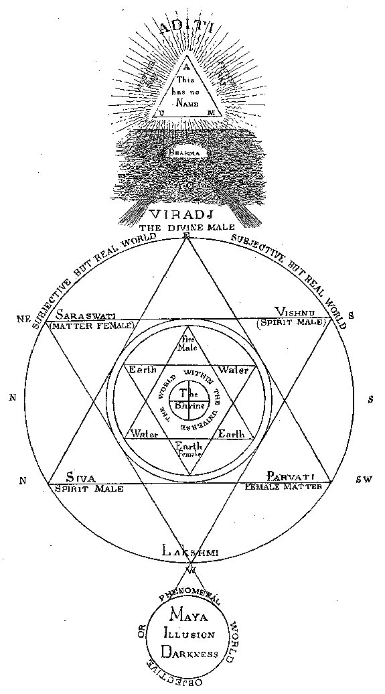

THE **H**INDU **D**OCTRINE.

The Upper Triangle

Contains the Ineffable Name. It is the **AUM**--to be pronounced only
mentally, under penalty of death. The Unrevealed Para-Brahma, the
Passive-Principle; the absolute and unconditioned "mukta," which cannot
enter into the condition of a Creator, as the latter, in order to
*think, will,* and *plan*, must be bound and conditioned (baddha);
hence, in one sense, be a finite being. "**T**HIS (Para-Brahma) was
absorbed in the non-being, imperceptible, without any distinct
attribute, non-existent for our senses. He was absorbed in his (to us)
eternal (to himself) periodical, sleep," for it was one of the "Nights
of Brahma." Therefore he is not the *First* but the Eternal Cause. He is
the Soul of Souls, whom no being can comprehend in this state. But "he
who studies the secret Mantras and comprehends the *Vach*" (the Spirit
or hidden voice of the Mantras, the active manifestation of the latent
Force) will learn to understand him in his "revealed" aspect.

 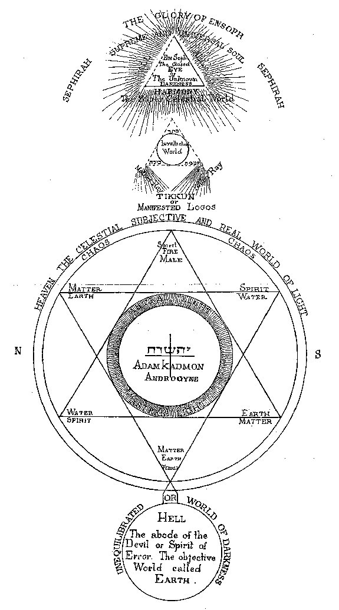

THE **C**HALDEAN **D**OCTRINE.

The Upper Triangle

Contains the Ineffable Name. It is En-Soph, the Boundless, the Infinite,
whose name is known to no one but the initiated, and could not be
pronounced aloud under the penalty of death.

No more than Para-Brahma can En-Soph create, for he is in the same
condition of non-being as the former; he is   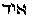 non-existent so long as
he lies in his latent or passive state within *Oulom* (the boundless and
termless time); as such he is not the Creator of the visible universe,
neither is he the *Aur* (Light). He will become the latter when the
period of creation shall have compelled him to expand the Force within
himself, according to the Law of which he is the embodiment and essence.

"Whosoever acquaints himself with the Mercaba and the *lahgash* (secret
speech or incantation), [\*](#fn_551) will
learn the secret of secrets."

 

Both "**T**HIS" and En-Soph, in their first manifestation of Light,
emerging from within Darkness, may be summarized in the Svabhavat, the
Eternal and the uncreated Self-existing Substance which produces all;
while everything which is of its essence produces itself out of its own
nature.

<table data-cellspacing="0" data-border="0" data-cellpadding="9" width="798">
<colgroup>
<col style="width: 50%" />
<col style="width: 50%" />
</colgroup>
<tbody>
<tr class="odd">
<td width="50%" data-valign="TOP">The Space Around the Upper Triangle.

When the "Night of Brahma" was ended, and the time came for the Self-Existent to manifest <em>Itself</em> by revelation, it made its glory visible by sending forth from its Essence an active Power, which, female at first, subsequently becomes
</td>
<td width="50%" data-valign="TOP"><em></em>

The Space Around the Upper Triangle.

When the active period had arrived, En-Soph sent forth from within his own eternal essence, Sephira, the active Power, called the Primordial Point, and the Crown, <em>Keter.</em> It is only through her that the "Un-bounded Wisdom" could
</td>
</tr>
</tbody>
</table>

 

###### p. 267

androgyne. It is Aditi, the "Infinite," [\*](#fn_552) the Boundless, or rather the
"Unbounded." Aditi is the "mother" of all the gods, and Aditi is the
Father and the Son. [\*\*](#fn_553) "Who will
give us back to the great Aditi, that I may see father and
mother?" [\*\*\*](#fn_554) It is in conjunction
with the latter female, Force, that the Divine but latent Thought
produces the great "Deep"--water. "Water is born from a transformation
of light . . . and from a *modification* of the water is born the
earth," says Manu (book i.).

"Ye are born of Aditi from the water, you who are born of the earth,
hear ye all my call." [\*\*\*\*](#fn_555)

In this water (or primeval chaos) the "Infinite" androgyne, which, with
the Eternal Cause, forms the first abstract Triad, rendered by **A**UM,
deposited the germ of universal life. It is the Mundane Egg, in which
took place the gestation of Purusha, or the manifested Brahma. The germ
which fecundated the *Mother* Principle (the water) is called Nara, the
Divine Spirit or Holy Ghost, [\*\*\*\*\*](#fn_556) and the waters themselves, are
an emanation of the former, Nari, while the Spirit which brooded over it
is called Narayana. [\*\*\*\*\*\*](#fn_557)

"In that egg, the great Power sat inactive a whole *year of the
Creator,* at the close of which, by his thought alone, he caused the egg
to divide itself." [\*\*\*\*\*\*\*](#fn_558)
The upper half became heaven, the lower, the

"The waters are called *nara*, because they were the production of Nara,
the Spirit of God" ("Institutes of Manu," i. 10).}

give a concrete form to his abstract Thought. Two sides of the upper
triangle, the right side and the base, are composed of unbroken lines;
the third, the left side, is dotted. It is through the latter that
emerges Sephira. Spreading in every direction, she finally encompasses
the whole triangle. In this emanation of the female active principle
from the left side of the mystic triangle, is foreshadowed the creation
of Eve from Adam's left rib. Adam is the Microcosm of the Macrocosm, and
is created in the image of the Elohim. In the Tree of Life the triple
triad is disposed in such a manner that the three male Sephiroth are on
the right, the three female on the left, and the four uniting principles
in the centre. From the Invisible Dew falling from the Higher "Head"
Sephira creates primeval water, or chaos taking shape. It is the first
step toward the solidification of Spirit, which through various
modifications will produce earth. [\*b](#fn_559). "*It requires earth and water to make
a living soul,*" says Moses.

When Sephira emerges like an active power from within the latent Deity,
she is

 

###### p. 268

earth (both yet in their ideal, not their manifested form).

Thus, this second triad, only another name for the first one (never
pronounced aloud), and which is the real pre-Vedic and primordial
*secret* Trimurti, consisted of

Nara, Father-Heaven,  
Nari, Mother-Earth,  
Viradj, the Son--or Universe.

The Trimurti, comprising Brahma, the Creator, Vishnu, the Preserver, and
Siva, the Destroyer and Regenerator, belongs to a later period. It is an
anthropomorphic afterthought, invented for the more popular
comprehension of the uninitiated masses. The *Dikshita,* the initiate,
knew better. Thus, also, the profound allegory under the colors of a
ridiculous fable, given in the *Aytareya Brahmana, [\*](#fn_560)* which resulted in the representations
in some temples of Brahm-Nara, assuming the form of a bull, and his
daughter, Aditi-Nari, that of a heifer, contains the same metaphysical
idea as the "fall of man," or that of the Spirit into
generation--matter. The All-pervading Divine Spirit embodied under the
symbols of Heaven, the Sun, and Heat (fire)--the correlation of cosmic
forces--fecundates Matter or Nature, the daughter of Spirit. And
Para-Brahma himself has to submit to and bear the penance of the curses
of the other gods (Elohim) for such an incest. (See corresponding
column.) According to the immutable, and, therefore, fatal law, both
Nara and Nari are mutually Father and Mother, as well as Father and
Daughter. [\*\*](#fn_561) Matter, through
infinite transformation, is the gradual product of Spirit. The
unification of one Eternal Supreme Cause required such a correlation;
and if nature be

female; when she assumes the office of a creator, she becomes a male;
hence, she is androgyne. She is the "Father and Mother Aditi," of the
Hindu Cosmogony. After brooding over the "Deep," the Spirit of God"
produces its own image in the water, the Universal Womb, symbolized in
*Manu* by the Golden Egg. In the kabalistic Cosmogony, Heaven and Earth
are personified by Adam Kadmon and the second Adam. The first Ineffable
Triad, contained in the abstract idea of the "Three Heads," was a
"mystery name." It was composed of En-Soph, Sephira, and Adam Kadmon,
the Protogonos, the latter being identical with the former, when
bisexual. [\*b](#fn_562). In every triad there
is a male, a female, and an androgyne. Adam-Sephira is the Crown
(Keter). It sets itself to the work of creation, by first producing
Chochmah, Male Wisdom, a masculine active potency, represented by  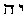, jah, or the Wheels of
Creation,  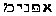, from
which proceeds Binah, Intelligence, female and passive potency, which is
*Jehovah*,  , whom
we find in the *Bible* figuring as the Supreme. But this Jehovah is not
the kabalistic Jodcheva. The *binary* is the fundamental corner-stone of
*Gnosis.* As the binary is the Unity multiplying itself and
self-creating, the kabalists show the "Unknown" passive En-Soph, as
emanating from himself, Sephira, which, becoming visible light, is said
to produce Adam Kadmon. But, in the hidden sense, Sephira and Adam are
one and the same light, only latent and active, invisible and visible.
The second Adam, as the human tetragram, produces in his turn Eve, out
of his side. It is this second triad, with which the kabalists have
hitherto dealt, hardly hinting at the Supreme and Ineffable One, and
never committing anything to writing. All knowledge concerning the
latter was imparted orally. It is the *second* Adam, then, who is the
unity represented by *Jod*, emblem of the kabalistic male principle,
and, at the same time, he is Chochmah, *Wisdom,* while *Binah* or
Jehovah is Eve; the first

 

###### p. 269

<table data-cellspacing="0" data-border="0" data-cellpadding="9" width="798">
<colgroup>
<col style="width: 50%" />
<col style="width: 50%" />
</colgroup>
<tbody>
<tr class="odd">
<td width="50%" data-valign="TOP">
the product or effect of that Cause, in its turn it has to be fecundated by the same divine Ray which produced nature itself. The most absurd cosmogonical allegories, if analyzed without prejudice, will be found built on strict and logical necessarianism.

"Being was born from not-being," says a verse in the <em>Rig-Veda</em>. <a href="#fn_563">*</a> The first being had to become androgyne and finite, by the very fact of its creation as a being. And thus even the sacred Trimurti, containing Brahma, Vishnu, and Siva will have an end when the "night" of Para-Brahma succeeds the present "day," or period of universal activity.

The second, or rather the first, triad--as the highest one is a pure abstraction--is the intellectual world. The Vach which surrounds it is a more definite transformation of Aditi. Besides its occult significance in the secret Mantram, Vach is personified as the active power of Brahma proceeding from him. In the <em>Vedas</em> she is made to speak of herself as the supreme and universal soul. "I bore the Father on the head of the universal mind, and <em>my</em> <em>origin is in the midst of the ocean;</em> and therefore do I pervade all beings. . . . Originating all beings, I pass like the breeze (Holy Ghost). I am above this heaven, beyond this earth; and <em>what</em> <em>is the Great One that am I</em>." <a href="#fn_564">**</a> Literally, Vach is speech, the power of awakening, through the metrical arrangement contained in the number and syllables of the Mantras, <a href="#fn_565">***</a> corresponding powers in the invisible world. In the sacrificial Mysteries Vach stirs up the Brahma (<em>Brahma jinvati</em>)<em>,</em> or the power lying latent at the bottom of every magical operation. It existed from eternity as the Yajna (its latent form), lying dormant in Brahma from "no-beginning," and proceeded forth from him as Vach (the active power). It is the key to the "Trai vidya,"
</td>
<td width="50%" data-valign="TOP">
Chochmah issuing from Keter, or the androgyne, Adam Kadmon, and the second, Binah, from Chochmah. If we combine with <em>Jod</em> the three letters which form the name of Eve, we will have the divine tetragram pronounced <strong>I</strong>EVO-HEVAH, Adam and Eve,  , Jehovah, male and female, or the idealization of humanity embodied in the first man. Thus is it that we can prove that, while the Jewish kabalists, in common with their initiated masters, the Chaldeans and the Hindus, adored the Supreme and Unknown God, in the sacred silence of their sanctuaries, the ignorant masses of every nation were left to adore something which was certainly less than the Eternal Substance of the Buddhists, the so-called Atheists. As Brahma, the deity manifested in the mythical <em>Manu</em>, or the first man (born of Swayambhuva, or the Self-existent), is finite, so Jehovah, embodied in Adam and Eve, is but a <em>human</em> god. He is the symbol of humanity, a mixture of good with a portion of unavoidable evil; of spirit fallen into matter. In worshipping Jehovah, we simply worship nature, as embodied in man, half-spiritual and half-material, at best: we are Pantheists, when not fetich worshippers, like the idolatrous Jews, who sacrificed on high places, in groves, to the personified male and female principle, ignorant of <strong>I</strong>AO, the Supreme "Secret Name" of the Mysteries.

Shekinah is the Hindu Vach, and praised in the same terms as the latter. Though shown in the kabalistic Tree of Life as proceeding from the ninth Sephiroth, yet Shekinah is the "veil" of En-Soph, and the "garment" of Jehovah. The "veil," for it succeeded for long ages in concealing the real supreme God, the universal Spirit, and masking Jehovah, the exoteric deity, made the Christians accept him as the "father" of the initiated Jesus. Yet the kabalists, as well as the Hindu <em>Dikshita,</em> know the power of the Shekinah or Vach, and call it the "secret wisdom,"  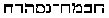.

The triangle played a prominent part in the religious symbolism of every great nation; for everywhere it represented the three great principles--spirit, force, and matter; or the active (male), passive (female), and the dual or correlative principle which partakes of both and binds the two together. It was the <em>Arba</em> or mystic
</td>
</tr>
</tbody>
</table>

 

###### p. 270

the thrice sacred science which teaches the Yajus (the sacrificial
Mysteries). [\*](#fn_566)

Having done with the unrevealed triad, and the first triad of the
Sephiroth, called the "intellectual world," little remains to be said.
In the great geometrical figure which has the double triangle in it, the
central circle represents the world within the universe. The double
triangle belongs to one of the most important, if it is not in itself
the most important, of the mystic figures in India. It is the emblem of
the Trimurti three in one. The triangle with its apex upward indicates
the male principle, downward the female; the two typifying, at the same
time, spirit and matter. This world within the infinite universe is the
microcosm within the macrocosm, as in the Jewish *Kabala.* It is the
symbol of the womb of the universe, the terrestrial egg, whose archetype
is the golden mundane egg. It is from within this spiritual bosom of
mother nature that proceed all the great saviours of the universe--the
avatars of the invisible Deity.

"Of him who is and yet is not, from the not-being, Eternal Cause, is
born the being Pouroucha," says Manu, the legislator. Pouroucha is the
"divine male," the *second* god, and the avatar, or the Logos of
Para-Brahma and his divine son, who in his turn produced Viradj, the
son, or the ideal type of the universe. "Viradj begins the work of
creation by producing the ten Pradjapati, 'the lords of all beings.' "

According to the doctrine of Manu, the universe is subjected to a
periodical and never-ending succession of creations and dissolutions,
which periods of creation are named Manvantara.

"It is the germ (which the Divine Spirit produced from its own
substance) which never perishes in the being, for it becomes the soul of
Being, and at the period of *pralaya* (dissolution) it returns to absorb
itself again *into the Divine* Spirit, *which* *itself* rests from all
eternity

"four," [\*b](#fn_567) the mystery-gods, the
Kabeiri, summarized in the unity of one supreme Deity. It is found in
the Egyptian pyramids, whose equal sides tower up until lost in one
crowning point. In the kabalistic diagram the central circle of the
Brahmanical figure is replaced by the cross; the celestial perpendicular
and the terrestrial horizontal base line. [\*\*b](#fn_568) But the idea is the same: Adam
Kadmon is the type of humanity as a collective totality within the unity
of the creative God and the universal spirit.

 

###### p. 271

within Swayambhuva, the 'Self-Existent' " (*Institute of Manu,* book
i.).

As we have shown, neither the Svabhavikas, Buddhist philosophers--nor
the Brahmans believe in a creation of the universe *ex nihilo,* but both
believe in the *Prakriti,* the indestructibility of matter.

The evolution of species, and the successive appearance of various new
types is very distinctly shown in

Manu.

"From earth, heat, and water, are born all creatures, whether animate or
inanimate, produced by the germ which the Divine Spirit drew from its
own substance. Thus has Brahma established the series of transformations
from the plant up to man, and from man up to the primordial essence. . .
. Among them each succeeding being (or element) acquires the quality of
the preceding; and in as many degrees as each of them is advanced, with
so many properties is it said to be endowed" (*Manu*, book i., sloka
20). [\*](#fn_569)

This, we believe, is the veritable theory of the modern evolutionists.

"Of him who is formless, the non-existent (also the eternal, but *not*
First Cause), is born the heavenly man." But after he created the form
of the heavenly man 
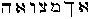, he "used it as a vehicle wherein to descend,"
says the *Kabala.* Thus Adam Kadmon is the avatar of the concealed
power. After that the heavenly Adam creates or engenders by the combined
power of the Sephiroth, the earthly Adam. The work of creation is also
begun by Sephira in the creation of the ten Sephiroth (who are the
Pradjapatis of the *Kabala,* for they are likewise the Lords of all
beings).

The *Sohar* asserts the same. According to the kabalistic doctrine there
were old worlds (see Idra Suta: *Sohar,* iii., p. 292b). Everything will
return some day to that from which it first proceeded. "All things of
which this world consists, spirit as well as body, will return to their
principal, and the roots from which they proceeded" (*Sohar,* ii.,
218b). The kabalists also maintain the indestructibility of matter,
albeit their doctrine is shrouded still more carefully than that of the
Hindus. The creation is eternal, and the universe is the "garment," or
"the veil of God"--Shekinah; and the latter is immortal and eternal as
Him within whom it has ever existed. Every world is made after the
pattern of its predecessor, and each more gross and material than the
preceding one. In the *Kabala* all were called sparks. Finally, our
present grossly materialistic world was formed.

In the Chaldean account of the period which preceded the Genesis of our
world, Berosus speaks of a time when there existed nothing but darkness,
and an abyss of waters, filled with hideous monsters, "produced of a
two-fold principle. . . . These were creatures in which were combined
the limbs of every species of animals. In addition to these fishes,
reptiles, serpents, with other monstrous animals, which assumed each
other's shape and countenance." [\*b](#fn_570)

 

###### p. 272

In the first book of Manu, we read: "Know that the sum of 1,000 divine
ages, composes the totality of one day of Brahma; and that one night is
equal to that day." One thousand divine ages is equal to 4,320,000,000
of human years, in the Brahmanical calculations.

"At the expiration of each night, Brahma, who has been asleep, awakes,
and through the sole energy of the motion causes to emanate from himself
the spirit, which in its essence *is,* and yet is not."

"Prompted by the desire to create, the Spirit (first of the emanations)
operates the creation and gives birth to ether, which the sages consider
as having the faculty of transmitting sound.

"Ether begets air whose property is tangible, and which is necessary to
life.

"Through a transformation of the air, light is produced.

"From air and light, which begets heat, water is formed, and the water
is the womb of all the living germs."

Throughout the whole immense period of progressive creation, covering
4,320,000,000 years, ether, air, water and fire (heat), are constantly
forming matter under the never-ceasing impulse of the Spirit, or the
*unrevealed* God who fills up the whole creation, for he is in all, and
all is in him. This computation, which was secret and which is hardly
hinted at even now, led Higgins into the error of dividing every ten
ages into 6,000 years. Had he added a few more ciphers to his sums he
might have come nearer to a correct explanation of the neroses, or
secret cycles. [\*](#fn_571)

In the *Sepher Jezireh,* the kabalistic Book of Creation, the author has
evidently repeated the words of Manu. In it, the Divine Substance is
represented as having alone existed from the eternity, boundless and
absolute; and emitted from itself the Spirit. "One is the Spirit of the
living God, blessed be His Name, who liveth for ever! Voice, Spirit, and
Word, this is the Holy Spirit"; [\*\*](#fn_572)
and this is the kabalistic abstract Trinity, so unceremoniously
anthropomorphized by the Fathers. From this triple ONE emanated the
whole Cosmos. First from ONE emanated number TWO, or Air, the creative
element; and then number THREE, *Water,* proceeded from the air; *Ether*
or *Fire* complete the mystic four, the Arba-il. [\*\*\*](#fn_573) "When the Concealed of the
Concealed wanted to reveal Himself, he first made a point (primordial
point, or the first Sephira, air or Holy Ghost), shaped it into a sacred
form (the ten Sephiroth, or the Heavenly man), and covered it with a
rich and splendid garment, *that is the world*." [\*\*\*\*](#fn_574) "He maketh the wind His
messengers, flaming Fire his

###### p. 273

servants," says the *Jezireh,* showing the cosmical character of the
later euhemerized angels, [\*](#fn_575) and
that the Spirit permeates every minutest atom of the Cosmos. [\*\*](#fn_576)

When the cycle of creation is run down, the energy of the manifested
word is weakening. He alone, the Unconceivable, is unchangeable (ever
latent), but the Creative Force, though also eternal, as it has been in
the former from "no beginning," yet must be subject to periodical cycles
of activity and rest; as it had a *beginning* in one of its aspects,
when it first emanated, therefore must also have an end. Thus, the
evening succeeds the day, and the night of the deity approaches. Brahma
is gradually falling asleep. In one of the books of *Sohar,* we read the
following:

"As Moses was keeping a vigil on Mount Sinai, in company with the Deity,
who was concealed from his sight by a cloud, he felt a great fear
overcome him and suddenly asked: 'Lord, where art Thou . . . sleepest
thou, O Lord?' And the *Spirit* answered him: 'I never sleep; were I to
fall asleep for a moment *before my time,* all the Creation would
crumble into dissolution in one instant.' " And Vamadeva-Modely
describes the "Night of Brahma," or the second period of the Divine
Unknown existence, thus:

"Strange noises are heard, proceeding from every point. . . . These are
the precursors of the Night of Brahma; *dusk rises at the horizon* and
the Sun passes away behind the thirtieth degree of Macara (sign of the
zodiac), and will reach no more the sign of the *Minas* (zodiacal
*pisces,* or fish). The gurus of the pagodas appointed to watch the
ras-chakr (Zodiac), may now break their circle and instruments, for they
are henceforth useless.

"Gradually light pales, heat diminishes, uninhabitable spots multiply on
the earth, the air becomes more and more rarefied; the springs of waters
dry up, the great rivers see their waves exhausted, the ocean shows its
sandy bottom, and plants die. Men and animals decrease in size daily.
Life and motion lose their force, planets can hardly gravitate in space;
they are extinguished one by one, like a lamp which the hand of the
chokra (servant) neglects to replenish. Sourya (the Sun) flickers and
goes out, matter falls into dissolution (pralaya), and Brahma merges
back into Dyaus, the Unrevealed God, and his task being accomplished, he
falls asleep. Another day is passed, night sets in and continues until
the future dawn.

###### p. 274

"And now again re-enter into the golden egg of His Thought, the germs of
all that exist, as the divine Manu tells us. During His peaceful rest,
the animated beings, endowed with the principles of action, cease their
functions, and all feeling (manas) becomes dormant. When they are all
absorbed in the **S**UPREME **S**OUL, this Soul of all the beings sleeps
in complete repose, till the day when it resumes its form, and awakes
again from its primitive darkness." [\*](#fn_577)

If we now examine the ten mythical avatars of Vishnu, we find them
recorded in the following progression:

1\. Matsya-Avatar: as a fish. It will also be his tenth and last avatar,
at the end of the Kali-yug.  
2. Kurm-Avatar: as a tortoise.  
3. Varaha: as a boar.  
4. Nara-Sing: as a *man-lion;* last animal stage.  
5. Vamuna: as a dwarf; first step toward the human form.  
6. Parasu-Rama: as a hero, but yet an imperfect man.  
7. Rama-Chandra: as the hero of Ramayana. Physically a perfect man; his
next of kin, friend and ally Hanouma, the monkey-god. The *monkey
endowed with speech.*  
 [\*\*](#fn_578) 8. Christna-Avatar: the Son of
the Virgin Devanaguy (or Devaki) one formed by God, or rather by the
manifested Deity Vishnu, who is identical with Adam Kadmon. [\*\*\*](#fn_579) Christna is also called Kaneya, the
Son of the Virgin.  
9. Gautama-Buddha, Siddhartha, or Sakya-muni. (The Buddhists reject this
doctrine of their Buddha being an incarnation of Vishnu.)  
10. This avatar has not yet occurred. It is expected in the future, like
the Christian Advent, the idea of which was undoubtedly copied from the
Hindu. When Vishnu appears for the last time he will come as a
"Saviour." According to the opinion of some Brahmans he will appear
himself under the form of the horse Kalki. Others maintain that he will
be mounting it. This horse is the envelope of the spirit of evil, and
Vishnu will mount it, invisible to all, till he has conquered it for the
last time. The "Kalki-Avataram," or the last incarnation, divides

###### p. 275

Brahmanism into two sects. That of the Vaihnava refuses to recognize the
incarnations of their god Vishnu in animal forms literally. They claim
that these must be understood as allegorical.

In this diagram of avatars we see traced the gradual evolution and
transformation of all species out of the ante-Silurian mud of Darwin and
the *ilus* of Sanchoniathon and Berosus. Beginning with the Azoic time,
corresponding to the *ilus* in which Brahma implants the creative germ,
we pass through the Palaeozoic and Mesozoic times, covered by the first
and second incarnations as the fish and tortoise; and the Cenozoic,
which is embraced by the incarnations in the animal and semi-human forms
of the boar and man-lion; and we come to the fifth and crowning
geological period, designated as the "era of mind, or age of man," whose
symbol in the Hindu mythology is the dwarf--the first attempt of nature
at the creation of man. In this diagram we should follow the main idea,
not judge the degree of knowledge of the ancient philosophers by the
literal acceptance of the popular form in which it is presented to us in
the grand epical poem of *Maha-Bharata* and its chapter the
*Bagaved-gitta*.

Even the four ages of the Hindu chronology contain a far more
philosophical idea than appears on the surface. It defines them
according to both the psychological or mental and the physical states of
man during their period. Crita-yug, the golden age, the "age of joy," or
spiritual innocence of man; Treta-yug, the age of silver, or that of
fire--the period of supremacy of man and of giants and of the sons of
God; Dwapara-yug, the age of bronze--a mixture already of purity and
impurity (spirit and matter) the age of doubt; and at last our own, the
Kali-yug, or age of iron, of darkness, misery, and sorrow. In this age,
Vishnu had to incarnate himself in Christna, in order to save humanity
from the goddess Kali, consort of Siva, the all-annihilating--the
goddess of death, destruction, and human misery. Kali is the best emblem
to represent the "fall of man"; the falling of spirit into the
degradation of matter, with all its terrific results. We have to rid
ourselves of Kali before we can ever reach "Moksha," or Nirvana, the
abode of blessed Peace and Spirit.

With the Buddhists the last incarnation is the fifth. When
Maitree-Buddha comes, then our present world will be destroyed; and a
new and a better one will replace it. The four arms of every Hindu Deity
are the emblems of the four preceding manifestations of our earth from
its invisible state, while its head typifies the fifth and last
*Kalki*-Avatar, when this would be destroyed, and the power of
Budh--Wisdom (with the Hindus, of Brahma), will be again called into
requisition to manifest itself--as a *Logos--*to create the future
world.

In this diagram, the male gods typify Spirit in its deific attributes

###### p. 276

while their female counterparts--the *Sakti,* represent the active
energies of these attributes. The *Durga* (active virtue), is a subtile,
invisible force, which answers to Shekinah--the garment of En-Soph. She
is the Sakti through which the passive "Eternal" calls forth the visible
universe from its first ideal conception. Every one of the three
personages of the exoteric Trimurti are shown as using their *Sakti* as
a *Vehan* (vehicle). Each of them is for the time being the form which
sits upon the mysterious wagon of Ezekiel.

Nor do we see less clearly carried out in this succession of avatars,
the truly philosophical idea of a simultaneous spiritual and physical
evolution of creatures and man. From a fish the progress of this dual
transformation carries on the physical form through the shape of a
tortoise, a boar, and a man-lion; and then, appearing in the dwarf of
humanity, it shows Parasu Rama physically, a perfect, spiritually, an
undeveloped entity, until it carries mankind personified by one god-like
man, to the apex of physical and spiritual perfection--a god on earth.
In Christna and the other Saviours of the world we see the philosophical
idea of the progressive dual development understood and as clearly
expressed in the *Sohar.* The "Heavenly man," who is the Protogonos,
Tikkun, the first-born of God, or the universal Form and Idea, engenders
Adam. Hence the latter is god-born in humanity, and endowed with the
attributes of all the ten Sephiroth. These are: Wisdom, Intelligence,
Justice, Love, Beauty, Splendor, Firmness, etc. They make him the
Foundation or basis, "*the mighty living one,*"  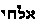, and the crown of
creation, thus placing him as the Alpha and Omega to reign over the
"kingdom"--Malchuth. "Man is both the import and the highest degree of
creation," says the *Sohar.* "As soon as man was created, everything was
complete, including the upper and nether worlds, for everything is
comprised in man. He unites in himself all forms" (iii., p. 48 a).

But this does not relate to our degenerated mankind; it is only
occasionally that men are born who are the types of what man should be,
and yet is not. The first races of men were spiritual, and their
protoplastic bodies were not composed of the gross and material
substances of which we see them composed now-a-day. The first men were
created with all the faculties of the Deity, and powers far transcending
those of the angelic host; for they were the direct emanations of Adam
Kadmon, the primitive man, the Macrocosm; while the present humanity is
several degrees removed even from the earthly Adam, who was the
Microcosm, or "the little world." Seir Anpin, the mystical figure of the
Man, consists of 243 numbers, and we see in the circles which follow
each other that it is the angels which emanated from the "Primitive

###### p. 277

Man," not the Sephiroth from angels. Hence, man was intended from the
first to be a being of both a progressive and retrogressive nature.
Beginning at the apex of the divine cycle, he gradually began receding
from the centre of Light, acquiring at every new and lower sphere of
being (worlds each inhabited by a different race of human beings) a more
solid physical form and losing a portion of his *divine* faculties.

In the "fall of Adam" we must see, not the personal transgression of
man, but simply the law of the dual evolution. Adam, or "Man," begins
his career of existences by dwelling in the garden of Eden, "dressed in
the celestial garment, which *is a garment of heavenly light*" (*Sohar,*
ii., 229 b); but when expelled he is "clothed" by God, or the eternal
law of Evolution or necessarianism, with coats of skin. But even on this
earth of material degradation--in which the divine spark (Soul, a
corruscation of the Spirit) was to begin its physical progression in a
series of imprisonments from a stone up to a man's body--if he but
exercise his WILL and call his deity to his help, man can transcend the
powers of the angel. "Know ye not that we shall judge angels?" asks Paul
(1 *Corinthians,* vi. 3). The real man is the Soul (Spirit), teaches the
*Sohar.* "The mystery of the earthly man is after the mystery of the
heavenly man . . . the wise can read the mysteries in the human face"
(ii., 76 a).

This is still another of the many sentences by which Paul must be
recognized as an initiate. For reasons fully explained, we give far more
credit for genuineness to certain Epistles of the apostles, now
dismissed as apocryphal, than to many suspicious portions of the *Acts.*
And we find corroboration of this view in the *Epistle of Paul to
Seneca.* In this message Paul styles Seneca "my respected master," while
Seneca terms the apostle simply "brother."

No more than the true religion of Judaic philosophy can be judged by the
absurdities of the exoteric *Bible,* have we any right to form an
opinion of Brahmanism and Buddhism by their nonsensical and sometimes
disgusting popular forms. If we only search for the true essence of the
philosophy of both *Manu* and the *Kabala,* we will find that Vishnu is,
as well as Adam Kadmon, the expression of the universe itself; and that
his incarnations are but concrete and various embodiments of the
manifestations of this "Stupendous Whole." "I am the Soul, O, Arjuna. I
am the Soul which exists in the heart of all beings; and I am the
beginning and the middle, and also the end of existing things," says
Vishnu to his disciple, in *Bagaved-gitta* (ch. x., p. 71).

"I am Alpha and Omega, the beginning and the end. . . . I am the first
and the last," says Jesus to John (*Rev.* i. 6, 17).

Brahma, Vishnu, and Siva are a trinity in a unity, and, like the

###### p. 278

Christian trinity, they are mutually convertible. In the esoteric
doctrine they are one and the same manifestation of him "whose name is
too sacred to be pronounced, and whose power is too majestic and
infinite to be imagined." Thus by describing the avatars of one, all
others are included in the allegory, with a change of form but not of
substance. It is out of such manifestations that emanated the many
worlds that were, and that will emanate the one--which is to come.

Coleman, followed in it by other Orientalists, presents the seventh
avatar of Vishnu in the most caricatured way. [\*](#fn_580) Apart from the fact that the *Ramayana*
is one of the grandest epic poems in the world--the source and origin of
Homer's inspiration--this avatar conceals one of the most scientific
problems of our modern day. The learned Brahmans of India never
understood the allegory of the famous war between men, giants, and
monkeys, otherwise than in the light of the transformation of species.
It is our firm belief that were European academicians to seek for
information from some learned native Brahmans, instead of unanimously
and incontinently rejecting their authority, and were they, like
Jacolliot--against whom they have nearly all arrayed themselves--to seek
for light in the oldest documents scattered about the country in
pagodas, they might learn strange but not useless lessons. Let any one
inquire of an *educated* Brahman the reason for the respect shown to
monkeys--the origin of which feeling is indicated in the story of the
valorous feats of Hanouma, the generalissimo and faithful ally of the
hero of Ramayana, [\*\*](#fn_581) and he would
soon be disabused of the erroneous idea that the Hindus accord deific
honors to a monkey-*god*. He would, perhaps, learn--were the Brahman to
judge him worthy of an explanation--that the Hindu sees in the ape but
what Manu desired he should: the transformation of species most directly
connected with that of the human family--a bastard branch engrafted on
their own stock before the final perfection of the latter. [\*\*\*](#fn_582) He might learn, further, that in
the eyes of the

###### p. 279

educated "heathen" the spiritual or *inner* man is one thing, and his
terrestrial, physical casket another. That *physical* nature, the great
combination of physical correlations of forces ever creeping on toward
perfection, has to avail herself of the material at hand; she models and
remodels as she proceeds, and finishing her crowning work in man,
presents him alone as a fit tabernacle for the overshadowing of the
Divine spirit. But the latter circumstance does not give man the right
of life and death over the animals lower than himself in the scale of
*nature,* or the right to torture them. Quite the reverse. Besides being
endowed with a soul--of which every animal, and even plant, is more or
less possessed--man has his immortal *rational* soul, or *nous,* which
ought to make him at least equal in magnanimity to the elephant, who
treads so carefully, lest he should crush weaker creatures than himself.
It is this feeling which prompts Brahman and Buddhist alike to construct
hospitals for sick animals, and even insects, and to prepare refuges
wherein they may finish their days. It is this same feeling, again,
which causes the Jain sectarian to sacrifice one-half of his life-time
to brushing away from his path the helpless, crawling insects, rather
than recklessly deprive the smallest of life; and it is again from this
sense of highest benevolence and charity toward the weaker, however
abject the creature may be, that they honor one of the natural
modifications of their own dual nature, and that later the popular
belief in metempsychosis arose. No trace of the latter is to be found in
the *Vedas;* and the true interpretation of the doctrine, discussed at
length in *Manu* and the Buddhistic sacred books, having been confined
from the first to the learned sacerdotal castes, the false and foolish
popular ideas concerning it need occasion no surprise.

Upon those who, in the remains of antiquity, see evidence that modern
times can lay small claim to originality, it is common to charge a
disposition to exaggerate and distort facts. But the candid reader will
scarcely aver that the above is an example in point. There were
evolutionists before the day when the mythical Noah is made, in the
*Bible,* to float in his ark; and the ancient scientists were better
informed, and had their theories more logically defined than the modern
evolutionists.

Plato, Anaxagoras, Pythagoras, the Eleatic schools of Greece, as well as
the old Chaldean sacerdotal colleges, all taught the doctrine of the

###### p. 280

dual evolution; the doctrine of the transmigration of souls referring
only to the progress of man from world to world, after death here. Every
philosophy worthy of the name, taught that the *spirit* of man, if not
the *soul,* was preexistent. "The Essenes," says Josephus, "believed
that the souls were immortal, and that they descended from the ethereal
spaces to be chained to bodies." [\*](#fn_583)
In his turn, Philo Judaeus says, the "air is full of them (of souls);
those which are nearest the earth, descending to be tied to mortal
bodies, παλινδρομουσιν αυθις, return to other bodies, being desirous to
live in them." [\*\*](#fn_584) In the *Sohar,*
the soul is made to plead her freedom before God: "Lord of the Universe!
I am happy in this world, and do not wish to go into another world,
where I shall be a handmaid, and be exposed to all kinds of
pollutions." [\*\*\*](#fn_585) The doctrine of
fatal necessity, the everlasting immutable Law, is asserted in the
answer of the Deity: "Against thy will thou becomest an embryo, and
against thy will thou art born." [\*\*\*\*](#fn_586) Light would be incomprehensible
without darkness, to make it manifest by contrast; good would be no good
without evil, to show the priceless nature of the boon; and so, personal
virtue could claim no merit, unless it had passed through the furnace of
temptation. Nothing is eternal and unchangeable, save the Concealed
Deity. Nothing that is finite--whether because it had a beginning, or
must have an end--can remain stationary. It must either progress or
recede; and a soul which thirsts after a reunion with its spirit, which
alone confers upon it immortality, must purify itself through cyclic
transmigrations, onward toward the only Land of Bliss and Eternal Rest,
called in the *Sohar,* "The Palace of Love,"  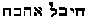; in the Hindu religion,
"Moksha"; among the Gnostics, the "Pleroma of eternal Light"; and by the
Buddhists, Nirvana. The Christian calls it the "Kingdom of Heaven," and
claims to have alone found the truth, whereas he has but invented a new
name for a doctrine which is coeval with man.

The proof that the transmigration of the soul does not relate to man's
condition on this earth *after* death, is found in the *Sohar,*
notwithstanding the many incorrect renderings of its translators. "All
souls which have alienated themselves in heaven from the Holy
One--blessed be His Name--have thrown themselves into an abyss at their
very existence, and have anticipated the time when they are to descend
on earth. [\*\*\*\*\*](#fn_587) . . .

###### p. 281

Come and see when the soul reaches the abode of Love. . . . The soul
could not bear this light, but for the luminous mantle which she puts
on. For, just as the soul, when sent to this earth, puts on an earthly
garment to preserve herself here, so she receives above a shining
garment, in order to be able to look without injury into the mirror,
whose light proceeds from the Lord of Light." [\*](#fn_588) Moreover, the *Sohar* teaches that the
soul cannot reach the abode of bliss, unless she has received the "holy
kiss," or the re-union of the soul *with the substance from which she
emanated--*spirit. All souls are dual, and, while the latter is a
feminine principle, the spirit is masculine. While imprisoned in body,
man is a trinity, unless his pollution is such as to have caused his
divorce from the spirit. "Woe to the soul which prefers to her divine
husband (spirit), the earthly wedlock with her terrestrial body,"
records a text of the *Book of the Keys.* [\*\*](#fn_589)

These ideas on the transmigrations and the trinity of man, were held by
many of the early Christian Fathers. It is the jumble made by the
translators of the *New Testament* and ancient philosophical treatises
between soul and spirit, that has occasioned the many misunderstandings.
It is also one of the many reasons why Buddha, Plotinus, and so many
other initiates are now accused of having longed for the total
extinction of their souls--"absorption unto the Deity," or "reunion with
the universal soul," meaning, according to modern ideas, annihilation.
The animal soul must, of course, be disintegrated of its particles,
before it is able to link its purer essence forever with the immortal
spirit. But the translators of both the *Acts* and the *Epistles,* who
laid the foundation of the *Kingdom of Heaven,* and the modern
commentators on the Buddhist *Sutra of the Foundation of the Kingdom of
Righteousness,* have muddled the sense of the great apostle of
Christianity, as of the great reformer of India. The former have
smothered the word ψυχικος, so that no reader imagines it to have any
relation with *soul;* and with this confusion of *soul* and *spirit*
together*, Bible* readers get only a perverted sense of anything on the
subject; and the interpreters of the latter have failed to understand
the meaning and object of the Buddhist four degrees of Dhyana.

In the writings of Paul, the entity of man is divided into a
trine--flesh, psychical existence or *soul,* and the overshadowing and
at the same time interior entity or **S**PIRIT. His phraseology is very
definite, when he teaches the *anastasis,* or the continuation of life
of those who have died. He maintains that there is a *psychical* body
which is sown in the corruptible, and a spiritual body that is raised in
incorruptible substance.

###### p. 282

"The first man is of the earth earthy, the second man from heaven." Even
James (iii. 15) identifies the soul by saying that its "wisdom
descendeth not from the above but is terrestrial, *psychical,
demoniacal*" (see Greek text). Plato, speaking of the Soul (*psuche*)*,*
observes that "when she allies herself to the *nous* (divine substance,
a god, as psuche is a goddess), she does everything aright and
felicitously; but the case is otherwise when she attaches herself to
*Annoia.*" What Plato calls *nous,* Paul terms the *Spirit;* and Jesus
makes the *heart* what Paul says of the *flesh.* The natural condition
of mankind was called in Greek αποστασια the new condition αναστασις. In
Adam came the former (death), in Christ the latter (resurrection), for
it is he who first publicly taught mankind the "Noble Path" to Eternal
life, as Gautama pointed the same Path to Nirvana. To accomplish both
ends there was but one way, according to the teachings of both.
"Poverty, chastity, contemplation or inner prayer; contempt for wealth
and the illusive joys of this world."

"Enter on this Path and put an end to sorrow; verily the Path has been
preached by me, who have found out how to quench the darts of grief. You
yourselves must make the effort; *the Buddhas are only preachers.* The
thoughtful who enter the Path are freed from the bondage of the Deceiver
(Mara)." [\*](#fn_590)

"Enter ye in at the strait gate: for wide is the gate, and broad is the
way that leadeth to destruction. . . . Follow me. . . . Every one that
heareth these sayings and doeth them not, shall be likened unto a
foolish man" (*Matthew* vii. and viii.). "*I can of mine own self do
nothing*" (*John* v. 30). "The care of this world, and the deceitfulness
of riches, choke the word" (*Matthew* xiii. 22), say the Christians; and
it is only by shaking off all delusions that the Buddhist enters on the
"Path" which will lead him "away from the restless tossing waves of the
ocean of life," and take him "to the calm City of Peace, to the real joy
and rest of Nirvana."

The Greek philosophers are alike made misty instead of mystic by their
too learned translators. The Egyptians revered the Divine Spirit, the
One-Only One, as **N**OUT. It is most evident that it is from that word
that Anaxagoras borrowed his denominative *nous*, or, as he calls it,
Νους αυτοκρατες--the Mind or Spirit self-potent, the αρ{! 0x63 c
!}cηετες κινεσεος. "All things," says he, "were in chaos; then came Nous
and introduced order." He also denominated this Nous the One that ruled
the many. In his idea Nous was God; and the *Logos* was man, the
emanation of the former. The external powers perceived *phenomena;* the
*nous* alone recognized

###### p. 283

*noumena* or subjective things. This is purely Buddhistic and esoteric.

Here Socrates took his clew and followed it, and Plato after him, with
the whole world of interior knowledge. Where the old Ionico-Italian
world culminated in Anaxagoras, the new world began with Socrates and
Plato. Pythagoras made the *Soul* a self-moving unit, with three
elements, the *nous,* the *phren* and the *thumos;* the latter two,
shared with the brutes; the former only, being his essential *self.* So
the charge that he taught transmigration is refuted; he taught no more
than Gautama-Buddha ever did, whatever the popular superstition of the
Hindu rabble made of it after his death. Whether Pythagoras borrowed
from Buddha, or Buddha from somebody else, matters not; the esoteric
doctrine is the same.

The Platonic School is even more distinct in enunciating all this.

The real selfhood was at the basis of all. Socrates therefore taught
that he had a *daimonion,* a spiritual something which put him in the
road to wisdom. He himself knew nothing, but this put him in the way to
learn all.

Plato followed him with a full investigation of the principles of being.
There was an *Agathon,* Supreme God, who produced in his own mind a
*paradeigma* of all things.

He taught that in man was "the immortal principle of the soul," a mortal
body, and a "separate mortal kind of soul," which was placed in a
separate receptacle of the body from the other; the immortal part was in
the head (*Timaeus* xix., xx.) the other in the trunk (xliv.).

Nothing is plainer than that Plato regarded the interior man as
constituted of two parts--one always the same, formed of the same entity
as Deity, and one mortal and corruptible.

"Plato and Pythagoras," says Plutarch, "distribute the soul into two
parts, the rational (noetic) and irrational (*agnoia*); that that part
of the soul of man which is rational, is eternal; for though it be not
God, yet it is the product of an eternal deity, but that part of the
soul which is divested of reason (*agnoia*) dies."

"Man," says Plutarch, "is compound; and they are mistaken who think him
to be compounded of two parts only. For they imagine that the
understanding is a part of the soul, but they err in this no less than
those who make the soul to be a part of the body, for the understanding
(*nous*) as far exceeds the soul, as the soul is better and diviner than
the body. Now this composition of the soul (ψυχε) with the understanding
(νουσ) makes reason; and with the body, passion; of which the one is the
beginning or principle of pleasure and pain, and the other of virtue and
vice. Of these three parts conjoined and compacted together, the earth

###### p. 284

has given the body, the moon the soul, and the sun the understanding to
the generation of man.

"Now of the deaths we die, *the one makes man two of three,* and the
other, *one* of (out of) two. The former is in the region and
jurisdiction of Demeter, whence the name given to the Mysteries τελειν
resembled that given to death, τελευταν. The Athenians also heretofore
called the deceased sacred to Demeter. As for the *other death* it is in
the moon or region of Persephone. And as with the one the terrestrial,
so with the other the celestial Hermes doth dwell. This suddenly and
with violence plucks the soul from the body; but Proserpina mildly and
in a long time disjoins the understanding from the soul. For this reason
she is called *Monogenes, only-begotten,* or rather *begetting one
alone;* for the better part of man becomes alone when it is separated by
her. Now both the one and the other happens thus according to nature. It
is ordained by Faith that every soul, whether with or without
understanding (νουσ), when gone out of the body, should wander for a
time, though not all for the same, in the region lying between the earth
and moon. For those that have been unjust and dissolute suffer there the
punishment due to their offences; but the good and virtuous are there
detained till they are purified, and have, by expiation, purged out of
them all the infections they might have contracted from the contagion of
the body, as if from foul health, living in the mildest part of the air,
called the Meadows of Hades, where they must remain for a certain
prefixed and appointed time. And then, as if they were returning from a
wandering pilgrimage or long exile into their country, they have a taste
of joy, such as they principally receive who are initiated into Sacred
Mysteries, mixed with trouble, admiration, and each one's proper and
peculiar hope."

The *daemonium* of Socrates was this νουσ, mind, spirit, or
understanding of the divine in it. "The νουσ of Socrates," says
Plutarch, "was pure and mixed itself with the body no more than
necessity required. . . . Every soul hath some portion of νουσ, reason,
a man cannot be a man without it; but as much of each soul as is mixed
with flesh and appetite is changed and through pain or pleasure becomes
irrational. Every soul doth not mix herself after one sort; some plunge
themselves into the body, and so, in this life their whole frame is
corrupted by appetite and passion; others are mixed as to some part, but
the purer part \[nous\] still remains *without the body.* It is not
drawn down into the body, but it swims above and touches (overshadows)
the extremest part of the man's head; it is like a cord to hold up and
direct the subsiding part of the soul, as long as it proves obedient and
is not overcome by the appetites of the flesh. The part that is plunged
into the body is called *soul.* But the incorruptible part is called the
*nous* and

the vulgar think it is within them,

###### p. 285

as they likewise imagine the image reflected from a glass to be in that
glass. But the more intelligent, who know it to be without, call it a
Daemon" (a god, a spirit).

"The soul, like to a dream, flies quick away, which it does not
immediately, as soon as it is separated from the body, but afterward,
when it is alone and divided from the understanding (*nous*). . . . The
soul being moulded and formed by the understanding (*nous*)*,* and
itself moulding and forming the body, by embracing it on every side,
receives from it an impression and form; so that although it be
separated both from the understanding and the body, it nevertheless so
retains still its figure and resemblance for a long time, that it may,
with good right, be called its image.

"And of these souls the moon is the element, because souls resolve into
her, as the bodies of the deceased do into earth. Those, indeed, who
have been virtuous and honest, living a quiet and philosophical life,
without embroiling themselves in troublesome affairs, are quickly
resolved; because, being left by the nous, understanding, and no longer
using the corporeal passions, they incontinently vanish away."

We find even Irenaeus, that untiring and mortal enemy of every Grecian
and "heathen" heresy, explain his belief in the trinity of man. The
perfect man, according to his views, consists of *flesh, soul,* and
*spirit.* ". . . carne, anima, spiritu, altero quidem figurante,
spiritu, altero quod formatur, carne. Id vero quod inter haec est duo,
est anima, quae aliquando subsequens spiritum elevatur ab eo, aliquando
autem consentiens carni in terrenas concupiscentias" (*Irenaeus* v*.,*
1).

And Origen, in his *Sixth Epistle to the Romans,* says: "There is a
threefold partition of man, the body or flesh, the lowest part of our
nature, on which the old serpent by original sin inscribed the law of
sin, and by which we are tempted to vile things, and as oft as we are
overcome by temptations are joined fast to the Devil; the spirit, in or
by which we express the likeness of the divine nature in which the very
Best Creator, from the archetype of his own mind, engraved with his
finger (that is, his spirit), the eternal law of honesty; by this we are
joined (conglutinated) to God and made one with God. In the third, the
soul mediates between these, which, as in a factious republic, cannot
but join with one party or the other, is solicited this way and that and
is at liberty to choose the side to which it will adhere. If, renouncing
the flesh, it betakes itself to the party of the spirit it will itself
become spiritual, but if it cast itself down to the cupidities of the
flesh it will degenerate itself into body."

Plato (in *Laws* x.) defines *soul* as "the motion that is able to move
itself." "Soul is the most ancient of all things, and the commencement

###### p. 286

of motion." "Soul was generated prior to body, and body is posterior and
secondary, as being, according to nature, ruled over by the ruling
soul." "The soul which administers all things that are moved in every
way, administers likewise the heavens."

"Soul then leads everything in heaven, and on earth, and in the sea, by
its movements--the names of which are, to will, to consider, to take
care of, to consult, to form opinions true and false, to be in a state
of joy, sorrow, confidence, fear, hate, love, together with all such
primary movements as are allied to these . . . being a goddess herself,
she ever takes as an ally **N**OUS, a god, and disciplines all things
correctly and happily; but when with *Annoia--*not *nous--*it works out
everything the contrary."

In this language, as in the Buddhist texts, the negative is treated as
essential existence. *Annihilation* comes under a similar exegesis. The
positive state, is essential being but no manifestation as such. When
the spirit, in Buddhistic parlance, entered *nirvana,* it lost objective
existence but retained subjective. To objective minds this is becoming
absolute nothing; to subjective, NO-thing, nothing to be displayed to
sense.

These rather lengthy quotations are necessary for our purpose. Better
than anything else, they show the agreement between the oldest "Pagan"
philosophies--not "assisted by the light of divine revelation," to use
the curious expression of Laboulaye in relation to Buddha--and the early
Christianity of some Fathers. Both Pagan philosophy and Christianity,
however, owe their elevated ideas on the soul and spirit of man and the
unknown Deity to Buddhism and the Hindu Manu. No wonder that the
Manicheans maintained that Jesus was a permutation of Gautama; that
Buddha, Christ, and Mani were one and the same person, [\*](#fn_591) for the teachings of the former two
were identical. It was the doctrine of old India that Jesus held to when
preaching the complete renunciation of the world and its vanities in
order to reach the kingdom of Heaven, Nirvana, where "men neither marry
nor are given in marriage, but live like the angels."

It is the philosophy of Siddhartha-Buddha again that Pythagoras
expounded, when asserting that the *ego* (νουσ) was eternal with God,
and that the soul only passed through various stages (Hindu
*Rupa-locas*) to arrive at the divine excellence; meanwhile the *thumos*
returned to the earth, and even the *phren* was eliminated. Thus the
*metempsychosis* was only a succession of disciplines through
refuge-heavens (called by the Buddhists *Zion*), [\*\*](#fn_592) to work off the exterior mind, to rid
the *nous* of the

###### p. 287

*phren,* or soul, the Buddhist "Winyanaskandaya," *that principle that
lives* from *Karma* and the Skandhas (groups). It is the latter, the
metaphysical personations of the "deeds" of man, whether good or bad,
which, after the death of his body, incarnate themselves, so to say, and
form their many invisible but never-dying compounds into a new body, or
rather into an ethereal being, the *double* of what man was *morally.*
It is the astral body of the kabalist and the "incarnated deeds" which
form the new sentient self as his *Ahancara* (the ego,
self-consciousness), given to him by the sovereign Master (the breath of
God) can never perish, for it is immortal *per se* as a spirit; hence
the sufferings of the newly-born *self* till he rids himself of every
earthly thought, desire, and passion.

We now see that the "four mysteries" of the Buddhist doctrine have been
as little understood and appreciated as the "wisdom" hinted at by Paul,
and spoken "among them that are *perfect*" (initiated), the
"mystery-wisdom" which "none of the *Archons* of this world knew." [\*](#fn_593) The fourth degree of the Buddhist
Dhyana, the fruit of Samadhi, which leads to the utmost perfection, to
*Viconddham,* a term correctly rendered by Burnouf in the verb
"*perfected,*"* [\*\*](#fn_594)* is wholly
misunderstood by others, as well as in himself. Defining the condition
of Dhyana, St. Hilaire argues thus:

"Finally, having attained the fourth degree, the ascetic possesses no
more this feeling of beatitude, however obscure it may be . . . he has
also lost all memory . . . he has reached impassibility, as near a
neighbor of Nirvana as can be. . . . However, this absolute
impassibility does not hinder the ascetic from acquiring, at this very
moment, *omniscience and the magical power; a flagrant contradiction,
about which the Buddhists* no more disturb themselves than about so many
others." [\*\*\*](#fn_595)

And why should they, when these contradictions are, in fact, no
contradictions at all? It ill behooves us to speak of contradictions in
other peoples' religions, when those of our own have bred, besides the
three great conflicting bodies of Romanism, Protestantism, and the
Eastern Church, a thousand and one most curious smaller sects. However
it may be, we have here a term applied to one and the same thing by the
Buddhist holy "mendicants" and Paul, the Apostle. When the latter says:
"If so be that I might attain the *resurrection* from among the dead
\[the Nirvana\], not as though I had already attained, or were already
*perfect*" (initiated), [\*\*\*\*](#fn_596) he
uses an expression common among the initiated Buddhists. When a Buddhist
ascetic has reached the "fourth degree," he is considered a rahat. He
produces every kind of phenomena by the

###### p. 288

sole power of his freed spirit. A *rahat,* say the Buddhists, is one who
has acquired the power of flying in the air, becoming invisible,
commanding the elements, and working all manner of wonders, commonly,
and as erroneously, called *meipo* (miracles). He is a *perfect* man, a
demi-god. A god he will become when he reaches Nirvana; for, like the
initiates of both Testaments, the worshippers of Buddha know that they
"are gods."

"Genuine Buddhism, overleaping the barrier between finite and infinite
mind, urges its followers to aspire, *by their own efforts,* to that
divine perfectibility of which it teaches that man is capable, and by
attaining which man becomes *a god,*" says Brian Houghton Hodgson. [\*](#fn_597)

Dreary and sad were the ways, and blood-covered the tortuous paths by
which the world of the Christians was driven to embrace the Irenaean and
Eusebian Christianity. And yet, unless we accept the views of the
ancient Pagans, what claim has our generation to having solved any of
the mysteries of the "kingdom of heaven"? What more does the most pious
and learned of Christians know of the future destiny and progress of our
immortal spirits than the heathen philosopher of old, or the modern
"Pagan" beyond the Himalaya? Can he even boast that he knows as much,
although he works in the full blaze of "divine" revelation? We have seen
a Buddhist holding to the religion of his fathers, both in theory and
practice; and, however blind may be his faith, however absurd his
notions on some particular doctrinal points, later engraftings of an
ambitious clergy, yet in practical works his Buddhism is far more
Christ-like in deed and spirit than the average life of our Christian
priests and ministers. The fact alone that his religion commands him to
"honor his own faith, but never slander that of other people," [\*\*](#fn_598) is sufficient. It places the Buddhist
lama immeasurably higher than any priest or clergyman who deems it his
sacred duty to curse the "heathen" to his face, and sentence him and his
religion to "eternal damnation." Christianity becomes every day more a
religion of pure emotionalism. The doctrine of Buddha is entirely based
on practical works. A general love of all beings, human and animal, is
its nucleus. A man who knows that unless he toils for himself he has to
starve, and understands that he has no scapegoat to carry the burden of
his iniquities for him, is ten times as likely to become a better man
than one who is taught that murder, theft, and profligacy can be washed
in one instant as white as snow, if he but believes in a God who, to
borrow an expression of Volney, "once took food upon earth, and is now
himself the food of his people."

------------------------------------------------------------------------

### Footnotes

[251:\*](iu105.htm#fr_523) Socrates; "Scol.
Eccl. Hist.," b. I., c. ix.

[252:\*](iu105.htm#fr_524) "Proverbs," chap.
xvi., p. 33. In ancient Egypt and Greece, and among Israelites, small
sticks and balls called the "sacred divining lots" were used for this
kind of oracle in the temples. According to the figures which were
formed by the accidental juxtaposition of the latter, the priest
interpreted the will of the gods.

[254:\*](iu105.htm#fr_525) Another
untrustworthy, untruthful, and ignorant writer, and ecclesiastical
historian of the fifth century. His alleged history of the strife
between the Pagans, Neoplatonics, and the Christians of Alexandria and
Constantinople, which extends from the year 324 to 439, dedicated by him
to Theodosius, the younger, is full of deliberate falsifications.
Edition of "Reading," Cantab, 1720, fol. Translated. Plon freres, Paris.

[254:\*\*](iu105.htm#fr_526) "Gems of the
Orthodox Christians," vol. i., p. 135.

[254:\*\*\*](iu105.htm#fr_527) Revelation xiv.
1.

[255:\*](iu105.htm#fr_528) Daghoba is a small
temple of globular form, in which are preserved the relics of Gautama.

[255:\*\*](iu105.htm#fr_529) Prachidas are
buildings of all sizes and forms, like our mausoleums, and are sacred to
votive offerings to the dead.

[255:\*\*\*](iu105.htm#fr_530) The Talmudistic
records claim that, after having been hung, he was lapidated and buried
under the water at the junction of two streams. "Mishna Sanhedrin," vol.
vi., p. 4; "Talmud," of Babylon, same article, 43 a, 67 a.

[255:\*\*\*\*](iu105.htm#fr_531) "Coptic
Legends of the Crucifixion," **MSS**. xi.

[255:\*\*\*\*\*](iu105.htm#fr_532) The
engraving represents the talisman as of twice the natural size. We are
at a loss to understand why King, in his "Gnostic Gems," represents
Solomon's seal as a five-pointed star, whereas it is six-pointed, and is
the signet of Vishnu, in India.

[256:\*](iu105.htm#fr_533) King ("Gnostics")
gives the figure of a Christian symbol, very common during the middle
ages, of three fishes interlaced into a triangle, and having the FIVE
letters (a most sacred Pythagorean number) Ι. Χ. ΘΥΣ. engraved on it.
The number five relates to the same kabalistic computation.

[258:\*](iu105.htm#fr_534) "La Genese de
l'Humanite," p. 9.

[260:\*](iu105.htm#fr_535) The kabalistic
Sephiroth are also ten in number, or five pairs.

[260:\*\*](iu105.htm#fr_536) An avatar is a
descent from on high upon earth of the Deity in some manifest shape.

[260:\*\*\*](iu105.htm#fr_537) "Bhagavatta."

[260:\*\*\*\*](iu105.htm#fr_538) "Manu," books
i. and xii.

[261:\*](iu105.htm#fr_539) See Cory's "Ancient
Fragments."

[261:\*\*](iu105.htm#fr_540) "Origin of
Species," first edition, p. 484.

[261:\*\*\*](iu105.htm#fr_541) Ibid., p. 484.

[261:\*\*\*\*](iu105.htm#fr_542) Ibid., pp.
488, 489.

[261:\*\*\*\*\*](iu105.htm#fr_543) "La Genese
de l'Humanite," p. 339.

[261:\*\*\*\*\*\*](iu105.htm#fr_544)
"Traditions Indo-Europeennes et Africaines," p. 291.

[262:\*](iu105.htm#fr_545) "Traditions
Indo-Europeennes et Africaines," pp. 294, 295.

[262:\*\*](iu105.htm#fr_546) "Les Fils de
Dieu," p. 32.

[262:\*\*\*](iu105.htm#fr_547) "Le Spiritisme
dans le Monde," p. 78 and others.

[262:\*\*\*\*](iu105.htm#fr_548) "Les Fils de
Dieu," p. 272. While not at all astonished that Brahmans should have
refused to satisfy M. Jacolliot's curiosity, we must add that the
meaning of this sign is known to the superiors of every Buddhist
lamasery, not alone to the Brahmans.

[262:\*\*\*\*\*](iu105.htm#fr_549) "La Genese
de l'Humanite," p. 339.

[265:\*](iu105.htm#fr_550) See "Journal of the
Royal Asiatic Society," vol. xiii., p. 79.

[266:\*](iu105.htm#fr_551) *Lahgash*. is nearly
identical in meaning with *Vach,* the hidden power of the Mantras.

[267:\*](iu105.htm#fr_552) In "Rig-Veda
Sanhita" the meaning is given by Max Muller as the Absolute, "for it is
derived from '*diti*,' bond, and the negative particle *A*."

[267:\*\*](iu105.htm#fr_553) "Hymns to the
Maruts," I., 89, 10.

[267:\*\*\*](iu105.htm#fr_554) Ibid., I., 24,
1.

[267:\*\*\*\*](iu105.htm#fr_555) Ibid., X., 63,
2.

[267:\*\*\*\*\*](iu105.htm#fr_556) Thus is it
that we find in all the philosophical theogonies, the Holy Ghost female.
The numerous sects of the Gnostics had Sophia; the Jewish kabalists and
Talmudists, Shekinah (the garment of the Highest), which descended
between the two cherubim upon the Mercy Seat; and we find even Jesus
made to say, in an old text, "*My Mother,* the Holy Ghost, took me."

[267:\*\*\*\*\*\*](iu105.htm#fr_557) Narayana,
or that which moves on the waters.

[267:\*\*\*\*\*\*\*](iu105.htm#fr_558) "Manu,"
sloka 12.

[267:\*b](iu105.htm#fr_559) George Smith gives
the first verses of the Akkadian *Genesis* as found in the Cuneiform
Texts on the "Lateres Coctiles." There, also, we find *Anu*, the passive
deity or En-Soph, *Bel*, the Creator, the Spirit of God (Sephira) moving
on the face of the waters, hence water itself, and *Hea* the Universal
Soul or wisdom of the three combined.

The first eight verses read thus:

1\. When above, were not raised the heavens;

2\. and below on the earth a plant had not grown up.

3\. The abyss had not broken its boundaries.

4\. The chaos (or water) Tiamat (the sea) was the producing mother of
the whole of them. (This is the Cosmical Aditi and Sephira.)

5\. Those waters at the beginning were ordained but

6\. a tree had not grown, a flower had not unfolded.

7\. When the gods had not sprung up, any one of them;

8\. a plant had not grown, and order did not exist.

This was the chaotic or ante-genesis period.

[268:\*](iu105.htm#fr_560) ee Haug's "Aytareya
Brahmanam," of the Rig-Veda.

[268:\*\*](iu105.htm#fr_561) The same
transformations are found in the cosmogony of every important nation.
Thus, we see in the Egyptian mythology, Isis and Osiris, sister and
brother, man and wife; and Horus, the Son of both, becoming the husband
of his mother, Isis, and producing a son, *Malouli*.

[268:\*b](iu105.htm#fr_562) When a female
power, she is Sephira; when male, he is Adam Kadmon; for, as the former
contains in herself the other nine Sephiroth, so, in their totality, the
latter, including Sephira, is embodied in the Archetypal Kadmon, the
προτογονοσ.

[269:\*](iu105.htm#fr_563) Mandala I., Sukta
166, Max Muller.

[269:\*\*](iu105.htm#fr_564) "Asiatic
Researches," vol. viii., pp. 402, 403; Colebrooke's translation.

[269:\*\*\*](iu105.htm#fr_565) As in the
Pythagorean numerical system every number on earth, or the world of the
effects, corresponds to its invisible prototype in the world of causes.

[270:\*](iu105.htm#fr_566) See initial chap.,
vol. i., word Yajna.

[270:\*b](iu105.htm#fr_567) Eve is the trinity
of nature, and Adam the unity of spirit; the former the created material
principle, the latter the ideal organ of the creative principle, or, in
other words, this androgyne is both the principle and the Logos, for
 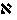is the male, and ב
the female; and, as Levi expresses it, this first letter of the holy
language, Aleph, represents a man pointing with one hand toward the sky,
and with the other toward the ground. It is the macrocosm and the
microcosm at the same time, and explains the double triangle of the
Masons and the five-pointed star. While the male is active the female
principle is passive, for it is SPIRIT and MATTER, the latter word
meaning *mother* in nearly every language. The columns of Soloman's
temple, Jachin and Boaz, are the emblems of the androgyne; they are also
respectively male and female, white and black, square and round; the
male a unity, the female a binary. In the later kabalistic treatises,
the active principle is pictured by the sword  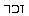, the passive by the sheath
 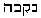. See "Dogme et
Rituel de la Haute Magie," vol. i.

[270:\*\*b](iu105.htm#fr_568) The vertical line
being the male principle, and the horizontal the female, out of the
union of the two at the intersection point is formed the CROSS; the
oldest symbol in the Egyptian history of gods. It is the key of Heaven
in the rosy fingers of Neith, the celestial virgin, who opens the gate
at dawn for the exit of her first-begotten, the radiant sun. It is the
Stauros of the Gnostics, and the philosophical cross of the high-grade
Masons. We find this symbol ornamenting the *tee* of the umbrella-shaped
oldest pagodas in Thibet, China, and India, as we find it in the hand of
Isis, in the shape of the "handled cross." In one of the Chaitya caves,
at Ajunta, it surmounts the three umbrellas in stone, and forms the
centre of the vault.

[271:\*](iu105.htm#fr_569) "When this world had
emerged from obscurity, the subtile elementary principles produced the
vegetable germ which at first animated the plants; from the plants, life
passed through the fantastic organisms which were born in the ilus
(*boue*) of the waters; then through a series of forms and different
animals, it at length reached man" ("Manu," book i.; and "Bhagavatta").

Manu is a convertible type, which can by no means be explained as a
personage. Manu means sometimes humanity, sometimes man. The Manu who
emanated from the uncreated Swayambhuva is, without doubt, the type of
Adam Kadmon. The Manu who is progenitor of the other six Manus is
evidently identical with the Rishis, or seven primeval sages who are the
forefathers of the post-diluvian races. He is--as we shall show in
Chapter **VIII**.--Noah, and his six sons, or subsequent generations are
the originals of the post-diluvian and mythical patriarchs of the Bible.

[271:\*b](iu105.htm#fr_570) Cory's "Ancient
Fragments."

[272:\*](iu105.htm#fr_571) See Vol. I., chap.
i., pp. 33, 34, of this work.

[272:\*\*](iu105.htm#fr_572) "Sepher Jezireh,"
chap. i., Mishna ixth.

[272:\*\*\*](iu105.htm#fr_573) Ibid.

[272:\*\*\*\*](iu105.htm#fr_574) "Sohar," i., 2
a.

[273:\*](iu105.htm#fr_575) "Sepher Jezireh,"
Mishna ix., 10.

[273:\*\*](iu105.htm#fr_576) It is interesting
to recall Hebrews i. 7, in connection with this passage. "Who maketh his
angels (messengers) spirits, and his ministers (servants, those who
minister) a flame of fire." The resemblance is too striking for us to
avoid the conclusion that the author of "Hebrews" was as familiar with
the "Kabala" as adepts usually are.

[274:\*](iu105.htm#fr_577) "The Sons of God";
"The India of the Brahmans," p. 230.

[274:\*\*](iu105.htm#fr_578) May it not be that
Hanouma is the representative of that link of beings half-man,
half-monkeys, which, according to the theories of Messrs. Hovelacque and
Schleicher, were arrested in their development, and fell, so to say,
into a retrogressive evolution?

[274:\*\*\*](iu105.htm#fr_579) The Primal or
Ultimate Essence has *no name* in India. It is indicated sometimes as
"That" and "This." "This (universe) was not originally anything. There
was neither heaven, nor earth, nor atmosphere. That being non-existent
resolved 'Let me be.' " (Original Sanscrit Text.) Dr. Muir, vol. v., p.
366.

[278:\*](iu105.htm#fr_580) Coleman's "Hindu
Mythology."

[278:\*\*](iu105.htm#fr_581) The siege and
subsequent surrender of Lanca (Isle of Ceylon) to Rama is placed by the
Hindu chronology--based upon the Zodiac--at 7,500 to 8,000 years B.C.,
and the following or eighth incarnation of Vishnu at 4,800 B.C. (from
the book of the Historical Zodiacs of the Brahmans).

[278:\*\*\*](iu105.htm#fr_582) A Hanoverian
scientist has recently published a work entitled *Ueber die Auflosung
der Arten dinck Naturliche Zucht Wahl,* in which he shows, with great
ingenuity, that Darwin was wholly mistaken in tracing man back to the
ape. On the contrary, he maintains that it is the ape which has evolved
from man. That, in the beginning, mankind were, morally and physically,
the types and prototypes of our present race and of human dignity, by
their beauty of form, regularity of feature, cranial development,
nobility of sentiments, heroic impulses, and grandeur of ideal
conceptions. This is a purely Brahmanic, Buddhistic, and kabalistic
philosophy. His book is copiously illustrated p.
279 with diagrams, tables, etc. He says that the gradual
debasement and degradation of man, morally and physically, can be
readily traced throughout the ethnological transformations down to our
times. And, as one portion has already degenerated into apes, so the
civilized man of the present day will at last, under the action of the
inevitable law of necessity, be also succeeded by like descendants. If
we may judge of the future by the actual present, it certainly does seem
possible that so unspiritual and materialistic a body as our physical
scientists should end as *simia* rather than as seraphs.

[280:\*](iu105.htm#fr_583) "De Bel. Jud.," vol.
ii., 12.

[280:\*\*](iu105.htm#fr_584) "De Somniis," p.
455 d.

[280:\*\*\*](iu105.htm#fr_585) "Sohar," vol.
ii., p. 96.

[280:\*\*\*\*](iu105.htm#fr_586) "Mishna"
"Aboth," vol. iv., p. 29; Mackenzie's "Royal Masonic Cyclopaedia," p.
413.

[280:\*\*\*\*\*](iu105.htm#fr_587) "Sohar,"
vol. iii, p. 61 b.

[281:\*](iu105.htm#fr_588) Ibid., vol. i., p.
65b.

[281:\*\*](iu105.htm#fr_589) Hermetic work.

[282:\*](iu105.htm#fr_590) "Dhamma-pada,"
slokas 276 et seq.

[286:\*](iu105.htm#fr_591) Neander: "History of
the Church," vol. i., p. 817.

[286:\*\*](iu105.htm#fr_592) It is from the
highest *Zion* that Maitree-Buddha, the Saviour to come, will descend on
earth; and it is also from Zion that comes the Christian Deliverer (see
Romans xi. 26).

[287:\*](iu105.htm#fr_593) 1 Corinth. ii. 6, 7,
8.

[287:\*\*](iu105.htm#fr_594) "Lotus de la Bonne
Loi," p. 806.

[287:\*\*\*](iu105.htm#fr_595) "Du Bouddhisme,"
95.

[287:\*\*\*\*](iu105.htm#fr_596) Philippians
iii. 11-14.

[288:\*](iu105.htm#fr_597) "The Mahavansa,"
vol. i., Introduction.

[288:\*\*](iu105.htm#fr_598) The Five Articles
of Faith.

------------------------------------------------------------------------

[Next: Chapter VII](iu106)
