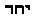
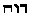
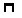

[Intangible Textual Heritage](../../index)  [Theosophy](../index) 
[Index](index)  [Previous](iu105)  [Next](iu107) 

------------------------------------------------------------------------

###### p. 289

### CHAPTER VII.

> "Of the tenets of the Druzes, nothing authentic has ever come to
> light; the popular belief amongst their neighbors is, that they adore
> an idol in the form of a calf."--**K**ING:
>
> The Gnostics and their Remains.

> "O ye Lords of Truth without fault, who are forever cycling for
> eternity . . . save me from the annihilation of this Region of the
> *Two Truths.*"
>
> --Egyptian Ritual of the Dead.

> "Pythagoras correctly regarded the 'Ineffable Name' of God . . . as
> the Key to the Mysteries of the universe."--**P**ANCOAST:
>
> Blue and Red Light.

IN the next two chapters we shall notice the most important of the
Christian secret sects--the so-called "Heresies" which sprang into
existence between the first and fourth centuries of our era.

Glancing rapidly at the Ophites and Nazareans, we shall pass to their
scions which yet exist in Syria and Palestine, under the name of Druzes
of Mount Lebanon; and near Basra or Bassorah, in Persia, under that of
Mendaeans, or Disciples of St. John. All these sects have an immediate
connection with our subject, for they are of kabalistic parentage and
have once held to the secret "Wisdom Religion," recognizing as the One
Supreme, the Mystery-God of the *Ineffable Name.* Noticing these
numerous secret societies of the past, we will bring them into direct
comparison with several of the modern. We will conclude with a brief
survey of the Jesuits, and of that venerable nightmare of the Roman
Catholic Church--modern Freemasonry. All of these modern as well as
ancient fraternities--present Freemasonry excepted--were and are more or
less connected with magic--practically, as well as theoretically; and,
every one of them--Freemasonry *not* excepted--was and still is accused
of demonolatry, blasphemy, and licentiousness.

Our object is not to write the history of either of them; but only to
compare these sorely-abused communities with the Christian sects, past
and present, and then, taking historical facts for our guidance, to
defend the secret science as well as the men who are its students and
champions against any unjust imputation.

One by one the tide of time engulfed the sects of the early centuries,
until of the whole number only one survived in its primitive integrity.
That one still exists, still teaches the doctrine of its founder, still
exemplifies its faith in works of power. The quicksands which swallowed
up

###### p. 290

every other outgrowth of the religious agitation of the times of Jesus,
with its records, relics, and traditions, proved firm ground for this.
Driven from their native land, its members found refuge in Persia, and
to-day the anxious traveller may converse with the direct descendants of
the "Disciples of John," who listened, on the Jordan's shore, to the
"man sent from God," and were baptized and believed. This curious
people, numbering 30,000 or more, are miscalled "Christians of St.
John," but in fact should be known by their old name of Nazareans, or
their new one of Mendaeans.

To term them Christians, is wholly unwarranted. They neither believe in
Jesus as Christ, nor accept his atonement, nor adhere to his Church, nor
revere its "Holy Scriptures." Neither do they worship the Jehovah-God of
the Jews and Christians, a circumstance which of course proves that
their founder, John the Baptist, did not worship him either. And if not,
what right has he to a place in the *Bible,* or in the portrait-gallery
of Christian saints? Still further, if Ferho was his God, and he was "a
man sent by God," he must have been sent by Lord Ferho, and in his name
baptized and preached? Now, if Jesus was baptized by John, the inference
is that he was baptized according to his own faith; therefore, Jesus
too, was a believer in Ferho, or Faho, as they call him; a conclusion
that seems the more warranted by his silence as to the name of his
"Father." And why should the hypothesis that *Faho* is but one of the
many corruptions of Fho or Fo, as the Thibetans and Chinese call Buddha,
appear ridiculous? In the North of Nepaul, Buddha is more often called
*Fo* than *Buddha.* The Book of *Mahawansa* shows how early the work of
Buddhistic proselytism began in Nepaul; and history teaches that
Buddhist monks crowded into Syria [\*](#fn_599)
and Babylon in the

p. 291

century preceding our era, and that Buddhasp (Bodhisatva) the alleged
Chaldean, was the founder of Sabism or *baptism.* [\*](#fn_600)

What the actual Baptists, *el-Mogtasila,* or Nazareans, do believe, is
fully set forth in other places, for they are the very Nazarenes of whom
we have spoken so much, and from whose *Codex* we have quoted.
Persecuted and threatened with annihilation, they took refuge in the
Nestorian body, and so allowed themselves to be arbitrarily classed as
Christians, but as soon as opportunity offered, they separated, and now,
for several centuries have not even nominally deserved the appellation.
That they are, nevertheless, so called by ecclesiastical writers, is
perhaps not very difficult to comprehend. They know too much of early
Christianity to be left outside the pale, to bear witness against it
with their traditions, without the stigma of heresy and backsliding
being fastened upon them to weaken confidence in what they might say.

But where else can science find so good a field for biblical research as
among this too neglected people? No doubt of their inheritance of the
Baptist's doctrine; their traditions are without a break. What they
teach now, their forefathers taught at every epoch where they appear in
history. They are the disciples of that John who is said to have
foretold the advent of Jesus, baptized him, and declared that the
latchet of his shoe he (John) was not worthy to unloose. As they
two--the Messenger and the Messiah--stood in the Jordan, and the elder
was consecrating the younger--his own cousin, too, humanly speaking--the
heavens opened and God Himself, in the shape of a dove, descended in a
glory upon his "Beloved Son"! How then, if this tale be true, can we
account for the strange infidelity which we find among these surviving
Nazareans? So far from believing Jesus the Only Begotten Son of God,
they actually told the Persian missionaries, who, in the seventeenth
century, first discovered them to Europeans, that the Christ of the *New
Testament* was "a false teacher," and that the Jewish system, as well as
that of Jesus (?), came from the realm of darkness! Who knows better
than they? Where can more competent living witnesses be found? Christian
ecclesiastics

###### p. 292

would force upon us an anointed Saviour heralded by John, and the
disciples of this very Baptist, from the earliest centuries, have
stigmatized this ideal personage as an impostor, and his putative
Father, Jehovah, "a spurious God," the Ilda-Baoth of the Ophites!
Unlucky for Christianity will be the day when some fearless and honest
scholar shall persuade their elders to let him translate the contents of
their secret books and compile their hoary traditions! It is a strange
delusion that makes some writers think that the Nazareans have no other
sacred literature, no other literary relics than four doctrinal works,
and that curious volume full of astrology and magic which they are bound
to peruse at the sunset hour, on every Sol's day (Sunday).

This search after truth leads us, indeed, into devious ways. Many are
the obstacles that ecclesiastical cunning has placed in the way of our
finding the primal source of religious ideas. Christianity is on trial,
and has been, ever since science felt strong enough to act as Public
Prosecutor. A portion of the case we are drafting in this book. What of
truth is there in this Theology? Through what sects has it been
transmitted? *Whence* *was it primarily derived?* To answer, we must
trace the history of the World Religion, alike through the secret
Christian sects as through those of other great religious subdivisions
of the race; *for the Secret Doctrine is the Truth,* and that religion
is nearest divine that has contained it with least adulteration.

Our search takes us hither and thither, but never aimlessly do we bring
sects widely separated in chronological order, into critical
juxtaposition. There is one purpose in our work to be kept constantly in
view--the analysis of religious beliefs, and the definition of their
descent from the past to the present. What has most blocked the way is
Roman Catholicism; and not until the secret principles of this religion
are uncovered can we comprehend the iron staff upon which it leans to
steady its now tottering steps.

We will begin with the Ophites, Nazareans, and the modern Druzes. The
personal views of the author, as they will be presented in the diagrams,
will be most decidedly at variance with the prejudiced speculations of
Irenaeus, Theodoret, and Epiphanius (the sainted renegade, who sold his
brethren), inasmuch as they will reflect the ideas of certain kabalists
in close relations with the mysterious Druzes of Mount Lebanon. The
Syrian *okhals,* or Spiritualists, as they are sometimes termed, are in
possession of a great many ancient manuscripts and gems, bearing upon
our present subject.

The first *scheme--*that of the Ophites--from the very start, as we have
shown, varies from the description given by the Fathers, inasmuch as it
makes Bythos or depth, a female emanation, and assigns her a place

###### p. 293

answering to that of Pleroma, only in a far superior region; whereas,
the Fathers assure us that the Gnostics gave the name of Bythos to the
First Cause. As in the kabalistic system, it represents the boundless
and infinite void within which is concealed in darkness the Unknown
Primal motor of all. It envelops **H**IM like a veil: in short we
recognize again the "Shekinah" of the En-Soph. Alone, the name of ΙΑΟ,
Iao, marks the upper centre, or rather the presumed spot where the
Unknown One may be supposed to dwell. Around the Iao, runs the legend,
ΚΕΜΕΚ ΕΙΛΑΜ ΑΒΡΑΣΑΧ. "The eternal Sun-Abrasax" (the Central Spiritual
Sun of all the kabalists, represented in some diagrams of the latter by
the circle of Tiphereth).

From this region of unfathomable Depth, issues forth a circle formed of
spirals; which, in the language of symbolism, means a grand cycle,
κυκλοσ, composed of smaller ones. Coiled within, so as to follow the
spirals, lies the serpent--emblem of wisdom and eternity--the Dual
Androgyne: the cycle representing *Ennoia* or the Divine mind, and the
Serpent--the Agathodaimon, Ophis--the Shadow of the Light. Both were the
Logoi of the Ophites; or the unity as Logos manifesting itself as a
double principle of good and evil; for, according to their views, these
two principles are immutable, and existed from all eternity, as they
will ever continue to exist.

This symbol accounts for the adoration by this sect of the Serpent, as
the Saviour, coiled either around the Sacramental loaf or a Tau. As a
unity, Ennoia and Ophis are the Logos; when separated, one is the Tree
of Life (Spiritual); the other, the Tree of Knowledge of Good and Evil.
Therefore, we find Ophis urging the first human couple--the material
production of Ilda-Baoth, but which owed its spiritual principle to
Sophia-Achamoth--to eat of the forbidden fruit, although Ophis
represents Divine Wisdom.

The Serpent, the Tree of Knowledge of Good and Evil, and the Tree of
Life, are all symbols transplanted from the soil of India. The
Arasa-Maram, the banyan tree, so sacred with the Hindus, since Vishnu,
during one of his incarnations, reposed under its mighty shade, and
there taught humanity philosophy and sciences, is called the Tree of
Knowledge and the Tree of Life. Under the protective umbrage of this
king of the forests, the Gurus teach their pupils their first lessons on
immortality and initiate them in the mysteries of life and death. The
*Java*-**A**LEIM of the Sacerdotal College are said, in the Chaldean
tradition, to have taught the sons of men to become like one of them. To
the present day Foh-tchou, [\*](#fn_601) who
lives in his Foh-Maeyu, or temple of Buddha, on the

###### p. 294

top of "Kouin-long-sang," [\*](#fn_602) the
great mountain, produces his greatest religious miracles under a tree
called in Chinese Sung-Ming-Shu, or the Tree of Knowledge and the Tree
of Life, for ignorance is death, and knowledge alone gives immortality.
This marvellous display takes place every three years, when an immense
concourse of Chinese Buddhists assemble in pilgrimage at the holy place.

Ilda-Baoth, the "Son of Darkness," and the creator of the material
world, was made to inhabit the planet Saturn, which identifies him still
more with the Jewish Jehovah, who was Saturn himself, according to the
Ophites, and is by them denied his Sinaitic name. From Ilda-Baoth
emanate six spirits, who respectively dwell with their father in the
seven planets. These are Saba--or Mars; Adonai--Sol, or the Sun; [\*\*](#fn_603) Ievo--the Moon; Eloi--Jupiter;
Astaphoi--Mercury (spirit of water); and Ouraios--Venus, spirit of
fire. [\*\*\*](#fn_604)

In their functions and description as given, these seven planets are
identical with the Hindu *Sapta-Loca,* the seven places or spheres, or
the superior and inferior worlds; for they represent the kabalistic
seven spheres. With the Ophites, they belong to the lower spheres. The
monograms of these Gnostic planets are also Buddhistic, the latter
differing, albeit slightly, from those of the usual astrological
"houses." In the explanatory notes which accompany the diagram, the
names of Cirenthius (the disciple of Simon Magus), of Menander, and of
certain other Gnostics, whose names are not to be met with in the
Patristic writings, are often mentioned; such as Parcha (Ferho), for
instance. [\*\*\*\*](#fn_605)

The author of the diagram claims, moreover, for his sect, the greatest
antiquity, bringing forward, as a proof, that their "forefathers" were
the builders of all the "Dracontia" temples, even of those beyond "the
great waters." He asserts that the "Just One," who was the mouth-piece
of the Eternal AEon (Christos), himself sent his disciples into the
world, placing them under the double protection of Sige (Silence, the

###### p. 295

Logos), and Ophis, the Agathodaemon. The author alludes no doubt, to the
favorite expression of Jesus, "be wise as serpents, and harmless as
doves." On the diagram, Ophis is represented as the Egyptian Cnuphis or
Kneph, called Dracontiae. He appears as a serpent standing erect on its
tail, with a lion's head, crowned and radiated, and bearing on the point
of each ray one of the seven Greek vowels--symbol of the seven celestial
spheres. This figure is quite familiar to those who are acquainted with
the Gnostic gems, [\*](#fn_606) and is borrowed
from the Egyptian *Hermetic books.* The description given in the
*Revelation,* of one "like unto the Son of Man," with his seven stars,
and who is the Logos, is another form of Ophis.

The Nazarene diagram, except in a change of names, is identical with
that of the Gnostics, who evidently borrowed their ideas from it, adding
a few appellations from the Basilidean and Valentinian systems. To avoid
repetition, we will now simply present the two in parallel.

Thus, we find that, in the Nazarene Cosmogony, the names of their powers
and genii stand in the following relations to those of the Gnostics:

<table data-cellspacing="0" data-border="0" data-cellpadding="9" width="798">
<colgroup>
<col style="width: 50%" />
<col style="width: 50%" />
</colgroup>
<tbody>
<tr class="odd">
<td width="50%" data-valign="TOP">
<strong>N</strong>AZARENE.

<em></em>

First Trinity.

Lord <strong>F</strong>ERHO--the Life which is no Life--the Supreme God. The <em>Cause</em> which produces the Light, or the Logos <em>in</em> <em>abscondito.</em> The water of Jordanus Maximus--the water of Life, or Ajar, the feminine principle. Unity in a Trinity, enclosed within the <strong>I</strong>SH <strong>A</strong>MON.

<em></em>

Second Trinity. 
(The manifestation of the first.)

1. Lord <strong>M</strong>ANO--the King of Life and Light--<em>Rex Lucis.</em> First <strong>L</strong>IFE, or the primitive man. 
2<em>.</em> Lord Jordan--manifestation or emanation of Jordan Maximus--the waters of grace. Second <strong>L</strong>IFE. 
3<em>.</em> The Superior Father--Abatur. Third <strong>L</strong>IFE.

This Trinity produces also a duad--Lord Ledhoio, and Fetahil, the genius (the former, a perfect emanation, the latter, imperfect).
</td>
<td width="50%" data-valign="TOP"><strong></strong>

GNOSTIC<strong>-O</strong>PHITE.

<em></em>

First Unity in a Trinity.

<strong></strong>

IAO--the Ineffable Name of the Unknown Deity--Abraxas, and the "Eternal Spiritual Sun." Unity enclosed within the Depth, Bythos, feminine principle--the boundless circle, within which lie all ideal forms. From this Unity emanates the

<em></em>

Second Trinity. 
(<em>Idem</em>.)

1. Ennoia--mind. 
2<em>.</em> Ophis, the Agathodaemon. 
3. Sophia Androgyne--wisdom; who, in her turn--fecundated with the Divine Light--produces

Christos and Sophia-Achamoth (one perfect, the other imperfect), as an emanation.
</td>
</tr>
</tbody>
</table>

 

###### p. 296

 

|                                                                                                                               |                                                                                                                                                                            |
|-------------------------------------------------------------------------------------------------------------------------------|----------------------------------------------------------------------------------------------------------------------------------------------------------------------------|
| Lord Jordan--"the Lord of all Jordans," manifests **N**ETUBTO (Faith *without* Works). [\*](#fn_607) | Sophia-Achamoth emanates Ilda-Baoth--the Demiurge, who produces material and soulless creation. "Works *without* Faith" (or grace). [\*](#fn_607) |

 

Moreover, the Ophite seven planetary genii, who emanated one from the
other, are found again in the Nazarene religion, under the name of the
"seven impostor-daemons," or stellars, who "will deceive all the sons of
Adam." These are *Sol; Spiritus Venereus* (Holy Spirit, in her material
aspect), [\*\*](#fn_608) the mother of the
"seven badly-disposed stellars," answering to the Gnostic Achamoth;
*Nebu,* or Mercury, "a false Messiah, who will deprave the ancient
worship of God"; [\*\*\*](#fn_609) **S**IN (or
Luna, or Shuril); **K**IUN (Kivan, or Saturn); Bel-Jupiter; and the
seventh, *Nerig,* Mars (*Codex Nazaraeus,* p. 57).

The Christos of the Gnostics is the chief of the seven AEons, *St.*
John's seven spirits of God; the Nazarenes have also their seven genii
or good Eons, whose chief is *Rex Lucis,* **M**ANO, their Christos. The
*Sapta Rishis,* the seven sages of India, inhabit the *Sapta-Poura,* or
the seven celestial cities.

What less or more do we find in the Universal Ecclesia, until the days
of the Reformation, and in the Roman Popish Church after the separation?
We have compared the relative value of the Hindu Cosmogony; the Chaldeo,
Zoroastrian, Jewish *Kabala;* and that of the so-termed Haeretics. A
correct diagram of the Judaico-**C**HRISTIAN religion, to enforce which
on the heathen who have furnished it, are expended such great sums every
year, would still better prove the identity of the two; but we lack
space and are also spared the necessity of proving what is already
thoroughly demonstrated.

In the Ophite gems of King (*Gnostics*)*,* we find the name of Iao
repeated, and often confounded with that of Ievo, while the latter
simply represents one of the genii antagonistic to Abraxas. In order
that these names may not be taken as identical with the name of the
Jewish Jehovah we will at once explain this word. It seems to us
surpassingly strange that so many learned archaeologists should have so
little insisted that there was more than one Jehovah, and disclaimed
that the name origin-

###### p. 297

ated with Moses. Iao is certainly a title of the Supreme Being, and
belongs *partially* to the Ineffable Name; but it neither originated
with nor was it the sole property of the Jews. Even if it had pleased
Moses to bestow the name upon the tutelar "Spirit," the alleged
protector and national deity of the "Chosen people of Israel," there is
yet no possible reason why other nationalities should receive Him as the
Highest and One-living God. But we deny the assumption altogether.
Besides, there is the fact that Yaho or Iao was a "mystery name" from
the beginning,  and
 never came into use
before King David. Anterior to his time, few or no proper names were
compounded with *iah* or jah. It looks rather as though David, being a
sojourner among the Tyrians and Philistines (2 *Samuel*)*,* brought
thence the name of Jehovah. He made Zadok high-priest, from whom came
the Zadokites or Sadducees. He lived and ruled first at Hebron  , Habir-on or
Kabeir-town, where the rites of the four (mystery-gods) were celebrated.
Neither David nor Solomon recognized either Moses or the law of Moses.
They aspired to build a temple to 
, like the structures erected by Hiram to Hercules
and Venus, Adon and Astarte.

Says Furst: "The very ancient name of God, Yaho, written in the Greek
Ιαο, appears, apart *from its derivation,* to have been an old mystic
name of the Supreme deity of the Shemites. (Hence it was told to Moses
when initiated at **H**OR-EB--the *cave*, under the direction of Jethro,
the Kenite or Cainite priest of Midian.) In an old religion of the
Chaldeans, whose remains are to be found amongst the Neo-platonists, the
highest divinity enthroned above the seven heavens, representing the
Spiritual Light-Principle (*nous*)* [\*](#fn_610)* and also conceived as
Derniurgus, [\*\*](#fn_611) was called Ιαο
 , who was, like the
Hebrew Yaho, mysterious and unmentionable, and whose name was
communicated to the initiated. The Phoenicians had a Supreme God whose
name was trilateral and *secret,* and he was Ιαο." [\*\*\*](#fn_612)

But while Furst insists that the name has a Semitic origin, there are
other scholars who trace it farther than he does, and look back beyond
the classification of the Caucasians.

In Sanscrit we have Jah and Jaya, or Jaa and Ja-ga, and this throws
light on the origin of the famous festival of the car of Jaga-nath,
commonly called Jaggernath. Javhe means "he who is," and Dr. Spiegel
traces even the Persian name of God, "Ahura," to the root *ah*, [\*\*\*\*](#fn_613) which

###### p. 298

in Sanscrit is pronounced *as*, to breathe, and *asu*, became,
therefore, in time, synonymous with "Spirit." [\*](#fn_614) Rawlinson strongly supports the opinion
of an Aryan or Vedic influence on the early Babylonian mythology. We
have given, a few pages back, the strongest possible proofs of the
identity of Vishnu with Dag-on. The same may be adduced for the title of
Ιαο, and its Sanscrit root traced in every country. **J**U or *Jovis* is
the oldest Latin name for God. "As male he is Ju-*piter*, or *Ju*, the
father, pitar being Sanscrit for father; as feminine, Ju-*no* or Ju, the
comforter--  being the
Phoenician word for rest and comfort." [\*\*](#fn_615) Professor Max Muller shows that
although "Dyaus," sky, does not occur as a masculine in the ordinary
Sanscrit, yet it does occur in the *Veda,* "and thus bears witness to
the early Aryan worship of Dyaus, the Greek Zeus" (*The Veda*)

.

To grasp the real and primitive sense of the term ΙΑΟ, and the reason of
its becoming the designation for the most mysterious of all deities, we
must search for its origin in the figurative phraseology of all the
primitive people. We must first of all go to the most ancient sources
for our information. In one of the *Books of Hermes,* for instance, we
find him saying that the number TEN is the mother of the soul, and that
the *life* and *light* are therein united. For "the number 1 (one) is
born from the spirit, and the number 10 (ten) from matter"; [\*\*\*](#fn_616) "the unity has made the TEN, the
TEN the unity." [\*\*\*\*](#fn_617)

The kabalistic *gematria--*one of the methods for extracting the hidden
meaning from letters, words, and sentences--is arithmetical. It consists
in applying to the letters of a word the sense they bear as numbers, in
*outward* shape as well as in their individual sense. Moreover, by the
*Themura* (another method used by the kabalists) any word could be made
to yield its mystery out of its anagram. Thus, we find the author of
*Sepher Jezira* saying, one or two centuries before our era: [\*\*\*\*\*](#fn_618) "**O**NE, the spirit of the
*Alahim* of Lives." [\*\*\*\*\*\*](#fn_619) So
again, in the oldest kabalistic diagrams, the *ten* Sephiroth are
represented as wheels or circles, and Adam Kadmon, the primitive man, as
an *upright* pillar. "Wheels and

###### p. 299

seraphim and the holy creatures" (chioth), says Rabbi Akiba. [\*](#fn_620) In another system of the same branch of
the symbolical *Kabala,* called Athbach--which arranges the letters of
the alphabet by pairs in three rows--all the couples in the first row
bear the numerical value *ten*; and in the system of Simeon
Ben-Shetah, [\*\*](#fn_621) the uppermost
couple--the most sacred of all, is preceded by the Pythagorean cipher,
one and a nought, or zero--10.

If we can once appreciate the fact that, among all the peoples of the
highest antiquity, the most natural conception of the First Cause
manifesting itself in its creatures, and that to this they could not but
ascribe the creation of all, was that of an androgyne deity; that the
male principle was considered the vivifying invisible spirit, and the
female, mother nature; we shall be enabled to understand how that
mysterious cause came at first to be represented (in the
picture-writings, perhaps) as the combination of the Alpha and Omega of
numbers, a decimal, then as **IAO**, a trilateral name, containing in
itself a deep allegory.

IAO*,* in such a case, would--etymologically considered--mean the
"Breath of Life," generated or springing forth between an upright male
and an egg-shaped female principle of nature; for, in Sanscrit, *as*
means "to be," "to live or exist"; and originally it meant "to breathe."
"From it," says Max Muller, "in its original sense of breathing, the
Hindus formed 'asu,' breath, and 'asura,' the name of God, whether it
meant the breathing one or the giver of breath." [\*\*\*](#fn_622) It certainly meant the latter. In
Hebrew, "Ah" and "Iah" mean life. Cornelius Agrippa, in his treatise on
the *Preeminence of Woman,* shows that "the word Eve suggests comparison
with the mystic symbols of the kabalists, the name of the woman having
affinity with the ineffable Tetragrammaton, the most sacred name of the
divinity." Ancient names were always consonant with the things they
represented. In relation to the mysterious name of the Deity in
question, the hitherto inexplicable hint of the kabalists as to the
efficacy of the letter H, "which Abram took away from his wife Sarah"
and "put *into the middle of his own name,*" becomes clear.

It may perhaps be argued, by way of objection, that it is not
ascertained as yet at what period of antiquity the *nought* occurs for
the first time in Indian manuscripts or inscriptions. Be that as it may,
the case presents circumstantial evidence of too strong a character not
to carry a conviction of probability with it. According to Max Muller
"the two words 'cipher' and 'zero,' which are in reality but one . . .
are sufficient

###### p. 300

to prove that our figures are borrowed from the Arabs." [\*](#fn_623) Cipher is the Arabic "cifron," and
means *empty*, a translation of the Sanscrit name of the nought "synya,"
he says. The Arabs had their figures from Hindustan, and never claimed
the discovery for themselves. [\*\*](#fn_624)
As to the Pythagoreans, we need but turn to the ancient manuscripts of
Boethius's *Geometry,* composed in the sixth century, to find in the
Pythagorean numerals [\*\*\*](#fn_625) the 1
and the *nought,* as the first and final cipher. And Porphyry, who
quotes from the Pythagorean *Moderatus, [\*\*\*\*](#fn_626)* says that the numerals of
Pythagoras were "hieroglyphical symbols, by means whereof he explained
ideas concerning the nature of things."

Now, if the most ancient Indian manuscripts show as yet no trace of
decimal notation in them, Max Muller states very clearly that until now
he has found but nine letters (the initials of the Sanscrit numerals) in
them--on the other hand we have records as ancient to supply the wanted
proof. We speak of the sculptures and the sacred imagery in the most
ancient temples of the far East. Pythagoras derived his knowledge from
India; and we find Professor Max Muller corroborating this statement, at
least so far as allowing the *Neo*-Pythagoreans to have been the first
teachers of "ciphering" among the Greeks and Romans; that "they, at
Alexandria, or in Syria, became acquainted with the Indian figures, and
adapted them to the Pythagorean abacus" (our figures). This cautious
allowance implies that Pythagoras himself was acquainted with but *nine*
figures. So that we might reasonably answer that although we possess no
certain proof that the decimal notation was known to Pythagoras, who
lived on the very close of the archaic ages, [\*\*\*\*\*](#fn_627) we yet have sufficient evidence
to show that the full numbers, as given by Boethius, were known to the
Pythagoreans, even before Alexandria was built. [\*\*\*\*\*\*](#fn_628) This evidence we find in
Aristotle, who says that "some philosophers hold that ideas and numbers
are of the same nature, and amount to TEN in all." [\*\*\*\*\*\*\*](#fn_629) This, we believe, will be
sufficient to show that the decimal notation was known among them at
least as early as four centuries B.C., for Aristotle does not seem to
treat the question as an innovation of the "Neo-Pythagoreans."

Besides, as we have remarked above, the representations of the archaic
deities, on the walls of the temples, are of themselves quite suggestive
enough. So, for instance, Vishnu is represented in the Kurmavatara (his
second avatar) as a tortoise sustaining a circular pillar, on which the
semblance of himself (Maya, or the illusion) sits with all his
attributes.

###### p. 301HEBREWS.

While one hand holds a flower, another a club, the third a shell, the
fourth, generally the upper one, or at the right--holds on his
forefinger, extended as the cipher 1, the *chakra,* or discus, which
resembles a ring, or a wheel, and might be taken for the nought. In his
first avatar, the Matsyavatam, when emerging from the fish's mouth, he
is represented in the same position. [\*](#fn_630) The ten-armed Durga of Bengal; the
ten-headed Ravana, the giant; Parvati--as Durga, Indra, and Indrani, are
found with this attribute, which is a perfect representation of the
May-pole. [\*\*](#fn_631)

The holiest of the temples among the Hindus, are those of Jaggarnath.
This deity is worshipped equally by all the sects of India, and
*Jagg*arnath is named "The Lord of the World." He is the god of the
Mysteries, and his temples, which are most numerous in Bengal, are all
of a pyramidal form.

There is no other deity which affords such a variety of etymologies as
Iaho, nor a name which can be so variously pronounced. It is only by
associating it with the Masoretic points that the later Rabbins
succeeded in making Jehovah read "Adonai"--or Lord. Philo Byblus spells
it in Greek letters ΙΕΥΟ--IEVO. Theodoret says that the Samaritans
pronounced it *Iabe* (*Yahva*) and the Jews Yaho; which would make it as
we have shown I-ah-O. Diodorus states that "among the Jews they relate
that Moses called the God Ιαο." It is on the authority of the *Bible*
itself, therefore, that we maintain that before his initiation by
Jethro, his father-in-law, Moses had never known the word Iaho. The
future Deity of the sons of Israel calls out from the burning bush and
gives His name as "I am that I am," and specifies carefully that He is
the "Lord God of the Hebrews" (*Exod.* iii. 18), not of the other
nations. Judging him by his own acts, throughout the Jewish records, we
doubt whether Christ himself, had he appeared in the days of the
*Exodus,* would have been welcomed by the irascible Sinaitic Deity.
However, "The Lord God," who becomes, on His own confession, Jehovah
only in the 6th chapter of *Exodus* (verse 3) finds his veracity put to
a startling test in *Genesis* xxii. 14, in which *revealed* passage
Abraham builds an altar to

Jehovah-jireh.

It would seem, therefore, but natural to make a difference between the
mystery-God Ιαο, adopted from the highest antiquity by all who
participated in the esoteric knowledge of the priests, and his phonetic
counterparts, whom we find treated with so little reverence by the
Ophites and other Gnostics. Once having burdened themselves like the
Azazel of the

###### p. 302

wilderness with the sins and iniquities of the Jewish nation, it now
appears hard for the Christians to have to confess that those whom they
thought fit to consider the "chosen people" of God--their sole
predecessors in monotheism--were, till a very late period, as idolatrous
and polytheistic as their neighbors. The shrewd Talmudists have escaped
the accusation for long centuries by screening themselves behind the
Masoretic invention. But, as in everything else, truth was at last
brought to light. We know now that Ihoh 
 must be read Iahoh and Iah, not Jehovah. Iah of
the Hebrews is plainly the Iacchos (Bacchus) of the Mysteries; the God
"from whom the liberation of souls was expected--Dionysus, Iacchos,
Iahoh, Iah." [\*](#fn_632) Aristotle then was
right when he said: "Joh *
*was Oromasdes and Ahriman Pluto, for the God of
heaven, Ahura-mazda, rides on a chariot which the *Horse of the Sun*
follows." [\*\*](#fn_633) And Dunlap quotes
*Psalm* lxviii. 4, which reads:

> "Praise him by his name Iach (
> ),  
> Who rides upon the heavens, as on a horse,"

and then shows that "the Arabs represented Iauk (Iach) by a horse. The
Horse of the Sun (Dionysus)." [\*\*\*](#fn_634)
Iah is a softening of Iach, "he explains."  *ch* and  *h* interchange; so *s*
softens to *h.* The Hebrews express the idea of **L**IFE both by a *ch*
and an *h*; as chiach, to be, hiah, to be; Iach, God of Life, Iah, "I
*am.*"* [\*\*\*\*](#fn_635)* Well then may we
repeat these lines of Ausonius:

> "Ogugia calls me Bacchus; Egypt thinks me Osiris;  
> The Musians name me Ph'anax; the Indi consider me Dionysus;  
> The Roman Mysteries call me Liber; the Arabian race Adonis!"

And the chosen people Adoni and Jehovah--we may add.

How little the philosophy of the old secret doctrine was understood, is
illustrated in the atrocious persecutions of the Templars by the Church,
and in the accusation of their worshipping the Devil under the shape of
the goat--Baphomet! Without going into the old Masonic mysteries, there
is not a Mason--of those we mean who *do know something--*but has an
idea of the true relation that Baphomet bore to Azaze, the scapegoat of
the wilderness, [\*\*\*\*\*](#fn_636) whose
character and meaning are entirely per-

###### p. 303

verted in the Christian translations. "This terrible and venerable name
of God," says Lanci, [\*](#fn_637) librarian to
the Vatican, "through the pen of biblical glossers, has been a *devil*,
a mountain, a *wilderness,* and a *he-goat.*" In Mackenzie's *Royal
Masonic Cyclopaedia,* the author very correctly remarks that "this word
should be divided into Azaz and El," for "it signifies God of Victory,
but is here used in the sense of *author of Death,* in contrast to
Jehovah, the *author of Life;* the latter received a dead goat as an
offering." [\*\*](#fn_638) The Hindu Trinity is
composed of three personages, which are convertible into one. The
*Trimurti* is one, and in its abstraction indivisible, and yet we see a
metaphysical division taking place from the first, and while Brahma,
though collectively representing the three, remains behind the scenes,
Vishnu is the Life-Giver, the Creator, and the Preserver, and Siva is
the *Destroyer,* and the *Death-giving* deity. "Death to the
*Life-Giver,* life to the *Death-dealer.* The symbolical antithesis is
grand and beautiful," says Gliddon. [\*\*\*](#fn_639) "*Deus est Daemon inversus*" of the
kabalists now becomes clear. It is but the intense and cruel desire to
crush out the last vestige of the old philosophies by perverting their
meaning, for fear that their own dogmas should not be rightly fathered
on them, which impels the Catholic Church to carry on such a systematic
persecution in regard to Gnostics, Kabalists, and even the comparatively
innocent Masons.

Alas, alas! How little has the divine seed, scattered broadcast by the
hand of the meek Judean philosopher, thrived or brought forth fruit.

He, who himself had shunned hypocrisy, warned against public prayer,
showing such contempt for any useless exhibition of the same, could he
but cast his sorrowful glance on the earth, from the regions of eternal
bliss, would see that this seed fell neither on sterile rock nor by the
way-side. Nay, it took deep root in the most prolific soil; one enriched
even to plethora with lies and human gore!

"For, if the truth of God hath more abounded, *through my lie* unto his
glory; why yet am I also judged as a sinner?" naively inquires Paul, the
best and sincerest of all the apostles. And he then adds: "*Let us do
evil*, that good may come!" (*Romans* iii. 7, 8). This is a confession
which we are asked to believe as having been a direct inspiration from
God! It explains, if it does not excuse, the maxim adopted later by the
Church that "it is an act of virtue to deceive and lie, when by such
means the interests of *the Church* might be promoted." [\*\*\*\*](#fn_640) A maxim

###### p. 304

applied in its fullest sense by that accomplished professor in forgery,
the Armenian Eusebius; or yet, that innocent-looking
bible-kaleidoscopist--Irenaeus. And these men were followed by a whole
army of pious assassins, who, in the meanwhile, had improved upon the
system of deceit, by proclaiming that it was lawful even to kill, when
by murder they could enforce the new religion. Theophilus, "that
perpetual enemy of peace and virtue," as the famous bishop was called;
Cyril, Athanasius, the murderer of Arius, and a host of other canonized
"Saints," were all but too worthy successors of *Saint* Constantine, who
drowned his wife in boiling water; butchered his little nephew;
murdered, with his own pious hand, two of his brothers-in-law; killed
his own son Crispus, bled to death several men and women, and smothered
in a well an old monk. However, we are told by Eusebius that this
Christian Emperor was rewarded by a *vision* of Christ himself, bearing
his cross, who instructed him to march to other triumphs, inasmuch as he
would always protect him!

It is under the shade of the Imperial standard, with its famous sign,
"*In hoc signo vinces,*" that "*visionary*" Christianity, which had
crept on since the days of Irenaenus, arrogantly proclaimed its rights
in the full blaze of the sun. The Labarum had most probably furnished
the model for the *true* cross, which was "miraculously," and agreeably
to the Imperial will, found a few years later. Nothing short of such a
remarkable vision, impiously doubted by some severe critics--Dr. Lardner
for one--and a fresh miracle to match, could have resulted in the
finding of a cross where there had never before been one. Still, we have
either to believe the phenomenon or dispute it at the risk of being
treated as infidels; and this, notwithstanding that upon a careful
computation we would find that the fragments of the "true Cross" had
multiplied themselves even more miraculously than the five loaves in the
invisible bakery, and the two fishes. In all cases like this, where
miracles can be so conveniently called in, there is no room for dull
fact. History must step out that fiction may step in.

If the alleged founder of the Christian religion is now, after the lapse
of nineteen centuries, preached--more or less unsuccessfully however--in
every corner of the globe, we are at liberty to think that the doctrines
attributed to him would astonish and dismay him more than any one else.
A system of deliberate falsification was adopted from the first. How
determined Irenaeus was to crush truth and build up a Church of his own
on the mangled remains of the seven primitive churches mentioned in the
*Revelation,* may be inferred from his quarrel with Ptolemaeus. And this
is again a case of evidence against which no blind faith can prevail.
Ecclesiastical history assures us that Christ's

###### p. 305

ministry was but of three years' duration. There is a decided
discrepancy on this point between the first three synoptics and the
fourth gospel; but it was left for Irenaeus to show to Christian
posterity that so early as A.D. 180--the probable time when this Father
wrote his works against heresies--even such pillars of the Church as
himself either knew nothing certain about it, or deliberately lied and
falsified dates to support their own views. So anxious was the worthy
Father to meet every possible objection against his plans, that no
falsehood, no sophistry, was too much for him. How are we to understand
the following; and who is the falsifier in this case? The argument of
Ptolemaeus was that Jesus was too young to have taught anything of much
importance; adding that "Christ preached for *one year only,* and then
suffered in the twelfth month." In this Ptolemaeus was very little at
variance with the gospels. But Irenaeus, carried by his object far
beyond the limits of prudence, from a mere discrepancy between one and
three years, makes it *ten* and even twenty years! "Destroying his
(Christ's) whole work, and *robbing him of that age* which is *both
necessary* and more honorable than any other; that more advanced age, I
mean, during which also, as a teacher, he excelled all others." And
then, having no certain data to furnish, he throws himself back on
*tradition,* and claims that Christ had preached for over TEN years!
(book ii., c. 22, pp. 4, 5). In another place he makes Jesus fifty years
old.

But we must proceed in our work of showing the various origins of
Christianity, as also the sources from which Jesus derived his own ideas
of God and humanity.

The Koinobi lived in Egypt, where Jesus passed his early youth. They
were usually confounded with the Therapeutae, who were a branch of this
widely-spread society. Such is the opinion of Godfrey Higgins and De
Rebold. After the downfall of the principal sanctuaries, which had
already begun in the days of Plato, the many different sects, such as
the Gymnosophists and the Magi--from whom Clearchus very erroneously
derives the former--the Pythagoreans, the Sufis, and the Reshees of
Kashmere, instituted a kind of international and universal Freemasonry,
among their esoteric societies. "These Rashees," says Higgins, "are the
Essenians, Carmelites, or Nazarites of the temple." [\*](#fn_641) "That occult science known by ancient
priests under the name of *regenerating fire,*" says Father Rebold, " .
. . a science that for more than 3,000 years was the peculiar possession
of the Indian and Egyptian priesthood, into the knowledge of which Moses
was initiated at Heliopolis, where he was educated; and Jesus among the
Essenian priests of Egypt or Judea;

###### p. 306

and by which these two great reformers, *particularly the latter,*
wrought many of the miracles mentioned in the *Scriptures.*" [\*](#fn_642)

Plato states that the mystic Magian religion, known under the name of
*Machagistia,* is the most uncorrupted form of worship in things divine.
Later, the Mysteries of the Chaldean sanctuaries were added to it by one
of the Zoroasters and Darius Hystaspes. The latter completed and
perfected it still more with the help of the knowledge obtained by him
from the learned ascetics of India, whose rites were identical with
those of the initiated Magi. [\*\*](#fn_643)
Ammian, in his history of Julian's Persian expedition, gives the story
by stating that one day Hystaspes, as he was boldly penetrating into the
unknown regions of Upper India, had come upon a certain wooded solitude,
the tranquil recesses of which were "occupied by those exalted sages,
the Brachmanes (or Shamans). Instructed by their teaching in the science
of *the motions of the* world and of the heavenly bodies, and in *pure
religious rites* . . . he transfused them into the creed of the Magi.
The latter, coupling these doctrines with their *own peculiar science of
foretelling the future,* have handed down the whole through their
descendants to succeeding ages." [\*\*\*](#fn_644) It is from these descendants that
the Sufis, chiefly composed of Persians and Syrians, acquired their
proficient knowledge in astrology, medicine, and the esoteric doctrine
of the ages. "The Sufi doctrine," says C. W. King, "involved the grand
idea of one universal creed which could be secretly held under any
profession of an outward faith; and, in fact, took virtually the same
view of religious systems as that in which the ancient philosophers had
regarded such matters." [\*\*\*\*](#fn_645) The
mysterious Druzes of Mount Lebanon are the descendants of all these.
Solitary Copts, earnest students scattered hither and thither throughout
the sandy solitudes of Egypt, Arabia, Petraea, Palestine, and the
impenetrable forests of Abyssinia, though rarely met with, may sometimes
be seen. Many and various are the nationalities to which belong the
disciples of that mysterious school, and many the side-shoots of that

###### p. 307

one primitive stock. The secresy preserved by these sub-lodges, as well
as by the one and supreme great lodge, has ever been proportionate to
the activity of religious persecutions; and now, in the face of the
growing materialism, their very existence is becoming a mystery. [\*](#fn_646)

But it must not be inferred, on that account, that such a mysterious
brotherhood is but a fiction, not even *a name,* though it remains
unknown to this day. Whether its affiliates are called by an Egyptian,
Hindu, or Persian name, it matters not. Persons belonging to one of
these sub-brotherhoods have been met by trustworthy, and not unknown
persons, besides the present writer, who states a few facts concerning
them, by the special permission of one *who has a right to give it.* In
a recent and very valuable work on secret societies, K. R. H.
Mackenzie's *Royal* *Masonic Cyclopaedia,* we find the learned author
himself, an honorary member of the Canongate Kilwinning Lodge, No. 2
(Scotland), and a Mason not likely to be imposed upon, stating the
following, under the head,

Hermetic Brothers of Egypt:

"An occult fraternity, which has endured from very ancient times, having
a hierarchy of officers, secret signs, and passwords, and a peculiar
method of instruction in science, religion, and philosophy. . . . If we
may believe those who, at the present time, profess to belong to it,
*the philosopher's stone, the elixir of life, the art of invisibility,*
and the power of communication directly with the ultramundane life, are
parts of the inheritance they possess. The writer has met with only
three persons who maintained the actual existence of this body of
religious philosophers, and who hinted that they themselves were
actually members. There was no reason to doubt the good faith of these
individuals--apparently unknown to each other, and men of moderate
competence, blameless lives, austere manners, and almost ascetic in
their habits.

###### p. 308

They all appeared to be men of forty to forty-five years of age, and
evidently of vast erudition . . . their knowledge of languages not to be
doubted. . . . They never remained long in any one country, but passed
away without creating notice." [\*](#fn_647)

Another of such sub-brotherhoods is the sect of the Pitris, in India.
Known by name, now that Jacolliot has brought it into public notice, it
yet is more arcane, perhaps, than the brotherhood that Mr. Mackenzie
names the "Hermetic Brothers." What Jacolliot learned of it, was from
fragmentary manuscripts delivered to him by Brahmans, who had their
reasons for doing so, we must believe. The *Agrouchada Parikshai* gives
certain details about the association, as it was in days of old, and,
when explaining mystic rites and magical incantations, explains nothing
at all, so that the mystic L'om, L'Rhum, Sh'hrum, and Sho-rim
Ramaya-Namaha, remain, for the mystified writer, as much a puzzle as
ever. To do him justice, though, he fully admits the fact, and does not
enter upon useless speculations.

Whoever desires to assure himself that there now exists a religion which
has baffled, for centuries, the impudent inquisitiveness of
missionaries, and the persevering inquiry of science, let him violate,
if he can, the seclusion of the Syrian Druzes. He will find them
numbering over 80,000 warriors, scattered from the plain east of
Damascus to the western coast. They covet no proselytes, shun notoriety,
keep friendly--as far as possible--with both Christians and Mahometans,
respect the religion of every other sect or people, but will never
disclose their own secrets. Vainly do the missionaries stigmatize them
as infidels, idolaters, brigands, and thieves. Neither threat, bribe,
nor any other consideration will induce a Druze to become a convert to
dogmatic Christianity. We have heard of two in fifty years, and both
have finished their careers in prison, for drunkenness and theft. They
proved to be "real *Druzes*," [\*\*](#fn_648)
said one

p. 309

of their chiefs, in discussing the subject. There never was a case of an
*initiated* Druze becoming a Christian. As to the uninitiated, they are
never allowed to even see the sacred writings, and none of them have the
remotest idea where these are kept. There are missionaries in Syria who
boast of having in their possession a few copies. The volumes alleged to
be the correct expositions from these secret books (such as the
translation by Petis de la Croix, in 1701, from the works presented by
Nasr-Allah to the French king), are nothing more than a compilation of
"secrets," known more or less to every inhabitant of the southern ranges
of Lebanon and Anti-Libanus. They were the work of an apostate Dervish,
who was expelled from the sect Hanafi, for improper conduct--the
embezzlement of the money of widows and orphans. The *Expose de la
Religion des Druzes,* in two volumes, by Sylvestre de Sacy (1828), is
another net-work of hypotheses. A copy of this work was to be found, in
1870, on the window-sill of one of their principal *Holowey,* or place
of religious meeting. To the inquisitive question of an English
traveller, as to their rites, the *Okhal*, [\*](#fn_649) a venerable old man, who spoke English
as well as French, opened the volume of de Sacy, and, offering it to his
interlocutor, remarked, with a benevolent smile: "Read this instructive
and truthful book; I could explain to you neither better nor more
correctly the secrets of God and our blessed Hamsa, than it does." The
traveller understood the hint.

Mackenzie says they settled at Lebanon about the tenth century, and
"seem to be a mixture of Kurds, Mardi-Arabs, and other semi-civilized
tribes. Their religion is compounded of Judaism, Christianity, and
Mahometanism. They have a regular order of priesthood and *a kind of
hierarchy* . . . there is a regular system of passwords and signs. . . .
Twelve month's probation, to which either sex is admitted, preceded
initiation."

We quote the above only to show how little even persons as trustworthy
as Mr. Mackenzie really know of these mystics.

Mosheim, who knows as much, or we should rather say as little, as any
others, is entitled to the merit of candidly admitting that "their
religion is peculiar to themselves, and is involved in some mystery." We
should say it was--rather!

That their religion exhibits traces of Magianism and Gnosticism is
natural, as the whole of the Ophite esoteric philosophy is at the bottom
of it. But the characteristic dogma of the Druzes is the absolute unity

###### p. 310

of God. He is the essence of life, and although incomprehensible and
invisible, is to be known through *occasional manifestations in human
form. [\*](#fn_650)* Like the Hindus they hold
that he was incarnated more than once on earth. Hamsa was the
*precursor* of the last manifestation to be (the tenth *avatar*) [\*\*](#fn_651) not the inheritor of Hakem, who is
yet to come. Hamsa was the personification of the "Universal Wisdom."
Bohaeddin in his writings calls him Messiah. The whole number of his
disciples, or those who at different ages of the world have imparted
wisdom to mankind, which the latter as invariably have forgotten and
rejected in course of time, is one hundred and sixty-four (164, the
kabalistic *s d k*)*.* Therefore, their stages or degrees of promotion
after initiation are five; the first three degrees are typified by the
"three feet of the candlestick of the inner Sanctuary, which holds the
light of the *five* elements"; the last two degrees, the most important
and terrifying in their solemn grandeur belonging to the highest orders;
and the whole five degrees emblematically represent the said five mystic
Elements. The "three feet are the holy *Application,* the *Opening,* and
the *Phantom,*" says one of their books; on man's inner and outer soul,
and his body, a phantom, a passing shadow. The body, or matter, is also
called the "Rival," for "he is the minister of sin, the Devil ever
creating dissensions between the Heavenly Intelligence (spirit) and the
soul, which he tempts incessantly." Their ideas on transmigration are
Pythagorean and kabalistic. The spirit, or Temeami (the divine soul),
was in Elijah and John the Baptist; and the soul of Jesus was that of
H'amsa; that is to say, of the same degree of purity and sanctity. Until
their resurrection, by which they understand the day when the spiritual
bodies of men will be absorbed into God's own essence and being (the
Nirvana of the Hindus), the souls of men will keep their astral forms,
except the few chosen ones who, from the moment of their separation from
their bodies, begin to exist as pure spirits. The life of man they
divide into soul, body, and intelligence, or mind. It is the latter
which imparts and communicates to the soul the divine spark from its
H'amsa (Christos).

They have seven great commandments which are imparted equally to all the
uninitiated; and yet, even these well-known articles of faith have been
so mixed up in the accounts of outside writers, that, in one of the best
Cyclopaedias of America (Appleton's), they are garbled after the fashion
that may be seen in the comparative tabulation below; the spurious and
the true order parallel:

###### p. 311

<table data-cellspacing="0" data-border="0" data-cellpadding="9" width="798">
<colgroup>
<col style="width: 50%" />
<col style="width: 50%" />
</colgroup>
<tbody>
<tr class="odd">
<td width="50%" data-valign="TOP">
<strong>C</strong>ORRECT <strong>V</strong>ERSION OF THE <strong>C</strong>OMMANDMENTS AS <strong>I</strong>MPARTED <strong>O</strong>RALLY BY THE <strong>T</strong>EACHERS. <a href="#fn_652">*</a>

1. <em>The unity of God</em>, or the infinite oneness of Deity.

2.
The essential excellence of Truth.

3. Toleration; right given to all men and women to freely express their opinions on religious matters, and make the latter subservient to reason.

4. Respect to all men and women according to their character and conduct.

5<em>.</em> Entire submission to God's decrees.

6. Chastity of body, mind, and soul.

7. Mutual help under all conditions.
</td>
<td width="50%" data-valign="TOP"><strong></strong>

GARBLED <strong>V</strong>ERSION <strong>R</strong>EPORTED BY THE <strong>C</strong>HRISTIAN <strong>M</strong>ISSIONARIES AND GIVEN IN <strong>P</strong>RETENDED <strong>E</strong>XPOSITIONS. <a href="#fn_653">**</a>

1. (2) " 'Truth in words,' meaning in practice, <em>only</em> <em>truth to the religion and to the initiated; it is lawful to act and to speak falsehood to men of another creed.</em>" <a href="#fn_654">***</a>

2. (7) "Mutual help, watchfulness, and protection."

3. (?) "To renounce all other religions." <a href="#fn_655">****</a>

4. (?) "To be separate from infidels of every kind, not externally but only in heart." <a href="#fn_656">*****</a>

5. (1) "Recognize God's eternal unity."

6. (5) "Satisfied with God's acts."

7. (5) "Resigned to God's will."
</td>
</tr>
</tbody>
</table>

 

As will be seen, the only expose in the above is that of the great
ignorance, perhaps malice, of the writers who, like Sylvestre de Sacy,
undertake to enlighten the world upon matters concerning which they know
nothing.

"Chastity, honesty, meekness, and mercy," are thus the four theological
virtues of all Druzes, besides several others demanded from the
initiates: "murder, theft, cruelty, covetousness, slander," the five
sins, to which several other sins are added in the sacred tablets, but
which we must abstain from giving. The morality of the Druzes is strict
and

###### p. 312

uncompromising. Nothing can tempt one of these Lebanon Unitarians to go
astray from what he is taught to consider his duty. *Their ritual being
unknown to outsiders,* their would-be historians have hitherto denied
them one. Their "Thursday meetings" are open to all, but no interloper
has ever participated in the rites of initiation which take place
occasionally on Fridays in the greatest secresy. Women are admitted to
them as well as men, and they play a part of great importance at the
initiation of men. The probation, unless some extraordinary exception is
made, is long and severe. Once, in a certain period of time, a solemn
ceremony takes place, during which all the elders and the initiates of
the highest two degrees start out for a pilgrimage of several days to a
certain place in the mountains. They meet within the safe precincts of a
monastery said to have been erected during the earliest times of the
Christian era. Outwardly one sees but old ruins of a once grand edifice,
used, says the legend, by some Gnostic sects as a place of worship
during the religious persecutions. The ruins above ground, however, are
but a convenient mask; the subterranean chapel, halls, and cells,
covering an area of ground far greater than the upper building; while
the richness of ornamentation, the beauty of the ancient sculptures, and
the gold and silver vessels in this sacred resort, appear like "a dream
of glory," according to the expression of an initiate. As the lamaseries
of Mongolia and Thibet are visited upon grand occasions by the holy
shadow of "Lord Buddha," so here, during the ceremonial, appears the
resplendent ethereal form of Hamsa, the Blessed, which instructs the
faithful. The most extraordinary feats of what would be termed magic
take place during the several nights that the convocation lasts; and one
of the greatest mysteries--faithful copy of the past--is accomplished
within the discreet bosom of our mother earth; not an echo, nor the
faintest sound, not a glimmer of light betrays without the grand secret
of the initiates.

Hamsa, like Jesus, was a mortal man, and yet "Hamsa" and "Christos" are
synonymous terms as to their inner and hidden meaning. Both are symbols
of the *Nous,* the divine and higher soul of man--his spirit. The
doctrine taught by the Druzes on that particular question of the duality
of spiritual man, consisting of one soul mortal, and another immortal,
is identical with that of the Gnostics, the older Greek philosophers,
and other initiates.

Outside the East we have met one initiate (and only one), who, for some
reasons best known to himself, does not make a secret of his initiation
into the Brotherhood of Lebanon. It is the learned traveller and artist,
Professor A. L. Rawson, of New York City. This gentleman has passed many
years in the East, four times visited Palestine, and has travelled

###### p. 313

to Mecca. It is safe to say that he has a priceless store of facts about
the beginnings of the Christian Church, which none but one who had had
free access to repositories closed against the ordinary traveller could
have collected. Professor Rawson, with the true devotion of a man of
science, noted down every important discovery he made in the Palestinian
libraries, and every precious fact orally communicated to him by the
mystics he encountered, and some day they will see the light. He has
most obligingly sent us the following communication, which, as the
reader will perceive, fully corroborates what is above written from our
personal experience about the strange fraternity incorrectly styled the
Druzes:

> "34 **B**OND **S**T., **N**EW **Y**ORK, June 6, 1877.

> ". . . Your note, asking me to give you an account of my initiation
> into a secret order among the people commonly known as Druzes, in
> Mount Lebanon, was received this morning. I took, as you are fully
> aware, an obligation at that time to conceal within my own memory the
> greater part of the 'mysteries,' with the most interesting parts of
> the 'instructions'; so that what is left may not be of any service to
> the public. Such information as I can rightfully give, you are welcome
> to have and use as you may have occasion.

> "The probation in my case was, by *special dispensation,* made one
> month, during which time I was 'shadowed' by a priest, who served as
> my cook, guide, interpreter, and general servant, that he might be
> able to testify to the fact of my having strictly conformed to the
> rules in diet, ablutions, and other matters. He was also my instructor
> in the text of the ritual, which we recited from time to time for
> practice, in dialogue or in song, as it may have been. Whenever we
> happened to be near a Druze village, on a Thursday, we attended the
> 'open' meetings, where men and women assembled for instruction and
> worship, and to expose to the world generally their religious
> practices. I was never present at a Friday 'close' meeting before my
> initiation, nor do I believe any one else, man or woman, ever was,
> except by collusion with a priest, and that is not probable, for a
> false priest forfeits his life. The practical jokers among them
> sometimes 'fool' a too curious 'Frank' by a sham initiation,
> especially if such a one is suspected of having some connection with
> the missionaries at Beirut or elsewhere.

> "The initiates include both women and men, and the ceremonies are of
> so peculiar a nature that both sexes are required to assist in the
> ritual and 'work.' The 'furniture' of the 'prayer-house' and of the
> 'vision-chamber' is simple, and except for convenience may consist of
> but a strip of carpet. In the 'Gray Hall' (the place is never named,
> and is underground, *not far* from Bayt-ed-Deen) there are some rich
> decorations and valuable pieces of ancient furniture, the work of Arab
> silversmiths five or six centuries ago, inscribed and dated. The day
> of initiation must be a continual fast from daylight to sunset in
> winter, or six o'clock in summer, and the ceremony is from beginning
> to end a series of trials and temptations, calculated to test the
> endurance of the candidate under physical and mental pressure. It is
> seldom that any but the young man or woman succeeds in 'winning' all
> the 'prizes,' since *nature will sometimes exert itself* in spite of
> the most stubborn will, and the neophyte fail of passing some of the
> tests. In such a case the probation is extended another year, when
> another trial is had.

> "Among other tests of the neophyte's self-control are the following:
> Choice pieces

###### p. 314

> of cooked meat, savory soup, pilau, and other appetizing dishes, with
> sherbet, coffee, wine, and water, are set, as if accidentally, in his
> way, and he is left alone for a time with the tempting things. To a
> hungry and fainting soul the trial is severe. But a more difficult
> ordeal is when the seven priestesses retire, all but one, the youngest
> and prettiest, and the door is closed and barred on the outside, after
> warning the candidate that he will be left to his 'reflections,' for
> half an hour. Wearied by the long-continued ceremonial, weak with
> hunger, parched with thirst, and a sweet reaction coming after the
> tremendous strain to keep his animal nature in subjection, this moment
> of privacy and of temptation is brimful of peril. The beautiful young
> vestal, timidly approaching, and with glances which lend a double
> magnetic allurement to her words, begs him in low tones to 'bless
> her.' Woe to him if he does! A hundred eyes see him from secret
> peep-holes, and only to the ignorant neophyte is there the appearance
> of concealment and opportunity.

> "There is no infidelity, idolatry, or other really bad feature in the
> system. They have the relics of what was once a grand form of
> nature-worship, which has been contracted under a despotism into a
> secret order, hidden from the light of day, and exposed only in the
> smoky glare of a few burning lamps, in some damp cave or chapel under
> ground. The chief tenets of their religious teachings are comprised in
> seven 'tablets,' which are these, to state them in general terms:

> "1. The unity of God, or the infinite oneness of deity.  
> "2. The essential excellence of truth.  
> "3*.* The law of toleration as to all men and women in opinion.  
> "4. Respect for all men and women as to character and conduct.  
> "5. Entire submission to God's decrees as to fate.  
> "6. Chastity of body and mind and soul.  
> "7. Mutual help under all conditions.

> "These tenets are not printed or written. Another set is printed or
> written to mislead the unwary, but with these we are not concerned.

> "The chief results of the initiation seemed to be a kind of mental
> illusion or sleep-waking, in which the neophyte saw, or thought he
> saw, the images of people who were known to be absent, and in some
> cases thousands of miles away. I thought (or perhaps it was my mind at
> work) I saw friends and relatives that I knew at the time were in New
> York State, while I was then in Lebanon. How these results were
> produced I cannot say. They appeared in a dark room, when the 'guide'
> was talking, the 'company' singing in the next 'chamber,' and near the
> close of the day, when I was tired out with fasting, walking, talking,
> singing, robing, unrobing, seeing a great many people in various
> conditions as to dress and undress, and with great mental strain in
> resisting certain physical manifestations that result from the
> appetites when they overcome the will, and in paying close attention
> to the passing scenes, hoping to remember them--so that I may have
> been unfit to judge of any new and surprising phenomena, and more
> especially of those apparently magical appearances which have always
> excited my suspicion and distrust. I know the various uses of the
> magic-lantern, and other apparatus, and took care to examine the room
> where the 'visions' appeared to me the same evening, and the next day,
> and several times afterwards, and knew that, in my case, there was no
> use made of any machinery or other means besides the voice of the
> 'guide and instructor.' On several occasions afterward, when at a
> great distance from the 'chamber,' the same or similar visions were
> produced, as, for instance, in Hornstein's Hotel at Jerusalem. A
> daughter-in-law of a well-known Jewish merchant in Jerusalem is an
> initiated 'sister,' and can produce the visions almost at will on any
> one who will

###### p. 315

> live strictly according to the rules of the Order for a few weeks,
> more or less, according to their nature, as gross or refined, etc.

> "I am quite safe in saying that the initiation is so peculiar that it
> could not be printed so as to instruct one who had not been 'worked'
> through the 'chamber.' So it would be even more impossible to make an
> expose of them than of the Freemasons. The real secrets are acted and
> not spoken, and require several initiated persons to assist in the
> work.

> "It is not necessary for me to say how some of the notions of that
> people seem to perpetuate certain beliefs of the ancient Greeks--as,
> for instance, the idea that a man has two souls, and many others--for
> you probably were made familiar with them in your passage through the
> 'upper' and 'lower chamber.' If I am mistaken in supposing you an
> 'initiate,' please excuse me. I am aware that the closest friends
> often conceal that 'sacred secret' from each other; and even husband
> and wife may live--as I was informed in Dayr-el-Kamar was the fact in
> one family there--for twenty years together and yet neither know
> anything of the initiation of the other. You, undoubtedly, have good
> reasons for keeping your own counsel,

> "Yours truly,

> "**A**. **L**. **R**AWSON."

Before we close the subject we may add that if a stranger ask for
admission to a "Thursday" meeting he will never be refused. Only, if he
is a Christian, the *okhal* will open a *Bible* and read from it; and if
a Mahometan, he will hear a few chapters of the *Koran,* and the
ceremony will end with this. They will wait until he is gone, and then,
shutting well the doors of their convent, take to their own rites and
books, passing for this purpose into their subterranean sanctuaries.
"The Druzes remain, even more than the Jews, a peculiar people," says
Colonel Churchill, [\*](#fn_657) one of the few
fair and strictly impartial writers. "They marry within their own race;
they are rarely if ever converted; they adhere tenaciously to their
traditions, and they baffle all efforts to discover their cherished
secrets. . . . The bad name of that caliph whom they claim as their
founder is fairly compensated by the pure lives of many whom they honor
as saints, and by the heroism of their feudal leaders."

And yet the Druzes may be said to belong to one of the least esoteric of
secret societies. There are others far more powerful and learned, the
existence of which is not even suspected in Europe. There are many
branches belonging to the great "Mother Lodge" which, mixed up with
certain communities, may be termed secret sects within other sects. One
of them is the sect commonly known as that of Laghana-Sastra. It reckons
several thousand adepts who are scattered about in small groups in the
south of the Dekkan, India. In the popular superstition, this sect is
dreaded on account of its great reputation for magic and sorcery. The
Brahmans accuse its members of atheism and sacrilege, for none of them

###### p. 316

will consent to recognize the authority of either the *Vedas* or *Manu,*
except so far as they conform to the versions in their possession, and
which they maintain are professedly the only original texts; the
Laghana-Sastra have neither temples nor priests, but, twice a month,
every member of the community has to absent himself from home for three
days. Popular rumor, originated among their women, ascribes such
absences to pilgrimages performed to their places of fortnightly resort.
In some secluded mountainous spots, unknown and inaccessible to other
sects, hidden far from sight among the luxurious vegetation of India,
they keep their bungalows, which look like small fortresses, encircled
as they are by lofty and thick walls. These, in their turn, are
surrounded by the sacred trees called *assonata,* and in Tamul *arassa
maram.* These are the "sacred groves," the originals of those of Egypt
and Greece, whose initiates also built their temples within such
"groves" inaccessible to the profane. [\*](#fn_658)

It will not be found without interest to see what Mr. John Yarker, Jr.,
has to say on some modern secret societies among the Orientals. "The
nearest resemblance to the Brahmanical Mysteries, is probably found in
the very ancient '*Paths*' of the Dervishes, which are usually governed
by twelve officers, the oldest 'Court' superintending the others by
right of seniority. Here the master of the 'Court' is called '*Sheik,*'
and has his deputies, 'Caliphs,' or successors, of which there may be
many (as, for instance, in the brevet degree of a Master Mason). The
order is divided into at least four columns, pillars, or degrees. The
first step is that of 'Humanity,' which supposes attention to the
written law, and 'annihilation in the *Sheik.*' The second is that of
the 'Path,' in which the '*Murid*,' or disciple, attains spiritual
powers and 'self-annihilation' into the 'Peer' or founder of the 'Path.'
The third stage is called 'Knowledge,' and the '*Murid*' is supposed to
become inspired, called 'annihilation into the Prophet.' The fourth
stage leads him even to God, when he becomes a part of the Deity and
sees Him in all things. The first and second stages have received modern
subdivisions, as 'Integrity,' 'Virtue,' 'Temperance,' 'Benevolence.'
After this the Sheik confers upon him the grade of 'Caliph,' or Honorary
Master, for in their mystical language, 'the man must die before the
saint can be born.' It will be seen that this kind of mysticism is
applicable to Christ as founder of a 'Path.' "

To this statement, the author adds the following on the Bektash
Dervishes, who "often initiated the Janizaries. They wear *a small
marble cube spotted with blood.* Their ceremony is as follows: Before
reception a year's probation is required, during which false secrets are

###### p. 317DERVISHES.

given to test the candidate; he has two godfathers *and is divested of
all metals and even clothing;* from the wool of a sheep a cord is made
for his neck, and a girdle for his loins; he is led into the centre of a
square room, presented as a slave, and seated upon a large stone with
twelve escallops; his arms are crossed upon his breast, his body
inclined forward, his right toes extended over his left foot; after
various prayers he is placed in a particular manner, with his hand in a
peculiar way in that of the Sheik, who repeats a verse from the *Koran:*
'Those who on giving thee their hand swear to thee an oath, swear it to
God, the hand of God is placed in their hand; whoever violates this
oath, will do so to his hurt, and to whoever remains faithful God will
give a magnificent reward.' Placing the hand below the chin is their
sign, perhaps in memory of their vow. All use the double triangles. The
Brahmans inscribe the angles with their trinity, and they possess also
the Masonic sign of distress as used in France." [\*](#fn_659)

From the very day when the first mystic found the means of communication
between this world and the worlds of the invisible host, between the
sphere of matter and that of pure spirit, he concluded that to abandon
this mysterious science to the profanation of the rabble was to lose it.
An abuse of it might lead mankind to speedy destruction; it was like
surrounding a group of children with explosive batteries, and furnishing
them with matches. The first self-made adept initiated but a select few,
and kept silence with the multitudes. He recognized his God and felt the
great Being within himself. The "Atman," the Self, [\*\*](#fn_660) the

p. 318

mighty Lord and Protector, once that man knew him as the "*I am,*" the
"*Ego Sum,*" the "*Ahmi,*" showed his full power to him who could
recognize the "*still small voice.*" From the days of the primitive man
described by the first Vedic poet, down to our modern age, there has not
been a philosopher worthy of that name, who did not carry in the silent
sanctuary of his heart the grand and mysterious truth. If initiated, he
learnt it as a sacred science; if otherwise, then, like Socrates
repeating to himself, as well as to his fellow-men, the noble
injunction, "O man, know thyself," he succeeded in recognizing his God
within himself. "Ye are gods," the king-psalmist tells us, and we find
Jesus reminding the scribes that the expression, "Ye are gods," was
addressed to other mortal men, claiming for himself the same privilege
without any blasphemy. [\*](#fn_661) And, as a
faithful echo, Paul, while asserting that we are all "the temple of the
living God," [\*\*](#fn_662) cautiously adds,
that after all these things are only for the "wise," and it is
"unlawful" to speak of them.

Therefore, we must accept the reminder, and simply remark that even in
the tortured and barbarous phraseology of the *Codex Nazaraeus,* we
detect throughout the same idea. Like an undercurrent, rapid and clear,
it runs without mixing its crystalline purity with the muddy and heavy
waves of dogmatism. We find it in the *Codex,* as well as in the
*Vedas,* in the *Avesta,* as in the *Abhidharma,* and in *Kapila's
Sankhya Sutras* not less than in the *Fourth Gospel.* We cannot attain
the "Kingdom of Heaven," unless we unite ourselves indissolubly with our
*Rex Lucis,* the Lord of Splendor and of Light, our Immortal God. We
must first conquer immortality and "take the Kingdom of Heaven by
violence," offered to our material selves. "The first man is of the
earth earthy; the *second* man *is from heaven*. . . . Behold, I show
you a *mystery,*" says Paul (1 *Corinthians,* xv. 47). In the religion
of Sakya-Muni, which learned commentators have delighted so much of late
to set down as purely *nihilistic,* the doctrine of immortality is very
clearly defined, notwithstanding the European or rather Christian ideas
about Nirvana. In the sacred Jaina books, of Patuna, the dying
Gautama-Buddha

###### p. 319

is thus addressed: "Arise into *Nirvi* (Nirvana) from this decrepit body
into which thou hast been sent. Ascend into *thy former abode,* O
blessed Avatar!" This seems to us the very opposite of Nihilism. If
Gautama is invited to reascend into his "former abode," and this abode
is Nirvana, then it is incontestable that Buddhistic philosophy does
*not* teach final annihilation. As Jesus is alleged to have appeared to
his disciples after death, so to the present day is Gautama believed to
descend from Nirvana. And if he has an existence there, then this state
cannot be a synonym for

annihilation.

Gautama, no less than all other great reformers, had a doctrine for his
"elect" and another for the outside masses, though the main object of
his reform consisted in initiating all, so far as it was permissible and
prudent to do, without distinction of castes or wealth, to the great
truths hitherto kept so secret by the selfish Brahmanical class.
Gautama-Buddha it was whom we see the first in the world's history,
moved by that generous feeling which locks the whole humanity within one
embrace, inviting the "poor," the "lame," and the "blind" to the King's
festival table, from which he excluded those who had hitherto sat alone,
in haughty seclusion. It was he, who, with a bold hand, first opened the
door of the sanctuary to the pariah, the fallen one, and all those
"afflicted by men" clothed in gold and purple, often far less worthy
than the outcast to whom their finger was scornfully pointing. All this
did Siddhartha six centuries before another reformer, as noble and as
loving, though less favored by opportunity, in another land. If both,
aware of the great danger of furnishing an uncultivated populace with
the double-edged weapon of *knowledge which gives power,* left the
innermost corner of the sanctuary in the profoundest shade, who, that is
acquainted with human nature, can blame them for it? But while one was
actuated by prudence, the other was forced into such a course. Gautama
left the esoteric and most dangerous portion of the "secret knowledge"
untouched, and lived to the ripe old age of eighty, with the certainty
of having taught the essential truths, and having converted to them
one-third of the world; Jesus promised his disciples the knowledge which
confers upon man the power *of producing far greater miracles than he
ever did himself,* and he died, leaving but a few faithful men, only
half way to knowledge, to struggle with the world to which they could
impart but what they *half*-knew themselves. Later, their followers
disfigured truth still more than they themselves had done.

It is not true that Gautama never taught anything concerning a future
life, or that he denied the immortality of the soul. Ask any intelligent
Buddhist his ideas on Nirvana, and he will unquestionably express
himself, as the well-known Wong-Chin-Fu, the Chinese orator, now

###### p. 320

travelling in this country, did in a recent conversation with us about
*Niepang* (Nirvana). "This condition," he remarked, "we all understand
to mean a final reunion with God, coincident with the perfection of the
human spirit by its ultimate disembarrassment of matter. It is the very
opposite of personal annihilation."

Nirvana means the certitude of personal immortality in *Spirit,* not in
*Soul,* which, as a finite emanation, must certainly disintegrate its
particles a compound of human sensations, passions, and yearning for
some objective kind of existence, before the immortal spirit of the
*Ego* is quite freed, and henceforth secure against further
transmigration in any form. And how can man ever reach this state so
long as the *Upadana,* that state of longing for *life*, more life, does
not disappear from the sentient being, from the *Ahancara* clothed,
however, in a sublimated body? It is the "Upadana" or the intense desire
which produces **WILL**, and it is *will* which develops *force,* and
the latter generates *matter,* or an object having form. Thus the
disembodied *Ego*, through this sole undying desire in him,
unconsciously furnishes the conditions of his successive
self-procreations in various forms, which depend on his mental state and
*Karma,* the good or bad deeds of his preceding existence, commonly
called "merit and demerit." This is why the "Master" recommended to his
mendicants the cultivation of the four degrees of Dhyana, the noble
"Path of the Four Truths," *i.e*., that gradual acquirement of stoical
indifference for either life or death; that state of spiritual
self-contemplation during which man utterly loses sight of his physical
and dual individuality, composed of soul and body; and uniting himself
with his third and higher immortal self the *real and heavenly man*
merges, so to say, into the divine Essence, whence his own spirit
proceeded like a spark from the common hearth. Thus the Arhat, the holy
mendicant, can reach Nirvana while yet on earth; and his spirit, totally
freed from the trammels of the "psychical, terrestrial, *devilish*
wisdom," as James calls it, and being in its own nature omniscient and
omnipotent, can on earth, through the sole power of his *thought,*
produce the greatest of phenomena.

"It is the missionaries in China and India, who first started this
falsehood about Niepang, or Niepana (Nirvana)," says Wong-Chin-Fu. Who
can deny the truth of this accusation after reading the works of the
Abbe Dubois, for instance? A missionary who passes forty years of his
life in India, and then writes that the "Buddhists admit of no other God
but the body of man, and have no other object but the satisfaction of
their senses," utters an untruth which can be proved on the testimony of
the laws of the Talapoins of Siam and Birmah; laws, which prevail unto
this very day and which sentence a sahan, or *punghi* (a learned man;
from the Sanscrit *pundit*)*,* as well as a simple Talapoin, to death by

###### p. 321

decapitation, for the crime of unchastity. No foreigner can be admitted
into their *Kyums,* or Viharas (monasteries); and yet there are French
writers, otherwise impartial and fair, who, speaking of the great
severity of the rules to which the Buddhist monks are subjected in these
communities, and without possessing one single fact to corroborate their
skepticism, bluntly say, that "notwithstanding the great laudations
bestowed upon them (Talapoins) by certain travellers, merely on the
*strength of appearances,* I do not believe at all in their
chastity." [\*](#fn_663)

Fortunately for the Buddhist talapoins, lamas, sahans,
upasampadas, [\*\*](#fn_664) and even
samenairas, [\*\*\*](#fn_665) they have popular
records and facts for themselves, which are weightier than the
unsupported personal opinion of a Frenchman, born in Catholic lands,
whom we can hardly blame for having lost all faith in clerical virtue.
When a Buddhist monk becomes guilty (which does not happen once in a
century, perhaps) of criminal conversation, he has neither a
congregation of tender-hearted members, whom he can move to tears by an
eloquent confession of his guilt, nor a Jesus, on whose overburdened,
long-suffering bosom are flung, as in a common Christian dust-box, all
the impurities of the race. No Buddhist transgressor can comfort himself
with visions of a Vatican, within whose sin-encompassing walls black is
turned into white, murderers into sinless saints, and golden or silvery
lotions can be bought at the confessional to cleanse the tardy penitent
of greater or lesser offenses against God and man.

Except a few impartial archaeologists, who trace a direct Buddhistic
element in Gnosticism, as in all those early short-lived sects we know
of very few authors, who, in writing upon primitive Christianity, have
accorded to the question its due importance. Have we not facts enough
to, at least, suggest some interest in that direction? Do we not learn
that, as early as in the days of Plato, there were "Brachmans"--read
Buddhist, Samaneans, Saman, or Shaman missionaries--in Greece, and that,
at one time, they had overflowed the country? Does not Pliny show them
established on the shores of the Dead Sea, for "thousands of ages"?
After making every necessary allowance for the exaggeration, we still
have several centuries B.C. left as a margin. And is it possible that
their influence should not have left deeper traces in all these sects
than is generally thought? We know that the Jaina sect claims Buddhism
as derived from its tenets--that Buddhism existed before Siddhartha,
better known as Gautama-Buddha. The Hindu Brahmans who, by the

###### p. 322

European Orientalists, are denied the right of knowing anything about
their own country, or understanding their own language and records
better than those who have never been in India, on the same principle as
the Jews are forbidden, by the Christian theologians, to interpret their
own Scriptures--the Brahmans, we say, have authentic records. And these
show the incarnation from the Virgin Avany of the first Buddha--*divine
light--*as having taken place more than some thousands of years B.C., on
the island of Ceylon. The Brahmans reject the claim that it was an
avatar of Vishnu, but admit the appearance of a reformer of Brahmanism
at that time. The story of the Virgin Avany and her divine son,
Sakyamuni, is recorded in one of the sacred books of the Cinghalese
Buddhists--the *Nirdhasa;* and the Brahmanic chronology fixes the great
Buddhistic revolution and religious war, and the subsequent spread of
Sakya-muni's doctrine in Thibet, China, Japan, and other places at 4,620
years B.C. [\*](#fn_666)

It is clear that Gautama-Buddha, the son of the King of Kapilavastu, and
the descendant of the first Sakya, through his father, who was of the
Kshatriya, or warrior-caste, did not invent his philosophy.
Philanthropist by nature, his ideas were developed and matured while
under the tuition of Tir-thankara, the famous guru of the Jaina sect.
The latter claim the present Buddhism as a diverging branch of their own
philosophy, and themselves, as the only followers of the first Buddha
who were allowed to remain in India, after the expulsion of all other
Buddhists, probably because they had made a compromise, and admitted
some of the Brahmanic notions. It is, to say the least, curious, that
three dissenting and inimical religions, like Brahmanism, Buddhism, and
Jainism, should agree so perfectly in their traditions and chronology,
as to Buddhism, and that our scientists should give a hearing but to
their own unwarranted speculations and hypotheses. If the birth of
Gautama may, with some show of reason, be placed at about 600 B. C.,
then the preceding Buddhas ought to have some place allowed them in
chronology. The Buddhas are not gods, but simply individuals
overshadowed by the spirit of Buddha--the divine ray. Or is it because,
unable to extricate themselves from the difficulty by the help of their
own researches only, our Orientalists prefer to obliterate and deny the
whole, rather than accord to the Hindus the right of knowing something
of their own religion and history? Strange way of discovering truths!

The common argument adduced against the Jaina claim, of having been the
source of the restoration of ancient Buddhism, that the principal

###### p. 323

tenet of the latter religion is opposed to the belief of the Jainas, is
not a sound one. Buddhists, say our Orientalists, deny the existence of
a Supreme Being; the Jainas admit one, but protest against the
assumption that the "He" can ever interfere in the regulation of the
universe. We have shown in the preceding chapter that the Buddhists do
not deny any such thing. But if any disinterested scholar could study
carefully the Jaina literature, in their thousands of books
preserved--or shall we say hidden--in Rajpootana, Jusselmere, at Patun,
and other places; [\*](#fn_667) and especially
if he could but gain access to the oldest of their sacred volumes, he
would find a perfect identity of philosophical thought, if not of
popular rites, between the Jainas and the Buddhists. The Adi-Buddha and
Adinatha (or Adiswara) are identical in essence and purpose. And now, if
we trace the Jainas back, with their claims to the ownership of the
oldest cave-temples (those superb specimens of Indian architecture and
sculpture), and their records of an almost incredible antiquity, we can
hardly refuse to view them in the light which they claim for themselves.
We must admit, that in all probability they are the only true
descendants of the primitive owners of old India, dispossessed by those
conquering and mysterious hordes of white-skinned Brahmans whom, in the
twilight of history, we see appearing at the first as wanderers in the
valleys of Jumna and Ganges. The books of the Srawacs--the only
descendants of the Arhatas or earliest Jainas, the naked forest-hermits
of the days of old, might throw some light, perhaps, on many a puzzling
question. But will our European scholars, so long as they pursue their
own policy, ever have access to the *right* volumes? We have our doubts
about this. Ask any trustworthy Hindu how the missionaries have dealt
with those manuscripts which unluckily fell into their hands, and then
see if we can blame the natives for trying to save from desecration the
"gods of their fathers."

To maintain their ground Irenaeus and his school had to fight hard with
the Gnostics. Such, also, was the lot of Eusebius, who found himself
hopelessly perplexed to know how the Essenes should be disposed of. The
ways and customs of Jesus and his apostles exhibited too close a
resemblance to this sect to allow the fact to pass unexplained. Eusebius
tried to make people believe that the Essenes were the first Christians.
His efforts were thwarted by Philo Judaeus, who wrote his historical
account of the Essenes and described them with the minutest care, long
before there had appeared a single Christian in Palestine. But, if there
were no *Christians,* there were Christians long before the era of
Christianity; and the Essenes belonged to the latter as well as to all
other initi-

###### p. 324

ated brotherhoods, without even mentioning the Christnites of India.
Lepsius shows that the word *Nofre* means Chrestos, "good," and that one
of the titles of Osiris, "Onnofre," must be translated "the goodness of
God made manifest." [\*](#fn_668) "The worship
of Christ was not universal at this early date," explains Mackenzie, "by
which I mean that Christolatry had not been introduced; but the worship
of *Chrestos--*the Good Principle--had preceded it by many centuries,
and even survived the general adoption of Christianity, as shown on
monuments still in existence. . . . Again, we have an inscription which
is pre-Christian on an epitaphial tablet (Spon. *Misc. Erud.,* Ant., x.
xviii. 2). Υα{! 0x63 c !}cηιντηε Λαρισαιον Δεμοσιε Εροσ {! 0x43 C
!}Cηρεστε {! 0x43 C !}Cηαιρε, and de Rossi (*Roma Sotteranea,* tome i.
tav. xxi.) gives us another example from the catacombs--'AElia Chreste,
in Pace.' " [\*\*](#fn_669) And, *Kris,* as
Jacolliot shows, means in Sanscrit "sacred."

The meritorious stratagems of the trustworthy Eusebius thus proved lost
labor. He was triumphantly detected by Basnage, who, says Gibbon,
"examined with the utmost critical accuracy the curious treatise of
Philo, which describes the Therapeutae," and found that "by proving it
was composed as early as the time of Augustus, he has demonstrated, in
spite of Eusebius and a crowd of modern Catholics, that the Therapeutae
were neither Christians nor monks."

As a last word, the *Christian* Gnostics sprang into existence toward
the beginning of the second century, and just at the time when the
Essenes most mysteriously faded away, which indicated that they were the
identical Essenes, and moreover pure *Christists,* viz.: they believed
and were those who best understood what one of their own brethren had
preached. In insisting that the letter Iota, mentioned by Jesus in
*Matthew* (v. 18), indicated a secret doctrine in relation to the ten
aeons, it is sufficient to demonstrate to a kabalist that Jesus belonged
to the Free-masonry of those days; for I, which is Iota in Greek, has
other names in other languages; and is, as it was among the Gnostics of
those days, a pass-word, meaning the **S**CEPTRE of the **F**ATHER, in
Eastern brotherhoods which exist to this very day.

But in the early centuries these facts, if known, were purposely
ignored, and not only withheld from public notice as much as possible,
but vehemently denied whenever the question was forced upon discussion.
The denunciations of the Fathers were rendered bitter in proportion to
the truth of the claim which they endeavored to refute.

"It comes to this," writes Irenaeus, complaining of the Gnostics,

###### p. 325MYTH.

"they neither consent to Scripture nor tradition." [\*](#fn_670) And why should we wonder at that, when
even the commentators of the nineteenth century, with nothing but
fragments of the Gnostic manuscripts to compare with the voluminous
writings of their calumniators, have been enabled to detect fraud on
nearly every page? How much more must the polished and learned Gnostics,
with all their advantages of personal observation and knowledge of fact,
have realized the stupendous scheme of fraud that was being consummated
before their very eyes! Why should they accuse Celsus of maintaining
that their religion was all based on the speculations of Plato, with the
difference that his doctrines were far more pure and rational than
theirs, when we find Sprengel, seventeen centuries later, writing the
following?--"Not only did they (the Christians) think to discover the
dogmas of Plato in the books of Moses, but, moreover, they fancied that,
by introducing Platonism into Christianity, they would *elevate the
dignity of this religion and make it more popular among the
nations.*" [\*\*](#fn_671)

They introduced it so well, that not only was the Platonic philosophy
selected as a basis for the trinity, but even the legends and mythical
stories which had been current among the admirers of the great
philosopher--as a time-honored custom required in the eyes of his
posterity such an allegorical homage to every hero worthy of
deification--were revamped and used by the Christians. Without going so
far as India, did they not have a ready model for the "miraculous
conception," in the legend about Periktione, Plato's mother? In her case
it was also maintained by popular tradition that she had immaculately
conceived him, and that the god Apollo was his father. Even the
annunciation by an angel to Joseph "in a dream," the Christians copied
from the message of Apollo to Ariston, Periktione's husband, that the
child to be born from her was the offspring of that god. So, too,
Romulus was said to be the son of Mars, by the virgin Rhea Sylvia.

It is generally held by all the symbolical writers that the Ophites were
found guilty of practicing the most licentious rites during their
religious meetings. The same accusation was brought against the
Manichaeans, the Carpocratians, the Paulicians, the Albigenses--in
short, against every Gnostic sect which had the temerity to claim the
right to think for itself. In our modern days, the 160 American sects
and the 125 sects of England are not so often troubled with such
accusations; times are changed, and even the once all-powerful clergy
have to either bridle their tongues or prove their slanderous
accusations.

We have carefully looked over the works of such authors as Payne

###### p. 326

Knight, C. W. King, and Olshausen, which treat of our subject; we have
reviewed the bulky volumes of Irenaeus, Tertullian, Sozomen, Theodoret;
and in none but those of Epiphanius have we found any accusation based
upon direct evidence of an eye-witness. "They say"; "*Some* say"; "We
have heard"--such are the general and indefinite terms used by the
patristic accusers. Alone Epiphanius, whose works are invariably
referred to in all such cases, seems to chuckle with delight whenever he
couches a lance. We do not mean to take upon ourselves to defend the
sects which inundated Europe at the eleventh century, and which brought
to light the most wonderful creeds; we limit our defense merely to those
Christian sects whose theories were usually grouped under the generic
name of *Gnosticism.* These are those which appeared immediately after
the alleged crucifixion, and lasted till they were nearly exterminated
under the rigorous execution of the Constantinian law. The greatest
guilt of these were their syncretistic views, for at no other period of
the world's history had truth a poorer prospect of triumph than in those
days of forgery, lying, and deliberate falsification of facts.

But before we are forced to believe the accusations, may we not be
permitted to inquire into the historical characters of their accusers?
Let us begin by asking, upon what ground does the Church of Rome build
her claim of supremacy for her doctrines over those of the Gnostics?
Apostolic succession, undoubtedly. The succession *traditionally*
instituted by the direct Apostle Peter. But what if this prove a
fiction? Clearly, the whole superstructure supported upon this one
imaginary stilt would fall in a tremendous crash. And when we do inquire
carefully, we find that we must take the word of Irenaeus *alone* for
it--of Irenaeus, who did not furnish one single valid proof of the claim
which he so audaciously advanced, and who resorted for that to endless
forgeries. He gives authority neither for his dates nor his assertions.
This Smyrniote worthy has not even the brutal but sincere faith of
Tertullian, for he contradicts himself at every step, and supports his
claims solely on acute sophistry. Though he was undoubtedly a man of the
shrewdest intellect and great learning, he fears not, in some of his
assertions and arguments, to even appear an idiot in the eyes of
posterity, so long as he can "carry the situation." Twitted and cornered
at every step by his not less acute and learned adversaries, the
Gnostics, he boldly shields himself behind blind faith, and in answer to
their merciless logic falls upon imaginary tradition invented by
himself. Reber wittily remarks: "As we read his misapplications of words
and sentences, we would conclude that he was a lunatic if we did not
know that he was something else." [\*](#fn_672)

###### p. 327

So boldly mendacious does this "holy Father" prove himself in many
instances, that he is even contradicted by Eusebius, more cautious if
not more truthful than himself. He is driven to that necessity in the
face of unimpeachable evidence. So, for instance, Irenaeus asserts that
Papias, Bishop of Hierapolis, was a direct hearer of St. John; [\*](#fn_673) and Eusebius is compelled to show that
Papias never pretended to such a claim, but simply stated that he had
received his *doctrine from those who had known John.* [\*\*](#fn_674)

In one point, the Gnostics had the best of Irenaeus. They drove him,
through mere fear of inconsistency, to the recognition of their
kabalistic doctrine of atonement; unable to grasp it in its allegorical
meaning, Irenaeus presented, with Christian theology as we find it in
its present state of "original sin *versus* Adam," a doctrine which
would have filled Peter with pious horror if he had been still alive.

The next champion for the propagation of Apostolic Succession, is
Eusebius himself. Is the word of this Armenian Father any better than
that of Irenaeus? Let us see what the most competent critics say of him.
And before we turn to modern critics at all, we might remind the reader
of the scurrilous terms in which Eusebius is attacked by George
Syncellus, the Vice-Patriarch of Constantinople (eighth century), for
his audacious falsification of the Egyptian Chronology. The opinion of
Socrates, an historian of the fifth century, is no more flattering. He
fearlessly charges Eusebius with perverting historical dates, in order
to please the Emperor Constantine. In his chronographic work, before
proceeding to falsify the synchronistic tables *himself,* in order to
impart to Scriptural chronology a more trustworthy appearance, Syncellus
covers Eusebius with the choicest of monkish Billingsgate. *Baron Bunsen
has verified the justness if not justified the politeness of this
abusive reprehension.* His elaborate researches in the rectification of
the *Egyptian List of Chronology,* by Manetho, led him to confess that
throughout his work, the Bishop of Caesarea "had undertaken, in a very
*unscrupulous* and arbitrary spirit, to mutilate history." "Eusebius,"
he says, "is the originator of that systematic theory of synchronisms
which has so often subsequently maimed and mutilated history in its
procrustean bed." [\*\*\*](#fn_675) To this the
author of the *Intellectual Development of Europe* adds: "Among those
who have been the most guilty of this offense, the name of the
celebrated Eusebius, the Bishop of Caesarea . . . should be
designated!" [\*\*\*\*](#fn_676)

It will not be amiss to remind the reader that it is the same Eusebius
who is charged with the interpolation of the famous paragraph concerning

###### p. 328

Jesus, [\*](#fn_677) which was so miraculously
found, in his time, in the writings of Josephus, the sentence in
question having till that time remained perfectly unknown. Renan, in his
*Life of Jesus,* expresses a contrary opinion. "I believe," says he,
"the passage respecting Jesus to be authentic. *It* *is perfectly in the
style of Josephus;* and*, if* this historian had made mention of Jesus,
it is *thus* that he must have spoken of him."

Begging this eminent scholar's pardon, we must again contradict him.
Laying aside his cautious "*if*," we will merely show that though the
short paragraph may possibly be genuine, and "perfectly in the style of
Josephus," its several parentheses are most palpably later forgeries;
and "*if*" Josephus had made any mention of Christ at all, it *is not*
thus that he would "have spoken of him." The whole paragraph consists of
but a few lines, and reads: "At this time was *Iasous,* a 'WISE
MAN,' [\*\*](#fn_678) if, at least, *it is
right to call him a man*! (ανδρα) for he was a doer of surprising works,
and a teacher of such men as receive 'the truths' with pleasure. . . .
*This was the* **A**NOINTED (!!). And, on an accusation by the first men
among us, having been condemned by Pilate to the cross, they did not
stop loving him who loved them. For *he appeared to them on the third
day alive,* and the divine prophets having said these and many other
wonderful things concerning him."

This paragraph (of sixteen lines in the original) has two unequivocal
assertions and one qualification. The latter is expressed in the
following sentence: "If, at least, it is right to call him a man." The
unequivocal assertions are contained in "This is the **A**NOINTED," and
in that Jesus "appeared to them *on the third day alive.*" History shows
us Josephus as a thorough, uncompromising, stiff-necked, orthodox Jew,
though he wrote for "the Pagans." It is well to observe the false
position in which these sentences would have placed a true-born Jew, if
they had really emanated from him. Their "Messiah" was then and is still
expected. The Messiah is the *Anointed,* and *vice versa.* And Josephus
is made to admit that the "first men" among them have accused and
crucified *their* Messiah and Anointed!! No need to comment any further
upon such a preposterous incongruity, [\*\*\*](#fn_679) even though supported by so ripe a
scholar as Renan.

As to that patristic fire-brand, Tertullian, whom des Mousseaux
apotheosizes in company with his other demi-gods, he is regarded by
Reuss, Baur, and Schweigler, in quite a different light. The
untrustworthiness of statement and inaccuracy of Tertullian, says the
author

###### p. 329

of *Supernatural Religion,* are often apparent. Reuss characterizes his
Christianism as "*apre, insolent, brutal, ferrailleur.*" It is without
unction and without charity, sometimes even *without loyalty,* when he
finds himself confronted with opposition. "If," remarks this author, "in
the second century all parties except certain Gnostics were intolerant,
Tertullian was the most intolerant of all!"

The work begun by the early Fathers was achieved by the sophomorical
Augustine. His supra-transcendental speculations on the Trinity; his
imaginary dialogues with the Father, Son, and the Holy Spirit, and the
*disclosures* and covert allusions about his ex-brethren, the
Manicheans, have led the world to load Gnosticism with opprobrium, and
have thrown into a deep shadow the insulted majesty of the one God,
worshipped in reverential silence by every "heathen."

And thus is it that the whole pyramid of Roman Catholic dogmas rests not
upon Proof, but upon assumption. The Gnostics had cornered the Fathers
too cleverly, and *the only salvation of the latter was a resort to
forgery.* For nearly four centuries, the great historians nearly
cotemporary with Jesus had not taken the slightest notice either of his
life or death. Christians wondered at such an unaccountable omission of
what the Church considered the greatest events in the world's history.
Eusebius saved the battle of the day. Such are the men who have
slandered the Gnostics.

The first and most unimportant sect we hear of is that of the
*Nicolaitans,* of whom John, in the *Apocalypse,* makes the voice in his
vision say that he hates their doctrine. [\*](#fn_680) These Nicolaitans were the followers,
however, of Nicolas of Antioch, one of the "seven" chosen by the
"twelve" to make distribution from the common fund to the proselytes at
Jerusalem (*Acts* ii. 44, 45, vi. 1-5), hardly more than a few weeks, or
perhaps months, after the Crucifixion; [\*\*](#fn_681) and a man "of honest report, *full of
the Holy Ghost and wisdom*" (verse 3). Thus it would appear that the
"Holy Ghost and wisdom" from on high, were no more a shield against the
accusation of "haeresy" than though they had never overshadowed the
"chosen ones" of the apostles.

It would be but too easy to detect what kind of heresy it was that
offended, even had we not other and more authentic sources of
information in the kabalistic writings. The accusation and the precise
nature of the "abomination" are stated in the second chapter of the book
of *Revelation,* verses 14, 15. The sin was merely--*marriage.* John was
a

###### p. 330

"virgin"; several of the Fathers assert the fact on the authority of
tradition. Even Paul, the most liberal and high-minded of them all,
finds it difficult to reconcile the position of a married man with that
of a faithful servant of God. There is also "a difference between a wife
and a virgin." [\*](#fn_682) The latter cares
"for the things of the Lord," and the former only for "how she may
please her husband." "If any man think that he behaveth uncomely towards
his virgin . . . let them marry. Nevertheless, he that standeth
steadfast in his heart, and hath power over his own will, and hath so
decreed . . . that he will keep *his virgin,* doeth well." So that he
who marries "doeth well . . . but he that giveth her not in marriage
*doeth better.*" "Art thou loosed from a wife?" he asks, "seek not a
wife" (27). And remarking that according to his judgment, both will be
happier if they do not marry, he adds, as a weighty conclusion: "And I
think also that I have the spirit of God" (40). Far from this spirit of
tolerance are the words of John. According to his vision there are "but
the hundred and forty and four thousand, which were *redeemed* from the
earth," and "these are they which were not defiled with women; for *they
were virgins.*"* [\*\*](#fn_683)* This seems
conclusive; for except Paul there is not one of these primitive
*Nazari,* there "set apart" and vowed to God, who seemed to make a great
difference between "sin" within the relationship of legal marriage, and
the "abomination" of adultery.

With such views and such narrow-mindedness, it was but natural that
these fanatics should have begun by casting this *iniquity* as a slur in
the faces of brethren, and then "bearing on progressively" with their
accusations. As we have already shown, it is only Epiphanius whom we
find giving such minute details as to the Masonic "grips" and other
signs of recognition among the Gnostics. He had once belonged to their
number, and therefore it was easy for him to furnish particulars. Only
how far the worthy Bishop is to be relied upon is a very grave question.
One need fathom human nature but very superficially to find that there
seldom was yet a traitor, a renegade, who, in a moment of danger turned
"State's evidence," who would not lie as remorselessly as he betrayed.
Men never forgive or relent toward those whom they injure. We hate our
victims in proportion to the harm we do them. This is a truth as old as
the world. On the other hand, it is preposterous to believe that such
persons as the Gnostics, who, according to Gibbon, were the wealthiest,
proudest, most polite, as well as the most learned "of the Christian
name," were guilty of the disgusting, libidinous actions of which
Epiphanius delights to accuse them. Were they even like that "set of
tatterde-

###### p. 331

malions, almost naked, with fierce looks," that Lucian describes as
Paul's followers, [\*](#fn_684) we would
hesitate to believe such an infamous story. How much less probable then
that men who were Platonists, as well as Christians, should have ever
been guilty of such preposterous rites.

Payne Knight seems never to suspect the testimony of Epiphanius. He
argues that "if we make allowance for the willing exaggerations of
religious hatred, and consequent popular prejudice, the general
conviction that these sectarians had rites and practices of a licentious
character appears too strong to be entirely disregarded." If he draws an
honest line of demarcation between the Gnostics of the first three
centuries and those mediaeval sects whose doctrines "rather closely
resembled modern communism," we have nothing to say. Only, we would beg
every critic to remember that if the Templars were accused of that most
"abominable crime" of applying the "holy kiss" to the root of Baphomet's
tail, [\*\*](#fn_685) St. Augustine is also
suspected, and on very good grounds, too, of having allowed his
community to go somewhat astray from the primitive way of administering
the "holy kiss" at the feast of the Eucharist. The holy Bishop seems
quite too anxious as to certain details of the ladies' toilet for the
"kiss" to be of a strictly orthodox nature. [\*\*\*](#fn_686) Wherever there lurks a true and
sincere religious feeling, there is no room for worldly details.

Considering the extraordinary dislike exhibited from the first by
Christians to all manner of cleanliness, we cannot enough wonder at such
a strange solicitude on the part of the holy Bishop for his female
parishioners, unless, indeed, we have to excuse it on the ground of a
lingering reminiscence of Manichean rites!

It would be hard, indeed, to blame any writer for entertaining such
suspicions of immorality as those above noticed, when the records of
many historians are at hand to help us to make an impartial
investigation. "Haeretics" are accused of crimes in which the Church has
more or less openly indulged even down to the beginning of our century.
In 1233 Pope Gregory **IX**. issued two bulls against the Stedingers
"for various *heathen* and magical practices," [\*\*\*\*](#fn_687) and the latter, as a matter of
course, were exterminated in the name of Christ and his Holy Mother. In
1282 a parish priest of Inverkeithing, named John, performed rites on
Easter day by far worse than "magical." Collecting a crowd of young
girls, he forced them to enter into "divine ecstasies" and Bacchanalian
fury, danc-

###### p. 332

ing the old Amazonian circle-dance around the figure of the heathen "god
of the gardens." Notwithstanding that upon the complaint of some of his
parishioners he was cited before his bishop, he retained his benefice
because he proved that *such was the common usage of the country. [\*](#fn_688)* The Waldenses, those "earliest
Protestants," were accused of the most unnatural horrors; burned,
butchered, and exterminated for calumnies heaped upon them by their
accusers. Meanwhile the latter, in open triumph, forming their heathen
processions of "Corpus Christi," with emblems modelled on those of
Baal-Peor and "Osiris," and every city in Southern France carrying, in
yearly processions on Easter days, loaves and cakes fashioned like the
so-much-decried emblems of the Hindu Sivites and Vishnites, as late as
1825! [\*\*](#fn_689)

Deprived of their old means for slandering Christian sects whose
religious views differ from their own, it is now the turn of the
"heathen," Hindus, Chinese, and Japanese, to share with the ancient
religions the honor of having cast in their teeth denunciations of their
"libidinous religions."

Without going far for proofs of equal if not surpassing immorality, we
would remind Roman Catholic writers of certain *bas-reliefs* on the
doors of St. Peter's Cathedral. They are as brazen-faced as the door
itself; but less so than any author, who, knowing all this, feigns to
ignore historical facts. A long succession of Popes have reposed their
pastoral eyes upon these brazen pictures of the vilest obscenity,
through those many centuries, without ever finding the slightest
necessity for removing them. Quite the contrary; for we might name
certain Popes and Cardinals who made it a life-long study to copy these
heathen suggestions of "nature-gods," in practice as well as in theory.

In Polish Podolia there was some years ago, in a Roman Catholic Church,
a statue of Christ, in black marble. It was reputed to perform miracles
on certain days, such as having its hair and beard grow in the sight of
the public, and indulging in other *less* innocent wonders. This show
was finally prohibited by the Russian Government. When in 1585 the
Protestants took Embrun (Department of the Upper Alps), they found in
the churches of this town relics of such a character, that, as the
Chronicle expresses it "old Huguenot soldiers were seen to blush,
several weeks after, at the bare mention of the discovery." In a corner
of the Church of St. Fiacre, near Monceaux, in France, there was--and it
still is there, if we mistake not--a seat called "the chair of St.
Fiacre,"

###### p. 333

which had the reputation of conferring fecundity upon barren women. A
rock in the vicinity of Athens, not far from the so-called "Tomb of
Socrates," is said to be possessed of the same virtue. When, some twenty
years since, the Queen Amelia, perhaps in a merry moment, was said to
have tried the experiment, there was no end of most insulting abuse
heaped upon her, by a Catholic Padre, on his way through Syra to some
mission. The Queen, he declared, was a "superstitious heretic!" " an
abominable witch!" "Jezebel using magic arts." Much more the zealous
missionary would doubtless have added, had he not found himself, right
in the middle of his vituperations, landed in a pool of mud, outside the
window. The virtuous elocutionist was forced to this unusual transit by
the strong arm of a Greek officer, who happened to enter the room at the
right moment.

There never was a great religious reform that was not pure at the
beginning. The first followers of Buddha, as well as the disciples of
Jesus, were all men of the highest morality. The aversion felt by the
reformers of all ages to vice under any shape, is proved in the cases of
Sakya-muni, Pythagoras, Plato, Jesus, St. Paul, Ammonius Sakkas. The
great Gnostic leaders--if less successful--were not less virtuous in
practice nor less morally pure. Marcion, Basilides, [\*](#fn_690) Valentinus, were renowned for their
ascetic lives. The Nicolaitans, who, if they did not belong to the great
body of the Ophites, were numbered among the small sects which were
absorbed in it at the beginning of the second century, owe their origin,
as we have shown, to Nicolas of Antioch, "a man of honest report, full
of the Holy Ghost and wisdom." How absurd the idea that such men would
have instituted "libidinous rites." As well accuse Jesus of having
promoted the similar rites which we find practiced so extensively by the
mediaeval *orthodox* Christians behind the secure shelter of monastic
walls.

If, however, we are asked to credit such an accusation against the
Gnostics, an accusation transferred with tenfold acrimony, centuries
later, to the unfortunate heads of the Templars, why should we not
believe the same of the orthodox Christians? Minucius Felix states that
"the first Christians were accused by the world of inducing, during the
ceremony of the "Perfect Passover," each neophyte, on his admission, to
plunge a knife into an infant concealed under a heap of flour; the body
then serving for a banquet to the whole congregation. After they had
become the dominant party, they (the Christians) transferred this charge
to their own dissenters." [\*\*](#fn_691)

###### p. 334

The real crime of heterodoxy is plainly stated by John in his *Epistles*
and *Gospel.* "He that confesseth not that Jesus Christ is come in the
flesh . . . is a deceiver and *an antichrist*" (2 *Epistle* 7). In his
previous *Epistle,* he teaches his flock that there are *two* trinities
(7, 8)--in short, the Nazarene system.

The inference to be drawn from all this is, that the made-up and
dogmatic Christianity of the Constantinian period is simply an offspring
of the numerous conflicting sects, half-castes themselves, born of Pagan
parents. Each of these could claim representatives converted to the
so-called *orthodox* body of Christians. And, as every newly-born dogma
had to be carried out by the majority of votes, every sect colored the
main substance with its own hue, till the moment when the emperor
enforced this *revealed* olla-podrida, of which he evidently did not
himself understand a word, upon an unwilling world as the *religion of
Christ.* Wearied in the vain attempt to sound this fathomless bog of
international speculations, unable to appreciate a religion based on the
pure spirituality of an ideal conception, Christendom gave itself up to
the adoration of brutal force as represented by a Church backed up by
Constantine. Since then, among the thousand rites, dogmas, and
ceremonies copied from Paganism, the Church can claim but one invention
as thoroughly original with her--namely, the doctrine of eternal
damnation, and one custom, that of the anathema. The Pagans rejected
both with horror. "An execration is a fearful and grievous thing," says
Plutarch. "Wherefore, the priestess at Athens was commended for refusing
to curse Alkibiades (for desecration of the Mysteries) when the people
required her to do it; *for,* she said, *that she was a priestess of
prayers and not of curses.*" [\*](#fn_692)

"Deep researches would show," says Renan, "that nearly everything in
Christianity is mere baggage brought from the Pagan Mysteries. The
primitive Christian worship is nothing but a mystery. The whole interior
police of the Church, the degrees of initiation, the command of silence,
and a crowd of phrases in the ecclesiastical language, have no other
origin. . . . The revolution which overthrew Paganism *seems* at first
glance . . . an absolute rupture with the past . . . but *the popular
faith saved its most familiar symbols from shipwreck.* Christianity
introduced, at first, so little change into the habits of private and
social life, that with great numbers in the fourth and fifth centuries
it remains uncertain whether they were Pagans or Christians; many seem
even to have pursued an irresolute course between the two worships."
Speaking further of *Art,* which formed an essential part of the ancient
religion, he says that "*it* *had to break with scarce one of its
traditions.* Primitive Christian art is

###### p. 335

really nothing but Pagan art in its decay, or in its lower departments.
The Good Shepherd of the catacombs in Rome is a copy from the Aristeus,
or from the Apollo Nomius, which figure in the same posture on the Pagan
sarcophagi, and still carries the flute of Pan in the midst of the four
half-naked seasons. On the Christian tombs of the Cemetery of St.
Calixtus, Orpheus charms the animals. Elsewhere, the Christ as
Jupiter-Pluto, and Mary as Proserpina, receive the souls that Mercury,
wearing the broad-brimmed hat and carrying in his hand the rod of the
soul-guide (*psychopompos*)*,* brings to them, in presence of the three
fates. Pegasus, the symbol of the apotheosis; Psyche, the symbol of the
immortal soul; Heaven, personified by an old man, the river Jordan; and
Victory, figure on a host of Christian monuments."

As we have elsewhere shown, the primitive Christian community was
composed of small groups scattered about and organized in secret
societies, with passwords, grips, and signs. To avoid the relentless
persecutions of their enemies, they were obliged to seek safety and hold
meetings in deserted catacombs, the fastnesses of mountains, and other
safe retreats. Like disabilities were naturally encountered by each
religious reform at its inception. From the very first appearance of
Jesus and his twelve disciples, we see them congregating apart, having
secure refuges in the wilderness, and among friends in Bethany, and
elsewhere. Were Christianity not composed of "*secret communities,*"
from the start, history would have more *facts* to record of its founder
and disciples than it has.

How little Jesus had impressed his personality upon his own century, is
calculated to astound the inquirer. Renan shows that Philo, who died
toward the year 50, and who was born many years earlier than Jesus,
living all the while in Palestine while the "glad tidings" were being
preached all over the country, according to the *Gospels,* had never
heard of him! Josephus, the historian, who was born three or four years
after the death of Jesus, mentions his execution in a short sentence,
and even those few words were altered "by a *Christian hand,*" says the
author of the *Life of Jesus.* Writing at the close of the first
century, when Paul, the learned propagandist, is said to have founded so
many churches, and Peter is alleged to have established the apostolic
succession, which the Irenaeo-Eusebian chronology shows to have already
included three bishops of Rome, [\*](#fn_693)
Josephus, the painstaking enumerator and careful historian of even the
most unimportant sects, entirely ignores the existence of a Christian
sect. Suetonius, secretary of Adrian, writing in the first quarter of
the second century, knows so little of Jesus or his history as to say
that the Emperor Claudius "banished all the Jews, who were continually

###### p. 336

making disturbances, at the instigation of one *Crestus*" meaning
Christ, we must suppose. [\*](#fn_694) The
Emperor Adrian himself, writing still later, was so little impressed
with the tenets or importance of the new sect, that in a letter to
Servianus he shows that he believes the Christians to be worshippers of
Serapis. [\*\*](#fn_695) "In the second
century," says C. W. King, "the syncretistic sects that had sprung up in
Alexandria, the very hot-bed of Gnosticism, found out in Serapis a
prophetic type of Christ as the Lord and Creator of all, and Judge of
the living and the dead." [\*\*\*](#fn_696)
Thus, while the "Pagan" philosophers had never viewed Serapis, or rather
the abstract idea which was embodied in him, as otherwise than a
representation of the Anima Mundi, the Christians anthropomorphized the
"Son of God" and his "Father," finding no better model for him than the
idol of a Pagan myth! "There can be no doubt," remarks the same author,
"that the head of Serapis, marked, as the face is, by a grave and
pensive majesty, supplied the first idea for the conventional portraits
of the Saviour." [\*\*\*\*](#fn_697)

In the notes taken by a traveller--whose episode with the monks on Mount
Athos we have mentioned elsewhere--we find that, during his early life,
Jesus had frequent intercourse with the Essenes belonging to the
Pythagorean school, and known as the Koinobi. We believe it rather
hazardous on the part of Renan to assert so dogmatically, as he does,
that Jesus "ignored the very name of Buddha, of Zoroaster, of Plato";
that he had never read a Greek nor a Buddhistic book, "although he had
more than one element in him, which, unawares to himself, proceeded from
Buddhism, Parsism, and the Greek wisdom." [\*\*\*\*\*](#fn_698) This is conceding half a
miracle, and allowing as much to chance and coincidence. It is an abuse
of privilege, when an author, who claims to write historical facts,
draws convenient deductions from hypothetical premises, and then calls
it a biography--a *Life* of Jesus. No more than any other compiler of
legends concerning the problematical history of the Nazarene prophet,
has Renan one inch of secure foothold upon which to maintain himself;
nor can any one else assert a claim to the contrary, except on
inferential evidence. And yet, while Renan has not one solitary fact to
show that Jesus had never studied the metaphysical tenets of Buddhism
and Parsism, or heard of the philosophy of Plato, his oppo-

###### p. 337

nents have the best reasons in the world to suspect the contrary. When
they find that--1, all his sayings are in a Pythagorean spirit, when not
*verbatim* repetitions; 2, his code of ethics is purely Buddhistic; 3,
his mode of action and walk in life, Essenean; and 4, his mystical mode
of expression, his parables, and his ways, those of an initiate, whether
Grecian, Chaldean, or, Magian (for the "Perfect," who spoke the *hidden*
wisdom, were of the same school of archaic learning the world over), it
is difficult to escape from the logical conclusion that he belonged to
that same body of initiates. It is a poor compliment paid the Supreme,
this forcing upon Him four gospels, in which, contradictory as they
often are, there is not a single narrative, sentence, or peculiar
expression, whose parallel may not be found in some older doctrine or
philosophy. Surely, the Almighty--were it but to spare future
generations their present perplexity--might have brought down with Him,
at His *first and only* incarnation on earth, something
original--something that would trace a distinct line of demarcation
between Himself and the score or so of incarnate Pagan gods, who had
been born of virgins, had all been saviours, and were either killed, or
otherwise sacrificed themselves for humanity.

Too much has already been conceded to the emotional side of the story.
What the world needs is a less exalted, but more faithful view of a
personage, in whose favor nearly half of Christendom has dethroned the
Almighty. It is not the erudite, world-famous scholar, whom we question
for what we find in his *Vie de Jesus,* nor is it one of his
*historical* statements. We simply challenge a few unwarranted and
untenable assertions that have found their way past the emotional
narrator, into the otherwise beautiful pages of the work--a life built
altogether on mere probabilities, and yet that of one who, if accepted
as an historical personage, has far greater claims upon our love and
veneration, fallible as he is with all his greatness, than if we figure
him as an omnipotent God. It is but in the latter character that Jesus
must be regarded by every reverential mind as a failure.

Notwithstanding the paucity of old philosophical works now extant, we
could find no end of instances of perfect identity between Pythagorean,
Hindu, and *New Testament* sayings. There is no lack of proofs upon this
point. What is needed is a Christian public that will examine what will
be offered, and show common honesty in rendering its verdict. Bigotry
has had its day, and done its worst. "We need not be frightened," says
Professor Muller, "if we discover traces of truth, traces even of
Christian truth, among the sages and lawgivers of other nations."

After reading the following philosophical aphorisms, who can believe
that Jesus and Paul had never read the Grecian and Indian philosophers?

###### p. 338

<table data-cellspacing="0" data-border="0" data-cellpadding="9" width="798">
<colgroup>
<col style="width: 50%" />
<col style="width: 50%" />
</colgroup>
<tbody>
<tr class="odd">
<td width="50%" data-valign="TOP">
<strong>S</strong>ENTENCES FROM <strong>S</strong>EXTUS, THE <strong>P</strong>YTHAGOREAN, AND OTHER <strong>H</strong>EATHEN.

1. "Possess not treasures, but those things which no one can take from you."

2. "It is better for a part of the body which contains purulent matter, and threatens to infect the whole, <em>to be</em> <em>burnt</em>, than to continue so in <em>another state</em> (life)."

3. "You have in yourself something <em>similar to God,</em> and therefore use yourself <em>as the temple of God.</em>"

4. "The greatest honor which can be paid to God, is to know and imitate his <em>perfection.</em>"

5<em>.</em> "What I do not wish men to do to me, I also wish not to do to men" (<em>Analects of Confucius,</em> p. 76; See Max Muller's <em>The Works of Confucius</em>)
.

6. "The moon shines even in the house of the wicked" (<em>Manu</em>).

7. "They who give, have things given to them; those who withhold, have things taken from them" (Ibid.).

8. "Purity of mind alone sees God" (Ibid.)--still a popular saying in India.
</td>
<td width="50%" data-valign="TOP"><strong></strong>

VERSES FROM THE <strong>N</strong>EW <strong>T</strong>ESTAMENT. <a href="#fn_699">*</a>

1. "Lay not up for yourselves treasures upon earth, where moth and rust doth corrupt, and where thieves break through and steal" (<em>Matthew</em> vi. 19).

2. "And if thy hand offend thee, cut it off; it is better for thee to enter <em>unto life</em> maimed, than go to hell," etc. (<em>Mark</em> ix. 43).

3. "Know ye not ye are <em>the temple of God,</em> and that the Spirit of God dwelleth in you?" (1 <em>Corinthians,</em> iii. 16).

4. "That ye may be the children of your Father, which is in Heaven, be ye perfect even as your <em>Father is perfect</em>" <em></em> (<em>Matthew</em> v. 45-48).

5. "Do ye unto others as ye would that others should do to you."

6. "He maketh his sun to rise on the evil and on the good, and sendeth rain on the just and on the unjust" (<em>Matthew</em> v. 45).

7. "Whosoever hath, to him shall be given . . . but whosoever hath not, from him shall be taken away" (<em>Matthew</em> xiii. 12).

8. "Blessed are the pure in heart, for they shall see God" (<em>Matthew</em> v. 8).
</td>
</tr>
</tbody>
</table>

 

Plato did not conceal the fact that he derived his best philosophical
doctrines from Pythagoras, and that himself was merely the first to
reduce them to systematic order, occasionally interweaving with them
metaphysical speculations of his own. But Pythagoras himself got his
recondite doctrines, first from the descendants of Mochus, and later,
from the Brahmans of India. He was also initiated into the Mysteries
among the hierophants of Thebes, the Persian and Chaldean Magi. Thus,
step by step do we trace the origin of most of our Christian doctrines
to Middle Asia. Drop out from Christianity the personality of Jesus, so
sublime, because of its unparalleled simplicity, and what remains?
History and

###### p. 339

comparative theology echo back the melancholy answer, "A crumbling
skeleton formed of the oldest Pagan myths!"

While the mythical birth and life of Jesus are a faithful copy of those
of the Brahmanical Christna, his historical character of a religious
reformer in Palestine is the true type of Buddha in India. In more than
one respect their great resemblance in philanthropic and spiritual
aspirations, as well as external circumstances is truly striking. Though
the son of a king, while Jesus was but a carpenter, Buddha was not of
the high Brahmanical caste by birth. Like Jesus, he felt dissatisfied
with the dogmatic spirit of the religion of his country, the intolerance
and hypocrisy of the priesthood, their outward show of devotion, and
their useless ceremonials and prayers. As Buddha broke violently through
the traditional laws and rules of the Brahmans, so did Jesus declare war
against the Pharisees, and the proud Sadducees. What the Nazarene did as
a consequence of his humble birth and position, Buddha did as a
voluntary penance. He travelled about as a beggar; and--again like
Jesus--later in life he sought by preference the companionship of
publicans and sinners. Each aimed at a social as well as at a religious
reform; and giving a death-blow to the old religions of his countries,
each became the founder of a new one.

"The reform of Buddha," says Max Muller, "had originally much more of a
social than of a religious character. The most important element of
Buddhist reform has always been its social and moral code, not its
metaphysical theories. *That moral code is one of the most perfect which
the world has ever known* . . . and he whose meditations had been how to
deliver the soul of man from misery and the fear of death, had delivered
the people of India from a degrading thraldom and from priestly
tyranny." Further, the lecturer adds that were it otherwise, "Buddha
might have taught whatever philosophy he pleased, and we should hardly
have heard his name. The people would not have minded him, and his
system would only have been a drop in the ocean of philosophic
speculation by which India was deluged at all times." [\*](#fn_700)

The same with Jesus. While Philo, whom Renan calls Jesus's elder
brother, Hillel, Shammai, and Gamaliel, are hardly mentioned--Jesus has
become a God! And still, pure and divine as was the moral code taught by
Christ, it never could have borne comparison with that of Buddha, but
for the tragedy of Calvary. That which helped forward the deification of
Jesus was his dramatic death, the voluntary sacrifice of his life,
alleged to have been made for the sake of mankind, and the later
convenient dogma of the atonement, invented by the Christians. In

###### p. 340

India, where life is valued as of no account, the crucifixion would have
produced little effect, if any. In a country where--as all the
Indianists are well aware--religious fanatics set themselves to dying by
inches, in penances lasting for years; where the most fearful
macerations are self-inflicted by fakirs; where young and delicate
widows, in a spirit of bravado against the government, as much as out of
religious fanaticism, mount the funeral pile with a smile on their face;
where, to quote the words of the great lecturer, "Men in the prime of
life throw themselves under the car of Juggernath, to be crushed to
death by the idol they believe in; where the plaintiff who cannot get
redress starves himself to death at the door of his judge; where the
philosopher who thinks he has learned all which this world can teach
him, and who longs for absorption into the Deity, quietly steps into the
Ganges, in order to arrive at the other shore of existence," [\*](#fn_701) in such a country even a voluntary
crucifixion would have passed unnoticed. In Judea, and even among braver
nations than the Jews--the Romans and the Greeks--where every one clung
more or less to life, and most people would have fought for it with
desperation, the tragical end of the great Reformer was calculated to
produce a profound impression. The names of even such minor heroes as
Mutius Scaevola, Horatius Cocles, the mother of the Gracchi, and others,
have descended to posterity; and, during our school-days, as well as
later in life, their histories have awakened our sympathy and commanded
a reverential admiration. But, can we ever forget the scornful smile of
certain Hindus, at Benares, when an English lady, the wife of a
clergyman, tried to impress them with the greatness of the sacrifice of
Jesus, in giving *his* life for us? Then, for the first time the idea
struck us how much the pathos of the great drama of Calvary had to do
with subsequent events in the foundation of Christianity. Even the
imaginative Renan was moved by this feeling to write in the last chapter
of his *Vie de Jesus,* a few pages of singular and sympathetic
beauty. [\*\*](#fn_702)

p. 341

Apollonius, a contemporary of Jesus of Nazareth, was, like him, an
enthusiastic founder of a new spiritual school. Perhaps less
metaphysical and more practical than Jesus, less tender and perfect in
his nature, he nevertheless inculcated the same quintessence of
spirituality, and the same high moral truths. His great mistake was to
confine them too closely to the higher classes of society. While to the
poor and the humble Jesus preached "Peace on earth and good will to
men," Apollonius was the friend of kings, and moved with the
aristocracy. He was born among the latter, and himself a man of wealth,
while the "Son of man," representing the people, "had not where to lay
his head"; nevertheless, the two "miracle-workers" exhibited striking
similarity of purpose. Still earlier than Apollonius had appeared Simon
Magus, called "the great Power of God." His "miracles" are both more
wonderful, more varied, and better attested than those either of the
apostles or of the Galilean philosopher himself. Materialism denies the
fact in both cases, but history affirms. Apollonius followed both; and
how great and renowned were his miraculous works in comparison with
those of the alleged founder of Christianity as the kabalists claim, we
have history again, and Justin Martyr, to corroborate. [\*](#fn_703)

Like Buddha and Jesus, Apollonius was the uncompromising enemy of all
outward show of piety, all display of useless religious ceremonies and
hypocrisy. If, like the Christian Saviour, the sage of Tyana had by
preference sought the companionship of the poor and humble; and if
instead of dying comfortably, at over one hundred years of age, he had
been a voluntary martyr, proclaiming divine Truth from a cross, [\*\*](#fn_704) his

p. 342

blood might have proved as efficacious for the subsequent dissemination
of spiritual doctrines as that of the Christian Messiah.

The calumnies set afloat against Apollonius, were as numerous as they
were false. So late as eighteen centuries after his death he was defamed
by Bishop Douglas in his work against miracles. In this the Right
Reverend bishop crushed himself against historical facts. If we study
the question with a dispassionate mind, we will soon perceive that the
ethics of Gautama-Buddha, Plato, Apollonius, Jesus, Ammonius Sakkas, and
his disciples, were all based on the same mystic philosophy. That all
worshipped one God, whether they considered Him as the "Father" of
humanity, who lives in man as man lives in Him, or as the
Incomprehensible Creative Principle; all led God-like lives. Ammonius,
speaking of his philosophy, taught that their school dated from the days
of Hermes, who brought his wisdom from India. It was the same mystical
contemplation throughout, as that of the Yogin: the communion of the
Brahman with his own luminous Self--the "Atman." And this Hindu term is
again kabalistic, *par excellence.* Who is "Self"? is asked in the
*Rig-Veda;* "Self is the Lord of all things . . . all things are
contained in this Self; all selves are contained in this Self. Brahman
itself is but Self," [\*](#fn_705) is the
answer. Says Idra Rabba: "All things are Himself, and Himself is
*concealed* on every side." [\*\*](#fn_706) The
"Adam Kadmon of the kabalists contains in himself all the souls of the
Israelites, and he is himself in every soul," says the *Sohar*. [\*\*\*](#fn_707) The groundwork of the Eclectic
School was thus identical with the doctrines of the Yogin, the Hindu
mystics,

###### p. 343THE TWO CHRISTS.

and the earlier Buddhism of the disciples of Gautama. And when Jesus
assured his disciples that "the spirit of truth, whom the world cannot
receive because *it seeth Him not,* neither knoweth Him," dwells *with*
and *in* them, who "are in Him and He in them," [\*](#fn_708) he but expounded the same tenet that we
find running through every philosophy worthy of that name.

Laboulaye, the learned and skeptical French savant, does not believe a
word of the miraculous portion of Buddha's life; nevertheless, he has
the candor to speak of Gautama as being *only second to* Christ in the
great purity of his ethics and personal morality. For both of these
opinions he is respectfully rebuked by des Mousseaux. Vexed at this
scientific contradiction of his accusations of demonolatry against
Gautama-Buddha, he assures his readers that "ce savant distingue n'a
point etudie cette question." [\*\*](#fn_709)

"I do not hesitate to say," remarks in his turn Barthelemy St. Hilaire,
"that, except Christ alone, there is not among the founders of
religions, a figure either more pure or more touching than that of
Buddha. His life is spotless. His constant heroism equals his
convictions. . . . He is the perfect model of all the virtues he
preaches; his abnegation, his charity, his unalterable sweetness of
disposition, do not fail him for one instant. He abandoned, at the age
of twenty-nine, his father's court to become a monk and a beggar . . .
and when he dies in the arms of his disciples, it is with the serenity
of a sage who practiced virtue all his life, and who dies convinced of
having found the truth." [\*\*\*](#fn_710) This
deserved panegyric is no stronger than the one which Laboulaye himself
pronounced, and which occasioned des Mousseaux's wrath. "It is more than
difficult," adds the former, "to understand how men not assisted by
revelation could have soared so high and approached so near the
truth." [\*\*\*\*](#fn_711) Curious that there
should be so many lofty souls "not assisted by revelation"!

And why should any one feel surprised that Gautmna could die with
philosophical serenity? As the kabalists justly say, "Death does not
exist, and man never steps outside of universal life. Those whom we
think dead live still in us, as we live in them. . . . The more one
lives for his kind, the less need he fear to die." [\*\*\*\*\*](#fn_712) And, we might add, that he who
*lives* for humanity does even more than him who dies for it.

The *Ineffable name,* in the search for which so many
kabalists--unacquainted with any Oriental or even European adept--vainly
consume their knowledge and lives, dwells latent in the heart of every
man. This

###### p. 344

mirific name which, according to the most ancient oracles, "rushes into
the infinite worlds α{! 0x63 c !}cηοιμετο σροπηαλιγνι," can be obtained
in a twofold way: by regular initiation, and through the "small voice"
which Elijah heard in the cave of Horeb, the mount of God. And "when
Elijah heard it he wrapped his *face in his mantle* and stood in the
entering of the cave. And behold there came *the* voice."

When Apollonius of Tyana desired to hear the "small voice," he used to
wrap himself up entirely in a mantle of fine wool, on which he placed
both his feet, after having performed certain magnetic passes, and
pronounced not the "name" but an invocation well known to every adept.
Then he drew the mantle over his head and face, and his translucid or
astral spirit was free. On ordinary occasions he wore wool no more than
the priests of the temples. The possession of the secret combination of
the "name" gave the hierophant supreme power over every being, human or
otherwise, inferior to himself in soul-strength. Hence, when Max Muller
tells us of the Quiche "Hidden majesty which was never to be opened by
human hands," the kabalist perfectly understands what was meant by the
expression, and is not at all surprised to hear even this most erudite
philologist exclaim: "What it was we do not know!"

We cannot too often repeat that it is only through the doctrines of the
more ancient philosophies that the religion preached by Jesus may be
understood. It is through Pythagoras, Confucius, and Plato, that we can
comprehend the idea which underlies the term "Father" in the *New
Testament.* Plato's ideal of the Deity, whom he terms the one
everlasting, invisible God, the Fashioner and Father of all
things, [\*](#fn_713) is rather the "Father" of
Jesus. It is this Divine Being of whom the Grecian sage says that He can
neither be envious nor the originator of evil, for He can produce
nothing but what is good and just, [\*\*](#fn_714) is certainly not the Mosaic Jehovah,
the "*jealous* God," but the God of Jesus, who "alone is good." He
extols His all-embracing, divine power, [\*\*\*](#fn_715) and His omnipotence, but at the
same time intimates that, as He is unchangeable, He can never desire to
change his laws, *i.e*., to extirpate evil from the world through a
miracle. [\*\*\*\*](#fn_716) He is omniscient,
and nothing escapes His watchful eye. [\*\*\*\*\*](#fn_717) His justice, which we find
embodied in the law of compensation and retribution, will leave no crime
without punishment, no virtue without its reward; [\*\*\*\*\*\*](#fn_718) and therefore he declares
that the only way to honor God is to cultivate moral purity. He utterly
rejects not only the anthropomorphic

###### p. 345

idea that God could have a material body, [\*](#fn_719) but "rejects with disgust those fables
which ascribe passions, quarrels, and crimes of all sorts to the minor
gods." [\*\*](#fn_720) He indignantly denies
that God allows Himself to be propitiated, or rather bribed, by prayers
and sacrifices. [\*\*\*](#fn_721)

The *Phaedrus* of Plato displays all that man once was, and that which
he may yet become again. "Before man's spirit sank into sensuality and
was embodied with it through the loss of his wings, he lived among the
gods in the airy \[spiritual\] world where everything is true and pure."
In the *Timaeus* he says that "there was a time when mankind did not
perpetuate itself, but lived as pure spirits." In the future world, says
Jesus, "they neither marry nor are given in marriage," but "live as the
angels of God in Heaven."

The researches of Laboulaye, Anquetil Duperron, Colebrooke, Barthelemy
St. Hilaire, Max Muller, Spiegel, Burnouf, Wilson, and so many other
linguists, have brought some of the truth to light. And now that the
difficulties of the Sanscrit, the Thibetan, the Singhalese, the Zend,
the Pehlevi, the Chinese, and even of the Burmese, are partially
conquered, and the *Vedas,* and the *Zend-Avesta,* the Buddhist texts,
and even Kapila's *Sutras* are translated, a door is thrown wide open,
which, once passed, must close forever behind any speculative or
ignorant calumniators of the old religions. Even till the present time,
the clergy have, to use the words of Max Muller--"generally appealed to
the deviltries and orgies of heathen worship . . . but they have seldom,
if ever, endeavored to discover the true and original character of the
strange forms of faith and worship which they call the work of the
devil." [\*\*\*\*](#fn_722) When we read the
true history of Buddha and Buddhism, by Muller, and the enthusiastic
opinions of both expressed by Barthelemy St. Hilaire, and Laboulaye; and
when, finally, a Popish missionary, an eye-witness, and one who least of
all can be accused of partiality to the Buddhists--the Abbe Huc, we
mean--finds occasion for nothing but admiration for the high individual
character of these "devil-worshippers"; we must consider Sakya-muni's
philosophy as something more than the religion of fetishism and atheism,
which the Catholics would have us believe it. Huc was a missionary and
it was his first duty to regard Buddhism as no better than an outgrowth
of the worship of Satan. The poor Abbe was struck off the list of
missionaries at Rome, [\*\*\*\*\*](#fn_723)
after his

p. 346

book of travels was published. This illustrates how little we may expect
to learn the truth about the religions of other people, through
missionaries, when their accounts are first revised by the superior
ecclesiastical authorities, and the former severely punished for telling
the truth.

When these men who have been and still are often termed "the obscene
ascetics," the devotees of different sects of India in short, generally
termed "Yogi," were asked by Marco Polo, "how it comes that they are not
ashamed to go stark naked as they do?" they answered the inquirer of the
thirteenth century as a missionary of the nineteenth was answered. "We
go naked," they say, "because naked we came into the world, and we
desire to have nothing about us that is of this world. Moreover, we have
no sin of the flesh to be conscious of, and therefore, we are not
ashamed of our nakedness any more than you are to show your hand or your
face. You who are conscious of the sins of the flesh, do well to have
shame, and to cover your nakedness." [\*](#fn_724)

One could make a curious list of the excuses and explanations of the
clergy to account for similarities daily discovered between Romanism and
heathen religions. Yet the summary would invariably lead to one sweeping
claim: The doctrines of Christianity were plagiarized by the Pagans the
world over! Plato and his older Academy stole the ideas from the
Christian revelation--said the Alexandrian Fathers!! The Brahmans and
Manu borrowed from the Jesuit missionaries, and the *Bhagaved-gita* was
the production of Father Calmet, who transformed Christ and John into
Christna and Arjuna to fit the Hindu mind!! The trifling fact that
Buddhism and Platonism both antedated Christianity, and the *Vedas* had
already degenerated into Brahmanism before the days of Moses, makes no
difference. The same with regard to Apollonius of Tyana. Although his
thaumaturgical powers could not be denied in the face of the testimony
of emperors, their courts, and the populations of several cities; and
although few of these had ever heard of the Nazarene prophet whose
"miracles" had been witnessed by a few apostles only, whose very
individualities remain to this day a problem in history, yet Apollonius
has to be accepted as the "monkey of Christ."

###### p. 347

If of really pious, good, and honest men, many are yet found among the
Catholic, Greek, and Protestant clergy, whose sincere faith has the best
of their reasoning powers, and who having never been among heathen
populations, are unjust only through ignorance, it is not so with the
missionaries. The invariable subterfuge of the latter is to attribute to
demonolatry the really Christ-like life of the Hindu and Buddhist
ascetics and many of the lamas. Years of sojourn among "heathen"
nations, in China, Tartary, Thibet, and Hindustan have furnished them
with ample evidence how unjustly the so-called idolators have been
slandered. The missionaries have not even the excuse of sincere faith to
give the world that they mislead; and, with very few exceptions, one may
boldly paraphrase the remark made by Garibaldi, and say that: "*A priest
knows himself to be an impostor, unless he be a fool, or have been
taught to lie from boyhood*."

------------------------------------------------------------------------

### Footnotes

[290:\*](iu106.htm#fr_599) Not only did the
Buddhist missionaries make their way to the Mesopotamian Valley, but
they even went so far west as Ireland. The Rev. Dr. Lundy, in his work
on "Monumental Christianity," referring to an Irish Round Tower,
observes: "Henry O'Brien explains this Round Tower Crucifixion as that
of Buddha; the animals as the elephant and the bull, sacred to Buddha,
and into which his soul entered after death; the two figures standing
beside the cross as Buddha's virgin mother, and Kama his favorite
disciple. The whole picture bears a close likeness to the Crucifixion,
in the cemetery of Pope Julius, except the animals, which are conclusive
proof that it cannot be Christian. It came ultimately from the far East
to Ireland, with the Phoenician colonists, who erected the Round Towers
as symbols of the life-giving and preserving power of man and nature,
and how that universal life is produced through suffering and death."

When a Protestant clergyman is thus forced to confess the pre-Christian
existence of the crucifix in Ireland, its Buddhistic character, and the
penetration of the missionaries of that faith even to that then remote
portion of the earth, we need not wonder that in the minds of the
Nazarean contemporaries of Jesus and their descendants, he p. 291 should not have been associated with that
universally known emblem in the character of a Redeemer.

In noticing this admission of Dr. Lundy, Mr. Charles Sotheran remarked,
in a lecture before the American Philological Society, that both legends
and archaeological remains unite in proving beyond question "that
Ireland, like every other nation, once listened to the propagandists of
Siddhartha-Buddha."

[291:\*](iu106.htm#fr_600) "The religion of
multiplied baptisms, the scion of the still existent sect named the
'Christians of St. John,' or Mendaecans, whom the Arabs call
*el-Mogtasila* and Baptists. The Aramean verb *seba,* origin of the name
*Sabian,* is a synonym of Βαπτιζμ" (Renan: "Vie de Jesus").

[293:\*](iu106.htm#fr_601) Foh-Tchou,
literally, in Chinese, meaning Buddha's lord, or the teacher of the
doctrines of Buddha--Foh.

[294:\*](iu106.htm#fr_602) This mountain is
situated south-west of China, almost between China and Thibet.

[294:\*\*](iu106.htm#fr_603) **S**OL, being
situated, on the diagram, exactly in the centre of the solar system (of
which the Ophites appear to have been cognizant)--hence, under the
direct vertical ray of the Higher Spiritual Sun--showers his brightness
on all other planets.

[294:\*\*\*](iu106.htm#fr_604) Speaking of
Venus, Placidus, the astrologer, always maintained that "her bluish
lustre denotes heat." As to Mercury, it was a strange fancy of the
Ophites to represent him as a spirit of water, when astrologically
considered he is as "a cold, dry, earthy, and melancholy star."

[294:\*\*\*\*](iu106.htm#fr_605) The name which
Norberg translates, in his Onomasticon to the "Codex Nazaraeus," as
Ferho, stands, in the original, *Parcha Rabba.* In the "Life of Manes,"
given by Epiphanius, in his "Haer.," lxvi., is mentioned a certain
priest of Mithras, a friend of the great Haeresiarch Manes, named
Parchus.

[295:\*](iu106.htm#fr_606) Its description is
found in one of the magic books of the Egyptian King Nechepsos, and its
use prescribed on green jasper stones, as a potent amulet. Galen
mentions it in his work, "De Simp. Med.," c. ix.

[296:\*](iu106.htm#fr_608) Consider those two
diametrically-opposed doctrines--the Catholic and the Protestant; the
one preached by Paul, the semi-Platonist, and the other by James, the
orthodox Talmudist.

[296:\*\*](iu106.htm#fr_609) The material, bad
side of Sophia-Achamoth, who emanates from herself Ilda-Baoth and his
six sons.

[296:\*\*\*](iu106.htm#fr_610) See Norberg's
translation of "Codex Nazaraeus," Preface. This proves once more the
identification of Jesus with Gautama-Buddha, in the minds of the
Nazarene Gnostics, as *Nebu* or Mercury is the planet sacred to the
Buddhas.

[297:\*](iu106.htm#fr_611) Nous, the
designation given by Anaxagoras to the Supreme Deity, was taken from
Egypt, where he was styled **N**OUT.

[297:\*\*](iu106.htm#fr_612) By very few
though, for the creators of the material universe were always considered
as subordinate deities to the Most High God.

[297:\*\*\*](iu106.htm#fr_613) Lydus, 1. c.,
Ledrenus, 1. c.

[297:\*\*\*\*](iu106.htm#fr_614) "Eran das Land
zwischen dem Indus und Tigris."

[298:\*](iu106.htm#fr_615) Asi means, moreover,
"Thou art," in Sanscrit, and also "sword," "*Asi*," without the accent
on the first vowel.

[298:\*\*](iu106.htm#fr_616) Professor A.
Wilder.

[298:\*\*\*](iu106.htm#fr_617) These sacred
anagrams were called "Zeruph."

[298:\*\*\*\*](iu106.htm#fr_618) "Book of
Numbers, or Book of the Keys."

[298:\*\*\*\*\*](iu106.htm#fr_619) The
"Jezira," or book of the creation, was written by Rabbi Akiba, who was
the teacher and instructor of Simeon Ben Iochai, who was called the
prince of the kabalists, and wrote the "Sohar." Franck asserts that
"Jezira" was written one century B.C. ("Die Kabbala," 65), but other and
as competent judges make it far older. At all events, it is now proved
that Simeon Ben Iochai lived *before* the second destruction of the
temple.

[298:\*\*\*\*\*\*](iu106.htm#fr_620) "Jezira,"
p. 8.

[299:\*](iu106.htm#fr_621) Ibid. See the
constancy with which Ezekiel sticks in his vision to the "*wheels*" of
the "living creatures" (ch. 1., passim).

[299:\*\*](iu106.htm#fr_622) He was an
Alexandrian Neo-platonic under the first of the Ptolemies.

[299:\*\*\*](iu106.htm#fr_623) "Chips," vol. i.

[300:\*](iu106.htm#fr_624) See Max Muller's
"Our Figures."

[300:\*\*](iu106.htm#fr_625) Ibid.

[300:\*\*\*](iu106.htm#fr_626) See King's
"Gnostics and their Remains," plate xiii.

[300:\*\*\*\*](iu106.htm#fr_627) "Vita
Pythagor."

[300:\*\*\*\*\*](iu106.htm#fr_628) 608 B. C.

[300:\*\*\*\*\*\*](iu106.htm#fr_629) This city
was built 332 B. C.

[300:\*\*\*\*\*\*\*](iu106.htm#fr_630)
"Metaph.," vii. F.

[301:\*](iu106.htm#fr_631) See drawings from
the Temple of Rama, Coleman's "Mythology of the Hindus." New York: J. W.
Bouton, Publisher.

[301:\*\*](iu106.htm#fr_632) See Hargrave
Jennings: "Rosicrucians," p. 252.

[302:\*](iu106.htm#fr_633) K. O. Muller:
"History of Greek Literature," p. 283; "Movers," pp. 547-553; Dunlap:
"Sod, the Mysteries of Adoni," p. 21.

[302:\*\*](iu106.htm#fr_634) See "Universal
History," vol. v., p. 301.

[302:\*\*\*](iu106.htm#fr_635) "Spirit. Hist.,"
pp. 64, 67, 78.

[302:\*\*\*\*](iu106.htm#fr_636) "Sod, the
Mysteries of Adoni," p. 21.

[302:\*\*\*\*\*](iu106.htm#fr_637) See
Leviticus xvi. 8, 10, and other verses relating to the biblical goat in
the original texts.

[303:\*](iu106.htm#fr_638) "Sagra Scrittura,"
and "Paralipomeni."

[303:\*\*](iu106.htm#fr_639) Article "Goat," p.
257.

[303:\*\*\*](iu106.htm#fr_640) "Types of
Mankind," p. 600; "Royal Masonic Cyclopaedia."

[303:\*\*\*\*](iu106.htm#fr_641)
"Ecclesiastical History," vol. i., pp. 381, 382. Read the whole
quotations to appreciate the doctrine in full.

[305:\*](iu106.htm#fr_642) "Anacalypsis."

[306:\*](iu106.htm#fr_643) Quoted in the "Seers
of the Ages," by J. M. Peebles.

[306:\*\*](iu106.htm#fr_644) We hold to the
idea--which becomes self-evident when the Zoroastrian imbroglio is
considered--that there were, even in the days of Darius, two distinct
sacerdotal castes of Magi: the initiated and those who were allowed to
officiate in the popular rites only. We see the same in the Eleusinian
Mysteries. Belonging to every temple there were attached the
"hierophants" of the *inner* sanctuary, and the secular clergy who were
not even instructed in the Mysteries. It is against the absurdities and
superstitions of the latter that Darius revolted, and "crushed them,"
for the inscription of his tomb shows that he was a "hierophant" and a
Magian himself. It is also but the exoteric rites of this class of Magi
which descended to posterity, for the great secresy in which were
preserved the "Mysteries" of the true Chaldean Magi was never violated,
however much guess-work may have been expended on them.

[306:\*\*\*](iu106.htm#fr_645) xxiii., 6.

[306:\*\*\*\*](iu106.htm#fr_646) "The Gnostics
and their Remains," p. 185.

[307:\*](iu106.htm#fr_647) These are truths
which cannot fail to impress themselves upon the minds of earnest
thinkers. While the Ebionites, Nazarites, Hemerobaptists, Lampseans,
Sabians, and the many other earliest sects which wavered later between
the varying dogmatisms suggested to them by the *esoteric* and
misunderstood parables of the Nazarene teacher, whom they justly
regarded as a prophet, there were men, for whose names we would vainly
search history, who preserved the secret doctrines of Jesus as pure and
unadulterated as they had been received. And still, even all these
above-mentioned and conflicting sects were far more orthodox in their
Christianity, or rather Christism, than the Churches of Constantine and
Rome. "It was a strange fate that befell these unfortunate people" (the
Ebionites), says Lord Amberley, "when, overwhelmed by the flood of
heathenism that had swept into the Church, they were condemned as
heretics. Yet, there is no evidence that they had ever swerved from the
doctrines of Jesus, or of the disciples who knew him in his lifetime. .
. . Jesus himself was circumcised . . . reverenced the temple at
Jerusalem as 'a house of prayer for all nations.' . . . But the torrent
of progress swept past the Ebionites, and left them stranded on the
shore" ("An Analysis of Religious Beliefs," by Viscount Amberley, vol.
i., p. 446).

[308:\*](iu106.htm#fr_648) What will, perhaps,
still more astonish American readers, is the fact that, in the United
States, a mystical fraternity now exists, which claims an intimate
relationship with one of the oldest and most powerful of Eastern
Brotherhoods. It is known as the Brotherhood of Luxor, and its faithful
members have the custody of very important secrets of science. Its
ramifications extend widely throughout the great Republic of the West.
Though this brotherhood has been long and hard at work, the secret of
its existence has been jealously guarded. Mackenzie describes it as
having "a Rosicrucian basis, and numbering many members" ("Royal Masonic
Cyclopaedia," p. 461). But, in this, the author is mistaken; it has no
Rosicrucian basis. The name Luxor is primarily derived from the ancient
Beloochistan city of Looksur, which lies between Bela and Kedgee, and
also gave its name to the Egyptian city.

[308:\*\*](iu106.htm#fr_649) These people do
not accept the name of Druzes, but regard the appellation as an insult.
They call themselves the "disciples of Hamsa," their Messiah, who came
to them, in the tenth century, from the "Land of the Word of God," and,
together with his disciple, Mochtana Boha-eddin, committed this *Word*
to writing, and entrusted it p. 309 to the
care of a few initiates, with the injunction of the greatest secresy.
They are usually called Unitarians.

[309:\*](iu106.htm#fr_650) The Okhal (from the
Arabic *akl*--intelligence or wisdom) are the initiated, or wise men of
this sect. They hold, in their mysteries, the same position as the
hierophant of old, in the Eleusinian and others.

[310:\*](iu106.htm#fr_651) This is the doctrine
of the Gnostics who held Christos to be the personal immortal Spirit of
man.

[310:\*\*](iu106.htm#fr_652) The ten Messiahs
or avatars remind again of the five Buddhistic and ten Brahmanical
avatars of Buddha and Christna.

[311:\*](iu106.htm#fr_653) See, farther on, a
letter from an "Initiate."

[311:\*\*](iu106.htm#fr_654) In this column the
first numbers are those given in the article on the *Druzes* in the "New
American Cyclopaedia" (Appleton's), vol. vi., p. 631. The numbers in
parentheses show the sequence in which the commandments would stand were
they given correctly.

[311:\*\*\*](iu106.htm#fr_655) This pernicious
doctrine belongs to the old policy of the Catholic Church, but is
certainly false as regards the Druzes. They maintain that it is right
and lawful to *withhold the truth* about their own tenets, no one
outside their own sect having a right to pry into their religion. The
*okhals* never countenance deliberate falsehood in any form, although
the laymen have many a time got rid of the spies sent by the Christians
to discover their secrets, by deceiving them with sham initiations. (See
the letter of Prof. Rawson to the author, p. 313.)

[311:\*\*\*\*](iu106.htm#fr_656) This
commandment does not exist in the Lebanon teaching.

[311:\*\*\*\*\*](iu106.htm#fr_657) There is no
such commandment, but the practice thereof exists by mutual agreement,
as in the days of the Gnostic persecution.

[315:\*](iu106.htm#fr_658) "Mount Lebanon,"
vol. 3. London, 1853.

[316:\*](iu106.htm#fr_659) Every temple in
India is surrounded by such belts of sacred trees. And like the
Koum-boum of Kansu (Mongolia) no one but an initiate has a right to
approach them.

[317:\*](iu106.htm#fr_660) John Yarker, Jr.:
"Notes on the Scientific and Religious Mysteries of Antiquity," etc.

[317:\*\*](iu106.htm#fr_661) This "Self," which
the Greek philosophers called *Augoeides,* the "Shining One," is
impressively and beautifully described in Max Muller's "Veda." Showing
the "Veda" to be the first book of the Aryan nations, the professor adds
that "we have in it a period of the intellectual life of man to which
there is no parallel in any other part of the world. In the hymns of the
"Veda" we see man left to himself to solve the riddle of this world. . .
. He invokes the gods around him, he praises, he worships them. But
still with all these gods . . . beneath him, and above him, the early
poet seems ill at rest within himself. There, too, in his own breast, he
has discovered a power that is never mute when he prays, never absent
when he fears and trembles. It seems to inspire his prayers, and yet to
listen to them; it seems to live in him, and yet to support him and all
around him. The only name he can find for this mysterious power is
'Brahman'; for *brahman* meant originally force, will, wish, and the
propulsive power of creation. But this impersonal brahman, too, as soon
as it is named, grows into something strange and divine. It ends by
being one of many gods, one of the great triad, worshipped to the
present day. And still the thought within him has no real name; that
power which is nothing but itself, which supports the gods, the heavens,
and every living being, floats before his mind, conceived but not
expressed. At last he calls it 'Atman,' for Atman, originally breath or
spirit, comes to mean Self, p. 318 and Self
alone; *Self*, whether Divine or human; Self, whether creating or
suffering; Self, whether one or all; but always Self, independent and
free. 'Who has seen the first-born,' says the poet, when he who had no
bones (*i.e*., form) bore him that had bones? Where was the life, the
blood, the Self of the world? Who went to ask this from any one who knew
it?" ("Rig-Veda," i., 164, 4). This idea of a divine Self, once
expressed, everything else must acknowledge its supremacy; "*Self* is
the Lord of all things, Self is the King of all things. As all the
spokes of a wheel are contained in the nave and the circumference, all
things are contained in this Self; all Selves are contained in this
Self. Brahman itself is but Self" (Ibid., p. 478; "Khandogya-upanishad,"
viii., 3, 3, 4); "Chips from a German Workshop," vol. i., p. 69.

[318:\*](iu106.htm#fr_662) John x. 34, 35.

[318:\*\*](iu106.htm#fr_663) 2 Corinthians, vi.
16.

[321:\*](iu106.htm#fr_664) Jacolliot: "Voyage
au Pays des Elephants."

[321:\*\*](iu106.htm#fr_665) Buddhist chief
priests at Ceylon.

[321:\*\*\*](iu106.htm#fr_666) Samenaira is one
who studies to obtain the high office of a *Oepasampala.* He is a
disciple and is looked upon as a son by the chief priest. We suspect
that the Catholic seminarist must look to the Buddhists for the
parentage of his title.

[322:\*](iu106.htm#fr_667) Jacolliot declares,
in his "Fils de Dieu," that he copied these dates from the "Book of the
Historical Zodiacs," preserved in the pagoda of Vilenur.

[323:\*](iu106.htm#fr_668) We were told that
there were nearly 20,000 of such books.

[324:\*](iu106.htm#fr_669) Lepsius:
"Konigsbuch," b. 11, *tal. i. dyn.* 5*,* h. p. in 1 Peter ii. 3, Jesus
is called "the Lord Crestos."

[324:\*\*](iu106.htm#fr_670) Mackenzie: "Royal
Masonic Cyclopaedia," p. 207.

[325:\*](iu106.htm#fr_671) "Adv. Haer.," iii.,
2, § 2.

[325:\*\*](iu106.htm#fr_672) Sprengel:
"Histoire de la Medecine."

[326:\*](iu106.htm#fr_673) "Christ of Paul," p.
188.

[327:\*](iu106.htm#fr_674) "Adv. Haer.," v. 33,
§ 4.

[327:\*\*](iu106.htm#fr_675) Eusebius: "Hist.
Eccles.," iii., p. 39.

[327:\*\*\*](iu106.htm#fr_676) Bunsen: "Egypt,"
vol. i., p. 200.

[327:\*\*\*\*](iu106.htm#fr_677) "Intellectual
Development of Europe," p. 147.

[328:\*](iu106.htm#fr_678) "Antiquities," lib.
xviii., cap. 3.

[328:\*\*](iu106.htm#fr_679) Wise man always
meant with the ancients a kabalist. It means astrologer and magician.
"Israelite Indeed," vol. iii., p. 206. Hakim is a physician.

[328:\*\*\*](iu106.htm#fr_680) Dr. Lardner
rejects it as spurious, and gives *nine* reasons for rejecting it.

[329:\*](iu106.htm#fr_681) Revelation i and ii.

[329:\*\*](iu106.htm#fr_682) Philip, the first
martyr, was one of the seven, and he was stoned about the year A.D. 34.

[330:\*](iu106.htm#fr_683) 1 Corinthians, vii.
34.

[330:\*\*](iu106.htm#fr_684) Revelation xiv. 3,
4.

[331:\*](iu106.htm#fr_685) Philopatris, in
Taylor's "Diegesis," p. 376.

[331:\*\*](iu106.htm#fr_686) King's "Gnostics
and their Remains."

[331:\*\*\*](iu106.htm#fr_687) "Aug. Serm.,"
clii. See Payne Knight's "Mystic Theology of the Ancients," p. 107.

[331:\*\*\*\*](iu106.htm#fr_688) Baronius:
"Annales Ecclesiastici," t. xxi., p. 89.

[332:\*](iu106.htm#fr_689) "Chron. de
Lanercost," ed. Stevenson, p. 109.

[332:\*\*](iu106.htm#fr_690) Dulaure: "Histoire
Abregee des Differents Cultes," vol. ii., p. 285; Martezzi: "Pagani e
Christiani," p. 78.

[333:\*](iu106.htm#fr_691) Basilides is termed
by Tertullian a Platonist.

[333:\*\*](iu106.htm#fr_692) C. W. King: "The
Gnostics and their Remains," p. 197, foot-note 1.

[334:\*](iu106.htm#fr_693) Plutarch: "Roman
Questions," p. 44.

[335:\*](iu106.htm#fr_694) Linus, Anacletus,
and Clement.

[336:\*](iu106.htm#fr_695) "Life of Claudius,"
sect. 25.

[336:\*\*](iu106.htm#fr_696) "Vita Saturnini
Vopiscus."

[336:\*\*\*](iu106.htm#fr_697) "The Gnostics
and their Remains," p. 68.

[336:\*\*\*\*](iu106.htm#fr_698) In Payne
Knight's "Ancient Art and Mythology," Serapis is represented as wearing
his hair long, "formally turned back and disposed in ringlets falling
down upon his breast and shoulders like that of women. His whole person,
too, is always enveloped in drapery reaching to his feet" (§ cxlv.).
This is the conventional picture of Christ.

[336:\*\*\*\*\*](iu106.htm#fr_699) "Vie de
Jesus," p. 405.

[338:\*](iu106.htm#fr_700) See "Pirke Aboth"; a
Collection of Proverbs and Sentences of the old Jewish Teachers, in
which many New Testament sayings are found.

[339:\*](iu106.htm#fr_701) "Buddhism," p. 217.

[340:\*](iu106.htm#fr_702) Max Muller: "Christ
and other Masters"; "Chips," vol. i.

[340:\*\*](iu106.htm#fr_703) The "Life of
Jesus" by Strauss, which Renan calls "*un* *livre, commode, exact,
spirituel et consciencieux*" (a handy, exact, witty, and conscientious
book), rude and iconoclastic as it is, is nevertheless in many ways
preferable to the "Vie de Jesus," of the French author. Laying aside the
intrinsic and historical value of the two works--with which we have
nothing to do, we now simply point to Renan's distorted outline-sketch
of Jesus. We cannot think what led Renan into such an erroneous
delineation of character. Few of those who, while rejecting the divinity
of the Nazarene prophet, still believe that he is no myth, can read the
work without experiencing an uneasy, and even angry feeling at such a
psychological mutilation. He makes of Jesus a sort of sentimental ninny,
a theatrical simpleton, enamored of his own poetical divagations and
speeches, wanting every one to adore him, and finally caught in the
snares of his enemies. Such was not Jesus, the Jewish philanthropist,
the adept and mystic of a p. 341 school now
forgotten by the Christians and the Church--if it ever was known to her;
the hero, who preferred even to risk death, rather than withhold some
truths which he believed would benefit humanity. We prefer Strauss who
openly names him an impostor and a pretender, occasionally calling in
doubt his very existence; but who at least spares him that ridiculous
color of sentimentalism in which Renan paints him.

[341:\*](iu106.htm#fr_704) See Chap. iii., p.
97.

[341:\*\*](iu106.htm#fr_705) In a recent work,
called the "World's Sixteen Crucified Saviors" (by Mr. Kersey Graves)
which attracted our notice by its title, we were indeed startled as we
were forewarned on the title-page we should be by *historical* evidences
to be found neither in history nor tradition. Apollonius, who is
represented in it as one of these sixteen "saviours," is shown by the
author as finally "*crucified* . . . having risen from the dead . . .
appearing to his disciples after his resurrection, and"--like Christ
again--"convincing a *Tommy* (?) Didymus" by getting him to feel the
print of the nails on his hands and feet (see note, p. 268). To begin
with, neither Philostratus, the biographer of Apollonius, nor history
says any such thing. Though the precise time of his death is unknown, no
disciple of Apollonius ever said that he was either crucified, or
appeared to them. So much for one "Saviour." After that we are told that
Gautama-Buddha, whose life and death have been so minutely described by
several authorities, Barthelemy St. Hilaire included--was also
"*crucified* by his enemies near the foot of the p.
342 Nepal mountains" (see p. 107); while the Buddhist books,
history, and scientific research tell us, through the lips of Max Muller
and a host of Orientalists, that "Gautama-Buddha, (Sakya-muni) died near
the Ganges. . . . He had nearly reached the city of Kusinagara, when his
vital strength began to fail. He halted in a forest, and while sitting
under a sal tree he gave up the ghost" (Max Muller: "Chips from a German
Workshop," vol. i., p. 213). The references of Mr. Graves to Higgins and
Sir W. Jones, in some of his hazardous speculations, prove nothing. Max
Muller shows some antiquated authorities writing elaborate books " . . .
in order to prove that Buddha had been in reality the Thoth of the
Egyptians; that he was Mercury, or Wodan, or Zoroaster, or Pythagoras. .
. . Even Sir W. Jones . . . identified Buddha first with Odin and
afterwards with Shishak." We are in the nineteenth century, not in the
eighteenth; and though to write books on the authority of the earliest
Orientalists may in one sense be viewed as a mark of respect for old
age, it is not always safe to try the experiment in our times. Hence
this highly instructive volume lacks one important feature which would
have made it still more interesting. The author should have added after
Prometheus the "Roman," and Alcides the *Egyptian god* (p. 266) a
seventeenth "crucified Saviour" to the list, "Venus, god of the war,"
introduced to an admiring world by Mr. Artemus Ward the "showman"!

[342:\*](iu106.htm#fr_706)
"Khandogya-upanishad," viii., 3, 4; Max Muller: "Veda."

[342:\*\*](iu106.htm#fr_707) "Idra Rabba," x.,
117.

[342:\*\*\*](iu106.htm#fr_708) Introd. in
"Sohar," pp. 305-312.

[343:\*](iu106.htm#fr_709) John xiv.

[343:\*\*](iu106.htm#fr_710) "Les Hauts
Phenomenes de la Magie," p. 74.

[343:\*\*\*](iu106.htm#fr_711) Barthelemy St.
Hilaire: "Le Buddha et sa Religion," Paris, 1860.

[343:\*\*\*\*](iu106.htm#fr_712) "Journal des
Debats," Avril, 1853.

[343:\*\*\*\*\*](iu106.htm#fr_713) "Dogme et
Rituel de la Haute Magie."

[344:\*](iu106.htm#fr_714) "Timaeus"; "Tolit.,"
269, E.

[344:\*\*](iu106.htm#fr_715) "Timaeus," 29;
"Phaedrus," 182, 247; "Repub.," ii., 379, B.

[344:\*\*\*](iu106.htm#fr_716) "Laws," iv.,
715, E.; x., 901, C.

[344:\*\*\*\*](iu106.htm#fr_717) "Repub.," ii.,
381; "Thaet.," 176, A.

[344:\*\*\*\*\*](iu106.htm#fr_718) "Laws," x.,
901, D.

[344:\*\*\*\*\*\*](iu106.htm#fr_719) "Laws,"
iv., 716, A.; "Repub.," x., 613, A.

[345:\*](iu106.htm#fr_720) "Phaedrus," 246, C.

[345:\*\*](iu106.htm#fr_721) E. Zeller: "Plato
and the Old Academy."

[345:\*\*\*](iu106.htm#fr_722) "Laws," x., 905,
D.

[345:\*\*\*\*](iu106.htm#fr_723) Max Muller:
"Buddhism," April, 1862.

[345:\*\*\*\*\*](iu106.htm#fr_724) Of the Abbe
Huc, Max Muller thus wrote in his "Chips from a German Workshop," vol.
i., p. 187: "The late Abbe Huc pointed out the similarities between the
Buddhist and Roman Catholic ceremonials with such a *naivete*, that, to
his surprise, he found his delightful 'Travels in Thibet' placed on the
'Index.' 'One cannot fail p. 346 being
struck,' he writes, 'with their great resemblance with the Catholicism.
The bishop's crosier, the mitre, the dalmatic, the round hat that the
great lamas wear in travel . . . the mass, the double choir, the
psalmody, the exorcisms, the censer with five chains to it, opening and
shutting at will, the blessings of the lamas, who extend their right
hands over the head of the faithful ones, the rosary, the celibacy of
the clergy, the penances and retreats, the cultus of the Saints, the
fasting, the processions, the litanies, the holy water; such are the
similarities of the Buddhists with ourselves.' He might have added
tonsure, relics, and the confessional."

[346:\*](iu106.htm#fr_725) "Crawford's Mission
to Siam," p. 182.

------------------------------------------------------------------------

[Next: Chapter VIII](iu107)
