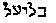
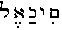
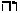
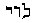
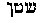

[Intangible Textual Heritage](../../index)  [Theosophy](../index.md) 
[Index](index)  [Previous](iu108)  [Next](iu110.md) 

------------------------------------------------------------------------

###### p. 473

### CHAPTER X.

> "Get thee behind me, **S**ATAN" (Jesus to Peter).--*Matt.* xvi. 23.

> "Such a deal of skimble-skamble stuff  
> As puts me from my faith. I tell you what --  
> He held me, last night, at least nine hours  
> In reckoning up the several devils' names."--*King Henry IV*., Part
> i., Act iii.

> "La force terrible et juste qui tue eternellement les avortons a ete
> nommee par les Egyptiens Typhon, par les Hebreux Samael; par les
> orientaux Satan; et par les Latins Lucifer. Le Lucifer de la Cabale
> n'est pas un ange maudit et foudroye; c'est l'ange qui eclaire et qui
> *regenere* en tombant."--**E**LIPHAS **L**EVI:
>
> Dogme et Rituel.

> "Bad as he is, the Devil may be abus'd,  
> Be falsely charg'd, and causelessly accus'd,  
> When Men, unwilling to be blam'd alone,  
> Shift off those Crimes on Him which are their Own."--*Defoe,* 1726.

SEVERAL years ago, a distinguished writer and persecuted kabalist
suggested a creed for the Protestant and Roman Catholic bodies, which
may be thus formulated:

> Protevangelium.

> "I believe in the Devil, the Father Almighty of Evil, the Destroyer of
> all things, Perturbator of Heaven and Earth;  
> And in Anti-Christ, his only Son, our Persecutor,  
> Who was conceived of the Evil Spirit;  
> Born of a sacrilegious, foolish Virgin;  
> Was glorified by mankind, reigned over them,  
> And ascended to the throne of Almighty God,  
> From which he crowds Him aside, and from which he insults the living
> and the dead;  
> I believe in the Spirit of Evil;  
> The Synagogue of Satan;  
> The coalition of the wicked;  
> The perdition of the body;  
> And the Death and Hell everlasting. *Amen*."

Does this offend? Does it seem extravagant, cruel, blasphemous? Listen.
In the city of New York, on the ninth day of April, 1877--that is to
say, in the last quarter of what is proudly styled the century of
discovery and the age of illumination--the following scandalous ideas
were broached. We quote from the report in the *Sun* of the following
morning:

"The Baptist preachers met yesterday in the Mariners' Chapel, in

###### p. 474

Oliver Street. Several foreign missionaries were present. The Rev. John
W. Sarles, of Brooklyn, read an essay, in which he maintained the
proposition *that all adult heathen, dying without the knowledge of the
Gospel, are damned eternally.* Otherwise, the reverend essayist argued,
the Gospel is a curse instead of a blessing, the men who crucified
Christ served him right, and the whole structure of revealed religion
tumbles to the ground.

"Brother Stoddard, a missionary from India, indorsed the views of the
Brooklyn pastor. The Hindus were great sinners. One day, after he had
preached in the market place, a Brahman got up and said: 'We Hindus beat
the world in lying, but this man beats us. How can he say that God loves
us? Look at the poisonous serpents, tigers, lions, and all kinds of
dangerous animals around us. If God loves us, why doesn't He take them
away?'

"The Rev. Mr. Pixley, of Hamilton, N. Y., heartily subscribed to the
doctrine of Brother Sarles's essay, and asked for $5,000 to fit out
young men for the ministry."

And these men--we will not say teach the doctrine of Jesus, for that
would be to insult his memory, but--are *paid* to teach his doctrine!
Can we wonder that intelligent persons prefer annihilation to a faith
encumbered by such a monstrous doctrine? We doubt whether any
respectable Brahman would have confessed to the vice of lying--an art
cultivated only in those portions of British India where the most
Christians are found. [\*](#fn_898.md)

###### p. 475

But we challenge any honest man in the wide world to say whether he
thinks the Brahman was far from the truth in saying of the missionary
Stoddard, "this man beats us all" in lying. What else would he say, if
the latter preached to them the doctrine of *eternal damnation,*
because, indeed, they had passed their lives without reading a Jewish
book of which they never heard, or asked salvation of a Christ whose
existence they never suspected! But Baptist clergymen who need a few
thousand dollars must devise terrifying sensations to fire the
congregational heart.

We abstain, as a rule, from giving our own experience when we can call
acceptable witnesses, and so, upon reading missionary Stoddard's
outrageous remarks, we requested our acquaintance, Mr. William L. D.
O'Grady, [\*](#fn_900.md) to give a fair opinion
upon the missionaries. This gentleman's father and grandfather were
British army officers, and he himself was born in India, and enjoyed
life-long opportunities to learn what the general opinion among the
English is of these religious propagandists. Following is his
communication in reply to our letter:

> "You ask me for my opinion of the Christian missionaries in India. In
> all the years I spent there, I never spoke to a single missionary.
> They were not in society, and, from what I heard of their proceedings
> and could see for myself, I don't wonder at it. *Their influence on
> the natives is bad.* Their converts are worthless, and, as a rule, of
> the lowest class; *nor do they improve by conversion.* No respectable
> family will employ Christian servants. They lie, they steal, they are
> unclean--and dirt is certainly not a Hindu vice; they drink--and no
> decent native of any other belief ever touches intoxicating liquor;
> they are outcasts from their own people and utterly despicable. Their
> new teachers set them a poor example of consistency. While holding
> forth to the Pariah that God makes no distinction of persons, they
> boast intolerably over the stray Brahmans, who, very much "off color,"
> occasionally, at long intervals, fall into the clutches of these
> hypocrites.

> "The missionaries get very small salaries, as publicly stated in the
> proceedings of the societies that employ them, but, in some
> unaccountable way, manage to live as well as officials with ten times
> their income. When they come home to recover their health, shattered,
> as they say, by their arduous labors--which they seem to be able to
> afford to do quite frequently, when supposed richer people
> cannot--they tell childish stories on platforms, exhibit idols as
> procured with infinite difficulty, which is quite absurd, and give an
> account of their imaginary hardships which is perfectly harrowing but
> untrue from beginning to end. I lived some years in India myself, and
> nearly all my blood-relations have passed or will pass the best years
> of their lives there. I know hundreds of British officials, and I
> never heard from one of them a single word in favor of the
> missionaries. Natives of any position look on them with the supremest
> contempt, although suffering chronic exasperation from their arrogant
> aggressiveness; and the British Government, which continues endowments
> to Pagodas, granted by the East

###### p. 476

> India Company, and which supports unsectarian education, gives them no
> countenance whatever. Protected from personal violence, they yelp and
> bark at natives and Europeans alike, after the fashion of
> ill-conditioned curs. Often recruited from the poorest specimens of
> theological fanaticism, they are regarded on all sides as mischievous.
> Their rabid, reckless, vulgar, and offensive propagandism caused the
> great Mutiny of 1857. They are noisome humbugs.

> "**W**M. **L**. **D**. **O**'**G**RADY.

> "**N**EW **Y**ORK, June 12, 1877."

The new creed therefore, with which we opened this chapter, coarse as it
may sound, embodies the very essence of the belief of the Church as
inculcated by her missionaries. It is regarded as less impious, less
infidel, to doubt the personal existence of the Holy Ghost, or the equal
Godhead of Jesus, than to question the personality of the Devil. But a
summary of Koheleth is well-nigh forgotten. [\*](#fn_901.md) Who ever quotes the golden words of the
prophet Micah, [\*\*](#fn_902.md) or seems to care
for the exposition of the Law, as given by Jesus himself? [\*\*\*](#fn_903.md) The "bull's eye" in the target of
Modern Christianity is in the simple phrase to "fear the Devil."

The Catholic clergy and some of the lay champions of the Roman Church
fight still more for the existence of Satan and his imps. If Des
Mousseaux maintains the objective reality of spiritual phenomena with
such an unrelenting ardor, it is because, in his opinion, the latter are
the most direct evidence of the Devil at work. The Chevalier is more
Catholic than the Pope; and his logic and deductions from never-to-be
and non-established premises are unique, and prove once more that the
creed offered by us is the one which expresses the Catholic belief most
eloquently.

"If magic and spiritualism," he says, "were both but chimeras, we would
have to bid an eternal farewell to all the rebellious angels, now
troubling the world; for thus, we would have *no more demons down here*.
. . . And *if we lost our demons, we would* LOSE OUR **S**AVIOUR
likewise. For, from whom did that Saviour come to save us? And then,
there would be no more Redeemer; for from whom or what could that
Redeemer redeem us? Hence, *there would be no more
Christianity*!!" [\*\*\*\*](#fn_904.md) Oh, Holy
Father of Evil; Sainted Satan! We pray thee do not abandon such pious
Christians as the Chevalier des Mousseaux and some Baptist clergymen!!

###### p. 477

For our part, we would rather remember the wise words of J. C.
Colquhoun, [\*](#fn_905.md) who says that "those
persons who, in modern times, adopt the doctrine of the Devil in its
strictly literal and personal application, do not appear to be aware
that they are in reality polytheists, heathens, idolaters."

Seeking supremacy in everything over the ancient creeds, the Christians
claim the discovery of the Devil officially recognized by the Church.
Jesus was the first to use the word "legion" when speaking of them; and
it is on this ground that M. des Mousseaux thus defends his position in
one of his demonological works. "Later," he says, "when the synagogue
*expired,* depositing its inheritance in the hands of Christ, were born
into the world and *shone,* the Fathers of the Church, who have been
accused by certain persons of a rare and precious ignorance, of having
borrowed their ideas as to the spirits of darkness from the theurgists."

Three deliberate, palpable, and easily-refuted errors--not to use a
harsher word--occur in these few lines. In the first place, the
synagogue, far from having *expired,* is flourishing at the present day
in nearly every town of Europe, America, and Asia; and of all churches
in Christian cities, it is the most firmly established, as well as the
best behaved. Further--while no one will deny that many Christian
Fathers were born into the world (always, of course, excepting the
twelve fictitious Bishops of Rome, who were never born at all), every
person who will take the trouble to read the works of the Platonists of
the old Academy, who were theurgists before Iamblichus, will recognize
therein the origin of Christian Demonology as well as the Angelology,
the allegorical meaning of which was completely distorted by the
Fathers. Then it could hardly be admitted that the said Fathers ever
*shone,* except, perhaps, in the refulgence of their extreme ignorance.
The Reverend Dr. Shuckford, who passed the better part of his life
trying to reconcile their contradictions and absurdities, was finally
driven to abandon the whole thing in despair. The ignorance of the
champions of Plato must indeed appear rare and precious by comparison
with the fathomless profundity of Augustine, "the giant of learning and
erudition," who scouted the sphericity of the earth, for, if true, it
would prevent the antipodes from seeing the Lord Christ when he
descended from heaven at the second advent; or, of Lactantius, who
rejects with pious horror Pliny's identical theory, on the remarkable
ground that it would make the trees at the other side of the earth grow
and the men walk with their heads downward; or, again, of
Cosmas-Indicopleustes, whose orthodox system of geography is embalmed in
his "Christian topography"; or, finally, of

###### p. 478

Bede, who assured the world that the heaven "is tempered with glacial
waters, lest it should be set on fire" [\*](#fn_906.md)--a benign dispensation of Providence,
most likely to prevent the radiance of their learning from setting the
sky ablaze!

Be this as it may, these resplendent Fathers certainly did borrow their
notions of the "spirits of darkness" from the Jewish kabalists and Pagan
theurgists, with the difference, however, that they disfigured and
outdid in absurdity all that the wildest fancy of the Hindu, Greek, and
Roman rabble had ever created. There is not a dev in the Persian
Pandaimonion half so preposterous, as a conception, as des Mousseaux's
*Incubus* revamped from Augustine. Typhon, symbolized as an *ass*,
appears a philosopher in comparison with the devil caught by the
Normandy peasant in a key-hole; and it is certainly not Ahriman or the
Hindu Vritra who would run away in rage and dismay, when addressed as
*St. Satan,* by a native Luther.

The Devil is the patron genius of theological Christianity. So "holy and
reverend is his name" in modern conception, that it may not, except
occasionally from the pulpit, be uttered in ears polite. In like manner,
anciently, it was not lawful to speak the sacred names or repeat the
jargon of the Mysteries, except in the sacred cloister. We hardly know
the names of the Samothracian gods, but cannot tell precisely the number
of the Kabeiri. The Egyptians considered it blasphemous to utter the
title of the gods of their secret rites. Even now, the Brahman only
pronounces the syllable *Om* in silent thought, and the Rabbi, the
Ineffable Name,  .
Hence, we who exercise no such veneration, have been led into the
blunders of miscalling the names of **H**ISIRIS and **Y**AVA by the
mispronunciations, Osiris and Jehovah. A similar glamour bids fair, it
will be perceived, to gather round the designation of the dark personage
of whom we are treating; and in the familiar handling, we shall be very
likely to shock the peculiar sensibilities of many who will consider a
free mentioning of the Devil's names as blasphemy--the sin of sins, that
"hath never forgiveness." [\*\*](#fn_907.md)

Several years ago an acquaintance of the author wrote a newspaper
article to demonstrate that the *diabolos* or Satan of the *New
Testament* denoted the personification of an abstract idea, and not a
personal being. He was answered by a clergyman, who concluded the reply
with the deprecatory expression, "I fear that he has denied his
Saviour." In his rejoinder he pleaded, "Oh, no! we only denied the
Devil." But the

###### p. 479

clergyman failed to perceive the difference. In his conception of the
matter, the denying of the personal objective existence of the Devil was
itself "the sin against the Holy Ghost."

This necessary Evil, dignified by the epithet of "Father of Lies," was,
according to the clergy, the founder of all the world-religions of
ancient time, and of the heresies, or rather heterodoxies, of later
periods, as well as the *Deus ex Machina* of modern Spiritualism. In the
exceptions which we take to this notion, we protest that we do not
attack true religion or sincere piety. We are only carrying on a
controversy with human dogmas. Perhaps in doing this we resemble Don
Quixote, because these things are only windmills. Nevertheless, let it
be remembered that they have been the occasion and pretext for the
slaughtering of more than fifty millions of human beings since the words
were proclaimed: "**L**OVE YOUR ENEMIES." [\*](#fn_908.md)

It is a late day for us to expect the Christian clergy to undo and amend
their work. They have too much at stake. If the Christian Church should
abandon or even modify the dogma of an anthropomorphic devil, it would
be like pulling the bottom card from under a castle of cards. The
structure would fall. The clergymen to whom we have alluded perceived
that upon the relinquishing of Satan as a personal devil, the dogma of
Jesus Christ as the second deity in their trinity must go over in the
same catastrophe. Incredible, or even horrifying, as it may seem, the
Roman Church bases its doctrine of the godhood of Christ entirely upon
the satanism of the fallen archangel. We have the testimony of Father
Ventura, who proclaims the vital importance of this dogma to the
Catholics.

The Reverend Father Ventura, the illustrious ex-general of the Theatins,
certifies that the Chevalier des Mousseaux, by his treatise, *Moeurs et
Pratiques des Demons,* has deserved well of mankind, and still more of
the most Holy Catholic and Apostolic Church. With this voucher, the
noble Chevalier, it will be perceived, "speaks as one having authority."
He asserts explicitly, that *to the Devil and his angels we are
absolutely indebted for our Saviour;* and that but for them *we*

would have no Redeemer, no Christianity.

Many zealous and earnest souls have revolted at the monstrous dogma of
John Calvin, the popekin of Geneva, that *sin is the necessary cause of
the greatest good.* It was bolstered up, nevertheless, by logic like
that of des Mousseaux, and illustrated by the same dogmas. The execution
of Jesus, the god-man, on the cross, was the most prodigious crime in
the universe, yet it was necessary that mankind--those predestinated to
ever-

###### p. 480

lasting life--might be saved. D'Aubignee cites the quotation by Martin
Luther from the canon, and makes him exclaim, in ecstatic rapture: "*O*
*beata culpa, qui talem meruisti redemptorem!*" O blessed sin, which
didst merit such a Redeemer. We now perceive that the dogma which had
appeared so monstrous is, after all, the doctrine of Pope, Calvin, and
Luther alike--that the three are one.

Mahomet and his disciples, who held Jesus in great respect as a prophet,
remarks Eliphas Levi, used to utter, when speaking of Christians, the
following remarkable words: "Jesus of Nazareth was verily a true prophet
of Allah and a grand man; but lo! his disciples all went insane one day,
and made a god of him."

Max Muller kindly adds: "It was a mistake of the early Fathers to treat
the heathen gods as demons or evil spirits, and we must take care not to
commit the same error with regard to the Hindu gods." [\*](#fn_909.md)

But we have Satan presented to us as the prop and mainstay of
sacerdotism--an Atlas, holding the Christian heaven and cosmos upon his
shoulders. If he falls, then, in their conception, all is lost, and
chaos must come again.

This dogma of the Devil and redemption seems to be based upon two
passages in the *New Testament:* "For this purpose the Son of God was
manifested, that he might destroy the works of the Devil." [\*\*](#fn_910.md) "And there was war in heaven; Michael
and his angels fought against the Dragon; and the Dragon fought, and his
angels, and prevailed not; neither was their place found any more in
heaven. And the great Dragon was cast out, that old serpent, called the
Devil and Satan, which deceiveth the whole world." Let us, then, explore
the ancient Theogonies, in order to ascertain what was meant by these
remarkable expressions.

The first inquiry is whether the term *Devil*, as here used, actually
represents the malignant Deity of the Christians, or an antagonistic,
blind force--the dark side of nature. By the latter we are not to
understand the manifestation of any evil principle that is *malum in
se,* but only the shadow of the Light, so to say. The theories of the
kabalists treat of it as a force which is antagonistic, but at the same
time essential to the vitality, evolving, and vigor of the good
principle. Plants would perish in their first stage of existence, if
they were kept exposed to a constant sunlight; the night alternating
with the day is essential to their healthy growth and development.
Goodness, likewise, would speedily cease to be such, were it not
alternated by its opposite. In human nature, evil denotes the antagonism
of matter to the spiritual, and each is accordingly purified thereby. In
the cosmos, the equilibrium must be preserved; the

###### p. 481

operation of the two contraries produce harmony, like the centripetal
and centrifugal forces, and are necessary to each other. If one is
arrested, the action of the other will immediately become destructive.

This personification, denominated *Satan*, is to be contemplated from
three different planes: the *Old Testament,* the Christian Fathers, and
the ancient Gentile altitude. He is supposed to have been represented by
the Serpent in the Garden of Eden; nevertheless, the epithet of Satan is
nowhere in the Hebrew sacred writings applied to that or any other
variety of ophidian. The Brazen Serpent of Moses was worshipped by the
Israelites as a god; [\*](#fn_911.md) being the
symbol of Esmun-Asklepius the Phoenician Iao. Indeed, the character of
Satan himself is introduced in the 1st book of *Chronicles* in the act
of instigating King David to number the Israelitish people, an act
elsewhere declared specifically to have been moved by Jehovah
himself. [\*\*](#fn_912.md) The inference is
unavoidable that the two, Satan and Jehovah, were regarded as identical.

Another mention of Satan is found in the *prophecies of Zechariah.* This
book was written at a period subsequent to the Jewish colonization of
Palestine, and hence, the Asideans may fairly be supposed to have
brought the personification thither from the East. It is well-known that
this body of sectaries were deeply imbued with the Mazdean notions; and
that they represented Ahriman or Anra-manyas by the god-names of Syria.
Set or Sat-an, the god of the Hittites and Hyk-sos, and Beel-Zebub the
oracle-god, afterward the Grecian Apollo. The prophet began his labors
in Judea in the second year of Darius Hystaspes, the restorer of the
Mazdean worship. He thus describes the encounter with Satan: "He showed
me Joshua the high-priest standing before the angel of the Lord, and
Satan standing at his right hand to be his adversary. And the Lord said
unto Satan: 'The Lord rebuke thee, O Satan; even the Lord that hath
chosen Jerusalem rebuke thee: is not this a brand plucked out of the
fire?' " [\*\*\*](#fn_913.md)

###### p. 482

We apprehend that this passage which we have quoted is symbolical. There
are two allusions in the *New Testament* that indicate that it was so
regarded. The *Catholic Epistle of Jude* refers to it in this peculiar
language: "Yet Michael the archangel, when contending with the Devil, he
disputed about the body of Moses, did not venture to utter to him a
reviling judgment (Κρισιν επενεγκειν Βλασπηεμιας), but said, 'The Lord
rebuke thee.' " [\*](#fn_914.md) The archangel
Michael is thus mentioned as identical with the   Lord, or angel of the
Lord, of the preceding quotation, and thus is shown that the Hebrew
Jehovah had a twofold character, the secret and that manifested as the
angel of the Lord, or Michael the archangel. A comparison between these
two passages renders it plain that "the body of Moses" over which they
contended was Palestine, which as "the land of the Hittites" [\*\*](#fn_915.md) was the peculiar domain of Seth,
their tutelar god. [\*\*\*](#fn_916.md) Michael,
as the champion of the Jehovah-worship, contended with the Devil or
Adversary, but left judgment to his superior.

Belial is not entitled to the distinction of either god or devil. The
term  , **B**ELIAL,
is defined in the Hebrew lexicons to mean a destroying, waste,
uselessness; or the phrase 
 AIS-**B**ELIAL or Belial-man signifies a wasteful,
useless man. If Belial must be personified to please our religious
friends, we would be obliged to make him perfectly distinct from Satan,
and to consider him as a sort of spiritual "Diakka." The demonographers,
however, who enumerate nine distinct orders of *daimonia,* make him
chief of the third class--a set of hobgoblins, mischievous and
good-for-nothing.

Asmodeus is no Jewish spirit at all, his origin being purely Persian.
Breal, the author of *Hercule et Cacus,* shows that he is the Parsi
Eshem-Dev, or Aeshma-dev, the evil spirit of concupiscence, whom Max
Muller tells us "is mentioned several times in the *Avesta* as one of
the Devs, [\*\*\*\*](#fn_917.md) originally gods,
who became evil spirits."

In the same fargard of the "Vendidad" the Brahman divinities are
involved in the same denunciation with Æshma-daeva: "I combat India, I
combat Sauru, I combat p. 483 the Daeva
Naonhaiti." The annotator explains them to be the Vedic gods, Indus,
Gaurea, or Siva, and the two Aswins. There must be some mistake,
however, for Siva, at the time the "Vedas" were completed, was an
aboriginal or Æthiopian God, the Bala or Bel of Western Asia. He was not
an Aryan or Vedic deity. Perhaps Surya was the divinity intended.}

p. 483

Samael is Satan; but Bryan and a good many other authorities show it to
be the name of the "Simoun"--the wind of the desert, [\*](#fn_918.md) and the Simoun is called Atabul-os or
Diabolos.

Plutarch remarks that by Typhon was understood anything violent, unruly,
and disorderly. The overflowing of the Nile was called by the Egyptians
Typhon. Lower Egypt is very flat, and any mounds built along the river
to prevent the frequent inundations, were called Typhonian or *Taphos;*
hence, the origin of Typhon. Plutarch, who was a rigid, orthodox Greek,
and never known to much compliment the Egyptians, testifies in his *Isis
and Osiris,* to the fact that, far from worshipping the Devil (of which
Christians accused them), they despised more than they dreaded Typhon.
In his symbol of the opposing, obstinate power of nature, they believed
him to be a poor, struggling, half-dead divinity. Thus, even at that
remote age, we see the ancients already *too enlightened to believe in a
personal devil.* As Typhon was represented in one of his symbols under
the figure of an ass at the festival of the sun's sacrifices, the
Egyptian priests exhorted the faithful worshippers not to carry gold
ornaments upon their bodies for fear of giving food to the *ass*! [\*\*](#fn_919.md)

Three and a half centuries before Christ, Plato expressed his opinion of
evil by saying that "there is in matter a blind, refractory force, which
resists the will of the Great Artificer." This blind force, under
Christian influx, was made to see and become responsible; it was
transformed into Satan!

His identity with Typhon can scarcely be doubted upon reading the
account in *Job* of his appearance with the sons of God, before the
Lord. He accuses Job of a readiness to curse the Lord to his face upon
sufficient provocation. So Typhon, in the Egyptian *Book of the Dead,*
figures as the accuser. The resemblance extends even to the names, for
one of Typhon's appellations was *Seth,* or *Seph;* as Satan, in Hebrew,
means an adversary. In Arabic the word is *Shatana--*to be adverse, to
persecute, and Manetho says he had treacherously murdered Osiris and
allied himself with the Shemites (the Israelites). This may possibly
have originated the fable told by Plutarch, that, from the fight between
Horus and Typhon, Typhon, overcome with fright at the mis-

###### p. 484

chief he had caused, "fled seven days on an ass, and escaping, begat the
boys Ierosolumos and Ioudaios (Jerusalem and Judea)."

Referring to an invocation of Typhon-Seth, Professor Reuvens says that
the Egyptians worshipped Typhon under the form of an ass; and according
to him Seth "appears gradually among the Semites as the background of
their religious consciousness." [\*](#fn_920.md)
The name of the ass in Coptic, AO, is a phonetic of **I**AO, and hence
the animal became a pun-symbol. Thus Satan is a later creation, sprung
from the overheated fancy of the Fathers of the Church. By some reverse
of fortune, to which the gods are subjected in common with mortals,
Typhon-Seth tumbled down from the eminence of the deified son of Adam
Kadmon, to the degrading position of a subaltern spirit, a mythical
demon--ass. Religious schisms are as little free from the frail
pettiness and spiteful feelings of humanity as the partisan quarrels of
laymen. We find a strong instance of the above in the case of the
Zoroastrian reform, when Magianism separated from the old faith of the
Brahmans. The bright Devas of the *Veda* became, under the religious
reform of Zoroaster, daevas, or evil spirits, of the *Avesta.* Even
Indra, the luminous god, was thrust far back into the dark shadow [\*\*](#fn_921.md) in order to show off, in a brighter
light, Ahura-mazda, the Wise and Supreme Deity.

The strange veneration in which the Ophites held the serpent which
represented Christos may become less perplexing if the students would
but remember that at all ages the serpent was the symbol of divine
wisdom, which kills in order to resurrect, destroys but to rebuild the
better. Moses is made a descendant of Levi, a serpent-tribe.
Gautama-Buddha is of a serpent-lineage, through the Naga (serpent) race
of kings who reigned in Magadha. Hermes, or the god Taaut (Thoth), in
his snake-symbol is Tet; and, according to the Ophite legends, Jesus or
Christos is born from a snake (divine wisdom, or Holy Ghost), *i.e*., he
became a Son of God through his initiation into the "Serpent Science."
Vishnu, identical with the Egyptian Kneph, rests on the heavenly
*seven*-headed serpent.

The red or fiery dragon of the ancient time was the military ensign of
the Assyrians. Cyrus adopted it from them when Persia became dominant.
The Romans and Byzantines next assumed it; and so the "great red
dragon," from being the symbol of Babylon and Nineveh, became that of
Rome. [\*\*\*](#fn_922.md)

The temptation, or probation, [\*\*\*\*](#fn_923.md) of Jesus is, however, the most
dramatic

###### p. 485

occasion in which Satan appears. As if to prove the designation of
Apollo, Æsculapius, and Bacchus, *Diobolos,* or son of Zeus, he is also
styled *Diabolos,* or accuser. The scene of the probation was the
wilderness. In the desert about the Jordan and Dead Sea were the abodes
of the "sons of the prophets," and the Essenes. [\*](#fn_924.md) These ascetics used to subject their
neophytes to probations, analogous to the *tortures* of the Mithraic
rites; and the temptation of Jesus was evidently a scene of this
character. Hence, in the *Gospel according to Luke,* it is stated that
"the Diabolos, having completed the probation, left him for a specific
time, αχρι καιρου, and Jesus returned in the power of the Spirit into
Galilee." But the διαβολος, or Devil, in this instance is evidently no
malignant principle, but one exercising discipline. In this sense the
terms Devil and Satan are repeatedly employed. [\*\*](#fn_925.md) Thus, when Paul was liable to undue
elation by reason of the abundance of revelations or epoptic
disclosures, there was given him "a thorn in the flesh, an angel of
Satanas," to check him. [\*\*\*](#fn_926.md)

The story of Satan in the *Book of Job* is of a similar character. He is
introduced among the "Sons of God," presenting themselves before the
Lord, as in a Mystic initiation. Micaiah the prophet describes a similar
scene, where he "saw the Lord sitting on His throne, and all the host of
Heaven standing by Him," with whom He took counsel, which resulted in
putting "a lying spirit into the mouth of the prophets of Ahab." [\*\*\*\*](#fn_927.md) The Lord counsels with Satan, and
gives him *carte blanche* to test the fidelity of Job. He is stripped of
his wealth and family, and smitten with a loathsome disease. In his
extremity, his wife doubts his integrity, and exhorts him to worship
God, as he is about to die. His friends all beset him with accusations,
and finally the Lord, the chief hierophant Himself, taxes him with the
uttering of words in which there is no wisdom, and with contending with
the Almighty. To this rebuke Job yielded, making this appeal: "I will
demand of thee, and thou shalt declare unto me: wherefore do I abhor
myself and mourn in dust and ashes?" Immediately he was vindicated. "The
Lord said unto Eliphaz . . . ye have not spoken of me the thing that is
right, as my servant Job hath." His integrity had been asserted, and his
prediction verified: "I know that my Champion liveth, and that he will
stand up for me at a later time on the earth; and though after my skin
my body itself be corroded away, yet even then without my flesh shall I
see God." The pre-

###### p. 486

diction was accomplished: "I have heard of thee by the hearing of the
ear, but now mine eye seeth thee. . . . And the Lord turned the
captivity of Job."

In all these scenes there is manifested no such malignant diabolism as
is supposed to characterize "the adversary of souls."

It is an opinion of certain writers of merit and learning, that the
Satan of the book of *Job* is a Jewish myth, containing the Mazdean
doctrine of the Evil Principle. Dr. Haug remarks that "the Zoroastrian
religion exhibits a close affinity, or rather identity with the Mosaic
religion and Christianity, such as the personality and attributes of the
Devil, and the resurrection of the dead." [\*](#fn_928.md) The war of the *Apocalypse* between
Michael and the Dragon, can be traced with equal facility to one of the
oldest myths of the Aryans. In the *Avesta* we read of war between
Thraetaona and Azhi-Dahaka, the destroying serpent. Burnouf has
endeavored to show that the Vedic myth of Ahi, or the serpent, fighting
against the gods, has been gradually euhemerized into "the battle of a
pious man against the power of evil," in the Mazdean religion. By these
interpretations Satan would be made identical with Zohak or Azhi-Dahaka,
who is a three-headed serpent, with one of the heads a human one. [\*\*](#fn_929.md)

Beel-Zebub is generally distinguished from Satan. He seems, in the
*Apocryphal New Testament,* to be regarded as the potentate of the
underworld. The name is usually rendered "Baal of the Flies," which may
be a designation of the Scarabaei or sacred beetles. [\*\*\*](#fn_930.md) More correctly it shall be read, as
it is always given in the Greek text of the *Gospels,* Beelzebul, or
lord of the household, as is indeed intimated in

Matthew

###### p. 487

x\. 25: "If they have called the master of the house Beelzebul, how much
more shall they call them of his household." He was also styled the
prince or archon of daemons.

Typhon figures in the *Book of the Dead,* as the Accuser of souls when
they appear for judgment, as Satan stood up to accuse Joshua, the
high-priest, before the angel, and as the Devil came to Jesus to tempt
or test him during his great fast in the wilderness. He was also the
deity denominated Baal-Tsephon, or god of the crypt, in the book of
*Exodus,* and *Seth,* or the pillar. During this period, the ancient or
archaic worship was more or less under the ban of the government; in
figurative language, Osiris had been treacherously slain and cut in
fourteen (twice *seven*) pieces, and coffined by his brother Typhon, and
Isis had gone to Byblos in quest of his body.

We must not forget in this relation that Saba or Sabazios, of Phrygia
and Greece, was torn by the Titans into *seven* pieces, and that he was,
like Heptaktis of the Chaldeans, the *seven*-rayed god. Siva, the Hindu,
is represented crowned with seven serpents, and he is the god of war and
destruction. The Hebrew Jehovah the Sabaoth is also called the Lord of
hosts, Seba or Saba, Bacchus or Dionysus Sabazios; so that all these may
easily be proved identical.

Finally the princes of the older *regime,* the gods who had, on the
assault of the giants, taken the forms of animals and hidden in
Æthiopia, returned and expelled the shepherds.

According to Josephus, the Hyk-sos were the ancestors of the
Israelites. [\*](#fn_931.md) This is doubtless
substantially true. The Hebrew *Scriptures,* which tell a somewhat
different story, were written at a later period, and underwent several
revisions, before they were promulgated with any degree of publicity.
Typhon became odious in Egypt, and shepherds "an abomination." "In the
course of the twentieth dynasty he was suddenly treated as an evil
demon, insomuch that his effigies and name are obliterated on all the
monuments and inscriptions that could be reached." [\*\*](#fn_932.md) In all ages the gods have been liable
to be euhemerized into men. There are tombs of Zeus, Apollo, Hercules,
and Bacchus, which are often mentioned to show that originally they were
only mortals. Shem, Ham, and Japhet, are traced in the divinities Shamas
of Assyria, Kham of

###### p. 488

Egypt, and Iapetos the Titan. Seth was god of the Hyk-sos, Enoch, or
Inachus, of the Argives; and Abraham, Isaac, and Judah have been
compared with Brahma, Ikshwaka, and Yadu of the Hindu pantheon. Typhon
tumbled down from godhead to devilship, both in his own character as
brother of Osiris, and as the Seth, or Satan of Asia. Apollo, the god of
day, became, in his older Phoenician garb, no more Baal Zebul, the
Oracle-god, but prince of demons, and finally the lord of the
underworld. The separation of Mazdeanism from Vedism, transformed the
*devas* or gods into evil potencies. Indra, also, in the *Vendidad* is
set forth as the subaltern of Ahriman, [\*](#fn_933.md) created by him out of the materials of
darkness, [\*\*](#fn_934.md) together with Siva
(Surya) and the two Aswins. Even Jahi is the demon of Lust--probably
identical with Indra.

The several tribes and nations had their tutelar gods, and vilified
those of inimical peoples. The transformation of Typhon, Satan and
Beelzebub are of this character. Indeed, Tertullian speaks of Mithra,
the god of the Mysteries, as a devil.

In the twelfth chapter of the *Apocalypse,* Michael and his angels
overcame the Dragon and his angels: "and the Great Dragon was cast out,
that Archaic Ophis, called Diabolos and Satan, that deceiveth the whole
world." It is added: "They overcame him by the blood of the Lamb." The
Lamb, or Christ, had to descend himself to hell, the world of the dead,
and remain there three days before he subjugated the enemy, according to
the myth.

Michael was denominated by the kabalists and the Gnostics, "the
Saviour," the angel of the Sun, and angel of Light. ( , probably, from   to manifest and   God.) He was the first
of the Æons, and was well-known to antiquarians as the "unknown angel"
represented on the Gnostic amulets.

The writer of the *Apocalypse,* if not a kabalist, must have been a
Gnostic. Michael was not a personage originally exhibited to him in his
vision (epopteia) but the Saviour and Dragon-slayer. Archaeological
explorations have indicated him as identical with Anubis, whose effigy
was lately discovered upon an Egyptian monument, with a cuirass and
holding a spear, like St. Michael and St. George. He is also represented
as slaying a Dragon, that has the head and tail of a serpent. [\*\*\*](#fn_935.md)

The student of Lepsius, Champollion, and other Egyptologists will

###### p. 489

quickly recognize Isis as the "woman with child," "clothed with the Sun
and with the Moon under her feet," whom the "great fiery Dragon"
persecuted, and to whom "were given two wings of the Great Eagle that
she might fly into the wilderness." Typhon was red-skinned. [\*](#fn_936.md)

The Two Brothers, the Good and Evil Principles, appear in the Myths of
the *Bible* as well as those of the Gentiles, and Cain and Abel, Typhon
and Osiris, Esau and Jacob, Apollo and Python, etc., Esau or Osu, is
represented, when born, as "red all over like an hairy garment." He is
the Typhon or Satan, opposing his brother.

From the remotest antiquity the serpent was held by every people in the
greatest veneration, as the embodiment of Divine wisdom and the symbol
of spirit, and we know from Sanchoniathon that it was Hermes or Thoth
who was the first to regard the serpent as "the most spirit-like of all
the reptiles"; and the Gnostic serpent with the seven vowels over the
head is but the copy of Ananta, the seven-headed serpent on which rests
the god Vishnu.

We have experienced no little surprise to find upon reading the latest
European treatises upon serpent-worship, that the writers confess that
the public is "still almost in the dark as to the origin of the
superstition in question." Mr. C. Staniland Wake, **M.A.I**., from whom
we now quote, says: "The student of mythology knows that certain ideas
were associated by the peoples of antiquity with the serpent, and that
it was the favorite symbol of particular deities; but why that animal
rather than any other was chosen for the purpose is yet
uncertain." [\*\*](#fn_937.md)

Mr. James Fergusson, **F.R.S**., who has gathered together such an
abundance of material upon this ancient cult, seems to have no more
suspicion of the truth than the rest. [\*\*\*](#fn_938.md)

Our explanation of the myth may be of little value to students of
symbology, and yet we believe that the interpretation of the primitive
serpent-worship as given by the initiates is the correct one. In Vol.
i., p. 10, we quote from the serpent Mantra, in the *Aytareya-Brahmana,*
a passage which speaks of the earth as the *Sarpa Rajni,* the Queen of
the Serpents, and "the mother of all that moves." These expressions
refer to the fact that before our globe had become egg-shaped or round
it was a long trail of cosmic dust or fire-mist, moving and writhing
like a serpent. This, say the explanations, was the Spirit of God moving
on the chaos until its breath had incubated cosmic matter and made it
assume the annular shape of a serpent with its tail in its mouth--emblem
of eternity

###### p. 490

in its spiritual and of our world in its physical sense. According to
the notions of the oldest philosophers, as we have shown in the
preceding chapter, the earth, serpent-like, casts off its skin and
appears after every minor pralaya in a rejuvenated state, and after the
great pralaya resurrects or evolves again from its subjective into
objective existence. Like the serpent, it not only "puts off its old
age," says Sanchoniathon, "but increases in size and strength." This is
why not only Serapis, and later, Jesus, were represented by a great
serpent, but even why, in our own century, big snakes are kept with
sacred care in Moslem mosques; for instance, in that of Cairo. In Upper
Egypt a famous saint is said to appear under the form of a large
serpent; and in India in some children's cradles a pair of serpents,
male and female, are reared with the infant, and snakes are often kept
in houses, as they are thought to bring (a magnetic aura of) wisdom,
health, and good luck. They are the progeny of Sarpa Rajni, the earth,
and endowed with all her virtues.

In the Hindu mythology Vasaki, the Great Dragon, pours forth upon Durga,
from his mouth, a poisonous fluid which overspreads the ground, but her
consort Siva caused the earth to open her mouth and swallow it.

Thus the mystic drama of the celestial virgin pursued by the dragon
seeking to devour her child, was not only depicted in the constellations
of heaven, as has been mentioned, but was represented in the secret
worship of the temples. It was the mystery of the god Sol, and inscribed
on a black image of Isis. [\*](#fn_939.md) The
Divine Boy was chased by the cruel Typhon. [\*\*](#fn_940.md) In an Egyptian legend the Dragon is
said to pursue Thuesis (Isis) while she is endeavoring to protect her
son. [\*\*\*](#fn_941.md) Ovid describes Dione
(the consort of the original Pelasgian Zeus, and mother of Venus) as
flying from Typhon to the Euphrates, [\*\*\*\*](#fn_942.md) thus identifying the myth as
belonging to all the countries where the Mysteries were celebrated.
Virgil sings the victory:

> "Hail, dear child of gods, great son of Jove!  
> Receive the honors great; the time is at hand;  
> The Serpent will die!" [\*\*\*\*\*](#fn_943.md)

Albertus Magnus, himself an alchemist and student of occult science, as
well as a bishop of the Roman Catholic Church, in his enthusiasm for
astrology, declared that the zodiacal sign of the celestial virgin rises
above the horizon on the twenty-fifth of December, at the moment
assigned by the Church for the birth of the Saviour. [\*\*\*\*\*\*](#fn_944.md)

###### p. 491

The sign and myth of the mother and child were known thousands of years
before the Christian era. The drama of the Mysteries of Demeter
represents Persephoneia, her daughter, as carried away by Pluto or Hades
into the world of the dead; and when the mother finally discovers her
there, she has been installed as queen of the realm of Darkness. This
myth was transcribed by the Church into the legend of St. Anna [\*](#fn_945.md) going in quest of her daughter Mary,
who has been conveyed by Joseph into Egypt. Persephone is depicted with
two ears of wheat in her hand; so is Mary in the old pictures; so was
the Celestial Virgin of the constellation. Albumazar the Arabian
indicates the identity of the several myths as follows:

"In the first decan of the Virgin rises a maid, called in Arabic
Aderenosa \[Adha-nari?\], that is, pure immaculate virgin, [\*\*](#fn_946.md) graceful in person, charming in
countenance, modest in habit, with loosened hair, holding in her hands
two ears of wheat, sitting upon an embroidered throne, nursing a boy,
and rightly feeding him in the place called Hebraea; a boy, I say, named
Iessus by certain nations, which signifies Issa, whom they also call
Christ in Greek." [\*\*\*](#fn_947.md)

At this time Grecian, Asiatic, and Egyptian ideas had undergone a
remarkable transformation. The Mysteries of Dionysus-Sabazius had been
replaced by the rites of Mithras, whose "caves" superseded the crypts of
the former god, from Babylon to Britain. Serapis, or Sri-Apa, from
Pontus, had usurped the place of Osiris. The king of Eastern Hindustan,
Asoka, had embraced the religion of Siddhartha, and sent missionaries
clear to Greece, Asia, Syria, and Egypt, to promulgate the evangel of
wisdom. The Essenes of Judea and Arabia, the Therapeutists [\*\*\*\*](#fn_948.md) of Egypt, and the
Pythagorists [\*\*\*\*\*](#fn_949.md) of Greece
and Magna Graecia, were evidently religionists of the new faith. The
legends of Gautama superseded the myths of Horus, Anubis, Adonis, Atys,
and Bacchus. These were wrought anew into the Mysteries and Gospels, and
to them we owe the

###### p. 492

literature known as the *Evangelists* and the *Apocryphal New
Testament.* They were kept by the Ebionites, Nazarenes, and other sects
as sacred books, which they might "show only to the wise"; and were so
preserved till the overshadowing influence of the Roman ecclesiastical
polity was able to wrest them from those who kept them.

At the time that the high-priest Hilkiah is said to have found the *Book
of the Law,* the Hindu *Puranas* (Scriptures) were known to the
Assyrians. These last had for many centuries held dominion from the
Hellespont to the Indus, and probably crowded the Aryans out of
Bactriana into the Punjab. The *Book of the Law* seems to have been a
*purana.* "The learned Brahmans," says Sir William Jones, "pretend that
five conditions are requisite to constitute a real

purana:

> "1. To treat of the creation of matter in general.  
> "2. To treat of *the creation or production of secondary material and
> spiritual beings.  
> *"3. To give a chronological abridgment of the great periods of
> time.  
> "4. To give a genealogical abridgment of the principal families that
> reigned over the country.  
> "5. Lastly, to give the history of some great man in particular."

It is pretty certain that whoever wrote the *Pentateuch* had this plan
before him, as well as those who wrote the *New Testament* had become
thoroughly well acquainted with Buddhistic ritualistic worship, legends
and doctrines, through the Buddhist missionaries who were many in those
days in Palestine and Greece.

But "no Devil, no Christ." This is the basic dogma of the Church. We
must hunt the two together. There is a mysterious connection between the
two, more close than perhaps is suspected, amounting to identity. If we
collect together the mythical sons of God, all of whom were regarded as
"first-begotten," they will be found dovetailing together and blending
in this dual character. Adam Kadmon bifurcates from the spiritual
conceptive wisdom into the creative one, which evolves *matter.* The
Adam made from dust is both son of God and Satan; and the latter is also
a son of God, [\*](#fn_950.md) according to Job.

Hercules was likewise "the First-Begotten." He is also Bel, Baal, and
Bal, and therefore Siva, the Destroyer. Bacchus was styled by Euripides,
"Bacchus, the Son of God." As a child, Bacchus, like the Jesus of the
*Apocryphal Gospels,* was greatly dreaded. He is described as benevolent
to mankind; nevertheless he was merciless in punishing whomever failed
of respect to his worship. Pentheus, the son of Cadmus

###### p. 493

and Hermione, was, like the son of Rabbi Hannon, destroyed for his want
of piety.

The allegory of Job, which has been already cited, if correctly
understood, will give the key to this whole matter of the Devil, his
nature and office; and will substantiate our declarations. Let no pious
individual take exception to this designation of allegory. Myth was the
favorite and universal method of teaching in archaic times. Paul,
writing to the Corinthians, declared that the entire story of Moses and
the Israelites was typical; [\*](#fn_951.md) and
in his *Epistle to the Galatians,* asserted that the whole story of
Abraham, his two wives, and their sons was an allegory. [\*\*](#fn_952.md) Indeed, it is a theory amounting to
certitude, that the historical books of the *Old Testament* were of the
same character. We take no extraordinary liberty with the *Book of Job*
when we give it the same designation which Paul gave the stories of
Abraham and Moses.

But we ought, perhaps, to explain the ancient use of allegory and
symbology. The truth in the former was left to be deduced; the symbol
expressed some abstract quality of the Deity, which the laity could
easily apprehend. Its higher sense terminated there; and it was employed
by the multitude thenceforth as an image to be employed in idolatrous
rites. But the allegory was reserved for the inner sanctuary, when only
the elect were admitted. Hence the rejoinder of Jesus when his disciples
interrogated him because he spoke to the multitude in parables. "To
you," said he, "it is given to know the mysteries of the Kingdom of
Heaven, but to them it is not given. For whosoever hath, to him shall be
given, and he shall have more abundance; but whosoever hath not, from
him shall be taken away even that he hath." In the minor Mysteries a sow
was washed to typify the purification of the neophyte; as her return to
the mire indicated the superficial nature of the work that had been
accomplished.

"The Mythus is the undisclosed thought of the soul. The characteristic
trait of the myth is to convert reflection into history (a historical
form). As in the epos, so in the myth, the historical element
predominates. Facts (external events) often constitute the basis of the
myth, and with these, religious ideas are interwoven."

The whole allegory of Job is an open book to him who understands the
picture-language of Egypt as it is recorded in *the Book of the Dead.*
In the Scene of Judgment, Osiris is represented sitting on his throne,

###### p. 494

holding in one hand the symbol of life, "the hook of attraction," and in
the other the mystic Bacchic fan. Before him are the sons of God, the
forty-two assessors of the dead. An altar is immediately before the
throne, covered with gifts and surmounted with the sacred lotus-flower,
upon which stand four spirits. By the entrance stands the soul about to
be judged, whom Thmei, the genius of Truth, is welcoming to this
conclusion of the probation. Thoth holding a reed, makes a record of the
proceedings in the Book of Life. Horus and Anubis, standing by the
scales, inspect the weight which determines whether the heart of the
deceased balances the symbol of truth, or the latter preponderates. On
pedestal sits a bitch--the symbol of the Accuser.

Initiation into the Mysteries, as every intelligent person knows, was
dramatic representation of scenes in the underworld. Such was the
allegory of Job.

Several critics have attributed the authorship of this book to Moses.
But it is older than the *Pentateuch.* Jehovah is not mentioned in the
poem itself; and if the name occurs in the prologue, the fact must be
attributed to either an error of the translators, or the premeditation
exacted by the later necessity to transform polytheism into a
monotheistic religion. The plan adopted was the very simple one of
attributing the many names of the Elohim (gods) to a single god. So in
one of the oldest Hebrew texts of Job (in chapter xii. 9) there stands
the name of Jehovah, whereas all other manuscripts have "Adonai." But in
the original poem Jehovah is absent. In place of this name we find *Al,
Aleim, Ale, Shaddai, Adonai,* etc. Therefore, we must conclude that
either the prologue and epilogue were added at a later period, which is
inadmissible for many reasons, or that it has been tampered with like
the rest of the manuscripts. Then, we find in this archaic poem no
mention whatever of the Sabbatical Institution; but a great many
references to the sacred number seven, of which we will speak further,
and a direct discussion upon Sabeanism, the worship of the heavenly
bodies prevailing in those days in Arabia. Satan is called in it a "Son
of God," one of the council which presents itself before God, and he
leads him into tempting Job's fidelity. In this poem, clearer and
plainer than anywhere else, do we find the meaning of the appellation,
Satan. It is a term for the office or character of *public accuser.*
Satan is the Typhon of the Egyptians, barking his accusations in
Amenthi; an office quite as respectable as that of the public
prosecutor, in our own age; and if, through the ignorance of the first
Christians, he became later identical with the Devil, it is through no
connivance of his own.

The *Book of Job* is a complete representation of ancient initiation,
and the trials which generally precede this grandest of all ceremonies.

###### p. 495

The neophyte perceives himself deprived of everything he valued, and
afflicted with foul disease. His wife appeals to him to adore God and
die; there was no more hope for him. Three friends appear on the scene
by mutual appointment: Eliphaz, the learned Temanite, full of the
knowledge "which wise men have told from their fathers--to whom alone
the earth was given"; Bildad, the conservative, taking matters as they
come, and judging Job to have done wickedly, because he was afflicted;
and Zophar, intelligent and skilful with "generalities" but not
interiorly wise. Job boldly responds: "If I have erred, it is a matter
with myself. You magnify yourselves and plead against me in my reproach;
but it is God who has overthrown me. Why do you persecute me and are not
satisfied with my flesh thus wasted away? But I know that my Champion
lives, and that at a coming day he will stand for me in the earth; and
though, together with my skin, all this beneath it shall be destroyed,
yet without my flesh I shall see God. . . . Ye shall say: 'Why do we
molest him?' for the root of the matter is found in me!"

This passage, like all others in which the faintest allusions could be
found to a "Champion," "Deliverer," or "Vindicator," was interpreted
into a direct reference to the Messiah; but apart from the fact that in
the Septuagint this verse is translated:

> "For I know that He is eternal  
> Who is about to deliver me on earth,  
> To restore this skin of mine which endures these things," etc.

In King James's version, as it stands translated, it has no resemblance
whatever to the original. [\*](#fn_953.md) The
crafty translators have rendered it, "I know that *my Redeemer liveth,*"
etc. And yet *Septuagint, Vulgate,* and Hebrew original, have all to be
considered as an inspired Word of God. Job refers to his own *immortal*
spirit which is eternal, and which, when death comes, will deliver him
from his putrid earthly body and clothe him with a new spiritual
envelope. In the *Mysteries of Eleusinia,* in the Egyptian *Book of the
Dead,* and all other works treating on matters of initiation, this
"eternal being" has a name. With the Neo-platonists it was the *Nous,*
the *Augoeides;* with the Buddhists it is *Aggra;* and with the
Persians, *Ferwer*. All of these are called the "Deliverers," the
"Champions," the "Metatrons," etc. In the Mithraic sculptures of Persia,
the *ferwer* is represented by a winged figure hovering in the air above
its "object" or body. [\*\*](#fn_954.md) It is the
luminous Self--the Atman of

###### p. 496

the Hindus, our immortal spirit, who alone can redeem our soul; and
will, if we follow him instead of being dragged down by our body.
Therefore, in the Chaldean texts, the above reads, "My *deliverer,* my
*restorer,*" *i.e.,* the Spirit who will restore the decayed body of
man, and transform it into a clothing of ether. And it is this *Nous,
Augoeides, Ferwer, Aggra,* Spirit of himself, that the triumphant Job
shall see without his flesh--*i.e*., when he has escaped from his bodily
prison, and that the translators call "God."

Not only is there not the slightest allusion in the poem of Job to
Christ, but it is now well proved that all those versions by different
translators, which agree with that of King James, were written on the
authority of Jerome, who has taken strange liberties in his *Vulgate.*
He was the first to cram into the text this verse of his own
fabrication:

> "*I know that my Redeemer lives*,  
> And at the last day *I shall arise from the earth*,  
> And again shall be surrounded with my skin,  
> And in my flesh I shall see my God."

All of which might have been a good reason for himself to believe in it
since *he knew it,* but for others who did *not,* and who moreover found
in the text a quite different idea, it only proves that Jerome had
decided, by one more interpolation, to enforce the dogma of a
resurrection "at the last day," and in the identical skin and bones
which we had used on earth. This is an agreeable prospect of
"restoration" indeed. Why not the linen also, in which the body happens
to die?

And how could the author of the *Book of Job* know anything of the *New
Testament,* when evidently he was utterly ignorant even of the *Old*
one? There is a total absence of allusion to any of the patriarchs; and
so evidently is it the work of an *Initiate,* that one of the three
daughters of Job is even called by a decidedly "Pagan" mythological
name. The name of *Kerenhappuch* is rendered in various ways by the many
translators. The *Vulgate* has "horn of antimony"; and the **LXX** has
the "horn of Amalthea," the nurse of Jupiter, and one of the
constellations, emblem of the "horn of plenty." The presence in the
*Septuagint* of this heroine of Pagan fable, shows the ignorance of the
transcribers of its meaning as well as the esoteric origin of the

Book of Job.

Instead of offering consolations, the three friends of the suffering Job
seek to make him believe that his misfortune must have come in
punishment of some extraordinary transgressions on his part. Hurling
back upon them all their imputations, Job swears that while his breath
is in him he will maintain his cause. He takes in view the period of his
prosperity "when the secret of God was upon his tabernacles," and he was
a judge

###### p. 497

"who sat chief, and dwelt as a king in the army, or one that comforteth
the mourners," and compares with it the present time--when vagrant
Bedouins held him in derision, men "viler than the earth," when he was
prostrated by misfortune and foul disease. Then he asserts his sympathy
for the unfortunate, his chastity, his integrity, his probity, his
strict justice, his charities, his moderation, his freedom from the
prevalent sun-worship, his tenderness to enemies, his hospitality to
strangers, his openness of heart, his boldness for the right, though he
encountered the multitude and the contempt of families; and invokes the
Almighty to answer him, and his adversary to write down of what he had
been guilty.

To this there was not, and could not be, any answer. The three had
sought to crush Job by pleadings and general arguments, and he had
demanded consideration for his specific acts. Then appeared the fourth;
Elihu, the son of Barachel the Buzite, of the kindred of Ram. [\*](#fn_955.md)

Elihu is the hierophant; he begins with a rebuke, and the sophisms of
Job's false friends are swept away like the loose sand before the west
wind.

"And Elihu, the son of Barachel, spoke and said: 'Great men are not
always wise . . . there *is* a spirit in man; the *spirit within me*
constraineth me. . . . God speaketh once, yea twice, *yet man*
perceiveth it not. In a dream; in a vision of the night, when deep sleep
falleth upon man, in slumberings upon the bed; then he openeth the ears
of men, and sealeth their instruction. O Job, hearken unto me; hold thy
peace, and I shall teach thee WISDOM.' "

And Job, who to the dogmatic fallacies of his three friends in the
bitterness of his heart had exclaimed: "No doubt but ye are *the*
people, and wisdom shall die with you. . . . Miserable comforters are ye
all. . . . Surely I would speak to the Almighty, and I desire to reason
with God. But *ye* are forgers of lies, *ye* are physicians of no
value!" The sore-eaten, visited Job, who in the face of the official
clergy--offering for all hope the necessarianism of damnation, had in
his despair nearly wavered in his patient faith, answered: "What *ye*
know, *the same* do I know also; I am not inferior unto you. . . . Man
cometh forth like a flower, and is cut down: he fleeth also as a shadow,
*and continueth not*. . . . Man dieth, and wasteth away, yea, man giveth
up the ghost, and *where is he?* . . . If a man die shall he *live*
again? . . . When a few years are come then I shall go the way *whence*
I shall not return. . . . O that one might plead for a man with God, as
a man pleadeth for his neighbor!"

###### p. 498

Job finds one who answers to his cry of agony. He listens to the WISDOM
of Elihu, the hierophant, the perfected teacher, the inspired
philosopher. From his stern lips comes the just rebuke for his impiety
in charging upon the **S**UPREME Being the evils of humanity. "God,"
says Elihu, "is excellent in power, and in judgment, and in plenty of
justice; **H**E *will not afflict.*"

So long as the neophyte was satisfied with his own worldly wisdom and
irreverent estimate of the Deity and His purposes; so long as he gave
ear to the pernicious sophistries of his advisers, the hierophant kept
silent. But, when this anxious mind was ready for counsel and
instruction, his voice is heard, and he speaks with the authority of the
Spirit of God that "constraineth" him: "Surely God will not hear
*vanity,* neither will the Almighty regard it. . . . He respecteth not
any that are wise at heart."

What better commentary than this upon the fashionable preacher, who
"*multiplieth* words without knowledge!" This magnificent *prophetic*
satire might have been written to prefigure the spirit that prevails in
all the denominations of Christians.

Job hearkens to the words of wisdom, and then the "Lord" answers Job
"out of the whirlwind" of nature, God's first visible manifestation:
"Stand still, O Job, stand still! and consider the wondrous works of
God; for *by them alone* thou canst know God. 'Behold, God is great, and
*we know him not,*' Him who 'maketh small the drops of water; *but*
*they* pour down rain *according to the vapor thereof*' ";* [\*](#fn_956.md)* not according to the divine whim, but
to the once established and immutable laws. Which law "removeth the
mountains and they know not; which shaketh the earth; which commandeth
the sun, *and it riseth not;* and sealeth up the stars; . . . which
doeth great things *past finding out;* yea, and *wonders without
number*. . . . Lo, *He goeth by me,* and I see *him not;* he passeth on
also, but *I perceive him not*!" [\*\*](#fn_957.md)

Then, "Who is this that darkeneth counsel by words without
knowledge?" [\*\*\*](#fn_958.md) speaks the voice
of God through His mouthpiece--nature. "Where wast thou when I laid the
foundations of the earth? declare, if thou hast understanding. Who hath
laid the measures thereof, *if thou knowest*? When the morning stars
sang together, and all the sons of God shouted for joy? . . . Wast thou
present when I said to the seas, 'Hitherto shalt thou come, but no
further; and here shall thy proud waves be stayed?' . . . Knowest thou
who hath caused it to rain on the earth, *where no man is;* on the
wilderness, wherein *there is no man.* . . . Canst thou bind the sweet
influences of Pleiades, or loose the bands

###### p. 499

of Orion? . . .Canst thou *send lightnings,* that they may go, and say
unto thee, 'Here we are?' " [\*](#fn_959.md)

"Then Job answered the Lord." He understood His ways, and his eyes were
opened for the first time. The Supreme Wisdom descended upon him; and if
the reader remain puzzled before this final **P**ETROMA of initiation,
at least Job, or the man "afflicted" in his blindness, then realized the
impossibility of catching "Leviathan by putting a hook into his nose."
The Leviathan is OCCULT SCIENCE, on which one can lay his hand, but "*do
no more,*"* [\*\*](#fn_960.md)* whose power and
"comely proportion" God wishes not to conceal.

"Who can discover the face of his garment, or who can come to him with
his *double bridle?* Who can open the doors of his face, 'of him whose
*scales* are his pride, shut up together as *with a closed seal*?'
Through whose 'neesings a light doth Shine,' and whose eyes are like the
lids of the morning." Who "maketh a light to *shine* after him," for
those who have the fearlessness to approach him. And then they, like
him, will behold "all *high* things, for he is king only over all the
children of pride." [\*\*\*](#fn_961.md)

Job, now in modest confidence, responded:

> "I know that thou canst do everything,  
> And that no thought of thine can be resisted.  
> Who is he that maketh a show of arcane wisdom,  
> Of which he knoweth nothing?  
> Thus have I uttered what I did not comprehend --  
> Things far above me, which I did not know.  
> Hear! I beseech thee, and I will speak;  
> I will demand of thee, and do thou answer me:  
> I have heard thee with my ears,  
> And now I see thee with my eyes,  
> Wherefore am I loathsome,  
> And mourn in dust and ashes?"

He recognized his "champion," and was assured that the time for his
vindication had come. Immediately the Lord ("the priests and the
judges*,*" *Deuteronomy* xix. 17) saith to his friends: "My wrath is
kindled against thee and against thy two friends; for ye have not spoken
of me the thing that is right, as my servant Job hath." So "the Lord
turned the captivity of Job," and "blessed the latter end of Job more
than his beginning."

Then in the judgment the deceased invokes four spirits who preside over
the Lake of Fire, and is purified by them. He then is conducted to

###### p. 500

his celestial house, and is received by Athar and Isis, and stands
before *Atum, [\*](#fn_962.md)* the essential God.
He is now *Turu,* the essential man, a pure spirit, and henceforth
On-ati, the eye of fire, and an associate of the gods.

This grandiose poem of Job was well understood by the kabalists. While
many of the mediaeval Hermetists were profoundly religious men, they
were, in their innermost hearts--like kabalists of every age--the
deadliest enemies of the clergy. How true the words of Paracelsus when
worried by fierce persecution and slander, misunderstood by friends and
foes, abused by clergy and laity, he exclaimed:

"O ye of Paris, Padua, Montpellier, Salerno, Vienna, and Leipzig! Ye are
not teachers of the truth, but confessors of lies. Your philosophy is a
lie. Would you know *what* MAGIC *really is,* then seek it in St. John's
*Revelation*. . . . As you cannot yourselves prove your teachings from
the *Bible* and the *Revelation,* then let your farces have an end. The
*Bible is the true key and interpreter.* John, not less than Moses,
Elias, Enoch, David, Solomon, Daniel, Jeremiah, and the rest of the
prophets, was a *magician,* kabalist, and diviner. If now, all, or even
any of those I have named, were yet living, I do not doubt that you
would make an example of them in your miserable slaughter-house, and
would annihilate them there on the spot, and *if* it were possible, the
Creator of all things too!"

That Paracelsus had learned some mysterious and useful things out of
*Revelation* and other *Bible* books, as well as from the *Kabala,* was
proved by him practically; so much so, that he is called by many the
"father of magic and founder of the occult physics of the *Kabala* and
magnetism." [\*\*](#fn_963.md)

So firm was the popular belief in the supernatural powers of Paracelsus,
that to this day the tradition survives among the simple-minded
Alsatians that he is not dead, but "sleepeth in his grave" at
Strasburg. [\*\*\*](#fn_964.md) And they often
whisper among themselves that the green sod heaves with every
respiration of that weary breast, and that deep groans are heard as the
great fire-philosopher awakes to the remembrance of the cruel wrongs he
suffered at the hands of his cruel slanderers for the sake of the great
truth!

It will be perceived from these extended illustrations that the Satan of
the *Old Testament,* the Diabolos or Devil of the *Gospels* and
*Apostolic Epistles,* were but the antagonistic principle in matter,
necessarily incident to it, and not wicked in the moral sense of the
term. The Jews,

###### p. 501

coming from the Persian country, brought with them the doctrine of *two
principles.* They could not bring the *Avesta,* for it was not written.
But they--we mean the *Asidians* and *Pharsi--*invested Ormazd with the
secret name of  ,
and Ahriman with the name of the gods of the land, Satan of the
Hittites, and *Diabolos,* or rather Diobolos, of the Greeks. The early
Church, at least the Pauline part of it, the Gnostics and their
successors, further refined upon their ideas; and the Catholic Church
adopted and adapted them, meanwhile putting their promulgators to the
sword.

The Protestant is a reaction from the Roman Catholic Church. It is
necessarily not coherent in its parts, but a prodigious host of
fragments beating their way round a common centre, attracting and
repelling each other. Parts are centripetally impelled towards old Rome,
or the system which enabled old Rome to exist; parts still recoil under
the centrifugal impulse, and seek to rush into the broad ethereal region
beyond Roman, or even Christian influence.

The modern Devil is their principal heritage from the Roman Cybele,
"Babylon, the Great Mother of the idolatrous and abominable religions of
the earth."

But it may be argued, perhaps, that Hindu theology, both Brahmanical and
Buddhistic, is as strongly impregnated with belief in objective devils
as Christianity itself. There is a slight difference. This very
*subtlety* of the Hindu mind is a sufficient warrant that the
well-educated people, the learned portion, at least, of the Brahman and
Buddhist divines, consider the Devil in another light. With them the
Devil is a metaphysical abstraction, an allegory of necessary *evil*;
while *with* *Christians the myth has become a historical entity, the
fundamental stone on which Christianity, with its dogma of redemption,
is built.* He is as necessary--as Des Mousseaux has shown--to the Church
as the beast of the seventeenth chapter of the *Apocalypse* was to his
rider. The English-speaking Protestants, not finding the *Bible*
explicit enough, have adopted the *Diabology* of Milton's celebrated
poem, *Paradise Lost,* embellishing it somewhat from Goethe's celebrated
drama of *Faust.* John Milton, first a Puritan and finally a Quietist
and Unitarian, never put forth his great production except as a work of
fiction, but it thoroughly dovetailed together the different parts of
Scripture. The Ilda-Baoth of the Ophites was transformed into an angel
of light, and the morning star, and made the Devil in the first act of
the *Diabolic Drama.* Then the twelfth chapter of the *Apocalypse* was
brought in for the second act. The great red Dragon was adopted as the
same illustrious personage as *Lucifer,* and the last scene is his fall,
like that of Vulcan-Hephaistos, from Heaven into the island of Lemnos;
the fugitive hosts and their

###### p. 502

leader "coming to hard bottom" in Pandemonium. The third act is the
Garden of Eden. Satan holds a council in a hall erected by him for his
new empire, and determines to go forth on an exploring expedition in
quest of the new world. The next acts relate to the fall of man, his
career on earth, the advent of the Logos, or Son of God, and his
redemption of mankind, or the elect portion of them, as the case may be.

This drama of *Paradise Lost* comprises the unformulated belief of
English-speaking "evangelical Protestant Christians." Disbelief of its
main features is equivalent, in their view, to "denying Christ" and
"blaspheming against the Holy Ghost." If John Milton had supposed that
his poem, instead of being regarded as a companion of Dante's *Divine*
*Comedy,* would have been considered as another *Apocalypse* to
supplement the *Bible,* and complete its demonology, it is more than
probable that he would have borne his poverty more resolutely, and
withheld it from the press. A later poet, Robert Pollok, taking his cue
from this work, wrote another, *The Course of Time,* which bade fair for
a season to take the rank of a later *Scripture;* but the nineteenth
century has fortunately received a different inspiration, and the Scotch
poet is falling into oblivion.

We ought, perhaps, to make a brief notice of the European Devil. He is
the genius who deals in sorcery, witchcraft, and other mischief. The
Fathers taking the idea from the Jewish Pharisees, made devils of the
Pagan gods, Mithras, Serapis, and the others. The Roman Catholic Church
followed by denouncing the former worship as commerce with the powers of
darkness. The *malefecii* and witches of the middle ages were thus but
the votaries of the proscribed worship. Magic in all ancient times had
been considered as divine science, wisdom, and the knowledge of God. The
healing art in the temples of Æsculapius, and at the shrines of Egypt
and the East, had always been magical. Even Darius Hystaspes, who had
exterminated the Median Magi, and even driven out the Chaldean
theurgists from Babylon into Asia Minor, had also been instructed by the
Brahmans of Upper Asia, and, finally, while establishing the worship of
Ormazd, was also himself denominated the instituter of magism. All was
now changed. Ignorance was enthroned as the mother of devotion. Learning
was denounced, and savants prosecuted the sciences in peril of their
lives. They were compelled to employ a jargon to conceal their ideas
from all but their own adepts, and to accept opprobrium, calumny, and
poverty.

The votaries of the ancient worship were persecuted and put to death on
charges of witchcraft. The Albigenses, descendants of the Gnostics, and
the Waldenses, precursors of the Protestants, were hunted and massacred
under like accusations. Martin Luther himself was accused of

###### p. 503

companionship with Satan in proper person. The whole Protestant world
still lies under the same imputation. There is no distinction in the
judgments of the Church between dissent, heresy, and witchcraft. And
except where civil authority protects, they are alike capital offences.
Religious liberty the Church regards as intolerance.

But the reformers were nursed with the milk of their mother. Luther was
as bloodthirsty as the Pope; Calvin more intolerant than Leo or Urban.
Thirty years of war depopulated whole districts of Germany, Protestants
and Catholics cruel alike. The new faith too opened its batteries
against witchcraft. The statute books became crimsoned with bloody
legislation in Sweden, Denmark, Germany, Holland, Great Britain, and the
North American Commonwealth. Whosoever was more liberal, more
intelligent, more free speaking than his fellows was liable to arrest
and death. The fires that were extinguished at Smithfield were kindled
anew for magicians; it was safer to rebel against a throne than to
pursue abstruse knowledge outside the orthodox dead-line.

In the seventeenth century Satan made a sortie in New England, New
Jersey, New York, and several of the Southern colonies of North America,
and Cotton Mather gives us the principal chronicles of his
manifestation. A few years later he visited the Parsonage of Mora, in
Sweden, and *Life in Dalecarlia* was diversified with the burning alive
of young children, and the whipping of others at the church-doors on
Sabbath-days. The skepticism of modern times has, however, pretty much
driven the belief in witchcraft into Coventry; and the Devil in personal
anthropomorphic form, with his Bacchus-foot, and his Pan-like goat's
horns, holds place only in the *Encyclical Letters,* and other effusions
of the Roman Catholic Church. Protestant respectability does not allow
him to be named at all except with bated breath in a pulpit-enclosure.

Having now set forth the biography of the Devil from his first advent in
India and Persia, his progress through Jewish, and both early and later
Christian *Theo*logy down to the latest phases of his manifestation, we
now turn back to review certain of the opinions extant in the earlier
Christian centuries.

Avatars or incarnations were common to the old religions. India had them
reduced to a system. The Persians expected Sosiosh, and the Jewish
writers looked for a deliverer. Tacitus and Suetonius relate that the
East was full of expectation of the Great Personage about the time of
Octavius. "Thus doctrines obvious to Christians were the highest arcana
of Paganism." [\*](#fn_965.md) The Maneros of
Plutarch was a child of Pales-

###### p. 504

tine; [\*](#fn_966.md) his mediator Mithras, the
Saviour Osiris is the Messiah. In our present "*Canonical Scriptures*"
are to be traced the vestigia of the ancient worships; and in the rites
and ceremonies of the Roman Catholic Church we find the forms of the
Buddhistical worship, its ceremonies and hierarchy. The first *Gospels,*
once as canonical as any of the present four, contain pages taken almost
entire from Buddhistical narratives, as we are prepared to show. After
the evidence furnished by Burnouf, Asoma, Korosi, Beal, Hardy, Schmidt,
and translations from the *Tripitaka,* it is impossible to doubt that
the whole Christian scheme emanated from the other. The "Miraculous
Conception" miracles and other incidents are found in full in Hardy's
*Manual of Buddhism.* We can readily realize why the Roman Catholic
Church is anxious to keep the common people in utter ignorance of the
Hebrew *Bible* and the Greek literature. Philology and comparative
Theology are her deadliest enemies. The deliberate falsifications of
Irenaeus, Epiphanius, Eusebius and Tertullian had become a necessity.

The *Sibylline Books* at that period seem to have been regarded with
extraordinary favor. One can easily perceive that they were inspired
from the same source as those of the Gentile nations.

Here is a leaf from Gallaeus:

> "New Light has arisen:  
> Coming from Heaven, it assumed a mortal form. . . .  
> -- Virgin, receive God in thy pure bosom --  
> And the Word flew into her womb:  
> Becoming incarnate in Time, and animated by her body,  
> It was found in a mortal image, and a Boy was created  
> By a Virgin. . . . The new God-sent Star was adored by the Magi,  
> The infant swathed was shown in a manger. . . .  
> And Bethlehem was called "God-called country of the Word."  id="fr_968">[\*\*](#fn_967.md)

This looks at first-sight like a prophecy of Jesus. But could it not
mean as well some other creative God? We have like utterances concerning
Bacchus and Mithras.

"I, son of Deus, am come to the land of the Thebans--Bacchus, whom
formerly Semele (the Virgin), the daughter of Kadmus (the man from the
East) brings forth--being delivered by the lightning-bearing flame; and
having taken a mortal form instead of God's, I have arrived." [\*\*\*](#fn_968.md)

The *Dionysiacs,* written in the fifth century, serve to render this
matter very clear, and even to show its close connection with the
Christian legend of the birth of Jesus:

###### p. 505

> Kore-Persephoneia [\*](#fn_969.md) . . . you
> were wived as the Dragon's spouse,  
> When *Zeus,* very coiled, his form and countenance changed,  
> A Dragon-Bridegroom, coiled in love-inspiring fold . . .  
> Glided to dark Kore's maiden couch . . .  
> Thus, by the alliance with the Dragon of Æther,  
> The womb of Persephone became alive with fruit,  
> Bearing Zagreus, [\*\*](#fn_970.md) the Horned
> Child." [\*\*\*](#fn_971.md)

Here we have the secret of the Ophite worship, and the origin of the
Christian later-*revised* fable of the immaculate conception. The
Gnostics were the earliest Christians with anything like a regular
theological system, and it is only too evident that it was Jesus who was
made to fit their theology as Christos, and not their theology that was
developed out of his sayings and doings. Their ancestors had maintained,
before the Christian era, that the Great Serpent--Jupiter, the Dragon of
Life, the Father and "Good Divinity," had glided into the couch of
Semele, and now, the post-Christian Gnostics, with a very trifling
change, applied the same fable to the man Jesus, and asserted that the
same "Good Divinity," Saturn (Ilda-Baoth), had, in the shape of the
Dragon of Life, glided over the cradle of the infant Mary. [\*\*\*\*](#fn_972.md) In their eyes the Serpent was the
Logos--Christos, the incarnation of Divine Wisdom, through his Father
Ennola and Mother Sophia.

"Now my mother, the Holy Spirit (Holy Ghost) took me," Jesus is made to
say in the *Gospel of the Hebrews*, [\*\*\*\*\*](#fn_973.md) thus entering upon his part of
Christos--the Son of Sophia, the Holy Spirit. [\*\*\*\*\*\*](#fn_974.md)

"The *Holy Ghost shall come upon thee,* and the **P**OWER of the Highest
shall overshadow thee; therefore, that *holy* thing which shall be born
of thee shall be called Son of God," says the angel (*Luke* i. 35).

"God . . . hath at the last of these days spoken to us by a Son,

###### p. 506

whom he hath appointed heir of all things, by whom also he made the
Æons" (Paul: *Heb.* i*.*)*.* [\*](#fn_975.md)

All such expressions are so many Christian quotations from the *Nonnus*
verse " . . . through the Ætherial Draconteum," for Ether is the Holy
Ghost or third person of the Trinity--the Hawk-headed Serpent, the
Egyptian Kneph, emblem of the Divine Mind [\*\*](#fn_976.md) and Plato's universal soul.

"I, Wisdom, came out of the mouth of the Most High, and *covered the
earth as a cloud.*" [\*\*\*](#fn_977.md)

Pimander, the Logos, issues from the Infinite Darkness, and covers the
earth with clouds which, serpentine-like, spread all over the earth (See
Champollion's *Egypte*)*.* The Logos is the *oldest* image of God, and
he is the *active* Logos, says Philo. [\*\*\*\*](#fn_978.md) The Father is the

Latent Thought.

This idea being universal, we find an identical phraseology to express
it, among Pagans, Jews, and early Christians. The Chaldeo-Persian
*Logos* is the Only-Begotten of the Father in the Babylonian cosmogony
of Eudemus. "Hymn now, **E**LI, child of Deus," begins a Homeric hymn to
the sun. [\*\*\*\*\*](#fn_979.md) Sol-Mithra is an
"image of the Father," as the kabalistic Seir-Anpin.

That of all the various nations of antiquity, there never was one which
believed in a personal devil more than liberal Christians in the
nineteenth century, seems hardly credible, and yet such is the sorrowful
fact. Neither the Egyptians, whom Porphyry terms "the most learned
nation of the world,"  [\*\*\*\*\*\*](#fn_980.md)
nor Greece, its faithful copyist, were ever guilty of such a crowning
absurdity. We may add at once that none of them, not even the ancient
Jews, believed in hell or an eternal damnation any more than in the
Devil, although our Christian churches are so liberal in dealing it out
to the heathen. Wherever the word "hell" occurs in the translations of
the Hebrew sacred texts, it is unfortunate. The Hebrews were ignorant of
such an idea; but yet the gospels contain frequent examples of the same
misunderstanding. So, when Jesus is made to say (*Matthew* xvi. 18) ". .
. and the gates of Hades shall not prevail against it," in the original
text it stands "the gates of *death*."

###### p. 507

Never is the word "hell"--as applied to the state of *damnation,* either
temporary or eternal--used in any passage of the *Old Testament,* all
hellists to the contrary, notwithstanding. "Tophet," or "the Valley of
Hinnom" (*Isaiah* lxvi. 24) bears no such interpretation. The Greek term
"Gehenna" has also quite a different meaning, as it has been proved
conclusively by more than one competent writer, that "Gehenna" is
identical with the Homeric Tartarus.

In fact, we have Peter himself as authority for it. In his second
*Epistle* (ii*.* 2) the Apostle, in the original text, is made to say of
the sinning angels that God "cast them down into *Tartarus.*" This
expression too inconveniently recalling the war of Jupiter and the
Titans, was altered, and now it reads, in King James's version: "cast
them down to hell."

In the *Old Testament* the expressions "gates of death," and the
"chambers of death," simply allude to the "gates of the grave," which
are specifically mentioned in the *Psalms* and *Proverbs.* Hell and its
sovereign are both inventions of Christianity, coeval with its accession
to power and resort to tyranny. They were hallucinations born of the
nightmares of the **SS**. Anthonys in the desert. Before our era the
ancient sages knew the "Father of Evil," and treated him no better than
an ass, the chosen symbol of Typhon, "the Devil." [\*](#fn_981.md) Sad degeneration of human brains!

As Typhon was the dark shadow of his brother Osiris, so Python is the
evil side of Apollo, the bright god of visions, the seer and the
soothsayer. He is killed by Python, but kills him in his turn, thus
redeeming humanity from sin. It was in memory of this deed that the
priestesses of the sun-god enveloped themselves in the snake-skin,
typical of the fabulous monster. Under its exhilarating influence--the
serpent's skin being considered magnetic--the priestesses fell into
magnetic trances, and "receiving their voice from Apollo," they became
prophetic and delivered oracles.

Again Apollo and Python are one and morally androgynous. The sun-god
ideas are all dual, without exception. The beneficent warmth of the sun
calls the germ into existence, but excessive heat kills the plant. While
playing on his seven-stringed planetary lyre, Apollo produces harmony;
but, as well as other sun-gods, under his dark aspect he becomes the
destroyer, Python.

St. John is known to have travelled in Asia, a country governed by Magi
and imbued with Zoroastrian ideas, and in those days full of Buddhist

###### p. 508

missionaries. Had he never visited those places and come in contact with
Buddhists, it is doubtful whether the *Revelation* would have been
written. Besides his ideas of the dragon, he gives prophetic narratives
entirely unknown to the other apostles, and which, relating to the
second advent, make of Christ a faithful copy of Vishnu.

Thus Ophios and Ophiomorphos, Apollo and Python, Osiris and Typhon,
Christos and the Serpent, are all convertible terms. They are all Logoi,
and one is unintelligible without the other, as day could not be known
had we no night. All are regenerators and saviours, one in a spiritual,
the other in a physical sense. One insures immortality for the Divine
Spirit; the other gives it through regeneration of the seed. The Saviour
of mankind has to die, because he unveils to humanity the great secret
of the immortal ego; the serpent of *Genesis* is cursed because he said
to *matter,* "Ye shall not die." In the world of Paganism the
counterpart of the "serpent" is the second Hermes, the reincarnation of
Hermes Trismegistus.

Hermes is the constant companion and instructor of Osiris and Isis. He
is the personified wisdom; so is Cain, the son of the "Lord." Both build
cities, civilize and instruct mankind in the arts.

It has been repeatedly stated by the Christian missionaries in Ceylon
and India that the people are steeped in demonolatry; that they are
devil-worshippers, in the full sense of the word. Without any
exaggeration we say that they are no more so than the masses of
uneducated Christians. But even were they worshippers of (which is more
than believers in) the Devil, yet there is a great difference between
the teachings of their clergy on the subject of a personal devil and the
dogmas of Catholic preachers and many Protestant ministers also. The
Christian priests are bound to teach and impress upon the minds of their
flock the existence of the Devil, and the opening pages of the present
chapter show the reason why. But not only will the Cingalese
Oepasampala, who belong to the highest priesthood, not confess to belief
in a personal demon but even the Samenaira, the candidates and novices,
would laugh at the idea. Everything in the external worship of the
Buddhists is allegorical and is never otherwise accepted or taught by
the educated *pungis* (pundits). The accusation that they allow, and
tacitly agree to leave the poor people steeped in the most degrading
superstitions, is not without foundation; but that they enforce such
superstitions, we most vehemently deny. And in this they appear to
advantage beside our Christian clergy, who (at least those who have not
allowed their fanaticism to interfere with their brains), without
believing a word of it, yet preach the existence of the Devil, as the
personal enemy of a personal God, and the evil genius of mankind.

###### p. 509

St. George's Dragon, which figures so promiscuously in the grandest
cathedrals of the Christians, is not a whit handsomer than the King of
Snakes, the Buddhist Nammadanam-naraya, the great Dragon. If the
planetary Demon Rawho, is believed, in the popular superstition of the
Cingalese, to endeavor to destroy the moon by swallowing it; and if in
China and Tartary the rabble is allowed, without rebuke, to beat gongs
and make fearful noises to drive the monster away from its prey during
the eclipses, why should the Catholic clergy find fault, or call this
superstition? Do not the country clergy in Southern France do the same,
occasionally, at the appearance of comets, eclipses, and other celestial
phenomena? In 1456, when Halley's comet made its appearance, "so
tremendous was its apparition," writes Draper, "that it was necessary
for the Pope himself to interfere. He exorcised and expelled it from the
skies. It slunk away into the abysses of space, terror-stricken by the
maledictions of Calixtus **III**., and did not venture back for
seventy-five years!" [\*](#fn_982.md)

We never heard of any Christian clergyman or Pope trying to disabuse
ignorant minds of the belief that the Devil had anything to do with
eclipses and comets; but we do find a Buddhist chief priest saying to an
official who twitted him with this superstition: "Our Cingalese
religious books teach that the eclipses of the sun and moon denote an
attack of Rahu [\*\*](#fn_983.md) (one of the nine
planets) *not by a devil.*" [\*\*\*](#fn_984.md)

The origin of the "Dragon" myth so prominent in the *Apocalypse* and
*Golden Legend,* and of the fable about Simeon Stylites converting the
Dragon, is undeniably Buddhistic and even pre-Buddhistic. It was
Gautama's pure doctrines which reclaimed to Buddhism the Cashmerians
whose primitive worship was the Ophite or Serpent worship. Frankincense
and flowers replaced the human sacrifices and belief in personal demons.
It became the turn of Christianity to inherit the degrading superstition
about devils invested with pestilential and murderous powers. The
*Mahavansa,* oldest of the Ceylonese books, relates the story of King
Covercapal (cobra-de-capello), the snake-god, who was converted to
Buddhism by a holy Rahat; [\*\*\*\*](#fn_985.md)
and it is earlier, by all odds, than the *Golden Legend* which tells the
same of Simeon the Stylite and his Dragon.

###### p. 510

The Logos triumphs once more over the great Dragon; Michael, the
luminous archangel, chief of the Æons, conquers Satan. [\*](#fn_986.md)

It is a fact worthy of remark, that so long as the initiate kept silent
"on what he knew," he was perfectly safe. So was it in days of old, and
so it is now. As soon as the Christian God, emanating forth from
*Silence,* manifested himself as the *Word* or Logos, the latter became
the cause of his death. The serpent is the symbol of wisdom and
eloquence, but it is likewise the symbol of destruction. "To dare, to
know, to will, *and be silent,*" are the cardinal axioms of the
kabalist. Like Apollo and other gods, Jesus is killed by his
*Logos*;* [\*\*](#fn_987.md)* he rises again,
kills him in his turn, and becomes his master. Can it be that this old
symbol has, like the rest of ancient philosophical conceptions, more
than one allegorical and never-suspected meaning? The coincidences are
too strange to be results of mere chance.

And now that we have shown this identity between Michael and Satan, and
the Saviours and Dragons of other people, what can be more clear than
that all these philosophical fables originated in India, that universal
hot-bed of metaphysical mysticism? "The world," says Ramatsariar, in his
comments upon the *Vedas,* "commenced with a contest between the Spirit
of Good and the Spirit of Evil, and so must end. After the destruction
of matter evil can no longer exist, it must return to naught." [\*\*\*](#fn_988.md)

In the *Apologia,* Tertullian falsifies most palpably every doctrine and
belief of the Pagans as to the oracles and gods. He calls them,
indifferently, demons and devils, accusing the latter of taking
possession of even the birds of the air! What Christian would now dare
doubt such an authority? Did not the Psalmist exclaim: "All the gods of
the nations are *idols*"; and the Angel of the School, Thomas Aquinas,
explains, on his own *kabalistic* authority, the word *idols* by
*devils?* "They come to men," he says, "and offer themselves to their
adoration by operating certain things which seem miraculous." [\*\*\*\*](#fn_989.md)

The Fathers were prudent as they were wise in their inventions. To be
impartial, after having created a Devil, they set to creating apocryphal
saints. We have named several in preceding chapters; but we must not
forget Baronius, who having read in a work of Chrysostom about the holy
*Xenoris,* the word meaning a *pair,* a couple, mistook it for the

###### p. 511

name of a saint, and proceeded forthwith to create of it a *martyr* of
Antioch, and went on to give a most detailed and authentic biography of
the "blessed martyr." Other theologians made of Apollyon--or rather
*Apolouon--*the anti-Christ. Apolouon is Plato's "washer," the god *who
purifies,* who washes off, and *releases* us from sin, but he was thus
transformed into him "whose name in the Hebrew tongue is Abaddon, but in
the Greek tongue hath his name Apollyon"--Devil!

Max Muller says that the serpent in Paradise is a conception which might
have sprung up among the Jews, and "seems hardly to invite comparison
with the much grander conceptions of the terrible power of Vritra and
Ahriman in the *Veda* and *Avesta.*" With the kabalists the Devil was
always a myth--God or good reversed. That modern Magus, Eliphas Levi,
calls the Devil *l'ivresse astrale.* It is a blind force like
electricity, he says; and, speaking allegorically, as he always did,
Jesus remarked that he "bebeld Satan like lightning fall from Heaven."

The clergy insist that God has sent the Devil to tempt mankind; which
would be rather a singular way of showing his boundless love to
humanity! If the Supreme One is really guilty of such unfatherly
treachery, he is worthy, certainly, of the adoration only of a Church
capable of singing the *Te Deum* over a massacre of St. Bartholomew, and
of blessing Mussulman swords drawn to slaughter Greek Christians!

This is at once sound logic and good sound law, for is it not a maxim of
jurisprudence: "*Qui facit per alium, facit per se*"?

The great dissimilarity which exists between the various conceptions of
the Devil is really often ludicrous. While bigots will invariably endow
him with horns, tail, and every conceivable repulsive feature, even
including an offensive *human* smell, [\*](#fn_990.md) Milton, Byron, Goethe,
Lermontoff, [\*\*](#fn_991.md) and a host of
French novelists have sung his praise in flowing verse and thrilling
prose. Milton's Satan, and even Goethe's Mephistopheles, are certainly
far more commanding figures than some of the angels, as represented in
the prose of ecstatic bigots. We have

###### p. 512

but to compare two descriptions. Let us first award the floor to the
incomparably sensational des Mousseaux. He gives us a thrilling account
of an incubus, in the words of the penitent herself: "Once," she tells
us, "during the space of a whole half-hour, she saw *distinctly* near
her an individual with a black, dreadful, horrid body, and whose hands,
of an enormous size, exhibited *clawed* fingers strangely hooked. The
senses of sight, feeling, and *smell* were confirmed by that of
hearing!!" [\*](#fn_992.md)

And yet, for the space of several years, the damsel suffered herself to
be led astray by such a hero. How far above this odoriferous gallant is
the majestic figure of the Miltonic Satan!

Let the reader then fancy, if he can, this superb chimera, this ideal of
the rebellious angel become incarnate Pride, crawling into the skin of
the most disgusting of all animals! Notwithstanding that the Christian
catechism teaches us that Satan in *propria persona* tempted our first
mother, Eve, in a real paradise, and that in the shape of a serpent,
which of all animals was the most insinuating and fascinating! God
orders him, as a punishment, to crawl eternally on his belly, and bite
the dust. "A sentence," remarks Levi, "which resembles in nothing the
traditional flames of hell." The more so, that the real zoological
serpent, which was created before Adam and Eve, crawled on his belly,
and bit the dust likewise, before there was any original sin.

Apart from this, was not Ophion the Daimon, or Devil, like God called
*Dominus*?* [\*\*](#fn_993.md)* The word *God*
(deity) is derived from the Sanscrit word *Deva,* and Devil from the
Persian *daeva,* which words are substantially alike. Hercules, son of
Jove and Alcmena, one of the highest sun-gods and also Logos manifested,
is nevertheless represented under a double nature, as all others. [\*\*\*](#fn_994.md)

The Agathodaemon, the beneficent daemon, [\*\*\*\*](#fn_995.md) the same which we find later
among the Ophites under the appellation of the Logos, or divine wisdom,
was represented by a serpent standing erect on a *pole,* in the
Bacchanalian Mysteries. The hawk-headed serpent is among the oldest of
the Egyptian emblems, and represents the divine mind, says Deane. [\*\*\*\*\*](#fn_996.md) Azazel is Moloch and Samael,
says Movers, [\*\*\*\*\*\*](#fn_997.md) and we
find Aaron, the brother of the great law-giver Moses, making equal
sacrifices to Jehovah and Azazel.

###### p. 513

"And Aaron shall cast lots *upon the two goats;* one lot for the Lord
(*Ihoh* in the original) and one lot for the scape-goat" (*Azazel*).

In the *Old Testament* Jehovah exhibits all the attributes of old
Saturn, [\*](#fn_998.md) notwithstanding his
metamorphoses from Adoni into Eloi, and God of Gods, Lord of
Lords. [\*\*](#fn_999.md)

Jesus is tempted on the mountain by the Devil, who promises to him
kingdoms and glory if he will only fall down and worship him (*Matthew*
iv. 8, 9). Buddha is tempted by the Demon Wasawarthi Mara, who says to
him as he is leaving his father's palace: "Be entreated to stay that you
may possess the honors that are within your reach; go not, go not! " And
upon the refusal of Gautama to accept his offers, gnashes his teeth with
rage, and threatens him with vengeance. Like Christ, Buddha triumphs
over the Devil. [\*\*\*](#fn_1000.md)

In the Bacchic Mysteries a *consecrated cup* was handed around after
supper, called the cup of the Agathodaemon. [\*\*\*\*](#fn_1001.md) The Ophite rite of the same
description is evidently borrowed from these Mysteries. The communion
consisting of bread and wine was used in the worship of nearly every
important deity. [\*\*\*\*\*](#fn_1002.md)

In connection with the semi-Mithraic sacrament adopted by the
Marcosians, another Gnostic sect, utterly kabalistic and *theurgic,*
there is a strange story given by Epiphanius as an illustration of the
cleverness of the Devil. In the celebration of their Eucharist, three
large vases of the finest and clearest crystal were brought among the
congregation and filled with white wine. While the ceremony was going
on, in full view of everybody, this wine was instantaneously changed
into a blood-red, a purple, and then into an azure-blue color. "Then the
magus," says Epiphanius, "hands one of these vases to a woman in the
congregation, and asks her to bless it. When it is done, the magus pours
out of it into another vase of much greater capacity with the prayer:
"May the grace of God, which is above all, inconceivable, inexplicable,
fill thy inner man, and augment the knowledge of Him within thee, sowing
the grain of mustard-seed

###### p. 514

in good ground. [\*](#fn_1003.md) Whereupon the
liquor in the larger vase swells and swells until it runs over the
brim." [\*\*](#fn_1004.md)

In connection with several of the Pagan deities which are made after
death, and before their resurrection to descend into Hell, it will be
found useful to compare the pre-Christian with the post-Christian
narratives. Orpheus made the journey, [\*\*\*](#fn_1005.md) and Christ was the last of these
subterranean travellers. In the *Credo* of the Apostles, which is
divided in twelve sentences or *articles,* each particular article
having been inserted by each particular apostle, according to St.
Austin [\*\*\*\*](#fn_1006.md) the sentence "He
descended into hell, the third day he rose again from the dead," is
assigned to Thomas; perhaps, as an atonement for his unbelief. Be it as
it may, the sentence is declared a forgery, and there is no evidence
"that this creed was either framed by the apostles, or indeed, that it
existed as a creed in their time." [\*\*\*\*\*](#fn_1007.md)

It is the most important addition in the Apostle's Creed, and dates
since the year of Christ 600. [\*\*\*\*\*\*](#fn_1008.md) It was not known in the
days of Eusebius. Bishop Parsons says that it was not in the ancient
creeds or rules of faith. [\*\*\*\*\*\*\*](#fn_1009.md) Irenaeus, Origen, and
Tertullian exhibit no knowledge of this sentence. [\*\*\*\*\*\*\*\*](#fn_1010.md) It is not mentioned in
any of the Councils before the seventh century. Theodoret, Epiphanius,
and Socrates are silent about it. It differs from the *creed* in St.
Augustine. [\*\*\*\*\*\*\*\*\*](#fn_1011.md)
Ruffinus affirms that in his time it was neither in the Roman nor in the
Oriental creeds (*Exposit., in Symbol. Apost.* § 10). But the problem is
solved when we learn that ages ago Hermes spoke thus to Prometheus,
chained on the arid rocks of the Caucasian mount:

"To such labors look thou for no termination, UNTIL SOME GOD

###### p. 515

SHALL APPEAR AS A SUBSTITUTE IN THY PANGS, AND SHALL BE WILLING TO GO
BOTH TO GLOOMY **H**ADES AND TO THE MURKY DEPTHS AROUND **T**ARTARUS!"
(**Æ**SCHYLUS: *Prometheus,* 1027*,* ff.).

This god was Herakles, the "Only-Begotten One," and the Saviour. And it
is he who was chosen as a model by the ingenious Fathers.
Hercules--called Alexicacos--for he brought round the wicked and
converted them to virtue; *Soter,* or Saviour, also called Neulos
Eumelos--the *Good Shepherd;* Astrochiton, the star-clothed, and the
Lord of Fire. "He sought not to subject nations by force but by *divine
wisdom* and persuasion," says Lucian. "Herakles spread cultivation and a
mild religion, and destroyed the *doctrine of eternal punishment* by
dragging Kerberus (the Pagan Devil) from the nether world." And, as we
see, it was Herakles again who liberated Prometheus (the Adam of the
pagans), by putting an end to the torture inflicted on him for his
transgressions, by descending to the Hades, and going round the
Tartarus. Like Christ he appeared as *a substitute for the pangs of
humanity,* by offering himself in a self-sacrifice on a funereal-burning
pile. "His voluntary immolation," says Bart, "betokened the ethereal new
birth of men. . . . Through the release of Prometheus, and the erection
of altars, we behold in him the mediator between the old and new faiths.
. . . He abolished human sacrifice wherever he found it practiced. He
descended into the sombre realm of Pluto, as a shade . . . he *ascended
as a spirit to his father Zeus in Olympus.*"

So much was antiquity impressed by the Heraklean legend, that even the
*monotheistic* (?) Jews of those days, not to be outdone by their
contemporaries, put him to use in their manufacture of original fables.
Herakles is accused in his mythobiography of an attempted theft of the
Delphian oracle. In *Sepher Toldos Jeschu,* the Rabbins accuse Jesus of
stealing from their Sanctuary the Incommunicable Name!

Therefore it is but natural to find his numerous adventures, worldly and
religious, mirrored so faithfully in the *Descent into Hell.* For
extraordinary daring of mendacity, and unblushing plagiarism, the
*Gospel of Nicodemus,* only *now* proclaimed apocryphal, surpasses
anything we have read. Let the reader judge.

At the beginning of chapter xvi., Satan and the "Prince of Hell" are
described as peacefully conversing together. All of a sudden, both are
startled by "a voice as of thunder" and the rushing of winds, which bids
them to lift up their gates for "*the King of Glory* shall come in."
Whereupon the Prince of Hell hearing this "begins quarrelling with Satan
for minding his duty so poorly, as not to have taken the necessary
precautions against such a visit." The quarrel ends with the prince
casting Satan "forth from his hell," ordering, at the same time, his

###### p. 516

impious officers "to shut the brass gates of cruelty, make them fast
with iron bars, and fight courageously lest we be taken captives."

But "when all the company of the saints . . . (in Hell?) heard this,
they spoke with a loud voice of anger to the Prince of Darkness, 'Open
thy gates, that the King of Glory may come in,' " thereby proving that,
the prince needed spokesmen.

"And the *divine* (?) prophet David cried out, saying: 'Did not I, when
on earth, truly prophesy?' " After this, another prophet, namely holy
Isaiah spake in like manner, "Did not I rightly prophesy?" etc. Then the
company of the saints and prophets, after boasting for the length of a
chapter, and comparing notes of their prophecies, begin a riot, which
makes the Prince of Hell remark that, "the dead never durst before
behave themselves so insolently towards us" (the devils, xviii. 6);
feigning the while to be ignorant *who* it was claiming admission. He
then innocently asks again: "But who is the King of Glory?" Then David
tells him that he knows the voice well, and understands its words,
"because," he adds, "I spake them by his Spirit." Perceiving finally
that the Prince of Hell would not open the "brass doors of iniquity,"
notwithstanding the king-psalmist's voucher for the visitor, he, David,
concludes to treat the enemy "as a Philistine, and begins shouting: 'And
now, thou *filthy* and *stinking* prince of hell, open thy gates. . . .
I tell thee that the King of Glory comes . . . let him enter in.' "

While he was yet quarrelling the "mighty Lord appeared in the form of *a
man*" (?) upon which "impious *Death* and her cruel officers are seized
with fear." Then they tremblingly begin to address Christ with various
flatteries and compliments in the shape of questions, each of which *is
an article of creed.* For instance: "And who art thou, so powerful and
so great who dost release the captives that were *held in chains by
original sin?*" asks one devil. "Perhaps, thou art that Jesus,"
submissively says another, "of whom Satan just now spoke, that by the
*death of the Cross thou wert about to receive the power over death?*"
etc. Instead of answering, the King of Glory "tramples upon Death,
seizes the Prince of Hell, and deprives him of his power."

Then begins a turmoil in Hell which has been graphically described by
Homer, Hesiod, and their interpreter Preller, in his account of the
Astronomical Hercules *Invictus,* and his festivals at Tyre, Tarsus, and
Sardis. Having been initiated in the Attic Eleusinia, the Pagan god
descends into Hades and "when he entered the nether world he spread such
terror among the dead that all of them fled!" [\*](#fn_1012.md) The same words

###### p. 517

are repeated in *Nicodemus.* Follows a scene of confusion, horror, and
lamenting. Perceiving that the battle is lost, the Prince of Hell turns
tail and prudently chooses to side with the strongest. He against whom,
according to Jude and Peter, even the Archangel Michael "durst not bring
a railing accusation before the Lord," is now shamefully treated by his
ex-ally and friend, the "Prince of Hell." Poor Satan is abused and
reviled for all his crimes both by devils and saints; while the *Prince*
is openly rewarded for his treachery. Addressing him, the King of Glory
says thus: "Beelzebub, the Prince of Hell, Satan the Prince shall now be
subject to thy dominion *forever, in the room of Adam* and his righteous
sons, who are mine . . . Come to me, all ye my saints, who were *created
in my image,* who *were condemned by the tree of the forbidden fruit,*
and *by the Devil and death.* Live now *by the wood of my cross;* the
Devil, the prince of this world is overcome (?) and *Death is
conquered.*" Then the Lord takes hold of Adam by his right hand, of
David by the left, and "*ascends* from Hell, followed by all the
saints," Enoch and Elias, and by the "*holy* thief." [\*](#fn_1013.md)

The pious author, perhaps through an oversight, omits to complete the
cavalcade, by bringing up the rear with the penitent dragon of Simon
Stylites and the converted wolf of St. Francis, wagging their tails and
shedding tears of joy!

In the *Codex* of the Nazarenes it is *Tobo* who is "the *liberator of
the soul of Adam,*" to bear it from Orcus (Hades) to the place of
**L**IFE. Tobo is Tob-Adonijah, one of the twelve disciples (Levites)
sent by Jehosaphat to preach to the cities of Judah the *Book of the
Law* (2 *Chron.* xvii.). In the kabalistic books these were "wise men,"
Magi. They drew down the rays of the sun to enlighten the sheol (Hades)
Orcus, and thus show the way out of the *Tenebrae,* the darkness of
ignorance, to the soul of Adam, which represents collectively all the
"souls of mankind." Adam (Athamas) is Tamuz or Adonis, and Adonis is the
sun Helios. In the *Book of the Dead* (vi. 231) Osiris is made to say:
"I shine like the sun in the star-house at the feast of the sun." Christ
is called the "Sun of Righteousness," "Helios of Justice" (Euseb.:
*Demons. Ev*., v. 29), simply a revamping of the old heathen allegories;
nevertheless, to have made it serve for such a use is no less
blasphemous on the part of men who pretended to be describing a true
episode of the earth-pilgrimage of their God!

> "Herakles, who *has gone out from the chambers of earth,  
> *Leaving the nether house of Plouton!"  id="fr_1015">[\*\*](#fn_1014.md)

###### p. 518

> "At **T**HEE the Stygian lakes trembled; Thee the janitor of Orcus  
> Feared. . . . Thee not even Typhon frightened. . . .  
> Hail *true* **S**ON *of* **J**OVE, **G**LORY added to the gods!"  id="fr_1016">[\*](#fn_1015.md)

More than four centuries before the birth of Jesus, Aristophanes had
written his immortal parody on the *Descent into Hell,* by
Herakles. [\*\*](#fn_1016.md) The chorus of the
"blessed ones," the initiated, the Elysian Fields, the arrival of
Bacchus (who is Iacchos--Iaho--and *Sabaoth*) with Herakles, their
reception with lighted torches, emblems of *new life* and
**R**ESURRECTION from darkness, death unto light, eternal LIFE; nothing
that is found in the *Gospel of Nicodemus* is wanting in this
poem: [\*\*\*](#fn_1017.md)

> "Wake, burning torches . . . for thou comest  
> Shaking them in thy hand, Iacche,  
> Phosphoric star of the nightly rite!"  id="fr_1019">[\*\*\*\*](#fn_1018.md)

But the Christians accept these *post-mortem* adventures of their god,
concocted from those of his Pagan predecessors, and derided by
Aristophanes four centuries before our era, *literally!* The absurdities
of *Nicodemus* were read in the churches, as well as those of the
*Shepherd of Hermas.* Irenaeus quotes the latter under the name of
*Scripture,* a divinely-inspired "revelation"; Jerome and Eusebius both
insist upon its being publicly read in the churches; and Athanasius
observes that the Fathers "appointed it to be read in *confirmation of
faith and piety.*" But then comes the reverse of this bright medal, to
show once more how stable and trustworthy were the opinions of the
strongest pillars of an *infallible* Church. Jerome, who applauds the
book in his catalogue of ecclesiastical writers, in his later comments
terms it "apocryphal and foolish"! Tertullian, who could not find praise
enough for the *Shepherd of Hermas* when a Catholic, "began abusing it
when a Montanist." [\*\*\*\*\*](#fn_1019.md)

Chapter xiii. begins with the narrative given by the two resuscitated
ghosts of Charinus and Lenthius, the sons of that Simeon who, in the
*Gospel according to Luke* (ii. 25-32), takes the infant Jesus in his
arms and blesses God, saying: "Lord, now lettest thou thy servant depart
in peace . . . for mine eyes have seen thy salvation" [\*\*\*\*\*\*](#fn_1020.md) These two ghosts

###### p. 519

have arisen from their cold tombs on purpose to declare "the mysteries"
which they saw after death in hell. They are enabled to do so only at
the importunate prayer of Annas and Caiaphas, Nicodemus (the author),
Joseph (of Arimathaea), and Gamaliel, who beseech them to reveal to them
the great secrets. Annas and Caiaphas, however, who bring the *ghosts*
to the synagogue at Jerusalem, take the precaution to make the two
resuscitated men, who had been dead and buried for years, to swear on
the *Book of the Law* "by God Adonai, and the God of Israel," to tell
them only the truth. Therefore, after making the *sign of the cross* on
their tongues, [\*](#fn_1021.md) they ask for
some paper to write their confessions (xii. 21-25). They state how, when
"in the depth of hell, in the blackness of darkness," they suddenly saw
"a substantial, purple-colored light illuminating the place." Adam, with
the patriarchs and prophets, began thereupon to rejoice, and Isaiah also
immediately boasted that he had *predicted all that.* While this was
going on, Simeon, their father, arrived, declaring that "the infant he
took in his arms in the temple was now coming to liberate them."

After Simeon had delivered his message to the distinguished company in
hell, "there came forth one like a little hermit (?), who proved to be
John the Baptist." The idea is suggestive and shows that even the
"Precursor" and "the Prophet of the Most High," had not been exempted
from drying up in hell to the most diminutive proportions, and that to
the extent of affecting his brains and memory. Forgetting that
(*Matthew* xi.) he had manifested the most evident doubts as to the
Messiahship of Jesus, the Baptist also claims his right to be recognized
as a prophet. "And I, John," he says, "when I saw Jesus coming to me,
being moved by the Holy Ghost, I said: 'Behold the Lamb of God,

###### p. 520

who takes away the sins of the world' . . . And I baptized him . . . and
I saw the Holy Ghost descending upon him, and saying, 'This is my
Beloved Son,' etc." And to think, that his descendants and followers,
like the Mandeans of Basra, utterly reject these words!

Then Adam, who acts as though his own veracity might be questioned in
this "impious company," calls his son Seth, and desires him to declare
to his sons, the patriarchs and prophets, what the Archangel Michael had
told him at the gate of Paradise, when he, Adam, sent Seth "to entreat
God that he would anoint" his head when Adam was sick (xiv. 2). And Seth
tells them that when he was praying at the gates of Paradise, Michael
advised him not to entreat God for "the oil of the tree of mercy
wherewith to anoint father Adam for his *headache;* because thou canst
not by any means obtain it till the LAST DAY and times, namely *till*
5,500 *years be past.*"

This little bit of private gossip between Michael and Seth was evidently
introduced in the interests of Patristic Chronology; and for the purpose
of connecting Messiahship still closer with Jesus, on the authority of a
recognized and divinely-inspired Gospel. The Fathers of the early
centuries committed an inextricable mistake in destroying fragile images
and mortal Pagans, in preference to the monuments of Egyptian antiquity.
These have become the more precious to archaeology and modern science
since it is found they prove that King Menes and his architects
flourished between four and five thousand years before "Father Adam" and
the universe, according to the biblical chronology, were created "out of
nothing." [\*](#fn_1022.md)

"While all the saints were rejoicing, behold Satan, the prince and
captain of death," says to the Prince of Hell: "Prepare to receive Jesus
of Nazareth himself, who boasted that he was the Son of God, and yet was
a man afraid of death, and said: 'My soul is sorrowful even to death' "
(xv. 1, 2)

.

There is a tradition among the Greek ecclesiastical writers that the
"Haeretics" (perhaps Celsus) had sorely twitted the Christians on this
delicate point. They held that if Jesus were not a simple mortal, who
was often forsaken by the Spirit of Christos, he could not have
complained in such expressions as are attributed to him; neither would
he have cried out with a loud voice: "My *god,* My *god!* why hast thou
for-

###### p. 521

saken me?" This objection is very cleverly answered in the *Gospel of
Nicodemus,* and it is the "Prince of Hell" who settles the difficulty.

He begins by arguing with Satan like a true metaphysician. "Who is that
so powerful prince," he sneeringly inquires, "who is he so powerful, and
yet a man who is afraid of death? . . . I affirm to thee that when,
therefore, he said he was afraid of death, *he designed to ensnare
thee,* and unhappy it will be to thee for everlasting ages!"

It is quite refreshing to see how closely the author of this *Gospel*
sticks to his *New Testament* text, and especially to the fourth
evangelist. How cleverly he prepares the way for seemingly "innocent"
questions and answers, corroborating the most dubious passages of the
four gospels, passages more questioned and cross-examined in those days
of subtile sophistry of the learned Gnostics than they are now; a
weighty reason why the Fathers should have been even more anxious to
burn the documents of their antagonists than to destroy their heresy.
The following is a good instance. The dialogue is still proceeding
between Satan and the metaphysical *half-converted* Prince of the under
world.

"Who, then, is that Jesus of Nazareth," naively inquires the prince,
"that by his word hath taken away the dead from me, without prayers to
God?" (xv. 16).

"Perhaps," replies Satan, with the innocence of a Jesuit, "*it is the
same who took away from me* **L**AZARUS*, after he had been four days
dead,* and did both stink and was rotten? . . . It is the very same
person, Jesus of Nazareth. . . . I adjure thee, by the powers which
belong to thee and me, that thou bring him not to me!" exclaims the
prince. "For when I heard of the power of his word, I trembled for fear,
and all my *impious* company were disturbed. And we were not able to
detain Lazarus, but he gave himself *a shake,* and *with all the signs
of malice,* he immediately went away from us; and the very earth, in
which the dead body of Lazarus was lodged, presently turned him alive."
"Yes," thoughtfully adds the Prince of Hell, "I know now *that he is
Almighty God,* who is mighty in his dominion, and mighty *in his human
nature,* who is the Saviour of mankind. Bring not therefore this person
hither, for he will set at liberty all those I held in prison under
unbelief, and . . . *will conduct them to everlasting life*" (xv. 20).

Here ends the *post-mortem* evidence of the two ghosts. Charinus (ghost
No. 1) gives what he wrote to Annas, Caiaphas, and Gamaliel, and
Lenthius (ghost No. 2) his to Joseph and Nicodemus, having done which,
both change into "exceedingly white forms and were seen no more."

To show furthermore that the "ghosts" had been all the time under the
strictest "test conditions," as the modern spiritualists would express
it, the author of the *Gospel* adds: "But what they had wrote was
*found* 

###### p. 522

*perfectly to agree,* the one not containing one letter more or less
than the other."

This news spread in all the synagogues, the Gospel goes on to state,
that Pilate went to the temple as advised by Nicodemus, and assembled
the Jews together. At this historical interview, Caiaphas and Annas are
made to declare that their Scriptures testify "*that He* (*Jesus*) *is
the Son of God and the Lord and King of Israel*" (!) and close the
confession with the following memorable words:

"And so it appears *that Jesus, whom we crucified, is Jesus Christ, the
Son of God, and true and Almighty God.* Amen." (!)

Notwithstanding such a crushing confession for themselves, and the
recognition of Jesus as the Almighty God himself, the "Lord God of
Israel," neither the high priest, nor his father-in-law, nor any of the
elders, nor Pilate, who wrote those accounts, nor any of the Jews of
Jerusalem, who were at all prominent, became Christians.

Comments are unnecessary. This *Gospel* closes with the words: "In the
name of *the Holy Trinity* \[of which Nicodemus could know nothing yet\]
*thus ends the Acts of our Saviour Jesus Christ, which the emperor
Theodosius the Great found at Jerusalem, in the hall of Pontius Pilate
among the public records*"; and which history purports to have been
written in Hebrew by Nicodemus, "*the things being acted in the
nineteenth year of Tiberius Caesar, emperor of the Romans, and in the
seventeenth year of the government of Herod, the son of Herod, king of
Galilee, on the eighth before the calends of April,* etc., etc." It is
the most barefaced imposture that was perpetrated after the era of pious
forgeries opened with the first bishop of Rome, whoever he may have
been. The clumsy forger seems to have neither known nor heard that the
dogma of the Trinity was not propounded until 325 years later than this
pretended date. Neither the *Old* nor the *New Testament* contains the
word Trinity, nor anything that affords the slightest pretext for this
doctrine (see page 177 of this volume, "Christ's descent into Hell"). No
explanation can palliate the putting forth of this spurious gospel as a
divine revelation, for it was known from the first as a premeditated
imposture. If the gospel itself has been declared apocryphal,
nevertheless every one of the dogmas contained in it was and is still
enforced upon the Christian world. And even the fact that itself is now
repudiated, is no merit,

for the Church was shamed and forced into it.

And so we are perfectly warranted in repeating the amended *Credo* of
Robert Taylor, which is substantially that of the Christians.

> I believe in Zeus, the Father Almighty,  
> And in his son, Iasios Christ our Lord,  
> Who was conceived of the Holy Ghost,

###### p. 523

> Born of the Virgin Elektra,  
> Smitten with a thunderbolt,  
> Dead and buried,  
> He descended into Hell,  
> Rose again and ascended up on high,  
> And will return to judge the living and the dead.  
> I believe in the Holy Nous,  
> In the Holy circle of Great Gods,  
> In the Community of Divinities,  
> In the expiation of sins,  
> The immortality of the Soul  
> And the Life Everlasting.

The Israelites have been proved to have worshipped Baal, the Syrian
Bacchus, offered incense to the Sabazian or Æsculapian serpent, and
performed the Dionysian Mysteries. And how could it be otherwise if
Typhon was called Typhon Set, [\*](#fn_1023.md)
and Seth, the son of Adam, is identical with Satan or Sat-an; and Seth
was worshipped by the Hittites? Less than two centuries B.C., we find
the Jews either reverencing or simply worshipping the "golden head of an
ass" in their temple; according to Apion, Antiochus Epiphanes carried it
off with him. And Zacharias is struck dumb by the apparition of the
deity under the shape of an ass in the temple!  [\*\*](#fn_1024.md)

In his able article "Bacchus, the Prophet-God," Professor A. Wilder
remarks that "Tacitus was misled into thinking that the Jews worshipped
an ass, the symbol of Typhon or Seth, the Hyk-sos God. The Egyptian name
of the ass was *co*, the phonetic of Iao"; and hence, probably, he adds,
"a symbol from that mere circumstance." We can hardly agree with this
learned archaeologist, for the idea that the Jews reverenced, for some
mysterious reason, Typhon under his symbolical representation rests on
more proof than one. And for one we find a passage in the "Gospel of
Mary," is cited from Epiphanius, which corroborates the fact. It relates
to the death of "Zacharias, the father of John the Baptist, murdered by
Herod," says the Protevangelion. Epiphanius writes that the cause of the
death of Zacharias was that upon seeing a vision in the temple he,
through surprise, was willing to disclose it, but his mouth was stopped.
That which he saw was at the time of his offering incense, and it was a
man STANDING IN THE FORM OF AN ASS. When he was gone out, and had a mind
to speak thus to the people, *Woe unto you, whom do ye worship?* he who
had appeared unto him in the temple took away the use of his speech.
Afterward when he recovered it, and was able to speak, he declared this
to the Jews, and they slew him. They (the Gnostics) add in this book,
that on this very account the high priest was commanded by the law-giver
(Moses) to carry little bells, that whensoever he went into the temple
to sacrifice, he *whom they worshipped,* hearing the noise of the bells,
might have time enough to hide himself, and not be caught in that ugly
shape and figure" (Epiph.).

###### p. 524

El, the Sun-God of the Syrians, the Egyptians, and the Semites, is
declared by Pleyte to be no other than Set or Seth, and El is the
primeval Saturn--Israel. [\*](#fn_1025.md) Siva
is an Æthiopian God, the same as the Chaldean Baal--Bel; thus he is also
Saturn. Saturn, El, Seth and Kiyun, or the biblical Chiun of Amos, are
all one and the same deity, and may be all regarded in their worst
aspect as Typhon the Destroyer. When the religious Pantheon assumed a
more definite expression, Typhon was separated from his androgyne--the
*good* deity, and fell into degradation as a brutal *unintellectual*
power.

Such reactions in the religious feelings of a nation were not
unfrequent. The Jews had worshipped Baal or Moloch, the Sun-God
Hercules, [\*\*](#fn_1026.md) in their early
days--if they had any days at all earlier than the Persians or
Maccabees--and then made their prophets denounce them. On the other
hand, the characteristics of the Mosaic Jehovah exhibit more of the
moral disposition of Siva than of a benevolent, "long-suffering" God.
Besides, to be identified with Siva is no small compliment, for the
latter is God of wisdom. Wilkinson depicts him as the most intellectual
of the Hindu gods. He is *three-eyed,* and, like Jehovah, terrible in
his resistless revenge and wrath. And, although the Destroyer, "yet he
is the re-creator of all things in perfect wisdom." [\*\*\*](#fn_1027.md) He is the type of St. Augustine's
God who "prepares *hell* for pryers into his mysteries," and insists on
trying human reason as well as common sense by forcing mankind to view
with equal reverence his good and evil acts.

Notwithstanding the numerous proofs that the Israelites worshipped a
variety of gods, and even offered human sacrifices until a far later
period than their Pagan neighbors, they have contrived to blind
posterity in regard to truth. They sacrificed human life as late as 169
B.C., [\*\*\*\*](#fn_1028.md) and the *Bible*
contains a number of such records. At a time when the Pagans had long
abandoned the abominable practice, and had replaced the sacrificial man
by the animal, [\*\*\*\*\*](#fn_1029.md) Jephthah
is represented sacrificing his own daughter to the "Lord" for a
burnt-offering.

The denunciations of their own prophets are the best proofs against
them. Their worship in high places is the same as that of the
"idolaters." Their prophetesses are counterparts of the Pythiae and
Bacchantes. Pausanias speaks of women-colleges which superintend the
worship of

###### p. 525

Bacchus, and of the sixteen matrons of Elis. [\*](#fn_1030.md) The *Bible* says that "Deborah, a
prophetess . . . judged Israel at that time"; [\*\*](#fn_1031.md) and speaks of Huldah, another
prophetess, who "dwelt in Jerusalem, *in the college*"; [\*\*\*](#fn_1032.md) and 2 *Samuel* mentions "*wise*
women" several times, [\*\*\*\*](#fn_1033.md)
notwithstanding the injunction of Moses not to use either divination or
augury. As to the final and conclusive identification of the "Lord God"
of Israel with Moloch, we find a very suspicious evidence of the case in
the last chapter of *Leviticus,* concerning *things devoted not to be
redeemed*. . . . A man shall devote unto the Lord of all that he hath,
*both of man* and beast. . . . None devoted, which shall be devoted of
men, shall be redeemed, *but* *shall surely be put to death* . . . for
it is *most holy unto the Lord.*" [\*\*\*\*\*](#fn_1034.md)

The duality, if not the plurality of the gods of Israel may be inferred
from the very fact of such bitter denunciations. Their prophets *never*
*approved of sacrificial worship.* Samuel denied that the Lord had any
delight in burnt-offerings and sacrifices (1 *Samuel,* xv. 22). Jeremiah
asserted, unequivocally, that the Lord, Yava Sabaoth Elohe Israel, never
commanded anything of the sort, but contrariwise (vii. 21-24).

But these prophets who opposed themselves to human sacrifices were all
*nazars* and *initiates.* These prophets led a party in the nation
against the priests, as later the Gnostics contended against the
Christian Fathers. Hence, when the monarchy was divided, we find the
priests at Jerusalem and the prophets in the country of Israel. Even
Ahab and his sons, who introduced the Tyrian worship of Baal-Hercules
and the Syrian goddess into Israel, were aided and encouraged by Elijah
and Elisha. Few prophets appeared in Judea till Isaiah, after the
northern monarchy had been overthrown. Elisha anointed Jehu on purpose
that he should destroy the royal families of both countries, and so
unite the people into one civil polity. For the Temple of Solomon,
desecrated by the priests, no Hebrew prophet or initiate cared a straw.
Elijah never went to it, nor Elisha, Jonah, Nahum, Amos, or any other
Israelite. While the initiates were holding to the "secret doctrine" of
Moses, the people, led by their priests, were steeped in idolatry
exactly the same as that of the Pagans. It is the popular views and
interpretations of Jehovah that the Christians have adopted.

The question is likely to be asked: "In the view of so much evidence to
show that Christian theology is only a *pot-pourri* of Pagan
mythologies, how can it be connected with the religion of Moses?" The
early Christians, Paul and his disciples, the Gnostics and their
successors generally, regarded Christianity and Judaism as essentially
distinct. The

###### p. 526

latter, in their view, was an antagonistic system, and from a lower
origin. "Ye received the law," said Stephen, "from the ministration of
angels," or aeons, and not from the Most High Himself. The Gnostics, as
we have seen, taught that Jehovah, the Deity of the Jews, was
Ilda-Baoth, the son of the ancient *Bohu,* or Chaos, the adversary of
Divine Wisdom.

The question may be more than easily answered. The *law of Moses, and
the so-called monotheism of the Jews, can hardly be said to have been
more than two or three centuries older than Christianity.* The
*Pentateuch* itself, we are able to show, was written and revised upon
this "new departure," at a period subsequent to the colonization of
Judea under the authority of the kings of Persia. The Christian Fathers,
in their eagerness to make their new system dovetail with Judaism, and
so avoid Paganism, unconsciously shunned Scylla only to be caught in the
whirlpool of Charybdis. Under the monotheistic stucco of Judaism was
unearthed the same familiar mythology of Paganism. But we should not
regard the Israelites with less favor for having had a Moloch and being
like the natives. Nor should we compel the Jews to do penance for their
fathers. They had their prophets and their law, and were satisfied with
them. How faithfully and nobly they have stood by their ancestral faith
under the most diabolical persecutions, the present remains of a
once-glorious people bear witness. The Christian world has been in a
state of convulsion from the first to the present century; it has been
cleft into thousands of sects; but the Jews remain substantially united.
Even their differences of opinion do not destroy their unity.

The Christian virtues inculcated by Jesus in the sermon on the mount are
nowhere exemplified in the Christian world. The Buddhist ascetics and
Indian fakirs seem almost the only ones that inculcate and practice
them. Meanwhile the vices which coarse-mouthed slanderers have
attributed to Paganism, are current everywhere among Christian Fathers
and Christian Churches.

The boasted wide gap between Christianity and Judaism, that is claimed
on the authority of Paul, exists but in the imagination of the pious. We
are nought but the inheritors of the intolerant Israelites of ancient
days; not the Hebrews of the time of Herod and the Roman dominion, who,
with all their faults, kept strictly orthodox and monotheistic, but the
Jews who, under the name of Jehovah-Nissi, worshipped Bacchus-Osiris,
Dio-Nysos, the multiform Jove of Nyssa, the Sinai of Moses. The
kabalistic demons--allegories of the profoundest meaning--were adopted
as objective entities, and a Satanic hierarchy carefully drawn by the
orthodox demonologists.

The Rosicrucian motto, "*Igne natura renovatur integra,*" which the
alchemists interpret as nature renovated by fire, or matter by spirit,
is

###### p. 527

made to be accepted to this day as *Iesus Nazarenus rex Iudaeorum.* The
mocking satire of Pilate is accepted literally, and the Jews made to
unwittingly confess thereby the royalty of Christ; whereas, if the
inscription is not a forgery of the Constantinian period, it yet is the
action of Pilate, against which the Jews were first to violently
protest. I. H. S. is interpreted *Iesus Hominum Salvator,* and *In hoc
signo,* whereas ΙΕΣ is one of the most ancient names of Bacchus. And
more than ever do we begin to find out, by the bright light of
comparative theology, that the great object of Jesus, the initiate of
the inner sanctuary, was to open the eyes of the fanatical multitude to
the difference between the highest Divinity--the mysterious and
never-mentioned **IAO** of the ancient Chaldean and later Neo-platonic
initiates--and the Hebrew Yahuh, or Yaho (Jehovah). The modern
Rosicrucians, so violently denounced by the Catholics, now find brought
against them, as the most important charge, the fact that they accuse
Christ of having destroyed the worship of Jehovah. Would to Heaven he
could have been allowed the time to do so, for the world would not have
found itself still bewildered, after nineteen centuries of mutual
massacres, among 300 quarrelling sects, and with a personal Devil
reigning over a terrorized Christendom!

True to the exclamation of David, paraphrased in *King James' Version*
as "all the gods of the nations are idols," *i.e*., devils, Bacchus or
the "first-born" or the Orphic theogony, the Monogenes, or
"only-begotten" of Father Zeus and Kore, was transformed, with the rest
of the ancient myths, into a devil. By such a degradation, the Fathers,
whose pious zeal could only be surpassed by their ignorance, have
unwittingly furnished evidence against themselves. They have, with their
own hands, paved the way for many a future solution, and greatly helped
modern students of the science of religions.

It was in the Bacchus-myth that lay concealed for long and dreary
centuries both the future vindication of the reviled "gods of the
nations," and the last clew to the enigma of Jehovah. The strange
duality of Divine and mortal characteristics, so conspicuous in the
Sinaitic Deity, begins to yield its mystery before the untiring inquiry
of the age. One of the latest contributions we find in a short but
highly-important paper in the *Evolution,* a periodical of New York, the
closing paragraph of which throws a flood of light on Bacchus, the Jove
of Nysa, who was worshipped by the Israelites as Jehovah of Sinai.

"Such was the Jove of Nysa to his worshippers," concludes the author.
"He represented to them alike the world of nature and the world of
thought. He was the 'Sun of righteousness, with healing on his wings,'
and he not only brought joy to mortals, but opened to them hope beyond
mortality of immortal life. Born of a human mother, he raised her from

###### p. 528

the world of death to the supernal air, to be revered and worshipped. At
once lord of all worlds, he was in them all alike the Saviour.

"Such was Bacchus, the prophet-god. A change of cultus, decreed by the
Murderer-Imperial, the Emperor Theodosius, at the instance of
Ghostly-Father Ambrosius, of Milan, has changed his title to Father of
Lies. His worship, before universal, was denominated Pagan or *local,*
and his rites stigmatized as witchcraft. His orgies received the name of
*Witches' Sabbath,* and his favorite symbolical form with the bovine
foot became the modern representative of the Devil with the cloven hoof.
The master of the house having been called Beelzebub, they of his
household were alike denounced as having commerce with the powers of
darkness. Crusades were undertaken; whole peoples massacred. Knowledge
and the higher learning were denounced as magic and sorcery. Ignorance
became the mother of devotion--such as was then cherished. Galileo
languished long years in prison for teaching that the sun was in the
centre of the solar universe. Bruno was burned alive at Rome in 1600 for
reviving the ancient philosophy; yet, queerly enough, the Liberalia have
become a festival of the Church, [\*](#fn_1035.md) Bacchus is a saint in the calendar
four times repeated, and at many a shrine he may be seen reposing in the
arms of his deified mother. The names are changed; the ideas remain as
before." [\*\*](#fn_1036.md)

And now that we have shown that we must indeed "bid an eternal farewell
to all the rebellious angels," we naturally pass to an examination of
the God Jesus, who was manufactured out of the man Jesus to redeem us
from these very mythical devils, as Father Ventura shows us. This labor
will of course necessitate once more a comparative inquiry into the
history of Gautama-Buddha, his doctrines and his "miracles," and those
of Jesus and the predecessor of both--Christna.

 

------------------------------------------------------------------------

### Footnotes

[474:\*](iu109.htm#fr_899.md) So firmly
established seems to have been the reputation of the Brahmans and
Buddhists for the highest morality, and that since time immemorial, that
we find Colonel Henry Yule, in his admirable edition of "Marco Polo,"
giving the following testimony: "The high virtues ascribed to the
Brahman and Indian merchants were, perhaps, in part, matter of tradition
. . . but the eulogy is so constant among mediaeval travellers *that it
must have had a solid foundation.* In fact, it would not be difficult to
trace a chain of similar testimony from ancient times down to our own.
Arrian says no Indian was ever accused of falsehood. Hwen T'sang
ascribes to the people of India eminent uprightness, honesty, and
disinterestedness. Friar Jordanus (*circa* 1330) says the people of
Lesser India (Sindh and Western India) were true in speech and eminent
in justice; and we may also refer to the high character given to the
Hindus by Abul Fazl. But *after* 150 *years of European trade, indeed,
we find a sad deterioration*. . . . Yet Pallas, in the last century,
noticing the Bamyan colony at Astrakhan, says its members were notable
for an upright dealing that made them greatly preferable to Armenians.
And that wise and admirable public servant, the late Sir William
Sleeman, in our own time, has said that he knew no class of men in the
world more strictly honorable than the mercantile classes of India."
 [1](#fn_899.md)

The sad examples of the rapid demoralization of *savage* American
Indians, as soon as they are made to live in a close proximity with
*Christian* officials and missionaries, are familiar in our modern days.

[474:1](iu109.htm#fr_900.md) The "Book of Ser
Marco Polo, the Venetian," translated by Colonel Henry Yule, vol. ii.,
p. 354.

[475:\*](iu109.htm#fr_901.md) At the present
moment Mr. O'Grady is Editor of the "American Builder," of New York, and
is well known for his interesting letters, "Indian Sketches--Life in the
East," which he contributed under the pseudonym of *Hadji Nicka Bauker
Khan,* to the Boston "Commercial Bulletin."

[476:\*](iu109.htm#fr_902.md) Ecclesiastes xii.
13; see Tayler Lewis's "Metrical Translation."

> "The great conclusion here;  
> Fear God and His commandments keep, for this is all of man."

[476:\*\*](iu109.htm#fr_903.md) See Micah vi.,
6-8, "Noyes's Translation."

[476:\*\*\*](iu109.htm#fr_904.md) Matthew xvii.
37-40.

[476:\*\*\*\*](iu109.htm#fr_905.md) "Les Hauts
Phenomenes de la Magie," p. 12, preface.

[477:\*](iu109.htm#fr_906.md) "History of Magic,
Witchcraft, and Animal Magnetism."

[478:\*](iu109.htm#fr_907.md) See Draper's
"Conflict between Religion and Science."

[478:\*\*](iu109.htm#fr_908.md) Gospel according
to Mark, iii. 29: "He that shall blaspheme against the Holy Ghost, hath
never forgiveness, but is in danger of eternal damnation" (αμαρτεματος,
error).

[479:\*](iu109.htm#fr_909.md) Gospel according to
Matthew, v. 44.

[480:\*](iu109.htm#fr_910.md) "Comparative
Mythology," April, 1856.

[480:\*\*](iu109.htm#fr_911.md) 1st Epistle of
John, iii. 8.

[481:\*](iu109.htm#fr_912.md) 2 Kings, xviii. 4.
It is probable that the fiery serpents or *Seraphim* mentioned in the
twenty-first chapter of the book of Numbers were the same as the
Levites, or Ophite tribe. Compare Exodus xxxii. 26-29 with Numbers xxi.
5-9. The names Heva, 
, *Hivi* or Hivite, 
, and Levi 
, all signify a serpent; and it is a curious fact
that the Hivites, or serpent-tribe of Palestine, like the Levites or
Ophites of Israel, were ministers to the temples. The Gibeonites, whom
Joshua assigned to the service of the sanctuary, were Hivites.

[481:\*\*](iu109.htm#fr_913.md) 1 Chronicles, xxi.
1: "And Satan stood up against Israel and moved David to number Israel."
2d Samuel, xxiv. 1: "And again the anger of the Lord was kindled against
Israel, and he moved David against them to say: 'Go, number Israel and
Judah.' "

[481:\*\*\*](iu109.htm#fr_914.md) Zechariah iii.
1, 2. A pun or play on words is noticeable; "adversary" is associated
with "Satan," as if from 
, to oppose.

[482:\*](iu109.htm#fr_915.md) Jude 9.

[482:\*\*](iu109.htm#fr_916.md) In the "Assyrian
Tablets," Palestine is called "the land of the Hittites"; and the
Egyptian Papyri, declaring the same thing, also make Seth, the
"pillar-god," their tutelar deity.

[482:\*\*\*](iu109.htm#fr_917.md) Seth, Suteh, or
Sat-an, was the god of the aboriginal nations of Syria. Plutarch makes
him the same as Typhon. Hence he was god of Goshen and Palestine, the
countries occupied by the Israelites.

[482:\*\*\*\*](iu109.htm#fr_918.md) "Vendidad,"
fargard x., 23: "I combat the daeva Æshma, the very evil." "The Yacnas,"
x. 18, speaks likewise of Æshma-Daeva, or Khasm: "All other sciences
depend upon Æshma, the cunning." "Serv.," lvi. 12: "To smite the wicked
Auramanyas (Ahriman, the evil power), to smite Æshma with the terrible
weapon, to smite the Mazanian daevas, to smite all devas."

[483:\*](iu109.htm#fr_919.md) Jacob Bryant:
"Analysis of Ancient Mythology."

[483:\*\*](iu109.htm#fr_920.md) Plutarch: "de
Iside," xxx., xxxi.

[484:\*](iu109.htm#fr_921.md) Wilkinson's "Ancient
Egyptians," p. 434.

[484:\*\*](iu109.htm#fr_922.md) See "Vendidad,"
fargard x.

[484:\*\*\*](iu109.htm#fr_923.md) Salverte: "Des
Sciences Occultes," appendix, note A.

[484:\*\*\*\*](iu109.htm#fr_924.md) The term
τειρασμος signifies a trial, or probation.

[485:\*](iu109.htm#fr_925.md) 2 Samuel, ii. 5, 15;
vi. 1-4. Pliny.

[485:\*\*](iu109.htm#fr_926.md) See 1 Corinthians,
v. 5; 2 Corinthians, xi. 14; 1 Timothy, i. 20.

[485:\*\*\*](iu109.htm#fr_927.md) 2d Epistle of
Paul to the Corinthians, xii. In Numbers xxii, 22 the angel of the Lord
is described as acting the part of a Satan to Balaam.

[485:\*\*\*\*](iu109.htm#fr_928.md) 1 Kings, xxii.
19-23.

[486:\*](iu109.htm#fr_929.md) Haug: "Essays on the
Sacred Language, Writings, and Religion of the Parsees."

[486:\*\*](iu109.htm#fr_930.md) The "Avesta"
describes the serpent Dahaka, as of the region of Bauri or Babylonia. In
the Median history are two kings of the name Deiokes or Dahaka, and
Astyages or Az-dahaka. There were children of Zohak seated on various
Eastern thrones, after Feridun. It is apparent, therefore, that by Zohak
is meant the Assyrian dynasty, whose symbol was the *purpureum signum
draconis--*the purple sign of the Dragon. From a very remote antiquity
(Genesis xiv.) this dynasty ruled Asia, Armenia, Syria, Arabia,
Babylonia, Media, Persia, Bactria, and Afghanistan. It was finally
overthrown by Cyrus and Darius Hystaspes, after "1,000 years" rule. Yima
and Thraetaona, or Jemshid and Feridun, are doubtless personifications.
Zohak probably imposed the Assyrian or Magian worship of fire upon the
Persians. Darius was the vicegerent of Ahura-Mazda.

[486:\*\*\*](iu109.htm#fr_931.md) The name in the
Gospels is βεελζεβουλ, or Baal of the Dwelling. It is pretty certain
that Apollo, the Delphian God, was not Hellenian originally, but
Phoenician. He was the Paian or physician, as well as the god of
oracles. It is no great stretch of imagination to identify him with
Baal-*Zebul*, the god of Ekron, or Acheron, doubtless changed to
*Zebub,* or flies, by the Jews in derision.

[487:\*](iu109.htm#fr_932.md) "Against Apion," i.
25. "The Egyptians took many occasions to hate and envy us: in the first
place because our ancestors (the Hyk-sos, or shepherds) had had the
dominion over their country, and when they were delivered from them and
gone to their own country, they lived there in prosperity."

[487:\*\*](iu109.htm#fr_933.md) Bunsen. The name
*Seth* with the syllable *an* from the Chaldean *ana* or Heaven, makes
the term *Satan.* The punners seem now to have pounced upon it, as was
their wont, and so made it *Satan* from the verb  *Sitan,* to oppose.

[488:\*](iu109.htm#fr_934.md) "Vendidad," fargard
x. The name *Vendidad* is a contraction of *Vidaeva-data,* ordinances
against the Daevas.

[488:\*\*](iu109.htm#fr_935.md) Bundahest,
"Ahriman created out of the materials of darkness Akuman and Ander, then
Sauru and Nakit."

[488:\*\*\*](iu109.htm#fr_936.md) See Lenoir's "Du
Dragon de Metz," in "Memoires de l'Academie Celtique," i., 11, 12.

[489:\*](iu109.htm#fr_937.md) Plutarch: "Isis and
Osiris."

[489:\*\*](iu109.htm#fr_938.md) "The Origin of
Serpent Worship," by C. Staniland Wake, **M.A.I**. New York: J. W.
Bouton, 1877.

[489:\*\*\*](iu109.htm#fr_939.md) "Tree and
Serpent Worship," etc.

[490:\*](iu109.htm#fr_940.md) Godfrey Higgins:
"Anacalypsis"; Dupuis: "Origines des Cultes," iii., 51.

[490:\*\*](iu109.htm#fr_941.md) Martianus Capella:
"Hymn to the Sun," i., ii.; Movers: "Phiniza," 266.

[490:\*\*\*](iu109.htm#fr_942.md) Plutarch: "Isis
and Osiris."

[490:\*\*\*\*](iu109.htm#fr_943.md) Virgil:
"Eclogues," iv.

[490:\*\*\*\*\*](iu109.htm#fr_944.md) Ovid:
"Fasti," ii., 451.

[490:\*\*\*\*\*\*](iu109.htm#fr_945.md) Knorring:
"Terra et Coelum," 53.

[491:\*](iu109.htm#fr_946.md) Anna is an Oriental
designation from the Chaldean *ana*, or heaven, whence Anaitis and
Anaitres. Durga, the consort of Siva, is also named Anna purna, and was
doubtless the original St. Anna. The mother of the prophet Samuel was
named Anna; the father of his counterpart, Samson, was *Manu*.

[491:\*\*](iu109.htm#fr_947.md) The virgins of
ancient time, as will be seen, were not maids, but simply *almas,* or
nubile women.

[491:\*\*\*](iu109.htm#fr_948.md) Kircher: "Œdipus
Ægyptiacus," iii., 5.

[491:\*\*\*\*](iu109.htm#fr_949.md) From θεραπευο,
to serve, to worship, to heal.

[491:\*\*\*\*\*](iu109.htm#fr_950.md) E. Pococke
derives the name *Pythagoras* from *Buddha,* and *guru*, a spiritual
teacher. Higgins makes it Celtic, and says that it means an observer of
the stars. See "Celtic Druids." If, however, we derive the word *Pytho*
from  , *petah,* the
name would signify an expounder of oracles, and Buddha-guru a teacher of
the doctrines of Buddha.

[492:\*](iu109.htm#fr_951.md) In the Secret Museum
of Naples, there is a marble bas-relief representing the *Fall of Man,*
in which *God the Father plays the part of the Beguiling Serpent*.

[493:\*](iu109.htm#fr_952.md) First Epistle to the
Corinthians, x. 11.: "All these things happened unto them for *types.*"

[493:\*\*](iu109.htm#fr_953.md) Epistle to the
Galatians, iv. 24: "It is written that Abraham had two sons, the one by
a bond-maid, the other by a freewoman . . . which things are an
allegory."

[495:\*](iu109.htm#fr_954.md) See "Job," by
various translators, and compare the different texts.

[495:\*\*](iu109.htm#fr_955.md) See Kerr Porter's
"Persia," vol. i., plates 17, 41.

[497:\*](iu109.htm#fr_956.md) The expression "of
the kindred of Ram" denotes that he was an Aramaean or Syrian from
Mesopotamia. Buz was a son of Nahor. "Elihu son of Barachel" is
susceptible of two translations. Eli-Hu--God is, or Hoa is God; and
Barach-Al--the worshipper of God, or Bar-Rachel, the son of Rachel, or
son of the ewe.

[498:\*](iu109.htm#fr_957.md) xxxvi. 24-27.

[498:\*\*](iu109.htm#fr_958.md) ix. 5-11.

[498:\*\*\*](iu109.htm#fr_959.md) xxxviii. 1, *et
passim*.

[499:\*](iu109.htm#fr_960.md) Job xxxviii. 35.

[499:\*\*](iu109.htm#fr_961.md) Ibid., xli. 8.

[499:\*\*\*](iu109.htm#fr_962.md) Ibid., xli. 34.

[500:\*](iu109.htm#fr_963.md) *Atum*, or At-ma, is
the Concealed God, at once Phtha and Amon, Father and Son, Creator and
thing created, Thought and Appearance, Father and Mother.

[500:\*\*](iu109.htm#fr_964.md) Molitor,
Ennemoser, Henman, Pfaff, etc.

[500:\*\*\*](iu109.htm#fr_965.md) Schopheim:
"Traditions," p. 32.

[503:\*](iu109.htm#fr_966.md) W. Williams:
"Primitive History"; Dunlap: "Spirit History of Man."

[504:\*](iu109.htm#fr_967.md) Plutarch: "Isis and
Osiris," p. 17.

[504:\*\*](iu109.htm#fr_968.md) "Sibylline
Oracles," 760-788.

[504:\*\*\*](iu109.htm#fr_969.md) Euripides:
"Bacchae."

[505:\*](iu109.htm#fr_970.md) We doubt the
propriety of rendering κορε, virgin. Demeter and Persephoneia were
substantially the same divinity, as were Apollo and Esculapius. The
scene of this adventure is laid in *Krete* or *Koureteia,* where Zeus
was chief god. It was, doubtless*, Keres* or Demeter that is intended.
She was also named κουρα, which is the same as κορε*.* As she was the
goddess of the Mysteries, she was fittest for the place as consort of
the Serpent-God and mother of Zagreus.

[505:\*\*](iu109.htm#fr_971.md) Pococke considers
Zeus a grand lama, or chief Jaina, and Kore-Persephone, or
Kuru-Parasu-pani. Zagreus, is *Chakras,* the wheel, or circle, the
earth, the ruler of the world. He was killed by the Titans, or Teith-ans
(Daityas). The Horns or crescent was a badge of Lamaic sovereignty.

[505:\*\*\*](iu109.htm#fr_972.md) Nonnus:
"Dionysiacs."

[505:\*\*\*\*](iu109.htm#fr_973.md) See Deane's
"Serpent Worship," pp. 89, 90.

[505:\*\*\*\*\*](iu109.htm#fr_974.md) Creuzer:
"Symbol.," vol. i., p. 341.

[505:\*\*\*\*\*\*](iu109.htm#fr_975.md) The Dragon
is the *sun,* the generative principle--Jupiter-Zeus; and Jupiter is
called the "Holy Spirit" by the Egyptians, says Plutarch, "De Iside,"
xxxvi.

[506:\*](iu109.htm#fr_976.md) In the original it
stands *Æons* (emanations). In the translation it stands *worlds.* It
was not to be expected that, after anathematizing the doctrine of
emanations, the Church would refrain from erasing the original word,
which clashed diametrically with her newly-enforced dogma of the
Trinity.

[506:\*\*](iu109.htm#fr_977.md) See Dean's
"Serpent Worship," p. 145.

[506:\*\*\*](iu109.htm#fr_978.md) Ecclesiasticus
xxiv. 3.

[506:\*\*\*\*](iu109.htm#fr_979.md) See Dunlap's
"Spirit History of Man," the chapter on "the Logos, the Only Begotten
and the King."

[506:\*\*\*\*\*](iu109.htm#fr_980.md) Translated
by Buckley.

[506:\*\*\*\*\*\*](iu109.htm#fr_981.md) "Select
Works on Sacrifice."

[507:\*](iu109.htm#fr_982.md) Typhon is called by
Plutarch and Sanchoniathon, "Tuphon, the *red*-skinned." Plutarch: "Isis
and Osiris," xxi.-xxvi.

[509:\*](iu109.htm#fr_983.md) "Conflict between
Religion and Science," p. 269.

[509:\*\*](iu109.htm#fr_984.md) Rahu and Kehetty
are the two fixed stars which form the head and tail of the
constellation of the Dragon.

[509:\*\*\*](iu109.htm#fr_985.md) E. Upham: "The
Mahavansi, etc.," p. 54, for the answer given by the chief-priest of
Mulgirs Galle Vihari, named Sue Bandare Metankere Samanere Samavahanse,
to a Dutch Governor in 1766.

[509:\*\*\*\*](iu109.htm#fr_986.md) We leave it to
the learned archaeologists and philologists to decide how the *Naga* or
Serpent worship could travel from Kashmir to Mexico and become the
Nargal worship, which is also a Serpent worship, and a doctrine of
lycanthropy.

[510:\*](iu109.htm#fr_987.md) Michael, the chief
of the Æons, is also "Gabriel, the messenger of Life," of the Nazarenes,
and the Hindu Indra, the chief of the good Spirits, who vanquished
Vasouki, the Demon who rebelled against Brahma.

[510:\*\*](iu109.htm#fr_988.md) See the Gnostic
amulet called the "Chnuphis-Serpent," in the act of raising its head
crowned with the *seven vowels,* which is the kabalistic symbol for
signifying the "gift of speech to man," or *Logos*.

[510:\*\*\*](iu109.htm#fr_989.md) "Tamas, the
Vedas."

[510:\*\*\*\*](iu109.htm#fr_990.md) Thomas
Aquinas: "Summa," ii., 94 Art.

[511:\*](iu109.htm#fr_991.md) See des Mousseaux;
see various other Demonographers; the different "Trials of Witches," the
depositions of the latter exacted by torture, etc. In our humble
opinion, the Devil must have contracted this disagreeable smell and his
habits of uncleanliness in company with mediaeval monks. Many of these
saints boasted of having never washed themselves! "To strip one's self
for the sake of *vain* cleanliness, is to sin in the eyes of God," says
Sprenger, in the "Witches' Hammer." Hermits and monks "dreaded all
cleansing as so much defilement. There was no bathing for a thousand
years!" exclaims Michelet in his "Sorciere." Why such an outcry against
Hindu fakirs in such a case? These, if they keep dirty, besmear
themselves only after washing, for their religion commands them to wash
every morning, and sometimes several times a day.

[511:\*\*](iu109.htm#fr_992.md) Lermontoff, the
great Russian poet, author of the "Demon."

[512:\*](iu109.htm#fr_993.md) "Les Hauts
Phenomenes de la Magie," p. 379.

[512:\*\*](iu109.htm#fr_994.md) "Movers," p. 109.

[512:\*\*\*](iu109.htm#fr_995.md) Hercules is of
Hindu origin.

[512:\*\*\*\*](iu109.htm#fr_996.md) The same as
the Egyptian *Kneph*, and the Gnostic Ophis.

[512:\*\*\*\*\*](iu109.htm#fr_997.md) "Serpent
Worship," p. 145.

[512:\*\*\*\*\*\*](iu109.htm#fr_998.md) "Movers,"
p. 397. Azazel and Samael are identical.

[513:\*](iu109.htm#fr_999.md) Saturn is Bel-Moloch
and even Hercules and Siva. Both of the latter are *Harakala*, or gods
of the war, of the battle, or the "Lords of Hosts." Jehovah is called "a
man of war" in Exodus xv. 3. "The Lord of Hosts is his name" (Isaiah li.
15), and David blesses him for teaching his "hands to war and his
fingers to fight" (Psalms cxliv. 1). Saturn is also the Sun, and Movers
says that Kronos Saturn was called by the Phoenicians *Israel* (130).
Philo says the same (in Euseb., p. 44).

[513:\*\*](iu109.htm#fr_1000.md) "Blessed be
Iahoh, Alahim, Alahi, *Israel*" (Psalm lxii.).

[513:\*\*\*](iu109.htm#fr_1001.md) Hardy's
"Manual of Buddhism," p. 60.

[513:\*\*\*\*](iu109.htm#fr_1002.md) Cousin:
"Lect. on Mod. Phil.," vol. i., p. 404.

[513:\*\*\*\*\*](iu109.htm#fr_1003.md) Movers,
Duncker, Higgins, and others.

[514:\*](iu109.htm#fr_1004.md) "Haeres," xxxiv;
"Gnostics," p. 53.

[514:\*\*](iu109.htm#fr_1005.md) Wine was first
made *sacred* in the mysteries of Bacchus. Payne Knight
believes--erroneously we think--that wine was taken with the view to
produce a false ecstasy through intoxication. It was held *sacred,*
however, and the Christian Eucharist is certainly an imitation of the
Pagan rite. Whether Mr. Knight was right or wrong, we regret to say that
a Protestant clergyman, the Rev. Joseph Blanchard, of New York, was
found drunk in one of the public squares on the night of Sunday, August
5, 1877, and lodged in prison. The published report says: "The prisoner
said that he had been to church and taken a little too much of the
communion wine!"

[514:\*\*\*](iu109.htm#fr_1006.md) The initiatory
rite typified a descent into the underworld. Bacchus, Herakles, Orpheus,
and Asklepius all descended into hell and ascended thence the third day.

[514:\*\*\*\*](iu109.htm#fr_1007.md) King's
"Hist. Apost. Creed," 8vo, p. 26.

[514:\*\*\*\*\*](iu109.htm#fr_1008.md) Justice
Bailey's "Common Prayer," 1813, p. 9.

[514:\*\*\*\*\*\*](iu109.htm#fr_1009.md)
"Apostle's Creed"; "Apocryphal New Testament."

[514:\*\*\*\*\*\*\*](iu109.htm#fr_1010.md) "On
the Creed," fol. 1676, p. 225.

[514:\*\*\*\*\*\*\*\*](iu109.htm#fr_1011.md) Lib.
1, c. 2; "Lib. de Princ," in "Procoem. Advers. Praxeam," c. ii.

[514:\*\*\*\*\*\*\*\*\*](iu109.htm#fr_1012.md)
"De Fide et Symbol."

[516:\*](iu109.htm#fr_1013.md) "Preller": ii., p.
154.

[517:\*](iu109.htm#fr_1014.md) Nicodemus:
"Apocryphal Gospel," translated from the Gospel published by Grynaeus,
"Orthodoxographa," vol. i., tom. ii., p. 643.

[517:\*\*](iu109.htm#fr_1015.md) Euripides:
"Herakles," 807.

[518:\*](iu109.htm#fr_1016.md) "Æneid," viii.,
274, ff.

[518:\*\*](iu109.htm#fr_1017.md) "Frogs"; see
fragments given in "Sod, the Mystery of Adonis."

[518:\*\*\*](iu109.htm#fr_1018.md) See pages
180-187, 327.

[518:\*\*\*\*](iu109.htm#fr_1019.md)
Aristophanes: "Frogs."

[518:\*\*\*\*\*](iu109.htm#fr_1020.md) See
Preface to "Hermas" in the Apocryphal New Testament.

[518:\*\*\*\*\*\*](iu109.htm#fr_1021.md) In the
"Life of Buddha," of Bkah Hgyur (Thibetan text), we find the original of
the episode given in the Gospel according to Luke. An old and holy
ascetic, Rishi Asita, comes from afar to see the infant Buddha,
instructed as he is of his birth and mission by supernatural visions.
Having worshipped the little Gautama, the old saint bursts into p. 519 tears, and upon being questioned upon the
cause of his grief, answers: "After becoming Buddha, he will help
hundreds of thousands of millions of creatures to pass to the other
shore of the ocean of life, and will lead them on forever to
immortality. And I--I shall not behold this pearl of Buddhas! Cured of
my illness, I shall not be freed by him from human passion! Great King!
I am too old--that is why I weep, and why, in my sadness, I heave long
sighs!"

It does not prevent the holy man, however, from delivering prophecies
about the young Buddha, which, with a very slight difference, are of the
same substance as those of Simeon about Jesus. While the latter calls
the young Jesus "a light for the revelation of the Gentiles and the
glory of the people of Israel," the Buddhist prophet promises that the
young prince will find himself clothed with the perfect and complete
*enlightenment* or "light" of Buddha, and will turn the wheel *of law*
as no one *ever did before him.* "Rgya Tcher Rol Pa"; translated from
the Thibetan text and revised on the original Sanscrit, *Lalitavistara,*
by P. E. Foncaux. 1847. Vol. ii., pp. 106, 107.

[519:\*](iu109.htm#fr_1022.md) The sign of the
cross--only a few days after the resurrection, and before the cross was
ever thought of as a symbol!

[520:\*](iu109.htm#fr_1023.md) Payne Knight shows
that "from the time of the first King Menes, under whom all the country
below Lake Moeris was a bog (Herod., ii., 4), to that of the Persian
invasion, when it was the garden of the world"--between 11,000 and
12,000 years must have elapsed. (See "Ancient Art and Mythology"; cli.,
R. Payne Knight, p. 108. Edit. by A. Wilder.)

[523:\*](iu109.htm#fr_1024.md) Seth or Sutech,
"Rawlinson's History of Herodotus," book ii., appendix. viii., 23.

[523:\*\*](iu109.htm#fr_1025.md) The fact is
vouchsafed for by Epiphanius. See Hone: "Apocryphal New Testament"; "The
Gospel of the Birth of Mary."

[524:\*](iu109.htm#fr_1026.md) "Phallism in
Ancient Religions," by Staniland Wake and Westropp, p. 74.

[524:\*\*](iu109.htm#fr_1027.md) Hercules is also
a god-fighter as well as Jacob-Israel.

[524:\*\*\*](iu109.htm#fr_1028.md) "Phallism in
Ancient Religions," p. 75.

[524:\*\*\*\*](iu109.htm#fr_1029.md) Antiochus
Epiphanius found in 169 B.C. in the Jewish temple, a man kept there to
be sacrificed. Apion: "Joseph. contra Apion," ii., 8.

[524:\*\*\*\*\*](iu109.htm#fr_1030.md) The ox of
Dionysus was sacrificed at the Bacchic Mysteries. See "Anthon," p. 365.

[525:\*](iu109.htm#fr_1031.md) "Paus.," 5, 16.

[525:\*\*](iu109.htm#fr_1032.md) Judges iv. 4.

[525:\*\*\*](iu109.htm#fr_1033.md) 2 Kings, xxii.
14.

[525:\*\*\*\*](iu109.htm#fr_1034.md) xiv. 2; xx.
16, 17.

[525:\*\*\*\*\*](iu109.htm#fr_1035.md) xxvii. 28,
29.

[528:\*](iu109.htm#fr_1036.md) The festival
denominated Liberalia occurred on the seventeenth of March, now St.
Patrick's Day. Thus Bacchus was also the patron saint of the Irish.

[528:\*\*](iu109.htm#fr_1037.md) Prof. A. Wilder:
"Bacchus, the Prophet-God," in the June number (1877) of the "Evolution,
a Review of Polities, Religion, Science, Literature, and Art."

------------------------------------------------------------------------

[Next: Chapter XI](iu110.md)
