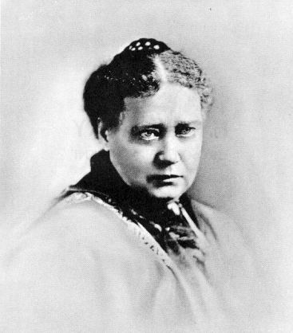

[Intangible Textual Heritage](../../index)  [Theosophy](../index.md) 
[Esoteric](../../eso/index.md)

------------------------------------------------------------------------

# The Secret Doctrine

#### THE SYNTHESIS OF SCIENCE, RELIGION, AND PHILOSOPHY.

### By H. P. Blavatsky

------------------------------------------------------------------------

Volume 1: [Part 1](#pt1) \| [Part 2](#pt2) \| [Part 3](#pt3.md)  
Volume 2: [Part 1](#pt21) \| [Part 2](#pt22) \| [Part 3](#pt23.md)  

(Link to Full "Verbatim" Table of Contents of [Volume 1](sd1-0-co.md) and
[Volume 2](sd2-0-co).md)

VOLUME FIRST: COSMOGENESIS.

[PREFACE](sd1-0-co.htm#preface.md) ... vii

[INTRODUCTION ... xvii.](sd1-0-in.md)

[PROEM ... 1](sd1-0-pr.md)

##### BOOK I. -- PART I: COSMIC EVOLUTION.

[SEVEN STANZAS FROM THE BOOK OF DZYAN ... 27](sd1-1-01.md)

[STANZA I. -- THE NIGHT OF THE UNIVERSE... 35](sd1-1-02.md)

[STANZA II. -- THE IDEA OF DIFFERENTIATION ... 53](sd1-1-03.md)

[STANZA III. -- THE AWAKENING OF KOSMOS ... 62](sd1-1-04.md)

[STANZA IV. -- THE SEPTENARY HIERARCHIES ... 86](sd1-1-05.md)

[STANZA V. -- FOHAT: THE CHILD OF THE SEPTENARY HIERARCHIES ...
106](sd1-1-06.md)

[STANZA VI. -- OUR WORLD, ITS GROWTH AND DEVELOPMENT ... 136](sd1-1-07.md)

[THEOSOPHICAL MISCONCEPTIONS ... 152](sd1-1-08.md)

[EXPLANATIONS CONCERNING THE GLOBES AND THE MONADS ... 170](sd1-1-09.md)

[STANZA VI. -- CONTINUED. ... 191](sd1-1-10.md)

[STANZA VII. -- THE PARENTS OF MAN ON EARTH ... 213](sd1-1-11.md)

> (continued in )[Formation of Man: the Thinker ... 238](sd1-1-12.md)

[SUMMING UP ... 269](sd1-1-13.md)

##### BOOK I. -- PART II. THE EVOLUTION OF SYMBOLISM IN ITS APPROXIMATE ORDER.

[I. SYMBOLISM AND IDEOGRAPHS ... 303](sd1-2-01.md)

[II. THE MYSTERY LANGUAGE AND ITS KEYS ... 310](sd1-2-02.md)

[III. PRIMORDIAL SUBSTANCE AND DIVINE THOUGHT ... 325](sd1-2-03.md)

[IV. CHAOS -- THEOS -- KOSMOS ... 342](sd1-2-04.md)

[V. THE HIDDEN DEITY, ITS SYMBOLS AND GLYPHS ... 349](sd1-2-05.md)

[VI. THE MUNDANE EGG ... 359](sd1-2-06.md)

[VII. THE DAYS AND NIGHTS OF BRAHMA ... 368](sd1-2-07.md)

[VIII. THE LOTUS AS A UNIVERSAL SYMBOL ... 379](sd1-2-08.md)

[IX. DEUS LUNUS ... 386](sd1-2-09.md)

[X. TREE AND SERPENT AND CROCODILE WORSHIP ... 403](sd1-2-10.md)

[XI. DEMON EST DEUS INVERSUS ... 411](sd1-2-11.md)

[XII. THE THEOGONY OF THE CREATIVE GODS ... 424](sd1-2-12.md)

[XIII. THE SEVEN CREATIONS ... 445](sd1-2-13.md)

[XIV. THE FOUR ELEMENTS. ... 460](sd1-2-14.md)

[XV. ON KWAN-SHI-YIN AND KWAN-YIN ... 470](sd1-2-15.md)

##### BOOK I. -- PART III. SCIENCE AND THE SECRET DOCTRINE CONTRASTED.

[I. REASONS FOR THESE ADDENDA ... 477](sd1-3-01.md)

[II. MODERN PHYSICISTS ARE PLAYING AT BLIND MAN'S BUFF ...
482](sd1-3-02.md)

[III. AN LUMEN SIT CORPUS NEC NON? ... 483](sd1-3-03.md)

[IV. IS GRAVITATION A LAW? ... 490](sd1-3-04.md)

[V. THE THEORIES OF ROTATION SCIENCE ... 500](sd1-3-05.md)

[VI. THE MASKS OF SCIENCE ... 506](sd1-3-06.md)

[VII. AN ATTACK ON THE SCIENTIFIC THEORY OF FORCE](sd1-3-07.md) BY A MAN OF
SCIENCE ... 523

[VIII. LIFE, FORCE, OR GRAVITY? ... 529](sd1-3-08.md)

[IX. THE SOLAR THEORY ... 540](sd1-3-09.md)

[X. THE COMING FORCE ... 554](sd1-3-10.md)

[XI. ON THE ELEMENTS AND ATOMS ... 566](sd1-3-11.md)

[XII. ANCIENT THOUGHT IN MODERN DRESS ... 579](sd1-3-12.md)

[XIII. THE MODERN NEBULAR THEORY ... 588](sd1-3-13.md)

[XIV. FORCES -- MODES OF MOTION OR INTELLIGENCES? ... 601](sd1-3-14.md)

[XV. GODS, MONADS, AND ATOMS ... 610](sd1-3-15.md)

[XVI. CYCLIC EVOLUTION AND KARMA ... 634](sd1-3-16.md)

[XVII. THE ZODIAC AND ITS ANTIQUITY ... 647](sd1-3-17.md)

[XVIII. SUMMARY OF THE MUTUAL POSITION ... 668](sd1-3-18.md)

##### VOLUME SECOND.

[PRELIMINARY NOTES.](sd2-0-pn.md)

##### BOOK II. -- PART I.: ANTHROPOGENESIS.

[STANZAS FROM THE BOOK OF DZYAN . . . 15](sd2-1-01.md)

[THE BEGINNINGS OF SENTIENT LIVE ... 22](sd2-1-02.md)

[TWO ANTEDILUVIAN ASTRONOMERS ... 47](sd2-1-02.htm#two.md)

[STANZA II. -- NATURE UNAIDED FAILS ... 52](sd2-1-03.md)

[THE CHRONOLOGY OF THE BRAHMINS ... 66](sd2-1-03.htm#chronology.md)

[STANZA III. -- ATTEMPTS TO CREATE MAN ... 75](sd2-1-04.md)

[STANZA IV. -- CREATION OF THE FIRST RACES ... 86](sd2-1-05.md)

[STANZA V. -- THE EVOLUTION OF THE SECOND RACE ... 109](sd2-1-06.md)

[STANZA VI. -- THE EVOLUTION OF THE SWEAT-BORN ... 131](sd2-1-07.md)

[STANZA VII. -- FROM THE SEMI-DIVINE DOWN TO THE FIRST HUMAN RACES ...
161](sd2-1-08.md)

[STANZA VIII. -- EVOLUTION OF THE ANIMAL MAMMALIANS -- THE FIRST ...
180](sd2-1-09.md)

[WHAT MAY BE THE OBJECTIONS TO THE FOREGOING ... 185](sd2-1-09.md)

[STANZA IX. -- THE FINAL EVOLUTION OF MAN ... 191](sd2-1-10.md)

[EDENS, SERPENTS AND DRAGONS ... 202](sd2-1-11.md)

[THE SONS OF GOD AND THE SACRED ISLAND ... 220](sd2-1-12.md)

[STANZA X. -- THE HISTORY OF THE FOURTH RACE ... 227](sd2-1-13.md)

[ARCHAIC TEACHINGS IN THE PURANAS AND GENESIS ... 251](sd2-1-14.md)

[A PANORAMIC VIEW OF THE EARLY RACES ... 263](sd2-1-15.md)

[STANZA X. -- Continued ... 271](sd2-1-15.htm#stanza.md)

[ARE GIANTS A FICTION? ... 277](sd2-1-16.md)

[THE RACES WITH THE "THIRD EYE" ... 289](sd2-1-17.md)

[THE PRIMEVAL MANUS OF HUMANITY ... 307](sd2-1-18.md)

[STANZA XI. -- THE CIVILIZATION AND DESTRUCTION](sd2-1-19.md) OF THE FOURTH
AND FIFTH RACES ... 316

[CYCLOPEAN RUINS AND COLOSSAL STONES AS WITNESSES TO GIANTS ...
341](sd2-1-20.md)

[STANZA XII. -- THE FIFTH RACE AND ITS DIVINE INSTRUCTORS ...
351](sd2-1-21.md)

> [The Origin of the Satanic Myth ... 378](sd2-1-22.md)  
> [Western Speculations founded on the Greek and Puranic Traditions ...
> 402](sd2-1-23.md)

[ADDITIONAL FRAGMENTS FROM A COMMENTARY](sd2-1-24.md) ON THE VERSES OF
STANZA XII. ... 423

[CONCLUSION ... 437](sd2-1-25.md)

##### BOOK II. -- PART II. THE ARCHAIC SYMBOLISM OF THE WORLD-RELIGIONS.

[ESOTERIC TENETS CORROBORATED IN EVERY SCRIPTURE ... 449](sd2-2-01.md)

[§ XVI. ADAM-ADAMI ... 452](sd2-2-02.md)

[XVII. THE "HOLY OF HOLIES": ITS DEGRADATION ... 459](sd2-2-03.md)

[XVIII. ON THE MYTH OF THE "FALLEN ANGEL," IN ITS VARIOUS ASPECTS ...
475](sd2-2-04.md)

> [The many meanings of the "War in Heaven" ... 492](sd2-2-05.md)

[XIX. IS PLEROMA SATAN'S LAIR? ... 506](sd2-2-06.md)

[XX. PROMETHEUS THE TITAN ... 519](sd2-2-07.md)

[XXI. ENOICHION-HENOCH ... 529](sd2-2-08.md)

[XXII. THE SYMBOLISM OF THE MYSTERY NAMES IAO AND JEHOVAH ...
536](sd2-2-09.md)

[XXIII. THE UPANISHADS IN GNOSTIC LITERATURE ... 563](sd2-2-10.md)

[XXIV. THE CROSS AND THE PYTHAGOREAN DECADE ... 573](sd2-2-11.md)

[XXV. THE MYSTERIES OF THE HEBDOMAD ... 590](sd2-2-12.md)

> [The Septenary Element in the Vedas](sd2-2-13.md) ... 605  
> [The Seven Souls of the Egyptologists](sd2-2-14.md) ... 630

##### BOOK II. -- PART III. ADDENDA. SCIENCE AND THE SECRET DOCTRINE CONTRASTED.

[I. ARCHAIC, OR MODERN ANTHROPOLOGY? ... 645](sd2-3-01.md)

[II. THE ANCESTORS MANKIND IS OFFERED BY SCIENCE ... 656](sd2-3-02.md)

[III. THE FOSSIL RELICS OF MAN AND THE ANTHROPOID APE ... 675](sd2-3-03.md)

[IV. DURATION OF THE GEOLOGICAL PERIODS, RACE CYCLES](sd2-3-04.md), AND THE
ANTIQUITY OF MAN ... 690

[(c) Esoteric Geological Chronology ... 709](sd2-3-05.md)  
[V. ORGANIC EVOLUTION AND CREATIVE CENTRES ... 731](sd2-3-06.md)

[VI. GIANTS, CIVILIZATIONS, AND SUBMERGED CONTINENTS](sd2-3-07.md) TRACED
IN HISTORY ... 742

[(a) Statements about the Sacred Islands ... 760](sd2-3-08.md)  
[VII. SCIENTIFIC AND GEOLOGICAL PROOFS](sd2-3-09.md) OF THE EXISTENCE OF
SEVERAL SUBMERGED CONTINENTS ... 778

------------------------------------------------------------------------

HELENA PETROVNA BLAVATSKY

1831-1891

