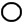
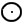
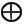
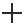
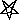

##### *The Secret Doctrine* by H. P. Blavatsky -- Vol. 1

------------------------------------------------------------------------

###### \[\[Vol. 1, Page 1\]\]

### PROEM

-------

PAGES FROM A PRE-HISTORIC PERIOD.

**A**N Archaic Manuscript -- a collection of palm leaves made
impermeable to water, fire, and air, by some specific unknown process --
is before the writer's eye. On the first page is an immaculate white
disk within a dull black ground. On the following page, the same disk,
but with a central point. The first, the student knows to represent
Kosmos in Eternity, before the re-awakening of still slumbering Energy,
the emanation of the Word in later systems. The point in the hitherto
immaculate Disk, Space and Eternity in Pralaya, denotes the dawn of
differentiation. It is the Point in the Mundane Egg (see Part II., "The
Mundane Egg"), the germ within the latter which will become the
Universe, the ALL, the boundless, periodical Kosmos, this germ being
latent and active, periodically and by turns. The one circle is divine
Unity, from which all proceeds, whither all returns. Its circumference
-- a forcibly limited symbol, in view of the limitation of the human
mind -- indicates the abstract, ever incognisable PRESENCE, and its
plane, the Universal Soul, although the two are one. Only the face of
the Disk being white and the ground all around black, shows clearly that
its plane is the only knowledge, dim and hazy though it still is, that
is attainable by man. It is on this plane that the Manvantaric
manifestations begin; for it is in this SOUL that slumbers, during the
Pralaya, the Divine Thought,\* wherein lies concealed the plan of every
future Cosmogony and Theogony.

###### \[\[Footnote(s)\]\] -------------------------------------------------

\* It is hardly necessary to remind the reader once more that the term
"Divine Thought," like that of "Universal Mind," must not be regarded as
even vaguely shadowing forth an intellectual process akin to that
exhibited by man. The "Unconscious," according to von Hartmann, arrived
at the vast creative, or rather Evolutionary Plan, "by a clairvoyant
wisdom superior to all consciousness," which in the Vedantic language
would mean absolute Wisdom. Only those who realise how far Intuition
soars above the tardy processes of ratiocinative thought can form the
faintest conception of \[\[Footnote continued on next page\]\]

------------------------------------------------------------------------

###### \[\[Vol. 1, Page\]\] 2 THE SECRET DOCTRINE.

It is the ONE LIFE, eternal, invisible, yet Omnipresent, without
beginning or end, yet periodical in its regular manifestations, between
which periods reigns the dark mystery of non-Being; unconscious, yet
absolute Consciousness; unrealisable, yet the one self-existing reality;
truly, "a chaos to the sense, a Kosmos to the reason." Its one absolute
attribute, which is ITSELF, eternal, ceaseless Motion, is called in
esoteric parlance the "Great Breath,"\* which is the perpetual motion of
the universe, in the sense of limitless, ever-present SPACE. That which
is motionless cannot be Divine. But then there is nothing in fact and
reality absolutely motionless within the universal soul.

Almost five centuries B.C. Leucippus, the instructor of Democritus,
maintained that Space was filled eternally with atoms actuated by a
ceaseless motion, the latter generating in due course of time, when
those atoms aggregated, rotatory motion, through mutual collisions
producing lateral movements. Epicurus and Lucretius taught the same,
only adding to the lateral motion of the atoms the idea of affinity --
an occult teaching.

From the beginning of man's inheritance, from the first appearance of
the architects of the globe he lives in, the unrevealed Deity was
recognised and considered under its only philosophical aspect --
universal motion, the thrill of the creative Breath in Nature. Occultism
sums up the "One Existence" thus: "Deity is an arcane, living (or
moving) FIRE, and the eternal witnesses to this unseen Presence are
Light, Heat, Moisture," -- this trinity including, and being the cause
of, every

###### \[\[Footnote(s)\]\] -------------------------------------------------

\[\[Footnote continued from previous page\]\] that absolute Wisdom which
transcends the ideas of Time and Space. Mind, as we know it, is
resolvable into states of consciousness, of varying duration, intensity,
complexity, etc. -- all, in the ultimate, resting on sensation, which is
again Maya. Sensation, again, necessarily postulates limitation. The
personal God of orthodox Theism perceives, thinks, and is affected by
emotion; he repents and feels "fierce anger." But the notion of such
mental states clearly involves the unthinkable postulate of the
externality of the exciting stimuli, to say nothing of the impossibility
of ascribing changelessness to a Being whose emotions fluctuate with
events in the worlds he presides over. The conceptions of a Personal God
as changeless and infinite are thus unpsychological and, what is worse,
unphilosophical.

\* Plato proves himself an Initiate, when saying in Cratylus that
\[\[*theos*\]\] is derived from the verb \[\[*theein*\]\], "to move,"
"to run," as the first astronomers who observed the motions of the
heavenly bodies called the planets \[\[*theoi*\]\], the gods. (See Book
II., "Symbolism of the Cross and Circle.") Later, the word produced
another term, \[\[*aletheia*\]\] -- "the breath of God."

------------------------------------------------------------------------

###### \[\[Vol. 1, Page\]\] 3 PROEM.

phenomenon in Nature.\* Intra-Cosmic motion is eternal and ceaseless;
cosmic motion (the visible, or that which is subject to perception) is
finite and periodical. As an eternal abstraction it is the EVER-PRESENT;
as a manifestation, it is finite both in the coming direction and the
opposite, the two being the alpha and omega of successive
reconstructions. Kosmos -- the NOUMENON -- has nought to do with the
causal relations of the phenomenal World. It is only with reference to
the intra-cosmic soul, the ideal Kosmos in the immutable Divine Thought,
that we may say: "It never had a beginning nor will it have an end."
With regard to its body or Cosmic organization, though it cannot be said
that it had a first, or will ever have a last construction, yet at each
new Manvantara, its organization may be regarded as the first and the
last of its kind, as it evolutes every time on a higher plane . . . .

A few years ago only, it was stated that: --

"The esoteric doctrine teaches, like Buddhism and Brahminism, and even
the Kabala, that the one infinite and unknown Essence exists from all
eternity, and in regular and harmonious successions is either passive or
active. In the poetical phraseology of Manu these conditions are called
the "Days" and the "Nights" of Brahma. The latter is either "awake" or
"asleep." The Svabhavikas, or philosophers of the oldest school of
Buddhism (which still exists in Nepaul), speculate only upon the active
condition of this "Essence," which they call Svabhavat, and deem it
foolish to theorise upon the abstract and "unknowable" power in its
passive condition. Hence they are called atheists by both Christian
theologians and modern scientists, for neither of the

###### \[\[Footnote(s)\]\] -------------------------------------------------

\* Nominalists, arguing with Berkeley that "it is impossible . . . to
form the abstract idea of motion distinct from the body moving" ("*Prin.
of Human Knowledge,*" *Introd*., *par.* 10), may put the question, "What
is that body, the producer of that motion? Is it a substance? Then you
are believers in a Personal God?" etc., etc. This will be answered
farther on, in the Addendum to this Book; meanwhile, we claim our rights
of Conceptionalists as against Roscelini's materialistic views of
Realism and Nominalism. "Has science," says one of its ablest advocates,
Edward Clodd, "revealed anything that weakens or opposes itself to the
ancient words in which the Essence of all religion, past, present, and
to come, is given; to do justly, to love mercy, to walk humbly before
thy God?" Provided we connote by the word God, *not the crude
anthropomorphism which is still the backbone of our current theology,
but the symbolic conception of that which is Life and Motion of the
Universe*, to know which in physical order is to know time past,
present, and to come, in the existence of successions of phenomena; to
know which, in the moral, is to know what has been, is, and will be,
within human consciousness. (*See* "*Science and the Emotions.*" *A
Discourse delivered at South Place Chapel, Finsbury, London, Dec.*
27*th,* 1885.)

------------------------------------------------------------------------

###### \[\[Vol. 1, Page\]\] 4 THE SECRET DOCTRINE.

two are able to understand the profound logic of their philosophy. The
former will allow of no other God than the personified secondary powers
which have worked out the visible universe, and which became with them
the anthropomorphic God of the Christians -- the male Jehovah, roaring
amid thunder and lightning. In its turn, rationalistic science greets
the Buddhists and the Svabhavikas as the "positivists" of the archaic
ages. If we take a one-sided view of the philosophy of the latter, our
materialists may be right in their own way. The Buddhists maintained
that there is no Creator, but an infinitude of creative powers, which
collectively form the one eternal substance, the essence of which is
inscrutable -- hence not a subject for speculation for any true
philosopher. Socrates invariably refused to argue upon the mystery of
universal being, yet no one would ever have thought of charging him with
atheism, except those who were bent upon his destruction. Upon
inaugurating an active period, says the Secret Doctrine, an expansion of
this Divine essence from without inwardly and from within outwardly,
occurs in obedience to eternal and immutable law, and the phenomenal or
visible universe is the ultimate result of the long chain of cosmical
forces thus progressively set in motion. In like manner, when the
passive condition is resumed, a contraction of the Divine essence takes
place, and the previous work of creation is gradually and progressively
undone. The visible universe becomes disintegrated, its material
dispersed; and 'darkness' solitary and alone, broods once more over the
face of the 'deep.' To use a Metaphor from the Secret Books, which will
convey the idea still more clearly, an out-breathing of the 'unknown
essence' produces the world; and an inhalation causes it to disappear.
This process has been going on from all eternity, and our present
universe is but one of an infinite series, which had no beginning and
will have no end." -- (*See* "*Isis Unveiled*"*; also* "*The Days and
Nights of Brahma*" *in Part II.*)

This passage will be explained, as far as it is possible, in the present
work. Though, as it now stands, it contains nothing new to the
Orientalist, its esoteric interpretation may contain a good deal which
has hitherto remained entirely unknown to the Western student.

The first illustration being a plain disc  the second one
in the Archaic symbol shows , a disc with a point in it
-- the first differentiation in the periodical manifestations of the
ever-eternal nature, sexless and infinite "Aditi in THAT" (Rig Veda),
the point in the disc, or potential Space within abstract Space. In its
third stage the point is transformed into a diameter, thus
 It now symbolises a divine immaculate Mother-Nature
within the all-embracing absolute Infinitude.

------------------------------------------------------------------------

###### \[\[Vol. 1, Page\]\] 5 PROEM.

When the diameter line is crossed by a vertical one , it
becomes the mundane cross. Humanity has reached its third root-race; it
is the sign for the origin of human life to begin. When the
circumference disappears and leaves only the  it is a
sign that the fall of man into matter is accomplished, and the FOURTH
race begins. The Cross within a circle symbolises pure Pantheism; when
the Cross was left uninscribed, it became phallic. It had the same and
yet other meanings as a TAU inscribed within a circle  or
as a "Thor's hammer," the Jaina cross, so-called, or simply Svastica
within a circle 

By the third symbol -- the circle divided in two by the horizontal line
of the diameter -- the first manifestation of creative (still passive,
because feminine) Nature was meant. The first shadowy perception of man
connected with procreation is feminine, because man knows his mother
more than his father. Hence female deities were more sacred than the
male. Nature is therefore feminine, and, to a degree, objective and
tangible, and the spirit Principle which fructifies it is concealed. By
adding to the circle with the horizontal line in it, a perpendicular
line, the tau was formed -- --  -- the oldest form of the
letter. It was the glyph of the third root-race to the day of its
symbolical Fall -- *i.e.*, when the separation of sexes by natural
evolution took place -- when the figure became , the
circle, or sexless life modified or separated -- a double glyph or
symbol. With the races of our Fifth Race it became in symbology the
sacr', and in Hebrew n'cabvah, of the first-formed races;\* then it
changed into the Egyptian  (emblem of life), and still
later into the sign of Venus,  Then comes the Svastica
(Thor's hammer, or the "Hermetic Cross" now), entirely separated from
its Circle, thus becoming purely phallic. The esoteric symbol of Kali
Yuga is the five-pointed star reversed, thus  -- the sign
of human sorcery, with its two points (horns) turned heavenward, a
position every

###### \[\[Footnote(s)\]\] -------------------------------------------------

\* See that suggestive work, "The Source of Measures," where the author
explains the real meaning of the word "sacr'," from which "sacred,"
"sacrament," are derived, which have now become synonyms of "holiness,"
though purely phallic!

------------------------------------------------------------------------

###### \[\[Vol. 1, Page\]\] 6 THE SECRET DOCTRINE.

Occultist will recognise as one of the "left-hand," and used in
ceremonial magic.\*

It is hoped that during the perusal of this work the erroneous ideas of
the public in general with regard to Pantheism will be modified. It is
wrong and unjust to regard the Buddhists and Advaitee Occultists as
atheists. If not all of them philosophers, they are, at any rate, all
logicians, their objections and arguments being based on strict
reasoning. Indeed, if the Parabrahmam of the Hindus may be taken as a
representative of the hidden and nameless deities of other nations, this
absolute Principle will be found to be the prototype from which all the
others were copied. Parabrahm is not "God," because It is not a God. "It
is that which is supreme, and not supreme (paravara)," explains Mandukya
Upanishad (2.28). IT is "Supreme" as CAUSE, not supreme as effect.
Parabrahm is simply, as a "Secondless Reality," the all-inclusive Kosmos
-- or, rather, the infinite Cosmic Space -- in the highest spiritual
sense, of course. Brahma (neuter) being the unchanging, pure, free,
undecaying supreme Root, "the ONE true Existence, Paramarthika," and the
absolute Chit and Chaitanya (intelligence, consciousness) cannot be a
cogniser, "for THAT can have no subject of cognition." Can the flame be
called the essence of Fire? This Essence is "the LIFE and LIGHT of the
Universe, the visible fire and flame are destruction, death, and evil."
"Fire and Flame destroy the body of an Arhat, their essence makes him
immortal." (*Bodhi-mur, Book II.*) "The knowledge of the absolute
Spirit, like the effulgence of the sun, or like heat in fire, is naught
else than the absolute Essence itself," says Sankaracharya. **IT** -- is
"the Spirit of the Fire," not fire itself; therefore, "the attributes of
the latter, heat or flame, are not the attributes of the Spirit, but of
that of which that Spirit is the unconscious cause." Is not the above
sentence the true key-note of later Rosicrucian

###### \[\[Footnote(s)\]\] -------------------------------------------------

\* We are told by the Western mathematicians and some American
Kabalists, that in the Kabala also "the value of the Jehovah name is
that of the diameter of a circle." Add to this the fact that Jehovah is
the third Sephiroth, *Binah,* a feminine word, and you have the key to
the mystery. By certain Kabalistic transformations this name,
*androgynous* in the first chapters of Genesis, becomes in its
transformations entirely masculine, Cainite and phallic. The fact of
choosing a deity among the pagan gods and making of it a special
national God, to call upon it as the "One living God," the "God of
Gods," and then proclaim this worship Monotheistic, does not change it
into the ONE Principle whose "Unity admits not of multiplication,
change, or form," especially in the case of a priapic deity, as Jehovah
now demonstrated to be.

------------------------------------------------------------------------

###### \[\[Vol. 1, Page\]\] 7 PROEM.

philosophy? Parabrahm is, in short, the collective aggregate of Kosmos
in its infinity and eternity, the "THAT" and "THIS" to which
distributive aggregates can not be applied.\* "In the beginning THIS was
the Self, one only" (*Aitareya Upanishad);* the great Sankaracharya,
explains that "THIS" referred to the Universe (Jagat); the sense of the
words, "In the beginning," meaning before the reproduction of the
phenomenal Universe.

Therefore, when the Pantheists echo the Upanishads, which state, as in
the Secret Doctrine, that "this" cannot create, they do not deny a
Creator, or rather a *collective aggregate* of creators, but only
refuse, very logically, to attribute "creation" and especially
formation, something finite to an Infinite Principle. With them,
Parabrahmam is a passive because an Absolute Cause, the unconditioned
*Mukta.* It is only limited Omniscience and Omnipotence that are refused
to the latter, because these are still attributes (as reflected in man's
perceptions); and because Parabrahm, being the "Supreme ALL," the ever
invisible spirit and Soul of Nature, changeless and eternal, can have no
attributes; absoluteness very naturally precluding any idea of the
finite or conditioned from being connected with it. And if the Vedantin
postulates attributes as belonging simply to its emanation, calling it
"Iswara *plus* Maya," and Avidya (Agnosticism and Nescience rather than
ignorance), it is difficult to find any Atheism in this conception.\*\*
Since there can be neither two INFINITES nor two ABSOLUTES in a Universe
supposed to be Boundless, this Self-Existence can hardly be conceived of
as creating personally. In the sense and perceptions of finite "Beings,"
THAT is Non-"being," in the sense that it is the one BE-NESS; for, in
this ALL lies concealed its coeternal and coeval emanation or inherent
radiation, which, upon becoming periodically Brahma (the male-female
Potency) becomes or expands itself into the manifested Universe.
Narayana moving on the (abstract) waters of Space, is transformed into
the Waters of concrete substance moved by him, who now becomes the
manifested WORD or Logos.

###### \[\[Footnote(s)\]\] -------------------------------------------------

\* See "Vedanta Sara," by Major G. A. Jacob; as also "The Aphorisms of
S'andilya," translated by Cowell, p. 42.

\*\* Nevertheless, prejudiced and rather fanatical Christian
Orientalists would like to prove this pure Atheism. For proof of this,
see about Major Jacob's "Vedanta Sara." Yet, the whole Antiquity echoes
this Vedantic thought: --

> "Omnis enim per se divom natura necesse est  
> Immortali aevo summa cum pace fruatur."

------------------------------------------------------------------------

###### \[\[Vol. 1, Page\]\] 8 THE SECRET DOCTRINE.

The orthodox Brahmins, those who rise the most against the Pantheists
and Adwaitees, calling them Atheists, are forced, if Manu has any
authority in this matter, to accept the death of Brahma, the creator, at
the expiration of every "Age" of this (creative) deity (100 Divine years
-- a period which in our years requires fifteen figures to express it).
Yet, no philosopher among them will view this "death" in any other sense
than as a temporary disappearance from the manifested plane of
existence, or as a periodical rest.

The Occultists are, therefore, at one with the Adwaita Vedantin
philosophers as to the above tenet. They show the impossibility of
accepting on philosophical grounds the idea of the absolute ALL creating
or even evolving the "Golden Egg," into which it is said to enter in
order to transform itself into Brahma -- the Creator, who expands
himself later into gods and all the visible Universe. They say that
Absolute Unity cannot pass to infinity; for infinity presupposes the
limitless extension of *something,* and the duration of that
"something"; and the One All is like Space -- which is its only mental
and physical representation on this Earth, or our plane of existence --
neither an object of, nor a subject to, perception. If one could suppose
the Eternal Infinite All, the Omnipresent Unity, instead of being in
Eternity, becoming through periodical manifestation a manifold Universe
or a multiple personality, that Unity would cease to be one. Locke's
idea that "pure Space is capable of neither resistance nor Motion" -- is
incorrect. Space is neither a "limitless void," nor a "conditioned
fulness," but both: being, on the plane of absolute abstraction, the
ever-incognisable Deity, which is void only to finite minds,\* and on
that of *mayavic* perception, the Plenum, the absolute Container of all
that is, whether manifested or unmanifested: it is, therefore, that
ABSOLUTE ALL. There is no difference between the Christian Apostle's "In
Him we live and move and have our being," and the Hindu Rishi's "The
Universe lives in, proceeds from, and will

###### \[\[Footnote(s)\]\] -------------------------------------------------

\* The very names of the two chief deities, Brahma and Vishnu, ought to
have long ago suggested their esoteric meanings. For the root of one,
Brahmam, or Brahm, is derived by some from the word Brih, "to grow" or
"to expand" (see *Calcutta Review,* vol. lxvi., p. 14); and of the
other, Vishnu, from the root Vis, "to pervade," to enter in the nature
of the essence; Brahma-Vishnu being this infinite SPACE, of which the
gods, the Rishis, the Manus, and all in this universe are simply the
potencies, Vibhutayah.

------------------------------------------------------------------------

###### \[\[Vol. 1, Page\]\] 9 PROEM.

return to, Brahma (Brahma)": for Brahma (neuter), the unmanifested, is
that Universe *in abscondito,* and Brahma, the manifested, is the Logos,
made male-female\* in the symbolical orthodox dogmas. The God of the
Apostle-Initiate and of the Rishi being both the Unseen and the Visible
SPACE. Space is called in the esoteric symbolism "the Seven-Skinned
Eternal Mother-Father." It is composed from its undifferentiated to its
differentiated surface of seven layers.

"What is that which was, is, and will be, whether there is a Universe or
not; whether there be gods or none?" asks the esoteric Senzar Catechism.
And the answer made is -- SPACE.

It is not the One Unknown ever-present God in Nature, or Nature *in
abscondito,* that is rejected, but the God of human dogma and his
*humanized* "Word." In his infinite conceit and inherent pride and
vanity, man shaped it himself with his sacrilegious hand out of the
material he found in his own small brain-fabric, and forced it upon
mankind as a direct revelation from the one unrevealed SPACE.\*\* The
Occultist

###### \[\[Footnote(s)\]\] -------------------------------------------------

\* See Manu's account of Brahma separating his body into male and
female, the latter the female Vach, in whom he creates Viraj, and
compare this with the esotericism of Chapters II., III., and IV. of
Genesis.

\*\* Occultism is indeed in the air at the close of this our century.
Among many other works recently published, we would recommend one
especially to students of theoretical Occultism who would not venture
beyond the realm of our special human plane. It is called "New Aspects
of Life and Religion," by Henry Pratt, M.D. It is full of esoteric
dogmas and philosophy, the latter rather limited, in the concluding
chapters, by what seems to be a spirit of conditioned positivism.
Nevertheless, what is said of Space as "the Unknown First Cause," merits
quotation. "This unknown something, thus recognised as, and identified
with, the primary embodiment of Simple Unity, is invisible and
impalpable" -- (*abstract* space, granted); "and because invisible and
impalpable, therefore incognisable. And this incognisability has led to
the error of supposing it to be a simple void, a mere receptive
capacity. But, even viewed as an absolute void, space must be admitted
to be either Self-existent, infinite, and eternal, or to have had a
first cause outside, behind, and beyond itself.

"And yet could such a cause be found and defined, this would only lead
to the transferring thereto of the attributes otherwise accruing to
space, and thus merely throw the difficulty of origination a step
farther back, without gaining additional light as to primary causation."
(p. 5.)

This is precisely what has been done by the believers in an
anthropomorphic Creator, an extracosmic, instead of an intracosmic God.
Many -- most of Mr. Pratt's subjects, we may say -- are old Kabalistic
ideas and theories which he presents in quite a new garb: "New Aspects"
of the Occult in Nature, indeed. Space, however, viewed as a
"Substantial Unity" -- the "living Source of Life" -- is as the "Un-
\[\[Footnote continued on next page\]\]

------------------------------------------------------------------------

###### \[\[Vol. 1, Page\]\] 10 THE SECRET DOCTRINE.

accepts revelation as coming from divine yet still finite Beings, the
manifested lives, never from the Unmanifestable ONE LIFE; from those
entities, called Primordial Man, Dhyani-Buddhas, or Dhyan-Chohans, the
"Rishi-Prajapati" of the Hindus, the Elohim or "Sons of God," the
Planetary Spirits of all nations, who have become Gods for men. He also
regards the Adi-Sakti -- the direct emanation of Mulaprakriti, the
eternal Root of THAT, and the female aspect of the Creative Cause
Brahma, in her A'kasic form of the Universal Soul -- as philosophically
a Maya, and cause of human Maya. But this view does not prevent him from
believing in its existence so long as it lasts, to wit, for one
Mahamanvantara; nor from applying Akasa, the radiation of
Mulaprakriti,\* to practical purposes, connected as the World-Soul is
with all natural phenomena, known or unknown to science.

The oldest religions of the world -- exoterically, for the esoteric root
or foundation is one -- are the Indian, the Mazdean, and the Egyptian.
Then comes the Chaldean, the outcome of these -- entirely lost to the
world now, except in its disfigured Sabeanism as at present rendered by
the archaeologists; then, passing over a number of religions that will
be mentioned later, comes the Jewish, esoterically, as in the Kabala,
following in the line of Babylonian Magism; exoterically, as in Genesis
and the Pentateuch, a collection of allegorical legends. Read by the
light of the Zohar, the initial four chapters of Genesis are the
fragment

###### \[\[Footnote(s)\]\] -------------------------------------------------

\[\[Footnote continued from previous page\]\] known Causeless Cause," is
the oldest dogma in Occultism, millenniums earlier than the
*Pater-AEther* of the Greeks and Latins. So are the "Force and Matter,
as Potencies of Space, inseparable, and the Unknown revealers of the
Unknown." They are all found in Aryan philosophy personified by
Visvakarman, Indra, Vishnu, etc., etc. Still they are expressed very
philosophically, and under many unusual aspects, in the work referred
to.

\* In contradistinction to the manifested universe of matter, the term
*Mulaprakriti* (from *Mula*, "the root," and *prakriti*, "nature"), or
the unmanifested primordial matter -- called by Western alchemists
Adam's Earth -- is applied by the Vedantins to *Parabrahmam.* Matter is
dual in religious metaphysics, and septenary in esoteric teachings, like
everything else in the universe. As *Mulaprakriti,* it is
undifferentiated and eternal; as Vyakta, it becomes differentiated and
conditioned, according to *Svetasvatara Upanishad*, *I*. 8, and *Devi
Bhagavata Purana.* The author of the Four Lectures on the Bhagavad Gita,
says, in speaking of *Mulaprakriti:* "From its (the Logos') objective
standpoint, *Parabrahmam* appears to it as *Mulaprakriti*. . . . Of
course this *Mulaprakriti* is material to it, as any material object is
material to us. . . . *Parabrahmam* is an unconditioned and absolute
reality, and *Mulaprakriti* is a sort of veil thrown over it."
(*Theosophist*, Vol. VIII., p. 304.)

------------------------------------------------------------------------

###### \[\[Vol. 1, Page\]\] 11 PROEM.

of a highly philosophical page in the World's Cosmogony. (*See* Book
III., *Gupta Vidya and the Zohar.*) Left in their symbolical disguise,
they are a nursery tale, an ugly thorn in the side of science and logic,
an evident effect of Karma. To have let them serve as a prologue to
Christianity was a cruel revenge on the part of the Rabbis, who knew
better what their Pentateuch meant. It was a silent protest against
their spoliation, and the Jews have certainly now the better of their
traditional persecutors. The above-named exoteric creeds will be
explained in the light of the Universal doctrine as we proceed with it.

The Occult Catechism contains the following questions and answers:

"*What is it that ever is?*" "*Space, the eternal Anupadaka.*"*\**
"*What is it that ever was?*" "*The Germ in the Root.*" "*What is it
that is ever coming and going?*" "*The Great Breath.*" "*Then, there are
three Eternals?*" "*No, the three are one. That which ever is is one,
that which ever was is one, that which is ever being and becoming is
also one: and this is Space.*"

"*Explain, oh Lanoo (disciple).*" *--* "*The One is an unbroken Circle*
(*ring*) *with no circumference, for it is nowhere and everywhere; the
One is the boundless plane of the Circle, manifesting a diameter only
during the manvantaric periods; the One is the indivisible point found
nowhere, perceived everywhere during those periods; it is the Vertical
and the Horizontal, the Father and the Mother, the summit and base of
the Father, the two extremities of the Mother, reaching in reality
nowhere, for the One is the Ring as also the rings that are within that
Ring. Light in darkness and darkness in light: the* '*Breath which is
eternal.*' *It proceeds from without inwardly, when it is everywhere,
and from within outwardly, when it is nowhere --* (*i.e., maya,\*\* one
of the centres\*\*\**)*. It expands* *and*

###### \[\[Footnote(s)\]\] -------------------------------------------------

\* Meaning "parentless" -- see farther on.

\*\* Esoteric philosophy, regarding as Maya (or the illusion of
ignorance) every finite thing, must necessarily view in the same light
every intra-Cosmic planet and body, as being something organised, hence
finite. The expression, therefore, "it proceeds from without inwardly,
etc." refers in the first portion of the sentence to the dawn of the
Mahamanvantaric period, or the great re-evolution after one of the
complete periodical dissolutions of every compound form in Nature (from
planet to molecule) into its ultimate essence or element; and in its
second portion, to the partial or local manvantara, which may be a solar
or even a planetary one.

\*\*\* By "centre," a centre of energy or a Cosmic focus is meant; when
the so-called "Creation," or formation of a planet, is accomplished by
that force which is designated by the Occultists LIFE and by Science
"energy," then the process takes place \[\[Footnote continued on next
page\]\]

------------------------------------------------------------------------

###### \[\[Vol. 1, Page\]\] 12 THE SECRET DOCTRINE.

*contracts* (*exhalation and inhalation*)*. When it expands the mother
diffuses and scatters; when it contracts, the mother draws back and
ingathers. This produces the periods of Evolution and Dissolution,
Manwantara and Pralaya. The Germ is invisible and fiery; the Root* (*the
plane of the circle*) *is cool; but during Evolution and Manwantara her
garment is cold and radiant. Hot Breath is the Father who devours the
progeny of the many-faced Element* (*heterogeneous*)*; and leaves the
single-faced ones* (*homogeneous*)*. Cool Breath is the Mother, who
conceives, forms, brings forth, and receives them back into her bosom,
to reform them at the Dawn* (*of the Day of Brahma, or Manvantara*)*. .*
. . ."

For clearer understanding on the part of the general reader, it must be
stated that Occult Science recognises *Seven* Cosmical Elements -- four
entirely physical, and the fifth (Ether) semi-material, as it will
become visible in the air towards the end of our Fourth Round, to reign
supreme over the others during the whole of the Fifth. The remaining two
are as yet absolutely beyond the range of human perception. These latter
will, however, appear as presentments during the 6th and 7th Races of
this Round, and will become known in the 6th and 7th Rounds
respectively.\* These seven elements with their numberless Sub-Elements

###### \[\[Footnote(s)\]\] -------------------------------------------------

\[\[Footnote continued from previous page\]\] from within outwardly,
every atom being said to contain in itself creative energy of the divine
breath. Hence, whereas after an absolute pralaya, or when the
pre-existing material consists but of ONE Element, and BREATH "is
everywhere," the latter acts from without inwardly: after a minor
pralaya, everything having remained in *statu quo --* in a refrigerated
state, so to say, like the moon -- at the first flutter of manvantara,
the planet or planets begin their resurrection to life from within
outwardly.

\* It is curious to notice how, in the evolutionary cycles of ideas,
ancient thought seems to be reflected in modern speculation. Had Mr.
Herbert Spencer read and studied ancient Hindu philosophers when he
wrote a certain passage in his "First Principles" (p. 482), or is it an
independent flash of inner perception that made him say half correctly,
half incorrectly, "motion as well as matter, being fixed in quantity
(?), it would seem that the change in the distribution of Matter which
Motion effects, coming to a limit in whichever direction it is carried
(?), the indestructible Motion thereupon necessitates a reverse
distribution. Apparently, the universally co-existent forces of
attraction and repulsion which, as we have seen, necessitate rhythm in
all minor changes throughout the Universe, also necessitate rhythm in
the totality of its changes -- produce now an immeasurable period during
which the attracting forces predominating, cause universal
concentration, and then an immeasurable period, during which the
repulsive forces predominating, cause universal diffusion -- alternate
eras of Evolution and dissolution."

------------------------------------------------------------------------

###### \[\[Vol. 1, Page\]\] 13 PROEM.

far more numerous than those known to Science) are simply *conditional*
modifications and aspects of the ONE and only Element. This latter is
not *Ether,\** not even *A'kasa* but the *Source* of these. The Fifth
Element, now advocated quite freely by Science, is not the Ether
hypothesised by Sir Isaac Newton -- although he calls it by that name,
having associated it in his mind probably with the AEther,
"Father-Mother" of Antiquity. As Newton intuitionally says, "Nature is a
perpetual circulatory worker, generating fluids out of solids, fixed
things out of volatile, and volatile out of fixed, subtile out of gross,
and gross out of subtile. . . . . Thus, perhaps, may all things be
originated from Ether," (Hypoth, 1675).

The reader has to bear in mind that the Stanzas given treat only of the
Cosmogony of our own planetary System and what is visible around it,
after a Solar Pralaya. The secret teachings with regard to the Evolution
of the Universal Kosmos cannot be given, since they could not be
understood by the highest minds in this age, and there seem to be very
few Initiates, even among the greatest, who are allowed to speculate
upon this subject. Moreover the Teachers say openly that not even the
highest Dhyani-Chohans have ever penetrated the mysteries beyond those
boundaries that separate the milliards of Solar systems from the
"Central Sun," as it is called. Therefore, that which is given, relates
only to our visible Kosmos, after a "Night of Brahma."

Before the reader proceeds to the consideration of the Stanzas from the
Book of Dzyan which form the basis of the present work, it is absolutely
necessary that he should be made acquainted with the few fundamental
conceptions which underlie and pervade the entire system of thought to
which his attention is invited. These basic ideas are few in number, and
on their clear apprehension depends the understanding of all that
follows; therefore no apology is required for asking the reader to make
himself familiar with them first, before entering on the perusal of the
work itself.

###### \[\[Footnote(s)\]\] -------------------------------------------------

\* Whatever the views of physical Science upon the subject, Occult
Science has been teaching for ages that A'kasa -- of which Ether is the
grossest form -- the fifth universal Cosmic Principle (to which
corresponds and from which proceeds human Manas) is, cosmically, a
radiant, cool, diathermanous plastic matter, creative in its physical
nature, correlative in its grossest aspects and portions, immutable in
its higher principles. In the former condition it is called the
Sub-Root; and in conjunction with radiant heat, it recalls "dead worlds
to life." In its higher aspect it is the Soul of the World; in its lower
-- the DESTROYER.

------------------------------------------------------------------------

###### \[\[Vol. 1, Page\]\] 14 THE SECRET DOCTRINE.

The Secret Doctrine establishes three fundamental propositions: --

*(a)* An Omnipresent, Eternal, Boundless, and Immutable **P**RINCIPLE on
which all speculation is impossible, since it transcends the power of
human conception and could only be dwarfed by any human expression or
similitude. It is beyond the range and reach of thought -- in the words
of Mandukya, "unthinkable and unspeakable."

To render these ideas clearer to the general reader, let him set out
with the postulate that there is one absolute Reality which antecedes
all manifested, conditioned, being. This Infinite and Eternal Cause --
dimly formulated in the "Unconscious" and "Unknowable" of current
European philosophy -- is the rootless root of "all that was, is, or
ever shall be." It is of course devoid of all attributes and is
essentially without any relation to manifested, finite Being. It is
"Be-ness" rather than Being (in Sanskrit, *Sat*), and is beyond all
thought or speculation.

This "Be-ness" is symbolised in the Secret Doctrine under two aspects.
On the one hand, absolute abstract Space, representing bare
subjectivity, the one thing which no human mind can either exclude from
any conception, or conceive of by itself. On the other, absolute
Abstract Motion representing Unconditioned Consciousness. Even our
Western thinkers have shown that Consciousness is inconceivable to us
apart from change, and motion best symbolises change, its essential
characteristic. This latter aspect of the one Reality, is also
symbolised by the term "The Great Breath," a symbol sufficiently graphic
to need no further elucidation. Thus, then, the first fundamental axiom
of the Secret Doctrine is this metaphysical **O**NE **A**BSOLUTE --
**B**E-NESS -- symbolised by finite intelligence as the theological
Trinity.

It may, however, assist the student if a few further explanations are
given here.

Herbert Spencer has of late so far modified his Agnosticism, as to
assert that the nature of the "First Cause,"\* which the Occultist more
logically derives from the "Causeless Cause," the "Eternal," and the
"Unknowable," may be essentially the same as that of the Consciousness
which wells up within us: in short, that the impersonal reality
pervading

###### \[\[Footnote(s)\]\] -------------------------------------------------

\*The "first" presupposes necessarily something which is the "first
brought forth, the first in time, space, and rank" -- and therefore
finite and conditioned. The "first" \[\[Footnote continued on next
page\]\]

------------------------------------------------------------------------

###### \[\[Vol. 1, Page\]\] 15 PROEM.

the Kosmos is the pure noumenon of thought. This advance on his part
brings him very near to the esoteric and Vedantin tenet.\*

Parabrahm (the One Reality, the Absolute) is the field of Absolute
Consciousness, *i.e.,* that Essence which is out of all relation to
conditioned existence, and of which conscious existence is a conditioned
symbol. But once that we pass in thought from this (to us) Absolute
Negation, duality supervenes in the contrast of Spirit (or
consciousness) and Matter, Subject and Object.

Spirit (or Consciousness) and Matter are, however, to be regarded, not
as independent realities, but as the two facets or aspects of the
Absolute (Parabrahm), which constitute the basis of conditioned Being
whether subjective or objective.

Considering this metaphysical triad as the Root from which proceeds all
manifestation, the great Breath assumes the character of precosmic
Ideation. It is the *fons et origo* of force and of all individual
consciousness, and supplies the guiding intelligence in the vast scheme
of cosmic Evolution. On the other hand, precosmic root-substance
(*Mulaprakriti*) is that aspect of the Absolute which underlies all the
objective planes of Nature.

Just as pre-Cosmic Ideation is the root of all individual consciousness,
so pre-Cosmic Substance is the substratum of matter in the various
grades of its differentiation.

Hence it will be apparent that the contrast of these two aspects of the
Absolute is essential to the existence of the "Manifested Universe."
Apart from Cosmic Substance, Cosmic Ideation could not manifest as
individual consciousness, since it is only through a vehicle\*\* of matter that consciousness wells up as "I am I," a
physical basis being necessary to focus a ray of the Universal Mind at a
certain stage of complexity. Again, apart from Cosmic Ideation, Cosmic
Substance would remain an empty abstraction, and no emergence of
consciousness could ensue.

The "Manifested Universe," therefore, is pervaded by duality, which is,
as it were, the very essence of its EX-istence as "manifestation."

###### \[\[Footnote(s)\]\] -------------------------------------------------

\[\[Footnote continued from previous page\]\] *cannot be the absolute*,
for it is a manifestation. Therefore, Eastern Occultism calls the
Abstract All the "Causeless One Cause," the "Rootless Root," and limits
the "First Cause" to the *Logos,* in the sense that Plato gives to this
term.

\* See Mr. Subba Row's four able lectures on the Bhagavad Gita,
"Theosophist," February, 1887.

\*\* Called in Sanskrit: "Upadhi."

------------------------------------------------------------------------

###### \[\[Vol. 1, Page\]\] 16 THE SECRET DOCTRINE.

But just as the opposite poles of subject and object, spirit and matter,
are but aspects of the One Unity in which they are synthesized, so, in
the manifested Universe, there is "that" which links spirit to matter,
subject to object.

This something, at present unknown to Western speculation, is called by
the occultists Fohat. It is the "bridge" by which the "Ideas" existing
in the "Divine Thought" are impressed on Cosmic substance as the "laws
of Nature." Fohat is thus the dynamic energy of Cosmic Ideation; or,
regarded from the other side, it is the intelligent medium, the guiding
power of all manifestation, the "Thought Divine" transmitted and made
manifest through the Dhyan Chohans,\* the Architects of the visible
World. Thus from Spirit, or Cosmic Ideation, comes our consciousness;
from Cosmic Substance the several vehicles in which that consciousness
is individualised and attains to self -- or reflective -- consciousness;
while Fohat, in its various manifestations, is the mysterious link
between Mind and Matter, the animating principle electrifying every atom
into life.

The following summary will afford a clearer idea to the reader.

(1.) The **A**BSOLUTE; the *Parabrahm* of the Vedantins or the one
Reality, **S**AT, which is, as Hegel says, both Absolute Being and
Non-Being.

(2.) The first manifestation, the impersonal, and, in philosophy,
*unmanifested* Logos, the precursor of the "manifested." This is the
"First Cause," the "Unconscious" of European Pantheists.

(3.) Spirit-matter, **L**IFE; the "Spirit of the Universe," the Purusha
and Prakriti, or the *second* Logos.

(4.) Cosmic Ideation, **M**AHAT or Intelligence, the Universal
World-Soul; the Cosmic Noumenon of Matter, the basis of the intelligent
operations in and of Nature, also called **M**AHA-**B**UDDHI.

The **O**NE **R**EALITY; its *dual* aspects in the conditioned Universe.

Further, the Secret Doctrine affirms: --

*(b.)* The Eternity of the Universe *in toto* as a boundless plane;
periodically "the playground of numberless Universes incessantly
manifesting and disappearing," called "the manifesting stars," and the
"sparks of Eternity." "The Eternity of the Pilgrim"\*\* is like a wink

###### \[\[Footnote(s)\]\] -------------------------------------------------

\* Called by Christian theology: Archangels, Seraphs, etc., etc.

\*\* "Pilgrim" is the appellation given to our
*Monad* (the two in one) during its cycle of incarnations. It is the
only immortal and eternal principle in us, being an indivisible part of
the integral whole -- the Universal Spirit, from which it emanates, and
into which it is absorbed at the end of the cycle. When it is said to
emanate from the one \[\[Footnote continued on next page\]\]

------------------------------------------------------------------------

###### \[\[Vol. 1, Page\]\] 17 PROEM.

of the Eye of Self-Existence (Book of Dzyan.) "The appearance and
disappearance of Worlds is like a regular tidal ebb of flux and reflux."
(See Part II., "Days and Nights of Brahma.")

This second assertion of the Secret Doctrine is the absolute
universality of that law of periodicity, of flux and reflux, ebb and
flow, which physical science has observed and recorded in all
departments of nature. An alternation such as that of Day and Night,
Life and Death, Sleeping and Waking, is a fact so common, so perfectly
universal and without exception, that it is easy to comprehend that in
it we see one of the absolutely fundamental laws of the universe.

Moreover, the Secret Doctrine teaches: --

(*c*) The fundamental identity of all Souls with the Universal
Over-Soul, the latter being itself an aspect of the Unknown Root; and
the obligatory pilgrimage for every Soul -- a spark of the former --
through the Cycle of Incarnation (or "Necessity") in accordance with
Cyclic and Karmic law, during the whole term. In other words, no purely
spiritual Buddhi (divine Soul) can have an independent (conscious)
existence before the spark which issued from the pure Essence of the
Universal Sixth principle, -- or the OVER-SOUL, -- has (a) passed
through every elemental form of the phenomenal world of that Manvantara,
and (b) acquired individuality, first by natural impulse, and then by
self-induced and self-devised efforts (checked by its Karma), thus
ascending through all the degrees of intelligence, from the lowest to
the highest Manas, from mineral and plant, up to the holiest archangel
(Dhyani-Buddha). The pivotal doctrine of the Esoteric philosophy admits
no privileges or special gifts in man, save those won by his own Ego
through personal effort and merit throughout a long series of
metempsychoses and reincarnations. This is why the Hindus say that the
Universe is Brahma and Brahmâ, for Brahma is in every atom of the
universe, the six principles in Nature being all the outcome -- the
variously differentiated aspects -- of the SEVENTH and ONE, the only
reality in the Universe whether Cosmical or micro-cosmical; and also why
the permutations (psychic, spiritual and physical), on the plane of
manifestation and form, of the sixth (Brahmâ the vehicle of Brahma) are
viewed by metaphysical

###### \[\[Footnote(s)\]\] -------------------------------------------------

\[\[Footnote continued from previous page\]\] spirit, an awkward and
incorrect expression has to be used, for lack of appropriate words in
English. The Vedantins call it Sutratma (Thread-Soul), but their
explanation, too, differs somewhat from that of the occultists; to
explain which difference, however, is left to the Vedantins themselves.

------------------------------------------------------------------------

###### \[\[Vol. 1, Page\]\] 18 THE SECRET DOCTRINE.

antiphrasis as illusive and Mayavic. For although the root of every atom
individually and of every form collectively, is that seventh principle
or the one Reality, still, in its manifested phenomenal and temporary
appearance, it is no better than an evanescent illusion of our senses.
(See, for clearer definition, Addendum "Gods, Monads and Atoms," and
also "Theophania," "Bodhisatvas and Reincarnation," etc., etc.)

In its absoluteness, the One Principle under its two aspects (of
Parabrahmam and Mulaprakriti) is sexless, unconditioned and eternal. Its
periodical (manvantaric) emanation -- or primal radiation -- is also
One, androgynous and phenomenally finite. When the radiation radiates in
its turn, all its radiations are also androgynous, to become male and
female principles in their lower aspects. After Pralaya, whether the
great or the minor Pralaya (the latter leaving the worlds in *statu
quo\**)*,* the first that re-awakes to active life is the plastic
A'kasa, Father-Mother, the Spirit and Soul of Ether, or the plane on the
surface of the Circle. Space is called the "Mother" before its Cosmic
activity, and Father-Mother at the first stage of re-awakening. (See
Comments, Stanza II.) In the Kabala it is also Father-Mother-Son. But
whereas in the Eastern doctrine, these are the Seventh Principle of the
manifested Universe, or its "Atma-Buddhi-Manas" (Spirit, Soul,
Intelligence), the triad branching off and dividing into the seven
cosmical and seven human principles, in the Western Kabala of the
Christian mystics it is the Triad or Trinity, and with their occultists,
the male-female Jehovah, Jah-Havah. In this lies the whole difference
between the esoteric and the Christian trinities. The Mystics and the
Philosophers, the Eastern and Western Pantheists, synthesize their
pregenetic triad in the pure divine abstraction. The orthodox,
anthropomorphize it. *Hiranyagarbha, Hari,* and *Sankara* -- the three
hypostases of the manifesting "Spirit of the Supreme Spirit" (by which
title Prithivi -- the Earth -- greets Vishnu in his first Avatar) -- are
the purely metaphysical abstract qualities of formation, preservation,
and destruction, and are the three divine Avasthas (lit. hypostases) of
that which "does

###### \[\[Footnote(s)\]\] -------------------------------------------------

\* It is not the physical organisms that remain in *statu quo,* least of
all their psychical principles, during the great Cosmic or even Solar
pralayas, but only their Akasic or astral "photographs." But during the
minor pralayas, once over-taken by the "Night," the planets remain
intact, though dead, as a huge animal, caught and embedded in the polar
ice, remains the same for ages.

------------------------------------------------------------------------

###### \[\[Vol. 1, Page\]\] 19 PROEM.

not perish with created things" (or Achyuta, a name of Vishnu); whereas
the orthodox Christian separates his personal creative Deity into the
three personages of the Trinity, and admits of no higher Deity. The
latter, in Occultism, is the abstract Triangle; with the orthodox, the
perfect Cube. The creative god or the aggregate gods are regarded by the
Eastern philosopher as *Bhrantidarsanatah* -- "*false* apprehension,"
something "conceived of, by reason of erroneous appearances, as a
material form," and explained as arising from the illusive conception of
the Egotistic personal and human Soul (lower fifth principle). It is
beautifully expressed in a new translation of Vishnu Purana. "That
Brahma in its totality has essentially the aspect of Prakriti, both
evolved and unevolved (Mulaprakriti), and also the aspect of Spirit and
the aspect of Time. Spirit, O twice born, is the leading aspect of the
Supreme Brahma.\* The next is a twofold aspect, -- Prakriti, both
evolved and unevolved, and is the time last." Kronos is shown in the
Orphic theogony as being also a generated god or agent.

At this stage of the re-awakening of the Universe, the sacred symbolism
represents it as a perfect Circle with the (root) point in the Centre.
This sign was universal, therefore we find it in the Kabala also. The
Western Kabala, however, now in the hands of Christian mystics, ignores
it altogether, though it is plainly shown in the Zohar. These sectarians
begin at the end, and show as the symbol of pregenetic Kosmos this sign
, calling it "the Union of the Rose and Cross," the great
mystery of occult generation, from whence the name -- Rosicrucians (Rose
Cross)!

As may be judged, however, from the most important, as the best known of
the Rosicrucians' symbols, there is one which has never been hitherto
understood even by modern mystics. It is that of the "Pelican" tearing
open its breast to feed its seven little ones -- the real creed of the
Brothers of the Rosie-Cross and a direct outcome from the Eastern

###### \[\[Footnote(s)\]\] -------------------------------------------------

\* Thus Spencer, who, nevertheless, like Schopenhauer and von Hartmann,
only reflects an aspect of the old esoteric philosophers, and hence
lands his readers on the bleak shore of Agnostic despair -- reverently
formulates the grand mystery; "that which persists unchanging in
quantity, but ever changing in form, under these sensible appearances
which the Universe presents to us, is an unknown and unknowable power,
which we are obliged to recognise as without limit in Space and without
beginning or end in time." It is only daring Theology -- never Science
or philosophy -- which seeks to gauge the Infinite and unveil the
Fathomless and Unknowable.

------------------------------------------------------------------------

###### \[\[Vol. 1, Page\]\] 20 THE SECRET DOCTRINE.

Secret Doctrine. Brahma (neuter) is called Kalahansa, meaning, as
explained by Western Orientalists, the Eternal Swan or goose (see Stanza
III., Comment. 8), and so is Brahma, the Creator. A great mistake is
thus brought under notice; it is Brahma (neuter) who ought to be
referred to as Hansa-vahana (He who uses the swan as his Vehicle) and
not Brahma the Creator, who is the real Kalahansa, while Brahma (neuter)
is hamsa, and "A-hamsa," as will be explained in the Commentary. Let it
be understood that the terms Brahma and Parabrahmam are not used here
because they belong to our Esoteric nomenclature, but simply because
they are more familiar to the students in the West. Both are the perfect
equivalents of our one, three, and seven vowelled terms, which stand for
the **O**NE **A**LL, and the One "All in all."

Such are the basic conceptions on which the Secret Doctrine rests.

It would not be in place here to enter upon any defence or proof of
their inherent reasonableness; nor can I pause to show how they are, in
fact, contained -- though too often under a misleading guise -- in every
system of thought or philosophy worthy of the name.

Once that the reader has gained a clear comprehension of them and
realised the light which they throw on every problem of life, they will
need no further justification in his eyes, because their truth will be
to him as evident as the sun in heaven. I pass on, therefore, to the
subject matter of the Stanzas as given in this volume, adding a skeleton
outline of them, in the hope of thereby rendering the task of the
student more easy, by placing before him in a few words the general
conception therein explained.

Stanza I. The history of cosmic evolution, as traced in the Stanzas, is,
so to say, the abstract algebraical formula of that Evolution. Hence the
student must not expect to find there an account of all the stages and
transformations which intervene between the first beginnings of
"Universal" evolution and our present state. To give such an account
would be as impossible as it would be incomprehensible to men who cannot
even grasp the nature of the plane of existence next to that to which,
for the moment, their consciousness is limited.

The Stanzas, therefore, give an abstract formula which can be applied,
*mutatis mutandis,* to all evolution: to that of our tiny earth, to

------------------------------------------------------------------------

###### \[\[Vol. 1, Page\]\] 21 PROEM.

that of the chain of planets of which that earth forms one, to the solar
Universe to which that chain belongs, and so on, in an ascending scale,
till the mind reels and is exhausted in the effort.

The seven Stanzas given in this volume represent the seven terms of this
abstract formula. They refer to, and describe the seven great stages of
the evolutionary process, which are spoken of in the Puranas as the
"Seven Creations," and in the Bible as the "Days" of Creation.

---------------------

The First Stanza describes the state of the ONE ALL during Pralaya,
before the first flutter of re-awakening manifestation.

A moment's thought shows that such a state can only be symbolised; to
describe it is impossible. Nor can it be symbolised except in negatives;
for, since it is the state of Absoluteness *per se,* it can possess none
of those specific attributes which serve us to describe objects in
positive terms. Hence that state can only be suggested by the negatives
of all those most abstract attributes which men feel rather than
conceive, as the remotest limits attainable by their power of
conception.

The stage described in Stanza II. is, to a western mind , so nearly
identical with that mentioned in the first Stanza, that to express the
idea of its difference would require a treatise in itself. Hence it must
be left to the intuition and the higher faculties of the reader to
grasp, as far as he can, the meaning of the allegorical phrases used.
Indeed it must be remembered that all these Stanzas appeal to the inner
faculties rather than to the ordinary comprehension of the physical
brain.

Stanza III. describes the Re-awakening of the Universe to life after
Pralaya. It depicts the emergence of the "Monads" from thei\[\[r\]\]
state of absorption within the ONE; the earliest and highest stage in
the formation of "Worlds," the term Monad being one which may apply
equally to the vastest Solar System or the tiniest atom.

Stanza IV. shows the differentiation of the "Germ" of the Universe

------------------------------------------------------------------------

###### \[\[Vol. 1, Page\]\] 22 THE SECRET DOCTRINE.

into the septenary hierarchy of conscious Divine Powers, who are the
active manifestations of the One Supreme Energy. They are the framers,
shapers, and ultimately the creators of all the manifested Universe, in
the only sense in which the name "Creator" is intelligible; they inform
and guide it; they are the intelligent Beings who adjust and control
evolution, embodying in themselves those manifestations of the ONE LAW,
which we know as "The Laws of Nature."

Generically, they are known as the Dhyan Chohans, though each of the
various groups has its own designation in the Secret Doctrine.

This stage of evolution is spoken of in Hindu mythology as the
"Creation" of the Gods.

In Stanza V. the process of world-formation is described: --- First,
diffused Cosmic Matter, then the fiery "whirlwind," the first stage in
the formation of a nebula. That nebula condenses, and after passing
through various transformations, forms a Solar Universe, a planetary
chain, or a single planet, as the case may be.

The subsequent stages in the formation of a "World" are indicated in
Stanza VI., which brings the evolution of such a world down to its
fourth great period, corresponding to the period in which we are now
living.

Stanza VII. continues the history, tracing the descent of life down to
the appearance of Man; and thus closes the first Book of the Secret
Doctrine.

The development of "Man" from his first appearance on this earth in this
Round to the state in which we now find him will form the subject of
Book II.

---------------------

#### NOTE.

###### The Stanzas which form the thesis of every section are given throughout in their modern translated version, as it would be worse

------------------------------------------------------------------------

###### \[\[Vol. 1, Page\]\] 23 PROEM.

than useless to make the subject still more difficult by introducing the
archaic phraseology of the original, with its puzzling style and words.
Extracts are given from the Chinese Thibetan and Sanskrit translations
of the original Senzar Commentaries and Glosses on the Book of **D**ZYAN
-- these being now rendered for the first time into a European language.
It is almost unnecessary to state that only portions of the seven
Stanzas are here given. Were they published complete they would remain
incomprehensible to all save the few higher occultists. Nor is there any
need to assure the reader that, no more than most of the profane, does
the writer, or rather the humble recorder, understand those forbidden
passages. To facilitate the reading, and to avoid the too frequent
reference to foot-notes, it was thought best to blend together texts and
glosses, using the Sanskrit and Tibetan proper names whenever those
cannot be avoided, in preference to giving the originals. The more so as
the said terms are all accepted synonyms, the former only being used
between a Master and his chelas (or disciples).

Thus, were one to translate into English, using only the substantives
and technical terms as employed in one of the Tibetan and Senzar
versions, Verse I would read as follows: --- "Tho-ag in Zhi-gyu slept
seven Khorlo. Zodmanas zhiba. All Nyug bosom. Konch-hog not; Thyan-Kam
not; Lha-Chohan not; Tenbrel Chugnyi not; Dharmakaya ceased; Tgenchang
not become; Barnang and Ssa in Ngovonyidj; alone Tho-og Yinsin in night
of Sun-chan and Yong-grub (Parinishpanna), &c., &c.," which would sound
like pure *Abracadabra.*

As this work is written for the instruction of students of Occultism,
and not for the benefit of philologists, we may well avoid such foreign
terms wherever it is possible to do so. The untranslateable terms alone,
incomprehensible unless explained in their meanings, are left, but all
such terms are rendered in their Sanskrit form. Needless to remind the
reader that these are, in almost every case, the late developments of
the later language, and pertain to the Fifth Root-Race. Sanskrit, as now
known, was not spoken by the Atlanteans, and most of the philosophical
terms used in the systems of the India of the post-Mahabharatan period
are not found in the Vedas, nor are they to be met with in the original
Stanzas, but only their equivalents. The reader who is not a
Theosophist, is once more invited to regard all that which follows as a
fairy tale, if he likes; at best as one of the yet unproven speculations
of

------------------------------------------------------------------------

###### \[\[Vol. 1, Page\]\] 24 THE SECRET DOCTRINE.

*dreamers;* and, at the worst, as an additional hypothesis to the many
Scientific hypotheses past, present and future, some exploded, others
still lingering. It is not in any sense worse than are many of the so
called Scientific theories; and it is in every case more philosophical
and probable.

In view of the abundant comments and explanations required, the
references to the footnotes are given in the usual way, while the
sentences to be commented upon are marked with figures. Additional
matter will be found in the Chapters on Symbolism forming Part II., as
well as in Part III., these being often more full of information than
the text.

---------------------

------------------------------------------------------------------------

[Next Section](sd1-1-01.md)

[Contents](sd1-0-co.htm#contents.md)
