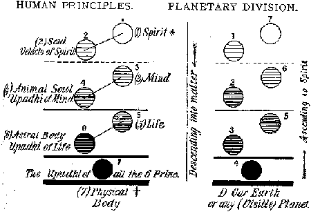
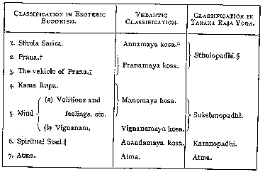

##### *The Secret Doctrine* by H. P. Blavatsky -- Vol. 1

------------------------------------------------------------------------

###### \[\[Vol. 1, Page\]\] 152 THE SECRET DOCTRINE.

\[\[This page continued from [previous section](sd1-1-07.md)\]\]

#### A FEW EARLY THEOSOPHICAL MISCONCEPTIONS CONCERNING PLANETS, ROUNDS, AND MAN.

Among the eleven Stanzas omitted\* there is one which gives a full
description of the formation of the planetary chains one after another,
after the first Cosmic and Atomic differentiation had commenced in the
primitive *Acosmism.* It is idle to speak of "laws arising when Deity
prepares to create" for (*a*) laws or rather **L**AW is eternal and
uncreated; and (*b*) that Deity is Law, and *vice versa.* Moreover, the
one eternal **L**AW unfolds everything in the (to be) manifested Nature
on a sevenfold principle; among the rest, the countless circular chains
of worlds, composed of seven globes, graduated on the four lower planes
of the world of formation (the three others belonging to the Archetypal
Universe). Out of these seven only *one*, *the lowest and the most
material of those globes*, is within our plane or means of perception,
the six others lying outside of it and being therefore invisible to the
terrestrial eye. Every such chain of worlds is the progeny and creation
of another, *lower*, and *dead* chain -- *its reincarnation*, so to say.
To make it clearer: we are told of the planets -- of which *seven only*
were held as sacred, as being ruled by the highest regents or gods, and
not at all because the ancients knew nothing of the others\*\* -- that
each of these, whether known or unknown, is a septenary, as is the chain
to which the Earth belongs (see "Esoteric

###### \[\[Footnote(s)\]\] to diagram

\* See the note which follows the Commentary on the preceding page, and
also the summary of the Stanzas in the Proem, page 22.

\*\* Many more planets are enumerated in the Secret Books than in modern
astronomical works.

------------------------------------------------------------------------

###### \[\[Vol. 1, Page\]\] 153 DESCENDING AND RE-ASCENDING STATES.

Buddhism"). For instance, all such planets as Mercury, Venus, Mars,
Jupiter, Saturn, etc., etc., or our Earth, are as visible to us as our
globe, probably, is to the inhabitants of the other planets, if any,
because they are all on the same plane; while the superior fellow-globes
of these planets are on other planes quite outside that of our
terrestrial senses. As their relative position is given further on, and
also in the diagram appended to the Comments on Verse 7 of Stanza VI., a
few words of explanation is all that is needed at present. These
invisible companions correspond curiously to that which we call "the
principles in Man." The seven are on three material planes and one
spiritual plane, answering to the three *Upadhis* (material bases) and
one spiritual vehicle (*Vahan*) of our seven principles in the human
division. If, for the sake of a clearer mental conception, we imagine
the human principles to be arranged as in the following scheme, we shall
obtain the annexed diagram of correspondences: --

**D**IAGRAM **I**.

###### \[\[Footnote(s) to diagram\]\] -------------------------------------------------

\*As we are proceeding here from Universals to Particulars, instead of
using the inductive or Aristotelean method, the numbers are reversed.
Spirit is enumerated the first instead of seventh, as is usually done,
but, in truth, *ought not to be done.*

† Or as usually named after the manner of *Esoteric Buddhism* and
others: 1, Atma; 2, Buddhi (or Spiritual Soul); 3, Manas (Human Soul);
4, Kama Rupa (Vehicle of Desires and Passions); 5, Linga Sarira; 6,
Prana; 7, Sthula Sarira.

------------------------------------------------------------------------

###### \[\[Vol. 1, Page\]\] 154 THE SECRET DOCTRINE.

The dark horizontal lines of the lower planes are the Upadhis in one
case, and the planes in the case of the planetary chain. Of course, as
regards the human principles, the diagram does not place them quite in
order, yet it shows the correspondence and analogy to which attention is
now drawn. As the reader will see, it is a case of descent into matter,
the adjustment -- in both the mystic and the physical senses -- of the
two, and their interblending for the great coming "struggle of life"
that awaits both the *entities.* "Entity" may be thought a strange term
to use in the case of a globe; but the ancient philosophers, who saw in
the earth a huge "animal," were wiser in their generation than our
modern geologists are in theirs; and Pliny, who called the Earth our
kind nurse and mother, the only element which is not inimical to man,
spoke more truly than Watts, who fancied that he saw in her the
footstool of God. For Earth is only the footstool of man in his
ascension to higher regions; the vestibule --

> ". . . . . . . to glorious mansions,  
> Through which a moving crowd for ever press."

But this only shows how admirably the occult philosophy fits everything
in Nature, and how much more logical are its tenets than the lifeless
hypothetical speculations of physical science.

Having learned thus much, the mystic will be better prepared to
understand the occult teaching, though every formal student of modern
science may, and probably will, regard it as preposterous nonsense. The
student of occultism, however, holds that the theory at present under
discussion is far more philosophical and probable than any other. It is
more logical, at any rate, than the theory recently advanced which made
of the moon the projection of a portion of our Earth extruded when the
latter was but a globe in fusion, a molten plastic mass.\*

It is said that the planetary chains having their "Days" and their

###### \[\[Footnote(s)\]\] -------------------------------------------------

\* Says the author of "Modern Science and Modern Thought," Mr. Samuel
Laing: "The astronomical conclusions are theories based on data so
uncertain, that while in some cases they give results incredibly short,
like that of 15 millions of years for the whole past process of
formation of the solar system, in others they give results almost
incredibly long, as *in that which supposes the moon to have been thrown
off when the Earth was rotating in three hours*, *while the utmost
actual retardation obtained from observation would require* 600 millions
of years to make it rotate in twenty-three hours instead of twenty-four"
(p. 48). And if physicists persist, why should the chronology of the
Hindus be laughed at as exaggerated?

------------------------------------------------------------------------

###### \[\[Vol. 1, Page\]\] 155 EXCHANGE OF LIFE-PRINCIPLES.

"Nights" -- *i.e.*, periods of activity or life, and of inertia or death
-- and behave in heaven as do men on Earth: they generate their likes,
get old, and become personally extinct, their spiritual principles only
living in their progeny as a survival of themselves.

Without attempting the very difficult task of giving out the whole
process in all its cosmic details, enough may be said to give an
approximate idea of it. When a planetary chain is in its last Round, its
Globe 1 or A, before finally *dying out*, sends all its energy and
"principles" into a neutral centre of latent force, a "laya centre," and
thereby informs a new nucleus of undifferentiated substance or matter,
*i.e.*, calls it into activity or gives it life. Suppose such a process
to have taken place in the lunar "planetary" chain; suppose again, for
argument's sake (though Mr. Darwin's theory quoted below has lately been
upset, even if the fact has not yet been ascertained by mathematical
calculation) that the moon is far older than the Earth. Imagine the six
fellow-globes of the moon -- aeons before the first globe of our seven
was evolved -- just in the same position in relation to each other as
the fellow-globes of our chain occupy in regard to our Earth now. (See
in "Esoteric Buddhism," "The Constitution of Man," and the "Planetary
Chain.") And now it will be easy to imagine further Globe A of the lunar
chain informing Globe A of the terrestrial chain, and -- dying; Globe B
of the former sending after that its energy into Globe B of the new
chain; then Globe C of the lunar, creating its progeny sphere C of the
terrene chain; then the Moon (our Satellite\*) pouring forth into

###### \[\[Footnote(s)\]\] -------------------------------------------------

\* She is the satellite, undeniably, but this does not invalidate the
theory that she has given to the Earth all but her corpse. For Darwin's
theory to hold good, besides the hypothesis just upset (vide last
footnote), other still more incongruous speculations had to be invented.
The Moon, it is said, has cooled nearly six times as rapidly as the
Earth (Winchell's "World-Life"): "The Moon, if the earth is 14,000,000
years old since its incrustation, is only eleven and two thirds millions
of years old since that stage . . ." etc. And if our Moon is but a
splash from our Earth, why can no similar inference be established for
the Moons of other planets? The Astronomers "do not know." Why should
Venus and Mercury have no satellites, and by what, when they exist, were
they formed? Because, we say, science has only one key -- the key of
matter -- to open the mysteries of nature withal, while occult
philosophy has seven keys and explains that which science fails to see.
Mercury and Venus have no satellites but they had "parents" just as the
earth had. Both are far older than the Earth and, before the latter
reaches her seventh Round, her mother Moon will have dissolved
\[\[Footnote continued on next page\]\]

------------------------------------------------------------------------

###### \[\[Vol. 1, Page\]\] 156 THE SECRET DOCTRINE.

the lowest globe of our planetary ring -- Globe D, our Earth -- all its
life, energy and powers; and, having transferred them to a new centre
becoming virtually *a dead planet*, in which rotation has almost ceased
since the birth of our globe. The Moon is now the cold residual
quantity, the shadow dragged after the new body, into which her living
powers and "principles" are transfused. She now is doomed for long ages
to be ever pursuing the Earth, to be attracted by and to attract her
progeny. Con*stantly vampirised* by her child, she revenges herself on
it by soaking it through and through with the nefarious, invisible, and
poisoned influence which emanates from the occult side of her nature.
For she is a *dead*, yet a *living body.* The particles of her decaying
corpse are full of active and destructive life, although the body which
they had formed is soulless and lifeless. Therefore its emanations are
at the same time beneficent and maleficent -- this circumstance finding
its parallel on earth in the fact that the grass and plants are nowhere
more juicy and thriving than on the graves; while at the same time it is
the graveyard or corpse-emanations, which kill. And like all ghouls or
vampires, the moon is the friend of the sorcerers and the foe of the
unwary. From the archaic aeons and the later times of the witches of
Thessaly, down to some of the present *tantrikas* of Bengal, her nature
and properties were known to every Occultist, but have remained a closed
book for physicists.

Such is the moon from the astronomical, geological, and physical
standpoints. As to her metaphysical and psychic nature it must remain an
occult secret in this work, as it was in the volume on "Esoteric
Buddhism," notwithstanding the rather sanguine statement made therein on
p. 113 (5th edition) that "there is not much mystery left now in the
riddle of the eighth sphere." These are topics, indeed, "on which the
adepts are very reserved in their communications to uninitiated pupils,"
and since they have, moreover, never sanctioned or permitted any
published speculations upon them, the less said the better.

Yet without treading upon the forbidden ground of the "eighth sphere,"
it may be useful to state some additional facts with regard to ex-monads
of the lunar chain -- the "lunar ancestors" -- as they play a

###### \[\[Footnote(s)\]\] -------------------------------------------------

\[\[Footnote continued from previous page\]\] into thin air, as the
"Moons" of the other planets have, or have not, as the case may be,
since there are planets which have *several* moons -- a mystery again
which no OEdipus of astronomy has solved.

------------------------------------------------------------------------

###### \[\[Vol. 1, Page\]\] 157 OPINIONS DIFFER AND YET AGREE.

leading part in the coming *Anthropogenesis.* This brings us directly to
the septenary constitution of man; and as some discussion has arisen of
late about the best classification to be adopted for the division of the
microcosmic entity, two systems are now appended with a view to
facilitate comparison. The subjoined short article is from the pen of
Mr. T. Subba Row, a learned Vedantin scholar. He prefers the Brahmanical
division of the Raja Yoga, and from a metaphysical point of view he is
quite right. But, as it is a question of simple choice and expediency,
we hold in this work to the "time-honoured" classification of the
trans-Himalayan "Arhat Esoteric School." The following table and its
explanatory text are reprinted from the "Theosophist" of Madras, and
they are also contained in "Five Years of Theosophy": --

SEPTENARY DIVISION IN DIFFERENT INDIAN SYSTEMS.

"We give below in a tabular form the classifications adopted by the
Buddhist and Vedantic teachers of the principles of man: --

###### \[\[Footnote(s) to table\]\]

\* Kosa (kosha) is "Sheath" literally, the sheath of every principle.

† "Life."

‡ The astral body or Linga Sarira.

§ Sthula-Upadhi, or basis of the principle.

\|\| Buddhi.

------------------------------------------------------------------------

###### \[\[Vol. 1, Page\]\] 158 THE SECRET DOCTRINE.

From the foregoing table it will be seen that the third principle in the
Buddhist classification is not separately mentioned in the Vedantic
division, as it is merely the vehicle of Prana. It will also be seen
that the Fourth principle is included in the third Kosa (Sheath), as the
same principle is but the vehicle of will-power, which is but an energy
of the mind. It must also be noticed that the Vignanamaya Kosa is
considered to be distinct from the Manomaya Kosa, as a division is made
after death between the lower part of the mind, as it were, which has a
closer affinity with the fourth principle than with the sixth; and its
higher part, which attaches itself to the latter, and which is, in fact,
the basis for the higher spiritual individuality of man.

We may also here point out to our readers that the classification
mentioned in the last column is, for all practical purposes, connected
with Raja Yoga, the best and simplest. Though there are seven principles
in man, there are but three distinct Upadhis (bases), in each of which
his Atma may work independently of the rest. These three Upadhis can be
separated by an Adept without killing himself. He cannot separate the
seven principles from each other without destroying his constitution."

The student will now be better prepared to see that between the three
Upadhis of the Raja Yoga and its Atma, and our three Upadhis, Atma, and
the additional three divisions, there is in reality but very little
difference. Moreover, as every adept in cis-Himalayan or trans-Himalayan
India, of the Patanjali, the Aryasanga or the Mahayana schools, has to
become a Raja Yogi, he must, therefore, accept the Taraka Raja
classification in principle and theory whatever classification he
resorts to for practical and occult purposes. Thus, it matters very
little whether one speaks of the *three Upadhis with their three
aspects* and Atma, the eternal and immortal synthesis, or calls them the
"seven principles."

For the benefit of those who may not have read, or, if they have, may
not have clearly understood, in Theosophical writings, the doctrine of
the septenary chains of worlds in the Solar Kosmos, the teaching is
briefly thus: --

1\. Everything in the metaphysical as in the physical Universe is
septenary. Hence every sidereal body, every planet, whether visible

------------------------------------------------------------------------

###### \[\[Vol. 1, Page\]\] 159 THE TRANSMIGRATIONS OF THE EGO.

or invisible, is credited with six companion globes. (See Diagram No. 3,
after verse 6 of this commentary.) The evolution of life proceeds on
these seven globes or bodies from the 1st to the 7th in Seven **R**OUNDS
or Seven Cycles.

2\. These globes are formed by a process which the Occultists call the
"rebirth of planetary chains (or rings)." When the seventh and last
Round of one of such rings has been entered upon, the highest or first
globe "A," followed by all the others down to the last, instead of
entering upon a certain time of rest -- or "obscuration," as in their
previous Rounds -- begins to die out. The "planetary" dissolution
(*pralaya*) is at hand, and its hour has struck; each globe has to
transfer its life and energy to another planet. (See diagram No. 2
*infra*, "The Moon and the Earth.")

3\. Our Earth, as the visible representative of its invisible superior
fellow globes, its "lords" or "principles" (see diagram No. 1), has to
live, as have the others, through seven Rounds. During the first three,
it forms and consolidates; during the fourth it settles and hardens;
during the last three it gradually returns to its first ethereal form:
it is spiritualised, so to say.

4\. Its Humanity develops fully only in the Fourth -- our present Round.
Up to this fourth Life-Cycle, it is referred to as "humanity" only for
lack of a more appropriate term. Like the grub which becomes chrysalis
and butterfly, Man, or rather that which becomes man, passes through all
the forms and kingdoms during the first Round and through all the human
shapes during the two following Rounds. Arrived on our Earth at the
commencement of the Fourth in the present series of life-cycles and
races, MAN is the first form that appears thereon, being preceded only
by the mineral and vegetable kingdoms -- even the latter *having to
develop and continue its further evolution through man.* This will be
explained in Book II. During the three Rounds to come, Humanity, like
the globe on which it lives, will be ever tending to reassume its
primeval form, that of a Dhyan Chohanic Host. Man tends to become a God
and then -- **G**OD, like every other atom in the Universe.

"Beginning so early as with the 2nd round, Evolution proceeds already on
quite a different plan. It is only during the 1st round that (heavenly)
man becomes a human being on globe A (rebecomes) a mineral, a plant, an
animal, on globe B and C, etc. The process changes

------------------------------------------------------------------------

###### \[\[Vol. 1, Page\]\] 160 THE SECRET DOCTRINE.

entirely from the second round -- but you have learned prudence . . .
and I advise you *to say nothing before the time for saying it has
come.* . ." (Extract from the Teacher's letters on various topics.)

5\. Every life-cycle on Globe D (our Earth)\* is composed of seven
root-races. They commence with the Ethereal and end with the spiritual
on the double line of physical and moral evolution -- from the beginning
of the terrestrial round to its close. (One is a "planetary round" from
Globe A to Globe G, the seventh; the other, the "globe round," or the
*terrestrial*)*.*

This is very well described in "Esoteric Buddhism" and needs no further
elucidation for the time being.

6\. The first root-race, *i.e.*, the first "men" on earth (irrespective
of form) were the progeny of the "celestial men," called rightly in
Indian philosophy the "Lunar Ancestors" or the Pitris, of which there
are seven classes or Hierarchies. As all this will be sufficiently
explained in the following sections and in Book II., no more need be
said of it here.

But the two works already mentioned, both of which treat of subjects
from the occult doctrine, need particular notice. "Esoteric Buddhism" is
too well known in Theosophical circles, and even to the outside world,
for it to be necessary to enter at length upon its merits here. It is an
excellent book, and has done still more excellent work. But this does
not alter the fact that it contains some mistaken notions, and that it
has led many Theosophists and lay-readers to form an erroneous
conception of the Secret Eastern Doctrines. Moreover it seems, perhaps,
a little too materialistic.

"**M**AN," which came later, was an attempt to present the archaic
doctrine from a more ideal standpoint, to translate some visions in and
from the Astral Light, to render some teachings partly gathered from a
Master's thoughts, but unfortunately misunderstood. This work also
speaks of the evolution of the early Races of men on Earth, and contains
some excellent pages of a philosophical character. But so far it is only
an interesting little mystical romance. It has failed in its mission,
because the conditions required for a correct translation of these
visions were not present. Hence the reader must not wonder if our
Volumes contradict these earlier descriptions in several particulars.

\[\[Footnote(s)\]\] -------------------------------------------------

\* We are not concerned with the other Globes in this work except
incidentally.

------------------------------------------------------------------------

###### \[\[Vol. 1, Page\]\] 161 A RE-ADJUSTMENT OF FACTS.

Esoteric "Cosmogony" in general, and the evolution of the human Monad
especially, differ so essentially in these two books and in other
Theosophical works written independently by *beginners*, that it becomes
impossible to proceed with the present work without special mention of
these two earlier volumes, for both have a number of admirers --
"Esoteric Buddhism" especially. The time has arrived for the explanation
of some matters in this direction. Mistakes have now to be checked by
the original teachings and corrected. If one of the said works has too
pronounced a bias toward materialistic science, the other is decidedly
too idealistic, and is, at times, fantastic.

From the doctrine -- rather incomprehensible to western minds -- which
deals with the periodical "obscurations" and successive "Rounds" of the
Globes along their circular chains, were born the first perplexities and
misconceptions. One of such has reference to the "*Fifth*-" and even
"*Sixth*-Rounders." Those who knew that a Round was preceded and
followed by a long *Pralaya*, a pause of rest which created an
impassable gulf between two Rounds until the time came for a renewed
cycle of life, could not understand the "fallacy" of talking about
"*fifth* and *sixth* Rounders" in our *Fourth* Round. Gautama Buddha, it
was held, was a Sixth-Rounder, Plato and some other great philosophers
and minds, "Fifth-Rounders." How could it be? One Master taught and
affirmed that there were such "Fifth-Rounders" even now on Earth; and
though *understood to say* that mankind was yet "in the Fourth Round,"
in another place he *seemed* to say that we were in the Fifth. To this
an "apocalyptic answer" was returned by another Teacher: -- "A few drops
of rain do not make a Monsoon, though they presage it." . . . "No, we
are not in the Fifth Round, but Fifth Round men have been coming in for
the last few thousand years." This was worse than the riddle of the
Sphinx! Students of Occultism subjected their brains to the wildest work
of speculation. For a considerable time they tried to outvie OEdipus and
reconcile the two statements. And as the Masters kept as silent as the
stony Sphinx herself, they were accused of inconsistency,
"contradiction," and "discrepancies." But they were simply allowing the
speculations to go on, in order *to teach a lesson* which the Western
mind sorely needs. In their conceit and arrogance, as in their habit of
materializing every metaphysical conception and term without allowing
any margin for Eastern

------------------------------------------------------------------------

###### \[\[Vol. 1, Page\]\] 162 THE SECRET DOCTRINE.

metaphor and allegory, the Orientalists have made a jumble of the Hindu
exoteric philosophy, and the Theosophists were now doing the same with
regard to esoteric teachings. To this day it is evident that the latter
have utterly failed to understand the meaning of the term "Fifth and
Sixth Rounders." But it is simply this: every "Round" brings about a new
development and even an entire change in the mental, psychic, spiritual
and physical constitution of man, all these principles evoluting on an
ever ascending scale. Thence it follows that those persons who, like
Confucius and Plato, belonged psychically, mentally and spiritually to
the higher planes of evolution, were in our Fourth Round as the average
man will be in the Fifth Round, whose mankind is destined to find
itself, on this scale of Evolution, immensely higher than is our present
humanity. Similarly Gautama Buddha -- Wisdom incarnate -- was still
higher and greater than all the men we have mentioned, who are called
Fifth Rounders, while Buddha and Sankaracharya are termed Sixth
Rounders, allegorically. Thence again the concealed wisdom of the
remark, pronounced at the time "evasive" -- that a few drops of rain do
not make the Monsoon, *though they presage it.*"

And now the truth of the remark made in "Esoteric Buddhism" by its
author will be fully apparent: --

"It is impossible, *when the complicated facts of an entirely unfamiliar
science are being presented to untrained minds for the first time*, to
put them forward with all their appropriate qualifications . . . and
abnormal developments. . . . We must be content to take the broad rules
first and deal with the exceptions afterwards, and especially is this
the case with study, in connection with which *the traditional methods
of teaching*, *generally followed*, *aim at impressing every fresh idea
on the memory by provoking the perplexity it at last relieves.*"

As the author of the remark was himself, as he says, "an untrained mind"
in Occultism, his own inferences, and his better knowledge of modern
astronomical speculations than of archaic doctrines led him quite
naturally, and as unconsciously to himself, to commit a few mistakes of
detail rather than of any "broad rule." One such will now be noticed. It
is a trifling one, still it is calculated to lead many a beginner into
erroneous conceptions. But as the mistaken notions of the earlier
editions were corrected in the *annotations* of the fifth edition, so
the sixth may be revised and perfected. There were several reasons

------------------------------------------------------------------------

###### \[\[Vol. 1, Page\]\] 163 LIKE QUESTIONS, LIKE ANSWERS.

for such mistakes. (1) They were due to the necessity under which the
teachers laboured of giving what were considered as "evasive answers":
the questions being too persistently pressed to be left unnoticed,
while, on the other hand, they *could only be partially answered.* (2)
This position notwithstanding, the confession that "half a loaf is
better than no bread" was but too often misunderstood and hardly
appreciated as it ought to have been. As a result thereof gratuitous
speculations were sometimes indulged in by the European lay-chelas.
Among such were (a) the "Mystery of the Eighth Sphere" in its relation
to the Moon; and (b) the erroneous statement that two of the superior
Globes of the terrestrial chain were two of our well-known planets:
"besides the Earth . . . there are *only two other worlds of our chain
which are visible*. . . . Mars and Mercury. . . ." (*Esoteric Buddhism*;
p. 136.)

This was a great mistake. But the blame for it is to be attached as much
to the vagueness and incompleteness of the Master's answer as to the
question of the learner itself, which was equally vague and indefinite.

It was asked: "What planets, of those known to ordinary science, besides
Mercury, belong to our system of worlds?" Now if by "System of Worlds"
our *terrestrial chain* or "string" was intended in the mind of the
querist, instead of the "Solar System of Worlds," as it should have
been, then of course the answer was likely to be misunderstood. For the
reply was: "Mars, etc., and four other planets of which astronomy knows
nothing. Neither A, B, nor YZ are known nor can they be seen through
physical means however perfected." This is plain: (a) Astronomy as yet
knows nothing in reality of the planets, neither the ancient ones, nor
those discovered in modern times. (b) No *companion* planets from A to
Z, *i.e.*, no upper globes of any chain in the Solar System, can be
seen.\* As to Mars, Mercury, and "the four other planets," they bear

###### \[\[Footnote(s)\]\] -------------------------------------------------

\* With the exception of course of all the planets which come *fourth*
in number, as our earth, the moon, etc., etc. Copies of all the letters
ever received or sent, with the exception of a few private ones -- "*in
which there was no teaching*" the Master says -- are with the writer. As
it was her duty, in the beginning, to answer and explain certain points
not touched upon, it is more than likely that notwithstanding the many
annotations on these copies, the writer, in her ignorance of English and
her fear of saying too much, may have bungled the information given.
*She takes the whole blame for it upon herself in any and every case.*
But it is impossible for her to allow students to remain any longer
under erroneous impressions, or to believe that the fault lies with the
esoteric system.

------------------------------------------------------------------------

###### \[\[Vol. 1, Page\]\] 164 THE SECRET DOCTRINE.

a relation to Earth of which no master or high Occultist will ever
speak, much less explain the nature.\*

Let it now be distinctly stated, then, that the theory broached is
impossible, with or without the additional evidence furnished by modern
Astronomy. Physical Science can supply corroborative, though still very
uncertain, evidence, but only as regards heavenly bodies on the same
plane of materiality as our objective Universe. Mars and Mercury, Venus
and Jupiter, like every hitherto discovered planet (or those still to be
discovered), are all, *per se*, the representatives on our plane of such
chains. As distinctly stated in one of the numerous letters of Mr.
Sinnett's "Teacher," "there are other and innumerable Manvantaric chains
of globes which bear intelligent Beings both in and outside our solar
system." But neither Mars nor Mercury belong *to our chain.* They are,
along with the other planets, septenary *Units* in the great host of
"chains" of our system, and all are as visible as their *upper* globes
are invisible.

If it is still argued that certain expressions in the Teacher's letters
were liable to mislead, the answer comes: -- Amen; so it was. The author
of "Esoteric Buddhism" understood it well when he wrote that such are
"the traditional modes of teaching . . . by provoking the perplexity" .
. . they *do*, or *do not relieve* -- as the case may be. At all events,
if it is urged that this might have been explained earlier, and the true
nature of the planets given out as they now are, the answer comes that:
"it was not found expedient to do so at the time, as it would have
opened the way to a series of additional questions *which could never be
answered on account of their esoteric nature*, and thus would only
become embarrassing." It had been declared from the first and has been
repeatedly asserted since that (1st) no Theosophist, *not even as an
accepted* *chela* -- let alone lay *students -- could expect to have the
secret teachings explained to him thoroughly and completely*, before *he
had irretrievably pledged himself to the Brotherhood and passed through
at least one initiation*, because no figures and numbers could be given
to the public, for figures and numbers are the key to the esoteric
system. (2.) That

###### \[\[Footnote(s)\]\] -------------------------------------------------

\* In this same letter the impossibility is distinctly stated: -- . . .
"Try to understand that you are putting me questions pertaining to the
highest initiation; that I can give you (only) a general view, but *that
I dare not nor will I enter upon details .* . ." wrote one of the
Teachers to the author of "Esoteric Buddhism."

------------------------------------------------------------------------

###### \[\[Vol. 1, Page\]\] 165 AN AUTHORITATIVE LETTER.

what was revealed was merely the esoteric lining of that which is
contained in almost all the exoteric Scriptures of the world-religions
-- pre-eminently in the Brahmanas, and the Upanishads of the Vedas and
even in the Puranas. It was a small portion of what is divulged far more
fully now in the present volumes; and even this is very incomplete and
fragmentary.

When the present work was commenced, the writer, feeling sure that the
speculation about Mars and Mercury was a mistake, applied to the
Teachers *by letter* for explanation and an authoritative version. Both
came in due time, and *verbatim* extracts from these are now given.

". . . . . *It is quite correct that Mars is in a state of obscuration
at present*, *and Mercury just beginning to get out of it. You might add
that* *Venus is in her last Round.* . . . . . . . . . . *If neither
Mercury nor Venus have* *satellites*, *it is because of the reasons* . .
. (vide footnote supra, where those reasons are given), *and also
because Mars has two satellites to which he has no right*. . . . .
*Phobos*, *the supposed* INNER *satellite*, *is no satellite at all. As
remarked long ago by Laplace and now by Faye* (*see* COMPTES RENDUS,
*Tome* **XC***.*, *p. 569*), *Phobos keeps a too short periodic time*,
*and therefore there* '*must exist some defect in the mother idea of the
theory*' *as Faye justly observes*. . . . . *Again*, *both* (*Mars and
Mercury*) *are septenary chains*, *as independent of the Earth*'*s
sidereal lords and superiors as you are independent of the*
'*principles*' *of Daumling* (*Tom Thumb*) -- *which were perhaps his
six brothers*, *with or without night-caps. . . . . . . . . .*
'*Gratification of curiosity is the end of knowledge for some men,' was
said by Bacon*, *who was as right in postulating this truism*, *as those
who were familiar with it before him were right in hedging off*
**WISDOM** *from Knowledge*, *and tracing limits to that which is to be
given out at one time*. . . . *Remember*: --

> '. . . . . . . . . . . knowledge dwells  
> In heads replete with thoughts of other men,  
> Wisdom in minds attentive to their own. . . .'

*You can never impress it too profoundly on the minds of those to whom
you impart some of the esoteric teachings. .* ."

Again, here are more extracts from another letter written by the same
authority. This time it is in answer to some objections laid before the
Teachers. They are based upon extremely scientific, and as

------------------------------------------------------------------------

###### \[\[Vol. 1, Page\]\] 166 THE SECRET DOCTRINE.

futile, reasonings about the advisability of trying to reconcile the
Esoteric theories with the speculations of Modern Science, and were
written by a young Theosophist as a warning against the "Secret
Doctrine" and in reference to the same subject. He had declared that if
there were such companion Earths "they must be only a wee bit less
material than our globe." How then was it that they could not be seen?
The answer was: --

". . . *. Were psychic and spiritual teachings more fully understood*,
*it would become next to impossible to even imagine such an incongruity.
Unless less trouble is taken to reconcile the irreconcileable* -- *that
is to say*, *the metaphysical and spiritual sciences with physical or
natural philosophy*, '*natural*' *being a synonym to them* (*men of
science*) *of that matter which falls under the perception of their
corporeal senses -- no progress can be really achieved. Our Globe*, *as
taught from the first*, *is at the bottom of the arc of descent*, *where
the matter of our perceptions exhibits itself in its grossest form*. . .
. . . . *Hence it only stands to reason that the globes which overshadow
our Earth must be on different and superior planes. In short*, *as
Globes*, *they are in* CO-ADUNITION *but not* IN CONSUBSTANTIALITY WITH
OUR EARTH *and thus pertain to quite another state of consciousness. Our
planet* (*like all those we see*) *is adapted to the peculiar state of
its human stock*, *that state which enables us to see with our naked eye
the sidereal bodies which are co-essential with our terrene plane and
substance*, *just as their respective inhabitants*, *the Jovians*,
*Martians and others can perceive our little world: because our planes
of consciousness*, *differing as they do in degree but being the same in
kind*, *are on the same layer of differentiated matter*. . . . . *What I
wrote was* '*The minor Pralaya concerns only our little* STRINGS OF
GLOBES.' (*We called chains* '*Strings*' *in those days of
lip-confusion.*) *.* . *.* '*To such a string our Earth belongs.' This
ought to have shown plainly that the other planets were also*
'*strings*' *or* **CHAINS***. . . If he* (*meaning the objector*) *would
perceive even the dim silhouette of one of such* '*planets*' *on the
higher planes*, *he has to first throw off even the thin clouds of the
astral matter that stands between him and the next plane*. . . . ."

It becomes patent why we could not perceive, even with the help of the
best earthly telescopes, that which is outside our world of matter.
Those alone, whom we call adepts, who know how to direct their mental
vision and to transfer their consciousness -- physical and psychic both
--

------------------------------------------------------------------------

###### \[\[Vol. 1, Page\]\] 167 PRICELESS ADVICE, NEGLECTED.

to other planes of being, are able to speak with authority on such
subjects. And they tell us plainly: --

"*Lead the life necessary for the acquisition of such knowledge and
powers*, *and Wisdom will come to you naturally. Whenever your are able
to attune your consciousness to any of the seven chords of* '*Universal
Consciousness*,' *those chords that run along the sounding-board of
Kosmos*, *vibrating from one Eternity to another; when you have studied
thoroughly* '*the music of the Spheres*,' *then only will you become
quite free to share your knowledge with those with whom it is safe to do
so. Meanwhile*, *be prudent. Do not give out the great Truths that are
the inheritance of the future Races*, *to our present generation. Do not
attempt to unveil the secret of being and non-being to those unable to
see the hidden meaning of Apollo*'*s* HEPTACHORD -- *the lyre of the
radiant god*, *in each of the seven strings of which dwelleth the
Spirit*, *Soul and Astral body of the Kosmos*, *whose shell only has now
fallen into the hands of Modern Science*. . . . . . *Be prudent*, *we
say*, *prudent and wise*, *and above all take care what those who learn
from you believe in; lest by deceiving themselves they deceive others* .
. . . . *for such is the fate of every truth with which men are*, *as
yet*, *unfamiliar*. . . . *Let rather the planetary chains and other
super-* *and sub-cosmic mysteries remain a dreamland for those who can
neither see*, *nor yet believe that others can. .* . ."

It is to be regretted that few of us have followed the wise advice; and
that many a priceless pearl, many a jewel of wisdom, has been cast to an
enemy unable to understand its value and who has turned round and rent
us.

" '*Let us imagine*,' wrote the same Master to his two 'lay chelas,' as
he called the author of 'Esoteric Buddhism' and another gentleman, his
co-student for some time -- '*let us imagine* THAT OUR EARTH IS ONE OF A
GROUP OF SEVEN PLANETS OR MAN-BEARING WORLDS. . . . . . (*The* SEVEN
*planets are the sacred planets of antiquity*, *and are all septenary.*)
*Now the life-impulse reaches A*, *or rather that which is destined to
become A*, *and which so far is but cosmic dust* (a "laya centre") . .
*etc.*' "

In these early letters, in which the terms had to be invented and words
coined, the "Rings" very often became "Rounds," and the "Rounds"
life-cycles, and *vice versa.* To a correspondent who called a "Round" a
"World-Ring," the Teacher wrote: "I believe this will lead to a further
confusion. A Round we are agreed to call the passage

------------------------------------------------------------------------

###### \[\[Vol. 1, Page\]\] 168 THE SECRET DOCTRINE.

of a monad from Globe A to Globe G or Z. . . The 'World-Ring' is
correct. . . Advise Mr. . . . strongly, to agree upon a nomenclature
before going any further. . . "

Notwithstanding this agreement, many mistakes, owing to this confusion,
crept into the earliest teachings. The Races even were occasionally
mixed up with the "Rounds" and "Rings," and led to similar mistakes in
"Man." From the first the Master had written --

"Not being permitted to give you *the whole truth*, or divulge the
number of isolated fractions . . . I am unable to satisfy you."

This in answer to the questions, "If we are right, then the total
existence prior to the man-period is 637," etc., etc. To all the queries
relating to figures, the reply was, "Try to solve the problem of 777
incarnations. . . . *Though I am obliged to withhold information* . . .
*yet if you should work out the problem by yourself*, *it will be my
duty to tell you so*."

But they never were so worked out, and the results were -- never-ceasing
perplexity and mistakes.

Even the teaching about the Septenary constitution of the sidereal
bodies and of the macrocosm -- from which the septenary division of the
microcosm, or Man -- has until now been among the most esoteric. In
olden times it used to be divulged only at the Initiation and along with
the most sacred figures of the cycles. Now, as stated in one of the
Theosophical journals,\* the revelation of the whole system of Cosmogony
had not been contemplated, nor even thought for one moment possible, at
a time when a few bits of information were sparingly given out in answer
to letters written by the author of "Esoteric Buddhism," in which he put
forward a multiplicity of questions. Among these were questions on such
problems *as no* **MASTER**, *however high and independent he might be*,
*would have the right to answer*, *thus divulging to the world the most
time-honoured and archaic of the mysteries of the ancient
college-temples.* Hence only a few of the doctrines were revealed in
their broad outlines, while details were constantly withheld, and all
the efforts made to elicit more information about them were
systematically eluded from the beginning. This is perfectly natural. Of
the four Vidyas -- out of the seven branches of Knowledge mentioned in
the Puranas -- namely, "Yajna-Vidya" (the performance of religious rites
in order to

###### \[\[Footnote(s)\]\] -------------------------------------------------

\* "Lucifer," May, 1888.

------------------------------------------------------------------------

###### \[\[Vol. 1, Page\]\] 169 THE SEVEN BRANCHES OF THE TREE OF KNOWLEDGE.

produce certain results); "Maha-Vidya," the great (Magic) knowledge, now
degenerated into Tantrika worship; "Guhya-Vidya," the science of Mantras
and their true rhythm or chanting, of mystical incantations, etc. -- it
is only the last one, "Atma-Vidya," or the true *Spiritual* and *Divine
wisdom*, which can throw absolute and final light upon the teachings of
the three first named. Without the help of Atma-Vidya, the other three
remain no better than *surface* sciences, geometrical magnitudes having
length and breadth, but no thickness. They are like the soul, limbs, and
mind of a sleeping man: capable of mechanical motions, of chaotic dreams
and even sleep-walking, of producing visible effects, but stimulated by
instinctual not intellectual causes, least of all by fully conscious
spiritual impulses. A good deal can be given out and explained from the
three first-named sciences. But unless the key to their teachings is
furnished by Atma-Vidya, they will remain for ever like the fragments of
a mangled text-book, like the adumbrations of great truths, dimly
perceived by the most spiritual, but distorted out of all proportion by
those who would nail every shadow to the wall.

Then, again, another great perplexity was created in the minds of
students by the incomplete exposition of the doctrine of the evolution
of the Monads. To be fully realised, both this process and that of the
birth of the Globes must be examined far more from their metaphysical
aspect than from what one might call a statistical standpoint, involving
figures and numbers which are rarely permitted to be broadly used.
Unfortunately, there are few who are inclined to handle these doctrines
only metaphysically. Even the best of the Western writers upon our
doctrine declares in his work that "on pure metaphysics of that sort we
are not now engaged," when speaking of the evolution of the Monads
("Esoteric Buddhism," p. 46). And in such case, as the Teacher remarks
in a letter to him, "Why this preaching of our doctrines, all this
uphill work and swimming *in adversum flumen?* Why should the West . . .
learn . . . from the East . . . that which can never meet the
requirements of the special tastes of the aesthetics?" And he draws his
correspondent's attention "to the formidable difficulties encountered by
us (the Adepts) in every attempt we make to explain our metaphysics to
the Western mind."

And well he may; for *outside* of metaphysics no occult philosophy, no
esotericism is possible. It is like trying to explain the aspirations
and affections, the love and hatred, the most private and sacred
workings in

------------------------------------------------------------------------

###### \[\[Vol. 1, Page\]\] 170 THE SECRET DOCTRINE.

the soul and mind of the living man, by an anatomical description of the
chest and brain of his dead body.

Let us now examine two tenets mentioned above and hardly alluded to in
"Esoteric Buddhism," and supplement them as far as lies in our power.

---------------------

\[\[This page continued in next section\]\]

------------------------------------------------------------------------

[Next Section](sd1-1-09.md)

[Contents](sd1-0-co.md)
