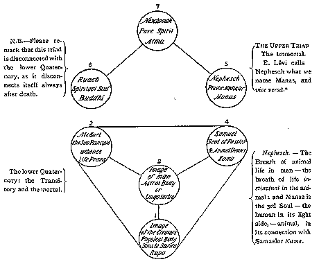

##### *The Secret Doctrine* by H. P. Blavatsky -- Vol. 1

------------------------------------------------------------------------

###### \[\[Vol. 1, Page\]\] 238 THE SECRET DOCTRINE.

#### STANZA VII. -- *Continued.*

\(5\) **T**HE SPARK HANGS FROM THE FLAME BY THE FINEST THREAD OF
**F**OHAT. **I**T JOURNEYS THROUGH THE **S**EVEN **W**ORLDS OF **M**AYA
(*a*). **I**T STOPS IN THE FIRST (*Kingdom*), AND IS A METAL AND A
STONE; IT PASSES INTO THE SECOND (*Kingdom*), AND BEHOLD -- A PLANT; THE
PLANT WHIRLS THROUGH SEVEN FORMS AND BECOMES A SACRED ANIMAL; (*the
first shadow of the physical man*) (*b*)*.*

**F**ROM THE COMBINED ATTRIBUTES OF THESE, MANU (*man*), THE THINKER, IS
FORMED.

**W**HO FORMS HIM? **T**HE SEVEN LIVES; AND THE ONE LIFE (*c*)*.*
**W**HO COMPLETES HIM? **T**HE FIVEFOLD **L**HA. AND WHO PERFECTS THE
LAST BODY? **F**ISH, SIN, AND SOMA (*the moon*) (*d*)*.*

(*a*) The phrase "through the seven Worlds of Maya" refers here to the
seven globes of the planetary chain and the seven rounds, or the 49
stations of active existence that are before the "Spark" or Monad, at
the beginning of every "Great Life-Cycle" or Manvantara. The "thread of
Fohat" is the thread of life before referred to.

This relates to the greatest problem of philosophy -- the physical and
substantial nature of life, the independent nature of which is denied by
modern science because that science is unable to comprehend it. The
reincarnationists and believers in Karma alone dimly perceive that the
whole secret of Life is in the unbroken series of its manifestations:
whether in, or apart from, the physical body. Because if --

> "Life, like a dome of many-coloured glass,  
> Stains the white radiance of Eternity" --

yet it is itself part and parcel of that Eternity; for life alone can
understand life.

What is that "Spark" which "hangs from the flame?" It is **J**IVA, the
MONAD in conjunction with MANAS, or rather its aroma -- that which
remains from each personality, when worthy, and hangs from Atma-Buddhi,
the Flame, by the thread of life. In whatever way interpreted, and into
whatever number of principles the human being is divided, it may easily
be shown that this doctrine is supported by all the ancient

------------------------------------------------------------------------

###### \[\[Vol. 1, Page\]\] 239 CHALDEAN METAPHYSICS.

religions, from the Vedic to the Egyptian, from the Zoroastrian to the
Jewish. In the case of the last-mentioned, the Kabalistic works offer
abundant proof of this statement. The entire system of the Kabalistic
numerals is based on the divine septenary hanging from the Triad (thus
forming the *Decade*) and its permutations 7, 5, 4, and 3, which,
finally, all merge into the ONE itself: an endless and boundless Circle.

"The Deity (the ever Invisible Presence)," says the Zohar, "manifests
itself through the *ten* Sephiroth which are its radiating witnesses.
The Deity is like the Sea from which outflows a stream called WISDOM,
the waters of which fall into a lake named Intelligence. From the basin,
like seven channels, issue the Seven Sephiroth. . . . . For *ten equal
seven:* the Decade contains *four* Unities and *three* Binaries." The
ten Sephiroth correspond to the limbs of MAN. "When I framed Adam
Kadmon," the Elohim are made to say, "the Spirit of the Eternal shot out
of his Body like a sheet of lightning that radiated at once on the
billows of the *Seven* millions of skies, and my *ten* splendours were
his limbs." But neither the Head nor the shoulders of Adam-Kadmon can be
seen; therefore we read in the *Sephra Dzenioutha* (the "Book of the
Concealed Mystery"): --

"In the beginning of Time, after the Elohim (the "Sons of Light and
Life," or the "Builders") had shaped out of the eternal Essence the
Heavens and the Earth, they formed the worlds six by six, the seventh
being *Malkuth*, which is our Earth (see *Mantuan Codex*) on its plane,
and the lowest on all the other planes of conscious existence. The
Chaldean *Book of Numbers* contains a detailed explanation of all this.
"The first triad of the body of Adam Kadmon (the three upper planes of
the seven\*) cannot be seen before the soul stands in the presence of
the Ancient of Days." The Sephiroth of this upper triad are: -- "1,
*Kether* (the Crown) represented by the brow of Macroprosopos; 2,
*Chochmah* (Wisdom, a male Principle) by his right shoulder; and 3,
*Binah* (Intelligence, a female Principle) by the left shoulder." Then
come the *seven* limbs (or Sephiroth) on the planes of manifestation,
the totality of these four planes being represented by *Microprosopus*
(the

###### \[\[Footnote(s)\]\] -------------------------------------------------

\* The formation of the "living Soul" or man, would render the idea more
clearly. "A Living Soul" is a synonym of man in the Bible. These are our
seven "Principles."

------------------------------------------------------------------------

###### \[\[Vol. 1, Page\]\] 240 THE SECRET DOCTRINE.

lesser Face) or Tetragrammaton, the "four-lettered" Mystery. "The seven
manifested and the *three* concealed limbs are the Body of the Deity."

Thus our Earth, *Malkuth*, is both the *Seventh* and the *Fourth* world,
the former when counting from the first globe above, the latter if
reckoned by the planes. It is generated by the sixth globe or Sephiroth
called *Yezod*, "foundation," or as said in the Book of Numbers "by
Yezod, He (Adam Kadmon) fecundates the primitive Heva" (Eve or our
Earth). Rendered in mystic language this is the explanation why Malkuth,
called "the inferior Mother," Matrona, Queen, and the Kingdom of the
Foundation, is shown as the *Bride* of Tetragrammaton or Microprosopus
(the 2nd Logos) the Heavenly Man. When free from all impurity she will
become united with the Spiritual *Logos*, *i.e.*, in the 7th Race of the
7th Round -- after the regeneration, on the day of "**S**ABBATH." For
the "*seventh* day" has again an occult significance undreamt of by our
theologians.

"When Matronitha, the Mother, is separated and brought face to face with
the King, in the excellence of the Sabbath, all things become one body,"
says verse 746, in chapter xxii. of "Ha Idra Zuta Kadisha." "Becomes one
body" means that all is reabsorbed once more into the one element, the
spirits of men becoming *Nirvanees* and the elements of everything else
becoming again what they were before -- *protyle* or undifferentiated
substance. "Sabbath" means *rest* or Nirvana. It is not the *seventh*
day after *six* days but a period the duration of which equals that of
the seven "days" or any period made up of seven parts. Thus a *pralaya*
is equal in duration to the manwantara, or a night of Brahma is equal to
this "day." If the Christians will follow Jewish customs they ought to
adopt the spirit and not the dead letter thereof: *i.e.*, to work one
week of seven days and *rest* seven days. That the word "Sabbath" had a
mystic significance is shown in the contempt shown by Jesus for the
Sabbath day, and by what is said in Luke xviii. 12. Sabbath is there
taken *for the whole week.* (See Greek text where the week is called
*Sabbath.* "I fast twice in the Sabbath.") Paul, an Initiate, knew it
well when referring to the eternal rest and felicity in heaven, as
Sabbath; "and their happiness will be eternal, for they will ever be
(*one*) with the Lord and will enjoy *an eternal Sabbath.*" (Hebrew iv.
2.)

------------------------------------------------------------------------

###### \[\[Vol. 1, Page\]\] 241 THE TRUE AND THE FALSE KABALA.

The difference between the two systems, taking the Kabala as contained
in the Chaldean *Book of Numbers*, not as misrepresented by its now
disfigured copy, the Kabala of the Christian mystics --the Kabala and
the archaic esoteric Vidya, is very small indeed, being confined to
unimportant divergences of form and expression. Thus Eastern occultism
refers to our earth as the fourth world, the lowest of the chain, above
which run upward on both its sides the six globes, three on each side.
*The Zohar*, on the other hand, calls the earth the lower, or the
*Seventh*, adding that upon the six depend all things which are in it,
"Microprosopus." The "smaller face," smaller because manifested and
finite, "is formed of *six Sephiroth*," says the same work. "Seven kings
come and *die in the thrice*-*destroyed world*" -- (Malkuth our earth,
destroyed after each of the three rounds which it has gone through).
"And their reign (of the seven kings) will be broken up." (*Book of
Numbers*, 1. viii., 3.) This relates to the Seven Races, five of which
have already appeared, and two more have still to appear in this Round.

The Shinto allegorical accounts of Cosmogony and the origin of man in
Japan hint at the same belief.

Captain C. Pfoundes studied for nearly nine years in the monasteries of
Japan the religion underlying the various sects of the land. . . . . .
"The Shinto idea of creation," he says, "is as follows: Out of chaos
(*Konton*) the earth (*in*) was the sediment precipitated, and the
Heavens (*yo*) the ethereal essences which ascended: *Maa* (*jin*)
appeared between the two. The first man was called Kuni-to ko
tatchi-no-mikoto, and *five other names were given to him*, and then the
human race appeared, male and female. Isanagi and Isanami begat
*Tenshoko doijin*, the first of the five gods of the Earth." These
"gods" are simply our five races, Isanagi and Isanami being the two
kinds of the "ancestors," the two preceding races which give birth to
animal and to rational man.

It will be shown (Vol. II. Pt. II.) that the number seven, as well as
the doctrine of the septenary constitution of man, was pre-eminent in
all the secret systems. It plays as important a part in Western Kabala
as in Eastern Occultism. Eliphas Levi calls the number seven "the key to
the Mosaic creation and the symbols of every religion." He shows the
Kabala following faithfully even the septenary division of man, as the
diagram he gives in his "*Clef des Grands Mysteres*" is septenary. This

------------------------------------------------------------------------

###### \[\[Vol. 1, Page\]\] 242 THE SECRET DOCTRINE.

may be seen at a glance on page 389, "*Une prophetic et diverses pensees
de Paracelse*," however cleverly the correct thought is veiled. One
needs also only to look at the diagram (Plate VII. in Mr. Mathers'
Kabala) "the formation of the Soul"\* from the same "Key of the Great
Mysteries" by Levi to find the same, though with a different
interpretation.

Thus it stands with both the Kabalistic and the Occult names attached:
--

###### \[\[Footnote(s) to diagram\]\] -------------------------------------------------

\* Nephesch is the "breath of (animal) life" breathed into Adam, the man
of dust; it is consequently the *Vital Spark*, the informing element.
Without *Manas*, or what is miscalled in Levi's diagram Nephesch instead
of Manas, "the reasoning Soul," or mind, Atma-Buddhi are irrational on
this plane and cannot act. It is Buddhi which is the plastic mediator,
not Manas, "the intelligent medium between the upper Triad and the lower
Quaternary." But there are many such strange and curious transformations
to be found in the Kabalistic works -- a convincing proof that its
literature has become a sad jumble. We do not accept the classification
except in this one particular, in order to show the points of agreement.

------------------------------------------------------------------------

###### \[\[Vol. 1, Page\]\] 243 OCCULT AND KABALISTIC DOCTRINES.

We will now give in tabular form what the very cautious Eliphas Levi
says in explanation of his diagram, and what the Esoteric Doctrine
teaches -- and compare the two. Levi, too, makes a distinction between
Kabalistic and Occult Pneumatics. (See "*Histoire de la Magic*," pp.
388, 389.)

\[\[first column\]\]

Says Eliphas Levi, the Kabalist: --

**K**ABALISTIC **P**NEUMATICS.

1\. The Soul (or EGO) is a clothed light; and this light is triple.  
2. *Neschamah* -- "pure Spirit."  
3. *Ruach* -- the Soul or Spirit.  
4. *Nephesch* -- plastic mediator.\*\*  
5. The garment of the Soul is the rind (body) of the image (astral
Soul).  
6. The image is double, because it reflects the good as the bad.  
7. Imago, body.

-------

**O**CCULT **P**NEUMATICS.

*As given by Eliphas Levi.*

1\. *Nephesh* is immortal because it renews its life by the destruction
of forms.  
\[But *Nephesh*, the "breath of

\[\[first column continued on next page\]\]

\[\[second column\]\]

Say the Theosophists: --

**E**SOTERIC **P**NEUMATICS.

1\. Ditto, for it is Atma-Buddhi-*Manas.*  
2. Ditto.\*  
3. Spiritual Soul.  
4. Mediator between Spirit and its Man, the Seat of Reason, the Mind, in
man.  
5. Correct.  
6. Too uselessly apocalyptic. Why not say that the *astral* reflects the
good as well as the bad man; man, who is ever tending to the upper
triangle, or else disappears with the Quaternary.  
7. Ditto, the earthly image.

-------

**O**CCULT **P**NEUMATICS.

*As given by the Occultists.*

1\. *Manas* is immortal, because after every new incarnation it adds to
Atma-Buddhi something of itself, and

\[\[second column continued on next page\]\]

###### \[\[Footnote(s)\]\] -------------------------------------------------

\* Eliphas Levi has, whether purposely or otherwise, confused the
numbers: with us his No. 2 is No. 1. (Spirit); and by making of Nephesch
both the plastic mediator and Life, he thus makes in reality only six
principles, because he repeats the first two.

\*\* Esotericism teaches the same. But Manas is not Nephesch; nor is the
latter the astral, but the 4th principle, if also the 2nd *prana*, for
Nephesch is the "breath of life" in man, as in beast or insect, of
physical, material life, which has no spirituality in it.

------------------------------------------------------------------------

###### \[\[Vol. 1, Page\]\] 244 THE SECRET DOCTRINE.

\[\[first column continued from last page\]\]

life," is a misnomer and a useless puzzle to the student.\]  
2. *Ruach* progresses by the evolution of ideas (! ?).  
3. *Neschamah* is progressive without oblivion and destruction.  
4. The soul has three dwellings.  
5. These dwellings are: the plane of the mortals: the Superior Eden; and
the Inferior Eden.  
6. The image (man) is a sphinx that offers the riddle of birth.  
7. The fatal image (the astral) endows Nephesch with its aptitudes; but
Ruach is able to substitute for this (vitiated) Nephesch the image

\[\[first column continued on next page\]\]

\[\[second column continued from last page\]\]

thus, assimilating itself to the Monad, shares its immortality.  
2. *Buddhi* becomes conscious by the accretions it gets from Manas after
every new incarnation and the death of man.  
3. *Atma* neither progresses, forgets, nor remembers. It does not belong
to this plane: it is but the ray of light eternal which shines upon and
through the darkness of matter -- when the latter is willing.  
4. The Soul (collectively, as the upper Triad) lives on three planes,
besides its fourth, the terrestrial sphere; and it *exists* eternally on
the highest of the three.  
5. These dwellings are: Earth for the physical man, or the animal Soul;
Kama-loka (Hades, the Limbo) for the disembodied man, or his *Shell;*
Devachan for the higher Triad.  
6. Correct.  
7. The astral through Kama (desire) is ever drawing Manas down into the
sphere of material passions and desires. But if the *better* man

\[\[second column continued on next page\]\]

------------------------------------------------------------------------

###### \[\[Vol. 1, Page\]\] 245 OCCULTISTS AND KABALISTS DIFFER.

\[\[first column continued from last page\]\]

conquered in accordance with the inspirations of *Neschamah.*

-------

\[\[second column continued from last page\]\]

or *Manas* tries to escape the fatal attraction and turns its
aspirations to Atma -- Spirit -- then Buddhi (Ruach) conquers, and
carries Manas with it to the realm of eternal Spirit.

-------

It is very evident that the French Kabalist either did not know
sufficiently the real tenet, or distorted it to suit himself and his
object. Thus he says again, treating upon the same subject, and we,
Occultists, answer the late Kabalist and his admirers: --

\[\[first column\]\]

1\. The body is the mould of Nephesch; Nephesch the mould of Ruach;
Ruach the mould *of* *the garments of Neschamah.*  
2. Light (the Soul) personifies in clothing itself (with a body); and
personality endures only when the garment is perfect.  
3. The angels aspire to become men; a perfect man, a man-god is above
all the angels.  
4. Every 14,000 years the soul rejuvenates and rests in the jubilean
sleep of oblivion.

\[\[second column\]\]

1\. The body follows the whims, good or bad, of *Manas;* Manas tries to
follow the light of Buddhi, but often fails. Buddhi is the mould of the
"garments" of Atma, because Atma is no body, or shape, or anything, and
because Buddhi is its vehicle only *figuratively.*  
2*.* The Monad becomes a personal ego when it incarnates; and something
remains of that personality through Manas, when the latter is perfect
enough to assimilate Buddhi.  
3. Correct.  
4. Within a period, "a great age" or a day of Brahrna, 14 Manus reign;
after which comes Pralaya when all the Souls rest in Nirvana. (Souls =
Egos).

------------------------------------------------------------------------

###### \[\[Vol. 1, Page\]\] 246 THE SECRET DOCTRINE.

Such are the distorted copies of the esoteric doctrine in the Kabala.
But see also "The Primeval Manus of Humanity" in Book II.

To return to Stanza VII.

(*b*) The well-known Kabalistic aphorism runs: -- "A stone becomes a
plant; a plant, a beast; the beast, a man; a man a spirit; and the
spirit a god." The "spark" animates all the kingdoms in turn before it
enters into and informs divine man, between whom and his predecessor,
animal man, there is all the difference in the world. Genesis begins its
anthropology at the wrong end (evidently for a blind) and lands
nowhere.\* Had it begun as it ought, one would have found in it, first,
the celestial Logos, the "Heavenly Man," which evolves as a Compound
Unit of Logoi, out of whom after their pralayic sleep -- a sleep that
gathers the cyphers scattered on the Mayavic plane into One, as the
separate globules of quicksilver on a plate blend into one mass -- the
Logoi appear in their totality as the first "male and female" or Adam
Kadmon, the "Fiat Lux" of the Bible, as we have already seen. But this
transformation did not take place on our Earth, nor on any material
plane, but in the Spacial Depths of the first differentiation of the
eternal Root-matter. On our nascent globe things proceed differently.
The Monad or Jiva, as said in "Isis Unveiled," vol. i., p. 302, is,
first of all, shot down by the law of Evolution into the lowest form of
matter -- the mineral. After a sevenfold gyration encased in the stone
(or that which will become mineral and stone in the Fourth Round), it
creeps out of it, say, as a lichen. Passing thence, through all the
forms of vegetable matter, into what is termed animal matter, it has now
reached the point in which it has become the germ, so to speak, of the

###### \[\[Footnote(s)\]\] -------------------------------------------------

\* The introductory chapters of Genesis were never meant to represent
even a remote allegory of the creation of our Earth. They embrace a
metaphysical conception of some indefinite period in the eternity, when
successive attempts were being made by the law of evolution at the
formation of universes. The idea is plainly stated in the Zohar: "There
were old worlds, which perished as soon as they came into existence,
were formless, and were called Sparks. Thus, the smith, when hammering
the iron, lets the sparks fly in all directions. The sparks are the
primordial worlds, which could not continue because the *Sacred Aged*
(Sephira) had not as yet assumed its form (of androgyne, or opposite
sexes) of King and Queen (Sephira and Kadmon), and the Master was not
yet at his work." See Zohar, "Idra Suta," Book iii., p. 292, *b.* The
Supreme consulting with the Architect of the world -- his Logos -- about
creation. ("Isis Unveiled," vol. ii., p. 421.)

------------------------------------------------------------------------

###### \[\[Vol. 1, Page\]\] 247 SPIRIT ALONE IS HELPLESS ON EARTH.

animal, that will become the physical man. All this, up to the Third
Round, is formless, as matter, and senseless, as consciousness. For the
Monad or Jiva *per se* cannot be even called spirit: it is a ray, a
breath of the **A**BSOLUTE, or the Absoluteness rather, and the Absolute
Homogeneity, having no relations with the conditioned and relative
finiteness, is unconscious on our plane. Therefore, besides the material
which will be needed for its future human form, the monad requires (*a*)
a spiritual model, or prototype, for that material to shape itself into;
and (*b*) an intelligent consciousness to guide its evolution and
progress, neither of which is possessed by the homogeneous monad, or by
senseless though living matter. The Adam of dust requires the *Soul of
Life* to be breathed into him: the two middle principles, which are the
*sentient* life of the irrational animal and the Human Soul, for the
former is irrational without the latter. It is only when, from a
potential androgyne, man has become separated into male and female, that
he will be endowed with this conscious, rational, individual Soul,
(*Manas*) "the principle, or the intelligence, of the Elohim," to
receive which, he has to eat of the fruit of Knowledge from the Tree of
Good and Evil. How is he to obtain all this? The Occult doctrine teaches
that while the monad is cycling on downward into matter, these very
Elohim -- or Pitris, the lower Dhyan-Chohans -- are evolving *pari
passu* with it on a higher and more spiritual plane, descending also
relatively into matter on their own plane of consciousness, when, after
having reached a certain point, they will meet the incarnating senseless
monad, encased in the lowest matter, and blending the two potencies,
Spirit and Matter, the union will produce that terrestrial symbol of the
"Heavenly Man" in space -- PERFECT MAN. In the Sankhya philosophy,
Purusha (spirit) is spoken of as something impotent unless he mounts on
the shoulders of Prakriti (matter), which, left alone, is -- senseless.
But in the secret philosophy they are viewed as graduated. Though one
and the same thing in their origin, Spirit and Matter, when once they
are on the plane of differentiation, begin each of them their
evolutionary progress in contrary directions -- Spirit falling gradually
into matter, and the latter ascending to its original condition, that of
a pure spiritual substance. Both are inseparable, yet ever separated. In
polarity, on the physical plane, two like poles will always repel each
other, while the negative and the positive are mutually attracted, so do
Spirit and Matter stand to each other -- the two poles of the same
homogeneous substance, the root-principle of the universe.

------------------------------------------------------------------------

###### \[\[Vol. 1, Page\]\] 248 THE SECRET DOCTRINE.

Therefore, when the hour strikes for Purusha to mount on Prakriti's
shoulders for the formation of the Perfect Man -- rudimentary man of the
first 2 1/2 Races being only the *first*, gradually evolving into *the
most perfect of mammals* -- the Celestial "Ancestors" (Entities from
preceding worlds, called in India the Sishta) step in on this our plane,
as the Pitris had stepped in before them for the formation of the
physical or animal-man, and incarnate in the latter. Thus the two
processes -- for the two *creations:* the animal and the divine man --
differ greatly. The Pitris shoot out from their ethereal bodies, still
more ethereal and shadowy similitudes of themselves, or what we should
now call "doubles," or "astral forms," in their own likeness.\* This
furnishes the Monad with its first dwelling, and blind matter with a
model around and upon which to build henceforth. But *Man is still
incomplete.* From Swayambhuva Manu (in Manu, Book I.), from whom
descended the seven primitive Manus or Prajapati, each of whom gave
birth to a primitive race of men, down to the Codex Nazareus, in which
Karabtanos or Fetahil (blind concupiscent matter) begets on his Mother,
"Spiritus," seven figures, each of which stands as the progenitor of one
of the primaeval seven races -- this doctrine has left its impress on
every Archaic Scripture.

"Who forms Manu (the Man) and who forms his body? The **L**IFE and the
**L**IVES. Sin\*\* and the MOON." Here Manu stands for the spiritual,
heavenly man, the real and non-dying **E**GO in us, which is the direct
emanation of the "One Life" or the Absolute Deity. As to our outward
physical bodies, the house of the tabernacle of the Soul, the Doctrine
teaches a strange lesson; so strange that unless thoroughly explained
and as rightly comprehended, it is only the exact Science of the future
that is destined to vindicate the theory fully.

It has been stated before now that Occultism does not accept anything
inorganic in the Kosmos. The expression employed by Science, "inorganic
substance," means simply that the latent life slumbering in the
molecules of so-called "inert matter" is incognizable. **A**LL IS
**L**IFE, and every atom of even mineral dust is a **L**IFE, though
beyond our comprehension and perception, because it is outside the range
of the

###### \[\[Footnote(s)\]\] -------------------------------------------------

\* Read in Isis, vol. ii., pp. 297-303, the doctrine of the Codex
Nazaraeus -- every tenet of our teaching is found there under a
different form and allegory.

\*\* The word "Sin" is curious, but has a particular Occult relation to
the Moon, besides being its Chaldean equivalent.

------------------------------------------------------------------------

###### \[\[Vol. 1, Page\]\] 249 MATTER, LIFE AND SUBSTANCE.

laws known to those who reject Occultism. "The very Atoms," says
Tyndall, "seem instinct with a desire for life." Whence, then, we would
ask, comes the tendency "to run into organic form"? Is it in any way
explicable except according to the teachings of Occult Science?

"*The worlds*, *to the profane*," *says a Commentary*, "*are built up of
the known Elements.* *To the conception of an Arhat*, *these Elements
are themselves collectively a divine Life; distributively*, *on the
plane of manifestations*, *the numberless and countless crores of
lives.\* Fire alone is* ***ONE***, *on the plane of the One*

###### \[\[Footnote(s)\]\] -------------------------------------------------

\* Is Pasteur unconsciously taking the first step toward Occult Science
in declaring that, if he dared express his full idea upon this subject,
he would say that the Organic cells are endowed with a vital potency
that does not cease its activity with the cessation of a current of
Oxygen towards them, and does not, on that account, break off its
relations with life itself, which is supported by the influence of that
gas? "I would add," goes on Pasteur, "that the evolution of the germ is
accomplished by means of complicated phenomena, among which we must
class processes of fermentation"; and life, according to Claude Bernard
and Pasteur, is nothing else than a process of fermentation. That there
exist in Nature Beings or Lives that can live and thrive without air,
even on our globe, was demonstrated by the same men of science. Pasteur
found that many of the lower lives, such as Vibriones, and some microbes
and bacteria, could exist without air, which, on the contrary, killed
them. They derived the oxygen necessary for their multiplication from
the various substances that surround them. He calls them *AErobes*,
living on the tissues of our matter when the latter has ceased to form a
part of an integral and living whole (then called very unscientifically
by science "dead matter"), and *Anaerobes.* The one kind binds oxygen,
and contributes vastly to the destruction of animal life and vegetable
tissues, furnishing to the atmosphere materials which enter later on
into the constitution of other organisms; the other destroys, or rather
annihilates finally, the so-called organic substance; ultimate decay
being impossible without their participation. Certain germ-cells, such
as those of yeast, develop and multiply in air, but when deprived of it,
they will adapt themselves to life without air and become ferments,
absorbing oxygen from substances coming in contact with them, and
thereby ruining the latter. The cells in fruit, when lacking free
oxygen, act as ferments and stimulate fermentation. "Therefore the
vegetable cell manifests in this case its life as an anaerobic being.
Why, then, should an organic cell form in this case an exception"? asks
Professor Bogolubof. Pasteur shows that in the substance of our tissues
and organs, the cell, not finding sufficient oxygen for itself,
stimulates fermentation in the same way as the fruit-cell, and Claude
Bernard thought that Pasteur's idea of the formation of ferments found
its application and corroboration in the fact that Urea increases in the
blood during strangulation: **L**IFE therefore is everywhere in the
Universe, and, Occultism teaches us, it is also in the atom. Also see
*infra*, at the close of this Section.

------------------------------------------------------------------------

###### \[\[Vol. 1, Page\]\] 250 THE SECRET DOCTRINE.

*Reality: on that* *of manifested*, *hence illusive*, *being*, *its
particles are fiery lives which live and have their being at the expense
of every other life that they consume. Therefore they are named the*
"**DEVOURERS***.*" *. . .* "*Every visible thing in this Universe was
built by such* **LIVES**, *front conscious and divine primordial man
down to the unconscious agents that construct matter.*" *.* . . "*From
the* **ONE LIFE** *formless and Uncreate*, *proceeds the Universe of
lives. First was manifested from the Deep* (*Chaos*) *cold luminous
fire* (*gaseous light?*) *which formed the curds in Space.*"
(*Irresolvable nebulae*, *perhaps?*). . . . . . ." . . . *These fought*,
*and a great heat was developed by the encountering and collision*,
*which produced rotation. Then came the first manifested* **MATERIAL**,
*Fire*, *the hot flames*, *the wanderers in heaven* (*comets*)*; heat
generates moist vapour; that forms solid water* (*?*)*; then dry mist*,
*then liquid mist*, *watery*, *that puts out the luminous brightness of
the pilgrims* (*comets?*) *and forms solid watery wheels* (**MATTER**
*globes*)*. Bhumi* (*the Earth*) *appears with six sisters.\* These
produce by their continuous motion the inferior fire*, *heat*, *and an
aqueous mist*, *which yields the third World*-*Element* -- **WATER***;
and from the breath of all* (*atmospheric*) **AIR** *is born. These four
are the four lives of the first four periods* (*Rounds*) *of Manvantara.
The three last will follow.*"

This means that every new Round develops one of the Compound Elements,
as now known to Science, -- which rejects the primitive nomenclature,
preferring to subdivide them into constituents. If Nature is the
"Ever-becoming" on the manifested plane, then those Elements are to be
regarded in the same light: they have to evolve, progress, and increase
to the Manvantaric end. Thus the First Round, we are taught, developed
but one Element, and a nature and humanity in what may be called one
aspect of Nature -- called by some, very unscientifically, though it may
be so *de facto*, "One-dimensional Space."

###### \[\[Footnote(s)\]\] -------------------------------------------------

\* It is a Vedic teaching that "there are three Earths corresponding to
three Heavens, and our Earth (the fourth) is called Bhumi." This is the
explanation given by our exoteric Western Orientalists. But the esoteric
meaning and allusion to it in the Vedas is that it refers to our
planetary chain, three "Earths" on the descending arc, and three
"heavens" which are the three Earths or globes also, only far more
ethereal, on the ascending or spiritual arc: by the first three we
descend into matter, by the other three we ascend into Spirit; the lower
one, *Bhumi*, our Earth, forming the turning point, so to say, and
containing *potentially* as much of Spirit as it does of Matter. We
shall treat of this hereafter.

------------------------------------------------------------------------

###### \[\[Vol. 1, Page\]\] 251 THE FOUR DIMENSIONS OF SPACE.

The Second Round brought forth and developed two Elements -- Fire and
Earth -- and *its* humanity, adapted to this condition of Nature, if we
can give the name Humanity to beings living under conditions unknown to
men, was -- to use again a familiar phrase in a strictly figurative
sense (the only way in which it can be used correctly) -- "a
two-dimensional species." The processes of natural development which we
are now considering will at once elucidate and discredit the fashion of
speculating on the attributes of the *two*, *three*, and *four* or more
"dimensional Space;" but in passing, it is worth while to point out the
real significance of the sound but incomplete intuition that has
prompted -- among Spiritualists and Theosophists, and several great men
of Science, for the matter of that\* -- the use of the modern
expression, "the fourth dimension of Space." To begin with, of course,
the superficial absurdity of assuming that Space itself is measurable in
any direction is of little consequence. The familiar phrase can only be
an abbreviation of the fuller form -- *the* "*Fourth dimension of*
MATTER *in Space.*"\*\* But it is an unhappy phrase even thus expanded,
because while it is perfectly true that the progress of evolution may be
destined to introduce us to new characteristics of matter, those with
which we are already familiar are really more numerous than the three
dimensions. The faculties, or what is perhaps the best available term,
the characteristics of matter, must clearly bear a direct relation
always to the senses of man. Matter has extension, colour, motion
(molecular motion), taste, and smell, corresponding to the existing
senses of man, and by the time that it fully develops the next
characteristic -- let us call it for the moment **P**ERMEABILITY -- this
will correspond to the next sense of man -- let us call it "**N**ORMAL
**C**LAIRVOYANCE;" thus, when some bold thinkers have been thirsting for
a fourth dimension to explain the passage of matter through matter, and
the production of knots upon an endless cord, what they were really in
want of, was a *sixth characteristic of matter.* The three dimensions
belong really but to one attribute or characteristic of matter --
extension; and

###### \[\[Footnote(s)\]\] -------------------------------------------------

\* Professor Zollner's theory has been more than welcomed by several
Scientists --who are Spiritualists -- Professors Butlerof and Wagner, of
St. Petersburg, for instance.

\*\* "The giving reality to abstractions is the error of Realism. Space
and Time are frequently viewed as separated from all the concrete
experiences of the mind, instead of being generalizations of these in
certain aspects." (Bain, *Logic*, Part II., p. 389.)

------------------------------------------------------------------------

###### \[\[Vol. 1, Page\]\] 252 THE SECRET DOCTRINE.

popular common sense justly rebels against the idea that under any
condition of things there can be more than three of such dimensions as
length, breadth, and thickness. These terms, and the term "dimension"
itself, all belong to one plane of thought, to one stage of evolution,
to one characteristic of matter. So long as there are foot-rules within
the resources of Kosmos, to apply to matter, so long will they be able
to measure it three ways and no more; and from the time the idea of
measurement first occupied a place in the human understanding, it has
been possible to apply measurement in three directions and no more. But
these considerations do not militate in any way against the certainty
that in the progress of time -- as the faculties of humanity are
multiplied -- so will the characteristics of matter be multiplied also.
Meanwhile, the expression is far more incorrect than even the familiar
one of the "Sun rising or setting."

We now return to the consideration of material evolution through the
Rounds. Matter in the *second* Round, it has been stated, may be
figuratively referred to as two-dimensional. But here another *caveat*
must be entered. That loose and figurative expression may be regarded --
in one plane of thought, as we have just seen -- as equivalent to the
second characteristic of matter corresponding to the second perceptive
faculty or sense of man. But these two linked scales of evolution are
concerned with the processes going on within the limits of a single
Round. The succession of primary aspects of Nature with which the
succession of Rounds is concerned, has to do, as already indicated, with
the development of the "Elements" (in the Occult sense) -- Fire, Air,
Water,\* Earth. We are only in the fourth Round, and our catalogue so
far stops short. The centres of consciousness (destined to develop into
humanity as we know it) of the third Round arrived at a perception of
the third Element Water.\*\* Those of the fourth Round have added

###### \[\[Footnote(s)\]\] -------------------------------------------------

\* The order in which these Elements are placed above is the correct one
for esoteric purposes and in the Secret Teachings. Milton was right when
he spoke of the "Powers of Fire, Air, Water, Earth"; the Earth, such as
we know it now, had no existence before the 4th Round, hundreds of
million years ago, the commencement of our geological Earth. The globe
was "*fiery*, *cool and radiant* as its ethereal men and animals during
the first Round," says the Commentary, uttering a contradiction or
paradox in the opinion of our present Science; "*luminous* and more
dense and heavy during the second Round; watery during the Third!" Thus
are the elements reversed.

\*\* If we had to frame our conclusions according to the data furnished
to us by the \[\[Footnote continued on next page\]\]

------------------------------------------------------------------------

###### \[\[Vol. 1, Page\]\] 253 THE GREAT ARCHAEUS.

*earth* as a state of matter to their stock as well as the three other
elements in their present transformation. In short, none of the
so-called elements were, in the three preceding Rounds, as they are now.
For all we know, FIRE may have been *pure* AKASA, the first Matter of
the *Magnum Opus of* the Creators and "Builders," that Astral Light
which the paradoxical Eliphas Levi calls in one breath "the body of the
Holy Ghost," and in the next "Baphomet," the "Androgyne Goat of
Mendes"\*; AIR, simply

###### \[\[Footnote(s)\]\] -------------------------------------------------

\[\[Footnote continued from previous page\]\] geologists, then we would
say that there was no real water -- even during the Carboniferous
period. We are told that gigantic masses of carbon, which existed
formerly spread in the atmosphere as Carbonic Acid, were absorbed by
plants, while a large proportion of that gas was mixed in the water.
Now, if this be so, and we have to believe that all the Carbonic Acid
which went to compose those plants that formed bituminous coal, lignite,
etc., and went towards the formation of limestone, and so on, that all
this was at that period in the atmosphere in gaseous form, then, there
must have been seas and oceans of liquid carbonic acid? But how then
could the carboniferous period be preceded by the Devonian and Silurian
ages -- those of Fishes and Molluscs -- on that assumption? Barometric
pressure, moreover, must have exceeded several hundred times the
pressure of our present atmosphere. How could organisms, even so simple
as those of certain fishes and molluscs, stand that? There is a curious
work by Blanchard, on the Origin of Life, wherein he shows some strange
contradictions and confusions in the theories of his colleagues, and
which we recommend to the reader's attention.

\* Eliphas Levi shows it very truly "a force in Nature," by means of
which "a single man who can master it . . . might throw the world into
confusion and transform its face"; for it is the "great Arcanum of
transcendent Magic." Quoting the words of the great Western Kabalist in
their translated form (see *The Mysteries of Magic*, by A. E. Waite), we
may explain them perhaps the better by the occasional addition of a word
or two to show the difference between Western and Eastern explanations
of the same subject. The Author says of the great Magic Agent -- "This
ambient and all-penetrating fluid, this ray detached from the (Central
or 'Spiritual') Sun's splendour . . . fixed by the weight of the
atmosphere (?!) and the power of central attraction . . . the Astral
Light, this electromagnetic ether, this vital and luminous caloric, is
represented on ancient monuments by the girdle of Isis which twines
round two poles and in ancient theogonies by the serpent devouring its
own tail, emblem of prudence and of Saturn" -- emblem of infinity,
immortality, and Kronos -- "Time" -- not the god Saturn or the planet.
"It is the winged dragon of Medea, the double serpent of the caduceus,
and the tempter of Genesis; but it is also the brazen snake of Moses
encircling the Tau lastly, it is the devil of exoteric dogmatism, and is
really the blind force (it is not blind, and Levi knew it), which souls
must conquer in order to detach themselves from the chains of Earth;
'for if they should not,' they will be absorbed by the same power which
first produced them and will return to the central and eternal fire."
This great *archaeus* is now discovered by, and only *for one man* --
Mr. J. W. Keeley, of \[\[Footnote continued on next page\]\]

------------------------------------------------------------------------

###### \[\[Vol. 1, Page\]\] 254 THE SECRET DOCTRINE.

Nitrogen, "the breath of the Supporters of the Heavenly Dome," as the
Mohammedan mystics call it; WATER, that primordial fluid which was
required, according to Moses, to make *a living soul* with. And this may
account for the flagrant discrepancies and unscientific statements found
in Genesis. Separate the first from the second chapter; read the former
as a scripture of the Elohists, and the latter as that of the far
younger Jehovists; still one finds, if one reads between the lines, the
same order in which things created appear -- namely, Fire (light), Air,
Water, and MAN (or the Earth). For the sentence: "In the beginning God
created Heaven and Earth" is a mistranslation; it is not "Heaven and
Earth," but the *duplex* or dual Heaven, the *upper* and the *lower*
Heavens, or the separation of primordial substance that was light in its
upper and dark in its lower portions -- or the manifested Universe -- in
its duality of the *invisible* (to the senses) and the *visible* to our
perceptions. God divided the light from the Darkness (v. 4); and then
made the firmament, air (5), "a firmament in the midst of the waters,
and let it divide the waters from the waters," (6), *i.e.*, "the waters
which were under the firmament (our manifested visible Universe) from
the waters *above* the firmament," or the (to us) invisible planes of
being. In the second chapter (the Jehovistic), plants and herbs are
created before water, just as in the first, *light is produced before
the Sun.* "God made the Earth and the Heavens and every plant of the
field *before it was in the Earth* and every herb of the field *before
it grew;* for the Elohim ('gods') had not caused it to rain upon the
earth, etc." (v. 5) -- an absurdity unless the esoteric explanation is
accepted. The plants *were* created before they were in the earth --
*for there was no earth then such as it is now;* and the herb of the
field was in existence before it grew as it does now in the fourth
Round.

Discussing and explaining the nature of the invisible Elements and the
"primordial fire" mentioned above, Eliphas Levi calls it invariably the
"Astral Light." It is the "grand Agent Magique" with him; undeniably it
is so, but -- only so far as *Black* Magic is concerned, and

###### \[\[Footnote(s)\]\] -------------------------------------------------

\[\[Footnote continued from previous page\]\] Philadelphia. For others,
however, it is discovered, yet must remain almost useless. "So far shalt
thou go. . . ."

All the above is as practical as it is correct, save one error, which we
will explain in the text further on. Eliphas Levi commits a great
blunder in always identifying the Astral Light with what we call Akasa.
What it really is will be given in Part II. of Vol. II.

------------------------------------------------------------------------

###### \[\[Vol. 1, Page\]\] 255 BUT WHY SLANDER THE INDIAN HIEROPHANTS?

on the lowest planes of what we call Ether, the noumenon of which is
Akasa; and even this would be held incorrect by orthodox Occultists. The
"Astral Light" is simply the older "*sidereal* Light" of Paracelsus; and
to say that "everything which exists has been evolved from it, and it
preserves and reproduces all forms," as he writes, is to enunciate truth
only in the second proposition. The first is erroneous; for if all that
exists was evolved *through* (or *via*) it, it is not the astral light.
The latter is not the container of *all* things but only the reflector,
at best, of this *all.* Eliphas Levi writes: --

"The great Magic agent is the fourth emanation of the life principle (we
say -- it is the first in the inner, and the second in the outer (our)
Universe), of which the Sun is the third form . . . for the day-star
(the sun) is only the reflection and material shadow of the Central Sun
of truth, which illuminates the intellectual (invisible) world of Spirit
and which itself is but a gleam borrowed from the **A**BSOLUTE."

So far he is right enough. But when the great authority of the Western
Kabalists adds that nevertheless, "it is not the immortal Spirit as the
Indian Hierophants have imagined" -- we answer that he slanders the said
Hierophants, as they have said nothing of the kind; while even the
Puranic exoteric writings flatly contradict the assertion. No Hindu has
ever mistaken *Prakriti* -- the Astral Light being only above the lowest
plane of Prakriti, the material Kosmos -- for the "immortal Spirit."
Prakriti is ever called *Maya*, illusion, and is doomed to disappear
with the rest, the gods included, at the hour of the Pralaya; for it is
shown that Akasa is not even the Ether, least of all then, we imagine,
can it be the Astral Light. Those unable to penetrate beyond the dead
letter of the Puranas, have occasionally confused Akasa with Prakriti,
with Ether, and even with the visible Sky! It is true also that those
who have invariably translated the term Akasa by "Ether" (Wilson, for
instance), finding it called "the material cause of sound" possessing,
moreover, this *one single property* (Vishnu Purana), have ignorantly
imagined it to be "material," in the physical sense. True, again, that
if the characteristics are accepted literally, then, since nothing
material or physical, and therefore conditioned and temporary can be
immortal -- according to metaphysics and philosophy -- it would follow
that Akasa is neither infinite nor immortal. But all this is erroneous,
since both the words *Pradhana*

------------------------------------------------------------------------

###### \[\[Vol. 1, Page\]\] 256 THE SECRET DOCTRINE.

(primeval matter) and *sound*, as a property, have been misunderstood;
the former term (Pradhana) being certainly synonymous with
*Mulaprakriti* and Akasa, and the latter (sound) with the Verbum, the
Word or the Logos. This is easy to demonstrate; for it is shown in the
following sentences in Vishnu Purana: "In the beginning there was
neither day nor night, nor sky, nor earth, nor darkness, nor light. . .
. . Save only **O**NE, unapprehensible by intellect, or that which is
Brahma and Pums (Spirit) and Pradhana (primordial matter)." . . . .
(Book I., ch. ii.).

Now, what is Pradhana, if it is not Mulaprakriti, the root of all, in
another aspect? For Pradhana, though said further on to merge into the
Deity as everything else does, in order to leave the ONE absolute during
the Pralaya, yet is held as infinite and immortal. The Commentator
describes the Deity as: "One *Pradhanika* Brahma Spirit: THAT, was," and
interprets the compound term as a substantive, not as a derivative word
used attributively, *i.e.*, like something conjoined with Pradhana.\*
Hence Pradhana even in the Puranas is an aspect of Parabrahmam, not an
evolution, and must be the same as the Vedantic Mulaprakriti. "Prakriti
in its *primary* state is Akasa," says a Vedantin scholar (see "Five
Years of Theosophy," p. 169). It is almost abstract Nature.

Akasa, then, is Pradhana in another form, and as such cannot be Ether,
the ever-invisible agent, courted even by physical Science. Nor is it
Astral Light. It is, as said, the *noumenon* of the seven-fold
differentiated Prakriti\*\* -- the ever immaculate "Mother" of the
*fatherless* Son, who becomes "Father" on the lower manifested plane.
For MAHAT is the first product of Pradhana, or Akasa, and Mahat --
Universal intelligence "whose *characteristic property* is Buddhi" -- is
no other than the *Logos*, for he is called "Eswara" Brahma, Bhava, etc.
(*See Linga Purana*, sec. lxx. 12 *et seq.;* and Vayu Purana, but
especially the former Purana -- prior, section viii., 67-74). He is, in
short, the "Creator" or the divine mind in creative operation, "the
cause of all things." He is

###### \[\[Footnote(s)\]\] -------------------------------------------------

\* The student has to note, moreover, that the Purana is a dualistic
system, not evolutionary, and that, in this respect, far more will be
found, from an esoteric standpoint, in Sankhya, and even in the
*Manava*-*dharma*-*Sastra*, however much the latter differs from the
former.

\*\* In the Sankhya philosophy, the seven Prakritis or "productive
productions" are *Mahat*, *Ahamkara*, and the *five* *tanmatras.* See
"*Sankhya*-*karika*," III., and the Commentary thereon.

------------------------------------------------------------------------

###### \[\[Vol. 1, Page\]\] 257 AKASA IS NOT ETHER.

the "first-born" of whom the Puranas tell us that "Mahat and matter are
the inner and outer boundaries of the Universe," or, in our language,
the negative and the positive poles of dual nature (abstract and
concrete), for the Purana adds: "In this manner -- as were the *seven*
forms (principles) of Prakriti reckoned from Mahat to Earth -- so at the
time of pralaya (pratyahara) these seven successively re-enter into each
other. The egg of Brahma (Sarva-mandala) is dissolved with its seven
zones (dwipa), seven oceans, seven regions, etc." (Vishnu Purana, Book
vi., ch. iv.)\*

These are the reasons why the Occultists refuse to give the name of
Astral Light to Akasa, or to call it Ether. "In my Father's house are
many mansions," may be contrasted with the occult saying, "In our
Mother's house there are seven mansions," or planes, the lowest of which
is above and around us -- the Astral Light.

The elements, whether simple or compound, could not have remained the
same since the commencement of the evolution of our chain. Everything in
the Universe progresses steadily in the Great Cycle, while incessantly
going up and down in the smaller cycles. Nature is never stationary
during manvantara, as it is ever *becoming*,\*\* not simply *being;* and
mineral, vegetable, and human life are always adapting their organisms
to the then reigning Elements, and therefore *those* Elements were then
fitted for them, as they are now for the life of present humanity. It
will only be in the next, or fifth, Round that the fifth Element,
*Ether* -- the gross body of Akasa, if it can be called even that --

###### \[\[Footnote(s)\]\] -------------------------------------------------

\* No use to say so to the Hindus, who know their Puranas by heart, but
very useful to remind our Orientalists and those Westerns who regard
Wilson's translations as authoritative, that in his English translation
of the Vishnu Purana he is guilty of the most ludicrous contradictions
and errors. So on this identical subject of the seven Prakritis or the
seven zones of Brahma's egg, the two accounts differ totally. In Vol. 1,
page 40, the egg is said to be externally invested by seven envelopes --
Wilson comments: "by Water, Air, Fire, Ether, and Ahamkara" (which last
word does not exist in the Sanskrit texts); and in vol. v., p. 198, of
the same Vishnu Purana it is written, "in this manner were the seven
forms of nature (Prakriti) reckoned from Mahat to Earth" (?). Between
Mahat or Maha-Buddhi and "Water, etc.," the difference is very
considerable.

\*\* According to the great metaphysician Hegel also. For him Nature was
a *perpetual becoming.* A purely esoteric conception. Creation or
Origin, in the Christian sense of the term, is absolutely unthinkable.
As the above-quoted thinker said: "God (the Universal Spirit)
*objectivises himself as Nature*, and again rises out of it."

------------------------------------------------------------------------

###### \[\[Vol. 1, Page\]\] 258 THE SECRET DOCTRINE.

will, by becoming a familiar fact of Nature to all men, as air is
familiar to us now, cease to be as at present hypothetical, and also an
"agent" for so many things. And only during that Round will those higher
senses, the growth and development of which Akasa subserves, be
susceptible of a complete expansion. As already indicated, a *partial*
familiarity with the characteristic of matter -- permeability -- which
should be developed concurrently with the sixth sense, may be expected
to develop at the proper period in this Round. But with the next element
added to our resources in the next Round, *permeability* will become so
manifest a characteristic of matter, that the densest forms of this will
seem to man's perceptions as obstructive to him as a thick fog, and no
more.

Let us return to the life-cycle now. Without entering at length upon the
description given of the *higher* LIVES, we must direct our attention at
present simply to the earthly beings and the earth itself. The latter,
we are told, is built up for the first Round by the "Devourers" which
disintegrate and differentiate the germs of other lives in the Elements;
pretty much, it must be supposed, as in the present stage of the world,
the *aerobes* do, when, undermining and loosening the chemical structure
in an organism, they transform animal matter and generate substances
that vary in their constitutions. Thus Occultism disposes of the
so-called Azoic age of Science, for it shows that there never was a time
when the Earth was without life upon it. Wherever there is an atom of
matter, a particle or a molecule, even in its most gaseous condition,
there is life in it, however latent and unconscious. "*Whatsoever quits
the Laya State*, *becomes active life; it is drawn into the vortex of*
**MOTION** (*the alchemical solvent of Life*)*; Spirit and Matter are
the two States of the* **ONE**, *which is neither Spirit nor Matter*,
*both being the absolute life*, *latent.*" (*Book of Dzyan*, *Comm.
III.*, *par.* **18**). . . *.* "*Spirit is the first differentiation of*
(*and in*) **SPACE***; and Matter the first differentiation of Spirit.
That, which is neither Spirit nor matter* -- *that is* **IT** -- *the
Causeless* **CAUSE** *of Spirit and Matter*, *which are the Cause of
Kosmos. And* **THAT** *we call the* **ONE LIFE** *or the Intra*-*Cosmic
Breath.*"

Once more we will say -- *like must produce like*. Absolute Life cannot
produce an inorganic atom whether single or complex, and there is life

------------------------------------------------------------------------

###### \[\[Vol. 1, Page\]\] 259 ATOMS ARE INVISIBLE LIVES.

even in *laya* just as a man in a profound cataleptic state -- to all
appearance a corpse -- is still a living being.

When the "Devourers" (in whom the men of science are invited to see,
with some show of reason, atoms of the Fire-Mist, if they will, as the
Occultist will offer no objection to this); when the "Devourers," we
say, have differentiated "the fire-atoms" by a peculiar process of
segmentation, the latter become life-germs, which aggregate according to
the laws of cohesion and affinity. Then the life-germs produce lives of
another kind, which work on the structure of our globes. \* \* \* \*

Thus, in the first Round, the globe, having been built by the primitive
fire-lives, *i.e.*, formed into a sphere -- had no solidity, nor
qualifications, save a cold brightness, nor form nor colour; it is only
towards the end of the First Round that it developed one Element which
from its inorganic, so to say, or simple Essence became now in our Round
the fire we know throughout the system. The Earth was in her first rupa,
the essence of which is the Akasic principle named \*\*\* "that which is
now known as, and very erroneously termed, Astral Light, which Eliphas
Levi calls "the imagination of Nature,"\|\| probably to avoid giving it
its correct name, as others do.

"*It is through and from the radiations of the seven bodies of the seven
orders of Dhyanis*, *that the seven discrete quantities* (*Elements*),
*whose motion and harmonious Union produce the manifested Universe of
Matter*, *are born.*" (*Commentary.*)

###### \[\[Footnote(s)\]\] -------------------------------------------------

\|\| Speaking of it in his Preface to the "History of Magic" Eliphas
Levi says: "It is through this Force that all the nervous centres
secretly communicate with each other; from it -- that sympathy and
antipathy are born; from it -- that we have our dreams; and that the
phenomena of second sight and extra-natural visions take place. . . . .
Astral Light, acting under the impulsion of powerful wills, destroys,
coagulates, separates, breaks, gathers in all things. . . . God created
it on that day when he said: *Fiat Lux*, and it is directed by the
*Egregores*, *i.e.*, the chiefs of the souls who are the spirits of
energy and action." Eliphas Levi ought to have added that the astral
light, or primordial substance, if matter at all, is that which, called
*Light*, **L**UX, esoterically explained, *is the body of those Spirits
themselves*, *and their very essence. Our physical light is the
manifestation on our plane* and the reflected radiance of the *Divine*
Light emanating from the collective body of those who are called the
"**L**IGHTS" and the "**F**LAMES." But no other Kabalist has ever had
the talent of heaping up one contradiction on the other, of making one
paradox chase another in the same sentence and in such flowing language,
as Eliphas Levi. He leads his reader through the most lovely, gorgeously
blooming valleys, to strand him after all on a desert and barren rocky
island.

------------------------------------------------------------------------

###### \[\[Vol. 1, Page\]\] 260 THE SECRET DOCTRINE.

The Second Round brings into manifestation the second element **A**IR,
that element, the purity of which would ensure continuous life to him
who would use it. There have been two occultists only in Europe who have
discovered and even partially applied it in practice, though its
composition has always been known among the highest Eastern Initiates.
The ozone of the modern chemists is poison compared with the real
universal solvent which could never be thought of unless it existed in
nature. "*From the second Round*, *Earth -*- *hitherto a foetus in the
matrix of Space* -- *began its real existence: it had developed
individual sentient life*, *its second principle. The second corresponds
to the sixth* (*principle*)*; the second is life continuous*, *the
other*, *temporary.*"

The *Third* Round developed the *third* Principle -- **W**ATER; while
the Fourth transformed the gaseous fluids and plastic form of our globe
into the hard, crusted, grossly material sphere we are living on.
"Bhumi" has reached her *fourth* principle. To this it may be objected
that the law of analogy, so much insisted upon, is broken. Not at all.
Earth will reach her true ultimate form -- (inversely in this to man) --
her body shell -- only toward the end of the manvantara after the
Seventh Round. Eugenius Philalethes was right when he assured his
readers *on his word of honour* that no one had yet seen *the Earth*
(*i.e.*, **M**ATTER in its essential form). Our globe is, so far, in its
*Kamarupic* state -- the astral body of desires of *Ahamkara*, dark
Egotism, the progeny of Mahat, on the lower plane. . . .

It is not molecularly constituted matter -- least of all the human body
(*sthulasarira*) -- that is the grossest of all our "principles," but
verily the *middle* principle, the real animal centre; whereas our body
is but its shell, the irresponsible factor and medium through which the
beast in us acts all its life. Every intellectual theosophist will
understand my real meaning. Thus the idea that the human tabernacle is
built by countless *lives*, just in the same way as the rocky crust of
our Earth was, has nothing repulsive in it for the true mystic. Nor can
Science oppose the occult teaching, for it is not because the microscope
will ever fail to detect the ultimate living atom or life, that it can
reject the doctrine.

(*c*) Science teaches us that the living as well as the dead organism of
both man and animal are swarming with bacteria of a hundred various

------------------------------------------------------------------------

###### \[\[Vol. 1, Page\]\] 261 THE OCCULT CHEMISTRY.

kinds; that from without we are threatened with the invasion of microbes
with every breath we draw, and from within by leucomaines, aerobes,
anaerobes, and what not. But Science never yet went so far as to assert
with the occult doctrine that our bodies, as well as those of animals,
plants, and stones, are themselves altogether built up of such beings;
which, except larger species, no microscope can detect. So far, as
regards the purely animal and material portion of man, Science is on its
way to discoveries that will go far towards corroborating this theory.
Chemistry and physiology are the two great magicians of the future, who
are destined to open the eyes of mankind to the great physical truths.
With every day, the identity between the animal and physical man,
between the plant and man, and even between the reptile and its nest,
the rock, and man -- is more and more clearly shown. The physical and
chemical constituents of all being found to be identical, chemical
science may well say that there is no difference between the matter
which composes the ox and that which forms man. But the Occult doctrine
is far more explicit. It says: --- Not only the chemical compounds are
the same, but the same infinitesimal *invisible lives* compose the atoms
of the bodies of the mountain and the daisy, of man and the ant, of the
elephant, and of the tree which shelters him from the sun. Each particle
-- whether you call it organic or inorganic -- *is a life.* Every atom
and molecule in the Universe is both *life*-*giving* and *death-giving*
to that form, inasmuch as it builds by aggregation universes and the
ephemeral vehicles ready to receive the transmigrating soul, and as
eternally destroys and changes the *forms* and expels those souls from
their temporary abodes. It creates and kills; it is self-generating and
self-destroying; it brings into being, and annihilates, that mystery of
mysteries -- the *living body* of man, animal, or plant, every second in
time and space; and it generates equally life and death, beauty and
ugliness, good and bad, and even the agreeable and disagreeable, the
beneficent and maleficent sensations. It is that mysterious **L**IFE,
represented collectively by countless myriads of lives, that follows in
its own sporadic way, the hitherto incomprehensible law of Atavism; that
copies family resemblances as well as those it finds impressed in the
aura of the generators of every future human being, a mystery, in short,
that will receive fuller attention elsewhere. For the present, one
instance may be cited in illustration. Modern science begins to find out
that ptomaine (the alkaloid poison generated by decaying matter and
corpses -- a *life* also) extracted

------------------------------------------------------------------------

###### \[\[Vol. 1, Page\]\] 262 THE SECRET DOCTRINE.

with the help of volatile ether, yields a smell as strong and equal to
that of the freshest orange-blossoms; but that free from oxygen, these
alkaloids yield either a most sickening, disgusting smell, or the most
agreeable aroma which recalls that of the most delicately scented
flowers. And it is suspected that such blossoms owe their agreeable
smell to the poisonous ptomaine; the venomous essence of certain
mushrooms (fungi) being nearly identical with the venom of the cobra of
India, the most deadly of serpents.\* Thus, having discovered the
effects, Science has to find their PRIMARY CAUSES; and this it can never
do without the help of the old sciences, of alchemy, occult botany and
physics. We are taught that every physiological change, in addition to
pathological phenomena; diseases -- nay, life itself -- or rather the
objective phenomena of life, produced by certain conditions and changes
in the tissues of the body which allow and force life to act in that
body; that all this is due to those unseen CREATORS and DESTROYERS that
are called in such a loose and general way, microbes.\*\* Such

###### \[\[Footnote(s)\]\] -------------------------------------------------

\*The French savants Arnaud, Gautier, and Villiers, have found in the
saliva of living men the same venomous alkaloid as in that of the toad,
the salamander, the cobra, and the trigonocephalus of Portugal. It is
proven that venom of the deadliest kind, whether called ptomaine, or
leucomaine, or alkaloid, is generated by living men, animals, and
plants. The same savant, Gautier, discovered an alkaloid in the fresh
meat of an ox and in its brains, and a venom which he calls
Xanthocreatinine similar to the substance extracted from the poisonous
saliva of reptiles. It is the muscular tissues, as being the most active
organ in the animal economy, that are suspected of being the generators
or factors of venoms, having the same importance as carbonic acid and
urea in the functions of life, which venoms are the ultimate products of
inner combustion. And though it is not yet fully determined whether
poisons can be generated by the animal system of living beings without
the participation and interference of microbes, it is ascertained that
the animal does produce venomous substances in its physiological or
living state.

\*\* It might be supposed that these "fiery lives" and the microbes of
science are identical. This is not true. The "fiery lives" are the
seventh and highest subdivision of the plane of matter, and correspond
in the individual with the One Life of the Universe, though only on that
plane. The microbes of science are the first and lowest sub-division on
the second plane -- that of material *prana* (or life). The physical
body of man undergoes a complete change of structure every seven years,
and its destruction and preservation are due to the alternate function
of the fiery lives as "destroyers" and "builders." They are "builders"
by sacrificing themselves in the form of vitality to restrain the
destructive influence of the microbes, and, by supplying the microbes
with what is necessary, they compel them under that restraint to build
up the material body and its cells. They are "destroyers" also when that
restraint is \[\[Footnote continued on next page\]\]

------------------------------------------------------------------------

###### \[\[Vol. 1, Page\]\] 263 PARACELSUS DIED TOO EARLY.

experimenters as Pasteur are the best friends and helpers of the
Destroyers and the worst enemies of the Creators -- if the latter were
not at the same time destroyers too. However it may be, one thing is
sure in this: The knowledge of these primary causes and of the ultimate
essence of every element, of its lives, their functions, properties, and
conditions of change -- constitutes the basis of MAGIC. Paracelsus was,
perhaps, the only Occultist in Europe, during the last centuries since
the Christian era, who was versed in this mystery. Had not a criminal
hand put an end to his life, years before the time allotted him by
Nature, physiological Magic would have fewer secrets for the civilized
world than it now has.

(*d*) But what has the Moon to do in all this? we may be asked. What
have "Fish, Sin and Moon" in the apocalyptic saying of the Stanza to do
in company with the "Life-microbes"? With the latter nothing, except
availing themselves of the tabernacle of clay prepared by them; with
divine perfect man everything, since "Fish, Sin and Moon" make
conjointly the three symbols of the immortal Being.

This is all that can be given. Nor does the writer pretend to know more
of this strange symbol than may be inferred about it from exoteric
religions; from the mystery perhaps, which underlies the *Matsya* (fish)

###### \[\[Footnote(s)\]\] -------------------------------------------------

\[\[Footnote continued from previous page\]\] removed and the microbes,
unsupplied with vital constructive energy, are left to run riot as
destructive *agents*. Thus, during the first half of a man's life (the
first *five* periods of seven years each) the "fiery lives" are
indirectly engaged in the process of building up man's material body;
life is on the ascending scale, and the force is used in construction
and increase. After this period is passed the age of retrogression
commences, and, the work of the "fiery lives" exhausting their strength,
the work of destruction and decrease also commences.

An analogy between cosmic events in the descent of spirit into matter
for the first half of a manvantara (planetary as human) and its ascent
at the expense of matter in the second half, may here be traced. These
considerations have to do solely with the plane of matter, but the
restraining influence of the "fiery lives" on the lowest sub-division of
the second plane -- the microbes -- is confirmed by the fact mentioned
in the foot-note on Pasteur (*vide supra*) that the cells of the organs,
when they do not find sufficient oxygen for themselves, adapt themselves
to that condition and form *ferments*, which, by absorbing oxygen from
substances coming in contact with them, ruin the latter. Thus the
process is commenced by one cell robbing its neighbour of the source of
its vitality when the supply is insufficient; and the ruin so commenced
steadily progresses.

------------------------------------------------------------------------

###### \[\[Vol. 1, Page\]\] 264 THE SECRET DOCTRINE.

*Avatar* of Vishnu, the Chaldean Oannes -- the Man-Fish, recorded in the
imperishable sign of the Zodiac, *Pisces*, and running throughout the
two Testaments in the personages of Joshua "Son of the Fish (Nun)" and
Jesus; the allegorical "Sin" or Fall of Spirit into matter, and the Moon
-- in so far as it relates to the "Lunar" ancestors, the Pitris.

For the present it may be as well to remind the reader that while the
Moon-goddesses were connected in every mythology, especially the
Grecian, with child-birth, because of the lunar influence on women and
conception, the occult and actual connection of our satellite with
fecundation is to this day unknown to physiology, which regards every
popular practice in this reference as gross superstition. As it is
useless to discuss them in detail, we may only stop at present to
discuss the lunar symbology casually, to show that the said superstition
belongs to the most ancient beliefs, and even to Judaism -- the basis of
Christianity. With the Israelites, the chief function of Jehovah was
child-giving, and the esotericism of the Bible, interpreted
Kabalistically, shows undeniably the Holy of Holies in the temple to be
only the symbol of the womb. This is now proven beyond doubt and cavil,
by the *numerical* reading of the Bible in general, and of Genesis
especially. This idea must certainly have been borrowed by the Jews from
the Egyptians and Indians, whose Holy of Holies was, and with the latter
is to this day, symbolised by the King's chamber in the Great Pyramid
(see "*Source of Measures*") and the Yoni symbols of exoteric Hinduism.
To make the whole clearer and to show at the same time the enormous
difference in the spirit of interpretation and the original meaning of
the same symbols between the ancient Eastern Occultists and the Jewish
Kabalists we refer the reader to Book II., "The Holy of Holies."\*

-------

#### STANZA VII. -- *Continued.*

6\. **F**ROM THE FIRST-BORN (*primitive*, *or the first man*) THE THREAD
BETWEEN THE SILENT WATCHER AND HIS SHADOW BECOMES MORE

###### \[\[Footnote(s)\]\] -------------------------------------------------

\* Phallic worship has developed only with the loss of the keys to the
true meaning of the symbols. It was the last and most fatal turning
point from the highway of truth and divine knowledge into the side path
of fiction, raised into dogma through human falsification and hierarchic
ambition.

------------------------------------------------------------------------

###### \[\[Vol. 1, Page\]\] 265 MAN, THE SHADOW OF HIS PROTOTYPE.

STRONG AND RADIANT WITH EVERY CHANGE (*re*-*incarnation*) (*a*)*.*
**T**HE MORNING SUN-LIGHT HAS CHANGED INTO NOON-DAY GLORY . . . .

(*a*) This sentence: "The thread between the *silent watcher* and his
*shadow* (man) becomes stronger" -- with every re-incarnation -- is
another psychological mystery, that will find its explanation in Book
II. For the present it will suffice to say that the "Watcher" and his
"Shadows" -- the latter numbering as many as there are re-incarnations
for the monad -- are one. The Watcher, or the divine prototype, is at
the upper rung of the ladder of being; the shadow, at the lower. Withal,
the *Monad* of every living being, unless his moral turpitude breaks the
connection and runs loose and "astray into the lunar path" -- to use the
Occult expression -- *is an individual Dhyan Chohan*, *distinct from
others*, *a kind of spiritual individuality of its own*, during one
special Manvantara. Its *Primary*, the Spirit (Atman) is one, of course,
with *Paramatma* (the one Universal Spirit), but the vehicle (Vahan) it
is enshrined in, the *Buddhi*, is part and parcel of that Dhyan-Chohanic
Essence; and it is in this that lies the mystery of that *ubiquity*,
which was discussed a few pages back. "My Father, that is in Heaven, and
I -- are one," -- says the Christian Scripture; in this, at any rate, it
is the faithful echo of the esoteric tenet.

-------

#### STANZA VII. -- *Continued.*

7\. **T**HIS IS THY PRESENT WHEEL -- SAID THE **F**LAME TO THE
**S**PARK. **T**HOU ART MYSELF, MY IMAGE AND MY SHADOW. **I** HAVE
CLOTHED MYSELF IN THEE, AND THOU ART MY VAHAN (*vehicle*) TO THE DAY,
"**B**E WITH US," WHEN THOU SHALT RE-BECOME MYSELF AND OTHERS, THYSELF
AND ME (*a*), THEN THE BUILDERS, HAVING DONNED THEIR FIRST CLOTHING,
DESCEND ON RADIANT EARTH, AND REIGN OVER MEN -- WHO ARE THEMSELVES
(*b*).

(*a*) The day when "the spark will re-become the Flame (man will merge
into his Dhyan Chohan) myself and others, thyself and me," as the Stanza
has it -- means this: In *Paranirvana* -- when *Pralaya* will have
reduced not only material and psychical bodies, but even the spiritual
*Ego*(*s*) to their original principle -- the Past, Present, and even
Future

------------------------------------------------------------------------

###### \[\[Vol. 1, Page\]\] 266 THE SECRET DOCTRINE.

Humanities, like all things, will be one and the same. Everything will
have re-entered the *Great Breath.* In other words, everything will be
"merged in Brahma" or the divine unity.

Is this annihilation, as some think? Or *Atheism*, as other critics --
the worshippers of a *personal* deity and believers in an
unphilosophical paradise -- are inclined to suppose? Neither. It is
worse than useless to return to the question of implied atheism in that
which is *spirituality* of a most refined character. To see in Nirvana
annihilation amounts to saying of a man plunged in a sound *dreamless*
sleep -- *one that leaves no impression on the physical memory and
brain*, *because the sleeper*'*s Higher Self is in its original state of
absolute consciousness* during those hours -- that he, too, is
annihilated. The latter simile answers only to one side of the question
-- the most material; since *re*-*absorption* is by no means such a
"dreamless sleep," but, on the contrary, *absolute* existence, an
unconditioned unity, or a state, to describe which human language is
absolutely and hopelessly inadequate. The only approach to anything like
a comprehensive conception of it can be attempted solely in the
panoramic visions of the soul, through spiritual ideations of the divine
monad. Nor is the individuality -- *nor even the essence of the
personality*, if any be left behind -- lost, because re-absorbed. For,
however limitless -- from a human standpoint -- the paranirvanic state,
it has yet a limit in Eternity. Once reached, the same monad will
*re*-*emerge* therefrom, as a still higher being, on a far higher plane,
to recommence its cycle of perfected activity. The human mind cannot in
its present stage of development transcend, scarcely reach this plane of
thought. It totters here, on the brink of incomprehensible Absoluteness
and Eternity.

(*b*) The "Watchers" reign over man during the whole period of *Satya
Yuga* and the smaller subsequent yugas, down to the beginning of the
Third Root Race; after which it is the Patriarchs, Heroes, and the Manes
(*see Egyptian Dynasties enumerated by the priests to Solon*), the
incarnated Dhyanis of a lower order, up to King Menes and the human
kings of other nations; all were recorded carefully. In the views of
symbologists this *Mythopoeic Age* is of course only regarded as a fairy
tale. But since traditions and even Chronicles of such dynasties of
*divine* Kings -- of gods reigning over men followed by dynasties of
Heroes or Giants -- exist in the annals of every nation, it is difficult
to understand how all the peoples under the sun, some of whom are
separated by vast

------------------------------------------------------------------------

###### \[\[Vol. 1, Page\]\] 267 EARTH, PEOPLED FROM HEAVEN.

oceans and belong to different hemispheres, such as the ancient
Peruvians and Mexicans, as well as the Chaldeans, could have worked out
the same "fairy tales" in the same order of events.\* However, as the
Secret Doctrine teaches *history* -- which, for being esoteric and
traditional, is none the less more reliable than profane history -- we
are as entitled to our beliefs as anyone else, whether religionist or
sceptic. And that Doctrine says that the Dhyani-Buddhas of the two
higher groups, namely, the "Watchers" or the "Architects," furnished the
many and various races with divine kings and leaders. It is the latter
who taught humanity their arts and sciences, and the former who revealed
to the incarnated Monads that had just shaken off their vehicles of the
lower Kingdoms -- and who had, therefore, lost every recollection of
their divine origin -- the great spiritual truths of the transcendental
worlds. (See Book II., "Divine Dynasties.")

Thus, as expressed in the Stanza, the Watchers descended on Earth and
reigned over men -- "*who are themselves.*" The reigning kings had
finished their cycle on Earth and other worlds, in the preceding Rounds.
In the future manvantaras they will have risen to higher systems than
our planetary world; and it is the Elect of our Humanity, the Pioneers
on the hard and difficult path of Progress, who will take the places of
their predecessors. The next great Manvantara will witness the men of
our own life-cycle becoming the instructors and guides of a mankind
whose Monads may now yet be imprisoned -- semi-conscious -- in the most
intellectual of the animal kingdom, while their lower principles will be
animating, perhaps, the highest specimens of the Vegetable world.

Thus proceed the cycles of the septenary evolution, in Septennial
nature; the Spiritual or divine; the psychic or semi-divine; the
intellectual, the passional, the instinctual, or *cognitional;* the
semi-corporeal and the purely material or physical natures. All these
evolve and progress cyclically, passing from one into another, in a
double, centrifugal and centripetal way, *one* in their ultimate
essence, *seven* in their aspects. The lowest, of course, is the one
depending upon and subservient to

###### \[\[Footnote(s)\]\] -------------------------------------------------

\* See the "Sacred Mysteries among the Mayas and the Quiches, 11,500
years ago," by Auguste le Plongeon, who shows the identity between the
Egyptian rites and beliefs and those of the people he describes. The
ancient hieratic alphabets of the Maya and the Egyptians are almost
identical.

------------------------------------------------------------------------

###### \[\[Vol. 1, Page\]\] 268 THE SECRET DOCTRINE.

our five physical senses.\* Thus far, for individual, human, sentient,
animal and vegetable life, each the microcosm of its higher macrocosm.
The same for the Universe, which manifests periodically, for purposes of
the collective progress of the countless *lives*, the outbreathings of
the *One Life;* in order that through the *Ever*-*Becoming*, every
cosmic atom in this infinite Universe, passing from the formless and the
intangible, through the mixed natures of the semi-terrestrial, down to
matter in full generation, and then back again, reascending at each new
period higher and nearer the final goal; that each atom, we say, *may
reach through individual merits and efforts* that plane where it
re-becomes the one unconditioned **A**LL. But between the Alpha and the
Omega there is the weary "Road" hedged in by thorns, that "goes down
first, then --

> Winds up hill all the way  
> Yes, to the very end . . . . ."

Starting upon the long journey immaculate; descending more and more into
sinful matter, and having connected himself with every atom in
manifested *Space* -- the *Pilgrim*, having struggled through and
suffered in every form of life and being, is only at the bottom of the
valley of matter, and half through his cycle, when he has identified
himself with collective Humanity. This, *he has made in his own image.*
In order to progress upwards and homewards, the "God" has now to ascend
the weary uphill path of the Golgotha of Life. It is the martyrdom of
self-conscious existence. Like Visvakarman he has to sacrifice *himself
to himself* in order to redeem all creatures, to resurrect from the many
into the *One Life.* Then he ascends into heaven indeed; where, plunged
into the incomprehensible absolute Being and Bliss of Paranirvana, he
reigns unconditionally, and whence he will re-descend again at the next
"coming," which one portion of humanity expects in its dead-letter sense
as the *second advent*, and the other as the last "Kalki Avatar."

###### \[\[Footnote(s)\]\] -------------------------------------------------

\* Which are in truth *seven* as shown later, on the authority of the
oldest *Upanishads.*

---------------------

------------------------------------------------------------------------

[Next Section](sd1-1-13)

[Contents](sd1-0-co.htm#contents)
