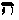
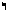
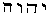
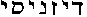

##### The Secret Doctrine by H. P. Blavatsky -- Vol. 1

------------------------------------------------------------------------

###### \[\[Vol. 1, Page\]\] 386 THE SECRET DOCTRINE.

\[\[This page continued from [previous section](sd1-2-08)\]\]

#### § IX THE MOON, DEUS LUNUS, PHOEBE.

**T**HIS archaic symbol is the most poetical of all symbols, as also the
most philosophical. The ancient Greeks brought it into prominence, and
the modern poets have worn it threadbare. The Queen of Night, riding in
the majesty of her peerless light in heaven, throwing all, even
Hesperos, into darkness, and spreading her silver mantle over the whole
sidereal world, has ever been a favourite theme with all the poets of
Christendom, from Milton and Shakespeare down to the latest versifier.
But the refulgent lamp of night, with her suite of stars unnumbered,
spoke only to the imagination of the profane. Until lately, Religion and
Science had nought to do with the beautiful mythos. Yet, the cold chaste
moon, she, in the words of Shelley --

> . . . . "Who makes all beautiful on which she smiles  
> That wandering shrine of soft, yet icy flame,  
> Which ever is transformed, yet still the same,  
> And warms, but not illumines." . . . .

stands in closer relations to Earth than any other sidereal orb. The Sun
is the giver of life to the whole planetary system; the Moon is the
giver of life to our globe; and the early races understood and knew it,
even in their infancy. She is the Queen and she is the King, and was
King Soma before she became transformed into Phoebe and the chaste
Diana. She is pre-eminently the deity of the Christians, through the
Mosaic and Kabalistic Jews, though the civilized world may have remained
ignorant of the fact for long ages; in fact, ever since the

------------------------------------------------------------------------

###### \[\[Vol. 1, Page\]\] 387 A GLANCE AT THE LUNAR MYTH.

last initiated Father of the Church died, carrying with him into his
grave the secrets of the pagan temples. For the "Fathers" -- such as
Origen or Clemens Alexandrinus -- the Moon was Jehovah's living symbol:
the giver of Life and the giver of Death, the disposer of being -- in
*our* World. For, if Artemis was *Luna* in Heaven, and, with the Greeks,
Diana on Earth, who presided over child-birth and *life:* with the
Egyptians, she was Hekat (Hecate) in Hell, the goddess of Death, who
ruled over magic and enchantments. More than this: as the personified
moon, whose phenomena are triadic, Diana-Hecate-Luna is *the three in
one.* For she is *Diva triformis*, *tergemina*, *triceps* -- three heads
on one neck,\* like Brahma-Vishnu-Siva. Hence she is the prototype of
our Trinity, which has not always been entirely male. The number seven,
so prominent in the Bible, so sacred in its seventh (Sabbath) day, came
to the Jews from Antiquity, deriving its origin from the four-fold
number 7 contained in the 28 days of the lunar month, each septenary
portion thereof being typified by one quarter of the moon.

It is worth the trouble of presenting in this work a bird's-eye view of
the origin and development of the lunar myth and *worship* in historical
antiquity, on our side of the globe. Its earlier origin is untraceable
by *exact* science, rejecting as it does tradition; while for Theology,
which, under the guidance of the crafty Popes, has put a brand on every
fragment of literature that does not bear the *imprimatur* of the Church
of Rome, its archaic history is a sealed book. Whether the Egyptian or
the Aryan Hindu religious philosophy is the more ancient -- and the
Secret Doctrine says it is the latter -- does not much matter in this
instance, as the lunar and solar "worship" are the most ancient in the
world. Both have survived, and prevail to this day throughout the whole
world, with some openly, with others -- *e.g.*, in Christian symbolics
-- secretly. The cat, a lunar symbol, was sacred to Isis, herself the
Moon in one sense, as Osiris was the Sun. The cat is often seen on the
top of the *Sistrum* in the hand of the goddess. This animal was held in
great veneration in the city of Bubaste, which went into deep mourning
after the death of every sacred cat, because Isis, as the Moon, was
particularly worshipped in this city of mysteries. The astronomical
symbolism connected with it has already been given in Section I. of
"Symbolism," and no one has better described it than Mr. G. Massey, in
his Lectures and in "The Natural Genesis." The eye of the cat, it is
said, seems to follow the lunar phases in its growth and decline, and
its orbs shine like two stars in the darkness of night. Hence the
mythological allegory which shows Diana hiding under the shape of a cat
in the Moon, when, in company with other deities, she was seeking to

###### \[\[Footnote(s)\]\] -------------------------------------------------

\* The goddess \[\[*Trimorphos*\]\] in the statuary of Alcamenes.

------------------------------------------------------------------------

###### \[\[Vol. 1, Page\]\] 388 THE SECRET DOCTRINE.

escape the pursuit of *Typhon* (*Vide* the *Metamorphoses of Ovid*)*.*
The moon in Egypt was both the "Eye of Horus" and the "Eye of Osiris,"
the Sun.

The same with the *Cynocephalus.* The dog-headed ape was a glyph to
symbolise the sun and moon, in turn, though the Cynocephalus *is more a
Hermetic than a religious symbol.* For it is the hieroglyph of Mercury,
the planet, as of the Mercury of the Alchemical philosophers, "as," say
the Alchemists, "Mercury has to be ever *near Isis*, *as her minister*,
as without Mercury neither Isis nor Osiris can accomplish anything in
the GREAT WORK." Cynocephalus, whenever represented with the Caduceus,
the Crescent, or the Lotus, is a glyph of the "philosophical" Mercury;
but when seen with a reed, or a roll of parchment, he stands for Hermes,
the secretary and adviser of Isis, as Hanuman filled the same office
with Rama.

Though the regular Sun-Worshippers, the Parsis, are few, yet not only is
the bulk of the Hindu mythology and history based upon and interblended
with these two worships, but so is also the Christian religion itself.
From their origin down to our modern day it has coloured the theologies
of both the Roman Catholic and Protestant Churches. The difference,
indeed, between the Aryan Hindu and the Aryan European faiths is very
small, if only the fundamental ideas of both are taken into
consideration. Hindus are proud of calling themselves *Suryas* and
*Chandravansas* (of the *Solar* and *Lunar* dynasties). The Christians
pretend to regard it as idolatry, and yet they adhere to a religion
entirely based upon the solar and lunar worships. It is useless and vain
for the Protestants to exclaim against the Roman Catholics for their
"Mariolatry," based on the ancient cult of lunar goddesses, when they
themselves worship Jehovah, pre-eminently a *lunar* god, and when both
Churches have accepted in their theologies the "*Sun*"-Christ and the
lunar trinity.

What is known of Chaldaean Moon-Worship, of the Babylonian god, *Sin*,
called by the Greeks "Deus Lunus," is very little, and that little is
apt to mislead the profane student who fails to grasp the esoteric
significance of the symbols. As popularly known to the ancient profane
philosophers and writers (for those who were initiated were pledged to
silence) the Chaldaea were the worshippers of the moon under *her* (and
*his*) various names, just as were the Jews, who came after them.

In the unpublished **MSS**. on the Art Speech, already mentioned, giving
a key to the formation of the ancient (symbolical) languages a logical
*raison d*'*etre* is brought forward for this double worship. It is
written by a wonderfully well-informed and acute scholar and Mystic, who
gives it in the comprehensive form of a hypothesis. The latter, however,
becomes forcibly a proven fact in the history of religious

------------------------------------------------------------------------

###### \[\[Vol. 1, Page\]\] 389 A KEY NOTE TO THE MOON.

evolution in human thought, to anyone who has ever had a glimpse into
the secret of ancient Symbology. Thus, he says: --

> "One of the first occupations among men, connected with those of
> actual necessity, would be the perception of time periods,\* marked on
> the vaulted arch of the heavens sprung and rising over the level floor
> of the horizon, or the plain of still water. These would come to be
> marked as those of day and night, of the phases of the moon, of its
> stellar or synodic revolutions, and of the period of the solar year
> with recurrence of the seasons, and with the application to such
> periods of the natural measure of day or night, or of the day divided
> into the light and the dark. It would also be discovered that there
> was a longest and shortest solar day, and two solar days of equal day
> and night, within the period of the solar year; and the points in the
> year of these could be marked with the greatest precision in the
> starry groups of the heavens or the constellations, subject to that
> retrograde movement thereof, which in time would require a correction
> by intercalation, as was the case in the description of the Flood,
> where correction of 150 days was made for a period of 600 years,
> during which confusion of landmarks had increased. . . . This would
> naturally come to pass . . . . with all races in all time; and such
> knowledge must be taken to have been inherent in the human race, prior
> to what we call the historic period. . . . ."

> On this basis, the author seeks for some natural physical function
> possessed in common by the human race, and connected with the
> periodical manifestations, such that "the connection between the two
> kinds of phenomena . . . became fixed in popular usage." He finds it
> "(*a*) in the feminine physiological phenomena every lunar month of 28
> days, or" 4 weeks of 7 days each, so that 13 occurrences of the period
> should happen in 364 days, which is the solar week year of 52 weeks of
> 7 days each. (*b*) The quickening of the foetus is marked by a period
> of 126 days, or 18 weeks of 7 days each. (*c*) That period which is
> called "the period of viability" is one of 210 days, or 30 weeks of 7
> days each. (*d*) The period of parturition is accomplished in 280
> days, or a period of 40 weeks of 7 days each, or 10 lunar months of 28
> days each, or of 9 calendar months of 31 days each, counting on the
> royal arch of heavens for the measure of the period of traverse from
> the darkness of the womb to the light and glory of conscious
> existence, that continuing inscrutable mystery and miracle . . . Thus
> the observed periods of time marking the workings of the birth
> function would naturally become a basis of astronomical calculation .
> . . We may almost affirm . . . that this was the mode of reckoning
> among all nations, either independently, or intermediately and
> indirectly by tuition. It was the mode with the Hebrews, for even
> to-day they calculate the calendar by means of the 354 and 355 of the
> lunar year, and we possess a special evidence that it was the mode
> with the ancient Egyptians, as to which this is the proof: --

###### \[\[Footnote(s)\]\] -------------------------------------------------

\* Ancient Mythology includes ancient Astronomy as well as Astrology.
The planets were the hands pointing out, on the dial of our solar
system, the hours of certain periodical events. Thus, Mercury was *the
messenger* appointed to keep time during the daily solar and lunar
phenomena, and was otherwise connected with the God and Goddess of
Light.

------------------------------------------------------------------------

###### \[\[Vol. 1, Page\]\] 390 THE SECRET DOCTRINE.

> "The basic idea underlying the religious philosophy of the Hebrews was
> that God contained all things within himself\*; and that man was his
> image, man including woman . . . The place of the man and woman with
> the Hebrews was among the Egyptians occupied by the bull and the cow,
> sacred to Osiris and Isis,\*\* who were represented, respectively, by
> a man having a bull's head, and a woman having the head of a cow,
> which symbols were worshipped. Notoriously Osiris was the Sun and the
> river Nile, the tropical year of 365 days, which number is the value
> of the word *Neilos*, and the bull, as he was also the principle of
> fire and of life-giving force, while Isis was the Moon, the bed of the
> river Nile, or the Mother Earth, for the parturient energies of which
> water was a necessity, the lunar year of 354-364 days, the time-maker
> of the periods of gestation, and the cow marked by, or with, the
> crescent new moon." . . . .

> "But the use of the cow of the Egyptians for the women of the Hebrews
> was not intended as of any radical difference of signification, but a
> concurrence in the teaching intended, and merely as a substitution of
> a symbol of common import, which was this, viz., the period of
> parturition with the cow and the woman was held to be the same, or 280
> days, or ten lunar months of four weeks each. And in this period
> consisted the essential value of this animal symbol, whose mark was
> that of the crescent moon.\*\*\* . . . These parturient and natural
> periods are found to have been subjects of symbolism all over the
> world. They were thus used by the Hindus, and are found to be most
> plainly set forth by the ancient Americans, in the Richardson and Gest
> tablets, in the Palenque Cross; and manifestly lay at the base of the
> formation of the calendar forms of the Mayas of Yucatan, the Hindus,
> the Assyrians, and the ancient Babylonians, as well as the Egyptians
> and old Hebrews. The natural symbols . . . would be either the phallus
> or the phallus and yoni, . . . or *male* and *female.* Indeed, the
> words translated by the generalizing terms male and female, in the
> 27th verse of the 1st chapter of Genesis are . . *. sacr* and
> *n*'*cabrah*, or literally, phallus and yoni,\*\*\*\* while the
> representation of the phallic emblems would barely indicate the
> genital members of the human body, when their functions and the
> development of the seed-vesicles emanating from them was considered;
> then would come into indication a mode of measures of lunar time, and,
> through lunar, of solar time." . . .

This is the physiological or anthropological key to the Moon symbol. The
key that opens the mystery of theogony, or the evolution of the
Manvantaric gods, is more complicated, and has nothing phallic in it.
All is mystical and divine there. But the Jews, beyond connecting
Jehovah directly with the Moon as a generative god, preferred to ignore
the higher hierarchies, and have made of some of them (zodiacal
constellations and planetary gods) their Patriarchs, thus euhemerizing
the

###### \[\[Footnote(s)\]\] -------------------------------------------------

\* A caricatured and dwarfed Vedantin notion of Parabrahmam containing
within *itself* the whole Universe as being that boundless Universe
itself, and *there existing nothing outside of itself.*

\*\* Just as they are to this day in India, the bull of Siva and the cow
representing several *Sakti --* goddesses.

\*\*\* Hence the worship of the moon by the Hebrews.

\*\*\*\* "*Male and female*, created he them."

------------------------------------------------------------------------

###### \[\[Vol. 1, Page\]\] 391 THE TIME PERIODS.

purely theosophical idea and dragging it down to the level of sinful
humanity. (*See section* "*Holy of Holies*" *in the* "*Symbolism*" *of
Book II.*) The **MSS**. from which the above is extracted explains very
clearly to what hierarchy of gods Jehovah belonged, and who this Jewish
**G**OD was; for it shows in clear language that which the writer has
always insisted upon -- namely, that the God with which the Christians
have burdened themselves was no better than the lunar symbol of the
reproductive or generative faculty in nature. They have ever ignored
even the Hebrew secret god of the Kabalists, Ain-Soph, as grand as
Parabrahmam in the earliest Kabalistic and mystical conceptions. But it
is not the Kabala of Rosenroth that can ever give the true original
teachings of Simeon-Ben-Iochai, as metaphysical and philosophical as
any. And how many are there among the students of the Kabala who knew
anything of them except in their distorted Latin translations. Let us
glance at the idea which led the ancient Jews to adopt a substitute for
the ever **U**NKNOWABLE, and which has misled the Christians into
mistaking the substitute for the reality.

> "If to these organs (phallus and yoni) as symbols of creative cosmic
> agencies the idea of . . . . time periods can be attached, then,
> indeed, in the construction of Temples as Dwellings of Deity, or of
> Jehovah, that post designated as the Holy of Holies, or the most High
> Place, should borrow its title from the recognized sacredness of the
> generative organs, considered as symbols of measures as well as of
> creative Cause."

> "With the ancient wise, there was no name, and no idea, and no symbol,
> of a First Cause.\* With the Hebrews, the indirect conception of such
> was couched in a term of negation of comprehension -- viz*.*,
> *Ain-Soph*, or the Without Bounds. But the symbol of *its first
> comprehensible manifestation*, was the conception of a circle with its
> diameter line. . . . . (See the Proem of Book I., Part I.) to carry at
> once a geometric, phallic, and astronomic idea . . . . for the one
> takes its birth from the nought or the Circle, without which it could
> not be, and from one, or primal one, spring the nine digits, and,
> geometrically, all plane shapes. So in the Kabala this Circle, with
> its diameter line, is the picture of the ten Sephiroth or Emanations,
> composing the Adam Kadmon, the Archetypal Man, the creative origin of
> all things. . . . . This idea of connecting the circle and its
> diameter line, that is, number ten, with the signification of the
> reproductive organs, and the Most Holy Place, was carried out
> constructively in the King's Chamber, or Holy of Holies, of the great
> Pyramid, in the Tabernacle of Moses, and in the Holy of Holies of the
> Temple of Solomon. . . . . It is *the picture of a double-womb*, for
> in Hebrew the letter he  is at the same time the
> number 5 and symbol of the womb, and twice 5 is 10, or the phallic
> number."

This "double womb" also shows the duality of the idea carried from

###### \[\[Footnote(s)\]\] -------------------------------------------------

\* Because it was too sacred. It is referred to as **T**HAT in the
Vedas: it is the "Eternal Cause," and cannot, therefore, be spoken of as
a "First Cause," a term implying the absence of any cause, at one time.

------------------------------------------------------------------------

###### \[\[Vol. 1, Page\]\] 392 THE SECRET DOCTRINE.

the highest, spiritual, down to the lowest or terrestrial plane; and by
the Jews limited to the latter. With them, therefore the number 7 has
acquired the most prominent place in their exoteric religion, a cult of
external forms and empty rituals; as their Sabbath, for instance, the
seventh day sacred to their deity, the moon, symbolical of the
generative Jehovah. While with other nations the number seven was
typical of theogonic evolution, of cycles, cosmic planes, and the Seven
Forces and Occult Powers in Kosmos, as a boundless whole, whose first
upper triangle was unreachable to the finite intellect of man -- while
other nations, therefore, busied themselves, in their forcible
limitation of Kosmos in Space and Time, only with its septenary
manifested plane, the Jews centred this member solely in the moon, and
based all their sacred calculations thereupon. Hence we find the
thoughtful author of the **MSS**. just quoted, remarking, in reference
to the metrology of the Jews that: "If 20,612 be multiplied by 4/3 *the
product will afford a base for the ascertainment of the mean revolution
of the moon*, and if this product be again multiplied by 4/3, this
continued product will afford a base for finding the exact period of the
mean solar year, . . . this form . . . becoming, for the finding of
astronomical periods of time, of very great service." This double number
(male and female) is symbolized also in some well-known idols: *e.g*.,
"Ardanari-Iswara, the Isis of the Hindus, Eridanus, or Ardan, or the
Hebrew Jordan, *or source of descent.* She is standing on a lotus-leaf
flowing on the water. But the signification is, that it is androgyne or
hermaphrodite, that is *phallus* and *yoni* combined, the number 10, the
Hebrew letter *Jod* , the *containment of Jehovah.* She,
or rather she-he, gives the minutes of the same circle of 360 degrees."

"Jehovah," in its best aspect is Binah, "the Upper mediating Mother, the
*Great Sea* or Holy Spirit;" therefore rather a synonym of Mary, the
Mother of Jesus, than of his Father; that "Mother, being the Latin
*Mare*" the Sea is here also, Venus, the *Stella del Mare*, or "Star of
the Sea."

The ancestors of the mysterious Akkadians -- the *Chandra* or
*Indovansas*, the Lunar Kings whom tradition shows reigning at Prayag
(Allahabad) ages before our era -- had come from India, and brought with
them the worship of their forefathers, of Soma, and his son Budha, which
afterwards became that of the Chaldeans. Yet such adoration, apart from
popular Astrolatry and Heliolatry, was in no sense *idolatry.* No more,
at any rate, than the modern Roman Catholic symbolism which connects
their Virgin Mary -- the *Magna Mater* of the Syrians and Greeks -- with
the Moon.

Of this worship, the most pious Roman Catholics feel quite proud,

------------------------------------------------------------------------

###### \[\[Vol. 1, Page\]\] 393 COPIES AND ORIGINALS.

and loudly confess to it. In a *Memoire* to the French Academy, the
Marquis De Mirville says: --

> "It is only natural that, as an unconscious prophecy, Ammon-Ra should
> be *his mother*'*s husband*, since the *Magna Mater* of the Christians
> *is precisely the spouse of that son she conceives*. . . . We
> (Christians) *can understand now why Neithis throws radiance on the
> sun*, *while remaining the Moon*, since the **V**IRGIN, who is the
> **Q**UEEN OF **H**EAVEN, *as Neith was*, clothes herself in her
> radiance, and clothes in his turn the **C**HRIST-**S**UN. "*Tu vestis
> solem et te sol vestit*.". . . is sung by the Roman Catholics during
> their service, and he adds: --

> "We (Christians) understand also how it is that the famous inscription
> at Sais should have stated that 'none has ever lifted my peplum
> (veil),' considering that this sentence, literally translated, *is the
> summary of what is sung in the Church on the day of the immaculate
> conception.*" (**A**RCHAEOLOGY OF THE **V**IRGIN **M**OTHER," p. 117.)

Surely nothing could be more sincere than this! It justifies entirely
what Mr. Gerald Massey has said in his Lecture on "Luniolatry, Ancient
and Modern": --

> "The man in the moon (Osiris-Sut, Jehovah-Satan, Christ-Judas, and
> other Lunar twins) is often charged with bad conduct. . . . In the
> lunar phenomena the moon was one as *the* moon, which was two-fold in
> sex, and three-fold in character -- as mother, child, and adult male.
> Thus the child of the moon became the consort of his own mother! It
> could not be *helped* if there was to be any reproduction. He was
> compelled to be his own father! These relationships were repudiated by
> later sociology, and the primitive man in the moon got tabooed. Yet,
> in its latest, most inexplicable phase, this has become the central
> doctrine of the grossest superstition the world has seen, for these
> lunar phenomena and their humanly represented relationships, the
> incestuous included, are the very foundations of the Christian Trinity
> in Unity. Through ignorance of the symbolism, the simple
> representation of early time has become the most profound religious
> mystery in modern Luniolatry. The Roman Church, without being in any
> wise ashamed of the proof, portrays the Virgin Mary arrayed with the
> sun, and the horned moon at her feet, holding the lunar infant in her
> arms -- as child and consort of the mother moon. The mother, child,
> and adult male, are fundamental."

> "In this way it can be proved that our Christology is mummified
> mythology, and legendary lore, which have been palmed off upon us in
> the *Old* Testament and the New, as divine revelation uttered by the
> very voice of God."

A charming allegory is found in the *Zohar*, one which unveils better
than anything ever did the true character of Jehovah or **YHVH** in the
primitive conception of the Hebrew Kabalists. It is now found in the
philosophy of I'bn Gebirol's Kabbalah, translated by Isaac Myer. "In the
introduction written by R'Hez'quee-yah, which is very old," says our
author, "and forms part of our Brody edition of the Zohar (I, 5*b. sq.*)
is an account of a journey taken by R. El'azar, son of R. Shim-on b.
Io'hai, and Rabbi Abbah." They met a man with a heavy burden and asked
his name; but he refused to give it and proceeded to explain to them
Thorah

------------------------------------------------------------------------

###### \[\[Vol. 1, Page\]\] 394 THE SECRET DOCTRINE.

(Law). "They asked: 'Who caused thee thus to walk and carry such a heavy
load?' He answered: 'The letter , (Yod, which = 10, and
is the symbolical letter of Kether and the essence and germ of the Holy
name  **YHVH**) . . . . They said to him: 'If thou wilt
tell us the name of thy father, we will kiss the dust of thy feet.' He
replied: 'As to my father, *he had his dwelling in the Great Sea*, *and
was a fish therein*' (like Vishnu and Dagon or Oannes), 'which (first)
destroyed the great sea' . . . . . and he was great and mighty and
'Ancient of Days,' until he swallowed all the other fishes in the
(Great) Sea . . . R. El'azar listened and said to him: 'Thou art the Son
of the Holy Flame, thou art the Son of Rab Ham -- '*nun*-ah Sabah \[the
old: the *fish* in Aramaic or Chaldee is *nun* (*noon*)\] thou art the
Son of the Light of the Thorah," (*Dharma*) etc. Then the author
explains that the feminine Sephiroth, *Binah*, is termed by the Kabalist
the great sea: therefore Binah, whose divine names are Jehovah, *Yah*,
and Elohim, is simply the Chaldean Tiamat, the female power, the
Thalatth of Berosus, who presides over the Chaos, and was made out later
by Christian theology to be the serpent and the Devil. She-He
(Yah-hovah) is the supernal (Heh, and Eve). This Yah-hovah then or
Jehovah, is identical with our Chaos -- Father, Mother, Son, -- on the
material plane and in the purely physical World. *Demon* and *Deus* at
one and the same time; the sun and moon, good and evil, God and Demon.

Lunar magnetism generates life, preserves and destroys it, psychically
as well as physically. And if, astronomically, she is one of the seven
planets of the ancient world, in theogony she is one of the regents
thereof; with Christians now as much as with Pagans, the former
referring to her under the name of one of their archangels, and the
latter under that of one of their gods.

Therefore the meaning of the "fairy tale" translated by Chwolson from an
old Chaldean **MSS.** translated into Arabic, about Qu-tamy being
instructed by the *idol* of the moon, is easily understood (*vide* Book
III.) Seldenus tells us the secret as well as Maimonides (*More
Nevochim*, Book III., ch. xxx). The worshippers of the *Teraphim* (the
Jewish Oracles) "carved images and claimed that the light of the
principal stars (planets) permeating these through and through, the
angelic **V**IRTUES (or the regents of the stars and planets) conversed
with them, teaching them many most useful things and arts." And Seldenus
explains that the *Teraphim* were built and composed after the position
of certain planets, those which the Greeks called \[\[*stoicheia*\]\],
and according to figures that were located in the sky and called
\[\[*alexeteroi*\]\], or the *tutelary* gods*.* Those who traced out the
\[\[*stoicheia*\]\] were called \[\[*stoicheiomatichoi*\]\], or the
diviners by the \[\[*stoicheia*\]\]*.* (*De Diis Syriis*, *Teraph*, II.
Synt. p. 31) *vide infra*, the *Teraphim.*

It is such sentences, however, in the "Nabathean agriculture," that

------------------------------------------------------------------------

###### \[\[Vol. 1, Page\]\] 395 SOLAR-LUNAR WORSHIP IN THE CHURCH.

have frightened the men of science and made them proclaim the work
"either an *apocrypha* or a fairy tale, unworthy of the notice of an
Academician." At the same time, as shown, zealous Roman Catholics and
Protestants tore it metaphorically to pieces; the former because "it
described the worship of demons," the latter because it is "ungodly."
They are all wrong, once more. It is *not* a fairy tale; and as far as
regards pious Churchmen, the same worship may be shown in the
Scriptures, however disfigured by translation. Solar and Lunar worship,
as well as that of the Stars and Elements, are traced, and figure in the
Christian theology; defended by Papists, they are stoutly denied by the
Protestants only at their own risk and peril. Two instances may be
given.

Ammianus Marcellinus teaches that ancient divinations were always
accomplished with the help of the Spirits of the Elements, "*Spiritus
elementorum*, and in Greek \[\[*pneumata ton stoicheion*\]\]" (1. I.,
21).

But it is found now that the planets, the Elements, and the Zodiac, were
figured not only in Heliopolis by the twelve stones called "mysteries of
the elements," *elementorum arcana*, but also in Solomon's temple, and,
as pointed out by various writers, in several old Italian churches and
even at *Notre Dame de Paris* where they can be seen to this day.

No symbol -- the sun included -- was more complex in its manifold
meanings than the lunar symbol. The sex was, of course, dual. With some
it was male, *e.g*., the Hindu "King Soma," and the Chaldean *Sin;* with
other nations it was female, the beauteous goddesses Diana-Luna,
I'lythia, Lucina. In Tauris, human victims were sacrificed to Artemis, a
form of the lunar goddess; the Cretans called her Dictynna, and the
Medes and Persians Anaitis, as shown by an inscription of Koloe:
'\[\[*Artemidi* '*Anaeiti*\]\]. But, we are now concerned chiefly with
the most chaste and pure of the virgin goddesses, Luna-Artemis, to whom
Pamphos was the first to give the surname of \[\[*Kalliste*\]\], and of
whom Hippolitus wrote: \[\[*Kallista polu parthenon*\]\]. (See Pausanias
viii., 35, 8.) This Artemis-Lochia, the goddess that presided at
conception and child-birth (Iliad, Pausanias, etc., etc.), is, in her
functions and as the triple Hecate, the Orphic deity, the predecessor of
the God of the Rabbins and pre-Christian Kabalists, and his lunar type.
The goddess \[\[*Trimorphos*\]\] was the personified symbol of the
various and successive aspects represented by the moon in each of her
three phases; and this interpretation was already that of the Stoics
(Cornut. *De Nat*, D. 34, 1), while the Orpheans explained the epithet
(\[\[*Trimorphos*\]\]) by the three kingdoms of nature over which she
reigned. jealous, blood-thirsty, revengeful and exacting, Hecate-Luna is
a worthy counterpart of the "Jealous God" of the Hebrew prophets.

------------------------------------------------------------------------

###### \[\[Vol. 1, Page\]\] 396 THE SECRET DOCTRINE.

The whole riddle of the solar and lunar worship, as now traced in the
churches, hangs indeed on this world-old mystery of lunar phenomena. The
correlative forces in the "Queen of Night," that lie latent for modern
science, but are fully active to the knowledge of Eastern adepts,
explain well the thousand and one images under which the moon was
represented by the ancients. It also shows how much more profoundly
learned in the Selenic mysteries were the ancients than are now our
modern astronomers. The whole Pantheon of the lunar gods and goddesses,
Nephtys or Neith, Proserpina, Melytta, Cybele, Isis, Astarte, Venus, and
Hecate, on the one hand, and Apollo, Dionysius, Adonis, Bacchus, Osiris,
Atys, Thammuz, etc., etc., on the other, all show on the face of their
names and titles -- those of "Sons" and "Husbands" of their mothers --
their identity with the Christian Trinity. In every religious system the
gods were made to merge their functions as Father, Son, and Husband,
into one, and the goddesses were identified as "Wife, Mother, and
Sister" of the male God; the former synthesizing the human attributes as
the "Sun, the giver of Life," the latter merging all the other titles in
the grand synthesis known as Maia, Maya, Maria, etc., a generic name.
Maia, in its forced derivation, has come to mean with the Greeks,
"mother," from the root *ma* (nurse), and even gave its name to the
month of May, which was sacred to all those goddesses before it became
consecrated to Mary.\* Its primitive meaning, however, was *Maya*,
*Durga*, translated by the Orientalists as "inaccessible," but meaning
in truth the "*unreachable*," in the sense of illusion and unreality; as
being the source and cause of spells, the personification of
**I**LLUSION.

In religious rites the moon served a dual purpose. Personified as a
female goddess for exoteric purposes, or as a male god in allegory and
symbol, in occult philosophy our satellite was regarded as a sexless
Potency to be well studied, because it was to be dreaded. With the
initiated Aryans, Khaldii, Greeks and Romans, Soma, Sin, Artemis
*Soteira* (the hermaphrodite Apollo, whose attribute is the lyre, and
the bearded Diana of the bow and arrow), *Deus Lunus*, and especially
Osiris-lunus and Thot-lunus,\*\* were the occult potencies of the moon.
But whether male or female, whether Thot or Minerva, Soma or Astoreth,
the Moon is the Occult mystery of mysteries, and more a symbol of evil
than of good. Her seven phases (original, esoteric division) are divided
into three astronomical phenomena and four

###### \[\[Footnote(s)\]\] -------------------------------------------------

\* The Roman Catholics are indebted for the idea of consecrating the
month of May to the Virgin, to the pagan Plutarch, who shows that "May
is sacred to *Maia* (\[\[*Maia*\]\]) or Vesta" (*Aulus-Gellius*, word
Maia) -- our mother-earth, our nurse and nourisher personified.

\*\* Thot-Lunus is "Budha-Soma" of India, or "Mercury and the Moon."

------------------------------------------------------------------------

###### \[\[Vol. 1, Page\]\] 397 THE MOON, BISEXUAL.

purely psychic phases. That the moon was not always reverenced is shown
in the Mysteries, in which the death of the moon-god (the three phases
of gradual waning and final disappearance) was allegorized by the moon
standing for the *genius of evil* that triumphs for the time over the
light and life-giving god (the sun), and all the skill and learning of
the ancient Hierophants in Magic was required to turn this triumph into
a defeat.

It was the most ancient worship of all, that of the *third* Race of our
Round, the Hermaphrodites, to whom the *male*-moon became sacred, when
after the "Fall" so-called, the sexes had become separated. "Deus Lunus"
then became an androgyne, male and female in turn; to serve finally, for
*purposes of sorcery*, as a dual power, to the *Fourth* Root-race, the
Atlanteans. With the *Fifth* (our own) the lunar-solar worship divided
the nations into two distinct, antagonistic camps. It led to events
described aeons later in the Mahabharatan War, which to the Europeans is
the *fabulous*, to the Hindus and Occultists the historical, strife
between the *Suryavansas* and the *Indovansas.* Originating in the dual
aspect of the moon, the worship of the female and the male principles
respectively, it ended in distinct solar and lunar cults. Among the
Semitic races, the sun was for a very long time *feminine* and the moon
masculine -- the latter notion being adopted by them from the Atlantean
traditions. The moon was called "the Lord of the sun,"
*Bel-Skemesh*,*\** before the Shemesh worship. The ignorance of the
incipient reasons for such a distinction, and of occult principles, led
the nations into anthropomorphic idol-worship. But the religion of every
ancient nation had been primarily based upon the Occult manifestations
of a purely abstract Force or Principle now called "God." The very
establishment of such worship shows, in its details and rites, that the
philosophers who evolved those systems of nature, subjective and
objective, possessed profound knowledge, and were acquainted with many
facts

###### \[\[Footnote(s)\]\] -------------------------------------------------

\* During that period which is absent from the Mosaic books -- from the
exile of Eden to the allegorical Flood -- the Jews worshipped with the
rest of the Semites *Dayanisi*  "the Ruler of Men," the
"Judge," or the **S**UN. Though the Jewish canon and Christianism have
made the sun become the "Lord God" and Jehovah in the Bible, yet the
latter is full of indiscreet traces of the androgyne Deity, which was
Jehovah the *sun*, and Astoreth the moon in its female aspect, and quite
free from the present metaphorical element given to it. God is a
"consuming fire," appears *in*, and is encompassed *by* fire." It was
not only in vision that Ezekiel (viii., 16) saw the Jews "worshipping
the sun." The *Baal* of the Israelites (the Shemesh of the Moabites and
the Moloch of the Ammonites) was the identical "Sun-Jehovah," and he is
till now "the King of the Host of Heaven," the Sun, as much as Astoreth
was the "Queen of Heaven" -- or the moon. The "Sun of Righteousness" has
become a *metaphorical* expression *only now.*

------------------------------------------------------------------------

###### \[\[Vol. 1, Page\]\] 398 THE SECRET DOCTRINE.

of a scientific nature. For besides being purely Occult, the rites of
lunar worship were based, as just shown, upon a knowledge of physiology
(quite a modern science with us), psychology, sacred mathematics,
geometry and metrology, in their right applications to symbols and
figures, which are but glyphs, recording observed natural and scientific
*facts;* in short, upon a most minute and profound knowledge of nature.
Lunar magnetism generates life, preserves and kills it. *Soma* embodies
the triple power of the *Trimurti*, though it passes unrecognized by the
profane to this day. The allegory that makes Soma, the moon, produced by
the churning of the *Ocean of Life* (*Space*) by the gods in another
Manvantara (*i.e.*, in the *pre*genetic day of our planetary system),
and that other allegory, which shows "the Rishis milking the earth,
whose calf was Soma, the moon," has a deep cosmographical meaning; for
it is neither *our* earth which is milked, nor was the moon, which we
know, the calf.\* Had our wise men of science known as much of the
mysteries of nature as the ancient Aryans did, they would surely never
have imagined that the moon was projected from the Earth. Once more, the
oldest of permutations in theogony, the Son becoming his own father and
the mother generated by the Son, has to be remembered and taken into
consideration if the symbolical language of the ancients is to be
understood by us. Otherwise mythology will be ever haunting the
Orientalists as simply "the disease which springs up at a peculiar stage
of human culture!" -- as Renouf gravely observes in a Hibbert lecture.

The ancients taught the, so to speak, *auto*-generation of the Gods: the
one divine essence, *unmanifested*, perpetually begetting a second-self,
*manifested*, which second-self, androgynous in its nature, *gives birth
in an immaculate way* to everything macro- and micro-cosmical in this
universe. This was shown in the Circle and the Diameter, or the Sacred
10, a few pages back.

But our Orientalists, their extreme desire to discover one homogeneous
*element* in nature notwithstanding, will *not* see it; cramped in their
researches by such ignorance, they -- the Aryanists and Egyptologists --
are constantly led astray from truth in their speculations. Thus, de
Rouge is unable to understand, in the text which he translates, the
meaning of Ammon-Ra saying to King Amenophes (supposed to be Memnon),
"Thou art my Son, I have begotten thee"; and as he

###### \[\[Footnote(s)\]\] -------------------------------------------------

\* The earth flees for her life in the allegory, before Prithu, who
pursues her. She assumes the shape of a cow, and, trembling with terror,
runs away and hides even in the regions of Brahma. Therefore, it is
*not* our Earth. Again, in every Purana, the calf changes name. In one
it is Manu Swayambhuva, in another Indra, in a third the Himavat
(Himalayas) itself, while Meru was the milker. This is a deeper allegory
than one thinks.

------------------------------------------------------------------------

###### \[\[Vol. 1, Page\]\] 399 THE DIGNITY OF SAIS.

finds the same idea in many a text and under various forms, this very
Christian Orientalist is finally compelled to exclaim that "for this
idea to have entered the mind of a hierogrammatist, there must have been
in their religion a more or less defined doctrine, *indicating as a
possible fact that might come to pass*, *a divine and immaculate
incarnation under a human form.*" Precisely. But why throw the
explanation on an impossible prophecy, when the whole secret is
explained by the later religion copying the earlier?

That doctrine was universal, and it was not the mind of any one
hierogrammatist that evolved it; for the Indian *avatars* are a proof to
the contrary. After which, having come "to realize clearer"\* what "the
Divine Father and Son" were with the Egyptians, de Rouge still fails to
account for, and perceive what were the functions attributed to the
*feminine* principle in that primordial generation. He does not find it
in the goddess Neith, of Sais. Yet he quotes the sentence of the
Commander to Cambyses when introducing that king into the Saitic temple:
"I made known to his Majesty the dignity of Sais, which is the abode of
Neith, the great (female) producer, *genitrix* of the *Sun*, who is the
*first-born*, *and who is not begotten*, *but only brought forth*," and
hence is the fruit of an *immaculate mother.*

How much more grandiose, philosophical and poetical is the real
distinction -- for whoever is able to understand and appreciate it --
made between the *immaculate virgin* of the ancient Pagans and the
modern *Papal* conception. With the former, the ever-youthful mother
nature, the antitype of her prototypes, the sun and moon, *generates*
and *brings forth* her "mind-born" son, the Universe. The Sun and Moon,
as male-female deities, fructify the earth, the microcosmical mother,
and the latter conceives and brings forth, in her turn. With the
Christians, "the first-born" (*primogenitus*) is indeed generated,
*i.e.*, begotten, "*genitum*, *non factum*," and positively *conceived
and brought forth* -- "*Virgo pariet*," explains the Latin Church. Thus,
she drags down the noble spiritual ideal of the Virgin Mary to the
earth, and, making her "of the earth earthy," degrades that ideal to the
lowest of the anthropomorphic goddesses of the rabble.

Truly, Neith, Isis, Diana, etc., etc., were each of them "a demiurgical
goddess, at once visible and invisible, having her place in Heaven, and
*helping to the generation of species*" -- the moon, in short. Her
occult aspects and powers are numberless, and, in one of them, the moon
becomes with

###### \[\[Footnote(s)\]\] -------------------------------------------------

\* His *clear* realization of it is, that the Egyptians *prophesied*
Jehovah (!) and his incarnated Redeemer (the good serpent), etc., etc.;
even to identifying Typhon with the *wicked* dragon of the garden of
Eden, and this passes as serious and sober *science.*

------------------------------------------------------------------------

###### \[\[Vol. 1, Page\]\] 400 THE SECRET DOCTRINE.

the Egyptians Hathor, another aspect of Isis,\* and both of these
goddesses are shown suckling Horus. Behold in the Egyptian Hall of the
British Museum, Hathor worshipped by Pharaoh Thotmes, who stands between
her and the Lord of Heavens. The monolith was taken from Karnac; and the
same goddess has the following legend inscribed on her throne: "**T**HE
**D**IVINE **M**OTHER AND **L**ADY, OR **Q**UEEN OF **H**EAVEN"; also
"the **M**ORNING **S**TAR," and the "**L**IGHT OF THE **S**EA" (*Stella
matutina* and *Lux maris*)*.* All the lunar goddesses had a dual aspect
-- one *divine*, the other *infernal.* All were the virgin mothers of an
*immaculately* born Son -- the **S**UN. Raoul Rochetti shows the
moon-goddess of the Athenians -- Pallas, or Cybele, Minerva, or again
Diana -- holding her child-son on the lap, invoked in her festivals as
\[\[*Monogenes Theou*\]\], "the one Mother of God," sitting on a lion,
and surrounded by twelve personages; in whom the Occultist recognises
the twelve great gods, and the pious Christian Orientalist the apostles,
or rather the Grecian pagan prophecy thereof.

They are both right, for the immaculate *goddess* of the Latin Church is
a faithful copy of the older pagan goddesses; the number (twelve) of the
apostles is that of the twelve tribes, and the latter are a
personification of the twelve great gods, and of the twelve signs of the
Zodiac. Every detail almost in the Christian dogma is borrowed from the
heathens. Semele, the *wife* of Jupiter and mother of Bacchus, the
*Sun*, is, according to Nonnus, also "carried," or made to ascend to
heaven after her death, where she presides between Mars and Venus, under
the name of the *Queen of the World*, or the universe,
\[\[*panbasileia*\]\]; "at the names of which, as at the names of
Hathor, Hecate, and other infernal goddesses," "tremble all the
demons."\*\*

"\[\[Semelen premousi daimones\]\]." This Greek inscription on a small
temple, reproduced on a stone that was found by somebody, and copied by
Montfaucon, as De Mirville tells us (113, *Archaeologie de la Vierge
mere*) informs us of the stupendous fact, that the *Magna Mater* of the
old world was an impudent *plagiarism*, perpetrated by the *Demon*, *of
the Immaculate Virgin Mother* of his Church. Whether so, or *vice
versa*, is of no importance. That which is interesting to note is the
perfect identity between the ARCHAIC COPY and the MODERN ORIGINAL.

Did space permit we might show the inconceivable coolness and unconcern
exhibited by certain followers of the Roman Catholic Church, when made
to face the revelations of the Past. To Maury's remark that "the Virgin
took possession of all the Sanctuaries of Ceres and

###### \[\[Footnote(s)\]\] -------------------------------------------------

\* Hathor is the *infernal* Isis, the goddess pre-eminently of the West
or the *nether* world.

\*\* This is De Mirville, who proudly confesses the similarity, and *he
ought to know.*

------------------------------------------------------------------------

###### \[\[Vol. 1, Page\]\] 401 ANTE-HISTORICAL CATHOLICISM.

Venus, and that the pagan rites, proclaimed and practised in honour of
those goddesses, were in a good measure transferred to the mother of
Christ," the advocate of Rome answers: --

> "That such *is* the fact, and that it is just as it should be and
> quite natural. As the dogma, the liturgy, and the rites professed by
> the Roman Apostolical Church in 1862 are found engraved on monuments,
> inscribed on papyri, and cylinders *hardly posterior to the Deluge*,
> it does seem impossible to deny the existence of a FIRST
> ANTE-HISTORICAL (Roman) **C**ATHOLICISM OF WHICH OUR OWN IS BUT THE
> FAITHFUL CONTINUATION. . . . But while the former was the culmination,
> the *summum* of the impudence of demons and Goetic necromancy . . . .
> the latter is *divine.* If in *our* (Christian) Revelation
> (*l*'*Apocalypse*), Mary, clothed with the Sun and having the moon
> under her feet, has nothing more in common *with the humble servant of
> Nazareth* (*sic.*), it is because she has now become the greatest of
> theological and cosmological powers in *our* universe." -- (Archaeol.
> de la Vierge, pp. 116 and 119, and by the Marquis de Mirville).

Verily so, since Pindar's *Hymns to Minerva* (p. 19) . . . "who sits *at
the right hand* of her Father Jupiter, and who is more powerful than all
the other (angels or) gods," are likewise applied to the Virgin. It is
St. Bernard, who, quoted by Cornelius *a Lapide*, is made to address the
Virgin Mary in this wise: --

"The *Sun-Christ* lives in thee and thou livest in him." (Sermon on the
Holy Virgin.) . . . .

Again the Virgin is admitted to be the MOON by the same unsophisticated
holy man. Being the *Lucina* of the Church, that is in childbirth, the
verse of Virgil -- "*Casta fove Lucina*, *tuus jam regnat Apollo*" -- is
applied to her. Like the moon, the Virgin is the Queen of Heaven," adds
the innocent saint; (Apocal., ch. xii., Comm. by *Cornelius a
Lapide*)*.*

This settles the question. The more similarity, according to such
writers as De Mirville, there exists between the pagan conceptions and
the Christian dogmas, the more divine appears the Christian religion,
and the more is it seen to be the only truly inspired one, especially in
its Roman Catholic form. The unbelieving scientists and the academicians
who think they see in the Latin Church quite the opposite of divine
inspiration, and who will not believe in the satanic tricks of
plagiarism by anticipation, are severely taken to task. But then "they
believe in nothing and reject even the '*Nabathean Agriculture*' as a
romance and a pack of superstitious nonsense," complains the
memorialist. "In their perverted opinion Qu-ta-my's 'idol of the moon'
and the statue of the Madonna are one!" A noble Marquis wrote twenty
years ago six huge volumes, or, as he calls them "*Memoires* to the
French Academy," with the sole object of showing Roman Catholicism an
inspired and revealed faith. As a proof thereof, he furnishes numberless
facts, all tending to show that the entire ancient world, ever since

------------------------------------------------------------------------

###### \[\[Vol. 1, Page\]\] 402 THE SECRET DOCTRINE.

the deluge, had been, with the help of the devil, systematically
plagiarizing the rites, ceremonies, and dogmas of the future Holy Church
to be born ages later. What would that faithful son of Rome have said
had he heard his co-religionist -- M. Renouf, the distinguished
Egyptologist of the British Museum -- declaring, in one of his learned
lectures, that "neither Hebrews nor Greeks borrowed any of their ideas
from Egypt?"\*

But perhaps it is just this that M. Renouf intended to say namely --
that it is the Egyptians, the Greeks, and the Aryans, who borrowed
theirs from the Latin Church? And if so, why, in the name of logic, do
the Papists reject the additional information which the Occultists may
give them on Moon-worship, since it all tends to show their (the Roman
Catholic) worship as old as the world -- OF **S**ABAEANISM AND
**A**STROLATRY?

The reason of early Christian and later Roman Catholic astrolatry, or
the symbolical worship of Sun and Moon -- identical with that of the
Gnostics, though less philosophical and pure than the "Sun worship" of
the Zoroastrians -- is a natural consequence of its birth and origin.
The adoption by the Latin Church of such symbols as the water, fire,
sun, moon and stars, and a good many other things, is simply a
continuation by the early Christians of the old worship of Pagan
nations. Thus Odin got his wisdom, power, and knowledge, by sitting at
the feet of Mimir, the thrice-wise *Jotun*, who passed his life by the
fountain of primeval Wisdom, the crystalline waters of which increased
his knowledge daily. Mimir "drew the highest knowledge from the
fountain, because the world was born of water; hence primeval wisdom was
to be found in that mysterious element" ("Asgard and the Gods," 86). The
eye which Odin had to pledge to acquire that knowledge may be "the Sun,
which enlightens and penetrates all things; his other eye being the
moon, whose reflection gazes out of the deep, and which at last, when
setting, sinks into the Ocean." (*Ibid.*) But it is something more,
besides this. Loki, the fire-god, is said to have hidden in the water,
as well as in the moon, the light-giver, whose reflection he found
therein; and this belief that the fire finds refuge in the water was not
limited to the old Scandinavians. It was shared by all nations and was
finally taken up by the early Christians, who symbolized the Holy Ghost
under the shape of Fire, "cloven tongues like as fire" -- the breath of
the Father-**S**UN. This "Fire" descends also into the Water or the Sea:
*Mar*, Mary. The dove was the symbol of the Soul with several nations,
it was sacred to Venus, the goddess born from the

###### \[\[Footnote(s)\]\] -------------------------------------------------

\* Quoted in Mr. G. Massey's Lecture.

------------------------------------------------------------------------

###### \[\[Vol. 1, Page\]\] 403 IDENTITY OF TYPOLOGY.

sea-foam, and it became later the symbol of the Christian *Anima Mundi*,
or the Holy Spirit.

One of the most occult chapters in the "Book of the Dead" is ch. lxxx.,
entitled: "To make the transformation into the god giving light to the
path of Darkness," wherein "Woman-light of the Shadow" serves Thot in
his retreat in the moon. Thot-Hermes is said to hide therein, because he
is the representative of the Secret Wisdom. He is the manifested logos
of its light side, the concealed deity or "Dark Wisdom" when he is
supposed to retire to the opposite hemisphere. Speaking of her power,
the moon calls herself repeatedly: "The Light which shineth in
Darkness," the "Woman-Light." Hence it became the accepted symbol of all
the Virgin-Mother goddesses. As the wicked "evil" spirits warred against
the moon in days of yore, so they are supposed to war now, without being
able to prevail, however, against the actual Queen of Heaven, Mary, the
moon. Hence also the moon was intimately connected in all the Pagan
theogonies with the Dragon, her eternal enemy; the Virgin, or Madonna,
standing on the mythical Satan under that form, crushed and made
powerless, under her feet. This, because the head and tail of the
Dragon, which represent in Eastern astronomy to this day the ascending
and descending nodes of the moon, were also symbolized in ancient Greece
by the two serpents. Hercules kills them on the day of his birth, and so
does the babe in his virgin mother's arms. As Mr. Gerald Massey aptly
observes in this connection: "All such symbols figured their own facts
from the first, and did not pre-figure others of a totally different
order. The Iconography (and dogmas, too) had survived in Rome from a
period remotely pre-Christian. *There was neither forgery nor
interpolation of types; nothing but a continuity of imagery with a
perversion of its meaning.*"

--------------

\[\[This page continued in next section\]\]

------------------------------------------------------------------------

[Next Section](sd1-2-10)

[Contents](sd1-0-co.htm#contents)
