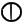
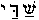
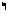
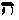
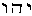
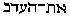
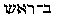

##### The Secret Doctrine by H. P. Blavatsky -- Vol. 1

------------------------------------------------------------------------

###### \[\[Vol. 1, Page\]\] 424 THE SECRET DOCTRINE.

\[\[This page continued from [previous
section](sd1-2-11)\]\]

#### § XII. THE THEOGONY OF THE CREATIVE GODS.

**T**O thoroughly comprehend the idea underlying every ancient cosmology
necessitates the study, in a comparative analysis, of all the great
religions of antiquity; as it is only by this method that the root idea
will be made plain. Exact science -- could the latter soar so high,
while tracing the operations of nature to their ultimate and original
sources -- would call this idea the hierarchy of Forces. The original,
transcendental and philosophical conception was one. But as systems
began to reflect with every age more and more the idiosyncracies of
nations; and as the latter, after separating, settled into distinct
groups, each evolving along its own national or tribal groove, the main
idea gradually became veiled with the overgrowth of human fancy. While
in some countries the **F**ORCES, or rather the intelligent Powers of
nature, received divine honours they were hardly entitled to, in others
-- as now in Europe and the *civilized* lands -- the very thought of any
such Force being endowed with intelligence seems absurd, and is
proclaimed *unscientific.* Therefore one finds relief in such statements
as are found in the *Introduction* to "Asgard and the Gods: Tales and
Traditions of our Northern Ancestors," by W. S. W. Anson. The author
remarks, on p. 3: "Although in Central Asia, or on the banks of the
Indus, in the land of the Pyramids, and in the Greek and Italian
peninsulas, and even in the North, whither Kelts, Teutons and Slavs
wandered, the religious conceptions of the people have taken different
forms, *yet their common origin* is still perceptible. We point out this
connection between the stories of the gods, and the deep thought
contained in them, and their importance, in order that the reader may
see that *it is not a magic world of erratic fancy* which opens out
before him, but that . . . *Life and nature* formed the basis of the
existence and action of these divinities." And though it is impossible
for any Occultist or student of Eastern Esotericism to concur in the
strange idea that "the religious con-

------------------------------------------------------------------------

###### \[\[Vol. 1, Page\]\] 425 MYTH IS ORAL TRADITION.

ceptions of the most famous nations of antiquity are connected with the
beginnings of civilization amongst the Germanic races," he is yet glad
to find such truths expressed as that: "These fairy tales are not
senseless stories written for the amusement of the idle; they embody the
profound religion of our forefathers . . . "

Precisely so. Not only their religion, but likewise their History. For a
myth, in Greek \[\[*mythos*\]\], means oral tradition, passed from mouth
to mouth from one generation to the other; and even in the modern
etymology the term stands for a *fabulous* statement conveying some
important truth; a tale of some extraordinary personage whose biography
has become overgrown, owing to the veneration of successive generations,
with rich popular fancy, but which is no *wholesale* fable. Like our
ancestors, the primitive Aryans, we believe firmly in the personality
and intelligence of more than one phenomenon-producing Force in nature.

As time rolled on, the archaic teaching grew dimmer; and those nations
more or less lost sight of the highest and One principle of all things,
and began to transfer the abstract attributes of the "causeless cause"
to the caused effects -- become in their turn causative -- the creative
Powers of the Universe: the great nations, out of the fear of profaning
the IDEA, the smaller, because they either failed to grasp it or lacked
the power of philosophic conception needed to preserve it in all its
immaculate purity. But one and all, with the exception of the latest
Aryans, now become Europeans and Christians, show this veneration in
their Cosmogonies. As Thomas Taylor,\* the most intuitional of all the
translators of Greek Fragments, shows, no nation has ever conceived the
One principle as the immediate creator of the visible Universe, for no
sane man would credit a planner and architect with having built the
edifice he admires with his own hands. On the testimony of Damascius
(\[\[Peri archon\]\]) they referred to it as "the Unknown **D**ARKNESS."
The Babylonians passed over this principle in silence: "To that god,"
says Porphyry, in \[\[*Peri apoches empsuchon*\]\], "who is above all
things, neither external speech ought to be addressed, nor yet that
which is inward. . . . ." Hesiod begins his theogony with: "Chaos of all
things was the first produced,"\*\* thus allowing the inference that its
cause or producer must be passed over in reverential silence. Homer in
his poems ascends no higher than *Night*, whom he represents Zeus as
reverencing. According to all the ancient theologists, and to the
doctrines of Pythagoras and Plato, Zeus, or the

###### \[\[Footnote(s)\]\] -------------------------------------------------

\* See "Magazine" for April, 1797.

\*\* \[\[*Etoi men protista chaos genet*; *geneto*\]\] being considered
in antiquity as meaning "Was *generated*" and not simply *was.* (*See*
"*Taylor*'*s Introd. to the Parmenides of Plato*," p. 260.

------------------------------------------------------------------------

###### \[\[Vol. 1, Page\]\] 426 THE SECRET DOCTRINE.

immediate artificer of the universe, *is not the highest god;* any more
than Sir Christopher Wren in his physical, human aspect is the MIND in
him which produced his great works of art. Homer, therefore, is not only
silent with respect to the first principle, but likewise with respect to
those two principles immediately posterior to the first, the *AEther*
and *Chaos* of Orpheus and Hesiod, and the *bound* and infinity of
Pythagoras and Plato.\* . . . . Proclus says of this highest principle
that it is. . . . "the Unity of Unities, and beyond the first adyte. . .
. . more ineffable than all silence, and more occult than all Essence. .
. . . concealed amidst the intelligible gods." (*Ibid.*)

To what was written by Thomas Taylor in 1797 -- namely, that the "Jews
appear to have ascended no higher. . . . than the *immediate* artificer
of the universe"; as "Moses introduces a darkness on the face of the
deep, without even insinuating that there was any cause of its
existence,"\*\* one might add something more. Never have the Jews in
their Bible (a purely esoteric, symbolical work) degraded so profoundly
their metaphorical deity as have the Christians, by accepting Jehovah as
their one living yet *personal* God*.*

This first, or rather ONE, principle was called "the circle of Heaven,"
symbolized by the hierogram of a point within a circle or equilateral
triangle, the point being the LOGOS. Thus, in the Rig Veda, wherein
Brahma is not even named, Cosmogony is preluded with the
*Hiranyagharha*, "the Golden Egg," and Prajapati (Brahma later on), from
whom emanate all the hierarchies of "Creators." The Monad, or point, is
the original and is the unit from which follows the entire numeral
system. This Point is the First Cause, but THAT from which it emanates,
or of which, rather, it is the expression, the Logos, is passed over in
silence. In its turn, the universal symbol, the *point within the
circle*, was not yet the Architect, but the cause of that Architect; and
the latter stood to it in precisely the same relation as the point
itself stood to the *circumference* of the Circle, which cannot be
defined, according to Hermes Trismegistus. Porphyry shows that the Monad
and the Duad of Pythagoras are identical with Plato's *infinite* and
*finite* in "Philebus" -- or what Plato calls the \[\[*apeiron*\]\] and
\[\[*peras*\]\]. It is the latter only (the mother) which is
substantial, the former being the "*cause of all unity and measure of
all things*" (*Vit. Pyth. p.* 47); the Duad (Mulaprakriti, the **V**EIL)
being thus shown to be the mother of the Logos and, at the same time,
his *daughter* -- *i.e.*, the object of his perception -- the produced

###### \[\[Footnote(s)\]\] -------------------------------------------------

\* It is the "bound" confused with the "*Infinite*," that Kapila
overwhelms with sarcasms in his disputations with the Brahman Yogis, who
claim in their mystical visions to see the "Highest One."

\*\* See T. Taylor's article in his Monthly Magazine quoted in the
*Platonist*, edited by T. M. Johnson, F.T.S., Osceola, Missouri. (Feb.
Number of 1887.)

------------------------------------------------------------------------

###### \[\[Vol. 1, Page\]\] 427 THE CREATIVE LOGOI, ANDROGYNOUS.

producer and the secondary cause of it. With Pythagoras, the MONAD
returns into silence and Darkness as soon as it has evolved the *triad*,
from which emanate the remaining seven numbers of the 10 (ten) numbers
which are at the base of the manifested universe.

In the Norse cosmogony it is again the same. "In the beginning was a
great abyss (Chaos), neither day nor night existed; the abyss was
Ginnungagap, the yawning gulf, without beginning, without end. **A**LL
**F**ATHER, the Uncreated, the Unseen, dwelt in the depth of the 'Abyss'
(**S**PACE) and *willed*, and what was willed came into being." (See
"*Asgard and the Gods.*") As in the Hindu cosmogony, the evolution of
the universe is divided into two acts: called in India the *Prakriti*
and *Padma* Creations. Before the warm rays pouring from the "Home of
Brightness" awake life in the Great Waters of Space, the Elements of the
first creation come into view, and from them is formed the Giant Ymir
(also Orgelmir) -- primordial matter differentiated from Chaos
(literally *seething clay*)*.* Then comes the cow Audumla, the
nourisher,\* from whom is born Buri (the Producer) who, by Bestla, the
daughter of the "Frost-Giants" (the sons of Ymir) had three sons,
*Odin*, *Willi* and *We*, or "Spirit," "Will," and "Holiness." (*Compare
the Genesis of the Primordial Races*, *in this work.*) This was when
Darkness still reigned throughout Space, when the *Ases*, the creative
Powers (Dhyan Chohans) were not yet evolved, and the Yggdrasil, the
*tree* of the universe of Time and of Life, had not yet grown, and there
was, as yet, no Walhalla, or Hall of Heroes. The Scandinavian legends of
creation, of our earth and world, begin with *time* and human life. All
that precedes it is for them "Darkness," wherein All-Father, the cause
of all, dwells. As observed by the editor of "Asgard and the Gods,"
though these legends have in them the idea of that **A**LL-**F**ATHER,
the original cause of all, "he is scarcely more than mentioned in the
poems," not because, as he thinks, before the preaching of the gospel,
the idea "could not rise to distinct conceptions of the Eternal," but on
account of its great esoteric character. Therefore, all the creative
gods, or *personal* Deities, begin at the secondary stage of Cosmic
evolution. Zeus is born *in*, and *out* of *Kronos* -- Time. So is
Brahma the production and emanation of *Kala*, "eternity and time," Kala
being one of the names of Vishnu. Hence we find Odin, the father *of the
gods and of the Ases*, as Brahma is the father of *the gods and of the
Asuras*, and hence also the androgyne character of all the chief
creative gods, from the second **M**ONAD of the Greeks down to the
Sephiroth Adam Kadmon, the Brahma or Prajapati-Vach of the Vedas, and
the androgyne of Plato, which is but another version of the Indian
symbol.

###### \[\[Footnote(s)\]\] -------------------------------------------------

\* Vach -- the "melodious cow, who milks sustenance and water," and
yields us "nourishment and sustenance" as described in Rig-Veda.

------------------------------------------------------------------------

###### \[\[Vol. 1, Page\]\] 428 THE SECRET DOCTRINE.

The best metaphysical definition of primeval theogony in the spirit of
the Vedantins may be found in the "Notes on the Bhagavat-Gita," by Mr.
T. Subba Row. (*See* "*Theosophist*" *for February*, 1887.) Parabrahmam,
the unknown and the incognisable, as the lecturer tells his audience:

> ". . . . . Is not Ego, it is not non-ego, nor is it consciousness . .
> . . . it is not even *Atma*" . . . . . "but though not itself an
> object of knowledge, it is yet capable of supporting and giving rise
> to every kind of object and every kind of existence which becomes an
> object of knowledge. It is the one essence from which starts into
> existence a centre of energy . . . . ." which he calls *Logos.*

This Logos is the *Sabda Brahmam* of the Hindus, which he will not even
call *Eswara* (the "lord" God), lest the term should create confusion in
the people's minds. But it is the *Avalokiteswara* of the Hindus, the
*Verbum* of the Christians in its real *esoteric* meaning, not in the
theological disfigurement.

> "It is," he says, "the *Gnatha* or the Ego in the Kosmos, and every
> other Ego . . . . . . is but its reflection and manifestation. . . . .
> . It exists in a latent condition in the bosom of Parabrahmam at the
> time of *Pralaya. .* . ." (During Manvantara) "it has a consciousness
> and an individuality of its own . . . . ." (It is a centre of energy,
> but) . . . . . such centres of energy are almost innumerable in the
> bosom of Parabrahmam . . . . ." "It must not be supposed, that even
> the logos is *the* Creator, or that it is but a single centre of
> energy . . . . . . their number is almost infinite." "This Ego," he
> adds, "is the first that appears in Kosmos, and is the end of all
> evolution. It is the abstract Ego" . . . . . "this is the *first*
> manifestation (or aspect) of Parabrahmam." "When once it starts into
> conscious being . . . . . . from its objective standpoint,
> *Parabrahmam* appears to it as *Mulaprakriti.*" "Please bear this in
> mind," observes the lecturer, "for here is the root of the whole
> difficulty about *Purusha* and *Prakriti* felt by the various writers
> on Vedantic philosophy. This *Mulaprakriti* is material to it (the
> Logos), as any material object is material to us. This *Mulaprakriti*
> is no more *Parabrahmam* than the bundle of attributes of a pillar is
> the pillar itself; Parabrahmam is an unconditioned and absolute
> reality, and Mulaprakriti is a sort of veil thrown over it.
> Parabrahmam by itself cannot be seen as it is. It is seen by the
> *Logos* with a veil thrown over it, and that veil is the mighty
> expanse of Cosmic matter. . . ." "Parabrahmam, after having appeared
> on the one hand as the Ego, and on the other as Mulaprakriti, acts as
> the one energy through the *Logos*."

And the lecturer explains what he means by this acting of something
which is *nothing*, though it is the ALL, by a fine simile. He compares
the Logos to the sun through which light and heat radiate, but whose
energy, light and heat, exist in some unknown condition in Space and are
diffused in Space only as *visible* light and heat, the sun being only
the agent thereof. This is the first triadic hypostasis. The quaternary
is made up by the *energizing light* shed by the Logos.

The Hebrew Kabalists give it in a shape which esoterically is

------------------------------------------------------------------------

###### \[\[Vol. 1, Page\]\] 429 THE ONE IS KNOWN BY THE MANY.

identical with the Vedantic. **A**IN-**S**OPH, they taught, could not be
comprehended, could not be located, nor named, though the causeless
cause of all. Hence its name -- **A**IN-**S**OPH -- is a term of
negation, "the inscrutable, the incognizable, and the unnameable." They
made of it, therefore, a boundless circle, a sphere, of which human
intellect, with the utmost stretch, could only perceive the vault. In
the words of one who has unriddled much in the Kabalistical system, in
one of its meanings thoroughly, in its numerical and geometrical
esotericism: -- "Close your eyes, and from your own consciousness of
perception try and think outward to the extremest limits in every
direction. You will find that equal lines or rays of perception extend
out evenly in all directions, so that the utmost effort of perception
will terminate in the *vault of a sphere.* The limitation of this sphere
will, of necessity, be a great *Circle*, and the direct rays of thought
in any and every direction must be *right line radii* of the circle.
This, then, *must* be, humanly speaking, the extremest all-embracing
conception of the Ain-Soph *manifest*, which formulates itself as a
*geometrical figure*, viz., of a circle, with its elements of curved
circumference and right line diameter divided into radii. Hence, a
geometrical shape is the first recognisable means of connection between
the Ain-Soph and the intelligence of man."\*

This great circle (which Eastern Esotericism reduces to the point within
the Boundless Circle) is the Avalokiteswara, the *Logos* or *Verbum* of
which Mr. Subba Row speaks. But this circle or manifested God is as
unknown to us, except through its *manifested* universe, as the ONE,
though easier, or rather more possible to our highest conceptions. This
Logos which sleeps in the bosom of Parabrahmam during Pralaya, as our
"*Ego* is latent (in us) at the time *of sushupti*, sleep"; which cannot
cognize Parabrahmam otherwise than as *Mulaprakriti* -- the latter being
a cosmic veil which is "the mighty expanse of cosmic matter" -- is thus
only an organ in cosmic creation, through which radiate the energy and
wisdom of Parabrahmam, *unknown to the Logos*, *as it is to ourselves.*
Moreover, as the Logos is as unknown to us as Parabrahmam is unknown in
reality to the Logos, both Eastern Esotericism and the Kabala -- in
order to bring the Logos within the range of our conceptions -- have
resolved the abstract synthesis into concrete images; viz., into the
reflections or multiplied aspects of that Logos or Avalokiteswara,
Brahma, Ormazd, Osiris, Adam-Kadmon, call it by any of these names --
which aspects or Manvantaric emanations are the Dhyan Chohans, the
Elohim, the Devas, the Amshaspends, &c., &c. Metaphysicians explain the
root and germ of the latter, according to Mr. Subba Row, as the first
manifestation of Parabrahmam, "the highest trinity that we

###### \[\[Footnote(s)\]\] -------------------------------------------------

\* From the *Masonic Review* for June, 1886.

------------------------------------------------------------------------

###### \[\[Vol. 1, Page\]\] 430 THE SECRET DOCTRINE.

are capable of understanding," which is *Mulaprakriti* (the veil), the
*Logos*, and the conscious energy "of the latter," or its power and
light\*; or -- "matter, force and the *Ego*, or the one root of self, of
which every other kind of self is but a manifestation or a reflection."
It is then only in this "light" (of consciousness) of mental and
physical perception, that *practical* Occultism can throw this into
visibility by geometrical figures; which, when closely studied, will
yield not only a scientific explanation of the real, objective,
existence\*\* of the "Seven sons of the divine Sophia," which is this
light of the Logos, but show by means of other yet undiscovered keys
that, with regard to Humanity, these "Seven Sons" and their numberless
emanations, centres of energy personified, are an absolute necessity.
Make away with them, and the mystery of Being and Mankind *will never be
unriddled*, *not even closely approached.*

It is through *this light* that everything is created. This ROOT of
mental SELF is also the root of physical *Self*, for this light is the
permutation, in our manifested world, of Mulaprakriti, called *Aditi* in
the Vedas. In its third aspect it becomes *Vach*,\*\*\* the daughter and
the mother of the Logos, as Isis is the daughter and the mother of
Osiris, who is Horus; and *Mout*, the daughter, wife, and mother of
Ammon, in the Egyptian Moon-glyph. In the Kabala, Sephira is the same as
Shekinah, and is, in another synthesis, the wife, daughter, and mother
of the "Heavenly man," Adam Kadmon, and is even identical with him, just
as Vach is identical with Brahma, and is called the female Logos. In the
Rig-Veda, Vach is "mystic speech," by whom Occult Knowledge and Wisdom
are communicated to man, and thus Vach is said to have "entered the
Rishis." She is "generated by the gods;" she is the *divine* Vach -- the
"Queen of gods"; and she is associated -- like Sephira with the
Sephiroth -- with the Prajapati in their work of creation. Moreover, she
is called "the mother of the Vedas," "since it is through her power (as
mystic *speech*) that Brahma revealed them, and also owing to her power
that he produced the universe" -- *i.e.*, through speech, and *words*
(synthesized by the "WORD") and numbers.\*\*\*\*

But Vach being also spoken of as the daughter of Daksha -- "the god who
lives in all the Kalpas" -- her Mayavic character is thereby shown:

###### \[\[Footnote(s)\]\] -------------------------------------------------

\* Called, in the Bhagavat-Gita, *Daiviprakriti.*

\*\* *Objective* -- in the world of Maya, of course; still as real as we
are.

\*\*\* "In the course of cosmic manifestation, this *Daiviprakriti*,
instead of being the mother of the Logos, should, strictly speaking, be
called his daughter." ("*Notes on the Bhagavat-Gita*," *p*. 305,
*Theosophist.*)

\*\*\*\* The wise men, like Stanley Jevons amongst the moderns, who
invented the scheme which makes the incomprehensible assume a tangible
form, could only do so by resorting to numbers and geometrical figures.

------------------------------------------------------------------------

###### \[\[Vol. 1, Page\]\] 431 THE FEMALE LOGOI.

during the *pralaya* she disappears, absorbed in the one, all-devouring
Ray.

But there are two distinct aspects in universal Esotericism, Eastern and
Western, in all those personations of the *female* Power in nature, or
nature -- the *noumenal* and the *phenomenal.* One is its purely
metaphysical aspect, as described by the learned lecturer in his "Notes
on the Bhagavat-Gita;" the other terrestrial and physical, and at the
same time *divine* from the stand-point of practical human conception
and Occultism. They are all the symbols and personifications of *Chaos*,
the "Great Deep" or the Primordial Waters of Space, the impenetrable
VEIL between the INCOGNISABLE and the **L**OGOS of Creation. "Connecting
himself through his mind with Vach, Brahma (the Logos) created the
primordial waters." In the Kathaka Upanishad it is stated still more
clearly: "Prajapati was this Universe. *Vach was a second to him.* He
associated with her . . . she produced these creatures and again
re-entered Prajapati."\*

And here we may incidentally point out one of the many unjust slurs
thrown by the pious and *good* missionaries in India on the religion of
the land. This allegory -- in the "Satapatha Brahmana" -- namely, that
Brahma, as the father of men, performed the work of procreation by
incestuous intercourse with his own daughter Vach, also called Sandhya
(twilight), and *Satarupa* (the hundred formed), is incessantly thrown
into the teeth of the Brahmins, as condemning their "detestable, *false*
religion." Besides the fact, conveniently forgotten by the Europeans,
that the Patriarch Lot is shown guilty of the same crime under the
*human form*, whereas Brahma, or rather Prajapati, accomplished the
incest under the form of a buck with his daughter, who had that of a
hind (*rohit*), the esoteric reading of Genesis (*ch. iii.*) shows the
same. Moreover, there is certainly a *cosmic*, not a physiological
meaning attached to the Indian allegory, since Vach is a permutation of
Aditi and Mulaprakriti (Chaos), and Brahma a permutation of Narayana,
the Spirit of God entering into, and fructifying nature; therefore,
there is nothing *phallic* in the conception at all.

As already stated, Aditi-Vach is the female *Logos*, or the "word,"
*Verbum;* and Sephira in the Kabala is the same. These feminine Logoi
are all correlations, in their *noumenal* aspect, of Light, and Sound,
and Ether, showing how well-informed were the ancients both in

###### \[\[Footnote(s)\]\] -------------------------------------------------

\* This connects Vach and Sephira with the goddess Kwan-Yin, the
"merciful mother," the *divine* VOICE *of the soul* even in Exoteric
Buddhism; and with the female aspect of *Kwan-Shai-yin*, the Logos, the
*verbum* of Creation, and at the same time with the voice that speaks
audibly to the Initiate, according to Esoteric Buddhism. Bath Kol, the
*filia Vocis*, the daughter of the divine voice of the Hebrews,
responding from the mercy seat within the veil of the temple is -- a
result.

------------------------------------------------------------------------

###### \[\[Vol. 1, Page\]\] 432 THE SECRET DOCTRINE.

physical science (as now known to the moderns), and as to the birth of
that science in the Spiritual and Astral spheres.

> "Our old writers said that *Vach* is of four kinds . . . . *para*,
> *pasyanti*, *madhyama*, *vaikhari* (a statement found in the Rig-Veda
> and the Upanishads) . . . . Vaikhari Vach is what we utter." It is
> sound, *speech*, that again which becomes comprehensive and objective
> to one of our physical senses and may be brought under the laws of
> perception. Hence: "Every kind of *Vaikhari-Vach* exists in its
> *Madhyama* . . . . *Pasyanti* and ultimately in its *Para* form. . . .
> . The reason why this *Pranava\** is called Vach is this, that these
> four principles of the great Kosmos correspond to these four forms of
> Vach. . . . . The whole Kosmos in its objective form is *Vaikhari*
> Vach; the light of the *Logos* is the *madhyama* form; and the *Logos*
> itself the *pasyanti* form; while Parabrahmam is the *para* (beyond
> the *noumenon* of all *Noumena*) aspect of that Vach." (*Notes on the
> Bhagavad-Gita*)*.*

Thus Vach, Shekinah, or the "music of the spheres" of Pythagoras, are
one, if we take for our example instances in the three most (apparently)
dissimilar religious philosophies in the world -- the Hindu, the Greek
and the Chaldean Hebrew. These personations and allegories may be viewed
under *four* (chief) and three (lesser) aspects or *seven* in all, as in
Esotericism. The *para* form is the ever subjective and latent Light and
Sound, which exist eternally in the bosom of the INCOGNISABLE; when
transferred into the ideation of the Logos, or its latent *light*, it is
called *pasyanti*, and when it becomes that light *expressed*, it is
*madhyama.*

Now the Kabala gives the definition thus: "There are three kinds of
light, and that (fourth) which interpenetrates the others; (1) the clear
and the penetrating, the *objective light*, (2) the *reflected* light,
and (3) the *abstract* light. The ten Sephiroth, the *three* and the
Seven, are called in the Kabala the 10 words, **D-BRIM** (Dabarim), the
numbers and the Emanations of the heavenly light, which is both Adam
Kadmon and Sephira, or (Brahma) Prajapati-Vach. Light, Sound, Number,
are the three factors of creation in the Kabala. Parabrahmam cannot be
known except through the luminous Point (the **L**OGOS), which knows not
*Parabrahmam* but only *Mulaprakriti.* Similarly Adam Kadmon knew only
Shekinah, though he was the *vehicle* of Ain-Soph. And, as Adam Kadmon,
he is in the esoteric interpretation the total of the number ten, the
Sephiroth (himself a trinity, or the three attributes of the

###### \[\[Footnote(s)\]\] -------------------------------------------------

\* *Pranava*, like *Om*, is a mystic term pronounced by the Yogis during
meditation; of the terms called, according to exoteric Commentators,
*Vyahritis*, or "Om, *Bhur*, *Bhuva*, *Swar*" (Om, earth, sky, heaven)
-- Pranava is the most sacred, perhaps. They are pronounced with breath
suppressed. *See Manu II.* 76-81, *and Mitakshara commenting on the
Yajnavahkya-Suriti*, i. 23. But the esoteric explanation goes a great
deal further.

------------------------------------------------------------------------

###### \[\[Vol. 1, Page\]\] 433 THE PYTHAGOREAN IDEA.

*incognisable* **D**EITY in One).\* "When the Heavenly man (or
**L**OGOS) first assumed the form of the Crown\*\* (Kether) and
identified himself with Sephira, he caused seven splendid lights to
emanate from it (the Crown)," which made in their totality ten; so the
Brahma-Prajapati, once he became separated from, yet identical with
Vach, caused the seven Rishis, the seven Manus or Prajapatis to issue
from that crown. In Exotericism one will always find 10 and 7, of either
Sephiroth or Prajapati; in *Esoteric* rendering always 3 and 7, which
yield also 10. Only when divided in the manifested sphere into 3 and 7,
they form , the androgyne, and , or the
figure X manifested and differentiated.

This will help the student to understand why Pythagoras esteemed the
Deity (the Logos) to be the *centre of unity* and "Source of Harmony."
We say this Deity was the *Logos*, not the MONAD that dwelleth in
Solitude and Silence, because Pythagoras taught that UNITY being
indivisible is *no number.* And this is also why it was required of the
candidate, who applied for admittance into his school, that he should
have already studied as a preliminary step, the Sciences of Arithmetic,
Astronomy, Geometry and *Music*, held as the four divisions of
Mathematics.\*\*\* Again, this explains why the Pythagoreans asserted
that the doctrine of Numbers -- the chief of all in Esotericism -- had
been revealed to man by the celestial deities; that the world had been
called forth out of Chaos by Sound or Harmony, and constructed according
to the principles of musical proportion; that the seven planets which
rule the destiny of mortals have a harmonious motion "and intervals
corresponding to musical diastemes, rendering various sounds, so
perfectly consonant, that they produce the sweetest melody, which is
inaudible to us, only by reason of the greatness of the sound, which our
ears are incapable of receiving." (*Censorinus.*)

In the Pythagorean Theogony the hierarchies of the heavenly Host and
Gods were numbered and expressed numerically. Pythagoras had studied
Esoteric Science in India; therefore we find his pupils saying "The
monad (the manifested one) is the principle of all things. From the
Monad and the indeterminate duad (Chaos), numbers; from

###### \[\[Footnote(s)\]\] -------------------------------------------------

\* It is this *trinity* that is meant by the "three steps of Vishnu";
which means: (Vishnu being considered as the *Infinite* in exotericism)
-- that from the Parabrahm issued Mulaprakriti, Purusha (the Logos), and
Prakriti: the four forms (with itself, the synthesis) of Vach. And in
the Kabala -- Ain-Soph, Shekinah, Adam Kadmon and Sephirah, the four --
or the three emanations being distinct -- yet ONE.

\*\* Chaldean *Book of Numbers.* In the current *Kabala* the name
Jehovah replaces Adam Kadmon.

\*\*\* Justin Martyr tells us that, owing to his ignorance of these four
sciences, he was rejected by the Pythagoreans as a candidate for
admission into their school.

------------------------------------------------------------------------

###### \[\[Vol. 1, Page\]\] 434 THE SECRET DOCTRINE.

numbers, *Points*; from points, *Lines*; from lines, *Superficies;* from
superficies, *Solids;* from these, solid Bodies, whose elements are four
-- Fire, Water, Air, Earth; of all which transmuted (correlated), and
totally changed, the world consists." -- (Diogenes Laertius *in Vit.
Pythag.*)

And this may also, if it does not unriddle the mystery altogether, at
any rate lift a corner of the veil off those wondrous allegories that
have been thrown upon Vach, the most mysterious of all the Brahmanical
goddesses, she who is termed "the *melodious* cow who milked forth
sustenance and water" (the Earth with all her mystic powers); and again
she "who yields us nourishment and sustenance" (physical Earth). *Isis*
is also mystic Nature and also Earth; and her cow's horns identify her
with Vach. The latter, after having been recognised in her highest form
as *para*, becomes at the lower or material end of creation --
*Vaikhari.* Hence she is mystic, though physical, Nature, with all her
magic ways and properties.

Again, as goddess of Speech and of Sound, and a permutation of Aditi --
she is *Chaos*, in one sense. At any rate, she is the "Mother of the
gods," and it is from Brahma (Iswara, or the Logos) and Vach, as from
Adam Kadmon and Sephira, that the real *manifested* theogony has to
start. Beyond, all is darkness and abstract speculation. With the Dhyan
Chohans, or the gods, the Seers, the Prophets and the adepts in general
are on firm ground. Whether as Aditi, or the *divine* Sophia of the
Greek Gnostics, she is the mother of the seven sons: the "Angels of the
Face," of the "Deep," or the "Great Green One" of the "Book of the
Dead." Says the Book of Dzyan (Knowledge through meditation) --

"*The great mother lay with , and the* \|, *and the*
, *the second* \| *and the \* in her
bosom*, *ready to bring them forth*, *the valiant sons of the
\|\| (or* 4,320,000, *the Cycle*)
*whose two elders are the  and the* (*Point*)*.*"

At the beginning of every cycle of 4,320,000, the *Seven* (or, as some
nations had it, eight) great gods, descended to establish the new order
of things and give the impetus to the new cycle. That *eighth* god was
the unifying *Circle* or **L**OGOS, separated and made distinct from its
host, in exoteric dogma, just as the three divine hypostases of the
ancient Greeks are now considered in the Churches as three distinct
*personae.* "The **M**IGHTY **O**NES perform their great works, and
leave behind them everlasting monuments to commemorate their visit,
every time they penetrate within our mayavic veil (atmosphere)," says a

###### \[\[Footnote(s)\]\] -------------------------------------------------

\* 31415, or \[\[pi\]\]. The synthesis, or the *Host unified* in the
Logos and the Point called in Roman Catholicism the "Angel of the Face,"
and in Hebrew  "who is (like unto, or the same) as God"
-- the manifested representation.

------------------------------------------------------------------------

###### \[\[Vol. 1, Page\]\] 435 ANTIQUITY OF THE PYRAMIDS.

Commentary.\* Thus we are taught that the great Pyramids were built
under their direct supervision, "when *Dhruva* (the then Pole-star) was
at his lowest culmination, and the Krittika (Pleiades) looked over his
head (were on the same meridian but above) to watch the work of the
giants." Thus, as the first Pyramids were built at the beginning of a
Sidereal year, under Dhruva (Alpha Polaris), it must have been over
31,000 years (31,105) ago. Bunsen was right in admitting for Egypt an
antiquity of over 21,000 years, but this concession hardly exhausts
truth and fact in this question. "The stories told by Egyptian priests
and others of time-keeping in Egypt, are now beginning to look less like
lies in the sight of all who have escaped from biblical bondage," writes
the author of "*The Natural Genesis.*" "Inscriptions have lately been
found at Sakkarah, making mention of two Sothiac cycles . . . registered
at that time, now some 6,000 years ago. Thus when Herodotus was in
Egypt, the Egyptians had -- as now known -- observed at least five
different Sothiac cycles of 1,461 years. The priests informed the Greek
inquirer that time had been reckoned by them for so long that the sun
had twice risen where it then set, and twice set where it then arose.
This . . . can only be realized as a fact in nature by means of two
cycles of Precession, or a period of 51,736 years," (vol. ii, p. 318.
But see in our Book II., "**C**HRONOLOGY OF THE **B**RAHMINS.")

Mor Isaac (*See* Kircher's *OEdipus*, *vol. ii.*, *p.* 425) shows the
ancient Syrians defining their world of the "Rulers" and "active gods"
in the same way as the Chaldeans. The lowest world was the **S**UBLUNARY
-- our own -- watched by the "Angels" of the first or lower order; the
one that came next in rank, was Mercury, ruled by the "**A**RCHANGELS";
then came Venus, whose gods were the **P**RINCIPALITIES; the fourth was
that of the **S**UN, the domain and region of the highest and mightiest
gods of our system, the solar gods of all nations; the fifth was Mars,
ruled by the "**V**IRTUES"; the sixth -- that of *Bel* or Jupiter -- was
governed by the **D**OMINIONS; the seventh -- the world of Saturn -- by
the **T**HRONES. These are the worlds of form. Above come the four
higher ones, making seven again, since the three *highest* are
"unmentionable and unpronounceable." The eighth, composed of 1,122
stars, is the domain of the *Cherubs;* the ninth, belonging to the
*walking* and numberless stars on account of their distance, has the
seraphs; as to the tenth -- Kircher, quoting Mor Isaac, says that it is
composed "of invisible stars that could be taken, they said, for clouds
-- so massed are they in the zone that we call *Via Straminis*, the

###### \[\[Footnote(s)\]\] -------------------------------------------------

\* Appearing at the beginning of Cycles, as also of every sidereal year
(of 25,868 years) therefore the Kabeiri or *Kabarim* received their name
in Chaldea, as it means the *measures of Heaven* from *Kob* -- measure
of, and Urim -- heavens.

------------------------------------------------------------------------

###### \[\[Vol. 1, Page\]\] 436 THE SECRET DOCTRINE.

Milky Way"; and he hastens to explain that "these are the stars of
Lucifer, engulfed with him in his terrible shipwreck." That which comes
after and beyond the tenth world (our Quaternary, or the *Arupa* world),
the Syrians could not tell. "All they knew was that it is there that
begins the vast and incomprehensible ocean of the infinite, the abode of
the true divinity without boundary or end."

Champollion shows the same belief among the Egyptians. Hermes having
spoken of the Father-Mother and Son, whose spirit (collectively the
DIVINE FIAT) shapes the Universe, says: -- "*Seven Agents* (mediums)
were also formed, to contain the material (or manifested) worlds, within
their respective *circles* and the action of these agents was named
DESTINY." He further enumerates seven and ten and twelve orders, which
would take too long to detail here.

As the "*Rig Vidhana*" together with the "*Brahmanda Purana*" and all
such works, whether describing the magic efficacy of the Rig-Vedic
*Mantras* or the future Kalpas, are declared by Dr. Weber and others to
be *modern compilations* "belonging probably only to the time of the
Puranas," it is useless to refer the reader to their mystic
explanations; and one may as well quote simply from the archaic books
utterly unknown to the Orientalists. These works explain that which so
puzzles the scholars, namely that the *Saptarshi*, the "mind-born sons"
of Brahma, are referred to in the *Satapatha Brahmana* under one set of
names; in the *Mahabharata* under another set; and that the Vayu Purana
makes even *nine* instead of *seven* Rishis, by adding the names of
Bhrigu and Daksha to the list. But the same occurs in every exoteric
Scripture. The secret doctrine gives a long genealogy of Rishis, but
separates them into many classes. Like the Gods of the Egyptians, who
were divided into seven, and even twelve, classes, so are the Indian
Rishis in their Hierarchies. The first three groups are the Divine, the
Cosmical and the Sub-lunary. Then come the Solar Gods of *our* system,
the Planetary, the Sub-Mundane, and the purely human -- the heroes and
the *Manoushi.*

At present, however, we are only concerned with the *pre*-cosmic, divine
gods, the Prajapati or the "Seven Builders." This group is found
unmistakably in every Cosmogony. Owing to the loss of Egyptian archaic
documents -- since, according to M. Maspero, "the materials and
historical data on hand to study the history of the religious evolution
in Egypt are neither complete nor very often intelligible" -- in order
to have the statements brought forward from the Secret Doctrine
corroborated partially and indirectly, the ancient hymns and
inscriptions on the tombs must be appealed to. One such, at any rate,
shows that Osiris was, like Brahma-Prajapati, Adam Kadmon, Ormazd, and
so many other Logoi, the chief and synthesis of the

------------------------------------------------------------------------

###### \[\[Vol. 1, Page\]\] 437 COSMIC GODS.

group of "Creators" or Builders. Before Osiris became the "One" and the
*highest* god of Egypt he was worshipped at Abydos as the head or leader
of the Heavenly Host of the Builders belonging to the higher of the
three orders. The hymn engraved on the votive stela of a tomb from
Abydos (3rd register) addresses Osiris thus: "Salutations to thee,
Osiris, elder son of *Sib*; thou the greatest over the six gods issued
from the goddess *Noo* (primordial Water), thou the great favourite of
thy father *Ra*; father of fathers, King of Duration, master in the
eternity . . . who, as soon as these issued from thy mother's bosom,
gathered all the crowns and attached the *Uraeus* (serpent or naja)\* on
thy head; multiform god, *whose name is unknown* and who has many names
in towns and provinces. . ." Coming out from the primordial water
crowned with the *uraeus*, which is the serpent emblem of Cosmic fire,
and himself the *seventh* over the six primary gods issued from
Father-Mother, *Nou* and *Nout* (the sky), who can Osiris be, but the
chief Prajapati, the chief Sephiroth, the chief Amshaspend-Ormazd! That
this latter solar and cosmic god stood, in the beginning of religious
evolution, in the same position as the archangel "whose name was
secret," is certain. This Archangel was the representative on earth of
the *Hidden* Jewish God, Michael, in short: it is his "Face" that is
said to have gone before the Jews like a "Pillar of Fire." Burnouf says,
"The seven Amshaspends, who are most assuredly our archangels, designate
also the personifications of the divine Virtues." (*Comment on the
Yacna*, *p.* 174.) And these archangels, therefore, are as "certainly"
the *Saptarishi* of the Hindus, though it is next to impossible to class
each with its pagan prototype and parallel, since, as in the case of
Osiris, they have all so "many names in towns and provinces." Some of
the most important, however, will be shown in their order.

One thing is thus undeniably proven. The more one studies their
Hierarchies and finds out their identity, the more proofs one acquires
that there is not one of the past and present *personal* gods, known to
us from the earliest days of History, that does not belong to the third
stage of Cosmic manifestation. In every religion we find the concealed
deity forming the ground work; then the ray therefrom, that falls into
primordial Cosmic matter (first manifestation); then the androgyne
result, the dual Male and Female abstract Force, personified (*second*
stage) ; this separates itself finally, in the *third*, into seven
Forces, called the creative Powers by all the ancient Religions, and the

###### \[\[Footnote(s)\]\] -------------------------------------------------

\* This Egyptian word Naja reminds one a good deal of the Indian *Naga*,
the Serpent-God. Brahma and Siva and Vishnu are all crowned with, and
connected with Nagas -- a sign of their cyclic and cosmic character.

------------------------------------------------------------------------

###### \[\[Vol. 1, Page\]\] 438 THE SECRET DOCTRINE.

"Virtues of God" by the Christians. The later explanation and
metaphysical abstract qualifications have never prevented the Roman and
Greek Churches from worshipping these "Virtues" under the
personifications and distinct names of the seven Archangels. In the Book
of *Druschim* (*p.* 59, 1*st Treatise*) in the Talmud, a distinction
between these groups is given which is the correct Kabalistical
explanation. It says:

"There are three groups (or orders) of *Sephiroth.* 1st. The Sephiroth
called "the divine attributes" (abstract). 2nd. The physical or
*sidereal* Sephiroth (personal) -- one group of *seven*, the other of
*ten.* 3rd. The metaphysical Sephiroth, or *periphrasis of Jehovah*, who
are the first three Sephiroth (Kether, Chochma and Binah), the rest of
the seven being the (personal) seven spirits of the Presence" (also of
the planets).

The same division has to be applied to the primary, secondary and
tertiary evolution of gods in every theogony, if one wishes to translate
the meaning esoterically. We must not confuse the purely metaphysical
personifications of the *abstract* attributes of Deity, with their
reflection -- the sidereal gods. This reflection, however, is in reality
the objective expression of the abstraction: *living* Entities and the
models formed on that divine prototype. Moreover, the three metaphysical
Sephiroth or "*the periphrasis of Jehovah*" are *not* Jehovah; it is the
latter himself with the additional titles of Adonai, Elohim, Sabbaoth,
and the numerous names lavished on him, who is the periphrasis of the
Shaddai, , the Omnipotent. The name is a
circumlocution, indeed, a too abundant figure of Jewish rhetoric, and
has always been denounced by the Occultists. To the Jewish Kabalists,
and even the Christian Alchemists and Rosicrucians, Jehovah was a
convenient *screen*, unified by the folding of its many flaps, and
adopted as a substitute: one name of an individual Sephiroth being as
good as another name, for those who had the secret. The Tetragrammaton,
the Ineffable, the sidereal "*Sum Total*," was invented for no other
purpose than to mislead the profane and to symbolize life and
generation.\* The real secret and *unpronounceable* name -- "the word
that is no word" -- has to be sought in the seven names of the first
seven emanations, or the "Sons of the Fire,"

###### \[\[Footnote(s)\]\] -------------------------------------------------

\* Says the translator of Avicebron's "*Qabbalah*" (Mr. Isaac Myer,
**LL.B**., of Philadelphia) of this "Sum Total": "The letter of Kether
is  (Yod), of Binah (Heh), together YaH,
the feminine Name; the third letter, that of Hokhmah, is 
(Vau), making together,  YHV of  YHVH,
the Tetragrammaton, and really the complete symbols of its
efficaciousness. The last (Heh) of this Ineffable Name
*being always applied to the Six Lower and the last*, *together the
Seven* remaining Sephiroth." . . . Thus the Tetragrammaton is holy only
in its abstract synthesis. As a quaternary containing the lower Seven
Sephiroth, *it is phallic.*

------------------------------------------------------------------------

###### \[\[Vol. 1, Page\]\] 439 INCREDIBLE, BUT TRUE.

in the secret Scriptures of all the great nations, and even in the
*Zohar*, the Kabalistic lore of that smallest of all, the Jewish. This
word, composed of seven letters in each tongue, is found embodied in the
architectural remains of every grand building in the world; from the
Cyclopean remains on Easter Island (part of a continent buried under the
seas nearer four million years ago\* than 20,000) down to the earliest
Egyptian pyramids.

We shall have to enter more fully upon this subject, and bring practical
illustrations to prove the statements made in the text.

For the present it is sufficient to show, by a few instances, the truth
of what was asserted at the beginning of this Monograph, namely, that no
Cosmogony, the world over, with the sole exception of the Christian, has
ever attributed to the One Highest cause, the UNIVERSAL Deific
Principle, the immediate creation of our Earth, man, or anything
connected with these. This statement holds as good for the Hebrew or
Chaldean Kabala as it does for *Genesis*, had the latter been ever
thoroughly understood, and -- what is still more important -- correctly
translated.\*\* Everywhere there is either a LOGOS -- a "*Light* shining

###### \[\[Footnote(s)\]\] -------------------------------------------------

\* The statement will, of course, be found preposterous and absurd, and
simply laughed at. But if one believes in the final submersion of
Atlantis 850,000 years ago, as taught in "*Esoteric Buddhism*" (the
gradual first sinking having begun during the Eocene age), one has to
accept the statement for the so-called Lemuria, the continent of the
Third Root Race, first nearly destroyed by combustion, and then
submerged. This is what the Commentary says: "The first earth having
been purified by the forty-nine fires, her people, born of Fire and
Water, could not die . . . etc.; the Second Earth (with its race)
disappeared as vapour vanishes in the air . . . the Third Earth had
everything consumed on it after the *separation*, and went down into the
lower Deep (the Ocean). This was *twice e*ighty-two cyclic years ago."
Now a *cyclic* year is what we call a *sidereal* year, and is founded on
the precession of the equinoxes, or 25,868 years each, and this is
equal, therefore, in all to 4,242,352 years. More details will be found
in the text of Book II. Meanwhile, this doctrine is embodied in the
"Kings of Edom."

\*\* The same reserve is found in the Talmud and in every national
system of religion whether monotheistic or exoterically polytheistical.
From the superb religious poem by the Kabalist Rabbi Solomon Ben Gabirol
in "the Kether Malchuth," we select a few definitions given in the
prayers of Kippur. . . . "Thou art one, the beginning of all numbers,
and the foundation of all edifices; Thou art One, and in the secret of
Thy unity the wisest of men are lost, because they know it not. Thou art
one, and Thy Unity is never diminished, never extended, and cannot be
changed. Thou art one, but *not as an element of numeration; for Thy
Unity admits not of multiplication*, *change or form.* Thou art
existent; but the understanding and vision of mortals cannot attain to
thy existence, nor determine for thee the Where, the How, and the Why.
Thou art Existent, but in thyself alone, there being none other that can
exist with thee. Thou art Existent, before all time and without Place.
Thou art Existent, and thy existence is so profound and secret that none
can penetrate and discover thy secrecy. Thou art Living, but within no
time that can be fixed or known; Thou art Living, but not by a spirit or
a soul, for *Thou art thyself*, THE SOUL OF ALL SOULS," etc., etc. There
is \[\[Footnote continued on next page\]\]

------------------------------------------------------------------------

###### \[\[Vol. 1, Page\]\] 440 THE SECRET DOCTRINE.

in **D**ARKNESS," truly -- or the Architect of the Worlds is
*esoterically* a plural number. The Latin Church, paradoxical as ever,
while applying the epithet of Creator to Jehovah alone, adopts a whole
*Kyriel* of names for the *working* FORCES *of the latter*, those names
betraying the secret. For if the said Forces had nought to do with
"Creation" so-called, why call them *Elohim* (Alhim) in plural; "divine
workmen" and *Energies* (\[\['*Energeia*\]\]), incandescent celestial
stones (lapides igniti coelorum), and especially, "*supporters* of the
World" (\[\[*Kosmokratores*\]\]), governors or RULERS of *the World*
(*rectores mundi*), the "Wheels" of the World (*Rotae*), Ophanim, Flames
and **P**OWERS, "Sons of God" (*B*'*ne Alhim*), "Vigilant COUNSELLORS,"
etc., etc.

It was often premised (and as unjustly as usual) that China, nearly as
old a country as India, had no cosmogony. "It was unknown to Confucius,
and the Buddhists extended their Cosmogony without introducing a
personal God,"\* it is complained. The *Yi-King*, "the very essence of
ancient thought and the combined work of the most venerated sages, fails
to show a distinct cosmogony." Nevertheless, there is one, and a very
distinct one. Only as Confucius did not admit of a future life\*\* and
the Chinese Buddhists reject the idea of *One* Creator, accepting one
cause and its numberless effects, they are misunderstood by the
believers in a *personal* God. The "great Extreme" as the commencement
"of changes" (transmigrations) is the shortest and perhaps the most
suggestive of all Cosmogonies, for those who, like the Confucianists,
love virtue for its own sake, and try to do good unselfishly without
perpetually looking to reward and profit. The "great Extreme" of
Confucius produces "two figures." These "two" produce in their turn "the
four images"; these again "the eight symbols." It is complained that
though the Confucianists see in them "Heaven, Earth and man in
miniature," . . . we can see in them anything we like. No doubt, and so
it is with regard to many symbols, especially in those of the latest
religions. But they who know something of Occult numerals, see in these
"figures" the symbol, however rude, of a harmonious progressive
Evolution of Kosmos and its beings, both the Heavenly and the
Terrestrial. And any one who has studied the numerical evolution in the
primeval cosmogony of Pythagoras (a contemporary of Confucius) can never
fail to find in his *Triad*, *Tetractis* and

###### \[\[Footnote(s)\]\] -------------------------------------------------

\[\[Footnote continued from previous page\]\] a distance between this
Kabalistical Deity and the Biblical Jehovah, the spiteful and revengeful
God of Abram, Isaac, and Jacob, *who* *tempted* the former and wrestled
with the last. No Vedantin but would repudiate such a Parabrahm.

\* Rev. Joseph Edkins "*On* *Cosmogony*," p*.* 320. And very wisely they
have acted.

\*\* If he rejected it, it was on the ground of what he calls the
changes -- in other words, rebirths -- of man, and constant
transformations. He denied immortality to the *personality* of man -- as
we do -- not to MAN.

------------------------------------------------------------------------

###### \[\[Vol. 1, Page\]\] 441 THE SAME IDEA IN CONFUCIANISM.

*Decade* emerging from the ONE and solitary Monad, the same idea.
Confucius is laughed at by his Christian biographer for "talking of
divination" before and after this passage, and is represented as saying:
"The eight symbols determine good and ill fortune, and these lead to
great deeds. There are no imitable images greater than heaven and earth.
There are no changes greater than the four seasons (meaning North,
South, East and West, *et seq.*)*.* There are no suspended images
brighter than the sun and moon. In preparing *things for use*, *there is
none greater than the sage.* In determining good and ill-luck there is
nothing greater than *the divining straws and the tortoise.*"\*

Therefore, the "divining straws" and the "tortoise," the "symbolic sets
of lines," and the great sage who looks at them as they become one and
two, and two become four, and four become eight, and the other sets
"three and six," are laughed to scorn, only because his wise symbols are
misunderstood.

So the author and his colleagues will scoff no doubt at the *Stanzas*
given in our text, for they represent *precisely the same idea.* The old
archaic map of Cosmogony is full of *lines* in the Confucian style, of
concentric circles and dots. Yet all these represent the most abstract
and philosophical conceptions of the Cosmogony of our Universe. At all
events it may answer, perhaps, better to the requirements and the
scientific purposes of our age, than the cosmogonical essays of St.
Augustine and the "Venerable Bede," though these were published over a
millennium later than the Confucian.

Confucius, one of the greatest sages of the ancient world, believed in
ancient magic, and practised it himself "if we take for granted the
statements of *Kin-yu*" . . . . and "he praised it to the skies in
*Yi-kin*," we are told by his reverend critic. Nevertheless, even in his
age -- *i.e.*, 600 B.C., Confucius and his school taught the sphericity
of the Earth and even the heliocentric system; while, at about thrice
600 years after the Chinese philosopher, the Popes of Rome threatened
and even burnt "heretics" for asserting the same. He is laughed at for
speaking of the "Sacred Tortoise." No unprejudiced person can see any
great difference between a *tortoise* and a *lamb* as candidates for
sacredness, as both are symbols and no more. The Ox, the Eagle,\*\* the
Lion, and occasionally

###### \[\[Footnote(s)\]\] -------------------------------------------------

\* He may be laughed at by the Protestants; but the Roman Catholics have
no right to mock him, without becoming guilty of blasphemy and
sacrilege. For it is over 200 years since Confucius was canonized as a
Saint in China by the Roman Catholics, who have thereby obtained many
converts among the ignorant Confucianists.

\*\* The animals regarded as *sacred* in the Bible are not few: the goat
for one, the *Azaz-el*, or God of Victory. As Aben Ezra says: "If thou
art capable of comprehending the mystery of Azazel, thou wilt learn the
mystery of His (God's) name, for it has similar associates in
Scriptures. I will tell thee by allusion one portion of the mystery;
\[\[Footnote continued on next page\]\]

------------------------------------------------------------------------

###### \[\[Vol. 1, Page\]\] 442 THE SECRET DOCTRINE.

the Dove, are "the sacred animals" of the Western Bible, the first three
being found grouped round the Evangelists; and the fourth (the human
face) is a Seraph, *i.e.*, a fiery serpent, the Gnostic Agathodaemon
probably.\* As explained, the "sacred animals" and the Flames or
"Sparks" within the "Holy Four" refer to the prototypes of all that is
found in the Universe in the *Divine Thought*, in the **R**OOT, which is
the perfect cube, or the foundation of the Kosmos collectively and
individually. They have all an occult reference to primordial Cosmic
forms and its first concretions, work, and evolution.

In the earliest Hindu exoteric cosmogonies, it is not even the Demiurge
who creates. For it is said in one of the Puranas that: "The great
Architect of the World gives the first impulse to the rotatory motion of
our planetary system by stepping in turn over each planet and body." It
is this action "that causes each sphere to turn around itself, and all
around the Sun." After which action, "it is the *Brahmandica*, the Solar
and Lunar Pitris (the Dhyani-Chohans)" who take charge of their
respective spheres (earths and planets), to the end of the Kalpa." The
Creators are the Rishis; most of whom are credited with the authorship
of the mantras or Hymns of the Rig Veda. They are sometimes seven,
sometimes ten, when they become *prajapati*, the "Lord of Beings"; then
they rebecome the *seven* and the *fourteen* Manus, as the
representatives of the seven and fourteen *cycles* of Existence ("Days
of Brahma"); thus answering to the seven *AEons*, when at the end of the
first stage of Evolution they are transformed into the seven stellar
Rishis, the Saptarishis; while their *human* doubles appear as heroes,
Kings and Sages on this earth.

###### \[\[Footnote(s)\]\] -------------------------------------------------

\[\[Footnote continued from previous page\]\] when thou shalt have
*thirty three years of age* thou wilt comprehend me." So with the
mystery of the *tortoise.* Rejoicing over the poetry of Biblical
metaphors, associating with the name of Jehovah, "incandescent stones,"
"sacred animals," etc., and quoting from the *Bible de Vence* (*Vol.
XIX. p.* 318) a French pious writer says: "Indeed all of them are
*Elohim like their God;* for, these Angels assume, *through a holy
usurpation*, the very divine name of Jehovah each time they represent
him." (*Pneumatologie*, *Vol. II.*, *p*. 294). No one ever doubted that
*the* NAME must have been *assumed*, when under the guise of the
Infinite, One Incognizable, the *Malachim* (messengers) descended to eat
and drink with men. But if the Elohim (and even lower Beings),
*assuming* the god-name, were and are still worshipped, why should the
same Elohim be called *devils*, when appearing under the names of other
Gods?

\* The choice is curious, and shows how paradoxical were the first
Christians in their selections. For why should they have chosen these
symbols of Egyptian paganism, when the eagle is never mentioned in the
New Testament save once, when Jesus refers to it as a *carrion* eater?
(*Matt.* xxiv. 28); and in the Old Testament it is called *unclean*;
that the Lion is made a point of comparison with Satan, both roaring for
men to devour; and the oxen are driven out of the Temple. On the other
hand the Serpent, brought as an exemplar of wisdom to follow, is now
regarded as the symbol of the Devil. The esoteric pearl of Christ's
religion degraded into Christian theology, may indeed be said to have
chosen a strange and unfitting *shell* to be born in and evolved from.

------------------------------------------------------------------------

###### \[\[Vol. 1, Page\]\] 443 THE MYSTERY OF BLACKNESS.

The Esoteric doctrine of the East having thus furnished and struck the
key-note -- which is as scientific as it is philosophical and poetical,
as may be seen, under its allegorical garb -- every nation has followed
its lead. It is from the exoteric religions that we have to dig out the
root-idea before we turn to esoteric truths, lest the latter should be
rejected. Furthermore, every symbol -- in *every* national religion --
may be read esoterically, and the proof furnished for its being
correctly read by transliterating it into its corresponding numerals and
geometrical forms -- by the extraordinary agreement of all -- however
much the glyphs and symbols may vary among themselves. For in the origin
those symbols were all identical. Take, for instance, the opening
sentences in various cosmogonies: in every case it is either a *circle*,
an *egg*, or a *head.* **D**ARKNESS is always associated with this first
symbol and surrounds it, -- as shown in the Hindu, the Egyptian, the
Chaldeo-Hebrew and even the Scandinavian systems -- hence black ravens,
black doves, black waters and even black flames; the *seventh* tongue of
Agni, the *fire-god* being called "*Kali*," "the black," as it was a
black flickering flame. Two *black* doves flew from Egypt and settling
on the oaks of Dodona, gave their names to the Grecian gods. Noah lets
out a *black* raven after the deluge, which is a symbol for the Cosmic
pralaya, after which began the real creation or evolution of our earth
and humanity. Odin's black ravens fluttered around the Goddess Saga and
"whispered to her of the past and of the future." What is the real
meaning of all those black birds? They are all connected with the
primeval wisdom, which flows out of the pre-cosmic Source of all,
symbolised by the Head, the Circle, the Egg; and they all have an
identical meaning and relate to the primordial Archetypal man (Adam
Kadmon) the creative origin of all things, which is composed of the Host
of Cosmic Powers -- the Creative Dhyan-Chohans, beyond which all is
darkness.

Let us inquire of the wisdom of the Kabala -- even veiled and distorted
as it now is, -- to explain in its numerical language an approximate
meaning, at least of the word "raven." This is its number value as given
in the "Source of Measures."

"The term *Raven* is used but once, and taken as *eth-h*'*orebv
, = 678, or 113 x 6; while the Dove is mentioned five
times. Its value is 71, and 71 x 5 = 355. Six diameters, or the raven*,
crossing, would divide the circumference of a circle of 355 into 12
parts or compartments; and 355 subdivided for each unit by 6, would
equal 213-0, or the *head* ("beginning") in the first verse of Genesis.
This divided or subdivided, after the same fashion, by 2, or the 355 by
12, would give 213-2, or the word *B*'*rash*, , or the
first word of Genesis, with its prepositional prefix, signifying the
same concreted general form

------------------------------------------------------------------------

###### \[\[Vol. 1, Page\]\] 444 THE SECRET DOCTRINE.

astronomically, with the one here intended." Now the secret reading of
the first verse of Genesis being: "In Rash (B'rash) or head, developed
gods, the Heavens and the Earth" -- it is easy to comprehend the
esoteric meaning of the *raven*, once that the like meaning of the Flood
(or Noah's Deluge) is ascertained. Whatever the many other meanings of
this emblematical allegory may be, its *chief* meaning is that of a new
cycle and a new Round (our *Fourth* Round.)\* The "Raven," or the
*Eth-H*'*Orebv*, yields the same numerical value as the "Head," and
returned not to the ark, while the dove returned, carrying the
olive-branch, when Noah, the new man of the new Race (whose prototype is
Vaivasvata Manu), prepared to leave the ark, the womb (or *Argha*) of
terrestrial nature, is the symbol of the purely spiritual, sexless and
androgyne man of the first three Races, who vanished from earth for
ever. Numerically Jehovah, Adam, Noah, are one in the Kabala: at best,
then, it is Deity descending on to Ararat (later on Sinai), to incarnate
in man his *image*, through the natural process, henceforth: the
mother's womb, whose symbols are the ark, the mount (Sinai), etc., in
*Genesis.* The Jewish allegory is at once astronomical, and purely
physiological rather than anthropomorphic.

And here lies the abyss between the two systems (Aryan and Semitic),
though built on the same foundation. As shown by an expounder of the
Kabala, "the basic idea underlying the philosophy of the Hebrews was
that God contained all things within himself and that man was *his
image;* man, including woman (as Androgynes);" and that "geometry and
numbers (and measures applicable to astronomy) are contained in the
terms *man* and *woman;* and the apparent incongruity of such a mode was
eliminated by showing the connection of man and woman with a particular
system of numbers and measures and geometry, by the parturient
time-periods, which furnished the connecting link between the terms and
the facts shown, and perfected the mode used." It is argued that, the
primal cause being absolutely incognizable, "the symbol of its first
*comprehensible manifestation* was the conception of a circle with its
diameter line, so as at once to carry the idea of geometry, phallicism,
and astronomy;" and this was finally applied to the "signification of
simply human generative organs."\*\* Hence the whole cycle of events

###### \[\[Footnote(s)\]\] -------------------------------------------------

\* Bryant is right in saying "Druid Bardesin says of Noah that when he
came out of the ark (the birth of a new cycle), after a stay therein of
a year and a day, that 364 + 1 = 365 days, he was congratulated by
Neptune upon his birth from the waters of the Flood, who wished him a
*happy New Year.*" The "Year," or cycle, esoterically, was the new race
of men *born from woman* after the separation of the sexes, which is
*the secondary* meaning of the allegory: its primary meaning being the
beginning of the Fourth Round, or the *new* Creation.

\*\* *Unpubl. MSS.* (But see "*Source of Measures.*")

------------------------------------------------------------------------

###### \[\[Vol. 1, Page\]\] 445 GOD IS OUR HIGHER SELF.

from Adam and the Patriarchs down to Noah is made to apply to phallic
and astronomical uses, the one regulating the other, as the lunar
periods, for instance. Hence, too, their *genesis* begins after their
coming out of the Ark, and the close of the flood -- at the Fourth Race.
With the Aryan people it is different.

Eastern Esotericism has never degraded the One Infinite Deity, the
container of all things, to such uses; and this is shown by the absence
of Brahma from the Rig Veda and the modest positions occupied therein by
Rudra and Vishnu, who became the powerful and great Gods, the
"Infinites" of the exoteric creeds, ages later. But even they,
"Creators" as the three may be, are not the direct creators and
"forefathers of men." The latter are shown occupying a still lower
scale, and are called Prajapatis, the Pitris (our lunar ancestors),
etc., etc. -- never the "One Infinite God." Esoteric philosophy shows
only *physical* man as created *in the image* of the Deity: but the
latter is but "the *minor gods.*" It is the **H**IGHER-**S**ELF, the
real **E**GO who alone is divine and GOD.

--------------

\[\[This page continued in next section\]\]

------------------------------------------------------------------------

[Next Section](sd1-2-13)

[Contents](sd1-0-co.htm#contents)
