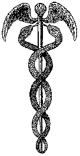

##### The Secret Doctrine by H. P. Blavatsky -- Vol. 1

------------------------------------------------------------------------

###### \[\[Vol. 1, Page\]\] 540 THE SECRET DOCTRINE.

\[\[This page continued from [previous
section](sd1-3-08.md)\]\]

-------

#### IX. THE SOLAR THEORY.

A SHORT ANALYSIS OF THE COMPOUND AND SINGLE ELEMENTS OF SCIENCE AS
AGAINST THE OCCULT TEACHINGS. HOW FAR SCIENTIFIC IS THIS THEORY, AS
GENERALLY ACCEPTED.

**I**N his reply to Dr. Gull's attack on the theory of vitality
(connected inseparably with the Elements of the ancients in the Occult
philosophy), Professor Beale, the great physiologist, has a few words as
suggestive as they are beautiful: --

"There is a mystery in life -- a mystery which has never been fathomed,
and which appears greater, the more deeply the phenomena of life are
studied and contemplated. In living centres -- far more central than the
centres seen by the highest magnifying powers, in centres of living
matter, where the eye cannot penetrate, but towards which the
understanding may tend -- proceed changes of the nature of which the
most advanced physicists and chemists fail to afford us the conception:
*nor is there the slightest reason to think that the nature of these
changes will ever be ascertained by physical investigation*, inasmuch as
they are certainly of an order or nature *totally distinct* from that to
which any other phenomenon known to us can be relegated."

This "mystery," or the origin of the LIFE ESSENCE, Occultism locates in
the same centre as the nucleus of *prima materia* (for they are one) of
our Solar system.

------------------------------------------------------------------------

###### \[\[Vol. 1, Page\]\] 541 THE HEART OF THE SOLAR SYSTEM.

"*The Sun is the heart of the Solar World (System) and its brain is
hidden behind the* (*visible*) *Sun. From thence*, *sensation is
radiated into every nerve*-*centre of the great body*, *and the waves of
the life*-*essence flow into each artery and vein*. . . . *The planets
are its limbs and pulses. . . ." (Commentary.)*

It was stated elsewhere (*in the Theosophist*) that Occult philosophy
denies that the Sun is a globe in combustion, but defines it simply as a
world, a glowing sphere, the *real* Sun being hidden behind, and the
visible being only its reflection, its *shell.* The Nasmyth willow
leaves, mistaken by Sir J. Herschell for "Solar inhabitants," are the
reservoirs of solar vital energy, "the vital electricity that feeds the
whole system. . . . . The Sun *in abscondito* being thus the storehouse
of our little Kosmos, self-generating its vital fluid, and ever
receiving as much as it gives out," and the *visible* Sun only a *window
cut into the real* Solar palace and presence, which reflects, however,
faithfully the interior work.

Thus, there is a regular circulation of the vital fluid throughout our
system, of which the Sun is the heart -- the same as the circulation of
the blood in the human body -- during the manvantaric solar period, or
life; the Sun contracting as rhythmically at every return of it, as the
human heart does. Only, instead of performing the round in a second or
so, it takes the solar blood ten of its years, and a whole year to pass
through its *auricles* and *ventricles* before it washes the *lungs* and
passes thence to the great veins and arteries of the system.

This, Science will not deny, since Astronomy knows of the fixed cycle of
eleven years when the number of solar spots increases,\* *which is due
to the contraction* of the Solar HEART. The universe (our world in this
case) breathes, just as man and every living creature, plant, and even
mineral does upon the earth; and as our globe itself breathes every
twenty-four hours. The dark region is *not* due "to the absorption
exerted by the vapours issuing from the bosom of the sun and interposed
between the observer and the photosphere," as Father Secchi would have
it ("*Le Soleil*" *II.*, 184), nor are the spots formed "by the matter
(heated gaseous matter) which the irruption projects upon the solar
disc" (*ibid*)*.* It is similar to the regular and healthy pulsation of
the heart, as the life fluid passes through its hollow muscles. Could
the human heart be made luminous, and the living and throbbing organ be
made visible, so as to have it reflected upon a screen, such as

###### \[\[Footnote(s)\]\] -------------------------------------------------

\* Not only does it not deny the occurrence, though attributing it to a
wrong cause, as always, each theory contradicting every other, (*see the
theories of Secchi*, *of Faye*, *and of Young*), the spots depending on
the superficial accumulation of vapours cooler than the photosphere (?),
etc., etc., but we have men of science who *astrologize* upon the spots.
Professor Jevons attributes all the great periodical commercial crises
to the influence of the Sun spots every eleventh cyclic year. (*See his*
"*Investigations into Currency and Finance.*") This is worthy of praise
and encouragement surely.

------------------------------------------------------------------------

###### \[\[Vol. 1, Page\]\] 542 THE SECRET DOCTRINE.

used by the astronomers in their lectures -- say for the moon -- then
every one would see the Sun-spot phenomenon repeated every second -- due
to its contraction and the rushing of the blood.

It is said in a work on Geology that it is the *dream of Science* that
"all the recognized chemical elements will one day be found *but
modifications of a single material element.*" ("*World*-*Life*," *p.*
48.)

Occult philosophy has taught this since the existence of human speech
and languages, adding only, on the principle of the immutable law of
analogy -- "as it is above, so it is below" -- that other axiom, that
there is neither Spirit nor matter, in reality, but only numberless
aspects of the One ever-hidden IS (or *Sat*)*.* The homogeneous
primordial Element is *simple* and *single only on the terrestrial
plane* of consciousness and sensation, since matter, after all, is
nothing else than the sequence of our own states of consciousness, and
Spirit an idea of psychic intuition. Even on the next higher plane, that
*single element* which is defined on our earth by current science, as
the ultimate undecomposable constituent of some kind of matter, would be
pronounced in the world of a higher spiritual perception as something
very complex indeed. Our purest water would be found to yield, instead
of its two declared *simple* elements of oxygen and hydrogen, many other
constituents, undreamt of by our terrestrial modern chemistry. As in the
realm of matter, so in the realm of Spirit, the shadow of that which is
cognized on the plane of objectivity exists on that of pure
subjectivity. The speck of the perfectly homogeneous substance, the
sarcode of the Haeckelian *monera*, is now viewed as the *archebiosis*
of terrestrial existence (Mr. Huxley's "protoplasm")\*; and *Bathybius
Haeckelii* has to be traced to its *pre*-terrestrial archebiosis. This
is first perceived by the astronomers at its third stage of evolution,
and in the "secondary creation," so-called. But the students of Esoteric
philosophy understand too well the secret meaning of the stanza: "Brahma
has essentially the *aspect of* prakriti, both evolved and unevolved . .
. . Spirit, O twice-born, (Initiate) is the leading *aspect* of Brahma.
The next is a two-fold aspect -- of Prakriti and Purusha, both evolved
and unevolved; and *time* is the last! *Anu* is one of the names of
Brahma (as distinct from Brahma neuter), and it means "atom": Aniyamsam
aniyasam, "the most atomic of the atomic," the "immutable and
imperishable (achyuta) Purushottama."

Surely, then, the elements now known to us -- be their number whatever
it may -- as they are understood and defined at present, are not,

###### \[\[Footnote(s)\]\] -------------------------------------------------

\* Unfortunately, as these pages are being written the "*archebiosis* of
terrestrial existence" has turned, under a somewhat stricter chemical
analysis, into a simple precipitate of sulphate of lime -- hence from
the scientific standpoint not even an *organic* substance!!! *Sic
transit gloria mundi!*

------------------------------------------------------------------------

###### \[\[Vol. 1, Page\]\] 543 THE QUINTESSENCE OF KOSMOS.

nor can they be, the *primordial* elements. Those were formed from
"*the* *curds of the cold radiant mother*" and "the *fire*-*seed* of the
hot Father" who "*are one*," or, to express it in the plainer language
of modern science, those elements had their genesis in the depths of the
primordial fire-mist -- the masses of incandescent vapour of the
*irresolvable* nebulae; for as Professor Newcomb shows (in his "*Popular
Astronomy*," on page 444), *resolvable* nebulae are not a class of
proper nebulae.

More than half of those which were at first mistaken for nebulae -- he
thinks -- are what he calls "starry clusters." The elements now known,
have arrived at their state of permanency in this 4th Round and 5th
Race. They have a short period of rest before they are propelled once
more on their upward spiritual evolution; when the "living fire of
Orcus" will dissociate the most irresolvable and scatter them into the
primordial ONE -- again.

Meanwhile the Occultist goes further, as has been shown in the
Commentaries on the Seven Stanzas. Hence he can hardly hope for any help
or recognition from science, which will reject both his "aniyamsam
aniyasam" (the absolutely spiritual atom) and his Manasaputras --
"mind-born men." By resolving the "single material element" into one
absolute *irresolvable* element -- Spirit, or "Root-matter," thus
placing it at once outside the reach and province of physical philosophy
-- he has, of course but little in common with the orthodox men of
science. He maintains that Spirit and Matter are two FACETS of the
unknowable UNITY, their apparently contrasted aspects depending, (*a*)
on the various degrees of differentiation of the latter, and (*b*) on
the grades of consciousness attained by man himself. This is, however,
metaphysics, and has little to do with physics -- however great in its
own terrestrial limitation that physical *philosophy* may now be.

Nevertheless, once that Science admits, if not the actual existence, at
any rate, the possibility of the existence, of a Universe with its
numberless forms, conditions, and aspects built out of a "single
Substance,"\* it has

###### \[\[Footnote(s)\]\] -------------------------------------------------

\* In his "World-Life" -- page 48 -- in the appended foot notes,
Professor Winchell says: -- "It is generally admitted that at
excessively high temperatures matter exists in a state of dissociation
-- that is, no chemical combination can exist;" and would appeal, to
prove the unity of matter, to the spectrum, which in every case of
homogeneity will show a *bright* line, whereas in the case of several
molecular arrangements existing -- in the nebulae say, or a star -- "the
spectrum should consist of two or three bright lines!" This would be no
proof either way to the physicist-Occultist, who maintains that beyond a
certain limit of *visible* matter, no spectrum, no telescope and no
microscope are of any use. The unity of matter, of that which is real
cosmic matter to the Alchemist, or "Adam's Earth" as the Kabalists call
it, can hardly be proved or disproved, by either the French *savant*
Dumas, who suggests "the composite nature of the "elements" on certain
relations of atomic weights," or even by Mr. Crookes's "radiant matter,"
though his experiments may seem \[\[Footnote continued on next page\]\]

------------------------------------------------------------------------

###### \[\[Vol. 1, Page\]\] 544 THE SECRET DOCTRINE.

to go further. Unless it also admits the possibility of One Element, or
the ONE LIFE of the Occultists. It will have to hang up that "single
substance," especially if limited to only the solar nebulae, like the
coffin of Mahomet, in mid air, though minus the attractive magnet that
sustains that coffin. Fortunately for the speculative physicists, if
unable to state with any degree of precision what the nebular theory
*does* imply, we have, thanks to Professor Winchell, and several
disagreeing astronomers, been able to learn what *it does not*
imply*.*\* (*Vide Supra.*)

Unfortunately, this is far from clearing even the most simple of the
problems that have vexed, and still do vex, the men of learning in their
research after truth. We have to proceed with our inquiries, starting
with the earliest hypotheses of modern science, if we would discover
*where* and *why* it sins. Perchance it may be found that Stallo is
right, after all. That the blunders, contradictions, and fallacies made
by the most eminent men of learning are simply due to their abnormal
attitude. They are, and want to remain materialistic *quand meme*, and
yet "the general principles of the atomo-mechanical theory -- the basis
of modern physics -- are *substantially identical* with the cardinal
doctrines of ontological metaphysics." Thus, "the fundamental errors of
ontology become apparent in proportion to the advance of physical
Science." (Int. p. VI., "Concepts of Modern Physics.") Science is
honeycombed with metaphysical conceptions, but the Scientists will not
admit the charge and fight desperately to put atomo-mechanical masks on
purely incorporeal and spiritual laws in nature, on our plane --
refusing to admit their substantiality even on other planes, the bare
existence of which they reject *a priori.*

It is easy to show, however, how Scientists, wedded to their
materialistic views, have endeavoured, ever since the day of Newton, to
put false masks on fact and truth. But their task is becoming with every
year more difficult; and with every year also, Chemistry, above all the
other sciences, approaches nearer and nearer the realm of the Occult in
nature. It is assimilating the very truths taught by the Occult Sciences

###### \[\[Footnote(s)\]\] -------------------------------------------------

\[\[Footnote continued from previous page\]\] "to be best understood on
the hypothesis of the homogeneity of the elements of matter, and the
continuity of the states of matter." For all this does not go beyond
MATERIAL matter, so to say, even in what is shown by the *spectrum*,
that modern "eye of Siva" of physical experiments. It is of this matter
only, that H. St. Claire Deville could say that "when bodies, deemed to
be simple, combine with one another, they vanish, they are *individually
annihilated*"*;* simply because he could not follow those bodies in
their further transformation in the world of *spiritual* cosmic matter.
Verily modern science will never be able to dig deep enough into the
cosmological formations to find the *roots* of the world-stuff or
matter, unless she works on the same lines of thought as the medieval
alchemist did.

\* "World-Life," Ibid.

------------------------------------------------------------------------

###### \[\[Vol. 1, Page\]\] 545 THE ORIGINAL BASE.

for ages, but hitherto bitterly derided. "Matter is eternal," says the
Esoteric Doctrine. But the matter the Occultists conceive of in its
*laya*, or *zero state*, is not the matter of modern science; not even
in its most rarefied gaseous state. Mr. Crookes' "radiant matter" would
appear matter of the grossest kind in the realm of the beginnings, as it
becomes pure spirit before it has returned back even to its first point
of differentiation. Therefore, when the adept or alchemist adds that,
though matter is eternal, for it is **P**RADHANA, yet atoms *are born at
every new manvantara*, or reconstruction of the universe, it is no such
contradiction as a materialist, who believes in nothing beyond the atom,
might think. There is a difference between *manifested* and
*unmanifested* matter, between *pradhana*, the beginningless and endless
cause, and *prakriti*, or the manifested effect. Says the sloka; --

"That which is the unevolved cause is emphatically called by the most
eminent sages, *pradhana*, *original base*, *which is* subtile
*prakriti*, *viz.*, that which is eternal, and which at once is, and is
not, *a mere process.*"\*

That which in modern phraseology is respectively referred to as Spirit
and Matter, is ONE in eternity as the perpetual cause, and it is neither
Spirit nor matter, but IT -- rendered in Sanskrit TAD ("that"), -- all
that is, was, or will be, all that the imagination of man is capable of
conceiving. Even the exoteric Pantheism of Hinduism renders it as no
monotheistic philosophy ever did, for in superb phraseology its
cosmogony begins with the well-known words: --

"There was neither day nor night, neither heaven nor earth, neither
darkness nor light. And there was not ought else apprehensible by the
senses or by the mental faculties. There was then one Brahma,
essentially *prakriti* (Nature) and Spirit. For *the two aspects* of
Vishnu which are other than his supreme essential aspect are prakriti
and Spirit, and Brahman. *When these two other* ASPECTS *of his no
longer subsist*, *but are dissolved*, then that aspect whence form and
the rest, *i.e.*, *creation*, proceed *anew*, is denominated time, O
twice-born."

It is that which is dissolved, or the illusionary *dual* aspect of That,
the essence of which is eternally ONE, that we call eternal matter or
Substance (Vide in Part II*.*, "*Primordial Substance and Divine
Thought*"), formless, sexless, inconceivable, even to our *sixth* sense
or mind,\*\* in which, therefore, we refuse to see that which
Monotheists call a *personal*, anthropomorphic God.

How are these two propositions -- "that matter is eternal," and "the
atom periodical, and not eternal" -- viewed by modern exact Science? The
materialistic physicist will criticize and laugh them to scorn. The

###### \[\[Footnote(s)\]\] -------------------------------------------------

\* Book I. ch. II. *Vishnu Purana*, Fitzedward Hall's Translation.

\*\* *Vide* preceding Section **IX**., "Life, Force, and Gravity,"
quotation from *Anugita*.

------------------------------------------------------------------------

###### \[\[Vol. 1, Page\]\] 546 THE SECRET DOCTRINE.

liberal and progressive man of Science, however, the true and earnest
scientific searcher after truth -- *e.g*., the eminent chemist, Mr.
Crookes, will corroborate the *probability* of the two statements. For,
hardly has the echo of his lecture on the "Genesis of the Elements" died
away --the lecture which, delivered by him before the Chemical Section
of the British Association, at the last Birmingham meeting, so startled
every evolutionist who heard or read it -- than there came another one
in March last, 1888. Once more the President of the Chemical Society
brings before the world of Science and the public the fruits of some new
discoveries in the realm of atoms, and these discoveries justify the
occult teachings in every way. They are more startling even than the
statements made by him in the first lecture (quoted later) and deserve
well the attention of every Occultist, Theosophist, and Metaphysician.
This is what he says in his "Elements and *Meta*-Elements," thus
justifying Stallo's charges and prevision with the fearlessness of a
scientific mind which loves science for truth's sake, regardless of any
consequences to his own glory and reputation. We quote his own words:

> Permit me, gentlemen, now to draw your attention for a short time to a
> subject which concerns the fundamental principles of chemistry, a
> subject which may lead us to admit the possible existence of bodies
> which, though neither compounds nor mixtures, are not elements in the
> strictest sense of the word -- bodies which I venture to call
> "meta-elements." To explain my meaning it is necessary for me to
> revert to our conception of an element. What is the criterion of an
> element? Where are we to draw the line between distinct existence and
> identity? No one doubts that oxygen, sodium, chlorine, sulphur are
> separate elements; and when we come to such groups as chlorine,
> bromine, iodine, &c., we still feel no doubt, although were degrees of
> "elementicity" admissible -- and to that we may ultimately have to
> come -- it might be allowed that chlorine approximates much more
> closely to bromine than to oxygen, sodium, or sulphur. Again, nickel
> and cobalt are near to each other, very near, though no one questions
> their claim to rank as distinct elements. Still I cannot help asking
> what would have been the prevalent opinion among chemists had the
> respective solutions of these bodies and their compounds presented
> identical colours, instead of colours which, approximately speaking,
> are mutually complementary. Would their distinct nature have even now
> been recognised? When we pass further and come to the so-called rare
> earths the ground is less secure under our feet. Perhaps we may admit
> scandium, ytterbium, and others of the like sort to elemental rank;
> but what are we to say in the case of praseo- and neo-dymium, between
> which there may be said to exist no well-marked chemical difference,
> their chief claim to separate individuality being slight differences
> in basicity and crystallizing powers, though their physical
> distinctions, as shown by spectrum observations, are very strongly
> marked? Even here we may imagine the disposition of the majority of
> chemists would incline toward the side of leniency, so that they would
> admit these two bodies within the charmed circle. Whether in so doing
> they would be able to appeal to any broad principle is an open
> question. If we admit these candidates

------------------------------------------------------------------------

###### \[\[Vol. 1, Page\]\] 547 OCCULT CHEMISTRY.

> how in justice are we to exclude the series of elemental bodies or
> meta-elements made known to us by Kruss and Nilson? Here the spectral
> differences are well marked, while my own researches on didymium show
> also a slight difference in basicity between some at least of these
> doubtful bodies. In the same category must be included the numerous
> separate bodies into which it is probable that yttrium, erbium,
> samarium, and other "elements" -- commonly so-called -- have been and
> are being split up. Where then are we to draw the line? The different
> groupings shade off so imperceptibly the one into the other that it is
> impossible to erect a definite boundary between any two adjacent
> bodies and to say that the body on this side of the line is an
> element, while the one on the other side is non-elementary, or merely
> something which simulates or approximates to an element. Wherever an
> apparently reasonable line might be drawn it would no doubt be easy at
> once to assign most bodies to their proper side, as in all cases of
> classification the real difficulty comes in when the border-line is
> approached. Slight chemical differences, of course, are admitted, and,
> up to a certain point, so are well-marked physical differences. What
> are we to say, however, when the only chemical difference is an almost
> imperceptible tendency for the one body -- of a couple or of a group
> -- to precipitate before the other? Again, there are cases where the
> chemical differences reach the vanishing point, although well-marked
> physical differences still remain. Here we stumble on a new
> difficulty: in such obscurities what is chemical and what is physical?
> Are we not entitled to call a slight tendency of a nascent amorphous
> precipitate to fall down in advance of another a "physical
> difference?" And may we not call coloured reactions depending on the
> amount of some particular acid present and varying, according to the
> concentration of the solution and to the solvent employed, "chemical
> differences?" I do not see how we can deny elementary character to a
> body which differs from another by well-marked colour, or
> spectrum-reactions, while we accord it to another body whose only
> claim is a very minute difference in basic powers. Having once opened
> the door wide enough to admit some spectrum differences, we have to
> inquire how minute a difference qualifies the candidate to pass? I
> will give instances from my own experience of some of these doubtful
> candidates.

And here the great chemist gives several cases of the very extraordinary
behaviour of molecules and earths, apparently the same, and which yet,
when examined very closely, were found to exhibit differences which,
however imperceptible, still show that none of them are *simple* bodies,
and that the 60 or 70 elements accepted in chemistry, can no longer
cover the ground. Their name, apparently, is legion, but as the
so-called "periodic theory" stands in the way of an unlimited
multiplication of elements, Mr. Crookes is obliged to find some means of
reconciling the new discovery with the old theory. "That theory," he
says: --

> "Has received such abundant verification that we cannot lightly accept
> any interpretation of phenomena which fails to be in accordance with
> it. But if we suppose the elements reinforced by a vast number of
> bodies slightly differing from each other in their properties, and
> forming, if I may use the expression,

------------------------------------------------------------------------

###### \[\[Vol. 1, Page\]\] 548 THE SECRET DOCTRINE.

> aggregations of nebulae where we formerly saw, or believed we saw,
> separate stars, the periodic arrangement can no longer be definitely
> grasped. No longer, that is, if we retain our usual conception of an
> element. Let us, then, modify this conception. For "element" read
> "elementary group" -- such elementary groups taking the place of the
> old elements in the periodic scheme -- and the difficulty falls away.
> In defining an element, let us take not an external boundary, but an
> internal type. Let us say, *e.g.*, the smallest ponderable quantity of
> yttrium is an assemblage of ultimate atoms almost infinitely more like
> each other than they are to the atoms of any other approximating
> element. It does not necessarily follow that the atoms shall all be
> absolutely alike among themselves. The atomic weight which we ascribed
> to yttrium, therefore, merely represents a mean value around which the
> actual weights of the individual atoms of the "element" range within
> certain limits. But if my conjecture is tenable, could we separate
> atom from atom, we should find them varying within narrow limits on
> each side of the mean. The very process of fractionation implies the
> existence of such differences in certain bodies."

Thus fact and truth have once more forced the hand of "exact" Science,
and compelled it to enlarge its views and change its terms which,
masking the multitude, reduced them to one body -- like the Septenary
Elohim and their hosts transformed by the materialistic religionists
into one Jehovah. Replace the chemical terms "Molecule," "atom,"
"particle," etc., by the words "Hosts," "Monads," "Devas," etc., and one
might think the genesis of gods, the primeval evolution of manvantaric
*intelligent* Forces, was being described. But the learned lecturer adds
something still more suggestive to his descriptive remarks; whether
consciously or unconsciously, who knoweth? For he says the following: --

> "Until lately such bodies passed muster as elements. They had definite
> properties, chemical and physical; they had recognised atomic weights.
> If we take a pure dilute solution of such a body, yttrium for
> instance, and if we add to it an excess of strong ammonia, we obtain a
> precipitate which appears perfectly homogeneous. But if instead we add
> very dilute ammonia in quantity sufficient only to precipitate
> one-half of the base present, we obtain no immediate precipitate. If
> we stir up the whole thoroughly so as to insure a uniform mixture of
> the solution and the ammonia, and set the vessel aside for an hour,
> carefully excluding dust, we may still find the liquid clear and
> bright, without any vestige of turbidity. After three or four hours,
> however, an opalescence will declare itself, and the next morning a
> precipitate will have appeared. Now let us ask ourselves, What can be
> the meaning of this phenomenon? The quantity of precipitant added was
> insufficient to throw down more than half the yttria present,
> therefore a process akin to selection has been going on for several
> hours. The precipitation has *evidently not been effected at random*,
> those molecules of the base being decomposed which happened to come in
> contact with a corresponding molecule of ammonia, for we have taken
> care that the liquids should be uniformly mixed, so that one molecule
> of the original salt would not be more exposed to decomposition

------------------------------------------------------------------------

###### \[\[Vol. 1, Page\]\] 549 MONADS AND ATOMS.

> than any other. If, further, we consider the time which elapses before
> the appearance of a precipitate, we *cannot avoid coming to the
> conclusion that the action which has been going on for the first few
> hours is of a selective character*. The problem is not why a
> precipitate is produced, but what determines or directs some atoms to
> fall down and others to remain in solution. Out of the multitude of
> atoms present, *what power is it that directs each atom to choose the
> proper path? We may picture to ourselves some directive force passing
> the atoms one by one in review, selecting one for precipitation and
> another for solution till all have been adjusted*."

The italics in the above passage are ours. Well may a man of science ask
himself, "What power is it that directs each atom," and what is it that
its character should be *selective?* Theists would solve the question by
answering "God"; and would solve nothing philosophically. Occultism
answers on its own pantheistic grounds, and refers the reader to a
subsequent section, "*Gods*, *Monads*, *and Atoms.*" The learned
lecturer sees in it that which is his chief concern: the finger-posts
and the traces of a path which may lead to the discovery, and the full
and complete demonstration of an homogeneous element in nature. He
remarks: --

> "In order that such a selection can be effected there evidently must
> be some slight differences between which it is possible to select, and
> this difference almost certainly must be one of basicity, so slight as
> to be imperceptible by any test at present known, but susceptible of
> being nursed and encouraged to a point when the difference can be
> appreciated by ordinary tests."

Occultism, which knows of the existence and presence in Nature of the
One eternal element at the first differentiation of which the roots of
the tree of life are periodically struck, needs no scientific proofs. It
says: -- Ancient Wisdom has solved the problem ages ago. Aye; earnest,
as well as mocking reader, Science is slowly but as surely approaching
our domains of the Occult. It is forced by its own discoveries to adopt
*nolens volens* our phraseology and symbols. Chemical Science is now
compelled, by the very force of things, to accept even our illustration
of the evolution of the gods and atoms, so suggestively and undeniably
figured in the caduceus of Mercury, the God of Wisdom, and in the
allegorical language of the Archaic Sages. Says a commentary in the
esoteric doctrine: --

. . . . *The trunk of the* **A**SVATTHA (*the tree of Life and Being*,
*the* ROD *of the caduceus*) *grows from and descends at every
Beginning* (*every new manvantara*) *from the two dark wings of the
Swan* (**H**ANSA) *of Life. The two Serpents*, *the ever*-*living and
its illusion* (*Spirit and matter*) *whose two heads grow from the one
head between the wings*, *descend along the trunk*, *interlaced in close
embrace. The two tails join on earth* (*the manifested Universe*) *into
one*, *and this is the great illusion*, *O Lanoo!*"

------------------------------------------------------------------------

###### \[\[Vol. 1, Page\]\] 550 THE SECRET DOCTRINE

Every one knows what the caduceus is, already modified by the Greeks.
The original symbol -- with the triple head of the serpent -- became
altered into a rod with a knob, and the two lower heads were separated,
thus disfiguring somewhat the original meaning. Yet it is as good an
illustration as can be for our purpose, this laya rod entwined by two
serpents. Verily the wonderful powers of the magic caduceus were sung by
all the ancient poets, with a very good reason for those who understood
the secret meaning.

Now what says the learned President of the Chemical Society of Great
Britain, in that same lecture, which has any reference to, or bearing
upon, our above-mentioned doctrine. Very little; only this -- and
nothing more: --

> "In the Birmingham address already referred to I asked my audience to
> picture the action of two forces on the original protyle --- one being
> time, accompanied by a lowering of temperature; the other, swinging to
> and fro like a mighty pendulum, having periodic cycles of ebb and
> swell, rest and activity, being intimately connected with the
> imponderable matter, essence, or source of energy we call electricity.
> Now, a simile like this effects its object if it fixes in the mind the
> particular fact it is intended to emphasize, but it must not be
> expected necessarily to run parallel with all the facts. Besides the
> lowering of temperature with the periodic ebb and flow of electricity,
> positive or negative, requisite to confer on the newly-born elements
> their particular atomicity, it is evident that a third factor must be
> taken into account. Nature does not act on a flat plane; she demands
> space for her cosmogenic operations, and if we introduce space as the
> third factor, all appears clear. Instead of a pendulum, which, though
> to a certain extent a good illustration, is impossible as a fact, let
> us seek some more satisfactory way of representing what I conceive may
> have taken place. Let us suppose the zigzag diagram not drawn upon a
> plane, but projected in space of three dimensions. What figure can we
> best select to meet all the conditions involved? Many of the facts can
> be well explained by supposing the projection in space of Professor
> Emerson Reynolds' zigzag curve to be a spiral. This figure is,
> however, inadmissible, inasmuch as the curve has to pass through a
> point neutral as to electricity and chemical energy twice in each
> cycle. We must, therefore, adopt some other figure. A figure of eight
> (8), or lemniscate, will foreshorten into a zigzag just as well as a
> spiral, and it fulfils every condition of the problem."

A *lemniscate* for the evolution downward, from Spirit into matter;

------------------------------------------------------------------------

###### \[\[Vol. 1, Page\]\] 551 THE CADUCEUS OF LIFE.

another form of a *spiral*, perhaps, in its *reinvolutionary* path
onward, from matter into Spirit, and the necessary gradual and final
reabsorption into the *laya* state, that which Science calls in her own
way "the point neutral as to electricity" etc., or the *zero* point.
Such are the Occult facts and statement. They may be left with the
greatest security and confidence to Science, to be justified some day.
Let us hear some more, however, about this primordial genetic type of
the symbolical caduceus.

> "Such a figure will result from three very simple simultaneous
> motions. First, a simple oscillation backwards and forwards (suppose
> east and west); secondly, a simple oscillation at right angles to the
> former (suppose north and south) of half the periodic time -- *i.e.*,
> twice as fast; and thirdly, a motion at right angles to these two
> (suppose downwards), which, in its simplest form, would be with
> unvarying velocity. If we project this figure in space we find on
> examination that the points of the curves, where chlorine, bromine,
> and iodine are formed, come close under each other; so also will
> sulphur, selenium, and tellurium; again, phosphorus, arsenic, and
> antimony; and in like manner other series of analogous bodies. It may
> be asked whether this scheme explains how and why the elements appear
> in this order? Let us imagine a cyclical translation in space, each
> evolution witnessing the genesis of the group of elements which I
> previously represented as produced during one complete vibration of
> the pendulum. Let us suppose that one cycle has thus been completed,
> the centre of the unknown creative force in its mighty journey through
> space having scattered along its track the primitive atoms -- the
> seeds, if I may use the expression -- which presently are to coalesce
> and develop into the groupings now known as lithium, beryllium, boron,
> carbon, nitrogen, oxygen, fluorine, sodium, magnesium, aluminium,
> silicon, phosphorus, sulphur, and chlorine. What is most probably the
> form of track now pursued? Were it strictly confined to the same plane
> of temperature and time, the next elementary groupings to appear would
> again have been those of lithium, and the original cycle would have
> been eternally repeated, producing again and again the same 14
> elements. The conditions, however, are not quite the same. Space and
> electricity are as at first, but temperature has altered, and thus,
> instead of the atoms of lithium being supplemented with atoms in all
> respects analogous with themselves, the atomic groupings which come
> into being when the second cycle commences form, not lithium, but its
> lineal descendant, potassium. Suppose, therefore, the *vis generatrix*
> travelling to and fro in cycles along a lemniscate path, as above
> suggested, while simultaneously temperature is declining and time is
> flowing on -- variations which I have endeavoured to represent by the
> downward sink -- each coil of the lemniscate track crosses the same
> vertical line at lower and lower points. Projected in space, the curve
> shows a central line neutral as far as electricity is concerned, and
> neutral in chemical properties -- positive electricity on the north,
> negative on the south. Dominant atomicities are governed by the
> distance east and west from the neutral centre line, monatomic
> elements being one remove from it, diatomic two removes, and so on. In
> every successive coil the same law holds good."

And, as if to prove the postulate of Occult Science and Hindu philos-

------------------------------------------------------------------------

###### \[\[Vol. 1, Page\]\] 552 THE SECRET DOCTRINE.

ophy, that, at the hour of the Pralaya, the two *aspects* of the
unknowable deity, "the Swan in darkness" -- Prakriti and Purusha, nature
or matter in all its forms and Spirit -- "no longer subsist but are
(*absolutely*) dissolved," we learn the conclusive scientific opinion of
the great English chemist, who caps his proofs by saying: -- "We have
now traced the formation of the chemical elements from knots and voids
in a primitive, formless fluid. We have shown the possibility, nay, the
probability that the atoms are not eternal in existence, but share with
all other created beings the attributes of decay and death."

Occultism says *amen* to this, as the Scientific "possibility" and
"probability" are for it facts demonstrated beyond the necessity of
further proof or any extraneous physical evidence. Nevertheless, it
repeats with as much assurance as ever: "MATTER IS ETERNAL, becoming
atomic (its aspect) only periodically." This is as sure as that the
other proposition, which is almost unanimously accepted by astronomers
and physicists -- namely, that the wear and tear of the body of the
Universe is steadily going on, and that it will finally lead to the
extinction of the Solar fires and the destruction of the Universe -- is
quite erroneous on the lines traced by Men of Science. There will be, as
there ever were in time and eternity, periodical dissolutions of the
manifested Universe, but (*a*) a partial *pralaya* after every "Day of
Brahma;" and (*b*) an Universal pralaya -- the **M**AHA-PRALAYA -- only
after the lapse of every Brahma's age. But the scientific causes for
such dissolution, as brought forward by exact Science, have nothing to
do with the true causes. However that may be, Occultism is once more
justified by Science, for Mr. Crookes said: --

> "We have shown, from arguments drawn from the chemical laboratory,
> that in matter which has responded to every test of an element, there
> are minute shades of difference which may admit of selection. We have
> seen that the time-honoured distinction between elements and compounds
> no longer keeps pace with the developments of chemical science, but
> must be modified to include a vast array of intermediate bodies --
> "meta-elements." We have shown how the objections of Clerk-Maxwell,
> weighty as they are, may be met; and finally, we have adduced reasons
> for believing that primitive matter was formed by the act of a
> generative force, throwing off at intervals of time atoms endowed with
> varying quantities of primitive forms of energy. If we may hazard any
> conjectures as to the source of energy embodied in a chemical atom, we
> may, I think, premise that the heat radiations propagated outwards
> through the ether from the ponderable matter of the universe, by some
> process of nature not yet known to us, are transformed at the confines
> of the universe into the primary -- the essential -- motions of
> chemical atoms, which, the instant they are formed, gravitate inwards,
> and thus restore to the universe the energy which otherwise would be
> lost to it through radiant heat. If this conjecture be well founded,
> Sir William Thomson's *startling prediction of the final decrepitude
> of the universe through the dissipation of its energy falls to the
> ground.* In this

------------------------------------------------------------------------

###### \[\[Vol. 1, Page\]\] 553 TRUE SIGNS OF THE TIMES.

> fashion, gentlemen, it seems to me that the question of the elements
> may be provisionally treated. Our slender knowledge of these first
> mysteries is extending steadily, surely, though slowly."

By a strong and curious coincidence even our "septenary" doctrine seems
to force the hand of Science. If we understand rightly, Chemistry speaks
of fourteen groupings of primitive atoms -- lithium, beryllium, boron,
carbon, nitrogen, oxygen, fluorine, sodium, magnesium, aluminium,
silicon, phosphorus, sulphur and chlorine; and Mr. Crookes, speaking of
the "dominant atomicities," enumerates seven groups of these, for he
says: --

> "As the mighty focus of creative energy goes round, we see it in
> successive cycles sowing in one tract of space seeds of lithium,
> potassium, rubidium, and caesium; in another tract, chlorine, bromine,
> and iodine; in a third, sodium, copper, silver, and gold; in a fourth,
> sulphur, selenium, and tellurium; in a fifth, beryllium, calcium,
> strontium, and barium; in a sixth, magnesium, zinc, cadmium, and
> mercury; in a seventh, phosphorus, arsenic, antimony, and bismuth" --
> which makes seven groupings on the one hand. And after showing "in
> other tracts the other elements -- namely, aluminium, gallium, indium,
> and thallium; silicon, germanium, and tin; carbon, titanium, and
> zirconium."

He adds: "While a natural position near the neutral axis is found for
the three groups of elements relegated by Professor Mendeleeff to a sort
of Hospital for Incurables -- his eighth family." It might be
interesting to compare these "seven of the eighth family of
'incurables'" with the allegories concerning the seven primitive sons of
"Mother, Infinite Space," or Aditi, and the *eighth* son rejected by
her. Many a strange coincidence may thus be found between "those
intermediate links . . . named 'meta-elements or elementoids and those
whom occult science names their *noumenoi*,' the intelligent minds and
rulers of those groupings of Monads and Atoms. But this would lead us
too far. Let us be content with finding the confession of the fact that
"this deviation from absolute homogeneity should mark the constitution
of these molecules or aggregations of matter which we designate elements
and will perhaps be clearer if we return in imagination to the earliest
dawn of our material universe, and, face to face with the Great Secret,
try to consider the processes of elemental evolution." Thus finally
Science, in the person of its highest representatives, in order to make
itself clearer to the profane, adopts the phraseology of such old adepts
as Roger Bacon, and returns to the "protyle." All this is hopeful and
suggestive of the "signs of the times."

Indeed these "signs" are many and multiply daily; but none are more
important than those just quoted. For now the chasm between the occult
"superstitious and *unscientific*" teachings and "exact" science is
completely bridged, and one, at least, of the few eminent chemists of
the day is in the realm of the infinite possibilities of occultism.
Every new

------------------------------------------------------------------------

###### \[\[Vol. 1, Page\]\] 554 THE SECRET DOCTRINE.

step he will take will bring him nearer and nearer to that mysterious
centre, from which radiate the innumerable paths that lead down Spirit
into matter, and which transform the gods and the living monads into man
and sentient nature.

But we have something more to say on this subject in the following
section.

-------

\[\[This page continued in next section\]\]

------------------------------------------------------------------------

[Next Section](sd1-3-10.md)

[Contents](sd1-0-co.htm#contents.md)
