##### The Secret Doctrine by H. P. Blavatsky -- Vol. 2

------------------------------------------------------------------------

###### \[\[Vol. 2, Page\]\] 109 THE TABULA SMARAGDINA.

#### STANZA V. THE EVOLUTION OF THE SECOND RACE.

-------

> §§ (18) The Sons of Yoga. (19) The Sexless Second Race. (20) The Sons
> of the Sons of Twilight. (21) The "Shadow," or the Astral Man, retires
> within, and man develops a physical body.

---------------------

18\. **T**HE FIRST (*Race*) WERE THE **S**ONS OF **Y**OGA. **T**HEIR
SONS, THE CHILDREN OF THE **Y**ELLOW **F**ATHER AND THE **W**HITE
**M**OTHER.

In the later Commentary, the sentence is translated: --

"*The Sons of the Sun and of the Moon, the nursling of ether* (or the
wind ) (*a*) . . . . . . .

"*They were the shadows of the shadows of the Lords* (*b*)*. They* (the
shadows) *expanded. The Spirits of the Earth clothed them*; *the solar
Lhas warmed them* (*i.e.* preserved the vital fire in the nascent
physical forms). *The Breaths had life, but had no understanding. They
had no fire nor water of their own* (*c*)*.*

(*a*) Remember in this connection the *Tabula Smaragdina* of Hermes, the
esoteric meaning of which has seven keys to it. The Astro-Chemical is
well known to students, the anthropological may be given now. The "One
thing" mentioned in it is MAN. It is said: "The Father of THAT ONE ONLY
THING is the Sun; its Mother the Moon; the Wind carries it in his bosom,
and its nurse is the Spirituous Earth." In the occult rendering of the
same it is added: "and *Spiritual* Fire is its instructor (Guru)."

This fire is the higher Self, the Spiritual Ego, or that which is
eternally reincarnating under the influence of its lower personal
Selves, changing with every re-birth, full of *Tanha* or desire to live.
It is a strange law of Nature that, on this plane, the higher
(Spiritual) Nature should be, so to say, in bondage to the lower. Unless
the Ego takes refuge in the Atman, the ALL-SPIRIT, and merges entirely
into the essence thereof, the personal Ego may goad it to the bitter
end. This cannot be thoroughly understood unless the student makes
himself familiar with the mystery of evolution, which proceeds on triple
lines -- spiritual, psychic and physical.

That which propels towards, and forces evolution, *i.e.*, compels the
growth and development of Man towards perfection, is (a) the MONAD,

------------------------------------------------------------------------

###### \[\[Vol. 2, Page\]\] 110 THE SECRET DOCTRINE.

or that which acts in it unconsciously through a force inherent in
itself; and (b) the lower astral body or the *personal* SELF. The
former, whether imprisoned in a vegetable or an animal body, is endowed
with, is indeed itself, that force. Owing to its identity with the
ALL-FORCE, which, as said, is inherent in the Monad, it is all-potent on
the *Arupa,* or formless plane. On our plane, its essence being too
pure, it remains all-potential, but individually becomes inactive:
*e.g.*, the rays of the Sun, which contribute to the growth of
vegetation, do not select this or that plant to shine upon. Uproot the
plant and transfer it to a piece of soil where the sunbeam cannot reach
it, and the latter will not follow it. So with the Atman: unless the
higher Self or EGO gravitates towards its Sun the Monad -- the lower
*Ego,* or *personal* Self, will have the upper hand in every case. For
it is this Ego, with its fierce Selfishness and animal desire to live a
Senseless life (*Tanha*)*,* which is "the maker of the tabernacle," as
Buddha calls it in *Dhammapada* (153 and 154). Hence the expression,
"the Spirits of the Earth clothed the shadows and expanded them." To
these "Spirits" belong temporarily the human astral selves; and it is
they who give, or build, the physical tabernacle of man, for the Monad
and its conscious principle, Manas, to dwell in. But the "Solar" *Lhas,*
Spirits, warm them, the shadows. This is physically and literally true;
metaphysically, or on the psychic and spiritual plane, it is equally
true that the Atman alone *warms* the inner man; *i.e.*, it enlightens
it with the ray of divine life and alone is able to impart to the inner
man, or the reincarnating Ego, its immortality. Thus, as we shall find,
for the first three and a half Root-Races, up to the middle or turning
point, it is the astral shadows of the "progenitors," the lunar Pitris,
which are the formative powers in the Races, and which build and
gradually force the evolution of the physical form towards perfection --
this, at the cost of a proportionate loss of spirituality. Then, from
the turning point, it is the Higher Ego, or incarnating principle, the
*nous* or *Mind,* which reigns over the animal Ego, and rules it
whenever it is not carried down by the latter. In short, Spirituality is
on its ascending arc, and the animal or physical impedes it from
steadily progressing on the path of its evolution only when the
selfishness of the *personality* has so strongly infected the real
*inner* man with its lethal *virus,* that the upward attraction has lost
all its power on the thinking reasonable man. In sober truth, vice and
wickedness are an *abnormal, unnatural* manifestation, at this period of
our human evolution -- at least they ought to be so. The fact that
mankind was never more selfish and vicious than it is now, civilized
nations having succeeded in making of the first an ethical
characteristic, of the second an art, is an additional proof of the
exceptional nature of the phenomenon.

------------------------------------------------------------------------

###### \[\[Vol. 2, Page\]\] 111 THE SHELLS OF SHEBA HACHALOTH.

The entire scheme is in the "*Chaldean Book of Numbers,*" and even in
the *Zohar,* if one only understood the meaning of the apocalyptic
hints. First comes En-Soph, the "Concealed of the Concealed," then the
*Point,* Sephira and the later Sephiroth; then the *Atzilatic* World, a
*World of Emanations* that gives birth to three other worlds -- called
the Throne, the abode of pure Spirits; the second, the *World of
Formation,* or Jetzira, the habitat of the Angels who sent forth the
Third, or World of Action, the Asiatic *World,* which is the Earth or
*our* World; and yet it is said of it that this world, also called
*Kliphoth,* containing the (six other) Spheres, \[\[diagram\]\], and
matter, is the residence of the "Prince of Darkness." This is as clearly
stated as can be; for *Metatron,* the Angel of the second or *Briatic*
World, means Messenger \[greek char\], Angel, called the great Teacher;
and under him are the Angels of the third World, *Jetzira,* whose ten
and seven classes are the *Sephiroth,\** of whom it is said that "they
inhabit and vivify this world as Essential *Entities* and
*Intelligences,* whose *correlatives* and *contraries* inhabit the third
or *Asiatic World.*" These "Contraries" are called "the *Shells,*"
\[\[daigam\]\], or *demons,\*\** who inhabit the seven habitations
called *Sheba Hachaloth,* which are simply the seven zones of our globe.
Their prince is called in the Kabala Samael, the Angel of Death, who is
also the seducing serpent Satan; but that Satan is also Lucifer, the
bright angel of Light, the *Light* and *Life-bringer,* the "Soul"
alienated from the Holy *Ones,* the other angels, and for a period,
*anticipating the time* when they would have descended on Earth to
incarnate in their turn.

"The *Souls* (Monads) are pre-existent in the world of Emanations,"
(*Book of Wisdom* viii., 20); and the *Zohar* teaches that in the "Soul"
"is the *real man, i.e.,* the Ego and the conscious I AM: '*Manas.*' "

"They descend from the pure air to be *chained to bodies,*" says
Josephus repeating the belief of the Essenes (*De Bello Judaeo,* 11,
12)*.* "The air is full of Souls," states Philo, "*they descend to be
tied to mortal bodies, being desirous to live in them.*" (*De Gignat,*
222 c.; *De Somniis,* p. 455)\*\*\*; because through, and in, the human
form they will become *progressive* beings, whereas the nature of the
angel is purely *intransitive,* therefore man has in him the potency of
transcending the faculties of the Angels. Hence the Initiates in India
say that it is the Brahmin, the twice-born, who rules the gods or devas;
and Paul repeated it in

###### \[\[Footnote(s)\]\] -------------------------------------------------

\* See Vol. 1. Part III., "*Gods, Monads and Atoms.*" It is symbolised
in the Pythagorean Triangle, the 10 dots within, and the seven points of
the Triangle and the Cube.

\*\* Whence the Kabalistic name of *Shells* given to the astral form,
the body called *Kama Rupa,* left behind by the higher angels in the
shape of the higher *Manas,* when the latter leaves for Devachan,
forsaking its residue.

\*\*\* Which shows that the Essenes believed in re-birth and many
reincarnations on Earth, as Jesus himself did, a fact we can prove from
the New Testament itself.

------------------------------------------------------------------------

###### \[\[Vol. 2, Page\]\] 112 THE SECRET DOCTRINE.

I *Corinthians* vi., 3: "Know ye not that we (the Initiates) shall judge
angels"?

Finally, it is shown in every ancient scripture and Cosmogony that man
evolved primarily as a *luminous incorporeal form,* over which, like the
molten brass round the clay model of the sculptor, the physical frame of
his body was built by, through, and from, the lower forms and types of
animal terrestrial life. "The Soul and the *Form* when descending on
Earth put on an earthly garment," says the *Zohar.* His protoplastic
body was not formed of that matter of which our mortal frames are
fashioned. "When Adam dwelt in the garden of Eden, he was clothed in the
celestial garment, which is the garment of heavenly light. . . . *light
of that light which was used in the garden of Eden*," (*Zohar II* 229
*B*)*.* "Man (the heavenly Adam) *was created* by the ten Sephiroth of
the Jetziric world, and by the *common power* they (the seven angels of
a still lower world) *engendered the earthly Adam* . . . . First Samael
fell, and then *deceiving* (?) man, caused his fall also."

(*b*) The sentence: "They were the shadows of the shadows of the Lords,"
*i.e.*, the progenitors created man out of their own astral bodies,
explains an universal belief. The *Devas* are credited in the East with
having no shadows of their own. "The devas cast no shadows," and this is
the sure sign of a *good holy Spirit.*

Why had they "no fire or water of their own"?\* Because: --

(*c*) That which Hydrogen is to the elements and gases on the objective
plane, its noumenon is in the world of mental or subjective phenomena;
since its trinitarian latent nature is mirrored in its three

###### \[\[Footnote(s)\]\] -------------------------------------------------

\* It is corroborated, however, as we have shown, by the esotericism of
*Genesis.* Not only are the animals created therein after the "Adam of
Dust," but vegetation is shown *in* the Earth before "the heavens and
the Earth were created." "Every plant of the field before it (the day
that the heavens and the Earth were made, v. 4) was in the Earth" (v.
5). Now, unless the Occult interpretation is accepted, which shows that
in this 4th Round the Globe was covered with vegetation, and the first
(*astral*) humanity was produced before almost anything could grow and
develop thereon, what can the dead letter mean? Simply that the grass
was in the earth of the Globe before that Globe was created? And yet the
meaning of verse 6, which says that "there went up a mist from the
Earth" and watered the whole face of the Earth before it rained, and
caused the trees, etc., to grow, is plain enough. It shows also in what
geological period it occurred, and further what is meant by "Heaven and
Earth." It meant the firmament and dry *incrustated* land, separated and
ridden of its vapours and exhalations. Moreover, the student must bear
in mind that, as Adam Kadmon, "the male and female being" of *Genesis,
ch.* I., is no physical human being but the host of the Elohim, among
which was Jehovah himself -- so the animals mentioned in that chapter as
"created" before man in the dead letter text, were no animals, but the
Zodiacal signs and other sidereal bodies.

------------------------------------------------------------------------

###### \[\[Vol. 2, Page\]\] 113 THE SECRET WORK OF CHIRAM.

active emanations from the three higher principles in man, namely,
"Spirit, Soul, and Mind," or *Atma, Buddhi,* and *Manas.* It is the
spiritual and also the material human basis. Rudimentary man, having
been nursed by the "air" or the "wind," becomes the perfect man later
on; when, with the development of "Spiritual fire," the *noumenon* of
the "Three in One" within his Self, he acquires from his inner Self, or
Instructor, the Wisdom of Self-Consciousness, which he does not possess
in the beginning. Thus here again divine Spirit is symbolised by the Sun
or Fire; divine Soul by Water and the Moon, both standing for the Father
and Mother of *Pneuma,* human Soul, or Mind, symbolised by the Wind or
air, for *Pneuma,* means "breath."

Hence in the *Smaragdine Tablet,* disfigured by Christian hands: --

"The Superior agrees with the Inferior; and the Inferior with the
Superior; to effect that one truly wonderful Work" -- which is **M**AN.
For the secret work of Chiram, or King Hiram in the Kabala, "one in
Essence, but three in Aspect," is the Universal Agent or *Lapis
Philosophorum.* The culmination of the Secret Work is Spiritual Perfect
Man, at one end of the line; the union of the three elements is the
Occult Solvent in the "Soul of the World," the *Cosmic* Soul or Astral
Light, at the other; and, on the material plane, it is *Hydrogen* in its
relation to the other gases. The To ON, truly; the ONE "whom no person
has seen except the Son"; this sentence applying both to the
metaphysical and physical Kosmos, and to the spiritual and material Man.
For how could the latter understand the To ON the "One Father," if his
*Manas,* the "Son," does not become (*as*) "One with the Father," and
through this absorption receive enlightenment from the "divine
instructor," Guru -- *Atma-Buddhi?*

"*If thou would*'*st understand the SECONDARY* ("Creation," so-called),
*oh Lanoo, thou should*'*st first study its relation to the PRIMARY.*"
(Commentary, Book of Dzyan, III. 19.)

The first Race had three elements, but no *living* Fire. Why? Because:
--

"We say *four* elements, my Son, but ought to say three," says Hermes
Trismegistus. "In the Primary Circle" (creation) that which is marked
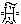 reads "Root," as in the Secondary likewise.

Thus in Alchemy or Western Hermetism (a variant on Eastern Esotericism)
we find: --

> X. . . . . . . . . . . . .  . . . . . . . . . X.

> Sulphur . . . . . . Flamma . . . . . . Spiritus

> Hydrargyum . . Natura . . . . . . . Aqua

> Sal . . . . . . . . . . Mater . . . . . . . Sanguis

------------------------------------------------------------------------

###### \[\[Vol. 2, Page\]\] 114 THE SECRET DOCTRINE.

And these three are all quaternaries completed by their Root, Fire. The
Spirit, beyond manifested Nature, is the fiery BREATH in its absolute
Unity. In the manifested Universe, it is the Central Spiritual Sun, the
electric Fire of all Life. In our System it is the visible Sun, the
Spirit of Nature, the terrestrial god. And in, on, and around the Earth,
the fiery Spirit thereof -- air, fluidic fire; *water*, liquid fire;
*Earth,* solid fire. All is fire -- *ignis,* in its ultimate
constitution, or I, the root of which is O (*nought*) in our
conceptions, the All in nature and its mind. *Pro-Mater* is divine fire.
It is the Creator, the Destroyer, the Preserver. The primitive names of
the gods are all connected with fire, from AGNI, the Aryan, to the
Jewish god who "is a consuming fire." In India, God is called in various
dialects, *Eashoor, Esur, Iswur,* and *Is*'*Vara,* in Sanskrit the Lord,
from *Isa,* but this is primarily the name of Siva, the Destroyer; and
the three Vedic chief gods are Agni (*ignis*)*,* Vayu, and Surya --
Fire, Air, and the Sun, three occult degrees of fire. In the Hebrew
 (*aza*), means to illuminate, and 
(*asha*) is fire. In Occultism, "to kindle a fire" is synonymous to
evoking one of the three great fire-powers, or "to call on God." In
Sanskrit *Osch* or *Asch* is fire or heat; and the Egyptian word Osiris
is compounded (as shown by Schelling) of the two primitives *aish* and
*asr,* or a "fireenchanter." *Aesar* in the old Etruscan meant a God
(being perhaps derived from *Asura* of the Vedas). *Aeswar* and *Eswara*
are analogous terms, as Dr. Kenealy thought. In the *Bhagavad Gita* we
read, "Iswara resides in every mortal being and puts in motion, by his
supernatural power, all things which mount on the Wheel of Time." It is
the creator and the destroyer, truly. "The primitive fire was supposed
to have an insatiable appetite for devouring. Maximus of Tyre relates
that the ancient Persians threw into the fire combustible matter crying:
'Devour, oh Lord!' In the Irish language *Easam,* or *Asam,* means 'to
create,' and *Aesar* was the name of an ancient Irish god, meaning 'to
light a fire' " (*Kenealy*)*.* The Christian Kabalists and symbologists
who disfigured Pymander -- prominent among them the Bishop of Ayre,
Francois de Tours, in the 16th century -- divide the elements in this
way: --

*The four elements formed from divine substances and the Spirits of the
Salts of Nature represented by -*-

 . . . St. Matthew. . Angel-Man . . Water . .
(Jesus-Christ, Angel-Man, *Mikael*)  
A -  . St. Mark. . . . .The Lion . . . . Fire  
E - Y . .St. Luke. . . . . The Bull . . . . Earth  
I - O . . St. John. . . . . The Eagle . . . Air\*

###### \[\[Footnote(s)\]\] -------------------------------------------------

\* To those who would inquire "What has Hydrogen to do with air or
oxygena- \[\[Footnote continued on next page\]\]

------------------------------------------------------------------------

###### \[\[Vol. 2, Page\]\] 115 SONS OF YOGA.

**H**, THE **Q**UINTESSENCE, \[\[*HEPHLOX*\]\], **F**LAMMA-**V**IRGO
(virgin oil), **F**LAMMA **D**URISSIMA, **V**IRGO, **L**UCIS **A**ETERNA
**M**ATER.

The first race of men were, then, simply the images, the astral doubles,
of their Fathers, who were the pioneers, or the most progressed Entities
from a preceding though *lower* sphere, the shell of which is now our
Moon. But even this shell is all-potential, for, having generated the
Earth, it is the *phantom* of the Moon which, attracted by magnetic
affinity, sought to form its first inhabitants, the pre-human monsters,
(*vide supra,* Stanza II.). To assure himself of this, the student has
again to turn to the Chaldean Fragments, and read what Berosus says.
Berosus obtained his information, he tells us, from *Ea*, the
male-female deity of Wisdom. While the gods were generated in its
androgynous bosom (Svabhavat, Mother-space) its (the Wisdom's)
reflections became on Earth the woman Omoroka, who is the Chaldean
Thavatth, or the Greek Thalassa, the Deep or the Sea, which esoterically
and even exoterically is *the Moon.* It was the Moon (Omoroka) who
presided over the monstrous creation of nondescript beings which were
slain by the Dyanis. (*Vide Hibbert Lectures,* p. 370 *et seq.*; also in
Part II. "Adam-Adami.")

Evolutionary law compelled the lunar "Fathers" to pass, in their monadic
condition, through all the forms of life and being on this globe; but at
the end of the Third Round, they were already human in their divine
nature, and were thus called upon to become the creators of the forms
destined to fashion the tabernacles of the less progressed Monads, whose
turn it was to incarnate. These "Forms" are called "Sons of Yoga,"
because Yoga (union with Brahma exoterically) is the supreme condition
of the passive infinite deity, since it contains all the divine energies
and is the essence of Brahma, who is said (as Brahma) to create
everything through Yoga power. Brahma, Vishnu and Siva are the most
powerful energies of God, Brahma, the Neuter, says a

###### \[\[Footnote(s)\]\] -------------------------------------------------

\[\[Footnote continued from previous page\]\] tion?" it is answered:
"Study first the **ABC** of Occult Alchemy." In their anxiety, however,
to identify Pymander, "the mouth of Mystery," with St. John the Baptist
prophetically, they thus identified also the 7 *Kabeiri* and the
Assyrian Bulls with the Cherubs of the Jews and the Apostles. Having,
moreover, to draw a line of demarcation between the *four* and the
*three --* the latter being the *Fallen Angels*; and furthermore to
avoid connecting these with the "Seven Spirits of the Face," the
Archangels, they unceremoniously threw out all they did not choose to
recognise. Hence the perversion in the order of the Elements, in order
to make them dovetail with the order of the Gospels, and to identify the
Angel-Man with Christ. With the Chaldees, the Egyptians, from whom Moses
adopted the *Chroub* (Cherubs in their animal form), and the Ophites;
with all these, the Angels, the Planets, and the Elements, were
symbolized mystically and alchemically by the *Lion* (Mikael); the
*Bull* (Uriel); the *Dragon* (Raphael); the *Eagle* (Gabriel); the
*Bear* (Thot-Sabaoth); the *Dog* (Erataoth); the *Mule* (Uriel or
Thartharaoth). All these have a qualificative meaning.

------------------------------------------------------------------------

###### \[\[Vol. 2, Page\]\] 116 THE SECRET DOCTRINE.

Puranic text. Yoga here is the same as Dhyana, which word is again
synonymous with Yoga in the Tibetan text, where the "Sons of Yoga" are
called "Sons of Dhyana," or of that abstract meditation through which
the Dhyani-Buddhas create their celestial sons, the Dhyani-Bodhisattvas.
All the creatures in the world have each a superior above. "This
superior, whose inner pleasure it is *to emanate into them,* cannot
impart efflux until they have adored" -- *i.e.*, meditated as during
Yoga. (Sepher *M*'*bo Ska-arim,* translated by Isaac Myer, *Qabbalah,*
pp. 109-111.)

-------

19\. **T**HE SECOND RACE (*was*) THE PRODUCT BY BUDDING AND EXPANSION;
THE A-SEXUAL (*form*) FROM THE SEXLESS (*shadow*)*.* **T**HUS WAS, **O
L**ANOO, THE SECOND RACE PRODUCED (*a*).

(*a*) What will be most contested by scientific authorities is this
a-sexual Race, the Second, the fathers of the "Sweat-born" so-called,
and perhaps still more the Third Race, the "Egg-born" androgynes. These
two modes of procreation are the most difficult to comprehend,
especially for the Western mind. It is evident that no explanation can
be attempted for those who are not students of Occult metaphysics.
European language has no words to express things which Nature repeats no
more at this stage of evolution, things which therefore can have no
meaning for the materialist. But there are analogies. It is not denied
that in the beginning of physical evolution there must have been
processes in Nature, spontaneous generation, for instance, now extinct,
which are repeated in other forms. Thus we are told that microscopic
research shows no permanence of any particular mode of reproducing life.
For "it shows that the same organism may run through various
metamorphoses in the course of its life-cycle, during some of which it
may be *sexual,* and in others *a-sexual*; *i.e.,* it may reproduce
itself alternately by the co-operation of two beings of opposite sex,
and also by fissure or *budding* from one being only, which is of no
sex."\* "Budding" is the very word used in the Stanza. How could these
Chhayas reproduce themselves otherwise; viz., procreate the Second Race,
since they were ethereal, a-sexual, and even devoid, as yet, of the
vehicle of desire, or Kama Rupa, which evolved only in the Third Race?
They evolved the Second Race unconsciously, as do some plants. Or,
perhaps, as the *Amoeba,* only on a more ethereal, impressive, and
larger scale. If, indeed, the cell-theory applies equally to Botany and
Zoology, and extends to Morphology, as well as to the Physiology of
organisms,

###### \[\[Footnote(s)\]\] -------------------------------------------------

\* See Laing's "*Modern Science and Modern Thought,*" p. 90.

------------------------------------------------------------------------

###### \[\[Vol. 2, Page\]\] 117 THE OUTGROWTH OF RACES.

and if the microscopic cells are looked upon by physical science as
independent living beings -- just as Occultism regards the "fiery
lives"\* -- there is no difficulty in the conception of the primitive
process of procreation.

Consider the first stages of the development of a germ-cell. Its
*nucleus* grows, changes, and forms a double cone or spindle, thus,
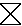 *within* the cell. This spindle approaches the surface
of the cell, and one half of it is *extruded* in the form of what are
called the "*polar cells.*" These polar cells *now* die, and the embryo
develops from the growth and segmentation of the remaining part of the
nucleus which is *nourished* by the substance of the cell. Then why
could not beings have lived thus, and been created in *this* way -- at
the very beginning of *human and mammalian evolution?*

This may, perhaps, serve as an analogy to give some idea of the process
by which the Second Race was formed from the First.

The astral form clothing the Monad was surrounded, as it still is, by
its egg-shaped sphere of *aura,* which here corresponds to the substance
of the germ-cell or *ovum.* The astral form itself is the nucleus, now,
as then, instinct with the principle of life.

When the season of reproduction arrives, the *sub-*astral "*extrudes*" a
miniature of itself from the egg of surrounding aura. This germ grows
and feeds on the aura till it becomes fully developed, when it gradually
separates from its parent, carrying with it its own sphere of aura; just
as we see living cells reproducing their like by growth and subsequent
division into two.

The analogy with the "*polar cells*" would seem to hold good, since
their death would *now* correspond to the change introduced by the
separation of the sexes, when gestation *in utero, i.e., within the
cell,* became the rule.

"*The early Second* (Root) *Race were the Fathers of the*
'*Sweat-born*'; *the later Second* (Root) *Race were* '*Sweat-born*'
*themselves.*"

This passage from the Commentary refers to the work of evolution from
the beginning of a Race to its close. The "Sons of Yoga," or the
primitive astral race, had seven stages of evolution *racially,* or
collectively; as every individual Being in it had, and has now. It is
not Shakespeare only who divided the ages of man into a series of seven,
but Nature herself. Thus the first sub-races of the Second Race were
born at first by the process described on the law of analogy; while the
last began gradually, *pari passu* with the evolution of the human body,
to be formed otherwise. The process of reproduction had seven stages
also

###### \[\[Footnote(s)\]\] -------------------------------------------------

\* See *Book I. Part I. Stanza VII Commentary* 10*.*

------------------------------------------------------------------------

###### \[\[Vol. 2, Page\]\] 118 THE SECRET DOCTRINE.

in each Race, each covering aeons of time. What physiologist or
biologist could tell whether the present mode of generation, with all
its phases of gestation, is older than half a million, or at most one
million of years, since their cycle of observation began hardly half a
century ago.

Primeval human hermaphrodites are a fact in Nature well known to the
ancients, and form one of Darwin's greatest perplexities. Yet there is
certainly no impossibility, but, on the contrary, a great probability
that hermaphroditism existed in the evolution of the early races; while
on the grounds of analogy, and on that of the existence of one universal
law in physical evolution, acting indifferently in the construction of
plant, animal, and man, it must be so. The mistaken theories of
mono-genesis, and the descent of man from the mammals instead of the
reverse, are fatal to the completeness of evolution as taught in modern
schools on Darwinian lines, and they will have to be abandoned in view
of the insuperable difficulties which they encounter. Occult tradition
-- if the terms Science and Knowledge are denied in this particular to
antiquity -- can alone reconcile the inconsistencies and fill the gap.
"If thou wilt know the invisible, open thine eye wide on the visible,"
says a Talmudic axiom.

In the "*Descent of Man*"\* occurs the following passage; which shows
how near Darwin came to the acceptance of this ancient teaching.

"It has been known that in the vertebrate kingdom one sex bears
rudiments of various accessory parts appertaining to the reproductive
system, which properly belong to the opposite sex. . . . Some remote
progenitor of the whole vertebrate kingdom appears to have been
hermaphrodite or androgynous\*\* . . . But here we encounter a *singular
difficulty.* In *the mammalian class the males possess rudiments of a
uterus with the adjacent passages in the Vesiculae prostaticae*; *they
bear also rudiments of mammae, and some male marsupials have traces of a
marsupial sac.* Other analogous facts could be added. Are we then to
suppose that some extremely ancient mammal continued androgynous after
it had acquired the chief distinctions of its class, and therefore after
it had diverged from the lower classes of the vertebrate kingdom? This
seems very improbable,\*\*\* for *we have to look to fishes, the lowest
of all the classes, to find any still existent androgynous forms.*"

Mr. Darwin is evidently strongly disinclined to adopt the hypothesis
which the facts so forcibly suggest, viz., that of a primeval
androgynous

###### \[\[Footnote(s)\]\] -------------------------------------------------

\* Second Edition, p. 161.

\*\* And why not all the progenitive first Races, human as well as
animal; and why *one* "remote progenitor"?

\*\*\* Obviously so, on the lines of Evolutionism, which traces the
mammalia to some amphibian ancestor.

------------------------------------------------------------------------

###### \[\[Vol. 2, Page\]\] 119 THE BLASTEMA OF SCIENCE.

stem from which the mammalia sprang. His explanation runs: -- "The fact
that various accessory organs proper to each sex, are found in a
rudimentary condition in the opposite sex may be explained by such
organs having been gradually acquired by the one sex and then
transmitted in a more or less imperfect condition to the other." He
instances the case of "spurs, plumes, and brilliant colours, acquired
for battle or for ornament by male birds" and only *partially* inherited
by their female descendants. In the problem to be dealt with, however,
the need of a more satisfactory explanation is evident, the facts being
of so much more prominent and important a character than the mere
superficial details with which they are compared by Darwin. Why not
candidly admit the argument in favour of the hermaphroditism which
characterises the old fauna? Occultism proposes a solution which
embraces the facts in a most comprehensive and simple manner. These
relics of a prior androgyne stock must be placed in the same category as
the pineal gland, and other organs as mysterious, which afford us silent
testimony as to the reality of functions which have long since become
atrophied in the course of animal and human progress, but which once
played a signal part in the general economy of primeval life.

The occult doctrine, anyhow, can be advantageously compared with that of
the most liberal men of science, who have theorised upon the origin of
the first man.

Long before Darwin, Naudin, who gave the name of *Blastema* to that
which the Darwinists call protoplasm, put forward a theory half occult
and half scientifico-materialistic. He made Adam, the *a-sexual,* spring
suddenly from the *clay,* as it is called in the Bible, the *Blastema*
of Science. "It is from this larval form of mankind that the evolutive
force effected the completion of species. For the accomplishment of this
great phenomenon, Adam had to pass through a phase of immobility and
unconsciousness, very analogous to the nymphal state of animals
undergoing metamorphosis," explains Naudin. For the eminent botanist,
Adam was not one man, however, but *mankind,* "which remained concealed
within a temporary organism . . . . distinct from all others and never
contracting alliance with any of these." He shows the differentiation of
sexes accomplished by "a process of germination similar to that of
Medusae and Ascidians." Mankind, thus constituted physiologically,
"would retain a sufficient evolutive force for the rapid production of
the various great human races."

De Quatrefages criticises this position in the "*Human Species.*" It is
*unscientific,* he says, or, properly speaking, Naudin's ideas "do not
form a scientific theory," inasmuch as primordial *Blastema* is
connected

------------------------------------------------------------------------

###### \[\[Vol. 2, Page\]\] 120 THE SECRET DOCTRINE.

in his theory with the *First Cause,* which is credited with having made
potentially in the Blastema all past, present, and future beings, and
thus of having in reality *created* these beings *en masse*; moreover,
Naudin does not even consider the *secondary* Causes, or their action in
this evolution of the organic world. Science, which is only occupied
with Secondary Causes, has thus "nothing to say to the theory of Naudin"
(*p*. 125).

Nor will it have any more to say to the occult teachings, which are to
some extent approached by Naudin. For if we but see in his "primordial
Blastema" the Dhyan-Chohanic essence, the *Chhaya* or double of the
*Pitris,* which contains within itself the potentiality of all forms, we
are quite in accord. But there are two real and vital differences
between our teachings. M. Naudin declares that evolution has progressed
by sudden leaps and bounds, instead of extending slowly over millions of
years; and his primordial Blastema is endowed only with blind instincts
-- a kind of *unconscious* First Cause in the *manifested Kosmos --*
which is an absurdity. Whereas it is our Dhyan Chohanic essence -- the
*causality* of the *primal cause* which creates *physical* man -- which
is the living, active and potential matter, pregnant *per se* with that
animal consciousness of a superior kind, such as is found in the ant and
the beaver, which produces the long series of physiological
differentiations. Apart from this his "ancient and general process of
*creation*" from *proto-organisms* is as occult as any theory of
Paracelsus or Khunrath could be.

Moreover, the Kabalistic works are full of the proof of this. The
*Zohar,* for instance, says that every type in the visible has its
prototype in the invisible Universe. "All that which is in the lower
(our) world is found in the upper. The Lower and the Upper act and react
upon each other." (*Zohar,* fol. 186.) *Vide infra,* Part II.,
"*Esoteric Tenets corroborated in every Scripture.*"

-------

20\. **T**HEIR **F**ATHERS WERE THE SELF-BORN. **T**HE SELF-BORN, THE
**C**HHAYA FROM THE BRILLIANT BODIES OF THE **L**ORDS, THE **F**ATHERS,
THE **S**ONS OF **T**WILIGHT (*a*).

(*a*) The "shadows," or *Chhayas,* are called the sons of the
"self-born," as the latter name is applied to all the gods and Beings
born through the WILL, whether of Deity or Adept. The *Homunculi* of
Paracelsus would, perhaps, be also given this name, though the latter
process is on a far more material plane. The name "Sons of Twilight"
shows that the "Self-born" progenitors of our doctrine are identical
with the Pitris

------------------------------------------------------------------------

###### \[\[Vol. 2, Page\]\] 121 LEDA, CASTOR AND POLLUX.

of the Brahmanical system, as the title is a reference to their mode of
birth, these Pitris being stated to have issued from Brahma's "body of
twilight." (*See the Puranas.*)

-------

21\. **W**HEN THE RACE BECAME OLD, THE OLD WATERS MIXED WITH THE FRESHER
WATERS (*a*); WHEN THE DROPS BECAME TURBID, THEY VANISHED AND
DISAPPEARED, IN THE NEW STREAM, IN THE HOT STREAM OF LIFE. **T**HE OUTER
OF THE FIRST BECAME THE INNER OF THE SECOND. (*b*). **T**HE OLD WING
BECAME THE SHADOW, AND THE SHADOW OF THE WING (*c*)*.*

(*a*) The old (primitive) Race merged in the second race, and became one
with it.

(*b*) This is the mysterious process of transformation and evolution of
mankind. The material of the first forms -- shadowy, ethereal, and
negative -- was drawn or absorbed into, and thus became the complement
of the forms of the Second Race. The *Commentary* explains this by
saying that, as the First Race was simply composed of the astral shadows
of the creative progenitors, having of course neither astral nor
physical bodies of their own -- this Race *never died.* Its "men" melted
gradually away, becoming absorbed in the bodies of their own
"sweat-born" progeny, more solid than their own. The old form vanished
and was absorbed by, disappeared in, the new form, more human and
physical. There was no death in those days of a period more blissful
than the Golden Age; but the first, or parent material was used for the
formation of the new being, to form the body and even the inner or
*lower* principles or bodies of the progeny.

(*c*) When the shadow retires, *i.e.* when the astral body becomes
covered with more solid flesh, man develops a physical body. The "wing,"
or the ethereal form that produced its shadow and image, became the
shadow of the astral body and its own progeny. The expression is queer
but original.

As there may be no occasion to refer to this mystery later, it is as
well to point out at once the dual meaning contained in the Greek myth
bearing upon this particular phase of evolution. It is found in the
several variants of the allegory of Leda and her two sons Castor and
Pollux, which variants have each a special meaning. Thus in Book **XI**.
of the *Odyssey,* Leda is spoken of as the spouse of Tyndarus, who gave
birth by her husband "to two sons of valiant heart" -- Castor

------------------------------------------------------------------------

###### \[\[Vol. 2, Page\]\] 122 THE SECRET DOCTRINE.

and Pollux. Jupiter endows them with a marvellous gift and privilege.
They are semi-immortal; they live and die, each in turn, and every
alternate day; \[\[*eteremeroi*\*\]\]. As the Tyndaridae, the twin
brothers are an astronomical symbol, and stand for *Day* and *Night*;
their two wives, Phoebe and Hilasira, the daughters of Apollo or the
Sun, personifying the Dawn and the Twilight.\*\* Again, in the allegory
where Zeus is shown as the father of the two heroes -- born from the egg
to which Leda gives birth -- the myth is entirely theogonical. It
relates to that group of cosmic allegories in which the world is
described as born from an egg. For Leda assumes in it the shape of a
white swan when uniting herself to the Divine Swan.\*\*\* Leda is the
mythical bird, then, to which, in the traditions of various peoples of
the Aryan race, are attributed various ornithological forms of birds
which all lay golden eggs.\*\*\*\* In the *Kalevala* (the Epic Poem of
Finland), the beauteous daughter of the Ether, "the Water Mother,"
creates the world in conjunction with a "Duck" (another form of the Swan
or Goose, Kalahansa), who lays six golden eggs, and the seventh, "an egg
of iron," in her lap. But the variant of the Leda allegory which has a
direct reference to mystic man is found in Pindar\*\*\*\*\* only, with a
slighter reference to it in the Homeric hymns.\*\*\*\*\*\* Castor and
Pollux are in it no longer *the Dioscuri* (of *Apollodorus* III*.* 10,
7); but become the highly significant symbol of the dual man, the Mortal
and the Immortal. Not only this, but as will now be seen, they are also
the symbol of the Third Race, and its transformation from the animal man
into a god-man with only an animal body.

Pindar shows Leda uniting herself in the same night to her husband and
also to the father of the gods -- Zeus. Thus Castor is the son of the
Mortal, Pollux the progeny of the Immortal. In the allegory made up for
the occasion, it is said that in a riot of vengeance against the
*Apherides\*\*\*\*\*\*\** Pollux kills Lynceus -- "of all mortals he
whose sight is the most penetrating" -- but Castor is wounded by *Idas,*
"he who sees and knows." Zeus puts an end to the fight by hurling his
thunderbolt and killing the last two combatants. Pollux finds his
brother dying.\*\*\*\*\*\*\*\* In

###### \[\[Footnote(s)\]\] -------------------------------------------------

\* "*Odyssey*," xi. 298 to 305; "*Iliad,*" iii., 243.

\*\* *Chants Cypriaques, Hyg. Tal.,* 80. *Ovid,* "*Fasti,*" etc. See
*Decharme*'*s* "*Mythologie de la Grece Antique.*"

\*\*\* See Brahma Kalahamsa in Book I. Stanza III., p. 78.

\*\*\*\* *See Decharme*'*s* "*Mythologie,*" etc., p. 652.

\*\*\*\*\* Nem., x., 80 *et seq. Theocras,* xxiv., 131.

\*\*\*\*\*\* xxxiv., v. *5*; *Theocritus,* xxii*.,* 1.

\*\*\*\*\*\*\* *Apollodorus, III.* ii., 1.

\*\*\*\*\*\*\*\* Castor's tomb was shown in Sparta, in days of old, says
Pausanias (III., 13, 1); and Plutarch says that he was called at Argos
the demi-mortal or demi-hero \[\[*mizarchagetas*\]\]. (See Plutarch,
*Quaestiones Graecae,* 23*.*)

------------------------------------------------------------------------

###### \[\[Vol. 2, Page\]\] 123 THE ALLEGORY OF CASTOR AND POLLUX.

his despair he calls upon Zeus to slay him also. "Thou canst not die
altogether," answers the master of the Gods; "thou art of a divine
race." But he gives him the choice: Pollux will either remain immortal,
living eternally in Olympus; or, if he would share his brother's fate in
all things, he must pass half his existence underground, and the other
half in the golden heavenly abodes. This semi-immortality, which is also
to be shared by Castor, is accepted by Pollux.\* *And thus the twin
brothers live alternately, one during the day, and the other during the
night.\*\**

Is this a poetical fiction only? An allegory, one of those "solar myth"
interpretations, higher than which no modern Orientalist seems able to
soar? Indeed, it is much more. Here we have an allusion to the
"Egg-born," *Third* Race; the first half of which is mortal, *i.e.*,
unconscious in its personality, and having nothing within itself to
survive\*\*\*; and the latter half of which becomes immortal in its
individuality, by reason of its fifth principle being called to life by
the *informing gods,* and thus connecting the Monad with this Earth.
This is Pollux; while Castor represents the *personal,* mortal man, an
animal of not even a superior kind, when unlinked from the divine
individuality. "Twins" truly; yet divorced by death forever, unless
Pollux, moved by the voice of twinship, bestows on his less favoured
mortal brother a share of his own divine nature, thus associating him
with his own immortality.

Such is the occult meaning of the metaphysical aspect of the allegory.
The widely spread modern interpretation of it -- so celebrated in
antiquity, Plutarch tells us,\*\*\*\* as symbolical of brotherly
devotion -- namely, that it was an image borrowed from the spectacle of
Nature -- is weak and inadequate to explain the secret meaning. Besides
the fact that the Moon, with the Greeks, was feminine in exoteric
mythology, and could therefore hardly be regarded as Castor -- and at
the same time be identified with Diana -- ancient symbologists who held
the Sun, the King of all sidereal orbs, as the visible image of the
highest deity, would not have personified it by Pollux, a demi-god
only.\*\*\*\*\*

###### \[\[Footnote(s)\]\] -------------------------------------------------

\* *Pindar. Nem.* x., 60, *Dissen.*

*\*\* Schol. Eurip.* "*Orestes,*" 463, *Dindorf.* See *Decharme*'*s*
"*Mythol.,*" etc., p. 654.

\*\*\* The *Monad* is impersonal and a god *per se,* albeit unconscious
on this plane. For, divorced from its third (often called fifth)
principle, Manas, which is the horizontal line of the first manifested
triangle or trinity, it can have no consciousness or perception of
things on this earthly plane. "The highest sees through the eye of the
lowest" in the manifested world; *Purusha* (Spirit) remains blind
without the help of Prakrit (matter) in the material spheres; and so
does Atma-Buddhi without Manas.

\*\*\*\* "*Morals,*" *p.* 484 *f.*

\*\*\*\*\* This strange idea and interpretation are accepted by Decharme
in his "*Mythologie de la Grece Antique.*" "Castor and Pollux," he says,
"are nothing but the Sun and

------------------------------------------------------------------------

###### \[\[Vol. 2, Page\]\] 124 THE SECRET DOCTRINE.

If from Greek mythology we pass to the Mosaic allegories and symbolism,
we shall find a still more striking corroboration of the same tenet
under another form. Unable to trace in *Genesis* the "Egg-born," we
shall still find there unmistakably the androgynes, and the first three
races of the Secret Doctrine hidden under most ingenious symbology in
the first four chapters of *Genesis.*

-------

**T**HE **D**IVINE **H**ERMAPHRODITE.

An impenetrable veil of secrecy was thrown over the occult and religious
mysteries taught, after the submersion of the last remnant of the
Atlantean race, some 12,000 years ago, lest they should be shared by the
unworthy, and so desecrated. Of these sciences several have now become
exoteric -- such as Astronomy, for instance, in its purely mathematical
and physical aspect. Hence their dogmas and tenets, being all symbolised
and left to the sole guardianship of parable and allegory, have been
forgotten, and their meaning has become perverted. Nevertheless, one
finds the hermaphrodite in the scriptures and traditions of almost every
nation; and why such unanimous agreement if the statement is only a
fiction?

It is this secrecy which led the Fifth Race to the establishment, or
rather the re-establishment of the religious mysteries, in which ancient
truths might be taught to the coming generations under the veil of
allegory and symbolism. Behold the imperishable witness to the evolution
of the human races from the divine, and especially from the androgynous
Race -- the Egyptian Sphinx, that riddle of the Ages! Divine wisdom
incarnating on earth, and forced to taste of the bitter fruit of
personal experience of pain and suffering, generated under the shade of
the tree of the knowledge of Good and Evil -- a secret first known only
to the Elohim, the SELF-INITIATED, "*higher gods*" *--* on earth only.\*

\[\[Footnote continued\]\]-------------------------------

In the Book of Enoch we have Adam,\*\* the first divine androgyne, Moon,
conceived as twins . . . The Sun, the immortal and powerful being that
disappears every evening from the horizon and descends under the Earth,
as though he would make room for the fraternal orb which comes to life
with night, is Pollux, who sacrifices himself for Castor; Castor, who,
inferior to his brother, owes to him his immortality: for the Moon, says
Theophrastus, is only another, but feebler Sun." (*De Ventis* 17. *See
Decharme,* p. 655.)

###### \[\[Footnote(s)\]\] -------------------------------------------------

\* See "*Book of Enoch.*"

\*\* Adam (Kadmon) is, like Brahma and Mars, the symbol of the
*generative* and *creative power* typifying Water and Earth -- an
alchemical secret. "It takes Earth and Water to create a human soul,"
said Moses. Mars is the Hindu Mangala, the planet Mars, identical with
*Kartikeya,* the "War-God," born of *Gharma-ja* (Siva's *sweat*) and of
the \[\[Footnote continued on next page\]\]

------------------------------------------------------------------------

###### \[\[Vol. 2, Page\]\] 125 JAH-HOVAH ANDROGYNOUS.

separating into man and woman, and becoming **J**AH-**H**EVA in one
form, or *Race,* and Cain and Abel\* (male and female) in its other form
or *Race --* the double-sexed Jehovah\*\* -- an echo of its Aryan
prototype, Brahma-Vach. After which come the Third and Fourth Root-Races
of mankind\*\*\* -- that is to say, Races of men and women, or
individuals of opposite sexes, no longer sexless semi-spirits and
androgynes, as were the two Races which precede them. This fact is
hinted at in every Anthropogony. It is found in fable and allegory, in
myth and *revealed* Scriptures, in legend and tradition. Because, of all
the great Mysteries, inherited by Initiates from hoary antiquity, this
is *one of the greatest.* It accounts for the bi-sexual element found in
every creative deity, in Brahma-Viraj-Vach, as in Adam-Jehovah-Eve, also
in "Cain-Jehovah-Abel." For "The Book of the Generations of Adam" does
not even mention Cain and Abel, but says only: "Male and female created
he them. . . and called their name Adam" (ch. v. 5). Then it proceeds to
say: "And Adam begat a son in *his own likeness,* after his image, and
called his name Seth" (v. 3); after which he begets other sons and
daughters, thus proving that Cain and Abel are his own allegorical
permutations. Adam stands for the primitive *human* race, especially in
its cosmo-sidereal sense. Not so, however, in its theo-anthropological
meaning. The compound name of Jehovah, or *Jah-Hovah,* meaning *male
life* and female life -- first androgynous, then separated into sexes --
is used in this sense in *Genesis* from ch. v. onwards. As the author of
"The Source of Measures" says (*p.* 159): "The two words of which
Jehovah is composed make up the original idea of male-female, as the
birth originators"; for the Hebrew letter *Jod* was the *membrum virile*
and *Hovah* was Eve, the mother of all living, or the procreatrix, Earth
and Nature. The author believes, therefore, that "It is seen that the
*perfect one*" (the perfect female circle or *Yoni,* 20612*,
numerically*)*,* "as *originator of measures,* takes also the form of
*birth*-origin, as *Hermaphrodite one*; hence the phallic form and use."

Precisely; only "the phallic form and use" came long ages later; and the
first and original meaning of Enos, the son of Seth, was the First
*Race* born in the present usual way from man and woman --for Seth is no
man, but a *race.* Before him humanity was hermaphrodite.

###### \[\[Footnote(s)\]\] -------------------------------------------------

\[\[Footnote continued from previous page\]\] Earth. He is *Lokita,* the
red, like Brahma also and Adam. The Hindu Mars is, like Adam, born from
no woman and mother. With the Egyptians, Mars was the *primeval
generative Principle,* and so are Brahma, in exoteric teaching, and
Adam, in the Kabala.

\* Abel is Chebel, meaning "Pains of Birth," conception.

\*\* See "*Isis Unveiled*," Vol. II, p. 398, where Jehovah is shown to
be Adam and Eve blended, and Hevah, and Abel, the *feminine serpent.*

\*\*\* *See* "*Isis Unveiled,*" Vol. I., 305: "The union of the two
create a *third* Race, etc."

------------------------------------------------------------------------

###### \[\[Vol. 2, Page\]\] 126 THE SECRET DOCTRINE.

While Seth is the first result (physiologically) after the FALL, he is
also the *first man*; hence his son Enos is referred to as the "Son of
man." (*Vide infra.*) Seth represents the *later* Third Race.

To screen the real mystery name of AIN-SOPH -- the Boundless and Endless
*No-Thing --* the Kabalists have brought forward the compound
*attribute-*appellation of one of the personal creative Elohim, whose
name was *Yak* and *Jab,* the letters *i* or *j* or *y* being
interchangeable, or *Jah-Hovah, i.e. male* and *female*;*\* Jah-Eve* an
*hermaphrodite,* or the *first form of humanity,* the original Adam of
Earth, not even *Adam Kadmon,* whose " mind-born son" is the earthly
Jah-Hovah, mystically. And knowing this, the crafty Rabbin-Kabalist has
made of it a name so secret, that he could not divulge it later on
without exposing the whole scheme; and thus he was obliged to make it
*sacred.*

How close is the identity between Brahma-Prajapati and
Jehovah-Sephiroth, between Brahma-Viraj and Jehovah-Adam, the Bible and
the Puranas compared can alone show. Analysed and read in the same
light, they afford cogent evidence that they are two copies of the same
original -- made at two periods far distant from each other. Compare
once more in relation to this subject *Genesis* ch. 4. verses 1 and 26
and *Manu* I., and they will both yield their meaning. In *Manu* (*Book*
I. 32) Brahma, who is also both man and god, and divides his body into
male and female, stands in his esoteric meaning, as does Jehovah or Adam
in the Bible, for the symbolical personification of creative and
*generative* power, both divine and human. The Zohar affords still more
convincing proof of identity, while some Rabbins repeat word for word
certain original Puranic expressions; *e.g.*, the "creation" of the
world is generally considered in the Brahmanical books to be the Lila,
delight or sport, the amusement of the Supreme Creator, "Vishnu being
thus discrete and indiscrete substance, spirit, and time, sports like a
playful boy in frolics." (Vishnu Purana, Book I., ch. ii.) Now compare
this with what is said in the Book, "Nobeleth' Hokhmah": "The Kabalists
say that the entering into existence of the worlds happens through
*delight*, in that Ain-Soph (? !) *rejoiced* in Itself, and flashed and
beamed from Itself to Itself . . . . which are all called delight," etc.
(Quoted in *Myer*'*s* "*Qabbalah,*" p*.* 110). Thus it is not a "curious
idea of the Qabbalists," as the author just quoted remarks, but a purely
Puranic, Aryan idea. Only, why make of Ain-Soph a Creator?

The "Divine Hermaphrodite" is then Brahma-Vach-Viraj; and that of the
Semites, or rather of the Jews, is Jehovah-Cain-Abel. Only the "Heathen"
were, and are, more sincere and frank than were the

###### \[\[Footnote(s)\]\] -------------------------------------------------

\* *Jod* in the Kabala has for symbol the hand, the forefinger and the
*lingham,* while numerically it is the perfect one; but it is also the
number 10, male and female, when divided.

------------------------------------------------------------------------

###### \[\[Vol. 2, Page\]\] 127 SETH OUR PROGENITOR.

later Israelites and Rabbis, who undeniably knew the real meaning of
their exoteric deity. The Jews regard the name given to them -- the
Yah-oudi -- as an insult. Yet they have, or would have if they only
wished it, as undeniable a right to call themselves the ancient
Yah-oudi, "Jah-hovians," as the Brahmins have to call themselves
Brahmins, *after their national deity.* For Jah-hovah is the generic
name of that group or hierarchy of creative planetary angels, under
whose star their nation has evolved. He is one of the planetary *Elohim*
of the regent group of Saturn. Verse 26 of *Genesis,* ch. iv., when read
correctly, would alone give them such a right, for it calls the new race
of men sprung from *Seth* and Enos, *Jehovah,* something quite different
from the translation adopted in the Bible: -- "To him also, was born a
son, Enos; then began men to call themselves Jah or Yah-hovah," to with
*men and women,* the "lords of creation." One has but to read the
above-mentioned verse in the original Hebrew text and by the light of
the Kabala, to find that, instead of the words as they now stand
translated, it is: -- "Then began men to *call themselves Jehovah,*"
which is the correct translation, and not "Then began men to call upon
the name of the Lord"; the latter being a mistranslation, whether
deliberate or not. Again the well-known passage: "I have gotten a man
from the Lord," should read: "I have gotten a man, even Jehovah."\*
Luther translated the passage one way, the Roman Catholics quite
differently. Bishop Wordsworth renders it: "Cain -- *I have gotten*
Kain, from *Kanithi,* I have gotten." Luther: "I have gotten a man 0--
even the Lord" (Jehovah); and the author of "The Source of Measures": "I
have *measured a man,* even *Jehovah*." The last is the correct
rendering, because (*a*) a famous Rabbin, a Kabalist, explained the
passage to the writer in precisely this way, and (*b*) because this
rendering is identical with that in the Secret Doctrine of the East with
regard to Brahma. In "*Isis Unveiled,*"*\*\** it was explained by the
writer that "Cain . . . is the son of the 'Lord' not of Adam (*Genesis*
iv*.* I)" The "Lord" is Adam Kadmon, the "father" of *Yodcheva,*
"Adam-Eve," or Jehovah, the son of sinful thought, not the progeny of
flesh and blood. Seth, on the other hand, is the *leader and the
progenitor of the Races of the Earth*; for he is the son of Adam,
exoterically, but esoterically he is the progeny of Cain and Abel, since
Abel or Hebel is a female, the counterpart and female half of the male
Cain, and Adam is the collective name for man and woman: "male and
female (*Zachar va Nakobeh*) created he them . . . and called *their*
name Adam." The verses in *Genesis* from chs. i. to v., are purposely
mixed up for Kabalistic reasons. After MAN of

###### \[\[Footnote(s)\]\] -------------------------------------------------

\* *See* "*Source of Measures*," p. 227.

\*\* Vol. II., p. 264, *et seq.*

------------------------------------------------------------------------

###### \[\[Vol. 2, Page\]\] 128 THE SECRET DOCTRINE.

*Genesis* ch. i. 26 and *Enos,* Son of Man of ch. iv. *v.* 26, after
Adam, the first androgyne, after Adam Kadmon, the sexless (the first)
*Logos,* Adam and Eve once separated, come finally Jehovah-Eve and
Cain-Jehovah. These represent distinct Root-Races, for millions of years
elapsed between them.

Hence the Aryan and the Semitic Theo-anthropographies are two leaves on
the same stem; their respective personifications and symbolic personages
standing in relation to each other in this way.

I. The *Unknowable,* referred to in various ways in *Rig Vedic* verse,
such as "*Nought* Was," called, later on "Parabrahm;" the
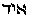 (*Ain,* nothing, or the "Ain-Soph" of the Kabalists),
and again, the "Spirit" (of God) that moves upon the face of the waters,
in *Genesis.* All these are *identical.* Moreover, in *Genesis,* ch. i.,
v. 2, is placed as verse 1 in *the secret* Kabalistic texts, where it is
followed by the *Elohim* "creating the Heaven and the Earth." This
deliberate shifting of the order of the verses was necessary for
*monotheistic* and Kabalistic purposes. Jeremiah's curse against those
Elohim (gods) who *have not created* the Heavens and the Earth, ch. x.,
*v.* 11, shows that there were other Elohim who had.

II\. The "Heavenly" *Manu-Swayambhuva,* who sprang from
Swayambhu-Narayana, the "Self-existent," and Adam Kadmon of the
Kabalists, and the androgyne MAN of *Genesis ch.* 1 are also identical.

III\. Manu-swayambhuva is Brahma, or the Logos; and he is Adam Kadmon,
who in Genesis iv., 5, separates himself into two halves, male and
female, thus becoming Jah-Hovah or Jehovah-Eve; as Manu Swayambhuva or
Brahma separates himself to become "Brahma-Viraj and Vach-Viraj," male
and female; all the rest of the texts and versions being *blinds.*

IV\. Vach is the daughter of Brahma and is named *Sata-Rupa,* "the
hundred-formed," and *Savitri,* "*generatrix,*" the mother of the gods
and of all living. She is identical with Eve, "the mother (of all the
lords or gods or) of all living." Besides this there are many other
occult meanings.

What is written in "*Isis,*" although scattered about and very
cautiously expressed at the time, is correct:

Explaining esoterically Ezekiel's wheel,\* it is said of *Jodhevah* or
Jehovah: -

"When the ternary is taken in the beginning of the Tetragram, it
expresses the divine creation *spiritually,* without any carnal sin;
taken at its opposite end it expresses the latter: it is feminine. The
name of Eva is composed of three letters, that of the primitive or
heavenly

###### \[\[Footnote(s)\]\] -------------------------------------------------

\* "*Isis Unveiled*," Vol. II., p. 462.

------------------------------------------------------------------------

###### \[\[Vol. 2, Page\]\] 129 THE JEWISH GOD-NAME.

Adam, is written with one letter, Jod or Yodh; therefore it must not be
read Jehovah but Ieva, or Eve. The Adam of the first chapter is the
spiritual, therefore pure, androgyne Adam Kadmon. When woman issues from
the rib of the second Adam (of dust), the pure *Virgo* is separated, and
falling "into generation," or the downward cycle, becomes *Scorpio,*
emblem of sin and matter. While the ascending cycle points to the purely
spiritual races, or the ten prediluvian patriarchs, the Prajapatis and
Sephiroth are led on by the creative Deity itself, who is Adam Kadmon or
Yod-cheva. Spiritually, the lower one (Jehovah) is that of the
terrestrial races, led on by Enoch or *Libra,* the seventh; who, because
he is half-divine, half-terrestrial, is said to have been taken by God
alive. Enoch, Hermes, and Libra, are one."

This is only one of the several meanings. No need to remind the scholar
that *Scorpio* is the astrological sign of the organs of reproduction.
Like the Indian Rishis, the Patriarchs are all convertible in their
numbers, as well as interchangeable. According to the subject to which
they relate they become ten, twelve, seven or five, and even *fourteen,*
and they have the same esoteric meaning as the *Manus* or Rishis.

Moreover, Jehovah, as may be shown, has a variety of etymologies, but
only those are true which are found in the Kabala. 
(*Ieve*) is the Old Testament term, and was pronounced Ya-*va*. Inman
suggests that it is contracted from the two words 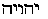
*Yaho-Iah, Jaho-Jah,* or *Jaho is Jah.* Punctuated it is
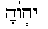 which is, however, a Rabbinical caprice to associate
it with the name *Adoni* or 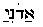, which has the same
points. It is curious, and indeed hardly conceivable, that the Jews
anciently read the name 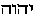 (*Adoni*)*,* when they had so
many names of which *Jeho* and *Jah* and Iah constituted a part. But so
it was; and Philo Byblus, who gives us the so-called fragment of
Sanchoniathon, spelt it in Greek letters \[\[*IEUO*\]\], *Javo* or
*Jevo.* Theodoret says that the Samaritans pronounced *Yahva,* and the
Jews *Yaho.* Prof*.* Gibbs, however, suggests its punctuation thus:
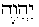 (*Ye-hou-vih*); and he cut the Gordian knot of its
true occult meaning. For in this last form, as a Hebrew verb, it means
"he will -- be."\* It was also derived from the Chaldaic verb
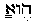 or 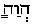 *eue* (*eva*) or *eua* (*Eva*)
"to be." And so it was, since from Enosh, the "Son of Man," only, were
the truly human races to begin and "to be," as males and females. This
statement receives further corroboration, inasmuch as Parkhurst makes
the verb 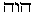 to mean: (1) "To

###### \[\[Footnote(s)\]\] -------------------------------------------------

\* See for comparison *Hosea,* xii. 6, where it is so punctuated.

------------------------------------------------------------------------

###### \[\[Vol. 2, Page\]\] 130 THE SECRET DOCTRINE.

fall down" (*i.e.* into generation or matter); and (2) "*To be, to
continue* " -- as a *Race.* The aspirate of the word *eua* (*Eva*) "to
be" being 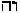 *Heve* (*Eve*)*,* which is the feminine of
 and the same as Hebe, the Grecian goddess of youth and
the Olympian bride of Heracles, makes the name Jehovah appear still more
clearly in its primitive double-sexed form.

Finding in Sanskrit such syllables as *Jah* and *Yah, e.g., Jah*
(*navi*) "Ganges" and *Jagan-natha,* "Lord of the World," it becomes
clear why Mr. Rawlinson is so very confident in his works of an *Aryan*
or *Vedic* influence on the early mythology of Babylon. Nor is it to be
much wondered at that the alleged ten tribes of Israel disappeared
during the captivity period, without leaving a trace behind them, when
we are informed that the Jews had *de facto* but two tribes -- those of
J*udah* and of *Levi.* The *Levies,* moreover, were not a tribe at all,
but a priestly caste. The descendants have only followed their
progenitors, the various patriarchs, into thin, sidereal air. There were
*Brahms* and *A-brahms,* in days of old, truly, and before the first Jew
had been born. Every nation held its first god and gods to be
androgynous; nor could it be otherwise, since they regarded their
distant primeval progenitors, their dual-sexed ancestors, as divine
Beings and Gods, just as do the Chinese to this day. And they were
divine in one sense, as also were their first human progeny, the
"mind-born" primitive humanity, which were most assuredly bi-sexuals as
all the more ancient symbols and traditions show. Under the emblematical
devices and peculiar phraseology of the priesthood of old, lie latent
hints of sciences as yet undiscovered during the present cycle. Well
acquainted as may be a scholar with the hieratic writing and
hieroglyphical system of the Egyptians, he must first of all learn to
sift their records. He has to assure himself, compasses and rule in
hand, that the picture writing he is examining fits, to a line, *certain
fixed geometrical figures* which are the hidden keys to such records,
before he ventures on an interpretation."

"But there are myths which speak for themselves. In this class we may
include the double-sexed first creators of every Cosmogony. The Greek
Zeus-Zen (AEther), and Chthonia (the chaotic earth) and Metis (water),
his wives; Osiris and Isis-Latona -- the former god also representing
AEther, the first emanation of the Supreme Deity, Amun, the primeval
source of Light; the goddess Earth and Water again; Mithras, the
rock-born god, the symbol of the male mundane fire, or the personified
primordial light, and Mithra, the fire goddess, at once his mother and
his wife; the pure element of fire (the active, or male principle)
regarded as light and heat, in conjunction with Earth and Water, or
Matter, the female or passive element of cosmical generation" -- all
these are records of the primeval divine Hermaphrodite.

------------------------------------------------------------------------

[Next Section](sd2-1-07.md)

[Contents](sd2-0-co.htm#contents.md)
