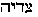
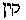

##### The Secret Doctrine by H. P. Blavatsky -- Vol. 2

------------------------------------------------------------------------

###### \[\[Vol. 2, Page\]\] 378 THE SECRET DOCTRINE.

\[\[This page continued from [previous
section](sd2-1-21)\]\]

**T**HE **O**RIGIN OF THE **S**ATANIC **M**YTH.

Let us then fathom this creation of the Patristic fancy still deeper,
and find its prototype with the Pagans. The origin of the new *Satanic*
myth is easy to trace. The tradition of the Dragon and the Sun is echoed
in every part of the world, both in its civilized and semi-savage
regions. It took rise in the whisperings about secret initiations among
the profane, and was established universally through the once universal
heliolatrous religion. There was a time when the four parts of the world
were covered with the temples sacred to the Sun and the Dragon;

------------------------------------------------------------------------

###### \[\[Vol. 2, Page\]\] 379 THE SECRET OF THE DRAGON.

but the cult is now preserved mostly in China and the Buddhist
countries, "Bel and the Dragon being uniformly coupled together, and the
priest of the Ophite religion as uniformly assuming the name of his
*God*" ("*Archaeology,*" Vol. xxv., p. 220, London). In the religions of
the past, it is in Egypt we have to seek for its Western origin. The
Ophites adopted their rites from Hermes Trismegistus, and heliolatrous
worship crossed over with its Sun-gods into the land of the Pharaohs
from India. In the gods of Stonehenge we recognise the divinities of
Delphi and Babylon, and in those of the latter the devas of the Vedic
nations. Bel and the Dragon, Apollo and Python, Krishna and Kaliya,
Osiris and Typhon are all one under many names -- the latest of which
are Michael and the Red Dragon, and St. George and his Dragon. As
Michael is "one as God," or his "Double," for terrestrial purposes, and
is one of the Elohim, the fighting angel, he is thus simply a
permutation of Jehovah. Whatever the Cosmic or astronomical event that
first gave rise to the allegory of the "War of Heaven," its earthly
origin has to be sought in the temples of Initiation and archaic crypts.
The following are the proofs: --

We find (*a*) the priests assuming the name of the gods they served;
(*b*) the "Dragons" held throughout all antiquity as the symbols of
Immortality and Wisdom, of secret Knowledge and of Eternity; and (*c*)
the hierophants of Egypt, of Babylon, and India, styling themselves
generally the "Sons of the Dragon" and "Serpents"; thus the teachings of
the Secret Doctrine are thereby corroborated.

There were numerous catacombs in Egypt and Chaldea, some of them of a
very vast extent. The most renowned of them were the subterranean crypts
of Thebes and Memphis. The former, beginning on the western side of the
Nile, extended towards the Lybian desert, and were known as the
*Serpent*'*s* catacombs, or passages. It was there that were performed
the sacred mysteries of the *kuklos anagkes,* the "Unavoidable Cycle,"
more generally known as "the circle of necessity"; the inexorable doom
imposed upon every soul after the bodily death, and when it has been
judged in the Amenthian region.

In de Bourbourg's book, *Votan,* the Mexican demi-god, in narrating his
expedition, describes a subterranean passage which ran underground, and
terminated at the root of the heavens, adding that this passage was a
snake's hole, "un agujero de colubra"; and that he was admitted to it
because he was himself "a son of the snakes," or a serpent. ("Die
Phoinizier," 70.)

This is, indeed, very suggestive; for his description of the *snake*'*s*
*hole* is that of the ancient Egyptian crypt, as above mentioned. The
hierophants, moreover, of Egypt, as of Babylon, generally styled them-

------------------------------------------------------------------------

###### \[\[Vol. 2, Page\]\] 380 THE SECRET DOCTRINE.

selves the "Sons of the Serpent-god," or "Sons of the Dragon," during
the mysteries.

"The Assyrian priest bore always the name of his god," says Movers. The
Druids of the Celto-Britannic regions also called themselves snakes. "I
am a Serpent, I am a Druid," they exclaimed. The Egyptian Karnak is twin
brother to the Carnac of Bretagne, the latter Carnac meaning the
serpent's mount. The Dracontia once covered the surface of the globe,
and these temples were sacred to the Dragon, only because it was the
symbol of the sun, which, in its turn, was the symbol of the highest god
-- the Phoenician Elon or Elion, whom Abraham recognised as El Elion.\*
Besides the surname of serpents, they were called the "builders," the
"architects"; for the immense grandeur of their temples and monuments
was such that even now the pulverised remains of them "frighten the
mathematical calculations of our modern engineers," says Taliesin.\*\*

De Bourbourg hints that the chiefs of the name of *Votan, the
Quetzo-Cohuatl,* or Serpent deity of the Mexicans, are the descendants
of Ham and Canaan. "I am Hivim," they say. "Being a Hivim, I am of the
great race of the Dragon (snake). I am a snake myself, for I am a
Hivim." ("Cartas," 51; "*Isis Unveiled,*" Vol. I., 553, *et seq.*)

Furthermore, the "War in Heaven" is shown, in one of its significations,
to have meant and referred to those terrible struggles in store for the
candidate for adeptship, between himself and his (by magic) personified
human passions, when the *inner* enlightened man had to either slay them
or fail. In the former case he became the "Dragon-Slayer," as having
happily overcome all the temptations; and a "Son of the Serpent" and a
Serpent himself, having cast off his old skin and being born in a *new*
body, becoming a Son of Wisdom and Immortality in Eternity. (See Part
**II**. on the Satanic Myth.)

Seth, the reputed forefather of Israel, is only a Jewish travesty of
Hermes, the God of Wisdom, called also Thoth, Tat, Seth, Set, and Satan.
He is also Typhon -- the same as Apophis, the Dragon slain by Horus; for
Typhon was also called Set. He is simply the *dark side* of Osiris, his
brother, as Angra Mainyu is the black shadow of Ahura-mazda.
Terrestrially, all these allegories were connected with the trials of
adeptship and initiation. Astronomically, they referred to the Solar and
Lunar eclipses, the mythical explanations of which we find to this day
in India and Ceylon, where any one can study the allegorical narratives
and traditions which have remained unchanged for many thousands of
years.

###### \[\[Footnote(s)\]\] -------------------------------------------------

\* See Sanchoniathon in "Eusebius," Pr. Ev. 36; Genesis xiv.

\*\* "Society of Antiquaries of London," vol. xxv. p. 220.

------------------------------------------------------------------------

###### \[\[Vol. 2, Page\]\] 381 THE THEFT OF RAHU.

Rahu, mythologically is a *Daitya --* a giant, a Demi-god, the lower
part of whose body ended in a Dragon or Serpent's tail. During the
churning of the Ocean, when the gods produced amrita -- the water of
Immortality -- he stole some of it, and drinking, became immortal. The
Sun and Moon, who had detected him in his theft, denounced him to
Vishnu, who placed him in the stellar spheres, the upper portion of his
body representing the Dragon's head and the lower (Ketu) the Dragon's
tail; the two being the ascending and descending nodes. Since then, Rahu
wreaks his vengeance on the Sun and Moon by occasionally swallowing
them. But this fable had another mystic meaning, since *Rahu,* the
Dragon's head, played a prominent part in the mysteries of the *Sun's*
(*Vikarttana*'*s*) initiation, when the candidate and the Dragon had a
supreme fight.

The caves of the Rishis, the abodes of Tiresias and the Greek seers,
were modelled on those of the *Nagas --* the Hindu *King-Snakes, who*
dwelled in cavities of the rocks under the ground. From *Sesha, the*
thousand-headed Serpent, on which Vishnu rests, down to Python, the
dragon *serpent oracle,* all point to the secret meaning of the myth. In
India we find the fact mentioned in the earliest Puranas. The children
of Surasa are the "mighty Dragons." The *Vayu* Purana replacing "Surasa"
(of *Vishnu* Purana) by Danayas or *Danavas --* the descendants of Danu
by the sage Kasyapa -- and those Danavas being the giants (or Titans)
who warred against the gods, they are thus shown identical with the
"Dragons" and "Serpents" of Wisdom.

By simply comparing the Sun-gods of every country, one may find their
allegories agreeing perfectly with one another; and the more the
allegorical symbol is occult the more its corresponding symbol in other
systems agrees with it. Thus, if from three systems widely differing
from each other in appearance -- the old Aryan, the ancient Greek, and
the modern Christian schemes -- we select several Sun-gods and dragons
at random, these will be found copied from each other.

Let us take Agni the fire-god, Indra the firmament, and Karttikeya from
the Hindus; the Greek Apollo; and *Mikael,* the "Angel of the Sun," the
first of the AEons, called by the Gnostics "the saviour" -- and proceed
in order.

\(1\) Agni -- the fire-god -- is called in the Rig-Veda Vaiswanara. Now
Vaisvanara is a Danava -- a giant-demon,\* whose daughters Puloma and
Kalaka are the mothers of numberless Danavas (30 millions), by

###### \[\[Footnote(s)\]\] -------------------------------------------------

\* He is thus named and included in the list of the Danavas in *Vayu
Purana*; the Commentator of Bhagavata Purana calls him a son of Danu,
but the name means also "Spirit of Humanity."

------------------------------------------------------------------------

###### \[\[Vol. 2, Page\]\] 382 THE SECRET DOCTRINE.

Kasyapa,\* and live in *Hiranyapura,* "*the golden city,*" *floating in
the air*. Therefore, Indra is, in a fashion, the step-son of these two
as a son of Kasyapa; and Kasyapa is, in this sense, identical with Agni,
the fire-god, or Sun (Kasyapa-Aditya). To this same group belongs Skanda
or Karttikeya (god of War, the *six-faced* planet Mars astronomically),
a Kumara, or virgin-youth, born of Agni\*\* for the purpose of
destroying Taraka, the Danava Demon, the grandson of Kasyapa by
Hiranyaksha, his son,\*\*\* whose (Taraka's) yogi austerities were so
extraordinary that they became formidable to the gods, who feared such a
rival in power.\*\*\*\* While Indra, the bright god of the Firmament,
kills Vritra (or Ahi), the Serpent-Demon -- for which feat he is called
*Vritra-han,* "the destroyer of Vritra"; he also leads the hosts of
*Devas* (Angels or gods) against other gods who rebel against Brahma,
for which he is entitled *Jishnu,* "leader of the celestial Host."
Karttikeya is found bearing the same titles. For killing Taraka, the
Danava, he is Taraka-Jit, "Vanquisher of Taraka,"\*\*\*\*\* "*Kumara
Guha,*" "the mysterious Virgin-youth" "*Siddha-Sena*" *--* "the leader
of the Siddhas"; and *Saktidhara* -- "Spear-holder."

(2.) Now take Apollo, the Grecian sun-god, and by comparing the mythical
accounts given of him, see whether he does not answer both

###### \[\[Footnote(s)\]\] -------------------------------------------------

\* Kasyapa is called the Son of Brahma, and is the "Self-Born" to whom a
great part of the work of creation is attributed. He is one of the seven
Rishis; *exoterically,* the son of Marichi, the son of Brahma; while
Atharva-veda says, "The Self-born Kasyapa sprang from Time"; and
*esoterically --* Time and Space are forms of the One *incognizable*
Deity. As an *Aditya,* Indra is son of Kasyapa, as also Vaivasvata Manu,
our progenitor. In the instance given in the text, he is Kasyapa-Aditya,
*the Sun, and* *the Sun-god, from whom all* the "Cosmic" Demons, Dragons
(nagas), Serpent, or Snake-gods, and Danavas, the giants, are born. The
meaning of the allegories given above is purely astronomical and
cosmical, but will serve to prove the identity of all.

\*\* All such stories differ in the *exoteric* texts. In the
Mahabharata, Karttikeya, "the six-faced Mars," is the son of Rudra or
Siva, Self-born *without a mother* from the seed of Siva cast into the
fire. But Karttikeya is generally called *Agnibhu,* "fire born."

\*\*\* Hiranyaksha is the ruler or king of the *fifth* region of Patala,
a Snake-god.

\*\*\*\* The *Elohim* also feared the knowledge of Good and Evil for
Adam, and therefore are shown as expelling him from Eden or killing him
*spiritually.*

\*\*\*\*\* The story told is, that Taraka (called also Kalabhana), owing
to his extraordinary Yoga-powers, had obtained all the divine knowledge
of yoga-vidya and occult powers of the gods, who conspired against him.
Here we see the "obedient" Host of *Archangels* or minor gods conspiring
against the (future) *Fallen* angels, whom Enoch accuses of the great
crime of disclosing to the world all "the *secret things* done in
heaven." It is Michael, Gabriel, Raphael, Surgal and Uriel who denounced
to the Lord God those of their Brethren who were said *to have pried
into the divine mysteries* and taught them to men: by this means they
themselves escaped a like punishment. Michael was commissioned to fight
the Dragon, and so was Karttikeya, and under the same circumstances.
Both are "leaders of the Celestial Host," both Virgins, both "leaders of
Saints," "Spear-holders" (*Saktidhara*), etc., etc. Karttikeya is the
original of Michael and St. George, as surely as Indra is the prototype
of Karttikeya.

------------------------------------------------------------------------

###### \[\[Vol. 2, Page\]\] 383 THE GODS, THE FACETS OF ONE GEM.

to Indra, Karttikeya, and even Kasyapa-Aditya, and at the same time to
Michael (as the Angelic form of Jehovah) the "angel of the Sun," who is
"like," and "one with, God." Later ingenious interpretations for
monotheistic purposes, elevated though they be into not-to-be questioned
Church dogmas, prove nothing, except the abuse of human authority and
power, perhaps.

Apollo is *Helios* (the Sun), Phoibus-Apollo ("the light of life and of
the World"\*) who arises out of the golden-winged cup (the sun); hence
he is the sun-god *par excellence.* At the moment of his birth he asks
for his bow to kill Python, the Demon Dragon, who attacked his mother
before his birth,\*\* and whom he is divinely commissioned to destroy --
like Karttikeya, who is born for the purpose of killing Taraka, *the too
holy and wise demon.* Apollo is born on a sidereal island called
*Asteria --* "the golden star island," the "earth which floats in the
air," which is the Hindu golden *Hiranyapura*; "he is called the pure,
\[\[*agnos*\]\]*, Agnus Dei* (the Indian *Agni*, as Dr. Kenealy thinks),
and in the primal myth he is exempt "from all sensual love" ("*Book* *of
God,*" p. 88). He is, therefore, a *Kumara,* like Karttikeya, and as
Indra was in his earlier life and biographies. Python, moreover, the
"red Dragon," connects Apollo with Michael, who fights the Apocalyptic
Dragon, who wants to attack the woman in child-birth (See *Revelation
xii.*)*,* as Python attacks Apollo's mother. Can any one fail to see the
identity? Had the Rt. Hon. W. E. Gladstone, who prides himself on his
Greek scholarship and understanding of the spirit of Homer's allegories,
ever had a real inkling of the *esoteric* meaning of the *Iliad* and
*Odyssey,* he would have understood St. John's "*Revelation,*" and even
the Pentateuch, better than he does. For the way to the Bible lies
through Hermes, Bel, and Homer, as the way to these is through the Hindu
and Chaldean religious symbols.

The repetition of this archaic tradition is found in ch. xii. of St.
John's *Revelations,* and comes from the Babylonian legends without the
smallest doubt, though the Babylonian story had its origin in the
allegories of the Aryans. The fragment read by the late George Smith
(See "The Chaldean account of Genesis," p. 304) is sufficient to
disclose the source of the xii. chapter of the Apocalypse. Here it is as
given by the eminent Assyriologist:

"Our . . . fragment refers to the creation of *mankind,* called Adam; as
(the man) in the Bible, he is made perfect . . . but afterwards joins

###### \[\[Footnote(s)\]\] -------------------------------------------------

\* The "life and the light" of the material *physical* world, the
delight of the senses -- not of the soul. Apollo is pre-eminently the
*human* god, the god of emotional, pomp-loving and theatrical Church
ritualism, with lights and music.

\*\* See chap. xii. in *Revelation* where we find Apollo's mother
persecuted by that Python, the Red Dragon, who is also *Porphyrion,* the
scarlet or red Titan.

------------------------------------------------------------------------

###### \[\[Vol. 2, Page\]\] 384 THE SECRET DOCTRINE.

with the dragon of the Deep, the animal of Tiamat, the Spirit of Chaos,
and offends against his god, who *curses him,* and calls down on his
head all the evils and troubles of Humanity."\*

"This is followed by a war between the dragon and the powers of evil, or
chaos on one side and the gods on the other."

"The gods have weapons forged for them,\*\* and Merodach (the archangel
Michael in *Revelation*) undertakes to lead the heavenly host against
the dragons. The war, which is described with spirit, ends, of course,
in the triumph of the principles of Good. . . . ."\*\*\*

This war of gods with the powers of the Deep, refers also, in its last
and terrestrial application, to the struggle between the Aryan adepts of
the nascent Fifth Race and the Sorcerers of Atlantis, the Demons of the
Deep, the Islanders surrounded with water who disappeared in the Deluge.
(See the last pages of Vol. I., "*Isis Unveiled,*" Atlantis.)

The symbols of the dragons and "War in Heaven" have, as already stated,
more than one significance; religious, astronomical and geological
events being included in the one common allegory. But it had also a
Cosmological meaning. In India the Dragon story is repeated in one of
its forms in the battles of Indra with *Vritra.* In the Vedas this
Ahi-Vritra is referred to as the Demon of Drought, the terrible hot
Wind. Indra is shown to be constantly at war with him; and with the help
of his thunder and lightning the god compels Ahi-Vritra to pour down in
rain on Earth, and then slays him. Hence, Indra is called the
*Vritra-Han* or "the slayer of Vritra," as Michael is called the
Conqueror and "Slayer of the Dragon." Both these "Enemies" are then the
"Old Dragon" precipitated into the depths of the Earth, in this one
sense.

The Zend-Avestic Amshaspends are a Host with a leader like St. Michael
over them, and seem identical with the legions of Heaven, when one reads
the *Vendidad.* Thus in Fargard **XIX**., ii. 13 (42), Zarathustra is
told by Ahura Mazda to "invoke the Amesha Spenta who rule over the seven
*Karshvares*\*\*\*\* of the Earth"; which Karshvares in their seven

###### \[\[Footnote(s)\]\] -------------------------------------------------

\* No "god" who *curses* his (supposed) own work, because he has made it
imperfect, can be the one infinite absolute wisdom, whether called Bel
or Jehovah.

\*\* In the Indian allegory of *Tarakamaya,* the war between the gods
and the Asuras headed by Soma (the moon, the King of Plants), it is
Viswa-Karma, the artificer of the gods, who forges, like Vulcan
(Tubal-Kain), their weapons for them.

\*\*\* We have said elsewhere that the "woman with child" of Revelation
(xii.) was Aime, the great mother, or Binah, the third Sephiroth, "whose
name is Jehovah"; and the "Dragon," who seeks to devour her coming child
(the Universe), is the Dragon of absolute Wisdom -- that Wisdom which,
recognising the non-separateness of the Universe and everything in it
from the Absolute **A**LL, sees in it no better than the great Illusion,
*Mahamaya,* hence the cause of misery and suffering.

\*\*\*\* The "Seven Karshvares of the Earth" -- the seven spheres of our
planetary chain, \[\[Footnote continued on next page\]\]

------------------------------------------------------------------------

\[\[Vol. 2, Page\]\] 385 THE BUILDERS OF THE MATERIAL WORLD.

applications refer equally to the seven spheres of our planetary chain,
to the seven planets, the seven heavens, etc., according to whether the
sense is applied to a physical, supra-mundane, or simply a sidereal
world. In the same Fargard (ii. and iii.), in his invocation against
Angra Mainyu and his Host, Zarathustra appeals to them in these words:
"I invoke the seven bright *Sravah* with their sons and their flocks"
(42 *Vendid.* *Saddh*)*.* The "Sravah" -- a word which the Orientalists
have given up as one "of unknown meaning" -- means the same Amshaspends,
but in their highest occult meaning. The "*Sravah*" are the noumenoi of
the phenomenal Amshaspends, the souls or spirits of those *manifested*
Powers; and "their sons and their flock" refers to the planetary angels
and their sidereal flock of stars and constellations. "Amshaspend" is
the exoteric term used in terrestrial combinations and affairs only.
Zarathustra addresses Ahura Mazda constantly as "thou, the maker *of
the* *material* world." Ormazd is the father of our earth (Spenta
Armaiti), and she is referred to, when personified, as "the fair
daughter of Ahura Mazda" (*Fargard,* **XIX**. ii.), who is also the
creator of the Tree (of occult and spiritual knowledge and wisdom) from
which the mystic and mysterious *Caresma* is taken. But the occult name
of the bright God was never pronounced outside the temple.

Samael or Satan, the seducing Serpent of Genesis, and one of the
primeval angels who rebelled, is the name of the "Red Dragon." He is the
Angel of *Death,* the Talmud saying that "the Angel of Death and Satan
are the same," and, killed by Michael, he is once more killed by St.
George, who also is a Dragon Slayer; but see the transformations of
this. Samael is identical with the *Simoom,* the hot wind of the desert,
or again with the Vedic demon of drought, as Vritra; "*Simoom* is called
*Atabutos*" or *-- Diabolos,* the devil.

Typhon, or the Dragon Aphophis -- the *Accuser* in the "Book of the
Dead" -- is worsted by Horus, who pierces his opponent's head with a
spear; and Typhon is the all-destroying wind of the desert, the
rebellious element that throws everything into confusion. As *Set --* he
is the darkness of night, the murderer of Osiris, who is the light of
day and the sun. Archaeology demonstrates that Horus is identical with
Anubis,\* whose effigy was discovered upon an Egyptian monument, with a
cuirass and a spear, like Michael and St. George. Anubis is also
represented

###### \[\[Footnote(s) continued from previous page\]\] ------------------------------------------------- §

the seven worlds -- also mentioned in the Rig-Veda -- are fully referred
to elsewhere. There are six *rajamsi* (worlds) above *prithivi* -- the
earth, or "this" (idam), as opposed to that which is *yonder* (the six
globes on the three other planes). (See *Rig-Veda, I.,* 34; *III.,* 56;
*VII.,* 10411*, and V.,* 60, 6*.* See § on Chronology.)

\* Verse 62, chap. xvii., "Book of the Dead": Anubis is Horus who melts
in him who is eyeless.

------------------------------------------------------------------------

###### \[\[Vol. 2, Page\]\] 386 THE SECRET DOCTRINE.

as slaying a dragon, that has the head and tail of a serpent. (See
Lenoir's "Du Dragon de Metz.")

Cosmologically, then, all the Dragons and Serpents conquered by their
"Slayers" are, in their origin, the turbulent confused principles in
Chaos, brought to order by the Sun-gods or *creative* powers. In the
"Book of the Dead" those principles are called "the Sons of Rebellion."
(See also "*Egyptian Pantheon,*" pp. *20, 23.*) "In that night, the
oppressor, the murderer of Osiris, otherwise called the *deceiving
Serpent* (Verse 54) . . . . calls the Sons of Rebellion in *Air,* and
when they arrive to the East of Heavens, then there is War in Heaven and
in the entire World" (v. 49, "*Book of the Dead,*" xvii.).

In the Scandinavian *Eddas* the "War" of the Ases with the Hrim-thurses
(frost-giants), and of Asathor with the Jotuns, the Serpents and Dragons
and the "wolf" who comes out of "Darkness" --- is the repetition of the
same myth. The "evil Spirits,"\* having begun by being simply the
emblems of Chaos, became euhemerized by the superstition of the rabble,
until they have finally won the right of citizenship in the most
civilized and learned races of this globe -*- since its creation* as
alleged -- and became a dogma with Christians. As George Smith has it:
"The evil principles (Spirits) emblems of Chaos" (in Chaldea and Assyria
as in Egypt, we see) . . "resist this change and make war on the Moon,
the eldest son of Bel, drawing over to their side the Sun, Venus and the
atmospheric god Vul." ("Assyrian Discoveries," p. 403.) This is only
another version of the Hindu "War in Heaven," between Soma, the moon,
and the gods -- Indra being the atmospheric Vul; which shows it plainly
to be both a Cosmogonical and an astronomical allegory, woven into and
drawn from the earliest theogony as taught in the Mysteries.

It is in the religious doctrines of the Gnostics that the real meaning
of the Dragon, the Serpent, the Goat, and all those symbols of powers
now called *Evil*, can be seen the best; as it is they who divulged the
esoteric nature of the Jewish Substitute for **AIN-SOPH** *in their*
teachings; of the true meaning of which, while the Rabbins concealed it,
the Christians, with a few exceptions, knew nothing. Surely Jesus of
Nazareth would have hardly advised his apostles to show themselves as
*wise* as the serpent, had the latter been a symbol of the *Evil one*;
nor would the Ophites, the learned Egyptian Gnostics of "the Brotherhood
of the Serpent," have reverenced a living snake in their ceremonies as
the emblem of **WISDOM***,* the divine *Sophia* (and a type of the
all-good, not the all-bad), were that reptile so closely connected with
Satan. The fact is, that even as a common ophidian it has ever been a
dual symbol; and

###### \[\[Footnote(s)\]\] -------------------------------------------------

\* These "evil Spirits" can by no means be identified with Satan or the
Great Dragon. They are the Elementals generated or begotten by ignorance
-- Cosmic and human passions -- or Chaos.

------------------------------------------------------------------------

###### \[\[Vol. 2, Page\]\] 387 WHO FIRST CREATED WOMAN?

as a Dragon it had never been anything else than a symbol of the
manifested Deity in its great Wisdom. The *Draco volans,* the flying
Dragon of the early painters, may be an exaggerated picture of the real
extinct antediluvian animal; but those who have faith in the Occult
teachings believe that in the days of old there were such creatures as
flying Dragons, or a kind of Pterodactyl, and that it is those gigantic
winged lizards that served as the prototypes for the Seraph of Moses and
his great Brazen Serpent.\* The Jews had worshipped the latter *idol*
themselves, but, after the religious reforms brought about by Hezekiah,
turned round, and called that symbol of the great or Higher God of every
other nation -- a Devil, and their own usurper -- the "One God."\*\*

The appellation Sa'tan, in Hebrew *satan,* "an adversary" (from the verb
*shatana,* "to be adverse," to persecute) belongs by right to the first
and cruelest "*adversary of all the other gods*" -- Jehovah, not to the
Serpent, which spoke only words of sympathy and wisdom, and is at the
worst, even in the dogma, "the adversary of men." This dogma, based as
it is on chapter iii. of *Genesis,* is as illogical and unjust as it is
paradoxical. For who was the first to *create* that original and
hence-forward universal tempter of man -- the woman? Not the serpent
surely, but the "Lord God" himself, who, saying: -- "It is not good that
the man should be alone" -- made woman, and "brought her unto the man"
(18-22). If the unpleasant little incident that followed *was* and is
still to be regarded as the "original sin," then it exhibits the
Creator's divine foresight in a poor light indeed. It would have been
far better for the first Adam (of chap. 1.) to have been left either
"male and female," or "alone." It is the Lord God, evidently, who was
the real cause of all the mischief, the "*agent provocateur,*" and the
Serpent -- only a prototype of *Azazel,* "the scapegoat for the sin of
(the God of) Israel," the poor *Tragos* having to pay the penalty for
his Master's and Creator's blunder. This, of course, is addressed only
to those who accept the opening events of the drama of humanity in
*Genesis* in their dead-letter sense. Those who read them esoterically,
are not reduced to fanciful

###### \[\[Footnote(s)\]\] -------------------------------------------------

\* See Numbers xxi. 8-9. God orders Moses to build a brazen Serpent
"Saraph"; *to look upon which* heals those bitten by the *fiery
serpents.* The latter were the *Seraphim*, each one of which, as Isaiah
shows (vi. 2), "*had six wings*"; they are the symbols of Jehovah, and
of all the other Demiurgi who produce out of themselves six sons or
likenesses -- Seven with their Creator. Thus, the Brazen Serpent *is*
Jehovah, the chief of the "fiery serpents." And yet, in 2 Kings xviii.,
it is shown that King Hezekiah, who, like as David his father, "did that
which was right in the sight of the Lord" -- "brake in pieces the brazen
serpent that Moses had made . . . and called it *Nehushtan,*" or piece
of brass.

\*\* And Satan stood up against Israel and moved David to number Israel
(Chron. xxi. 1.) "The anger of the Lord Jehovah was kindled against
Israel," and he moved David to say: "Go, number Israel" (2 Samuel, xxiv.
1). The two are then identical.

------------------------------------------------------------------------

###### \[\[Vol. 2, Page\]\] 388 THE SECRET DOCTRINE.

speculations and hypothesis; *they know* how to read the symbolism
therein contained, and cannot err.

There is at present no need to touch upon the mystic and manifold
meaning of the name Jehovah in its abstract sense, one independent of
the Deity *falsely* called by that name. It was a blind created
purposely by the Rabbins, a secret preserved by them with ten-fold care
after the Christians had despoiled them of this God-name which was their
own property.\* But the following statement is made. The personage who
is named in the first four chapters of *Genesis* variously as "God," the
"Lord God," and "Lord" simply, is not one and the same person; certainly
it is not *Jehovah.* There are three distinct classes or groups of the
Elohim called Sephiroth in the Kabala, Jehovah appearing only in chapter
iv., in the first verse of which he is named Cain, and in the last
transformed into *mankind --* male and female, jah-veh.\*\* The
"Serpent," moreover, is not Satan, but the bright Angel, one of the
*Elohim* clothed in radiance and glory, who, promising the woman that if
they ate of the forbidden fruit "*ye shall not surely die,*" kept his
promise, and made man immortal in his *incorruptible nature.* He is the
Iao of the mysteries, the chief of the Androgyne creators of men.
Chapter iii. contains (esoterically) the withdrawal of the veil of
ignorance that closed the perceptions of the Angelic Man, made in the
image of the "Boneless" gods, and the opening of his consciousness to
his real nature; thus showing the bright Angel (Lucifer) in the light of
a giver of Immortality, and as the "Enlightener"; while the real Fall
into generation and matter is to be sought in chapter iv. There,
Jehovah-Cain, the male part of Adam the *dual* man, having separated
himself from Eve, creates in her "Abel," *the first natural woman,*\*
and sheds the *Virgin blood.* Now Cain, being shown identical with
Jehovah, on the authority of the correct reading of verse i. (chapter
iv., Genesis), in the original Hebrew text; and the Rabbins teaching
that "*Kin* (Cain), the Evil, was the Son of Eve by Samael, the devil
who took Adam's place"; and the Talmud adding that "the evil Spirit,
Satan, and Samael, the angel of Death, are the same" --(*Babba Battra,
16a*) -- it becomes easy to see that Jehovah (*mankind, or* "Jah-hovah")
and Satan (therefore the tempting Serpent) are one and

###### \[\[Footnote(s)\]\] -------------------------------------------------

\* Dozens of the most erudite writers have sifted thoroughly the various
meanings of the name J'hovah (with, and without the masoretic points),
and shown their multifarious bearings. The best of such works is the
"Source of Measures, the Hebrew Egyptian Mystery."

\*\* In the above-mentioned work (p. 233 App.), verse 26 of the 4th
chap. of Genesis is correctly translated "then men began to call
themselves *Jehovah,*" but less correctly explained, perhaps, as the
last word ought to be written *Jah* (*male*) *Hovah* (female), to show
that from that time the race of distinctly separate man and woman began.

\*\*\* See for explanation the excellent pages of appendix vii. of the
same work.

------------------------------------------------------------------------

###### \[\[Vol. 2, Page\]\] 389 JEHOVAH OPHIOMORPHOS.

the same in every particular. *There is no Devil, no Evil, outside
mankind* *to produce a Devil.* Evil is a necessity in, and one of the
supporters of the manifested universe. It is a necessity for progress
and evolution, as night is necessary for the production of Day, and
Death for that of Life -- *that man may live for ever.*

Satan represents metaphysically simply the *reverse or the polar
opposite* of everything in nature.\* He is the "adversary,"
allegorically, the "murderer," and the great Enemy of *all*, because
there is nothing in the whole universe that has not two sides -- the
reverses of the same medal. But in that case, light, goodness, beauty,
etc., may be called Satan with as much propriety as the Devil, since
they are the *adversaries* of darkness, badness, and ugliness. And now
the philosophy and the *rationale* of certain early Christian sects --
called *heretical* and viewed as the abomination of the times -- will
become more comprehensible. We may understand how it was that the sect
of **S**ATANIANS came to be degraded, and were anathematized without any
hope of vindication in a future day, since they kept their tenets
secret. How, on the same principle, the **C**AINITES came to be
degraded, and even the (Judas) **I**SCARIOTES; the true character of the
*treacherous* apostle having never been correctly presented before the
tribunal of Humanity.

As a direct consequence, the tenets of the Gnostic sects also become
clear. Each of these sects was founded by an Initiate, while their
tenets were based on the correct knowledge of the symbolism of every
nation. Thus it becomes comprehensible why Ilda-Baoth was regarded by
most of them as the god of Moses, and was held as a proud, ambitious,
and impure spirit, who had abused his power by usurping the place of the
*highest God,* though he was no better, and in some respects far worse
than *his brethren Elohim*; the latter representing the all-embracing,
manifested deity only in their collectivity, since they were the
fashioners of the first differentiations of the primary Cosmic substance
for the creation of the phenomenal Universe. Therefore Jehovah was
called by the Gnostics the Creator of, and one with Ophiomorphos, the
Serpent, Satan, or **EVIL***.* (*See* "*Isis Unveiled,*" **II,** 184).
They taught that Turbo and Adonai were "names of Jao-Jehovah, who is an
emanation of Ilda Baoth" (*Codex Nazaraeus*)*.* (*See Part II.,* "*The
Fallen* *Angels.*") This amounted in their language to saying what the
Rabbins expressed in a more veiled way, by stating that -- "Cain had
been generated by Samael or Satan."

###### \[\[Footnote(s)\]\] -------------------------------------------------

\* In Demonology, Satan is the leader of the opposition in Hell, the
monarch of which was Beelzebub. He belongs to the fifth kind or class of
demons (of which there are nine according to mediaeval demonology), and
he is at the head of witches and sorcerers. But see in the text the true
meaning of Baphomet, the goat-headed Satan, one with Azaziel, the scape
goat of Israel. Nature is the god **PAN.**

------------------------------------------------------------------------

###### \[\[Vol. 2, Page\]\] 390 THE SECRET DOCTRINE.

The fallen Angels are made in every ancient system the prototypes of
*fallen* men -- allegorically, and, *those men themselves --*
esoterically. Thus the Elohim of the hour of creation became the
"Beni-Elohim," the sons of God, among whom is Satan -- in the Semitic
traditions; war in heaven between Thraetaona and Azhi-dahaka, the
destroying Serpent, ends on earth, according to Burnouf, in the battle
of pious men against the power of Evil, "of the Iranians with the Aryan
Brahmins of India." And the conflict of the gods with the *Asuras* is
repeated in the Great War -- the Mahabharata. In the latest religion of
all, Christianity, all the Combatants, gods and demons, adversaries in
both the camps, are now transformed into Dragons and Satans, simply in
order to connect **EVIL** personified with the Serpent of Genesis, and
thus prove the new dogma.\*

-------

**N**OAH WAS A **K**ABIR, HENCE HE MUST HAVE BEEN A **D**EMON.

It matters little whether it is Isis, or Ceres -- the "Kabiria" -- or
again the Kabiri, who have taught men agriculture; but it is very
important to prevent fanatics from monopolising all the facts in history
and legend, and from fathering their distortions of truth, history, and
legend upon one man. Noah is either a *myth* along with the others, or
one whose legend was built upon the Kabirian or Titanic tradition, as
taught in Samothrace; he has, therefore, no claim to be monopolized by
either Jew or Christian. If, as Faber tried to demonstrate at such cost
of learning and research, Noah is an Atlantean and a Titan, and his
family are the Kabiri or pious Titans, etc. -- then biblical chronology
falls by its own weight, and along with it all the patriarchs -- the
antediluvian and pre-Atlantean Titans. As now discovered and proven,
Cain is Mars, the god of *power and generation,* and of the first
(sexual) bloodshed.\*\* Tubal-Cain is a Kabir, "an instructor of every
artificer in brass and iron"; or -- if this will please better -- he is
one with Hephaestos or Vulcan; Jabal is taken from the Kabiri --
instructors in agriculture, "such as have cattle," and Jubal is "the
father of all those who handle the harp," he, or *they* who fabricated
the *harp* for Kronos and the trident for Poseidon.\*\*\*

###### \[\[Footnote(s)\]\] -------------------------------------------------

\* *Vide* for further details upon the Satanic myth, Part **II.** on
Symbolism, in this volume.

\*\* As he is also Vulcan or Vul-cain, the greatest god with the later
Egyptians, and the greatest Kabir. The god of *time* was *Chium* in
Egypt, or Saturn, or Seth, and Chium is the same as Cain.

\*\*\* *See Strabo, comparing them to the Cyclopes --* **XIV***. p. 653
et seq.* (*Callim in Del.,* 31 *Stat. Silo.* **IV***.,* 6, 47; *etc.,
etc*.)

------------------------------------------------------------------------

###### \[\[Vol. 2, Page\]\] 391 THE FLOOD LEGENDS.

The history or "fables" about the mysterious Telchines -- fables echoing
each and all the archaic events of our esoteric teachings -- furnish us
with a key to the origin of *Cain*'*s* genealogy (*Genesis,* ch. iii.);
they give the reason why the Roman Catholic Church identifies "the
accursed blood" of Cain and Ham with Sorcery, and makes it responsible
for the Deluge. Were not the Telchines -- it is argued -- the mysterious
ironworkers of Rhodes; they who were the first to raise statues to the
gods, furnish them with weapons, and men with magic arts? And is it not
they who were destroyed by a deluge at the command of Zeus, as the
*Cainites* were by that of Jehovah?

The Telchines are simply the Kabiri and the Titans, in another form.
They are the Atlanteans also. "Like Lemnos and Samothrace," says
Decharme, "Rhodes, the birth-place of the Telchines, is an island of
volcanic formation." (*Genii of Fire, p.* 271.) The island of Rhodes
emerged suddenly out of the seas, after having been previously engulfed
by the Ocean, say the traditions. Like Samothrace (of the Kabiri) it is
connected in the memory of men with the Flood legends. As enough has
been said on this subject, however, it may be left for the present.

But we may add a few more words about Noah, the Jewish representative of
nearly every pagan God in one or another character. The Homeric songs
contain, poetized, all the later fables about the Patriarchs, who are
all sidereal, cosmic, and numerical symbols and signs. The attempt to
disconnect the two genealogies -- those of Seth and Cain\* -- and the
further attempt, as futile, to show them *real, historical* men, has
only led to more serious inquiries into the history of the Past, and to
discoveries which have damaged for ever the supposed *revelation.* For
instance, the identity of Noah and Melchizedek being established, the
further identity of Melchizedek, or Father Sadik, with Kronos-Saturn is
proved also.

That it is so may be easily demonstrated. It is not denied by any of the
Christian writers. Bryant (*See* "*Analysis of Ancient Mythology,*"
*Vol.* *II., p.* 760) concurs with all those who are of opinion, that
Sydic, or

###### \[\[Footnote(s)\]\] -------------------------------------------------

\* Nothing could be more awkward and childish, we say, than this
fruitless attempt to disconnect the genealogies of Cain and of Seth, or
to conceal the identity of names under a different spelling. Thus, Cain
has a Son **E**NOCH, and Seth a Son **E**NOCH also (Enos, Ch'anoch,
Hanoch; -- one may do what one likes with Hebrew unvowelled names). In
the Cainite line Enoch begets **I**RAD, Irad **M**EHUJAEL, the latter
**M**ETHUSAEL, and Methusael, Lamech. In the Sethite line, Enoch begets
Cainan, and this one **M**AHALEEL (a variation on Mehujael), who gives
birth to **J**ARAD (or Irad); Jarad to **E**NOCH (Number 3), who
produces Methuselah (from Methusael), and finally Lamech closes the
list. Now all these are symbols (Kabalistically) of solar and lunar
years, of astronomical periods, and of physiological (phallic)
functions, just as in any other pagan symbolical creed. This has been
proven by a number of writers.

------------------------------------------------------------------------

###### \[\[Vol. 2, Page\]\] 392 THE SECRET DOCTRINE.

Sadic, was the patriarch Noah (as also Melchizedek); and that the name
by which he is called, or Sadic, corresponds to the character given of
him in *Genesis,* chap. vi., 9. "He was , Sadic, a JUST
man, and perfect in his generation. All science and every useful art
were attributed to him, and through his sons transmitted to posterity."
(*See New Encyclopaedia* *by Abraham Rees,* **F.R.S***.*)

Now it is Sanchoniathon, who informs the world that the Kabiri were the
Sons of Sydic or Zedek (Melchizedek). True enough, this information,
having descended to us through Eusebius (*Preparatio Evangelica*), may
be regarded with a certain amount of suspicion, as it is more than
likely that he dealt with Sanchoniathon's works as he has with Manetho's
Synchronistic Tables. But let us suppose that the identification of
Sydic, Kronos, or Saturn with Noah and Melchizedek, is based on one of
the Eusebian pious hypotheses. Let us accept it as such, along with
Noah's characteristic as a *just man,* and his supposed duplicate, the
mysterious Melchizedek, King of Salem, and priest of the high god, after
"his own order" (*See Hebrews, ch. v*. 6, *and vii. 1, et seq.*); and
finally, having seen what they all were spiritually, astronomically,
psychically and cosmically, let us now see what they became
*rabbinically* and **K**ABALISTICALLY.

Speaking of Adam, Kain, Mars, etc., as *personifications,* we find the
author of "*The Source of Measures*" enunciating our very esoteric
teachings in his Kabalistic researches. Thus he says: --

> "Now Mars was the lord of *birth* and of *death,* of *generation* and
> of *destruction,* of *ploughing,* of *building,* of *sculpture* or
> stone-cutting, of *Architecture* . . . . in fine, of all . . . . ARTS.
> He was the *primeval principle,* disintegrating into the modification
> of *two opposites for production.* Astronomically, too,\* he held the
> birthplace of the day and year, the place of its *increase of
> strength, Aries,* and likewise the place of its death, Scorpio. He
> held the house of *Venus,* and that of the *Scorpion.* He, as *birth,*
> was *good;* as *death,* was Evil*.* As *good,* he was *light;* as
> *bad,* he was *night.* As *good,* he was *man*; as *bad,* he was
> *woman.* He held the cardinal points, and as *Cain*, or *Vulcan,*\*\*
> or *Pater Sadic,* or *Melchizadek,* he was lord of the *Ecliptic,* or

###### \[\[Footnote(s)\]\] -------------------------------------------------

\* The AEolian name of Mars was \[\[*Areus*\]\], and the Greek Ares,
\[\[*Ares*\]\], is a name over the etymological significance of which,
philologists and Indianists, Greek and Sanskrit scholars have vainly
worked to this day. Very strangely, Max Muller connects both the names
*Mars* and *Ares* with the Sanskrit root *mar*, whence he traces their
derivation, and from which, he says, the name of *Maruts* (the
storm-gods) comes. Welcker, however, offers more correct etymologies.
(*See Griech. Gotterlehre, I.,* 415.) However it may be, etymologies of
roots and words alone will never yield the esoteric meaning fully,
though they may help to useful guesses.

\*\* As the same author shows: "The very name Vulcain appears in the
reading; for in the first words (of chap. iv. *Genesis, 5*) is to be
found V'elcain, or V'ulcain, agreeably to the deepened *u* sound of the
letter *vau*. Out of its immediate context, it may be \[\[Footnote
continued on next page\]\]

------------------------------------------------------------------------

###### \[\[Vol. 2, Page\]\] 393 THE LEGENDS OF IRAN.

> *balance,* or *line of adjustment,* and therefore was THE JUST ONE.
> The ancients held to there being seven planets, or great gods, growing
> out of eight, and Pater Sadik, *the Just or Right One,* was lord of
> the eighth, which was *Mater Terra.* ("Source of Measures," p.
> 186-70.)

This makes their functions plain enough after they had been degraded,
and establishes the identity.

The *Noachian* Deluge, as described in its dead letter and within the
period of Biblical chronology, having been shown to have never existed,
the pious, but very arbitrary supposition of Bishop Cumberland has but
to follow that deluge into the land of fiction. Indeed it seems rather
fanciful to any impartial observer to be told that there were "two
distinct races of Kabiri," the first consisting of Ham and Mizraim, whom
he conceives to be Jupiter and Dionysus of Mnaseas; the second, "of the
children of Shem, are the Kabiri of Sochoniston, while their father
Sydyk is consequently the Scriptural Shem." (*Append. de Cabiris, ap.*
*Orig. gent. p.* 364, 376, *and the latter statement on p.* 357.)

The Kabirim, "the mighty ones," are identical with our primeval
Dhyan-Chohans, with the corporeal and the incorporeal Pitris, and with
all the rulers and instructors of the primeval races, which are referred
to as the Gods and Kings of the divine Dynasties.

-------

**T**HE **O**LDEST **P**ERSIAN **T**RADITIONS ABOUT THE **P**OLAR, AND
THE

**S**UBMERGED **C**ONTINENTS.

Legendary lore could not distort facts so effectually as to reduce them
to unrecognisable shape. Between the traditions of Egypt and Greece on
the one hand, and Persia on the other -- a country ever at war with the
former -- there is too great a similarity of figures and numbers to
allow such coincidence to be due to simple chance. This was well proven
by Bailly. Let us pause for a moment to examine these traditions from
every available source, to compare the better those of the Magi with the
so-called Grecian "fables."

Those legends have now passed into popular tales, the folklore of
Persia, as many a real fiction has found its way into our universal
History. The stories of King Arthur and his knights of the Round Table
are also fairy tales to all appearance; yet they are based on facts, and
pertain to the History of England. Why should not the folklore of Iran
be part and parcel of the history and the pre-historic events of
Atlantis? That folklore says as follows:

###### \[\[Footnote \]\]----------------------------

\[\[Continued from previous page\]\] read as "*and the god Cain,*" or
Vulcain. If, however, anything is wanting to confirm the Cain-Vulcain
idea, Fuerst says: , *Cain, the iron point of a lance, a
smith* (blacksmith), inventor of sharp iron tools and smith work" (p.
278).

------------------------------------------------------------------------

###### \[\[Vol. 2, Page\]\] 394 THE SECRET DOCTRINE.

Before the creation of *Adam,* two races lived and succeeded each other
on Earth; the Devs who reigned 7,000 years, and the Peris (the Izeds)
who reigned but 2,000, during the existence of the former. The Devs were
giants, strong and wicked; the Peris were smaller in stature, but wiser
and kinder.

Here we recognize the Atlantean giants and the Aryans, or the Rakshasas
of the Ramayana and the children of Bharata Varsha, or India; the ante-
and the post-diluvians of the Bible.

Gyan (or rather Gnan, true or occult Wisdom and knowledge), also called
*Gian-ben-Gian* (or Wisdom, son of Wisdom), was the king of the Peris.\*
He had a shield as famous as that of Achilles, only instead of serving
against an enemy in war, it served as a protection against black magic,
the *sorcery* of the Devs. Gian-ben-Gian had reigned 2,000 years when
*Iblis,* the devil, was permitted by God to defeat the Devs and scatter
them to the other end of the world. Even the magic shield, which,
produced on the principles of astrology, destroyed charms, enchantments,
and bad spells, could not prevail against *Iblis,* who was an agent of
Fate (or Karma).\*\* They count ten kings in their last metropolis
called Khanoom, and make the tenth, Kaimurath, identical with the Hebrew
Adam. These kings answer to the ten antediluvian generations of kings as
given by Berosus.

Distorted as those legends are now found, one can hardly fail to
identify them with the Chaldean, Egyptian, Greek, and even Hebrew
traditions. The latter, disdaining in its exclusiveness to speak of
pre-adamite nations, yet allows these to be clearly inferred, by sending
out Cain -- *one of the two only living men on earth* -- into the land
of Nod, where he gets married and builds a city (*Gen. iv.*), etc.

Now if we compare the 9,000 years mentioned by the Persian tales with
the 9,000 years, which Plato declared had passed since the submersion of
the last Atlantis, a very strange fact is made apparent. Bailly
remarked, but distorted it by his interpretation. The Secret Doctrine
may restore the figures to their true meaning. "First of all," we read
in "Critias" that "one must remember that 9,000 years have elapsed
*since the war of the nations,* which lived above and outside the
Pillars of Hercules, and those which peopled the lands on this side."

###### \[\[Footnote(s)\]\] -------------------------------------------------

\* Some derive the word from *Paras* which produced Pars, Persia,
*Pars*; but it may be equally derived from Pitar or Pitris, the Hindu
progenitors of the Fifth Race -- the Fathers of Wisdom or the Sons of
"Will and Yoga" -- who were called Pitar, as were the divine Pitars of
the First Race.

\*\* See for these traditions the "Collection of Persian Legends," in
Russian, Georgian, Armenian, and Persian; Herbelot's narrative *Legendes
Persanes,* "Bibliotheque Orientale," p. 298, 387, etc., and Danville's
*Memoires.* We give in a condensed narrative that which is scattered in
hundreds of volumes in European and Asiatic languages, as well as in
oral traditions.

------------------------------------------------------------------------

###### \[\[Vol. 2, Page\]\] 395 ESOTERIC CHRONOLOGY.

In "*Timaeus*" Plato says the same. The Secret Doctrine declaring that
most of the later islander Atlanteans perished in the interval between
850,000 and 700,000 years ago, and that the Aryans were 200,000 years
old when the first great "island" or continent was submerged, there
hardly seems any reconciliation possible between the figures. But there
is, in truth. Plato, being an Initiate, had to use the veiled language
of the Sanctuary, and so had the Magi of Chaldea and Persia, through
whose exoteric revelations the Persian legends were preserved and passed
to posterity. Thus, one finds the Hebrews calling a week "seven days,"
and "a week of years" when each of its days represents 360 solar years,
and the whole "week" is 2,520 years, in fact. They had a Sabbatical
week, a Sabbatical year, etc., etc., and their Sabbath lasted
indifferently 24 hours or 24,000 years -- in their secret calculations
of the Sods. We of the present times call an age *a century.* They of
Plato's day, the initiated writers, at any rate, meant by a millenium,
not a thousand but 100,000 years; Hindus, more independent than any,
never concealed their chronology. Thus, when saying 9,000 years, the
Initiates will read 900,000 years, during which space of time -*- i.e*,
from the first appearance of the Aryan race, when the Pliocene portions
of the once great Atlantis began gradually sinking\* and other
continents to appear on the surface, down to the final disappearance of
Plato's small island of Atlantis, the Aryan races had never ceased to
fight with the descendants of the first giant races. This war lasted
till nearly the close of the age which preceded the Kali Yug, and was
the Mahabharatean war so famous in Indian History. Such blending of the
events and epochs, and the bringing down of hundreds of thousands into
thousands of years, does not interfere with the numbers of years that
had elapsed, according to the statement made by the Egyptian priests to
Solon, since the destruction of the last portion of Atlantis. The 9,000
years were the correct figures given. The latter event has never been
kept a secret, and had only faded out of the memory of the Greeks. The
Egyptians had their records complete, because isolated; for, being
surrounded by sea and desert, they had been left untrammelled by other
nations, till about a few millenniums before our era.

History, for the first time, catches a glimpse of Egypt and its great
mysteries through Herodotus, if we do not take into account the Bible,
and its queer chronology.\*\* And how little Herodotus *could* tell is

###### \[\[Footnote(s)\]\] -------------------------------------------------

\* The *main* continent perished in the Miocene times, as already
stated.

\*\* From Bede downwards all the chronologists of the Church have
differed among themselves, and contradicted each other. "The chronology
of the Hebrew text has been grossly altered, especially in the interval
next after the Deluge": -- says Whiston (*Old Test., p.* 20).

------------------------------------------------------------------------

###### \[\[Vol. 2, Page\]\] 396 THE SECRET DOCTRINE.

confessed by himself when speaking of a mysterious tomb of an Initiate
at Sais, in the sacred precinct of Minerva. There, he says "behind the
chapel . . . is the tomb of One, *whose name I consider it impious to*
*divulge* . . . In the enclosure stand large obelisks and there is a
*lake* near, surrounded with a stone wall formed *in a circle.* In this
lake they perform by night, that person's adventures, which they call
*Mysteries:* on these matters, however, though I am accurately
acquainted with the particulars of them, *I must observe a discreet
silence*" (*ii.* 170).

On the other hand, it is well to know that no secret was so well
preserved and so sacred with the ancients, as that of their cycles and
computations. From the Egyptians down to the Jews it was held as the
highest sin to divulge anything pertaining to the correct measure of
time. It was for divulging *the secrets of the Gods,* that Tantalus was
plunged into the infernal regions; the keepers of the sacred Sibylline
Books were threatened with the death penalty for revealing a word from
them. Sigalions (images of Harpocrates) were in every temple --
especially in those of Isis and Serapis -- each pressing a finger to the
lips; while the Hebrews taught that to divulge, after initiation into
the Rabbinical mysteries, the secrets of Kabala, was like eating of the
fruit of the Tree of Knowledge: it was punishable by death.

And yet, we Europeans accepted the exoteric chronology of the Jews! What
wonder that it has influenced and coloured ever since all our
conceptions of science and the duration of things!

The Persian traditions, then, are full of two nations or races, now
entirely extinct, as some think; whereas, they are only transformed.
They are ever speaking of, and describing the mountains of Kaf
(Kafaristan?), which contain a gallery built by the giant Argeak,
wherein the statues of the ancient men under all their forms are
preserved. They call them *Sulimans* (Solomons), or the wise kings of
the East, and count seventy-two kings of that name.\* Three among them
reigned for 1,000 years each. (*Herbelot, p.* 829.)

Siamek, the beloved son of Kaimurath (Adam), their first king, died
murdered by his giant brother. The father had a perpetual fire preserved
on the tomb which contained his cremated ashes; hence -- the origin of
fire-worship, as some Orientalists think.

Then came *Huschenk,* the prudent and the wise. It was his dynasty which
re-discovered metals and precious stones, which had been concealed by
the Devs or Giants in the bowels of the earth; how to make brass-work,
to cut canals, and improve agriculture. As usual, it is Huschenk, again,
who is credited with having written the work called

###### \[\[Footnote(s)\]\] -------------------------------------------------

\* Thence King Solomon, whose traces are nowhere to be found outside of
the Bible, and the description of whose magnificent palace and city
dovetail with those of the Persian tales; though they were unknown to
all pagan travellers, even to Herodotus.

------------------------------------------------------------------------

###### \[\[Vol. 2, Page\]\] 397 THE PERSIAN PHOENIX.

"Eternal Wisdom," and even with having built the cities of Luz, Babylon
and Ispahan, though they were built ages later. But as modern Delhi is
built on six other older cities, so these just-named cities may be built
on emplacements of other cities of an immense antiquity. As to his date,
it can only be inferred from another legend.

In the same tradition that wise prince is credited with having made war
against the giants on a twelve-legged horse, whose birth is attributed
to the *amours* of a crocodile with a female hippopotamus. This
*dodecaped* was found on the "dry island" or new continent; much force
and cunning had to be used to secure the wonderful animal, but no sooner
had Huschenk mounted him, than he defeated every enemy. No giants could
withstand his tremendous power. Notwithstanding, this king of kings was
killed by an enormous rock thrown at him by the giants from the great
mountains of *Damavend.*\*

Tahmurath is the third king of Persia, the St. George of Iran, the
knight who always has the best of, and who kills, the Dragon. He is the
great enemy of the Devs who, in his day, dwelled in the mountains of
Kaf, and occasionally made raids on the Peris. The old French chronicles
of the Persian folklore call him the *Dev-bend,* the conqueror of the
giants. He, too, is credited with having founded Babylon, Nineveh,
Diarbek, etc., etc. Like his grand-sire Huschenk, Tahmurath (Taimuraz)
also had his steed, only far more rare and rapid -- a bird called
*Simorgh-Anke.* A marvellous bird, in truth, intelligent, a polyglot,
and even very religious. (*See Orient. Collect. ii.,* 119.) What says
that Persian Phoenix? It complains of its old age, for it is born cycles
and cycles before the days of Adam (also Kaimurath). It has witnessed
the revolutions of long centuries. It has seen the birth and the close
of twelve cycles of 7,000 years each, which multiplied esoterically will
give us again 840,000 years.\*\* (*Orient. Collect. ii., 119 et seq*.)
Simorgh is born with the last deluge of the pre-Adamites, says the
"romance of Simorgh and the good Khalif"! (*Tales of Derbent.*)

What says the "Book of Numbers"? Esoterically, Adam Rishoon is the lunar
Spirit (Jehovah, in a sense, or the Pitris) and his three Sons --
Ka-yin, Habel, and Seth -- represent the three races, as already
explained. Noah-Xisuthrus represents in his turn (in the
cosmo-geological key) the 3rd Race separated, and his three sons, its
last three races; Ham, moreover, symbolizing that race which uncovered
the "*nakedness*" of the Parent Race, and of the "Mindless," *i.e.*,
committed sin.

###### \[\[Footnote(s)\]\] -------------------------------------------------

\* *Orient. Trad., p. 454. See also Bailly*'*s* "*Lettres sur
l*'*Atlantide.*"

\*\* Remember that the Rabbins teach that there are to be seven
successive renewals of the globe; that each will last 7,000 years, the
total duration being thus 49,000 years (*See Rabbi Parcha*'*s*
"*wheel*"; *also Kenealy*'*s* "*Book of God,*" *p.* 176). This refers to
7 Rounds, 7 Root-races, and sub-races, the truly occult figures, though
sorely confused.

------------------------------------------------------------------------

###### \[\[Vol. 2, Page\]\] 398 THE SECRET DOCTRINE.

Tahmurath visits on his winged steed (Ahriman) the Mountains of Koh-Kaf
or *Kaph.* He finds there the Peris ill-treated by the giants, and slays
Argen, and the giant *Demrusch.* Then he liberates the good Peri,
Mergiana\*, whom Demrusch had kept as a prisoner, and takes her over to
the *dry* island, *i.e.*, the new continent of Europe.\*\* After him
came Giamschid, who builds *Esikekar,* or Persepolis. This king reigns
700 years, and believes himself, in his great pride, immortal, and
demands divine honours. Fate punishes him, he wanders for 100 years in
the world under the name of *Dhulkarnayn* "the two horned." But this
epithet has no connection with the "two-horned" gentleman of the cloven
foot. The "two-horned" is the epithet given in Asia, uncivilized enough
to know nothing of the attributes of the devil, to those conquerors who
have subdued the world from the East to the West.

Then come the usurper *Zohac,* and Feridan, one of the Persian heroes,
who vanquishes the former, and shuts him up in the mountains of
Damavend. These are followed by many others down to *Kaikobad,* who
founded a new dynasty.

Such is the legendary history of Persia, and we have to analyze it. What
are the mountains of *Kaf* to begin with?

Whatever they may be in their geographical status, whether they are the
Caucasian or Central Asian mountains, it is far beyond these mountains
to the North, that legend places the Devs and Peris; the latter the
remote ancestors of the Parses or Farses. Oriental tradition is ever
referring to an unknown glacial, gloomy sea, and to a dark region,
within which, nevertheless, are situated *the Fortunate Islands,*
wherein bubbles, from the beginning of life on earth, the *fountain of
life* (*Herbelot, p. 593*; *Armenian Tales, p. 35*)*.* But the legend
asserts, moreover, that a portion of the first *dry* island (continent),
having detached itself from the main body, has remained, since then,
beyond the mountains of Koh-kaf, "the stony girdle that surrounds the
world." A journey of seven months' duration will bring him who is
possessed of "Soliman's ring" to that "fountain," if he keeps on
journeying North straight before him as the bird flies. Journeying
therefore from Persia *straight north,* will bring one along the
sixtieth degree of longitude, holding to the west, to Nova Zemblia; and
from the Caucasus to the eternal ice beyond the Arctic circle would land
one between 60 and 45 degrees of longitude, or between Nova Zemblia and
Spitzbergen. This, of course, if one has the dodecapedian horse of

###### \[\[Footnote(s)\]\] -------------------------------------------------

\* Mergain, or Morgana, the fairy sister of King Arthur, is thus shown
of Oriental descent.

\*\* Where we find her, indeed, in Great Britain, in the romance of the
Knights of the Round Table. Whence the identity of name and fairy-hood,
if both heroines did not symbolize the same historical event which had
passed into a legend?

------------------------------------------------------------------------

###### \[\[Vol. 2, Page\]\] 399 THE ARCTIC CONTINENT.

Huschenk or the winged Simorgh of Tahmurath (or Taimuraz), upon which to
cross over the Arctic Ocean.\*

Nevertheless, the wandering songsters of Persia and the Caucasus will
maintain, to this day, that far beyond the snow-capped summits of Kap,
or Caucasus, *there is a great continent now concealed from all.* That
it is reached by those who can secure the services of the twelvelegged
progeny of the crocodile and the female hippopotamus, whose legs become
at will *twelve wings*\*\*; or by those who have the patience to wait
for the good pleasure of *Simorgh-anke,* who promised that before she
dies she will reveal the hidden continent to all, and make it once more
visible and within easy reach, by means of a bridge, which the Ocean
Devs will build between that portion of the "dry island" and its severed
parts.\*\*\* This relates, of course, to the seventh race, Simorgh being
the Manvantaric cycle.

It is very curious that Cosmas Indicopleustes, who lived in the sixth
century **A.D**., should have always maintained that man was born, and
dwelt at first in a country *beyond the Ocean,* a proof of which had
been given him in India, by a learned Chaldean (*Cosmas Indicopleustes
in* *Collect. nova Patrum, t*. *ii, p.* 188; *also see Journ*. *des
Savants, Suppl.* 1707, *p.* 20.) *He says:* "*The lands we live* in *are
surrounded by the ocean,* *but beyond that ocean there is another land
which touches the walls of the* *sky*; *and it is* *in this land that
man was created and lived in paradise.* *During the Deluge, Noah was
carried in his ark* *into the land his posterity* *now inhabits.*"
(*Ibid.*) The twelve-legged horse of Huschenk was found on that
continent named the *dry* island. (*Supra, p.* 154.)

The "Christian topography" of Cosmas Indicopleustes and its merits are
well known; but here the good father repeats a universal tradition, now,
moreover, corroborated by facts. Every arctic traveller suspects a
continent or a "dry island" beyond the line of eternal ice. Perhaps now
the meaning of the following passage from one of the Commentaries may
become clearer.

###### \[\[Footnote(s)\]\] -------------------------------------------------

\* To this day the aborigines of Caucasus speak of their mountains as
Kap-kaz, using the consonant p instead of the usual v (Kavkaz or
Caucasus). But their bards say that it requires seven months for a swift
horse to reach the "dry land" beyond Kaf, holding north without ever
deviating from one's way.

\*\* Bailly thought he saw in this horse a twelve-oared ship. The Secret
Doctrine teaches that the early Third Race built boats and flotillas
before it built houses. But the "horse," though a much later animal,
has, nevertheless, a more occult primitive meaning. The crocodile and
the hippopotamus were held sacred and represented divine symbols, both
with the ancient Egyptians and with the Mexicans. Poseidon is, in Homer,
the God of the Horse, and assumes that form himself to please Ceres.
Arion, their progeny, is one of the aspects of that "horse," which is a
cycle.

\*\*\* The severed parts must be Norway and other lands in the
neighbourhood of the Arctic Circle.

------------------------------------------------------------------------

###### \[\[Vol. 2, Page\]\] 400 THE SECRET DOCTRINE.

"*In the first beginnings of* (human) *life, the only dry land was on
the* *Right end*\* *of the sphere, where it* (the globe) *is
motionless.*\*\* *The whole* *earth was one vast watery desert, and the
waters were tepid* . . . . *There* *man was born on the seven zones of
the immortal, the indestructible of the* *Manvantara.*\*\*\* *There was
eternal spring in darkness.* (But) *that which is* *darkness to the man
of today, was light to the man of his dawn. There,* *the gods rested,
and Fohat*\*\*\*\* *reigns ever since* . . . . *Thus the wise fathers*
*say that man is born in the head of his mother* (earth)*, and that her
feet* *at the left end generated* (begot) *the evil winds that blow from
the mouth* *of the lower Dragon* . . . . *Between the first and second*
(races) *the* *eternal central* (land) *was divided by the water of
life.*\*\*\*\*\*

"*It flows around and animates her* (mother earth's) *body. Its one end*
*issues from her head*; *it becomes foul at her feet* (the Southern
Pole). *It* *gets purified* (on its return) *to her heart -- which beats
under the foot* *of the sacred Shambalah, which then* (in the
beginnings) *was not yet* *born. For it is in the belt of man*'*s
dwelling* (the earth) *that lies concealed the life and health of all
that lives and breathes.*\*\*\*\*\*\* *During the first* *and second*
(races) *the belt was covered with the great waters.* (But) *the* *great
mother travailed under the waves and a new land was joined to* *the
first one which our wise men call the head-gear* (the cap). *She
travailed harder for the third* (race) *and her waist and navel appeared
above the*

###### \[\[Footnote(s)\]\] -------------------------------------------------

\* The two poles are called the right and left ends of our globe -- the
right being the North Pole -- or the head and feet of the earth. Every
beneficent (astral and cosmic) action comes from the North; every lethal
influence from the South Pole. They are much connected with and
influence "*right*" *and* "*left*" *hand magic.*

\*\* The more one approaches the poles the less rotation is felt; at the
*poles* proper, the diurnal revolution is quite neutralized. Thence the
expression that the sphere is "motionless."

\*\*\* It is averred in Occultism that the land or island, which crowns
the North Pole like a skull-cap, is the only one which prevails during
the whole Manvantara of our "Round." All the central continents and
lands will emerge from the sea bottom many times in turn, but this land
will never change.

\*\*\*\* Bear in mind that the Vedic and Avestian name of Fohat is
Apam-Napat. In the Avesta he stands between the *fire-yazatas* and the
*water-yazatas.* The literal meaning is "Son of the Waters," but these
"waters" are not the liquid we know, but Ether -- the fiery waters of
space. Fohat is the "Son of Ether" in its highest aspect, Akasa, the
Mother-Father of the primitive Seven, and of *Sound* or **L**OGOS. Fohat
is the *light* of the latter. See Book I.

\*\*\*\*\* This "water" is the blood or fluid of life which animates the
earth, compared here to a living body.

\*\*\*\*\*\* Occult teaching corroborates the popular tradition which
asserts the existence of a fountain of life in the bowels of the earth
and in the North Pole. It is the blood of the earth, the electromagnetic
current, which circulates through all the arteries; and which is said to
be found stored in the "navel" of the earth.

------------------------------------------------------------------------

###### \[\[Vol. 2, Page\]\] 401 THE UNREACHABLE LAND.

*water. It was the belt, the sacred Himavat, which stretches around*
*the world.*\* *She broke toward the setting sun from her neck\**\*
*downward* (to the south west), *into many lands and islands, but the
eternal land* (the cap) *broke not asunder. Dry lands covered the face
of the silent* *waters to the four sides of the world. All these
perished* (in their turn). *Then appeared the abode of the wicked* (the
Atlantis). *The eternal land* *was now hid, for the waters became solid*
(frozen) *under the breath of* *her nostrils and the evil winds from the
Dragon*'*s mouth,*" *etc., etc.*

This shows that Northern Asia is as old as the Second Race. One may even
say that Asia is contemporary with man, since from the very beginnings
of human life its *root*-continent, so to speak, already existed; that
part of the world now known as Asia being only cut off from it in a
later age, and divided by the glacial waters.

If, then, the teaching is understood correctly, the first continent
which came into existence capped over the whole North Pole like one
unbroken crust, and remains so to this day, beyond that inland sea which
seemed like an unreachable *mirage to the few* arctic travellers who
perceived it.

During the Second Race more land emerged from under the waters as a
continuation of the "head" from the neck. Beginning on both hemispheres,
on the line above the most northern part of Spitzbergen\*\*\* on

###### \[\[Footnote(s)\]\] -------------------------------------------------

\* Occultism points to the Himalayan chain as that "belt," and maintains
that whether under the water or above, it encircles the globe. The
*navel* is described as situated to the setting sun or to the west of
the Himavat in which lie the roots of Meru, which mountain is north of
the Himalaya. Meru is *not* "the fabulous mountain in the navel or
centre of the earth," but its roots and foundations are in that navel,
though it is in the far north itself. This connects it with the
"central" land "that never perishes"; the land in which "the day of the
mortal lasts six months and his night another six months." As the Vishnu
Purana has it: "for the North of Meru there is, therefore, always night
during day in *other regions*; for Meru is north of all the *dwipas* and
*varshas*" (islands and countries). (*Book* *II., chap. viii.*) Meru is
therefore neither on *Atlas* as Wilford suggests, nor, as Wilson tried
to show, "absolutely in the centre of the globe," only because
"relatively with the inhabitants of the several portions, to all of whom
the East is that quarter where the sun first appears."

\*\* Even the Commentaries do not refrain from Oriental metaphor. The
globe is likened to the body of a woman, "mother earth." From her neck
downward, means from the inland sea now beyond the impassable barrier of
ice. The Earth, as Parasara says: "is the mother and nurse, augmented
with all creatures and *their* qualities, *the comprehender* of all the
worlds."

\*\*\* For the Stanzas call this locality by a term translated in the
commentary as *a place of no latitude* (niraksha) the abode of the gods.
As a scholiast says from the *Surya-Sidhanta:*

"Above this (the Siddha) goes the sun when situated at the equinoxes;
they have neither equinoctial shadow nor elevation of the pole
(*akshonnati,* v. 42). In both directions from these are two pole-stars
(*dhruvatara*), fixed in the midst of the sky; \[\[Footnote continued on
next page\]\]

------------------------------------------------------------------------

###### \[\[Vol. 2, Page\]\] 402 THE SECRET DOCTRINE.

Mercator's Projection, on our side, it may have included, on the
American side, the localities that are now occupied by Baffin's Bay and
the neighbouring islands and promontories. *There* it hardly reached,
southward, the 70th degree of latitude; *here -*- it formed the
horse-shoe continent of which the commentary speaks; of the two ends of
which, one included Greenland with a prolongation which crossed the 50th
degree a little south west, and the other Kamschatka, the two ends being
united by what is now the northern fringe of the coasts of Eastern and
Western Siberia. This broke asunder and disappeared. In the early part
of the Third Race -- Lemuria was formed (*Vide supra*). When it was
destroyed in its turn, Atlantis appeared.

\[\[This page continued in next section\]\]

###### \[\[Footnote(s)\]\] -------------------------------------------------

\[\[Footnote continued from previous page\]\] to those *who are situated
in places of no latitude* (niraksha) both these have their place in the
horizon. Hence there is (on that land) no elevation of the poles, the
two pole-stars being situated in their horizon; but their degrees of
colatitude (*lumbaka*) are 90; at Meru the degrees of latitude (*aksha*)
are of the same number." (43 *and* 44.)

------------------------------------------------------------------------

[Next Section](sd2-1-23)

[Contents](sd2-0-co.htm#contents)
