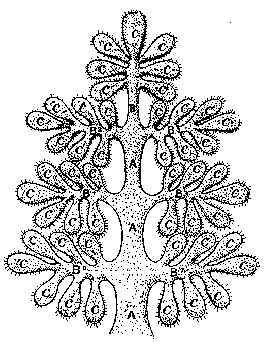

##### The Secret Doctrine by H. P. Blavatsky -- Vol. 2

------------------------------------------------------------------------

###### \[\[Vol. 2, Page\]\] 423 THE "BUDDHAS OF CONFESSION."

#### ADDITIONAL FRAGMENTS FROM A COMMENTARY ON THE VERSES OF STANZA XII.

**T**HE **MS.** from which these additional explanations are taken
belongs to the group called *"Tongshaktchi Sangye Songa,"* or the
Records of the "Thirty-five Buddhas of Confession," as they are
*exoterically* called. These personages, however, though called in the
Northern Buddhist religion "Buddhas," may just as well be called Rishis,
or Avatars, etc., as they are "Buddhas who have preceded Sakyamuni" only
for the Northern followers of the ethics preached by Gautama. These
great Mahatmas, or Buddhas, are a universal and common property: they
are *historical* sages *-*- at any rate, for all the Occultists who
believe in such a hierarchy of Sages, the existence of which has been
proved to them by the learned ones of the Fraternity. They are chosen
from among some ninety-seven Buddhas in one group, and fifty-three in
another,\* mostly imaginary personages, who are really the
personifications of the powers of the first-named.\*\* These "baskets"
of the oldest writings on "palm leaves" are kept very secret. Each
**MS**. has appended to it a short synopsis of the history of that
sub-race to which the particular "Buddha-Lha" belonged. The one special
**MS**. from which the fragments which follow are extracted, and then
rendered into a more comprehensible language, is said to have been
copied from stone tablets which belonged to a Buddha of the earliest day
of the Fifth Race, who had witnessed the Deluge and the submersion of
the chief continents of the Atlantean race. The day when much, if not
all, of that which is given here from the archaic records, will be found
correct, is not far distant. Then the modern symbologists will acquire
the certitude that even Odin, or the god Woden, the highest god in the
German and Scandinavian mythology, is one of these thirty-five Buddhas;
one of the earliest, indeed, for the continent to which he and his race
belonged, is also one of the earliest. So early, in truth, that in the
days when tropical nature was to be found, where now lie eternal
unthawing snows, one could cross almost by dry land from Norway *via*
Iceland and Greenland, to the lands that at present surround Hudson's

###### \[\[Footnote(s)\]\] -------------------------------------------------

\* Gautama Buddha, named Shakya Thub-pa, is the *twenty-seventh* of the
last group, as most of these Buddhas belong to the *divine dynasties*
which instructed mankind.

\*\* Of these "Buddhas," or the "Enlightened," the far distant
predecessors of Gautama the Buddha, and who represent, we are taught,
once living men, great adepts and Saints, in whom the "Sons of Wisdom"
had incarnated, and who were, therefore, so to speak, minor Avatars of
the Celestial Beings -- eleven only belong to the Atlantean race, and 24
to the Fifth race, from its beginnings. They are identical with the
Tirtankaras of the Jainas.

------------------------------------------------------------------------

###### \[\[Vol. 2, Page\]\] 424 THE SECRET DOCTRINE.

Bay.\* Just, as in the palmy days of the Atlantean giants, the sons of
the "giants from the East," a pilgrim could perform a journey from what
in our days is termed the Sahara desert, to the lands which now rest in
dreamless sleep at the bottom of the waters of the Gulf of Mexico and
the Caribbean Sea. Events which were never written outside the human
memory, but which were religiously transmitted from one generation to
another, and from race to race, may have been preserved by constant
transmission "within the book volume of the brain," and through
countless aeons, with more truth and accuracy than inside any written
document or record. "That which is part of our souls is eternal," says
Thackeray; and what can be nearer to our souls than that which happens
at the dawns of our lives? Those lives are countless, but the soul or
spirit that animates us throughout these myriads of existences is the
same; and though "the book and volume" of the *physical* brain may
forget events within the scope of one terrestrial life, the bulk of
collective recollections can never desert the divine soul within us. Its
whispers may be too soft, the sound of its words too far off the plane
perceived by our physical senses; yet the shadow of events *that were,*
just as much as the shadow of the events *that are to come,* is within
its perceptive powers, and is ever present before its mind's eye.

It is this soul-voice, perhaps, which tells those who believe in
tradition more than in written History, that what is said below is all
true, and relates to pre-historic facts.

This is what is written in one passage: --

"**T**HE **K**INGS OF **L**IGHT HAVE DEPARTED IN WRATH. **T**HE SINS OF
MEN HAVE BECOME SO BLACK THAT **E**ARTH QUIVERS IN HER GREAT AGONY. . .
. **T**HE AZURE SEATS REMAIN EMPTY. **W**HO OF THE **B**ROWN, WHO OF THE
**R**ED, OR YET AMONG THE **B**LACK (*races*), CAN SIT IN THE SEATS OF
THE **B**LESSED, THE **S**EATS OF KNOWLEDGE AND MERCY! **W**HO CAN
ASSUME THE FLOWER OF POWER, THE PLANT OF THE GOLDEN STEM AND THE AZURE
BLOSSOM?"

###### \[\[Footnote(s)\]\] -------------------------------------------------

\* This may account for the similarity of the artificial mounds in the
U. S. of America, and the tumuli in Norway. It is this identity that led
some American archaeologists to suggest that Norwegian mariners had
*discovered* America some one thousand years ago. (*Vide* Holmboe's
*Traces de Bouddhisme en Norvege,* p. 23). There is no doubt that
America is that "far distant land into which pious men and heavy storms
had transferred the sacred doctrine," as a Chinese writer suggested by
his description to Neumann. But neither Professor Holmboe, of Stockholm,
nor the American archaeologists, have guessed the right age of the
mounds, or the tumuli. The fact that Norwegians may have re-discovered
the land that their long-forgotten forefathers believed to have perished
in the general submersion, does not conflict with that other fact that
the *Secret Doctrine* of the land which was the cradle of physical man,
and of the Fifth Race, had found its way into the so-called *New World*
ages and ages before the "Sacred Doctrine" of Buddhism.

------------------------------------------------------------------------

###### \[\[Vol. 2, Page\]\] 425 THE OLDEST RECORDS ABOUT ATLANTIS.

The "Kings of Light" is the name given in all old records to the
Sovereigns of the divine Dynasties. The "azure seats" are translated
"celestial thrones" in certain documents. The "flower of power" is now
the Lotus; what it may have been at that period, who can tell.

The writer proceeds, like the later Jeremiah, to bewail the fate of his
people. They had become bereft of their "azure" (celestial) kings, and
"they of the *Deva* hue," the moon-like complexion, and "they of the
refulgent (golden) face" have gone "to the land of bliss, the land of
metal and fire"; or -- agreeably with the rules of symbolism -- to the
lands lying North and East, from whence "the great waters have been
swept away, sucked in by the earth and dissipated in the air." The wise
races had perceived "the black storm-dragons, called down by the dragons
of wisdom" -- and "had fled, led on by the shining Protectors of the
most Excellent Land" -- the great ancient adepts, presumably; those the
Hindus refer to as their Manus and Rishis. One of them was Vaivasvata
Manu.

They "of the yellow hue" are the forefathers of those whom Ethnology now
classes as the Turanians, the Mongols, Chinese and other ancient
nations; and the land they fled to was no other than Central Asia. There
entire new races were born; there they lived and died until the
separation of the nations. But this "separation" did not take place
either in the localities assigned for it by modern science, nor in the
way the Aryans are shown to have divided and separated by Mr. Max Muller
and other *Aryanists.* Nearly two-thirds of one million years have
elapsed since that period. The yellow-faced giants of the post-Atlantean
day, had ample time, throughout this forced confinement to one part of
the world, and with the same racial blood and without any fresh infusion
or admixture in it, to branch off during a period of nearly 700,000
years into the most heterogeneous and diversified types. The same is
shown in Africa; nowhere does a more extraordinary variability of types
exist, from black to almost white, from gigantic men to dwarfish races;
and this only because of their forced isolation. The Africans have never
left their continent for several hundred thousands of years. If
to-morrow the continent of Europe were to disappear and other lands to
re-emerge instead; and if the African tribes were to separate and
scatter on the face of the earth, it is they who, in about a hundred
thousand years hence, would form the bulk of the civilized nations. And
it is the descendants of those of our highly cultured nations, who might
have survived on some one island, without any means of crossing the new
seas, that would fall back into a state of relative savagery. Thus the
reason given for dividing humanity into *superior* and *inferior* races
falls to the ground and becomes a fallacy.

------------------------------------------------------------------------

###### \[\[Vol. 2, Page\]\] 426 THE SECRET DOCTRINE.

Such are the statements made and facts given in the archaic records.
Collating and comparing them with some modern theories of Evolution,
*minus natural selection* (*Vide* "Physiological Selection" by G. J.
Romanes, **F.R.S.**), these statements appear quite reasonable and
logical.\* Thus, while the Aryans are the descendants of the *yellow*
Adams, the gigantic and highly civilized tlanto-Aryan race, the Semites
-- and the Jews along with them -- are those of the red Adam; and both
de Quatrefages and the writers of the Mosaic *Genesis* are right. For,
could chapter v. of the First Book of Moses be compared with the
genealogies found in our Archaic Bible, the period from Adam unto Noah
would be found noticed therein, of course under different names, the
respective years of the Patriarchs being turned into periods, the whole
being shown symbolical and allegorical. In the **MS**. under
consideration many and frequent are the references to the great
knowledge and civilization of the Atlantean nations, showing the polity
of several of them and the nature of their arts and sciences. If the
Third Root-Race, the Lemuro-Atlanteans, are already spoken of as having
been drowned "with their high civilizations and gods" (*"Esoteric
Buddhism,"* p. 65), how much more may the same be said of the
Atlanteans!

It is from the Fourth Race that the early Aryans got their knowledge of
"the bundle of wonderful things," the *Sabha* and *Mayasabha,* mentioned
in the Mahabharata, the gift of Mayasur to the Pandavas. It is from them
that they learnt aeronautics, *Viwan Vidya* (the "knowledge of flying in
air-vehicles"), and, therefore, their great arts of meteorography and
meteorology. It is from them, again, that the Aryans inherited their
most valuable science of the hidden virtues of precious and other
stones, of chemistry, or rather alchemy, of mineralogy, geology, physics
and astronomy.

Several times the writer has put to herself the question: "Is the story
of Exodus -- in its details at least -- as narrated in the Old
Testament, original? Or is it, like the story of Moses himself and many
others, simply another version of the legends told of the Atlanteans?"
For who, upon hearing the story told of the latter, will fail to
perceive the great similarity of the fundamental features? The anger of
"God" at the obduracy of Pharaoh, his command to the "chosen" ones, to
spoil the Egyptians, before departing, of their "jewels of silver and
jewels of gold" (Exod. xi.); and finally the Egyptians and their Pharaoh
drowned in the Red Sea (xiv.). For here is a fragment of the earlier
story from the Commentary: --

###### \[\[Footnote(s)\]\] -------------------------------------------------

\* *Vide* the first pages of Part **III**., **S**CIENCE AND THE
**S**ECRET **D**OCTRINE **C**ONTRASTED.

------------------------------------------------------------------------

###### \[\[Vol. 2, Page\]\] 427 THE DOOM OF ATLANTIS.

. . . *"And the 'great King of the dazzling Face,' the chief of all the*
*Yellow-faced, was sad, seeing the sins of the Black-faced.*

*"He sent his air-vehicles* (Viwan) *to all his brother-chiefs* (chiefs
of other nations and tribes) *with pious men within, saying: 'Prepare.
Arise* *ye men of the good law, and cross the land while* (yet) *dry.'*

*'The Lords of the storm are approaching. Their chariots are nearing*
*the land. One night and two days only shall the Lords of the Dark Face*
(the Sorcerers) *live on this patient land. She is doomed, and they have
to* *descend with her. The nether Lords of the Fires* (the Gnomes and
fire Elementals) *are preparing their magic Agneyastra* (fire-weapons
worked by magic). *But the Lords of the Dark Eye* ("Evil Eye") *are
stronger* *than they* (the Elementals) *and they are the slaves of the
mighty ones.* *They are versed in Ashtar* (Vidya, the highest magical
knowledge).\* *Come and use yours* (i.e., your magic powers, in order to
counteract those of the Sorcerers). *Let every lord of the Dazzling
Face* (an adept of the White Magic) *cause the Viwan of every lord of
the Dark Face to come* *into his hands* (or possession), *lest any* (of
the Sorcerers) *should by its* *means escape from the waters, avoid the
rod of the Four,* (Karmic deities) *and save his wicked'* (followers, or
people).

*'May every yellow face send sleep from himself* (mesmerize?) *to every*
*black face. May even they* (the Sorcerers) *avoid pain and suffering.*
*May every man true to the Solar Gods bind* (paralyze) *every man under*
*the lunar gods, lest he should suffer or escape his destiny.*

*'And may every yellow face offer of his life-water* (blood) *to the*
*speaking animal of a black face, lest he awaken his master.*\*\*

*'The hour has struck, the black night is ready, etc., etc.*

*. . . . . . . . . .* . . . . .

*'Let their destiny be accomplished. We are the servants of the great*
*Four.*\*\*\* *May the Kings of light return.'* "

###### \[\[Footnote(s)\]\] -------------------------------------------------

\* Wrote the late Brahmachari Bawa, a Yogi of great renown and holiness:
"Extensive works on *Ashtar Vidya* and such other sciences were at
different times compiled in the languages of the times. But the Sanskrit
originals were lost at the time of the partial deluge of our country." .
. . (*See Theosophist* of June, 1880, "Some Things the Aryans Knew.")
For *Agneyastra,* see Wilson's *Specimens of the Hindu Theatre,* I., p.
297.

\*\* Some wonderful, artificially-made beast, similar in some way to
Frankenstein's creation, which spoke and warned his master of every
approaching danger. The master was a "black magician," the mechanical
animal was informed by a *djin,* an Elemental, according to the
accounts. The blood of a pure man alone could destroy him. *Vide* Part
**II**., xxvii., "Seven in Astronomy, Science, and Magic."

\*\*\* The four Karmic gods, called the Four Maharajahs in the Stanzas.

------------------------------------------------------------------------

###### \[\[Vol. 2, Page\]\] 428 THE SECRET DOCTRINE.

*"The great King fell upon his dazzling Face and wept*. . . .

*"When the Kings assembled the waters had already moved*. . . .

"(But) *the nations had now crossed the dry lands. They were beyond*
*the water mark. Their Kings reached them in their Viwans, and led them*
*on to the lands of Fire and Metal* (East and North)."

. . . . . . . . . . . . . . .

Still, in another passage, it is said: --

" . . . *. Stars* (meteors) *showered on the lands of the* *black*
*Faces;* *but they slept.*

*"The speaking beasts* (the magic watchers) *kept quiet.*

*"The nether lords waited for orders, but they came not, for their*
*masters slept.*

*"The waters arose, and covered the valleys from one end of the Earth*
*to the other. High lands remained, the bottom of the Earth* (the lands
of the antipodes) *remained dry. There dwelt those who escaped; the men
of* *the yellow-faces and of the straight eye* (the frank and sincere
people).

*"When the Lords of the Dark Faces awoke and bethought themselves* *of
their Viwans in order to escape from the rising waters, they found*
*them gone."*

Then a passage shows some of the more powerful magicians of the "Dark
Face" -- who awoke earlier than the others -- pursuing those who had
"spoilt them" and who were in the rear-guard, for -- *"the nations*
*that were led away, were as thick as the stars of the milky way,"* says
a more modern Commentary, written in Sanskrit only.

*"Like as a dragon-snake uncoils slowly its body, so the Sons of men,*
*led on by the Sons of Wisdom, opened their folds, and spreading out,*
*expanded like a running stream of sweet waters*. . . . . . *many of the
faint-hearted among them perished on their way. But most were saved."*

Yet the pursuers, "whose heads and chests soared high above the water,"
chased them "for three lunar terms" until finally reached by the rising
waves, they perished to the last man, the soil sinking under their feet
and the earth engulfing those who had desecrated her.

This sounds a good deal like the original material upon which the
similar story in *Exodus* was built many hundred thousands of years
later. The biography of Moses, the story of his birth, childhood and
rescue from the Nile by Pharaoh's daughter, is now shown to have been
adapted from the Chaldean narrative about Sargon. And if so, the
Assyrian tile in the British Museum being a good proof of it, why not
that of the Jews robbing the Egyptians of their jewels, the death of
Pharaoh and his army, and so on? The gigantic magicians of Ruta and
Daitya, the "lords of the Dark Face," may have become in the later
narrative the Egyptian Magi, and the yellow-faced nations of

------------------------------------------------------------------------

###### \[\[Vol. 2, Page\]\] 429 SHADOWY MEMENTOS OF THE PAST.

the Fifth Race, the virtuous sons of Jacob, the "chosen people." . . .
One more statement has to be made: There have been several Divine
Dynasties -- a series for every Root Race beginning with the Third, each
series according and adapted to its Humanity. The last Seven Dynasties
referred to in the Egyptian and Chaldean records belong to the Fifth
Race, which, though generally called Aryan, was not entirely so, as it
was ever largely mixed up with races to which Ethnology gives other
names. It would be impossible, in view of the limited space at our
disposal, to go any further into the description of the Atlanteans, in
whom the whole East believes as much as we believe in the ancient
Egyptians, but whose existence the majority of the Western Scientists
deny, as they have denied, before this, many a truth, from the existence
of Homer down to that of the carrier pigeon. The civilization of the
Atlanteans was greater even than that of the Egyptians. It is their
degenerate descendants, the nation of Plato's Atlantis, which built the
first Pyramids in the country, and that certainly before the advent of
the "Eastern AEthiopians," as Herodotus calls the Egyptians. This may be
well inferred from the statement made by Ammianus Marcellinus, who says
of the Pyramids that "there are also subterranean passages and winding
retreats, which, it is said, men skilful in the ancient mysteries, by
means of which they divined the coming of a flood, constructed in
different places lest the memory of all their sacred ceremonies should
be lost."

These men who "divined the coming of floods" were not Egyptians, who
never had any, except the periodical rising of the Nile. Who were they?
The last remnants of the Atlanteans, we maintain. Those races which are
dimly suspected by Science, and thinking of which Mr. Ch. Gould, the
well-known geologist, says: "Can we suppose that we have at all
exhausted the great museum of nature? Have we, in fact, penetrated yet
beyond its antechambers? Does the written history of man, comprising a
few thousand years, embrace the whole course of his intelligent
existence? Or have we in the long mythical eras, extending over hundreds
of thousands of years, and recorded in the chronologies of Chaldea and
of China, shadowy mementos of pre-historic man, handed down by
tradition, and perhaps transported by a few survivors to existing lands
from others, which, like the fabled (?) Atlantis of Plato, may have been
submerged, or the scene of some great catastrophe which destroyed them
with all their civilization" (*"Mythical Monsters,"* *p*. 19).

After this one can turn with more confidence to the words of a Master
who wrote, several years before these words were penned by Mr. Gould: --
"The Fourth Race had its periods of the highest civilization. Greek and
Roman and even Egyptian civilizations are nothing com-

------------------------------------------------------------------------

###### \[\[Vol. 2, Page\]\] 430 THE SECRET DOCTRINE.

pared to the civilizations that began with the Third Race" -- after its
separation.

But if this civilization and the mastery of arts and sciences are denied
to the Third and Fourth Races, no one will deny that between the great
civilizations of antiquity, such as those of Egypt and India, there
stretched the dark ages of crass ignorance and barbarism ever since the
beginning of the Christian era up to our modern civilization; during
which period all recollection of these traditions was lost. As said in
*Isis Unveiled:* "Why should we forget that, ages before the prow of the
adventurous Genoese clove the Western waters, the Phoenician vessels had
circumnavigated the globe, and spread civilization in regions now silent
and deserted? What archaeologist will dare assert that the same hand
which planned the Pyramids of Egypt, Karnak, and the thousand ruins now
crumbling to oblivion on the sandy banks of the Nile, did *not* erect
the monumental Nagkon-Wat of Cambodia? or trace the hieroglyphics on the
obelisks and doors of the deserted Indian village, newly discovered in
British Columbia by Lord Dufferin? or those on the ruins of Palenque and
Uxmal, of Central America? Do not the relics we treasure in our museums
-- last mementos of the long 'lost arts' -- speak loudly in favour of
ancient civilization? And do they not prove, over and over again, that
nations and continents that have passed away have buried along with them
arts and sciences, which neither the first crucible ever heated in a
mediaeval cloister, nor the last cracked by a modern chemist, have
revived, nor will -- at least, in the present century."

And the same question may be put now that was put then; it may be once
more asked: "How does it happen that the most advanced standpoint that
has been reached in our times, only enables us to see in the dim
distance up the Alpine path of knowledge the monumental proofs that
earlier explorers have left to mark the plateaux they had reached and
occupied?

"If modern masters are so much in advance of the old ones, why do they
not restore to us the lost arts of our postdiluvian forefathers? Why do
they not give us the unfading colours of Luxor -- the Tyrian purple; the
bright vermilion and dazzling blue which decorate the walls of this
place, and are as bright as on the first day of their application? The
indestructible cement of the pyramids and of ancient aqueducts; the
Damascus blade, which can be turned like a corkscrew in its scabbard
without breaking; the gorgeous, unparalleled tints of the stained glass
that is found amid the dust of old ruins and beams in the windows of
ancient cathedrals; and the secret of the true malleable glass? And if
chemistry is so little able to rival even the early mediaeval ages in
some arts, why boast of achievements which, accord-

------------------------------------------------------------------------

###### \[\[Vol. 2, Page\]\] 431 MISTAKES OF THE EGYPTOLOGISTS.

ing to strong probability, were perfectly known thousands of years ago?
The more archeology and philology advance, the more humiliating to our
pride are the discoveries which are daily made, the more glorious
testimony do they bear in behalf of those who, perhaps on account of the
distance of their remote antiquity, have been until now considered
ignorant flounderers in the deepest mire of superstition."

Among other arts and sciences, the ancients -- ay, as a heirloom from
the Atlanteans -- had those of astronomy and symbolism, which included
the knowledge of the Zodiac.

As already explained, the whole of antiquity believed, with good reason,
that humanity and its races are all intimately connected with the
planets, and these with Zodiacal signs. The whole world's History is
recorded in the latter. In the ancient temples of Egypt this was proved
by the Dendera Zodiac; but except in an Arabic work, the property of a
*Sufi,* the writer has never met with a correct copy of these marvellous
records of the past, as also of the *future,* history of our globe. Yet
the original records exist, most undeniably.

As Europeans are unacquainted with the real Zodiacs of India, nor do
they understand those they happen to know (witness Bentley), the reader
is advised, in order to verify the statement, to turn to the work of
Denon (*Travels in Egypt, Vol. II.*) in which, *if understood,* the two
famous Egyptian Zodiacs, can be found and examined. Having seen them
personally, the writer has no longer need to trust to what other
students -- who have examined and studied both very carefully - have to
say of them. As asserted by the Egyptian Priests to Herodotus, who was
informed that the terrestrial Pole and the Pole of the Ecliptic had
formerly coincided, thus was it found and corroborated by Mackey.\* For
he states that the Poles are represented on the Zodiacs in both
positions, "And in that which shows the Poles (polar axes) at right
angles, there are marks which prove that 'it was not the last time they
were in that position; *but the first*' -- after the Zodiacs had been
traced." "Capricorn," he adds, "is represented at the North Pole, and
Cancer is divided, near its middle, at the South Pole; which is a
confirmation that originally they had their winter when the Sun was in
Cancer; but the chief characteristics of its being a monument
commemorating the *first* *time* that the Pole had been in that
position, are the Lion and the Virgin." (See in Part **II**., §"A
Mystery of the Zodiac.")

Broadly calculated, it is believed by the Egyptologists that the great
Pyramid was built 3,350 **B.C.** (*See Proctor, Knowledge, Vol. I. pp*.
242, 400); and that Menes and his Dynasty existed 7 50 years before the
Fourth

###### \[\[Footnote(s)\]\] -------------------------------------------------

\* "The Mythological Astronomy of the Ancients Demonstrated" by a
strangely intuitional symbologist and astronomer, a kind of a self-made
adept of Norwich, who lived in the first quarter of this century.

------------------------------------------------------------------------

###### \[\[Vol. 2, Page\]\] 432 THE SECRET DOCTRINE.

Dynasty (supposed to have built the Pyramids) had appeared ("*The Great
Pyramid," Staniland Wake*). Thus 4,100 years **B.C.** is the age
assigned to Menes. Now Sir J. Gardner Wilkinson's declaration that *"all
the facts lead to the conclusion* that the Egyptians had already made
very great progress in the arts of civilization *before the age of
Menes,* *and perhaps before they immigrated into the valley of the
Nile"* (*Rawlinson's "Herodotus," vol. ii. p.* 345) is very suggestive,
as destroying this hypothesis. It points to great civilization in
*prehistoric* times, and a still greater antiquity. The *Schesoo-Hor*
("the servants of Horus") were the people who had settled in Egypt; and,
as M. G. Maspero affirms, it is to this *prehistoric* race that "belongs
the honour . . . of having founded the principal cities of Egypt, and
established the most important sanctuaries." This was *before* the great
Pyramid epoch, and when Egypt had hardly arisen from the waters. Yet
"they possessed the hieroglyphic form of writing special to the
Egyptians, and must have been already considerably advanced in
civilization." It was, says Lenormant, "the country of the great
prehistoric sanctuaries, seats of the sacerdotal dominion, which played
the most important part in the origin of civilization." What is the date
assigned to this people? We hear of 4,000, at the utmost of 5,000 years
**B.C.** (Maspero). Now it is claimed that it is by means of the cycle
of 25,868 years (the Sidereal year) that the approximate year of the
erection of the Great Pyramid can be ascertained. "Assuming that the
long narrow downward passage was directed towards the pole star of the
pyramid builders, astronomers have shown that . . . . Alpha Draconis,
the then pole-star, was in the required position about 3,350 **B.C.**,
as well as in 2,170 **B.C.** (Proctor, quoted by Staniland Wake.) But we
are also told that "this relative position of Alpha Draconis and Alcyone
being an extraordinary one . . it could not occur again for a whole
sidereal year" (*ibid*)*.* This demonstrates that, since the Dendera
Zodiac shows the passage of three sidereal years, the great Pyramid must
have been built 78,000 years ago, or in any case that this possibility
deserves to be accepted at least as readily as the later date of 3,350
**B.C.**

Now on the Zodiac of a certain temple in far Northern India, as on the
Dendera Zodiac, the same characteristics of the signs are found. Those
who know well the Hindu symbols and constellations, will be able to find
out by the description of the Egyptian, whether the indications of the
chronological time are correct or not. On the Dendera Zodiac as
preserved by the modern Egyptian Coptic and Greek adepts, and explained
a little differently by Mackey, the Lion stands upon the *Hydra* and his
tail is almost straight, pointing downwards at an angle of forty or
fifty degrees, this position agreeing with the *original* conformation
of these constellations. "But in many places we see the Lion (*Simha*),"

------------------------------------------------------------------------

###### \[\[Vol. 2, Page\]\] 433 THEORIES OF A SELF-MADE ADEPT.

Mackey adds, "with his tail turned up over his back, and ending with a
Serpent's head; thereby showing that the Lion had been *'inverted';*
which, indeed, must have been the case with the whole Zodiac and every
other Constellation, when the Pole had been inverted."

Speaking of the *Circular* Zodiac, given also by Denon, he says: --
There, "the Lion is standing *on* the Serpent, and his tail forming a
curve downward, from which it is found that *though six or seven
hundred* *thousand years* must have passed between the two positions,
yet they had made but little difference between in the constellations of
Leo and the Hydra; while *Virgo* is represented very differently in the
two. In the *circular* Zodiac, the *Virgin is nursing her child;* but it
seems that they had not had that idea when the pole was first within the
plane of the Ecliptic; for in *this* Zodiac, as given by Denon, we see
*three Virgins* between the Lion and the Scales, *the last of which
holds in her hand* an ear of wheat. It is much to be lamented that there
is in this Zodiac a breach of the figure in the latter part of Leo and
the *beginning of Virgo* which has taken away one *Decan* out of each
sign."

Nevertheless, the meaning is plain, as the three Zodiacs belong to three
different epochs: namely, to the last three family races of the fourth
Sub-race of the Fifth Root-race, each of which must have lived
approximately from 25 to 30,000 years. The first of these (the
"Aryan-Asiatics") witnessed the doom of the last of the populations of
the "giant Atlanteans"\* who perished some 850,000 years ago (the Ruta
and Daitya Island-Continents) toward the close of the Miocene Age.\*\*
The fourth sub-race witnessed the destruction of the last remnant of the
Atlanteans -- the Aryo-Atlanteans in the last island of Atlantis,
namely, some 11,000 years ago. In order to understand this the reader

###### \[\[Footnote(s)\]\] -------------------------------------------------

\* The term "Atlantean" must not mislead the reader to regard these as
one race only, or even a nation. It is as though one said "Asiatics."
Many, multityped, and various were the Atlanteans, who represented
several *humanities,* and almost a countless number of races and
nations, more varied indeed than would be the "Europeans" were this name
to be given indiscriminately to the five existing parts of the world;
which, at the rate colonization is proceeding, will be the case,
perhaps, in less than two or three hundred years. There were brown, red,
yellow, white and black Atlanteans; giants and dwarfs (as some African
tribes comparatively are, even now).

\*\* Says a teacher in "Esoteric Buddhism," on p. 64: "In the Eocene
age, even in its very first part, the great cycle of the fourth race men
the (Lemuro) Atlanteans had already reached its highest point (of
civilization), and the great continent, the father of nearly all the
present continents, showed the first symptoms of sinking. . . ." And on
page 70, it is shown that Atlantis as a whole perished during the
Miocene period. To show how the continents, races, nations and cycles
overlap each other, one has but to think of Lemuria, the last of whose
lands perished about 700,000 years before the beginning of the Tertiary
period (see p. 65 of the same work), and the last of "Atlantis" only
11,000 years ago; thus both overlapping -- one the Atlantean period, and
the other the Aryan.

------------------------------------------------------------------------

###### \[\[Vol. 2, Page\]\] 434 THE SECRET DOCTRINE.

is asked to glance at the diagram of the genealogical tree of the Fifth
Root-Race -- generally, though hardly correctly, called the Aryan race,
and the explanations appended to it.

Let the reader remember well that which is said of the divisions of Root
Races and the evolution of Humanity in this work, and stated clearly and
concisely in Mr. Sinnett's "Esoteric Buddhism."

1\. There are seven **R**OUNDS in every manvantara; this one is the
Fourth, and we are in the Fifth Root-Race, at present.

2\. Each Root-Race has seven sub-races.

3\. Each sub-race has, in its turn, seven ramifications, which may be
called Branch or "Family" races.

4\. The little tribes, shoots, and offshoots of the last-named are
countless and depend on Karmic action. Examine the "genealogical tree"
hereto appended, and you will understand. The illustration is purely
diagrammatic, and is only intended to assist the reader in obtaining a
slight grasp of the subject, amidst the confusion which exists between
the terms which have been used at different times for the divisions of
Humanity. It is also here attempted to express in figures -- but only
within approximate limits, for the sake of comparison -- the duration of
time through which it is possible to definitely distinguish one division
from another. It would only lead to hopeless confusion if any attempt
were made to give accurate dates to a few; for the Races, Sub-Races,
etc., etc., down to their smallest ramifications, overlap and are
entangled with each other until it is nearly impossible to separate
them.

The human Race has been compared to a tree, and this serves admirably as
an illustration.

The main stem of a tree may be compared to the ROOT-RACE (A).

------------------------------------------------------------------------

###### \[\[Vol. 2, Page\]\] 435 ILLUSTRATION OF THE RACES.

Its larger limbs to the various SUB-RACES; seven in number (B1, B2).

On each of these limbs are seven BRANCHES, OR FAMILY-RACES. (C).

After this the cactus-plant is a better illustration, for its fleshy
"leaves" are covered with sharp spines, each of which may be compared to
a nation or tribe of human beings.

Now our Fifth Root-Race has already been in existence -- as a race *sui
generis* and quite free from its parent stem -- about 1,000,000 years;
therefore it must be inferred that each of the four preceding Sub-Races
has lived approximately 210,000 years; thus each Family-Race has an
average existence of about 30,000 years. Thus the European "Family Race"
has still a good many thousand years to run, although the nations or the
innumerable spines upon it, vary with each succeeding "season" of three
or four thousand years. It is somewhat curious to mark the comparative
approximation of duration between the lives of a "Family-Race" and a
"Sidereal year."

The knowledge of the foregoing, and the accurately correct division,
formed part and parcel of the Mysteries, where these Sciences were
taught to the disciples, and where they were transmitted by one
hierophant to another. Everyone is aware that the European astronomers
assign (arbitrarily enough) the date of the invention of the Egyptian
Zodiac to the years 2000 or 2400 **B.C.** (*Proctor*); and insist that
this invention coincides in its date with that of the erection of the
Great Pyramid. This, to an Occultist and Eastern astronomer, must appear
quite absurd. The year of the *Kaliyuga* is said to have begun between
the 17th and 18th of February in the year 3102 **B.C.** Now the Hindus
claim that in the year 20400 before Kaliyugam, the origin of their
Zodiac coincided with the spring equinox -- there being at the time a
conjunction of the Sun and Moon -- and Bailly proved by a lengthy and
careful computation of that date, that, even if fictitious, the epoch
from which they had started to establish the beginning of their Kaliyug
was *very real.* That "epoch is the year 3102 before our era," he
writes. (*See Part III., Book I.* "*Hindu Astronomy defended by an
Academician".*) The lunar eclipse arriving just a fortnight after the
beginning of the black Age -- it took place in a point situated between
the Wheat Ear of Virgo and the star \[\[*theta*\]\] of the same
constellation. One of their most esoteric Cycles is based upon certain
conjunctions and respective positions of Virgo and the Pleiades *--*
(*Krittika*)*.* Hence, as the Egyptians brought their Zodiac from
Southern India and Lanka,\* the esoteric meaning was evidently
identical. The three "Virgins," or Virgo in three different positions,
meant, with both, the record of the first three "divine or astronomical
Dynasties," who taught the Third

###### \[\[Footnote(s)\]\] -------------------------------------------------

\* Ceylon.

------------------------------------------------------------------------

###### \[\[Vol. 2, Page\]\] 436 THE SECRET DOCTRINE.

Root-Race; and after having abandoned the Atlanteans to their doom,
returned (or redescended, rather) during the third Sub-Race of the
Fifth, in order to reveal to saved humanity the mysteries of their
birth-place -- the sidereal Heavens. The same symbolical record of the
human races and the three Dynasties (Gods, Manes -- semi-divine astrals
of the Third and Fourth, and the "Heroes" of the Fifth Race), which
preceded the purely human kings, was found in the distribution of the
tiers and passages of the Egyptian Labyrinth. As the three inversions of
the Poles of course changed the face of the Zodiac, a new one had to be
constructed each time. In Mackey's "Sphinxiad" the speculations of the
bold author must have horrified the orthodox portion of the population
of Norwich, as he says, fantastically enough: --

"But, after all, the greatest length of time recorded by those monuments
(the Labyrinth, the Pyramids and the Zodiacs) *does not exceed* *five
millions of years* (which is not so)\*; which falls short of the records
given us both by the (esoteric) Chinese and Hindus; which latter nation
has registered a knowledge of time for seven or eight millions of
years\*\*; which I have seen upon a talisman of porcelain. . . . "

The Egyptian priests had the Zodiacs of the Atlantean Asura-Maya, as the
modern Hindus still have. As stated in "*Esoteric Buddhism,*" the
Egyptians, as well as the Greeks and "Romans" some thousand years ago,
were "remnants of the Atlanto-Aryans," *i.e.*, the former, of the older,
or the Ruta Atlanteans; the last-named, the descendants of the last race
of that island, whose sudden disappearance was narrated to Solon by the
Egyptian Initiates. The *human* Dynasty of the older Egyptians,
beginning with Menes, had all the *knowledge* of the Atlanteans, though
there was no more Atlantean blood in their veins. Nevertheless, they had
preserved all their Archaic records. All this has been shown long
ago.\*\*\* And it is just because the Egyptian Zodiac is between 75 and
80,000 years old that the Zodiac of the Greeks is far later. Volney has
correctly pointed out in his "Ruins of Empires" (p. 360) that it is only
16,984 years old, or up to the present date 17,082.\*\*\*\*

###### \[\[Footnote(s)\]\] -------------------------------------------------

\* The forefathers of the Aryan Brahmins had their Zodiacal calculations
and Zodiac from those born by Kriyasakti power, the "Sons of Yoga"; the
Egyptians from the Atlanteans of Ruta.

\*\* The former, therefore, may have registered time for seven or eight
millions of years, but the Egyptians *could not.*

\*\*\* This question was amply challenged, and as amply discussed and
answered. See *Five Years of Theosophy.* (*Art. "Mr. Sinnett's Esoteric
Buddhism," pp.* 325-46).

\*\*\*\* Volney says that, as *Aries* was in its 15th degree 1447
**B.C**., it follows that the first degree of "Libra" could not have
coincided with the vernal equinox more lately than 15,194 years
**B.C.**, to which if you add 1790 since Christ, when Volney wrote this,
it appears that 16,984 years have elapsed since the (Greek or rather
Hellenic) origin of the Zodiac.

------------------------------------------------------------------------

[Next Section](sd2-1-25.md)

[Contents](sd2-0-co.htm#contents.md)
