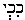

##### *The Secret Doctrine* by H. P. Blavatsky -- Vol. 2

------------------------------------------------------------------------

###### \[\[Vol. 2, Page\]\] 452 THE SECRET DOCTRINE.

### § XVI.

#### ADAM-ADAMI.

**N**AMES such as Adam-Adami, used by Mr. Chwolsohn in his "Nabathean
Agriculture"\* and derided by M. Renan, may prove little to the profane.
To the Occultist, however, once that the term is found in a work of such
immense antiquity as the above cited, it proves a good deal: for
instance that *Adami* was a manifold symbol, originating with the Aryan
people, as the root word shows, and having been taken from them by the
Semites and the Turanians -- as many other things were.

"Adam-Adami" is a generic compound name as old as languages are. The
Secret Doctrine teaches that *Ad*-i was the name given to the first
*speaking* race of mankind -- in this Round -- by the Aryans. Hence the
*Adonim* and *Adonai* (the ancient plural form of the word *Adon*)*,*
which the Jews applied to their Jehovah and angels, who were simply the
first spiritual and ethereal sons of the earth; and the god Adonis, who
in his many variations stood for the "First Lord." Adam is the Sanskrit
*Ada-Nath,* also meaning first Lord, as *Ad*-Iswara, or any *Ad* (the
first) followed by any adjective or substantive. The reason for this is
that such truths were a common inheritance. It was a revelation received
by the *first* mankind before that time which, in Biblical phraseology,
is called "the period of one *lip* and word," or speech; knowledge
expanded by man's own intuition later on, but still later hidden from
profanation under an adequate symbology. The author of the "Qabbalah,
(according to), the philosophical writings of Ibn Gebirol," shows the
Israelite using "*Ad*onai," (Lord) instead of *Eh*'*yeh* (*I am*) and
*YHVH*, and adds that, while *Ad*onai is rendered "Lord" in the Bible,
"the lowest designation, or the Deity in Nature, the more general term
Elohim, is translated God." (p. 175.)

A curious work was translated in 1860 or thereabout, by the Orientalist
Chwolsohn, and presented to ever-incredulous and flippant Europe under
the innocent title of *Nabathean Agriculture.* In the opinion of the
translator that archaic volume *is* "*a complete initiation* into the
mysteries of the pre-Adamite nations, on the authority of *undeniably
authentic* *documents.*" It is "an invaluable compendium, the full
epitome of the Doctrines held, of the arts and sciences, not only of the
Chaldeans, but also of the Assyrians and Canaanites of the prehistoric
ages." These

###### \[\[Footnote(s)\]\] -------------------------------------------------

*\* Vide infra.*

------------------------------------------------------------------------

###### \[\[Vol. 2, Page\]\] 453 "NABATHEAN AGRICULTURE."

"*Nabatheans*" *--* as some critics thought -- were simply the Sabeans,
or Chaldean star-worshippers. The work is a retranslation from the
Arabic, into which language it was at first translated from the
Chaldean.

Masoudi, the Arabic Historian, speaks of those *Nabatheans,* and
explains their origin in this wise: "After the Deluge (?) the nations
established themselves in various countries. Among these were the
Nabatheans, who founded the city of Babylon, and were those descendants
of Ham who settled in the same province under the leadership of Nimrod,
the son of Cush, who was the son of Ham, and great-grandson of Noah. . .
. . This took place at the time when Nimrod received the governorship of
Babylonia as the delegate of Dzahhak named Biurasp."

The translator, Chwolsohn, finds that the assertions of this historian
are in perfect accord with those of Moses in *Genesis;* while more
irreverent critics might express the opinion that for this very reason
their truth should be suspected. It is useless to argue this point,
which is of no value in the present question. The weather-beaten,
long-since-buried problem, and the difficulty of accounting, on any
logical ground, for the phenomenal derivation of millions of people of
various races, of many civilized nations and tribes, from *three*
couples (Noah's sons) in 346 years\* after the Deluge, may be left to
the Karma of the author of *Genesis,* whether he is called Moses or
Ezra. That which is interesting in the work noticed is its contents, the
doctrines enunciated in it, which are again, if read esoterically,
almost all of them identical with the Secret Teachings.

Quatremere suggested that this book might have been simply a copy made
under Nebuchadnezzar **II**., from some Hamitic treatise, "infinitely
more ancient," while the author maintains, on "internal and external
evidence," that its Chaldean original was written out from the oral
discourses and teachings of a wealthy Babylonian landowner, named
Qu-tamy, who had used for those lectures still more ancient materials.
The first Arabic translation is placed by Chwolsohn so far back as the
**XIII**. cent. **B**.**C**. On the first page of this "revelation," the
author, or *amanuensis,* Qu-tamy, declares that "the doctrines
propounded therein, were originally told by *Saturn to the Moon, who*
*communicated them to her idol, which idol revealed them to her
devotee,* *the writer* -- the adept Scribe of that work -- Qu-tamy.

The details given by the God for the benefit and instruction of mortals,
show periods of incalculable duration and a series of numberless
kingdoms and *Dynasties* that preceded the appearance on Earth of

###### \[\[Footnote(s)\]\] -------------------------------------------------

\* *See Genesis* and the authorised Chronology. In Chapt. ix. "Noah
leaveth the Ark" "**B**.**C**. 2348." Chapter x. "Nimrod the first
Monarch," stands over "**B**.**C**. 1998."

------------------------------------------------------------------------

###### \[\[Vol. 2, Page\]\] 454 THE SECRET DOCTRINE.

*Adami* (the "red-earth"). These periods have aroused, as might have
been expected, the defenders of the chronology of the Biblical
dead-letter meaning almost to fury. De Rougemont was the first to make a
*levee*-in-arms against the translator. He reproaches him\* with
"*sacrificing* Moses to an anonymous author." Berosus, he urges,
"however great were *his chronological errors,* was at least in perfect
accord with the prophet with regard to the first men, since he speaks of
*Alorus-Adam,* of *Xisuthrus-Noah,* and of *Belus-Nimrod,*" etc.
"Therefore," he adds, "the work *must be* an **A**POCRYPHA to be ranged
with its contemporaries -- *the* *fourth book of Esdras, that of Enoch,*
the *Sibylline Oracles,* and the *Book of Hermes -- every one of these
dating* *no further back than two or three centuries* **B***.***C***.*"
Ewald came down still harder on Chwolsohn, and finally M. Renan. In the
"*Revue* *Germanique,*"*\*\** the ex-pupil pulls down the authority of
his master, by asking him to show a reason why his *Nabathean
Agriculture* should not be the fraudulent work of some Jew of the third
or fourth century of our era? It can hardly be otherwise -- argues the
romancer of the "Life of Jesus." Since, in this *in-folio* on astrology
and Sorcery we recognise in the personages introduced by Qu-tamy, all
the patriarchs of the Biblical legends, such as *Adam-Adami,
Anouka-Noah,* and his *Ibrahim-Abraham* etc., etc."

This is no reason, since Adam and others are generic names. Meanwhile it
is humbly submitted that, all things considered, an *apocrypha --* if
even of the third century **A**.**D**., instead of the thirteenth
century **B.C**., as suggested by Quatremere -- is old enough to appear
*genuine* as a document, and so satisfy the demands of the most exacting
archaeologist and critic. For, even admitting, for argument's sake, that
this literary relic has been compiled by "some Jew of the third century
of our era" -- what of that? Leaving the credibility of its doctrines
for a moment aside, why should it be less entitled to a hearing, or less
instructive as reflecting older opinions, than any other religious work,
also a "compilation from old texts" or oral tradition -- of the same or
even a later age? In such case we should have to reject and call
"apocryphal" the Quran -- two centuries older, though we know it to have
sprung, Minerva-like, direct from the brain of the Arabian prophet; and
we should have to pooh-pooh all the information we can get from the
*Talmud,* which, in its present form, was also compiled from older
materials, and is not earlier than the **IX**. century of our era.

The curious "Bible" of the Chaldean adept, and the various criticisms
upon it (as in the Chwolsohn's translation), are noticed, because it has
an important bearing upon a great portion of the present work.

###### \[\[Footnote(s)\]\] -------------------------------------------------

*\* Annales de Philosophie,* June 1860, p. 415.

\*\* April 30, 1860.

------------------------------------------------------------------------

###### \[\[Vol. 2, Page\]\] 455 MANY VIEWS OF MANY MINDS.

With the exception of M. Renan, an iconoclast by principle -- so
pointedly called by Jules Lemaitre "*le Paganini du Neant*" *--* the
worst fault found with the work is, it would seem, that the "apocrypha"
pretends to have been communicated *as a revelation* to an adept by, and
from, the "idol of the moon," who received it from "Saturn." Hence, very
naturally, it is "a fairy tale all round." To this there is but one
answer: it is no more a fairy tale than the Bible, and if one falls, the
other must follow it. Even the mode of divination through "the idol of
the moon" is the same as practised by David, Saul, and the High Priests
of the Jewish Tabernacle by means of the Teraphim. In Volume **III**.,
Part **II**. of this present work, the practical methods of such ancient
divination will be found.

The "Nabathean Agriculture" is a compilation indeed; it is no apocrypha,
but the repetition of the tenets of the Secret Doctrine under the
exoteric Chaldean form of national symbols, for the purpose of
"cloaking" the tenets, just as the Books of Hermes and the Puranas are
Egyptian and Hindu attempts at the same. The work was as well known in
antiquity as it was during the Middle Ages. Maimonides speaks of it, and
refers more than once to this Chaldeo-Arabic **MS**., calling the
Nabatheans by their co-religionary name, *i.e*., "star-worshippers," or
Sabeans, but yet failing to see in this disfigured word "Nabatheans" the
mystic name of the caste devoted to *Nebo* (god of *secret* wisdom),
which shows on its face that the *Nabatheans* were an occult
Brotherhood.\* The Nabatheans who, according to the Persian Yezidi,
originally came to Syria from Busrah, were the degenerate members of
that fraternity; still their religion, even at that late day, was purely
Kabalistic.\*\* Nebo is the deity of the planet Mercury, and Mercury is
the god of Wisdom or Hermes, and *Budha,* which the Jews called
 "the Lord on high, the aspiring," . . . and the Greeks
Nabo, \[\[*Nabo*\]\], hence Nabatheans. Notwithstanding that Maimonides
calls their doctrines "heathenish foolishness" and their archaic
literature "*Sabaeorum foetum,*" he places their "agriculture," the
Bible of Qu-tamy, in the first rank of Archaic literature; and Abarbinel

###### \[\[Footnote(s)\]\] -------------------------------------------------

\* "I will mention to thee the writings . . . respecting *the belief of
the Sabeans,*" he says. "The most famous is the Book 'The *Agriculture
of the Nabatheans,*' *which* has been translated by *Ibn Wahohijah.*
This book is full of heathenish foolishness. . . . It speaks of
preparations of **T**ALISMANS, the drawing down of the powers of the
**S**PIRITS, **M**AGIC, **D**EMONS, and ghouls, which make their abode
in the desert." (Maimonides, quoted by Dr. D. Chwolsohn, "Die Ssabier
und der Ssabismus," **II**., p. 458.) The Nabatheans of Mount Lebanon
believed in the Seven Archangels, as their forefathers had believed in
the Seven Great Stars, the abodes and bodies of these Archangels,
believed in to this day by the Roman Catholics, as is shown elsewhere.

\*\* See "Isis Unveiled," Vol. **II**., p. 197.

------------------------------------------------------------------------

###### \[\[Vol. 2, Page\]\] 456 THE SECRET DOCTRINE.

praises it in unmeasured terms. Spencer, quoting the latter, speaks of
it as that "most excellent Oriental work," adding (vol. 1., p. 354) that
by Nabatheans, the Sabeans, the Chaldeans, and the Egyptians, in short
all those nations *against whom the laws of Moses were most* *severely
enacted,* have to be understood.

Nebo, the oldest God of Wisdom of Babylonia and Mesopotamia, was
identical with the Hindu Budha and Hermes-Mercury of the Greeks. A
slight change in the sexes of the parents is the only alteration. As
Budha was the Son of Soma (the Moon) in India, and of the wife of
Brihaspati (Jupiter), so Nebo was the son of Zarpa-nitu (the Moon deity)
and of Merodach, who had become Jupiter, after having been a Sun God. As
Mercury the planet, Nebo was the "overseer" among the seven gods of the
planets; and as the personification of the Secret Wisdom he was *Nabin,*
a seer and a prophet. The fact that Moses is made to die and disappear
on the mount sacred to Nebo, shows him an initiate and a priest of that
god under another name; for this God of Wisdom was the great creative
deity, and was worshipped as such, not alone at Borsippa in his gorgeous
Temple, or planet-tower. He was likewise adored by the Moabites, the
Canaanites, the Assyrians, and throughout the whole of Palestine: then
why not by the Israelites? "The planetary temple of Babylon" had "its
holy of holies" within the shrine of Nebo, the prophet god of Wisdom. We
are told in the Hibbert Lectures, "The ancient Babylonians had an
intercessor between men and the gods . . . and Nebo, was the
'proclaimer' or 'prophet,' as he made known the desire of his father
Merodach."

Nebo is a creator, like Budha, of the Fourth and also of the Fifth Race.
For the former starts a new race of Adepts, and the latter, the
*Solar-Lunar* Dynasty, or the men of these Races and Round. Both are the
Adams of their respective creatures. Adam-Adami is a personation of the
*dual* Adam: of the paradigmic Adam-Kadmon, the creator, and of the
lower Adam, the terrestrial, who, as the Syrian Kabalists have it, had
only *nephesh,* "the breath of life," but *no living* *soul,* until
after his Fall.

If, therefore, Renan persists in regarding the Chaldean Scriptures -- or
what remains of them -- as apocryphal, it is quite immaterial to truth
and fact. There are other Orientalists who may be of a different
opinion; and even were they not, it would still really matter very
little. These doctrines contain the teachings of Esoteric philosophy,
and this must suffice. To those who understand nothing of symbology it
may appear astrolatry, pure and simple, or to him who would conceal the
esoteric truth, even "heathenish foolishness." Maimonides, however,
while expressing scorn for the esotericism in the religion of other
nations, confessed esotericism and symbology in his own, preached

------------------------------------------------------------------------

###### \[\[Vol. 2, Page\]\] 457 THE KABALISTIC FOUR ADAMS.

silence and secresy upon the true meaning of Mosaic sayings, and thus
came to grief. The Doctrines of Qu-tamy, the Chaldean, are, in short,
the allegorical rendering of the religion of the earliest nations of the
Fifth Race.

Why then should M. Renan treat the name "Adam-Adami" with such
academical contempt? The author of the "Origins of Christianity"
evidently knows nothing of the "*origins of pagan* symbolism" or of
Esotericism either, otherwise he would have known that the name was a
form of universal symbol, referring, *even with the Jews,* not to one
man, but to four distinct humanities or mankinds. This is very easily
proven.

The Kabalists teach the existence of four distinct Adams, or the
transformation of four consecutive Adams, the emanations from the
*Dyooknah* (divine phantom) of the Heavenly Man, an ethereal combination
of Neschamah, the highest Soul or Spirit: this Adam having, of course,
neither a gross human body, nor a *body of desire.* This "Adam" is the
prototype (*tzure*) of the second Adam. That they represent our Five
Races is certain, as everyone can see by their description in the
Kabala: the first being the "perfect, Holy Adam"; . . . "a shadow that
disappeared" (the Kings of Edom) produced from the divine *Tzelem*
(Image); the second is called the protoplastic androgyne Adam of the
future terrestrial and separated Adam; the third Adam is the man made of
"dust" (the first, innocent Adam); and the fourth, is the supposed
forefather of our own race -- the Fallen Adam. See, however, the
admirably clear description of these in Mr. Isaac Myer's "Qabbalah," p.
418, *et seq.* He gives only four Adams, because of the Kings of Edom,
no doubt. "The fourth Adam," he writes, " . . . . was clothed with skin,
flesh, nerves, etc. This answers to the Lower *Nephesch* and *Guff,
i.e.,* body, united. He has the animal power of reproduction and
continuance of species," and this is the *human* Root-Race.

It is just at this point that the modern Kabalists -- led into error by
the long generations of Christian mystics who have tampered with the
Kabalistic records wherever they could -- diverge from the Occultists in
their interpretations, and take the later thought for the earlier idea.
The original Kabala was entirely metaphysical, and had no concern with
animal, or terrestrial sexes; the later Kabala has suffocated the divine
ideal under the heavy phallic element. The Kabalists say: -- "God made
man male and female." "Among the Qabbalists, the necessity to continued
creation and existence is called the Balance," says the author of
*Qabbalah;* and being without this "Balance," connected with *Ma-qom*
(mysterious place),\* even the First Race is not,

###### \[\[Footnote(s)\]\] -------------------------------------------------

\* Simply, the womb, the "Holy of Holies" with the Semites.

------------------------------------------------------------------------

###### \[\[Vol. 2, Page\]\] 458 THE SECRET DOCTRINE.

as we have seen, recognized by the Sons of the Fifth Adam. From the
highest Heavenly Man, the upper Adam who is "male female" or Androgyne,
down to the Adam of dust, these personified symbols are all connected
with sex and procreation. With the Eastern Occultists it is entirely the
reverse. The sexual relation they consider as a "Karma" pertaining only
to the mundane relation of man, who is dominated by Illusion, a thing to
be put aside, the moment that the person becomes "wise." They considered
it a most fortunate circumstance if the Guru (teacher) found in his
pupil an aptitude for the pure life of Brahmacharya. Their dual symbols
were to them but the poetical imagery of the sublime correlation of
creative Cosmic forces. And this ideal conception is found beaming like
a golden ray upon each idol, however coarse and grotesque, in the
crowded galleries of the sombre fanes of India and other Mother lands of
cults.

This will be demonstrated in the following Section.

Meanwhile, it may be added that, with the Gnostics, the second Adam also
emanates from the Primeval Man, the Ophite *Adamas,* in "whose image he
is made"; the third, from this second -- an Androgyne. The latter is
symbolized in the 6th and 7th pairs of the male-female AEons,
--Amphian-Essumene, and Vannanin-Lamer (Father and Mother; *vide*
Valentinian Table, in Epiphanius) -- while the fourth Adam, or Race, is
represented by a Priapean monster. The latter -- a post-Christian fancy
-- is the degraded copy of the ante-Christian Gnostic symbol of the
"Good One," or "He, *who created before anything existed*," the
Celestial Priapus -- truly born from Venus and Bacchus *when* *that*
*God returned from his expedition into India,* for Venus and Bacchus are
the post-types of Aditi and the Spirit. The later Priapus, one, however,
with Agathodaemon, the Gnostic Saviour, and even with Abraxas, is no
longer the glyph for *abstract creative* Power, but symbolizes the four
Adams, or Races, the fifth being represented by the *five* branches cut
off from the Tree of Life on which the old man stands in the Gnostic
gems. The number of the Root-Races was recorded in the ancient Greek
temples by the seven vowels, of which *five* were framed in a panel in
the Initiation halls of the Adyta. The Egyptian glyph for it was a hand
with five fingers spread, the fifth or little finger being only
half-grown, and also *five* "**N**'s" -- hieroglyphs standing for that
letter. The Romans used the five vowels **A E I O V** in their fanes;
and this archaic symbol was adopted during the middle ages as a motto by
the House of the Hapsburgs. *Sic transit gloria!*

---------

------------------------------------------------------------------------

[Next Section](sd2-2-03)

[Contents](sd2-0-co.htm#contents)
