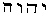

##### *The Secret Doctrine* by H. P. Blavatsky -- Vol. 2

------------------------------------------------------------------------

###### \[\[Vol. 2, Page\]\] 459 THE "GOD" SUB ROSA.

### § VII.

#### THE "HOLY OF HOLIES." ITS DEGRADATION.

**T**HE *Sanctum Sanctorum* of the Ancients, *i.e*., that recess on the
Western side of the Temple which was enclosed on three sides by blank
walls and had its only aperture or door hung over with a curtain -- also
called the *Adytum* -- was common to all ancient nations.

Nevertheless, a great difference is found between the secret meanings of
this symbolical place, in the esotericism of the Pagans and that of
later Jews; though the symbology of it was originally identical
throughout the ancient Races and Nations. The *Gentiles,* by placing in
the Adytum a *sarcophagus,* or a tomb (*taphos*)*,* and the solar-god to
whom the temple was consecrated, held it, as Pantheists, in the greatest
veneration. They regarded it -- in its esoteric meaning -- as the symbol
*of resurrection,* cosmic, solar (or diurnal), and human. It embraced
the wide range of periodical and (in time) punctual, Manvantaras, or the
re-awakenings of Kosmos, Earth, and Man to new existences; the sun being
the most poetical and also the most grandiose symbol of the same in
heaven, and man -- in his re-incarnations -- on Earth. The Jews -- whose
realism, if judged by the dead letter, was as practical and gross in the
days of Moses as it is now\* -- in the course of their estrangement from
the gods of their pagan neighbours, consummated a national and levitical
polity, by the device of setting forth their Holy of Holies as the most
solemn sign of their Monotheism -- exoterically; while seeing in it but
a universal phallic symbol -- esoterically. While the Kabalists knew but
Ain-Soph and the "gods" of the Mysteries, the Levites had no tomb, no
god in their adytum but the "Sacred" Ark of the Covenant -- their "Holy
of Holies."

When the esoteric meaning of this recess is made clear, however, the
profane will be better able to understand why David danced "uncovered"
before the *ark* of the Covenant, and was so anxious to appear *vile*
for the sake of his "Lord," and *base* in his own sight. (*See* 2
*Samuel vi.* 16-22.)

The ark is the navi-form *Argha* of the Mysteries. Parkhurst, who has

###### \[\[Footnote(s)\]\] -------------------------------------------------

\* But it was not so, in reality, witness their prophets. It is the
later Rabbis and the Talmudic scheme that killed out all spirituality
from the body of their symbols; leaving only their Scriptures -- a dead
shell, from which the Soul has departed.

------------------------------------------------------------------------

###### \[\[Vol. 2, Page\]\] 460 THE SECRET DOCTRINE.

a long dissertation upon it in his Greek dictionary, and who never
breathes a word about it in the Hebrew lexicon, explains it thus: --
"\[\[*Arche*\]\] in this application answers to the Hebrew *rasit* or
wisdom . . . . a word which had the meaning of the emblem of the female
generative power, the Arg or *Arca,* in which the germ of all nature was
supposed to float or brood on the great abyss during the interval which
took place after every mundane cycle." Quite so; and the Jewish *ark of
the* *Covenant had precisely the same significance;* with the
supplementary addition that, instead of a beautiful and chaste
*sarcophagus* (the symbol of the matrix of Nature and resurrection) as
in the *Sanctum sanctorum of* the pagans, they had the ark made still
more *realistic* in its construction by the two cherubs set up on the
coffer or ark of the covenant, facing each other, with their wings
spread in such a manner as to form a perfect *yoni* (as now seen in
India). Besides which, this generative symbol had its significance
enforced by the four mystic letters of Jehovah's name, namely,
; or  meaning *Jod* (*membrum Virile,*
see Kabala);  (the *womb*);  (Vau, a
crook or a hook, a nail), and  again, meaning also "an
opening"; the whole forming the perfect *bisexual* emblem or symbol or Y
(e) H (o) V (a) H, the male and female symbol.

Perhaps also, when people realise the true meaning of the office and
title of the *Kadesh Kadeshim,* "the holy ones," or "the consecrated to
*the temple of the Lord,*" -- the "Holy of Holies" of the latter may
assume an aspect far from edifying.

Iacchus again is Iao or Jehovah; and Baal or Adon, like Bacchus, was a
phallic god. "Who shall ascend into the hill (the high place) of the
Lord?" asks the holy king David, "who shall stand in the place of his
*Kadushu ?" (Psalms xxiv. 3). Kadesh may mean in one
sense to devote, hallow, sanctify,* and even to initiate or to set
apart; but it also means the ministry of lascivious rites (the
Venus-worship) and the true interpretation of the word Kadesh is bluntly
rendered *in Deuteronomy* xxiii. 17; *Hosea* iv. 14; and *Genesis*
xxxvii. from verses 15 to 22. The "holy" Kadeshuth of the *Bible* were
identical, as to the duties of their office, with the Nautch-girls of
the later Hindu pagodas. The Hebrew *Kadeshim*, or galli, lived "by the
house of the Lord, where the women wove hangings for the grove," or the
bust of Venus-Astarte, says verse the seventh in the twenty-third
chapter of 2 Kings.

The dance performed by David round the ark was the "circle-dance." said
to have been prescribed by the Amazons for the Mysteries. Such was the
dance of the daughters of Shiloh (*Judges* xxi*.* 21, 23 *et passim*)*,*
and the leaping of the prophets of Baal (I *Kings* xviii. 26). It was
simply a characteristic of the Sabean worship, for it denoted the motion
of the planets round the sun. That the dance was a Bacchic frenzy is

------------------------------------------------------------------------

###### \[\[Vol. 2, Page\]\] 461 WHAT WAS THE CIRCLE-DANCE.

apparent. Sistra were used on the occasion, and the taunt of Michal and
the King's reply are very expressive. *Isis Unveiled, Vol. II., p.* 49.

"The Ark, in which are preserved the germs of all living things
necessary to repeople the earth, represents the survival of life, and
the supremacy of spirit over matter, through the conflict of the
opposing powers of nature. In the Astro-Theosophic chart of the Western
Rite, the Ark corresponds with the navel, and is placed at the sinister
side, the side of the woman (the moon), one of whose symbols is the left
pillar of Solomon's temple -- **B**OAZ. The umbilicus is connected
through the placenta with the receptacle in which are fructified the
embryos of the race. . . The Ark is the sacred *Argha* of the Hindus,
and thus the relation in which it stands to Noah's ark may be easily
inferred when we learn that the Argha was an oblong vessel, used by the
high priests as a sacrificial chalice in the worship of Isis, Astarte,
and Venus-Aphrodite, all of whom were goddesses of the generative powers
of nature, or of matter -- hence representing symbolically the Ark
containing the germs of all living things." ("*Isis Unveiled,*" Vol.
**II**., p. 444.) Mistaken is he who accepts the Kabalistic works of
to-day, and the interpretations of the Zohar by the Rabbis, for the
genuine Kabalistic lore of old!\* For no more to-day than in the day of
Frederick von Schelling does the Kabala accessible to Europe and
America, contain much more than "ruins and fragments, much distorted
remnants still of that *primitive system which is the key to all
religious systems*" (See Kabbala, by Prof. Franck, *Preface*)*.* The
oldest system and the

###### \[\[Footnote(s)\]\] -------------------------------------------------

\* The author of the "Qabbalah" makes several attempts to prove
conclusively the antiquity of the Zohar. Thus he shows that Moses de
Leon could not be the author or the forger of the Zoharic works in the
**XIII**th century, as he is accused of being, since Ibn Gebirol gave
out the same philosophical teaching 225 years before the day of Moses de
Leon. No true Kabalist or scholar will ever deny the fact. It is certain
that Ibn Gebirol based his doctrines upon the oldest Kabalistic sources,
namely, the "Chaldean Book of Numbers," as well as some no longer extant
Midrashim, the same, no doubt, as those used by Moses de Leon. But it is
just the difference between the two ways of treating the same esoteric
subjects, which, while proving the enormous antiquity of the esoteric
system, points to a decided ring of Talmudistic and even Christian
sectarianism in the compilation and glossaries of the Zoharic system by
Rabbi Moses. Ibn Gebirol *never* *quoted from the Scriptures* to enforce
the teachings (*vide* I. Myer's *Qabbalah,* p. 7). Moses de Leon has
made of the Zohar that which it has remained to this day, "a running
commentary on the . . . Books of the Pentateuch" (*ibid*.), with a few
later additions made by Christian hands. One follows the archaic
esoteric philosophy; the other, only that portion which was adapted to
the *lost* Books of Moses restored by Ezra. Thus, while the system, or
the trunk on which the primitive original Zohar was engrafted, is of an
immense antiquity many of the (later) Zoharic offshoots are strongly
coloured by the peculiar views held by Christian Gnostics (Syrian and
Chaldean), the friends and co-workers of Moses de Leon who, as shown by
Munk, accepted their interpretations.

------------------------------------------------------------------------

###### \[\[Vol. 2, Page\]\] 462 THE SECRET DOCTRINE.

*Chaldean* Kabala were identical. The latest renderings of the *Zohar*
are those of the Synagogue in the early centuries -- *i.e*., the
*Thorah,* dogmatic and uncompromising.

The "King's Chamber" in *Cheops*' *Pyramid* is thus an Egyptian "Holy of
Holies." On the days of the Mysteries of Initiation, the candidate,
representing the solar god, had to descend into the Sarcophagus, and
represent the energizing ray, entering into the fecund womb of Nature.
Emerging from it on the following morning, he typified the resurrection
of life after the change called Death. In the great **M**YSTERIES his
figurative death lasted two days, when with the Sun he arose on third
morning, after a last night of the most cruel trials. While the
postulant represented the Sun -- the all-vivifying Orb that "resurrects"
every morning but to impart life to all -- the Sarcophagus was symbolic
of the female principle. This, in Egypt; its form and shape changed with
every country, provided it remained a vessel, a symbolic *navis* or
boat-shaped vehicle, and a *container,* symbolically, of germs or the
germ of life. In India, it is the "golden" Cow through which the
candidate for Brahminism has to pass if he desires to be a Brahmin, and
to become **D**WIJA ("reborn a *second* time"). The crescent-form
*Argha* of the Greeks was the type of the Queen of Heaven -- Diana, or
the Moon. She was the great Mother of all Existences, as the Sun was the
Father. The Jews, previous to, as well as after their metamorphosis of
Jehovah into a *male* god, worshipped Astoreth, which made Isaiah
declare: "*Your new moons and feasts my* soul hateth," (*i*. 14); saying
which, he was evidently unjust. Astoreth and the New-moon (the crescent
*argha*) festivals, had no worse significance as a form of public
worship than had the hidden meaning of the moon in general, which was
Kabalistically connected directly with, and sacred to, Jehovah, as is
well known; with the sole difference that one was the female and the
other the male aspect of the moon, and of the star Venus.

The Sun (the Father), the Moon (the Mother), and Mercury-Thoth (the
Son), were the earliest Trinity of the Egyptians, who personified them
in Osiris, Isis, and Thoth (Hermes). In \[\[*PISTIS SOPHIA*\]\], the
seven great gods, divided into two triads and the highest God (the Sun)
are: the lower \[\[*Tridunameis*\]\], whose powers reside respectively
in Mars, Mercury and Venus; and the higher Triad ("the three unseen
gods") who dwell in the Moon, Jupiter and Saturn; (*vide* §§ 359 and 361
*et seq*)*.*

This requires no proof. Astoreth was in one sense an impersonal symbol
of nature, the ship of Life carrying throughout the boundless Sidereal
Ocean the germs of all being. And when she was not identified with
Venus, like every other "Queen of Heaven" to whom cakes and buns were
offered in sacrifice, Astoreth became the reflection of the

------------------------------------------------------------------------

###### \[\[Vol. 2, Page\]\] 463 CHRISTIAN SYMBOLISM

Chaldean "Nuah, the Universal Mother" (female Noah, considered as one
with the ark), and of the female triad, Ana, Belita and Davikina;
called, when blended into one, "Sovereign goddess, lady of the Nether
Abyss, Mother of gods, Queen of the Earth, and Queen of fecundity."
Later, Belita or *Damti* (the sea), the Mother of *the City* *of Erech*
(the great Chaldean Necropolis) became Eve; and now she is Mary the
Virgin, in the Latin Church, represented as standing on the
crescent-moon, and, at times on the Globe, to vary the programme. The
*navi*, or ship-like form of the crescent, which blends in itself all
those common symbols of the ship of life, such as Noah's ark, the Yoni
of the Hindus, and the ark of the Covenant, is the female symbol of the
Universal "Mothers of the gods," and is now found under its Christian
*symbol* in every Church, as the nave (from *navis,* the ship).\* The
*navis* -- the Sidereal vessel -- is fructified by the Spirit of Life --
the male God; or, as the learned Kenealy (in his *Apocalypsis*) calls it
very appropriately -- the Holy Spirit. In Western religious symbology
the Crescent was the male, the full moon, the female aspect of that
universal Spirit. "The mystic word *Alm*, which the prophet Mahomet
prefixed to many chapters of the Koran, alludes to *her* as the *Alm,*
the immaculate Virgin of the heavens. And -- the sublime ever falling
into the ridiculous -- it is from this root *Alm* that we have to derive
the word *Almeh* -- the Egyptian dancing-girls. The latter are "Virgins"
of the same type as the *Nautchnis* in India, and the (female)
*Kadeshim,* the Holy Ones of the Jewish temples (those consecrated to
Jehovah, who represented both sexes), whose holy functions in the
Israelite fanes were *identical* with those of the Nautchnis.

Now Eustathius declares that (\[*IO*\]) **IO** means the *moon,* in the
dialect of the *Argians;* and it was one of the names of the same in
Egypt. Says Jablonski, "\[\[*IO*\]\], Ioh*, AEgyptiis* **L**UNAM
*significat neque* *habent illi in communi sermonis usu, aliud nomen quo
Lunam, designent* *praeter IO.*" The pillar and Circle (**IO**), now
constituting the first decimal number, and which with Pythagoras was the
perfect number contained in the *Tetractis,\*\** became later a
*pre*-*eminently phallic Number* -- amongst the Jews, foremost of all,
with whom it is the male and female Jehovah.

This is how a scholar explains it: --

###### \[\[Footnote(s)\]\] -------------------------------------------------

\* Timaeus, the Locrian, speaking of *Arka,* calls her "the Principle of
best things." The word *arcane*, "hidden," or secret, is derived from
*Arka*. "To no one is the *Arcane* shown except to the most High"
(*Codex Nazareus*)*,* alluding to nature the female, and Spirit, the
male Power. All the Sun-Gods were called *Archagetos* "born from the
*Arka,*" the divine Virgin-Mother of the Heavens.

\*\* Because composed of ten dots arranged triangularly in four rows. It
is the *Tetragrammaton* of the Western Kabalists.

------------------------------------------------------------------------

###### \[\[Vol. 2, Page\]\] 464 THE SECRET DOCTRINE.

"I find, on the Rosetta stone of Uhlemann, the word *mouth,* also in
Seiffarth, viz., the name of *the Moon* used as a cycle of Time, hence
the *lunar month* from the hieroglyph  with
 and  as determinatives given, as the
Coptic **I O H**, or **I O H**. The Hebrew  may also be
used as **I O H**, for the letter *yau,* or , was used
for *o* and for *u*, and for *v* or *w*. This, before the *Massora,* of
which the **.** was used as  = o,  =
u, and  = v or w. Now I had worked it out by original
search that the great distinctive function of the god-name Jehovah was
designative of the influence of the moon as the *causative* of
*generation,* and as of its exact value as a lunar year in the natural
*measure of days,* as you will fully see, . . . . And here comes this
linguistic same word from a source far more ancient; viz., the Coptic,
or rather from the old Egyptian in time of the Coptic.". . . . (From a
**MS**.)

This is the more remarkable when Egyptology compares this with the
little which it knows about the Theban triad -- composed of *Ammon,
Mouth,* (or *Mout*) and their son *Khonsoo.* This triad was, when
united, contained in the moon as their common symbol; and when
separated, it was *Khonsoo* who was the god, **L**UNUS, being thus
confounded with Thot and Phtah. His mother Mout(*h*) -- the name
signifying *Mother,* by the bye, not the *moon,* which was only her
Symbol -- is called the "Queen of Heaven"; the "Virgin," etc., etc., as
she is an aspect of Isis, Hathor, and other mother goddesses. She was
less the wife than the mother of Ammon, whose distinct title is "the
husband of his Mother." In a *statuette* at Boulaq, Cairo, this triad is
represented (*Number* 1981 *Serapeum, Greek Period*) as a mummy-god
holding in his hand three different sceptres, and bearing the lunar disc
on his head, the characteristic tress of hair showing the design of
representing it as that of *an infant* god, or "the Sun," in the triad.
He was the god of Destinies in Thebes, and appears under two aspects (1)
as "Khonsoo, the Lunar god, and Lord of Thebes, *Nofir*-*hotpoo* --
*'he* who is in absolute repose'; and (2) as Khonsoo *Iri*-*sokhroo,* or
'Khonsoo, who executes Destiny': the former preparing the events and
conceiving them for those born under his generative influence; the
latter putting them into action." (*See Maspero*'*s Definitions*)*.*
Under theogonic permutations Ammon becomes Horus, **HOR-AMMON**, and
Mout(h)-Isis is seen suckling him in a statuette of the Saitic period.
(*Abydos.*) In his turn, in this transformed triad, Khonsoo becomes
*Thot*-*Lunus,* "he who operates salvation." His brow is crowned with
the head of an *ibis* decorated with the *lunar* disc and the diadem
called IO-*tef*.

Now all these symbols are certainly found reflected in (some believe
them identical with) the *Yave,* or Jehovah of the Bible. This will be

------------------------------------------------------------------------

###### \[\[Vol. 2, Page\]\] 465 THE "FOUR-FACED" BRAHMA.

made plain to any one who reads "*The Source of Measures,*" *or*
"*Hebrew* *Egyptian Mystery,*" and understands the undeniable, clear,
and mathematical proofs that the *esoteric foundations,* or the system
used in the building of the Great Pyramid, and the architectural
measurements in the Temple of Solomon (whether the latter be mythical or
real), Noah's ark, and the ark of the Covenant, are the same. If
anything in the world can settle the dispute that the old, as much as
the later, Jews (post-Babylonian), and especially the former, built
their theogony and religion on the very same foundation as all Pagans
did, it is the work in question.

And now it may be as well to remind the reader of that which was said of
**I A O**, in our work, "*Isis Unveiled.*"

> "No other deity affords such a variety of etymologies as Jaho, nor is
> there any name which can be so variously pronounced. It is only by
> associating it with the Masoretic points that the later Rabbins
> succeeded in making Jehovah read 'Adonai' -- or Lord, as Philo Byblus
> spells it in Greek letters \[\[IEUO\]\] -- **IEVO**. Theodoret says
> that the Samaritans pronounced it Jahe (yahra), and the Jews Yaho;
> which would make it as we have shown, I -- Ah -- O. Diodorus states
> that 'among the Jews they relate that Moses called the god Iao.' It is
> on the authority of the *Bible* itself, therefore, that we maintain
> that before his initiation by Jethro, his father-in-law, Moses had
> never known the word Jaho."\*

The above receives corroboration in a private letter from a very learned
Kabalist. In **S**TANZA **IV**. and elsewhere it is stated that
exoterically Brahma (neuter), so flippantly and so often confused by the
Orientalists with Brahma -- the male, is sometimes called *Kala*-*hansa*
(Swan in the eternity), and the esoteric meaning of *A*-*ham*-*sa,* is
given. (I -- *am* -- he, *so ham* being equal to *sah* "he," and *aham*
"I" -- a mystic anagram and permutation). It is also the "four-faced"
Brahma, the *Chatur mukha* (the perfect cube) forming itself *within,*
and *from* the infinite circle; and again the use of the 1, 3, 5, and
 = 14, as the esoteric hierarchy of the Dhyan Chohans is
explained. On this, the said correspondent comments in this way: --

> "Of the 1, 3, 5, and twice 7, intending and very especially 13,514,
> which on a circle may be read as 31415 (or \[\[*pi*\]\] value), I
> think there cannot be a possibility of doubting; and especially when
> considered with symbol marks on *sacr*,\*\* 'Chakra,' or Circle of
> Vishnu.

> "But let me carry your description a step further: -- You say 'The One
> from

###### \[\[Footnote(s)\]\] -------------------------------------------------

\* The student must be aware that Jethro is called the "father-in-law"
of Moses; not because Moses was really married to one of his seven
daughters. Moses was an Initiate, if he ever existed, and as such an
ascetic, a nazar, and could never be married. It is an allegory like
everything else. Zipporah (the shining) is one of the personified Occult
Sciences given by Revel-Jethro, the Midian priest Initiator, to Moses,
his Egyptian pupil. The "well" by which Moses sat down in his flight
from the Pharaoh symbolizes the "well of Knowledge."

\*\* In Hebrew the phallic symbol *lingham* and *Yoni.*

------------------------------------------------------------------------

###### \[\[Vol. 2, Page\]\] 466 THE SECRET DOCTRINE.

> the Egg, the *six,* and the *five* (*See Stanza IV., Book I.*) give
> the numbers 1065, the value of the first born'. . . . . . If it be so,
> then in 1065 we have the famous Jehovah's name, the *Jve* or *Jave*,
> or Jupiter, and by change of  to  or
> *h* to *n*, then  or the Latin *Jun* or Juno, the
> base of the Chinese riddle, the key measuring numbers of Sni (Sinai)
> and Jehovah coming down on that mount, which numbers (1,065) are but
> the use of our ratio of 113 to 355 because 1,065 *=* 355 x 3 which is
> circumference to a diameter of 113 x 3 = 339. Thus the first born of
> Brahma Prajapati (or any Demiurgos) indicates a measuring use of a
> circular relation taken from the *Chakra* (or Vishnu) and, as stated
> above, the Divine manifestation takes the form of life and the first
> born."

> "It is a most singular thing: At the entrance passage to the King's
> chamber the measurement *from the surface of the Great Step\** and the
> Grand Gallery to the top of the said gallery, is by the very careful
> measures of Piazzi Smyth 339 inches.

> 

> Take A as a centre and with this radius describe a circle; the
> diameter of that circle will be 339 x 2 = 678, and these numbers are
> those of the expression *and the raven,* in the 'Dove and raven'
> scenes or pictures of the Flood of Noah; (the radius is taken to show
> division into two parts, which are 1,065 each) for 113 (*man*) x 6 =
> 678; and the diameter to a circumference of 1,065 x 2 -- so we have
> here an indication of cosmic *man* on this high grade or step, at *the
> entrance* of the King's Chamber (the Holy of Holies) -- *which is the
> womb.* Now this passage is of such a height that a man to enter it
> *must stoop.* But a man *upright* is 113, and broken, or stooping, he
> becomes 133 / 2 = 5**.** 65  or Jehovah. That is, he
> personifies\*\* him as entering the Holy of Holies. But by Hebrew
> Esotericism the *chief function* of Jehovah was *child giving,* etc.,
> and that because, by the numbers of his name, he was the *measure of
> the lunar year,* which cycle of time, because by its factor of 7
> (seven) it ran so co-ordinately with the periods of the quickening,
> viability, and gestation, was taken as the *causative of the
> generative* *action* and therefore was worshipped and besought."

This discovery connects Jehovah still more with all the other creative
and generative gods, solar and lunar, and especially with "King" *Soma,*
the Hindu *Deus Lunus,* the moon, because of the esoteric influence
attributed to this planet in Occultism. There are other corroborations
of it, however, in Hebrew tradition itself. Adam is spoken of in

###### \[\[Footnote(s)\]\] -------------------------------------------------

\* It is on that step that one arrives on the plane of the level or
floor and open entrance to the King's chamber, the Egyptian "Holy of
Holies."

\*\* The candidate for initiation always personified the god of the
temple he belonged to, as the High Priest personified the god at all
times; just as the Pope now personates Peter and even Jesus Christ upon
entering the inner altar -- the Christian "Holy of Holies."

------------------------------------------------------------------------

###### \[\[Vol. 2, Page\]\] 467 THE ETYMOLOGY OF "SACRAMENT."

*Maimonides* (*More Nevochim,* "The Guide of the Perplexed" -- truly!)
in two aspects; as a man, like all others born of a man and a woman, and
-- as the *prophet of the Moon;* the reason of which is now made
apparent, and has to be explained.

Adam, as the supposed great "Progenitor of the human race," is, as Adam
Kadmon, made in the *image* of God -- a priapic image, therefore. The
Hebrew words *sacr* and *n*'*cabvah* are, literally translated,
*lingham* (phallus) and *yoni*, notwithstanding their translation in
th*e* Bible (*Genesis i. v*. 27.) "male and female." As said there "God
creates '*Man in his own image'*. . . . . in the image of God created he
him, *male and female* created he them," the androgyne Adam-Kadmon. Now
this Kabalistic name is not that of a living man, nor even of a human or
divine Being, but of the two sexes or organs of procreation, called in
Hebrew with that usual sincerity of language pre-eminently Biblical,
*sacr* and *n*'*cabvah*\*; these two being, therefore*,* the *image*
under which the "Lord God" appeared usually to his chosen people. That
this is so, is now undeniably proven by almost all the symbologists and
Hebrew scholars as well as by the Kabala. Therefore Adam is in one sense
Jehovah. This makes plain another general tradition in the East
mentioned in *Gregorie*'*s* "*Notes and Observations upon several*
*passages in Scripture*" (1684. *Vol.* 1 *pp.* 120-21) and quoted b*y*
Hargrave Jennings in his *Phallicism:* "That Adam was commanded by God
that his dead body should be kept above ground till committed t*o* the
*middle of the earth* by a priest of the most High God." Therefor*e,*
"Noah daily prayed in the ark before the BODY OF **A**DAM," or before
the Phallus in the *ark,* or Holy of Holies, again. He who is a Kabalist
and accustomed to the incessant permutation of Biblical names, once they
are interpreted numerically and symbolically, will understand what is
meant. Jehovah, from the two words of which his name is composed, "makes
up the original idea of male-female as birth-originator, for the
 was the *membrum virile* and *Houak* was *Eve*." So . .
. "the *perfect one,* as originator of measures, takes also the form of
*birth* origin, as *hermaphrodite one;* hence the phallic use of form."
("*Source of Measures,*" 159). Besides the same author shows and
demonstrates numerically and geometrically that (*a*) *Arets,* earth,
*Adam, man,* and *H*'*Adam* are cognate with each other, and are
*personified* in the Bible under one form, as the Egyptian and Hebrew
Mars, *god of the generation;* and (*b*) that Jehovah, or *Jah,* is

###### \[\[Footnote(s)\]\] -------------------------------------------------

\*Jehovah says to Moses "the Summation of my name is *Sacr,* the carrier
of the germ" -- phallus. "It is the vehicle of the annunciation, and the
*sacr* has passed down through ages to the *sacr*-*factum* of the Roman
priest, and the *sacr*-*fice,* and *sacra*ment of the English speaking
race." (*Source of Measures, p*. 236) Thence marriage is a *sacrament*
in the Greek and Roman Churches.

------------------------------------------------------------------------

###### \[\[Vol. 2, Page\]\] 468 THE SECRET DOCTRINE.

Noah, or *Jehovah is Noah* in Hebrew would be , or
literally in English, *Inch.*"

The above affords, then, a key to the said traditions. Noah, a divine
permutation, the supposed saviour of Humanity, who carries in his ark or
*argha* (the moon), the germs of all living things, worships before the
"body of Adam," which body is the image of, and a *Creator* itself.
Hence Adam is called the "Prophet of the Moon," the *Argha* or "Holy of
Holies" of the  (Yodh). This also shows the origin of
the Jewish popular belief that the face of Moses *is in the moon* --
*i.e.,* the spots in the Moon. For Moses and Jehovah are once more
permutations, as has been shown Kabalistically. Says the author of the
"Source of Measures" (*p*. 271): "There is one fact in regard to Moses
and his works too important to be omitted. When he is instructed by the
Lord as to his mission, the *power* name assumed by the Deity is, *I am
that I am,* the Hebrew words being: --

a variety reading of . Now, Moses is ,
and equals 345. Add the values of the *new form* of the name Jehovah, 21
+ 501 + 21 = 543, or, by a reverse reading, 345; thus showing Moses to
be a form of Jehovah in this combination. 21 ÷ 2 *=* 10.5, or, reversed,
501, so that the *asher* or the *that* in *I am that I am* is simply a
guide to a use of 21 or 7 x 3; 501 \[\[squared\]\] = 251 +, a very
valuable pyramid number, etc., etc.

For a clearer explanation for the benefit of non-Kabalists we put it
thus: "I am that I am" is in Hebrew: --

Add the numbers of these separate words and you have: --

(which relates to the process of descending in fire on the mount to make
man, etc., etc.), and which is explained to be but a *check* and use of
the numbers of the mountains; for: -- on one side we have 10 + 5 + 6 =
21, down the middle 501, and on the other side 6 + 5 + 10 *=* 21." (From
the same author.) (*Vide* § **XXII***.,* "*The Symbolism of the Mystery
Name* **IAO***.*")

The "Holy of Holies," both Kabalistic and Rabbinical, are thus shown as
an international symbol, and common property. Neither has originated
with the Hebrews; but owing to the too realistic handling of the
half-initiated Levites, the symbol has with them acquired a significance
which it hardly has with any other people to this day,

------------------------------------------------------------------------

###### \[\[Vol. 2, Page\]\] 469 THE OLD AND THE NEW JEHOVAH.

and which it was originally never meant to have by the true Kabalist.
The *Lingham* and *Yoni* of the modern average Hindu is, on the face of
it, of course, no better than the Rabbinical "Holy of Holies," -- but
*it is* *no worse;* and this is a point gained on the Christian
traducers of the Asiatic religious philosophies. For, in such religious
myths, in the hidden symbolism of a creed and philosophy, the *spirit*
of the tenets propounded ought to decide their relative value. And who
will say, that, examined either way, this so-called "Wisdom," applied
solely to the uses and benefit of one little nation, has ever developed
in it anything like national ethics. The Prophets are there, to show the
walk in life, before, during, and after the days of Moses, of the chosen
but "stiff-necked" people. That they have had at one time the
Wisdom-Religion and use of the universal language and its symbols at
their disposal and in their possession, is proved by the same
esotericism existing to this day in India with regard to the "Holy of
Holies." This, as said, was and still is the passage through the
"golden" cow *in the* *same stooping position* as the one shown in the
gallery of the pyramid, which identified man with Jehovah in Hebrew
esotericism. The whole difference lies in the Spirit of Interpretation.
With the Hindus as with the ancient Egyptians that spirit was and is
entirely metaphysical and psychological; with the Hebrews it was
*realistic* and *physiological.* It pointed to the first sexual
separation of the human race (Eve giving birth to Cain-Jehovah, as shown
in the "Source of Measures"); to the consummation of terrestrial
physiological union and conception (as in the allegory of Cain shedding
Abel's blood -- *Habel,* the feminine principle) and -- child-bearing; a
process shown to have begun in the Third Race, or with Adam's THIRD
*son,* Seth, with whose son Henoch, men began to call themselves
*Jehovah* or *Jah*-*hovah,* the male Jod and Havah or Eve -- to wit,
*male and female beings*.\* Thus the difference lies in the religious
and ethical feeling, but the two symbols are identical. There is no
doubt that, with the fully initiated Judaean Tanaim, the inner sense of
the symbolism was as holy in its abstraction as with the ancient Aryan
Dwijas. The worship of the "god in the ark" dates only from David; and
for a thousand years Israel knew of no phallic Jehovah. And now the old
Kabala, edited and re-edited, has become tainted with it.

With the ancient Aryans the hidden meaning was grandiose, sublime, and
poetical, however much the external appearance of their symbol may *now*
militate against the claim. The ceremony of passing through

###### \[\[Footnote(s)\]\] -------------------------------------------------

\* In the fourth chapter of Genesis, v. 26, it is mis-translated, " . .
. And he called his name *Enos* (man); then began men to call upon the
name of the Lord." -- which has no sense in it, since Adam and the
others must have done the same.

------------------------------------------------------------------------

###### \[\[Vol. 2, Page\]\] 470 THE SECRET DOCTRINE.

the Holy of Holies (now symbolized by the cow), in the beginning through
the temple *Hiranya gharba* (the radiant Egg) -- in itself a symbol of
Universal, abstract nature -- meant spiritual conception and birth, or
rather the *re*-*birth* of the individual and his regeneration: the
*stooping* man at the entrance of the *Sanctum Sanctorum,* ready to pass
through the matrix of mother nature, or the physical creature ready to
re-become the original spiritual Being, pre-natal **M**AN. With the
Semite, that *stooping* man meant the *fall* of Spirit into matter, and
that *fall* and *degradation* were apotheosized by him with the result
of dragging Deity down to the level of man. For the Aryan, the symbol
represented the divorce of Spirit from matter, its merging into and
return to its primal Source; for the Semite, the wedlock of spiritual
man with material female nature, the physiological being taking
pre-eminence over the psychological and the purely immaterial. The Aryan
views of the symbolism were those of the whole Pagan world; the Semite
interpretations emanated from, and were pre-eminently those of a small
tribe, thus marking its national features and the idiosyncratic defects
that characterize many of the Jews to this day -- gross realism,
selfishness, and sensuality. They had made a bargain, through their
father Jacob, with their tribal deity, self-exalted above all others,
and a *covenant* that his "seed shall be as the dust of the earth"; and
that deity could have no better image henceforth than that of the symbol
of generation, and, as representation, a *number* and numbers.

Carlyle has wise words for both these nations. With the Hindu Aryan --
the most metaphysical and spiritual people on earth -- religion has ever
been, in his words, "an everlasting lode-star, that beams the brighter
in the heavens the darker here on earth grows the night around him." The
religion of the Hindu detaches him from this earth; therefore, even now,
the cow-symbol is one of the grandest and most philosophical among all
others in its inner meaning. To the "**M**ASTERS" and "Lords" of
European potencies -- the Israelites -- certain words of Carlyle apply
still more admirably; for them "religion is a wise prudential feeling
grounded on *mere calculation*" -- and it was so from its beginnings.
Having burdened themselves with it, Christian nations feel bound to
defend and *poetise* it, at the expense of all other religions.

But it was not so with the ancient nations. For them the passage
entrance and the sarcophagus in the King's chamber meant regeneration --
not generation. It was the most solemn symbol, a *Holy of Holies,*
indeed, wherein were created immortal Hierophants and "Sons of God" --
never mortal men and Sons of lust and flesh -- as now in the hidden
sense of the Semite Kabalist. The reason for the difference in the views
of the two races is easy to account for. The Aryan Hindu belongs to the
oldest races now on earth; the Semite Hebrew to the latest. One is
nearly one

------------------------------------------------------------------------

###### \[\[Vol. 2, Page 471\]\] THE CRAFT OF THE RABBINS.

million years old; the other is a small sub-race some 8,000 years old
and no more.\*

But Phallic worship has developed only with the gradual loss of the keys
to the inner meaning of religious symbols; and there was a day when the
Israelites had beliefs as pure as the Aryans have. But now Judaism,
built *solely* on Phallic worship, has become one of the latest creeds
in Asia, and theologically a religion of hate and malice toward everyone
and everything outside themselves. Philo Judaeus shows what was the
genuine Hebrew faith. The sacred Writings, he says, prescribe what we
ought to do . . . *commanding us to hate the heathen and their* *laws
and institutions.* They did hate Baal or Bacchus worship publicly, but
left its worst features to be followed secretly; and it is with the
Talmudic Jews that the grand symbols of nature were the most profaned.
With them, as now shown by the discovery of the key to the correct Bible
reading -- Geometry, the *fifth* divine Science ("fifth" -- because it
is the *fifth key* in the series of the Seven Keys to the Universal
esoteric language and symbology) was desecrated, and by them applied to
conceal the most terrestrial and grossly sexual mysteries, wherein both
Deity and religion were degraded.

We are told that it is just the same with our Brahma-prajapati, with
Osiris and all other *creative* gods. Quite so, when their rites are
judged exoterically and externally; the reverse when their *inner*
meaning is unveiled, as we see. The Hindu Lingham is identical with
"Jacob's *Pillar*" -- most undeniably. But the difference, as said,
seems to consist in that the esoteric significance of the *Lingham* was
too truly sacred and metaphysical to be revealed to the profane and the
vulgar; hence its superficial appearance was left to the speculations of
the mob. Nor would the Aryan Hierophant and Brahmin, in their proud
exclusiveness and the satisfaction of their knowledge, go to the trouble
of concealing its primeval *nakedness* under cunningly devised fables;
whereas the Rabbi, having interpreted the symbol to suit his own
tendencies, had to veil the crude significance; and this served a double
purpose -- that of keeping his secret to himself and of exalting himself

###### \[\[Footnote(s)\]\] -------------------------------------------------

\* Strictly speaking, the Jews are an artificial Aryan race, born in
India, and belonging to the Caucasian division. No one who is familiar
with the Armenians and the Parsis can fail to recognize in the three the
same Aryan, Caucasian type. From the seven primitive types of the Fifth
Race there now remain on Earth but three. As Prof. W. H. Flower aptly
said in 1885, "I cannot resist the conclusion so often arrived at by
various anthropologists -- that the primitive man, whatever he may have
been, has in the course of ages diverged into three extreme types,
represented by the Caucasian of Europe, the Mongolian of Asia, and the
Ethiopian of Africa, and that all existing individuals of the species
can be ranged around these types. . . . " (The President's address at
the *Anthrop. Inst.* *of* *Great Britain,* etc.) Considering that our
Race has reached its Fifth Sub-race, how can it be otherwise?

------------------------------------------------------------------------

###### \[\[Vol. 2, Page\]\] 472 THE SECRET DOCTRINE.

in his supposed monotheism over the *heathen,* whom his *Law* commanded
him to hate.\* A commandment now gladly accepted by the Christian too,
in spite of another and later commandment -- "love each other." Both
India and Egypt had and have their sacred lotuses, symbolic of the same
"Holy of Holies" -- the Lotus growing in the water, a double feminine
symbol -- the *bearer* of its own seed and root of all. Viraj and Horus
are both male symbols, emanating from *androgyne Nature,* one from
Brahma and his female counterpart Vach, the other, from Osiris and Isis
-- never from the One infinite God. In the Judaeo-Christian systems it
is different. Whereas the lotus, containing Brahma, the Universe, is
shown growing out of Vishnu's *navel*, the *Central point* in the Waters
of Infinite Space, and whereas Horus springs from the lotus of the
*Celestial* Nile -- all these abstract pantheistic ideas are dwarfed and
made terrestrially concrete in the Bible: one is almost inclined to say
that in the *esoteric* they are *grosser and still more*
*anthropomorphic,* than in their *exoteric* rendering. Take as an
example the same symbol, even in its Christian application; the *lilies*
in the hand of the Archangel Gabriel (*Luke i.* 28). In Hinduism -- the
"Holy of Holies" is a universal abstraction, whose *dramatis personae*
are Infinite Spirit and Nature; in Christian Judaism, it is a *personal*
God*, outside* of that Nature, and the human Womb -- Eve, Sarah, etc.,
etc.; hence, an anthropomorphic phallic god, and his image -- man.

Thus it is maintained, that with regard to the contents of the Bible,
one of two hypotheses has to be admitted. Either behind the symbolic
substitute -- Jehovah -- there was the unknown, incognizable Diety, the
Kabalistic Ain-Soph; or, the Jews have been from the beginning, no
better than the dead-letter *Lingham*-\*\* worshippers of the India of
to-day. We say it was the former; and that, therefore, the secret or
esoteric worship of the Jews was the same Pantheism that the Vedantin
philosophers are reproached with to-day; Jehovah was a *substitute* for
purposes of an exoteric national faith, and had no importance or reality
in the eyes of the erudite priests and philosophers -- the Sadducees,
the

###### \[\[Footnote(s)\]\] -------------------------------------------------

\* Whenever such analogies between the Gentiles and the Jews, and later
the Christians, were pointed out, it was the invariable custom of the
latter to say that it was the work of the *Devil* who forced the Pagans
to imitate the Jews for the purpose of throwing a slur on the religion
of *the one, true living God.* To this Faber says very justly "Some have
imagined that the Gentiles were servile copyists of the Israelites, and
that each point of similitude was borrowed from the Mosaical Institutes.
But this theory will by no means solve the problem: both because we find
the very same resemblance in the ceremonies of nations far different
from Palestine, as we do in the rites of those who are in its immediate
vicinity, and because it seems incredible that all should have borrowed
from one which was universally disliked and despised." (*Pagan Idol.
I.,* 104.)

\*\* Their consecrated *pillars* (unhewn stones) erected by Abraham and
Jacob *were* LINGHI.

------------------------------------------------------------------------

###### \[\[Vol. 2, Page\]\] 473 THE ELOHISTIC AND JEHOVISTIC TEXTS.

most refined as the most learned of all the Israelite sects, who stand
as a living proof with their contemptuous rejection of every belief,
save the **L**AW. For how could those who invented the stupendous scheme
now known as the Bible, or their successors who knew, as all Kabalists
do, that it was so invented for a popular *blind* -- how could they, we
ask, feel reverence for such a phallic symbol and a NUMBER, as Jehovah
is shown most undeniably to be in the Kabalistic works? How could anyone
worthy of the name of a philosopher, and knowing the real *secret*
meaning of their "pillar of Jacob," their *Bethel,* oil-anointed
*phalli,* and their "Brazen *Serpent,*" worship such a gross symbol, and
minister unto it, seeing in it their "Covenant" -- the Lord Himself! Let
the reader turn to *Gemara Sanhedrin* and judge. As various writers have
shown, and as brutally stated in Hargrave Jennings' *Phallicism* (p. 67)
"*We know from the Jewish records* that the Ark contained a *table of
stone*. . . . that stone was phallic, and yet identical with the sacred
name *Jehovah* . . . which written in unpointed Hebrew with four
letters, is **J-E-V-E** or **JHVH** (the H being merely an aspirate and
the same as E). This process leaves us the two letters I and V (in
another form U); then if we place the I *in* the U we have the 'Holy of
Holies'; we also have the Lingha and Yoni and Argha of the Hindus, the
Isvara and 'supreme Lord'; and here we have the whole secret of its
mystic and arc-celestial import, confirmed in itself by being identical
with the Linyoni (?) of the Ark of the Covenant."

The Biblical Jews of to-day do not date from Moses but from David --
even admitting the identity of the old genuine with the later and
remodelled Mosaic scrolls. Before that time their nationality is lost in
the mists of prehistoric darkness, the veil from which is now withdrawn
as much as we have space to do so. It is only to the days of the
Babylonian captivity that the Old Testament may be referred by the most
lenient criticism, as the approximately correct views that were current
about the days of Moses. Even such fanatical Christians and worshippers
of Jehovah as the Rev. Mr. Horne, have to admit the numerous changes and
alterations made by the later compilers of the "Book of God," since it
was *found* by Hilkiah (*See* "*Introduction to the* *Old Testament,*"
*and also Bishop Colenso*'*s* "*Elohistic and Jehovistic* *writers*")*;*
and that "*the Pentateuch arose out of the primitive or older*
*documents, by means of a SUPPLEMENTARY One.*" The Elohistic texts were
re-written 500 years after the date of Moses; the Jehovistic 800, on the
authority of the Bible chronology itself. Hence, it is maintained that
the deity, represented as the organ of generation in his pillar form,
and as a symbol of the double-sexed organ in the numeral value of the
letters of his name, or  the *Yodh* (phallus), and
 *He* (the opening, or

------------------------------------------------------------------------

###### \[\[Vol. 2, Page\]\] 474 THE SECRET DOCTRINE.

the Womb) according to Kabalistic authority -- is of a far later date
than the *Elohim* symbols and is borrowed from the Pagan *exoteric*
rites; and Jehovah is thus on a par with the *Lingham and Yoni* found on
every road-side in India.

Just as the **IAO** of the mysteries was distinct from Jehovah, so was
the later Iao and Abraxas of some Gnostic sects identical with the god
of the Hebrews, who was the same with the Egyptian Horus. This is
undeniably proven on "heathen" as on the Gnostic "Christian" gems. In
Matter's collection of such gems there is a "Horus" seated on the lotus,
inscribed \[\[*ABRASAXIAO*\]\] (Abraxas Iao) -- an address exactly
parallel to the so frequent \[\[*EIS ZETS SARAPI*\]\] (*Eis zets
sarapi*) on the contemporary Heathen gems; and therefore only to be
translated by "Abraxas is the One Jehovah" (King's *Gnostics,* p. 327).
But who was Abraxas? As the same author shows -- "the numerical or
Kabalistic value of the name Abraxas directly refer to the Persian title
of the god 'Mithra,' Ruler of the year, worshipped from the earliest
times under the appellation of Iao." Thus, the Sun, in one aspect, the
moon or the Lunar genius, in another, that generative deity whom the
Gnostics saluted as "Thou that presidest over the Mysteries of the
Father and the Son, who shinest in the night-time, holding *the second
rank,* the first Lord of Death."

It is only in his capacity of the genius of the moon, the latter being
credited in the old cosmogony with being the parent of our Earth, that
Jehovah could ever be regarded as the *creator* of our globe and *its*
Heaven, namely, the Firmament.

The knowledge of all this will be no proof, however, to the average
bigot. Missionaries will go on with the most virulent attacks on the
religions of India, and Christians read with the same benighted smile of
satisfaction as ever these preposterously unjust words of Coleridge, "It
is highly worthy of observation that the inspired writings received by
Christians *are distinguishable from all other books* PRETENDING TO
INSPIRATION, from the Scriptures of the Brahmins, and even from the
Koran, in their strong and frequent *recommendation of* TRUTH (! !). . .
."

------------------------------------------------------------------------

[Next Section](sd2-2-04.md)

[Contents](sd2-0-co.htm#contents.md)
