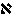
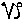

##### *The Secret Doctrine* by H. P. Blavatsky -- Vol. 2

------------------------------------------------------------------------

###### \[\[Vol. 2, Page\]\] 573 THE GNOSTICS AND PYTHAGORAS.

### § XXIV.

#### THE CROSS AND THE PYTHAGOREAN DECADE.

**T**HE early Gnostics claimed that their Science, the **G**NOSIS,
rested on a square, the angles of which represented respectively *Sige*
(Silence), *Bythos* (depth), *Nous* (Spiritual Soul or Mind), and
*Aletheia* (Truth).

It is they who were the first to introduce and reveal to the world that
which had remained concealed for ages: namely, the *Tau,* in the shape
of a Procrustean bed, and Christos as incarnating in *Chrestos,* he who
became for certain purposes a willing candidate for a series of
tortures, mental and physical.

For them the whole of the Universe, metaphysical and material, was
contained within, and could be expressed and described by the digits of
Number 10, the Pythagorean *decade*.

This Decade representing the Universe and its evolution out of Silence
and the *unknown* Depths of the Spiritual Soul, or *anima mundi,*
presented two sides or aspects to the student. It could be, and was at
first so used and applied to the Macrocosm, after which it descended to
the Microcosm, or Man. There was, then, the purely intellectual and
metaphysical, or the "*inner* Science," and the as purely materialistic
or "surface science," both of which could be expounded by and contained
in the *Decade.* It could be studied, in short, from the Universals of
Plato, and the inductive method of Aristotle. The former started from a
divine comprehension, when the plurality proceeded from unity, or the
digits of the decade appeared, but to be finally re-absorbed, lost in
the infinite Circle. The latter depended on sensuous perception alone,
when the Decade could be regarded either as the unity that multiplies,
or matter which differentiates, its study being limited to the plane
surface; to the Cross, or the *Seven* which proceeds from the ten -- or
the perfect number, on Earth as in heaven.

This dual system was brought, together with the Decade, by Pythagoras
from India. That it was that of the *Brachmans* and *Iranians*, as they
are called by the ancient Greek philosophers, is warranted to us by the
whole range of Sanskrit literature, such as the Puranas and the laws of
Manu. In these "Laws" or "Ordinances of Manu," it is said that Brahma
first creates "the *ten* lords of Being," the ten Prajapati or creative
Forces; which ten produce "*seven*" other Manus, or, rather, as some
**MSS**. have it, *Munin,* instead of Manun = "devotees," or holy
Beings, which are the Seven Angels of the Presence in the

------------------------------------------------------------------------

###### \[\[Vol. 2, Page\]\] 574 THE SECRET DOCTRINE.

Western religion. This mysterious number Seven, born from the upper
triangle , the latter itself born from the apex thereof,
or the Silent Depths of the unknown universal soul (*Sige* and
*Bythos*)*,* is the sevenfold *Saptaparna* plant, born and manifested on
the surface of the soil of mystery, from the threefold root buried deep
under that impenetrable soil. This idea is fully elaborated in Vol. I. §
"Primordial Substance and Divine Thought," which the reader has to
notice carefully, if he would grasp the metaphysical idea involved in
the above symbol. In man as in nature, it is, according to the
cis-Himalayan esoteric philosophy (which is that of the *original Manu*
Cosmogony), the septenary division that is intended by Nature herself.
The seventh principle (*purusha*) alone is the divine **S**ELF, strictly
speaking; for, as said in Manu, "He (Brahma) having pervaded the subtile
parts of those six of unmeasured brightness," created or called them
forth to "Self"-consciousness or the consciousness of that *One*
**S**ELF (V. 16, ch. i. *Manu*)*.* Of these six, five elements (or
principles, or *Tattva,* as Medhatithi, the commentator thinks) "are
called the atomic destructible elements" (v. 27); they are described in
the above-named section.

We have now to speak of the Mystery language, that of the prehistoric
races. It is not a phonetic, but a purely pictorial and symbolical
tongue. It is known at present in its fulness to the very few, having
become with the masses for more than 5,000 years an absolutely dead
language. Yet most of the learned Gnostics, Greeks and Jews, knew it,
and used it, though very differently. A few instances may be given.

On the plane above, the Number is no Number but a *nought --* a CIRCLE.
On the plane below, it becomes *one* -- which is an odd number. Each
letter of the ancient alphabets having had its philosophical meaning and
*raison d*'*etre,* the number I signified with the Alexandrian Initiates
a *body erect,* a living standing man, he being the only animal that has
this privilege. And, by adding to the I a head, it was transformed into
a P, a symbol of *paternity,* of the creative potency; while R signified
a "moving man," one on his way. Hence **P**ATER **Z**EUS had nothing
sexual or phallic either in its sound or form of letters; nor had
\[\[*pater Deus*\]\] (*vide* Ragon). If we turn now to the Hebrew
Alphabet, we shall find that while I or aleph, , has a
bull or an Ox for its symbol, 10, the perfect number, or *One* of the
Kabala is a *Yodh  (y, i, or j); and means, as the first
letter of Jehovah, the procreative organ, et seq.*

The *odd* numbers are divine, the *even* numbers are terrestrial,
devilish, and unlucky. The Pythagoreans hated the binary. With them it
was the origin of differentiation, hence of contrasts, discord, or
matter, the beginning of evil. In the Valentinian theogony, Bythos and
Sige (Depth, Chaos, matter born in Silence) are the primordial binary.

------------------------------------------------------------------------

###### \[\[Vol. 2, Page\]\] 575 THE THREE SCIENCES.

With the early Pythagoreans, however, the duad was that imperfect state
into which the first manifested being fell when it got detached from the
Monad. It was the point from which the two roads -- the Good and the
Evil -- bifurcated. All that which was double-faced or false was called
by them "binary." **O**NE was alone Good, and Harmony, because no
disharmony can proceed from one alone. Hence the Latin word *Solus* in
relation to one and only God, the Unknown of Paul. *Solus,* however,
very soon became *Sol* -- the Sun.

The ternary is thus the first of the odd numbers, as the triangle is the
first of the geometrical figures. This number is truly the number of
mystery *par excellence.* To study it on the exoteric lines one has to
read Ragon's *Cours Interpretatif des Initiations;* on the esoteric --
the Hindu symbolism of numerals; as the combinations which were applied
to it are numberless. It is on the occult properties of the three equal
lines or sides of the Triangle that Ragon based his studies and founded
the famous masonic society of the Trinosophists (those who study *three*
*sciences;* an improvement upon the ordinary three masonic degrees,
given to those who study nothing except eating and drinking at the
meetings of their lodges). "The first line of the triangle offered to
the apprentice for study," writes the founder, -- "is the mineral
kingdom, symbolized by Tubalc . . . (Tubal-cain). The second side on
which the '*companion*' has to meditate, is the *vegetable* kingdom,
symbolized by Schibb  (Schibboleth). In this kingdom
begins the *generation of the bodies.* This is why the letter G is
presented radiant before the eyes of the adept (? !). The third side is
left to the master mason, who has to complete his education by the study
of the *animal kingdom.* It is symbolized by *Maoben *
(Sun of putrefaction)" etc., etc.

The first solid figure is the *Quaternary,* symbol of immortality. It is
the *pyramid:* for the pyramid stands on a triangular, square, or
polygonal base, and terminates with a point at the top, thus yielding
the triad and the quaternary or the 3 and 4. It is the Pythagoreans who
taught the connection and relation between the gods and the numbers --
in a Science called *arithmomancy.* The Soul is a number, they said,
which moves of itself and contains the number 4; and spiritual and
physical man is number 3, as the *ternary* represented for them not only
the surface but also the principle of the formation of the physical
body. Thus animals were *ternaries* only, man alone being a septenary,
*when* *virtuous;* a *quinary* when bad, for: --

Number 5 was composed of a binary and a ternary, which binary threw
everything in the perfect form into disorder and confusion. The

###### \[\[Footnote(s)\]\] -------------------------------------------------

\* The reason for it is simple, and was given in "*Isis Unveiled.*" In
geometry, one line fails to represent a perfect body or figure, nor can
two lines constitute a demonstratively perfect figure. The triangle
alone is the first perfect figure.

------------------------------------------------------------------------

###### \[\[Vol. 2, Page\]\] 576 THE SECRET DOCTRINE.

*perfect man,* they said, *was a quaternary and a ternary,* or four
material and three immaterial elements; which three spirits or elements
we likewise find in 5, when it represents the *microcosm.* The latter is
a compound of a binary directly relating to gross matter, and of three
Spirits:

"since 5 is the ingenious union of two Greek accents 
placed over vowels which have or have not to be *aspirated.* The first
sign  is called 'Strong Spirit' or superior Spirit, the
spirit of God aspired (*spiratus*) and breathed by man. The second sign
 the lower, is the *Spirit of Love,* representing the
secondary Spirit; the third embraces the whole man. It is the *universal
Quintessence,* the vital fluid or Life." (*Ragon.*)

The more mystic meaning of 5 is given in an excellent article by Mr.
Subba Row, in "Five Years of Theosophy" (pp. 110, *et seq.*) *--* "The
Twelve Signs of the Zodiac," in which he gives some rules that may help
the inquirer to ferret out "the deep significance of ancient Sanskrit
nomenclature in the old Aryan myths and allegories." Meanwhile, let us
see what has been hitherto stated about the constellation Capricornus in
theosophical publications, and what is known of it generally. Every one
knows that  is the tenth sign of the Zodiac into which
the Sun enters at the winter solstice, about December 21st. But very few
are those who know -- even in India, unless they are initiated -- the
real mystic connection which seems to exist, as we are told, between the
names *Makara* and *Kumara.* The first means some amphibious animal
called *flippantly* 'crocodile,' as some Orientalists think, and the
second is the title of the great patrons of Yogins (See "*Saiva
Puranas,*") the Sons of, and even one with, Rudra (Siva); a Kumara
himself. It is through their connection with Man that the Kumaras are
likewise connected with the Zodiac. Let us try to find out what the word
*Makara* means.

The word *Makara,* says the author of "*The Twelve Signs of the*
*Zodiac,*" "contains within itself the clue to its correct
interpretation. The letter *Ma* is equivalent to No. 5, and *Kara* means
hand. Now in Sanskrit *Thribhujam* means a triangle, *bhujam* or *Karam*
(both synonyms) being understood to mean a side. So *Makaram* or
*Panchakaram* means a Pentagon" -- the five-pointed star or pentagon
representing the five limbs of man.\* Under the old system, we are told,
Makara was the *eighth* instead of the tenth sign.\*\* It is "intended
to represent the faces of the Universe, and indicates that the Universe
is bounded by *Pentagons,*" as the Sanskrit writers "speak also of

###### \[\[Footnote(s)\]\] -------------------------------------------------

\* What is the meaning and the reason of this figure? Because, *Manas*
is the *fifth* principle, and because the pentagon is the symbol of Man
-- not only of the five-limbed, but rather of the *thinking, conscious*
MAN*.*

\*\* The reason for it becomes apparent when Egyptian symbology is
studied. See further on.

------------------------------------------------------------------------

###### \[\[Vol. 2, Page\]\] 577 POSEION'S FIVE MINISTERS.

*Ashtadisa* or eight faces bounding Space," referring thus to the
*loka-palas,* the eight points of the compass (the four cardinal and the
four intermediate points) . . . "From an objective point of view the
*Microcosm* is represented by the human body. *Makaram* may be taken to
represent simultaneously both the microcosm and the macrocosm, as
external objects of perception." (*pp.* 113, 115)*.*

But the true esoteric sense of the word "Makara," does not mean
"crocodile," in truth, at all, even when it is compared with the animal
depicted on the Hindu Zodiac. For it has the head and the fore-legs of
an antelope and the body and tail of a fish. Hence the tenth sign of the
Zodiac has been taken variously to mean a shark, a dolphin, etc.; as it
is the *vahan* of *Varuna,* the Ocean God, and is often called, for this
reason, *Jala-rupa* or "water-form." The dolphin was the vehicle of
Poseidon-Neptune with the Greeks, and one with him, esoterically; and
this "dolphin" is the "sea-dragon" as much as the Crocodile of the
Sacred Nile is the vehicle of Horus, and Horus himself. "I am the fish
and seat of the great Horus of Kem-our," says the mummy-form God with
the crocodile's head (*ch. lxxxviii.,* 2*,* "*Book of the Dead*")*.*
With the Peratae Gnostics it is *Chozzar* (Neptune), who converts into a
sphere the dodecagonal pyramid, "and paints its gate with many colours."
He has FIVE *androgyne* ministers -- he *is Makara,* the Leviathan.

The rising Sun being considered the Soul of the Gods sent to manifest
itself to men every day, and the crocodile rising out of the water at
the first sunbeam, that animal came finally to personify a Solar-fire
devotee in India, as it personified that fire, or the highest soul with
the Egyptians.

In the Puranas, the number of the *Kumaras* changes according to the
exigencies of the allegory. For occult purposes their number is given in
one place as seven, then as four, then as five. In the *Kurma Purana* it
is said of them: "These *five* (*Kumara*)*,* O Brahman, were Yogins who
acquired entire exemption from passion." Their very name shows their
connection with the said constellation -- the *Makara,* and with some
other Puranic characters connected with the Zodiacal signs. This is done
in order to veil what was one of the most suggestive glyphs of the
primitive Temples. They are mixed up astronomically, physiologically,
and mystically, in general, with a number of Puranic personages and
events. Hardly hinted at in the "*Vishnu,*" they figure in various
dramas and events throughout all the other Puranas and sacred
literature; so that the Orientalists, having to pick up the threads of
connection hither and thither, have ended by proclaiming the Kumaras
"due chiefly to the fancy of the Puranic writers." But --

*Ma, --* we are told by the author of the "Twelve Signs of the Zodiac"
-- is *Five; kara,* a hand with its five fingers, as also a five-sided
sign or

------------------------------------------------------------------------

###### \[\[Vol. 2, Page\]\] 578 THE SECRET DOCTRINE.

a *pentagon.* The *Kumara* (in this case an anagram for occult purposes)
are *five* in esotericism, as Yogis -- because the last two names have
ever been kept secret; they are the fifth order of Brahmadevas, and the
fivefold Chohans, having the soul of the five elements in them, Water
and Ether predominating, and therefore their symbols were *both aquatic
and* *fiery*. "Wisdom lies concealed under the couch of him who rests on
the golden lotos (*padma*) floating on the water." In India it is Vishnu
(one of whose avatars was Budha, as claimed in days of old). The
Prachetasas, the worshippers of Narayana (who, like Poseidon moved or
dwelt *over* not under the waters), plunged into the depths of the ocean
for their devotions and remained therein 10,000 years; and the
Prachetasas are *ten* exoterically, but *five*, esoterically.
"Prachetas" is in Sanskrit, the name of Varuna, the water god, Nereus,
an aspect of the same as Neptune, the Prachetasas being thus identical
with the "*five* ministers" of \[\[*CHOZZAR*\]\] (Poseidon) of the
Peratae Gnostics. These are respectively called \[\[*AOT, AOAI, OTO,
OTOB*\]\], "the *fifth,* a *triple* name (making Seven) being lost"\* --
*i.e.*, kept secret. This much for the "aquatic" symbol; the "fiery"
connecting them with the fiery symbol -- spiritually. For purposes of
identity, let us remember that as the mother of the Prachetasas was
Savarna, the daughter of the Ocean, so was Amphitrite the mother of
Neptune's mystic "ministers."

Now the reader is reminded that these "five ministers" are symbolized
both in the Dolphin, who had overcome the chaste Amphitrite's
unwillingness to wed Poseidon, and in Triton their son. The latter,
whose body above the waist is that of a man and below a dolphin, a fish,
is, again, most mysteriously connected with Oannes, the Babylonian
*Dag*, and further also with the (fish) Avatar of Vishnu, *Matsya,* both
teaching mortals *Wisdom.* The Dolphin, as every mythologist knows, was
placed for his service by Poseidon among the constellations, and became
with the Greeks, *Capricornus,* the goat, whose hind part is that of a
dolphin, thus shown identical with *Makara,* whose head is also that of
an antelope and the body and tail those of a fish. This is why the sign
of the Makara was borne on the banner of Kama deva, the Hindu god of
love, identified, in Atharva Veda, with Agni (the fire-god), the son of
Lakshmi, as correctly given by Harivansa. For Lakshmi and Venus are one,
and Amphitrite is the early form of Venus. Now Kama (the *Makara-ketu*)
is "Aja" (the unborn), and "Atma-bhu" (the self-existent), and Aja is
the **L**OGOS in the Rig-Veda, as he is shown therein to be the first
manifestation of the **O**NE: "Desire first arose in **I**T, which was
the primal

###### \[\[Footnote(s)\]\] -------------------------------------------------

\* So is Brahma's *fifth* head, said to be lost, burnt to ashes by
Siva's "central eye"; Siva being also *panchanana* "five faced." Thus
the number is preserved and secresy maintained on the true esoteric
meaning.

------------------------------------------------------------------------

###### \[\[Vol. 2, Page\]\] 579 THE PUZZLES OF SYMBOLISM.

germ of mind," that "which connects entity with non-entity" (or Manas,
the *fifth,* with Atma, the *seventh,* esoterically) say the Sages. This
is *the first stage.* The second, on the following plane of
manifestation, shows Brahma (whom we select as a representative for all
the other first gods of the nations) as causing to issue from his body
his mind-born sons, "Sanandana and others," who, in the *fifth*
"creation," and again in the ninth (for purposes of blind) become the
Kumara. Let us close by reminding the reader that goats were sacrificed
to Amphitrite and the Nereids on the sea-shore, as goats are sacrificed
to this day to Durga Kali, who is only the *black* side of Lakshmi
(Venus), the *white* side of Sakti; and by suggesting what connection
these animals may have with Capricornus, in which appear twenty-eight
stars in the form of a goat, which goat was transformed by the Greeks
into Amalthaea -- Jupiter's foster-mother. Pan, the god of Nature, had
goat's feet, and changed himself into a goat at the approach of Typhon.
But this is a mystery which the writer dares not dwell upon at length,
not being sure of being understood. Thus the mystical side of the
interpretation must be left to the intuition of the student. Let us note
one more thing in relation to the mysterious number five. It symbolizes
at one and the same time the Spirit of life eternal and the Spirit of
life and love terrestrial -- in the human compound; and, it includes
divine and infernal magic, and the universal and the individual
quintessence of being. Thus, the five mystic words or vowels (*vide
infra*) uttered by Brahma at "creation," which forthwith became the
*Panchadasa* (certain Vedic hymns, attributed to that God) are in their
creative and magical potentiality, the *white* side of the *black*
Tantrik *five* "makaras," or the five *m*'*s.* "Makara," the
constellation, is a seemingly meaningless and absurd name. Yet, even
besides its anagrammatical significance in conjunction with the term
"Kumara," the numerical value of its first syllable and its esoteric
resolution into *five* has a very great and occult meaning in the
mysteries of nature.

Suffice it to say, that as the sign of Makara is connected with the
birth of the spiritual "microcosm," and the death or dissolution of the
physical Universe (its passage into the realm of the Spiritual)\*; so
the Dhyan Chohans, called in India *Kumara,* are connected with both.
Moreover, in the exoteric religions, they have become the synonyms of
the Angels of Darkness. *Mara* is the God of Darkness, the Fallen One,
and Death\*\*; and yet it is one of the names of Kama, the first god in
the Vedas, the Logos, from whom have sprung the Kumaras, and this

###### \[\[Footnote(s)\]\] -------------------------------------------------

\* "When the Sun passes away behind the 30th degree of *Makara* and will
reach no more the sign of the *Meenam* (pisces) then the night of Brahma
has come." . . .

\*\* Death of every physical thing truly; but Mara is also the
unconscious quickener of the birth of the Spiritual.

------------------------------------------------------------------------

###### \[\[Vol. 2, Page\]\] 580 THE SECRET DOCTRINE.

connects them still more with our "fabulous" Indian Makara, and the
crocodile-headed God in Egypt.\* The crocodiles in the Celestial Nile
are *Five*, and the God Toum, the primordial deity creating the heavenly
bodies and the living beings, calls forth these crocodiles in his
*fifth* *creation.* When Osiris, "the defunct Sun," is buried and enters
into Amenti, the sacred crocodiles plunge into the abyss of primordial
Waters -- "the great Green One." When the Sun of life rises, they
re-emerge out of the sacred river. All this is highly symbolical, and
shows how primeval esoteric truths found their expression in identical
symbols. But, as Mr. T. Subba Row truly declares, "The veil, that was
dexterously thrown over certain portions of the mystery connected with
the (Zodiacal) signs by the ancient philosophers, *will never be fully
lifted up for the* *amusement or edification of the uninitiated
public.*"

Nor was number five less sacred with the Greeks. The five words
(*Panchadasa*) of Brahma have become with the Gnostics the "Five Words"
written upon the akasic (shining) garment of Jesus at his glorification:
the words \[\[*ZAMA ZAMA OZZA PAXAMA, OZAI*\]\], translated by the
Orientalists "the robe, the glorious robe of my strength." These words
were, in their turn, the anagrammatic blind of the five mystic powers
represented on the robe of the "resurrected" Initiate after his last
trial of three days' trance; the five becoming seven only after his
*death,* when the Adept became the full **C**HRISTOS, the full
**K**RISHNA-**V**ISHNU, *i.e.*, merged in Nirvana. The E *Delphicum,* a
sacred symbol, was the numeral *five*, again; and how sacred it was is
shown by the fact that the Corinthians (according to Plutarch) replaced
the wooden numeral in the Delphic Temple by a bronze one; and this one
was transmuted by Livia Augusta into a *fac-simile* of gold.

It is easy to recognize in the two spirits -- the Greek accents or signs
() spoken of by Ragon (*vide supra*) -- Atma and
Buddhi, or "divine spirit and its vehicle" (spiritual soul).

The *six* or the "Senary" is dealt with later, while the Septenary will
be fully treated in the course of this volume. (*Vide the* "*Mysteries
of* *the Hebdomad.*")

The *Ogdoad* or 8 symbolizes the eternal and spiral motion of cycles,
the 8, , and is symbolized in its turn by the Caduceus.
It shows the regular breathing of the Kosmos presided over by the eight
great gods -- the seven from the primeval Mother, the One and the Triad.

Then comes the number nine or the triple ternary. It is the number which
reproduces itself incessantly under all shapes and figures in

###### \[\[Footnote(s)\]\] -------------------------------------------------

\* Osiris is called in the "*Book of the Dead*" "*Osiris,* the double
Crocodile." (*See* *Chapter* "*On the Names of Osiris,*" *cxlii.*) "He
is the good and the bad Principle; the Day, and the Night Sun, the God,
and the mortal man." Thus far the Macrocosm and the Microcosm.

------------------------------------------------------------------------

###### \[\[Vol. 2, Page\]\] 581 THE MASTER MASON'S GRIP.

every multiplication. It is the sign of every circumference, since its
value in degrees is equal to 9, *i.e.,* to 3 + 6 + 0. It is a *bad*
number under certain conditions, and very unlucky. If number 6 was the
symbol of our globe ready to be animated by *a divine spirit,* 9
symbolized our earth informed by a *bad* or evil spirit.

*Ten,* or the Decade, brings all these digits back to unity, and ends
the Pythagorean table. Hence this figure -- , *unity
within zero --* was the symbol of Deity, of the Universe, and of man.
Such is the secret meaning of "the strong grip of the Lion's paw, of the
tribe of Judah" between two hands (the "*master mason*'*s grip*")*,* the
joint number of whose fingers is *ten.*

If we now give our attention to the Egyptian cross, or the *Tau,* we may
discover this letter, so exalted by Egyptians, Greeks, and Jews, to be
mysteriously connected with the *Decade.* The *tau* is the Alpha and the
Omega of secret divine Wisdom, which is symbolized by the initial and
the final letter of Thot (Hermes). Thot was the inventor of the Egyptian
alphabet, and the letter *tau* closed the alphabets of the Jews and the
Samaritans, who called this character the "end" or "perfection,"
"culmination" and "security." Thence -- Ragon tells us -- the words
*terminus* (end), and *tectum* (roof), are symbols of shelter and
security, which is rather a prosaic definition. But such is the usual
destiny of ideas and things in this world of spiritual decadence, if
also of physical progress. **P**AN was at one time *absolute nature,*
the one and **G**REAT-ALL; but when history catches a first glimpse of
him, Pan has already tumbled down into a *godling* of the fields, a
rural god; and history will not recognize him, while theology makes of
him the devil. Yet his seven-piped flute, the emblem of the seven forces
of nature, of the seven planets, the seven musical notes, of all the
septenary harmony, in short, shows well his primordial character. So
with the Cross. Far earlier than the Jews had devised their golden
candlestick of the temple with *three* sockets on one side and *four* on
the other, and made of number 7 a feminine number of generation,\* thus
introducing

###### \[\[Footnote(s)\]\] -------------------------------------------------

\* Reflecting on the *Cross,* the author of the "Source of Measures"
shows that this candlestick in the temple "was so composed that counting
on either side there were *four* candle-sockets; while at the apex,
there being *one in common* to both sides, there were in fact *three* to
be counted on the one side and four on the other, making in all number 7
upon the self-same idea of *one in common w*ith the cross display. Take
a line of one unit in breadth by three units long, and place it on an
incline; take another of four units long, and lean it upon this one,
from an opposite incline, making the top unit of the four in length the
corner or apex of a triangle. This is the display of the candlestick.
Now take away the line of three units in length and *cross* it on the
one of four units in length, and the cross form results. The same idea
is conveyed in the six days of the week in Genesis, crowned by the
seventh, which was used by itself as a base of circular measure" (p.
51).

------------------------------------------------------------------------

###### \[\[Vol. 2, Page\]\] 582 THE SECRET DOCTRINE.

the phallic element into religion, the more spiritually-minded nations
had made of the cross (as 3, 4 = 7), their most sacred divine symbol. In
fact, Circle, Cross, and Seven -- the latter being made a base of
*circular* measurement -- are the first primordial symbols. Pythagoras,
who brought his wisdom from India, left to posterity a glimpse into this
truth. His school regarded number 7 as a compound of numbers 3 and 4,
which they explained in a dual manner. On the plane of the noumenal
world, the triangle was, as the first conception of the manifested
Deity, its image: "Father-Mother-Son"; and the Quaternary, the perfect
number, was the noumenal, ideal root of all numbers and things on the
physical plane. Some students, in view of the sacredness of Tetraktis
and the Tetragrammaton, mistake the mystic meaning of the Quaternary.
The latter was with the ancients *only a secondary* "perfection," so to
speak, because it related only to the manifested planes. Whereas it is
the *Triangle,* the Greek *delta, , which was the
"vehicle of the unknown Deity." A good proof of it lies with the name of
the Deity beginning with Delta. Zeus* was written \[\[*Deus*\]\], by the
Boeotians,\* thence the *Deus* of the Latins. This, in relation to the
metaphysical conception, with regard to the meaning of the Septenary *in
the phenomenal world,* but for purposes of profane or exoteric
interpretation, the symbolism changed. *Three* became the ideograph of
the *three material elements --* air, water, earth; and four became the
principle of all that which is neither corporeal nor perceptible. But
this has never been accepted by the real Pythagoreans. Viewed as a
compound of 6 and 1, the *senary* and the *unity,* number seven was the
invisible centre, the spirit of everything (see further the explanation
of 6), as there exists no body with six lines constituting its form
without a *seventh* being found as the central point in it (see crystals
and snow-flakes in so-called *inanimate* nature). Moreover, number
*seven*, they said, has all the perfection of the **U**NIT -- the number
of numbers. For as absolute unity is uncreated, and impartite (hence
number-less) and no number can produce it, so is the seven: no digit
contained within the decade can beget or produce it. And it is 4, which
affords an arithmetical division between *unity* and *seven,* as it
surpasses the former by the same number (three), as it is itself
surpassed by the seven, since *four* is by as many numbers above *one,*
as *seven* is above *four*. (From a **MS**. supposed to be by "St.
Germain.")

"With the Egyptians number 7 was the symbol *of life* eternal," says
Ragon, and adds that this is why the Greek letter Z, which is but a
double 7 is the initial letter of *Zao,* "I live," and of Zeus, "the
father of all living."

###### \[\[Footnote(s)\]\] -------------------------------------------------

\* See Liddell's Greek-English Lexicon.

------------------------------------------------------------------------

###### \[\[Vol. 2, Page\]\] 583 THE MYSTERY OF THE NUMBER SIX.

Moreover, figure 6 was the symbol of the Earth during the autumn and
winter "sleeping" months, and figure 7 during spring and summer, -- as
the Spirit of life animated her at that time -- the seventh or central
informing Force. We find the same in the Egyptian mythos and symbol of
Osiris and Isis, personifying Fire and Water *metaphysically,* and the
Sun and the Nile *physically.* The number of the Solar year, 365 in
days, is the numerical value of the word *Neilos* (Nile). This, together
with the Bull, with the Crescent and the ansated cross between its
horns, and the Earth under its astronomical symbol -- 
-- are the most phallic symbols of later antiquity.

"The Nile was the river of time with the number of a year, or year and a
day (364 + 1 = 365). It represented the parturient water of Isis, or
Mother Earth, the moon, the woman, and the cow, also the *workshop* of
Osiris, representing the *T*'*sod Olaum* of the Hebrews. The ancient
name of this river was Eridanus, or the Hebrew Iardan, with the Coptic
or old Greek suffix. This was the door of the Hebrew word Jared, or
'*Source,*' or *Descent* . . . of the river Jordan, which had the same
mythical use with the Hebrews that the Nile had with the Egyptians,\* it
was the source of descent, and held the waters of life" (Unpub. **MS**.)
It was, to put it plainly, the symbol of the personified Earth, or Isis,
regarded as the womb of that Earth. This is shown clearly enough; and
Jordan -- the river so sacred now to Christians -- held no more sublime
or poetical meaning in it than the parturient waters of the moon (Isis,
or Jehovah in his female aspect). Now, as shown by the same scholar,
Osiris was the sun, and the river Nile, and the tropical year of 365
days; while Isis was the moon, the bed of that river, or the mother
earth "for the parturient energies, of which water was a necessity," as
also the lunar year of 354 days, "the time-maker of the periods of
gestation." All this then is sexual and phallic, and our modern scholars
seem to find in these symbols nothing beyond a physiological or phallic
meaning. Nevertheless, the three figures 365, or the number of days in a
solar year, have but to be read with the Pythagorean Key to find in them
a highly philosophical and moral meaning. One instance will be
sufficient. It can read:

*The Earth -- animated by -- the Spirit of Life.*

...... 3 .................. 6 ........................ 5

Simply because 3 is equivalent to the Greek *gamma,* or \[\[*G*\]\],
which letter is the symbol of *gaia* (the Earth); while the figure 6 is
the symbol of the animating or informing *principle,* and the 5 is the
universal quintessence which spreads in every direction and forms all
matter. (St. Germain's **MS**.)

###### \[\[Footnote(s)\]\] -------------------------------------------------

\* It had no such meaning in the beginnings; nor during the earlier
dynasties.

------------------------------------------------------------------------

###### \[\[Vol. 2, Page\]\] 584 THE SECRET DOCTRINE.

The few instances and examples brought forward reveal only one small
portion of the methods used to read the symbolical ideographs and
numerals of antiquity. The system being of an extreme and complex
difficulty, very few, even among the Initiates, could master *all* the
seven keys. Is it to be wondered, then, that the metaphysical gradually
dwindled down into the physical nature; that the Sun, once upon a time
the symbol of **D**EITY, became, as aeons glided by, that of its
creative ardour only; and that thence it fell into a glyph of phallic
significance? But surely, it is not those whose method was (like
Plato's) to proceed from the universals down to the particulars, who
could ever have begun by symbolizing their religions by sexual emblems!
It is quite true, though uttered by that incarnated paradox, Eliphas
Levi, that "man is God on Earth, and God is man in Heaven." But this
could not, and never did apply to the One Deity, only to the Hosts of
**I**TS incarnated beams, called by us Dhyan Chohans, by the ancients,
Gods; and now transformed by the Church into devils on the *left,* and
into the Saviour on the *right* side!

But all such dogma grew out of the one root, the root of wisdom, which
grows and thrives on the Indian soil. There is not an Archangel that
could not be traced back to its prototype in the sacred land of
Aryavarta. These "prototypes" are all connected with the Kumaras who
appear on the scene of action by *refusing* -- as Sanatkumara and
Sananda -- to "create progeny." Yet they are called the "creators" of
(thinking) man. More than once they are brought into connection with
Narada -- another bundle of *apparent* incongruities, yet a wealth of
philosophical tenets. Narada is the leader of the *Gandharvas,* the
celestial singers and musicians; *esoterically,* the reason for it is
explained by the fact that the latter (*the Gandharvas*) are "the
instructors of men in the secret sciences." It is they, who "loving the
women of the Earth," disclosed to them the mysteries of creation; or, as
in the Veda -- the "heavenly Gandharva" is a deity who knew and revealed
the *secrets of heaven and divine truths,* in general. If we remember
what is said of this class of Angels in Enoch and in the Bible, then the
allegory is plain: their leader, Narada, while refusing to procreate,
leads men to become gods. Moreover, all of these, as stated in the
Vedas, are *Chhandaja* (will-born) or incarnated (in different
Manvantaras) *of their own will; --* and they are shown in exoteric
literature as existing age after age; some being "cursed to be re-born,"
others, incarnating as a duty. Finally, as the Sanakadikas, the seven
Kumaras who went to visit Vishnu on the "White Island" (*Sveta-dwipa*)
the island inhabited by the Maha Yogins -- they are connected with
*Sakadwipa* and the Lemurians and Atlanteans of the Third and Fourth
Races.

------------------------------------------------------------------------

###### \[\[Vol. 2, Page\]\] 585 SEEMING CONTRADICTIONS.

In Esoteric Philosophy, the Rudras (Kumaras, Adityas, Gandharvas,
Asuras, etc.) are the highest Dhyan Chohans or Devas as regards
intellectuality. They are those who, owing to their having acquired by
self-development the *five-fold* nature -- hence the sacredness of
number *five* -- became independent of the pure *Arupa* devas. This is a
mystery very difficult to realize and understand correctly. For, we see
that those who were "obedient to law" are, equally with the *rebels,
doomed to be reborn in every age.* Narada, the Rishi, is cursed by
Brahma to incessant peripateticism on Earth, *i.e.*, to be constantly
reborn. He is a rebel against Brahma, and yet has no worse fate than the
*Jayas --* the twelve great *creative* gods produced by Brahma as *his
assistants in the functions of creation.* For the latter, lost in
meditation, only *forgot to create;* and for this, they are equally
cursed by Brahma to be born in every *manvantara.* And still they are
termed -- together with the rebels *-- Chhandajas,* or those born of
their own will in human form!

All this is very puzzling to one who is unable to read and understand
the Puranas except in their dead letter sense.\* Hence we find the
Orientalists refusing *to be puzzled,* and cutting the Gordian knot of
perplexity by declaring the whole scheme "figments" "of Brahminical
fancy and love of exaggeration." But to the student of occultism, the
whole is pregnant with deeply philosophical meaning. We willingly leave
the rind to the Western Sanskritist, but claim the essence of the fruit
for ourselves. We do more: we concede that in one sense much in these
so-called "fables" refers to astronomical allegories about
constellations, asterisms, stars, and planets. Yet, while the
*Gandharva* of the Rig-Veda may there be made to personify the fire of
the Sun, the *Gandharva devas* are entities both of a physical and
psychic character; while the Apsarasas (with other Rudras) are both
*qualities* and *quantities.* In short, if ever unravelled, the theogony
of the Vedic Gods will reveal fathomless mysteries of Creation and
being. Truly says Parasara: "These thirty-three divinities exist age
after age, and their appearance and disappearance is in the same manner
as the sun sets and rises again." (Book I., xv.)

There was a time, when the Eastern symbol of the Cross and Circle, the
*Swastica,* was universally adopted. With the esoteric (and, for the
matter of that, exoteric) Buddhist, the Chinaman and the Mongolian, it
means "the 10,000 truths." These truths, they say, belong to the

###### \[\[Footnote(s)\]\] -------------------------------------------------

\* Yet this sense, if once mastered, will turn out to be the secure
casket which holds the keys to the Secret Wisdom. True, a casket so
profusely ornamented that its fancy work hides and conceals entirely any
spring for opening it, and thus makes the unintuitional believe it has
not, and cannot have, any opening in it. Still the Keys are there,
deeply buried, yet ever present to him who searches for them.

------------------------------------------------------------------------

###### \[\[Vol. 2, Page\]\] 586 THE SECRET DOCTRINE.

mysteries of the unseen Universe and primordial Cosmogony and Theogony.
"Since Fohat crossed the Circle like two lines of flame (horizontally
and vertically), the hosts of the Blessed Ones have never failed to send
their representatives upon the planets they are made to watch over from
the beginning." This is why the *Swastica* is always placed -- as the
ansated Cross was in Egypt -- on the breasts of the defunct mystics. It
is found on the heart of the images and statues of Buddha, in Tibet and
Mongolia. It is the *seal* placed also on the hearts of the living
Initiates, burnt into the flesh, for ever, with some. This, because they
have to keep those truths inviolate and intact, in eternal silence and
secrecy to the day these are perceived and read by their chosen
successors -- new Initiates -- "worthy of being entrusted with the ten
thousand perfections." So degraded, however, has it now become, that it
is often placed on the headgear of the "gods," the hideous idols of the
sacrilegious *Bhons,* the *Dugpas* (Sorcerers) of the Tibetan
borderlands; until found out by a *Galukpa* and torn off together with
the head of the "god;" though it would be better were it that of the
worshipper which was severed from the sinful body. Still, it can never
lose its mysterious properties. Throw a retrospective glance, and see it
used alike by the Initiates and Seers, as by the priests of Troy (found
by Schliemann on the site of that old city). One finds it with the old
Peruvians, the Assyrians, Chaldeans, as well as on the walls of the
old-world cyclopean buildings; in the catacombs of the *New* world, and
in those of the *Old* (?), at Rome, where, because the first Christians
are supposed to have concealed themselves and their religion, it is
called *Crux Dissimulata.*

> "According to de Rossi, the Swastica from an early period was a
> favourite form of the cross *employed with an occult signification,*
> which shows the secret was not that of the Christian cross. One
> Swastica cross in the catacombs is the sign of an inscription which
> reads \[\['*ZOTIKO ZOTIKE*\]\],' '*Vitalis Vitalia,*' or 'life of
> life.' "\*

But the best evidence to the antiquity of the cross is that which is
brought forward by the author of *Natural Genesis* on page 433.

> "The value of the cross," says Mr. Massey, "as a Christian symbol, is
> supposed to date from the time when Jesus Christ was crucified. And
> yet in the 'Christian' *Iconography of the Catacombs no figure of a
> man appears* *upon the Cross during the first six or seven centuries.*
> There are all forms of the cross except that -- the alleged
> starting-point of the new religion. That was not the initial but the
> final form of the Crucifix.\*\* During some six

###### \[\[Footnote(s)\]\] -------------------------------------------------

\* Quoted in "*The Natural Genesis*" (p. 427, Vol. I.).

\*\* With the Christians, most undeniably. With the pre-Christian
symbologists it was, as said, the Bed or Couch of Torture during the
Initiation Mystery, the "Crucifix" being placed horizontally, on the
ground, and not erect, as at the time when it became the Roman gallows.

------------------------------------------------------------------------

###### \[\[Vol. 2, Page\]\] 587 THE CROSS, A CHRISTIAN AFTER-THOUGHT.

> centuries after the Christian era the foundation of the Christian
> religion in a crucified Redeemer is entirely absent from Christian
> art! The earliest known form of the human figure on the cross is the
> crucifix presented by Pope Gregory the Great to Queen Theodolinde of
> Lombardy, now in the Church of St. John at Monza, whilst no image of
> the Crucified is found in the Catacombs at Rome earlier than that of
> San Giulio, belonging to the seventh or eighth century. . . . There is
> no Christ and no Crucified; the Cross is the Christ even as the
> Stauros cross was a type and a name of Horus, the Gnostic Christ. The
> Cross, not the Crucified, is the essential object of representation in
> its art, and of adoration in its religion. The germ of the whole
> growth and development can be traced to the cross. And that cross is
> pre-Christian, is pagan and heathen, in half a dozen different shapes.
> The cult began with the cross, and Julian was right in saying he waged
> a 'Warfare with the X'; which he obviously considered had been adopted
> by the A-Gnostics and Mytholators to convey an impossible
> significance.\* During centuries the cross stood for the Christ, and
> was addressed as if it were a living being. It was made divine at
> first, and humanized at last."

Few world-symbols are more pregnant with real occult meaning than the
Swastica. It is symbolized by the figure 6; for, like that figure, it
points in its concrete imagery, as the ideograph of the number does, to
the Zenith and the Nadir, to North, South, West, and East; one finds the
unit everywhere, and that unit reflected in all and every unit. It is
the emblem of the activity of Fohat, of the continual revolution of the
"wheels," and of the Four Elements, the "Sacred Four," in their
mystical, and not alone in their cosmical meaning; further, its four
arms, bent at right angles, are intimately related, as shown elsewhere,
to the Pythagorean and Hermetic scales. One initiated into the mysteries
of the meaning of the Swastica, say the Commentaries, "can trace on it,
with mathematical precision, the evolution of Kosmos and the whole
period of *Sandhya.*" Also "the relation of the Seen to the Unseen," and
"the first procreation of man and species."

To the Eastern Occultist the **T**REE of Knowledge in the Paradise of
man's own heart, becomes the Tree of Life eternal, and has nought to do
with man's animal senses. It is an absolute mystery that reveals itself
only through the efforts of the imprisoned Manas and the Ego to liberate
themselves from the thraldom of sensuous perception and see, in the
light of the one eternal present Reality. To the Western Kabalist, and
now far more to the superficial Symbologist, nursed in the lethal
atmosphere of materialistic science, there is but one chief explanation
of the mysteries of the Cross -- its sexual element. Even the otherwise
spiritualistic modern commentator discerns in the Cross and Swastica,
this feature before all others.

###### \[\[Footnote(s)\]\] -------------------------------------------------

\* So it was, and could not be otherwise. Julian (the Emperor) was an
Initiate, and as such knew well the "mystery-meaning," both metaphysical
and physical.

------------------------------------------------------------------------

###### \[\[Vol. 2, Page\]\] 588 THE SECRET DOCTRINE.

> "The cross was used in Egypt as a protecting talisman and a symbol of
> saving power. Typhon, or Satan, is actually found chained and bound to
> the cross. In the *Ritual*, the Osirian cries, '*The Apophis is
> overthrown, their cords* *bind the South, North, East, and West, their
> cords are on him. Har-ru-bah has* *knotted* *him*.'\* These were the
> cords of the four Quarters, or the cross. Thor is said to smite the
> head of the Serpent with his hammer . . . a form of Swastica or
> four-footed Cross. . . . In the primitive sepulchres of Egypt the
> model of the Chamber had the form of a Cross.\*\* The pagoda of
> Mathura . . . the birth-place of Krishna, was built in the form of a
> Cross . . . . \*\*\*

This is perfect and no one can discern in this "sexual worship," with
which the Orientalists love to break the head of Paganism. But how about
the Jews, and the exoteric religions of some Hindu sects, especially the
rites of the Vallabacharyas? For, as said, the Lingham and Yoni of
Siva-worship stand too high philosophically, its modern degeneration
notwithstanding, to be called a simple phallic worship. But the *tree*
or *Cross-*worship\*\*\*\* of the Jews, as denounced by their own
Prophets, can hardly escape the charge. The "Sons of Sorcerers," "the
seed of the adulterer," as Isaiah calls them (lvii.), never lost an
opportunity of "enflaming themselves with idols under every green tree,"
which denotes no metaphysical recreation. It is from these
*monotheistic* Jews that the Christian nations have derived their
religion, their "God of gods, the One living God," while despising and
deriding the worship of the Deity of the ancient philosophers. Let such
believe in and worship the physical form of the Cross, by all means.

But to the follower of the true Eastern archaic Wisdom, to him who
worships in spirit nought outside the Absolute Unity, that
ever-pulsating great *Heart* that beats throughout, as in every atom of
nature, each such atom contains the germ from which he may raise the
Tree of Knowledge, whose fruits give life eternal and not physical life
alone. For him the Cross and Circle, the Tree or the Tau, are, after
every symbol relating to these has been applied to, and read one after
another, still a profound mystery in their Past, and it is to that Past
alone that he directs his eager gaze. He cares little whether it be the
seed from

###### \[\[Footnote(s)\]\] -------------------------------------------------

\* Apophis or *Apap* is the Serpent of evil, symbol of human passions.
The Sun (Osiris-Horus), destroys him, when Apap is thrown down, bound
and chained. The god Aker, "the chief of the gate of the Abyss," of
Aker, the realm of the Sun (xv. 39) binds him. Apophis is the enemy of
Ra (light), but the "great Apap has fallen!" exclaims the defunct. "The
Scorpion has hurt thy mouth," he says to the conquered enemy (xxxix. v.
7). The Scorpion is the "worm that never dies" of the Christians.
Apophis is bound on the *Tau* or *Tat,* "the emblem of stability." (See
the erection of Tat in *Tatoo,* Ritual xviii.).

\*\* So have the crypts in cis-Himalayan regions where Initiates live,
and where their ashes are placed for seven lunar years.

\*\*\* The *Natural Genesis,* Vol. I. p. 432.

\*\*\*\* The Cross and the Tree are identical and synonymous in
symbolism.

------------------------------------------------------------------------

###### \[\[Vol. 2, Page\]\] 589 MAN, THE REVILER OF GOD.

which grows the genealogical *Tree of Being,* called the Universe. Nor
is it the Three in One, the triple aspect of the seed -- its form,
colour, and substance -- that interest him, but rather the **F**ORCE
which directs its growth, the ever mysterious, as the ever unknown. For
this vital Force, that makes the seed germinate, burst open and throw
out shoots, then form the trunk and branches, which, in their turn, bend
down like the boughs of the *Aswattha,* the holy Tree of Bodhi, throw
their seed out, take root and procreate other trees -- this is the only
**F**ORCE that has reality for him, as it is the never-dying breath of
life. The pagan philosopher sought for the Cause, the modern is content
with only the effects and seeks the former in the latter. What is
beyond, he does not know, nor does the modern *A-gnostic* care: thus
rejecting the only knowledge upon which he can with full security base
his Science. Yet this manifested Force has an answer for him who seeks
to fathom it. He who sees in the cross, the decussated circle of Plato,
the *Pagan,* not the antitype of circumcision, as *Christian* (St.)
Augustine did,\* is forthwith regarded by the Church as a heathen: by
Science, as a lunatic. This because, while refusing to worship the god
of physical generation, he confesses that he can know nothing of the
Cause which underlies the so-called *First* Cause, the causeless Cause
of this Vital Cause. Tacitly admitting the All-Presence of the boundless
Circle and making of it the universal Postulate upon which the whole of
the manifested universe is based, the Sage keeps a reverential silence
concerning that upon which no mortal men should dare to speculate. "The
Logos of God is the revealer of man, and the logos (the verb) of man is
the revealer of God," says Eliphas Levi in one of his paradoxes. To
this, the Eastern Occultist would reply: -- "On this condition, however,
that man should be dumb on the CAUSE that produced both God and its
logos. Otherwise, he becomes invariably the *reviler,* not the
'revealers' of the incognizable Deity."

We have now to approach a mystery -- the Hebdomad in nature. Perchance,
all that we may say, will be attributed to coincidence. We may be told
that this number in nature is quite *natural* (so we say too), and has
no more significance than the illusion of motion which forms the
so-called "Strobic circles." No great importance was given to these
"singular illusions" when Professor Sylvanus Thompson exhibited them at
the meeting of the British Association in 1877. Nevertheless we should
like to learn the scientific explanation why seven should ever form
itself as a pre-eminent number -- six concentric circles around a
seventh, and seven rings within one another round a central point, etc.,
etc. -- in this *illusion,* produced by a swaying saucer, or any other
vessel. We give the solution refused by science in the section which
follows.

###### \[\[Footnote(s)\]\] -------------------------------------------------

\* Sermon the 160th.

------------------------------------------------------------------------

[Next Section](sd2-2-12.md)

[Contents](sd2-0-co.htm#contents.md)
