##### *The Secret Doctrine* by H. P. Blavatsky -- Vol. 2

------------------------------------------------------------------------

###### \[\[Vol. 2, Page\]\] 590 THE SECRET DOCTRINE.

### § XXV.

#### THE MYSTERIES OF THE HEBDOMAD.

**W**E must not close this Part on the Symbolism of Archaic History,
without an attempt to explain the perpetual recurrence of this truly
mystic number in every scripture known to the Orientalists. As every
religion, from the oldest to the latest, claims its presence, and
explains it on its own grounds agreeably with its own special dogmas,
this is no easy task. We can, therefore, do no better or more
explanatory work than to give a bird's-eye view of all. These sacred
numbers (3, 4, 7) are the sacred numbers of *Light, Life,* and *Union*
-- especially in this present manvantara, our Life-cycle; of which
number seven is the special representative, or the *Factor* number. This
has now to be demonstrated.

If one happened to ask a Brahmin learned in the Upanishads -- so full of
the secret wisdom of old, why "he, of whom seven forefathers have drunk
the juice of the moon-plant, is *trisuparna,*" as Bopaveda is credited
with saying; and why the Somapa Pitris should be worshipped by the
Brahmin *trisuparna* -- very few could answer the question; or, if they
knew, they would still less satisfy one's curiosity. Let us, then, hold
to what the old Esoteric doctrine teaches.

"*When the first* '*Seven*' *appeared on earth, they threw the seed of*
*everything that grows on the land into the soil. First came three, and*
*four were added to these as soon as stone was transformed into plant.*
*Then came the second* '*Seven,*' *who, guiding the* Jivas *of the
plants,* *produced the middle* (*intermediate*) *natures between plant
and moving* *living animal. The third* '*Seven*' *evolved* *their*
Chhayas. . . . *The fifth* '*Seven*' *imprisoned their* **E**SSENCE. . .
. *Thus man became a Saptaparna.*" (*Commentary.*)

-------

### A.

#### **S**APTAPARNA.

Such is the name given in Occult phraseology to man. It means as shown
elsewhere, a seven-leaved plant, and the name has a great significance
in the Buddhist legends. So it had, also, under disguise, in the Greek
"myths." The T, or 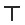 (*tau*)*,* formed from the figure 7,
and the Greek letter \[\[*G*\]\] (*gamma*)*,* was (*see* § "*Cross and
Circle*") the symbol of life,

------

------------------------------------------------------------------------

###### \[\[Vol. 2, Page\]\] 591 THE MEANING OF THE DOUBLE TRIANGLE.

and of life eternal: of earthly life, because \[\[*G*\]\] (*gamma*) is
the symbol of the Earth (*gaia*)\*; and of "life eternal," because the
figure 7 is the symbol of the same life *linked with divine life,* the
double glyph expressed in geometrical figures being: --

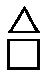

a triangle and a quaternary, the symbol of *septenary* MAN.

Now, the number *six* has been regarded in the ancient mysteries as an
emblem of *physical nature.* For six is the representation of the *six*
dimensions of all bodies: the *six* lines which compose their form,
namely, the four lines extending to the four cardinal points, North,
South, East, and West, and the two lines of height and thickness that
answer to the Zenith and the Nadir. Therefore, while the *senary* was
applied by the sages to *physical* man, the *septenary* was for them the
symbol of that man *plus* his immortal soul.

Ragon gives in his *Maconnerie Occulte* a very good illustration of the
"hieroglyphical senary," as he calls our double equilateral triangle,
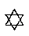. He shows it as the symbol of the commingling of the
"*philosophical three* fires and the *three* waters, whence results the
procreation of the elements of all things. The same idea is found in the
Indian equilateral double triangle. For, though it is called in that
country the sign of Vishnu, yet in truth it is the symbol of the Triad
(or the Trimurti). For, even in the exoteric rendering, the lower
triangle  with the apex downward, is the symbol of
Vishnu, the god of the moist principle and water ("*Nara*-yana," or the
moving Principle in *Nara,* water;\*\*) while the triangle, with its
apex upward, 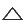 is Siva, the Principle of Fire, symbolized
by the triple flame in his hand. (See the bronze statue of Tripurantika
Siva, "Mahadeva destroying Tripurasura," at the museum of the India
House). It is these two interlaced triangles -- wrongly called
"Solomon's seal," which also form the emblem of our

###### \[\[Footnote(s)\]\] -------------------------------------------------

\* Hence the Initiates in Greece called the *Tau* \[\[*I*\]\]*,* son of
*gaia*, "sprung from earth," like *Tityos* in Odyssey 7, 324.

\*\* See the *Mahabharata, e.g.,* **III**., 189, 3, where Vishnu says,
"I called the name of water *nara* in ancient times, and am hence called
*Narayana*, for that was always the abode I moved in" (*Ayana*). It is
into the water (or chaos, the "moist principle" of the Greeks and
Hermes), that the first seed of the Universe is thrown. "The 'Spirit of
God' moves on the dark waters of Space"; hence Thales makes of it the
primordial element and prior to Fire, which was yet latent in that
Spirit.

------------------------------------------------------------------------

###### \[\[Vol. 2, Page\]\] 592 THE SECRET DOCTRINE.

Society -- that produce the Septenary and the Triad at one and the same
time, and are the *Decad,* whatever way this sign  is
examined, as all the ten numbers are contained therein. For with a point
in the middle or centre, thus 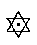 it is a sevenfold sign;
its triangles denote number 3; the *two* triangles show the presence of
the binary; the triangles with the central point common to both yield
the quaternary; the six points are the senary; and the central point,
the unit; the *quinary* being traced by combination, as a compound of
*two* triangles, the even number, and of *three* sides in each triangle,
the first odd number. This is the reason why Pythagoras and the ancients
made the number *six* sacred to Venus, since "the union of the two
sexes, and the spagyrisation of matter by triads are necessary to
develop the generative force, that prolific virtue and tendency to
reproduction which is inherent in all bodies."\*

Belief in "Creators," or the personified Powers of Nature, is in truth
no polytheism, but a philosophical necessity. Like all the other planets
of our system, the Earth has seven Logoi -- the emanating rays of the
one "Father-Ray" -- the PROTOGONOS, or the manifested "Logos" -- he who
sacrifices his Esse (or flesh, the Universe) that the world may live and
every creature therein have conscious being.

Numbers 3 and 4 are respectively male and female, Spirit and Matter, and
their union is the emblem of life eternal in spirit on its ascending
arc, and in matter as the ever resurrecting element -- by procreation
and reproduction. The spiritual male line is vertical ;
the differentiated matter-line is horizontal; the two forming the cross
or 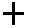. The former (the 3), is invisible; the latter (the
4), is on the plane of objective perception. This is why all the matter
of the Universe, when analyzed by science to its ultimates, can be
reduced to four elements only -- carbon, oxygen, nitrogen, and hydrogen:
and why the three primaries, the noumenoi of the four, or graduated
Spirit or Force, have remained a *terra incognita* and mere
speculations, names, to exact Science. Her servants must believe in and
study first the primary causes, before they can hope to fathom the
nature and acquaint themselves with the potentialities of the effects.
Thus, while the men of Western learning had, and still have, the four,
or matter to toy with, the Eastern Occultists and their disciples, the
great alchemists the world over, have the whole septenate to study
from.\*\* As those Alche-

###### \[\[Footnote(s)\]\] -------------------------------------------------

\* The "Potency of the Pythagorean Triangles" (Ragon).

\*\* There are learned Brahmins who have protested against our septenary
division. They are right from their own standpoint, as we are right from
ours. Leaving the \[\[footnote continued on next page\]\]

------------------------------------------------------------------------

###### \[\[Vol. 2, Page\]\] 593 SPIRITUAL AND PHYSICAL CORRESPONDENCES.

mists have it: -- "When the Three and the Four kiss each other, the
Quaternary joins its middle nature with that of the Triangle," (or
Triad, *i.e.*, the face of one of its plane surfaces becoming the middle
face of the other), "and becomes a cube; then only does it (the cube
unfolded) become the vehicle and the number of **L**IFE, the
Father-Mother **S**EVEN."

The following diagram will perhaps assist the student to grasp these
parallelisms.

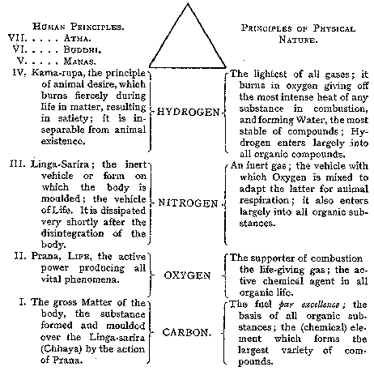

Now we are taught that all these earliest forms of organic life also
appear in septenary groups of numbers. From minerals or "soft

###### \[\[Footnote(s)\]\] -------------------------------------------------

\[\[Continued from previous page\]\] three *aspects,* or *adjunct
principles* out of calculation, they accept only four *Upadhis* (bases)
including the Ego -- the reflected image of the Logos in the "Karana
Sarira" -- and even "strictly speaking . . . . only three Upadhis." For
purely theoretical metaphysical philosophy, or purposes of meditation,
these three may be sufficient, as shown by the Taraka Yoga system; but
for *practical occult teaching* our septenary division is the best and
easiest. It is, however, a matter of school and choice.

------------------------------------------------------------------------

###### \[\[Vol. 2, Page\]\] 594 THE SECRET DOCTRINE.

stones that hardened" (Stanza) followed by the "hard plants that
softened," which are the product of the mineral, for "it is from the
bosom of the stone that vegetation is born" (*Commentary, Book IX., F.*
19); and then to man -- all the primitive models in every kingdom of
nature begin by being ethereal, transparent, films. This, of course,
takes place only in the first beginning of life. With the next period
they consolidate, and at the *seventh* begin to branch off into species,
*all except men,* the first of the mammalian animals\* in the Fourth
Round.

Virgil, versed as every ancient poet was, more or less, in esoteric
philosophy, sang evolution in the following strains: --

> Principio coelum ac terras, camposque liquentes  
> Lucentemque globum lunae, Titaniaque astra\*  
> **S**PIRITUS intus alit; totamque infusa per artus  
> **M**ENS agitat molem, et magno se corpore miscet  
> Inde Hominum pecudumque genus, etc.\*\* (AEneid **VI**. )

"First came three, or the triangle." This expression has a profound
meaning in Occultism, and the fact is corroborated in mineralogy,
botany, and even in geology, as was demonstrated in the section on
"Ancient Chronology," by the compound number seven, the three and the
four being in it. Salt in solution proves it. For when its molecules,
clustering together, begin to deposit themselves as a solid, the first
shape they assume is that of triangles, of small pyramids and cones. It
is the figure of *fire*, whence the word "*pyramids*"*;* while the
second geometrical figure in *manifested* Nature is a square or a cube,
4 and 6; for, "the particles of earth being cubical, those of fire are
pyramidal" truly -- (Enfield). The pyramidal shape is that assumed by
the pines -- the most primitive tree after the fern period. Thus the two
opposites in cosmic nature -- fire and water, heat and cold -- begin
their metrographical manifestations, one by a trimetric, the other by a
hexagonal system. For the stellate crystals of snow, viewed under a
microscope, are all and each of them a double or a treble six-pointed
star, with a central nucleus, like a miniature star within the larger
one. Says Mr.

###### \[\[Footnote(s)\]\] -------------------------------------------------

*\* Protista* are not animals. The reader is asked to bear in mind that
when we speak of "animals," the mammalians alone are meant. Crustacea,
fishes, and reptiles are contemporary with, and most have preceded
*physical* man in this Round. All were bisexual, however, before the age
of mammalia in the closing portion of the secondary or Mesozoic ages,
*yet nearer to the Palaeozoic than the Cenozoic ages.* Smaller marsupial
mammalia are contemporary with the huge reptilian monsters of the
Secondary.

\*\* "First Divine Spirit within sustains the Heavens, the earth and
watery plains, the moon's orb and shining stars and the *Eternal Mind*
diffused through all the parts of nature, actuates the whole stupendous
frame and mingles with the vast body of the universe. *Thence proceed
the race of men and beasts, the vital principles* of the flying kind and
the monsters which the Ocean breeds under its smooth crystal plane."
"All proceeds from Ether and from its seven natures" -- said the
alchemists. Science knows these only in their superficial effects.

------------------------------------------------------------------------

###### \[\[Vol. 2, Page\]\] 595 NOAH, AN ASPECT OF THE CREATOR.

Darwin, in his "Descent of Man," p. 164. showing that the inhabitants of
the sea-shore are greatly affected by the tides: --

> "The most ancient progenitors in the Kingdom of the Vertebrata . . .
> apparently consisted of a group of marine animals. . . . Animals
> living either about the *mean* high-water mark, or about the *mean*
> low-water mark, pass through a complete cycle of tidal changes in a
> fortnight. . . . Now it is a mysterious fact that in the higher and
> now terrestrial Vertebrata . . . many normal and abnormal processes
> have one or more weeks (septenates) as their periods . . . such as
> gestation of mammals, the duration of fevers," etc. . . "The eggs of
> the pigeon are hatched in two weeks (or 14 days); those of the fowl in
> three; those of the duck in four: those of the goose in five; and
> those of the ostrich in seven." (Bartlett's "Land and Water.")

This number is closely connected with the moon, whose occult influence
is ever manifesting itself in septenary periods. It is the moon which is
the guide of the occult side of terrestrial nature, while the Sun is the
regulator and factor of manifested life; (See also Vol. I., Part
**II**.), and this truth was ever evident to the Seers and the adepts.
Jacob Boehme, by insisting on the fundamental doctrine of the seven
properties of everlasting mother Nature, proved himself thereby a great
Occultist.

But to return to the consideration of the septenary in ancient religious
symbolism. To the metrological key to the symbolism of the Hebrews,
which reveals numerically the geometrical relations of the Circle
(All-Deity) to the Square, Cube, Triangle, and all the integral
emanations of the divine area, may be added the theogonic Key. This Key
explains that Noah, the deluge-Patriarch, is in one aspect the
permutation of the Deity (the Universal Creative Law), for the purpose
of the formation of our Earth, its population, and the propagation of
life on it, in general.

Now bearing in mind the Septenary division in divine Hierarchies, as in
Cosmic and human constitutions, the student will readily understand that
Jah-Noah is at the head of, and is the synthesis of the lower Cosmic
Quaternary. The upper Sephirothal , triad -- of which
Jehovah-Binah (Intelligence) is the left, female angle -- emanates the
 Quaternary. The latter symbolizing by itself the
"Heavenly Man," the sexless Adam-Kadmon viewed as Nature in the
abstract, becomes a septenate again by emanating from itself the
additional three principles, the lower terrestrial or manifested
physical Nature, Matter and our Earth (the seventh being Malkuth, the
"Bride of the Heavenly Man"), thus forming, with the higher triad, or
Kether, the Crown, the full number of the Sephirothal Tree -- the 10,
the Total in Unity, or the Universe. Apart from the higher Triad, the
lower creative Sephiroth are seven.

The above is not directly to our point, though it is a necessary

------------------------------------------------------------------------

###### \[\[Vol. 2, Page\]\] 596 THE SECRET DOCTRINE.

reminder to facilitate the comprehension of what follows. The question
at issue is to show that Jah-Noah, or the Jehovah of the Hebrew Bible,
the alleged Creator of our Earth, of man and all upon it, is: --

(*a*) The lowest Septenary, the Creative Elohim -- in his Cosmic aspect.

(*b*) The Tetragrammaton or the Adam-Kadmon, "the Heavenly Man" of the
Four letters -- in his theogonic and Kabalistic aspects.

(*c*) Noah -- identical with the Hindu *Sishta,* the human seed, left
for the peopling of the Earth from a previous creation or Manvantara, as
expressed in the Puranas, or the pre-diluvian period as rendered
allegorically in the Bible -- in his Cosmic character.

But whether a Quaternary (Tetragrammaton) or a Triad, the Bible Creative
God is not the Universal 10, unless blended with **A**IN-**S**OPH (as
Brahma with Parabrahm), but a septenary, one of the many Septenaries of
the Universal Septenate. In the explanation of the question now in hand,
his position and status as Noah may best be shown by placing the 3,
,and 4,  on parallel lines with the
"Cosmic" and "Human" principles. For the latter, the old familiar
classification is made use of. Thus: --

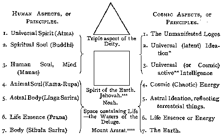

As an additional demonstration of the statement, let the reader turn to
scientific works. "*Ararat = the mount of descent =* 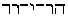*,
Hor-Jared.* Hatho mentions it out of composition by *Areth =*
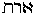. Editor

###### \[\[Footnote(s)\]\] -------------------------------------------------

**N**OTE. -- For footnotes, see next page.

------------------------------------------------------------------------

###### \[\[Vol. 2, Page\]\] 597 NOAH IN A NEW DRESS.

of Moses Cherenensis says: 'By this, they say, is signified *the first*
*place of descent* (of the ark).' (*Bryant*'*s Anal.,* Vol. **IV**.,
pages 5, 6, 15.) Under "*Berge*" *mountain,* Nork says of Ararat:
, for  (*i.e., Ararat* for *Arath*)
**E**ARTH, Aramaic reduplication.' Here it is seen that Nork and Hatho
make use of the same equivalent in Arath, with the meaning of
*Earth.*"\*\*\*\*\*

Noah thus symbolizing both the *Root*-Manu and the *Seed*-Manu, or the
Power which developed the planetary chain, and our earth, and the *Seed*
Race (the Fifth) which was saved while the last sub-races of the Fourth
perished -- Vaivasvata Manu -- the number *Seven* will be seen to recur
at every step. It is he (Noah), who represents, as Jehovah's
permutation, the septenary Host of the Elohim, and is thus the Father or
Creator (the Preserver) of all animal life. Hence verses 2 and 3 of

###### \[\[Footnote(s)\]\] -------------------------------------------------

\* The Adwaitee Vedantic philosophy classifies this as the highest
trinity, or rather the Trinitarian aspect of Chinmatra (Parabrahmam),
explained by them as the "bare potentiality of Pragna" -- the power or
the capacity that gives rise to perception; Chidakasam, the infinite
field or plane of Universal Consciousness; and Asath (Mulaprakriti), or
undifferentiated matter. (See "*Personal and Impersonal God*" in "*Five
Years of Theosophy.*")

\*\* Differentiated matter existing in the Solar System (let us not
touch the whole Kosmos) in seven different conditions, and Pragna, or
the capacity of perception, existing likewise in seven different aspects
corresponding to the seven conditions of matter, there must necessarily
be seven states of consciousness in man; and according to the greater or
smaller development of these states, the systems of religions and
philosophies were schemed out.

\*\*\* Represented as the jealous, angry, turbulent and ever active-god,
revengeful, and kind only to his chosen people when propitiated by them.

\*\*\*\* Noah and his three Sons are the collective symbol of this
Quaternary in many and various applications, Ham being the Chaotic
principle.

*\*\*\*\*\** "*Source of Measures,*" p. 65. The author explains, "Note
that in Hebrew, *Jared*, the father of Enoch, is construed to be '*the
mount of descent,*' and it is said to be the same with *Ararat* on which
the cubical structure of *Noah,* or *foundation measure* rested.
*Jared,* in Hebrew, is 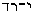. The root derivations are the
same with those of *Ararat,* of *acre,* of earth." As by Hebrew
metrology "Jared,  is, *literally in British* Y R D;
hence in *Jared* is to be found *literally* our English word *yard* (and
also , for *Jah,* or *Jehovah, is rod*)*.* It is
noteworthy that the son of *Jared,* viz*., Enoch,* lived 365 years, and
it is said of him by rabbinical commentators, that the year period of
365 days was discovered by him, thus bringing, again, *time and
distance* values together, *i.e., year* *time* descended by
co-ordination, through the *yard,* or *jared,* who *thus was its
father,* in or through *Enoch*; and truly enough, 1296 = *yard* (or
*jared*) x 4 = 5184, the characteristic value of the solar day, in
*thirds,* which as stated may be styled the *parent* *numerically,* of
the solar year" (*ibid.* p. 65). This, however, by the astronomical and
numerical Kabalistic methods. Esoterically, Jared is the Third race and
Enoch the Fourth -- but as he is taken away alive he symbolizes also the
Elect saved in the Fourth, while Noah is the Fifth from the beginning --
the family saved from the waters, eternally and *physically.*

------------------------------------------------------------------------

###### \[\[Vol. 2, Page\]\] 598 THE SECRET DOCTRINE.

chapter vii. of *Genesis,* "Of every clean beast thou shalt take to thee
by sevens, the male (3), and the female (4); of fowls also of the air by
*sevens,*" etc., etc., followed by all the *sevening* of days and the
rest.

-------

### B.

#### **T**HE **T**ETRAKTIS IN **R**ELATION TO THE **H**EPTAGON.

Thus Number Seven, as a compound of 3 and 4, *is* the factor element in
every ancient religion, because *it is the factor element in nature.*
Its adoption must be justified, and it must be shown to *be* the number
*par* *excellence,* for, since the appearance of "Esoteric Buddhism,"
frequent objections have been made, and doubts expressed as to the
correctness of these assertions.

And here let the student be told at once, that in all such numerical
divisions the **O**NE universal Principle, -- although referred to as
(the) one, because the *Only One --* never enters into the calculations.
**I**T stands, in its character of the Absolute, the Infinite, and the
universal abstraction, entirely by **I**TSELF and independent of every
other Power whether noumenal or phenomenal. **I**T "is neither matter
nor spirit; **I**T is neither Ego nor non-Ego; and **I**T is neither
object nor subject," says the author of "*Personal and Impersonal God,*"
and adds: --

> "In the language of Hindu philosophers it is the original and eternal
> combination of Purusha (Spirit) and Prakriti (matter). As the
> Adwaitees hold that an external object is merely the product of our
> mental states, Prakriti is nothing more than an illusion, and Purusha
> is the only reality; it is the **O**NE existence which remains in the
> universe of Ideas. This . . . then, is the Parabrahm of the Adwaitees.
> . . . ."

> "Even if there were to be a personal God with anything like a material
> *upadhi* (physical basis of whatever form), from the standpoint of an
> Adwaitee there will be as much reason to doubt his noumenal existence,
> as there would be in the case of any other object. In their opinion, a
> conscious God cannot be the origin of the Universe, as his Ego would
> be the effect of a previous cause, if the word conscious conveys but
> its ordinary meaning. They cannot admit that *the grand total of all
> the states of consciousness in the Universe* is their deity, as these
> states are constantly changing, and as cosmic ideation ceases during
> *Pralaya*. There is only one permanent condition in the Universe,
> which is the state of perfect unconsciousness, bare *Chidakasam* (the
> field of consciousness) in fact. When my readers once realize the fact
> that this grand universe is in reality but a huge aggregation of
> various states of consciousness, they will not be surprised to find
> that the ultimate state of unconsciousness is considered as
> Parabrahmam by the Adwaitees."\*

Being itself entirely out of human reckoning or calculation, yet this
"huge aggregation of various states of consciousness" is a Septenate,

###### \[\[Footnote(s)\]\] -------------------------------------------------

\*" Five Years of Theosophy," Art. "Personal and Impersonal God."

------------------------------------------------------------------------

###### \[\[Vol. 2, Page\]\] 599 THE ROOTS OF THINGS.

in *its* totality entirely composed of Septenary groups; simply because
"the capacity of perception *exists in seven different aspects
corresponding* *to the seven conditions of matter*" (*ibid*)*,* or the
seven properties, or states, or conditions of matter. And, therefore,
number 1 down to number 7 begins in the esoteric calculations with the
first manifested principle, which is number one if we commence from
above, and the *seventh* when reckoning from below, or from the lowest
Principle.

The *Tetrad* is esteemed in the Kabala, as it was by Pythagoras, the
most perfect, or rather *sacred* number, because it emanated from the
*one,* the first manifested Unit, or rather *the three in one.* Yet the
latter has been ever impersonal, sexless, incomprehensible, though
within the possibility of the higher mental perceptions.

The first manifestation of the eternal monad was never meant to stand as
the symbol of another symbol, the **U**NBORN for the Element-born, or
the one **L**OGOS for the Heavenly man. Tetragrammaton, or the Tetractys
of the Greeks, is the *Second logos,* the Demiurgos. The Tetrad, as
Thomas Taylor thought (*vide* the "*Pythagorean Triangle*")*,* "is the
*animal itself* of Plato, who, as Syrianus justly observes, was the best
of the Pythagoreans; it subsists at the extremity of the intelligible
triad, as is most satisfactorily shown by Proclus in the third book of
his treatise on the theology of Plato. And between these two triads (the
double triangle), the one intelligible, and the other intellectual,
another order of gods exists which partakes of both extremes." "The
Pythagorean world," Plutarch tells us (in *De anim. procr.,* 1027)
"*consisted of a double* *quaternary.*" This statement corroborates what
is said about the choice, by the exoteric theologies, *of the lower*
Tetraktis. For: -- "The quaternary of the intellectual world (the world
of *Mahat*) is T'Agathon, Nous, Psyche, Hyle; while that of the sensible
world (of matter), which is properly what Pythagoras meant by the word
Kosmos -- is Fire, Air, Water, and Earth. The four elements are called
by the name of *rizomata,* the roots or principles *of all mixed
bodies,*" *i.e.,* the lower Tetraktis is the root of *illusion* of the
world of matter; and this is the tetragrammaton of the Jews, and the
"mysterious deity," over which the modern Kabalists make such a fuss!

"Thus number *four* forms the arithmetical mean between the monad and
the *heptad,* as this contains all powers, both of the productive and
produced numbers; for this of all numbers under ten, is made of a
certain number; the duad doubled makes a tetrad, and the tetrad doubled
or unfolded makes the *hebdomad* (the septenary). Two multiplied into
itself produces four; and retorted into itself makes the first cube.
This first cube *is a fertile number,* the ground of multitude and
variety, constituted of two and four (depending on the monad, the
*seventh*)*.* Thus the two principles of temporal things, the *pyramis*
and

------------------------------------------------------------------------

###### \[\[Vol. 2, Page\]\] 600 THE SECRET DOCTRINE.

cube, form and matter, flow from one fountain, the tetragon (on earth)
the *monad* (in heaven) . . . . " (See Reuchlin, "*Cabala*" 1*,* ii.).

Here Reuchlin, the great authority on the Kabala, shows the cube to be
*matter,* whereas the pyramid or the *triad* is "form." With the
Hermesians the number four becomes the symbol of truth *only when
amplified into a cube,* which, unfolded, makes seven, as symbolizing the
male and female elements and the element of **L**IFE.\*

Some students have been puzzled to account for the vertical line, which
is male, becoming (*vide infra*) in the cross a four-partitioned line
*-- four* being a female number, while the horizontal (the line of
matter) becomes three-divisioned. But this is easy of explanation. Since
the middle face of the cube unfolded *is common* to both the vertical
and the horizontal bar, or double-line, it becomes *neutral* ground so
to say, and belongs to neither. The spirit line remains triadic, and the
matter line two-fold -- two being an even and therefore a female number
also. Moreover, according to Theon, the Pythagoreans who gave the name
of Harmony to the Tetraktis, "because it is a diatessaron in
sesquitertia" -- were of opinion that "the division of the canon of the
monochord was made by the tetraktis in the *duad, triad,* and *tetrad;*
for it comprehends a sesquitertia, a sesquialtera, a double, a triple,
and a quadruple proportion, the section of which is 27." "In the ancient
musical notation, the tetrachord consisted of *three* degrees or
intervals, and *four* terms of sounds called by the Greeks diatessaron,
and by us a fourth." Moreover, the quaternary though an even, therefore
a female ("infernal") number, varied according to its form. This is
shown by Stanley (in *Pythag.* p. 61). The 4 was called by the

###### \[\[Footnote(s)\]\] -------------------------------------------------

\* In the "*Hebrew Egyptian Mystery, the Source of Measures,*" the
Author shows (on p. 50) that the figure of the cube unfolded in
connection with the circle . . . . "becomes . . a cross proper, or of
the *tau* form, and the attachment of the circle to this last gives the
*ansated cross* of the Egyptians . . . . while there are but 6 faces to
a cube, the representation of the cross as the cube unfolded, as to the
cross-bars, displays *one face of the cube as common to* *two bars,*
counted as belonging to either . . *.* (*i.e.*, once counted
horizontally, and once vertically)

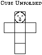

. . . 4 for the upright and 3 for the cross bar making *seven* in all,"
-- 4 for the upright, and 3 for the -- adding -- "Here we have the
famous 4, and 3, and 7." Esoteric philosophy explains that *four* is the
symbol of the Universe in its potential state, or *chaotic matter,* and
that it requires Spirit to permeate it actively, *i.e.*, the primordial
*abstract* triangle has to quit its one dimensional quality and spread
across that matter, thus forming a *manifested* basis on the three
dimensional space, in order that the Universe should manifest
intelligibly. This is achieved by the cube unfolded. Hence the *ansated*
cross  as the symbol of man, generation and life. In
Egypt *ank* signified soul, life and blood. It is the *ensouled,*
*living* man, the Septenary.

------------------------------------------------------------------------

###### \[\[Vol. 2, Page\]\] 601 THE MUSIC OF THE SPHERES.

Pythagoreans the Key-Keeper of Nature; but in union with the 3, which
made it seven, it became the most perfect and harmonious number --
*nature* *herself.* The four was "the Masculine of Feminine Form," when
forming the Cross; and Seven is "the Master of the Moon," for this
planet is forced to alter her appearance every seven days. It is on
number seven that Pythagoras composed his doctrine on the Harmony and
Music of the Spheres, calling "a tone" the distance of the Moon from the
Earth; from the Moon to Mercury half a tone, from thence to Venus the
same; from Venus to the Sun l 1/2 tones; from the Sun to Mars a tone;
from thence to Jupiter 1/2 a tone; from Jupiter to Saturn 1/2 a tone;
and thence to the Zodiac a tone; thus making seven tones -- the diapason
harmony. All the melody of nature is in those seven tones, and therefore
is called "the Voice of Nature."

Plutarch explains (*de Plac. Phil.,* p. 878) that the Achaean Greeks
regarded the tetrad as the root and principle of all things, since it
was the number of the elements which gave birth to all visible and
invisible *created* things. With the brothers of the Rosy Cross, the
figure of the Cross, or *Cube unfolded,* formed the subject of a
disquisition in one of the theosophic degrees of Peuret, and was treated
according to the fundamental principles of light and darkness, *or good
and evil.*

> "The intelligible world proceeds out of the divine mind (or unit)
> after this manner. The Tetraktis reflecting upon its own essence, *the
> first unit, productrix* *of all things,* and on its own beginning,
> saith thus: Once one, twice two, immediately ariseth a tetrad, having
> on its top the highest unit, *and becomes a Pyramis,* *whose base* is
> a plain tetrad, answerable to a superficies, upon which the radiant
> light of the divine unity produceth the form of incorporeal fire, by
> reason of the descent of Juno (matter) to inferior things. Hence
> ariseth essential light, not burning but illuminating. This *is the
> creation of the middle world,* which the Hebrews *call the Supreme,*
> the world of the (*their*) deity. It is termed Olympus, entirely
> light, and replete with separate forms, where is the seat of the
> immortal gods, '*deum domus alta,*' whose top is UNITY, its wall
> *trinity,* and its superficies *quaternity.*" (Reuchlin, *Cabala,* p.
> 689).

The "superficies" has thus to remain a *meaningless surface,* if left by
itself. **U**NITY only "illuminating" *quaternity;* the famous lower
four has to build for itself also a wall from *trinity,* if it would be
manifested. Moreover, the *tetragrammaton,* or Microprosopus, is
"Jehovah" arrogating to himself very improperly the "Was, Is, Will be,"
now translated into the "*I am that I am,*" and interpreted as referring
to the highest abstract Deity, while esoterically and in plain truth, it
means only periodically chaotic, turbulent, and eternal MATTER with all
its potentialities. For the Tetragrammaton is one with Nature or Isis,
and is the exoteric series of androgyne gods such as Osiris-Isis,
Jove-Juno, Brahma-Vach, or the Kabalistic *Jah-hovah;* all male-females.
Every *anthropomorphic* god, in old nations, as Marcelinus Vicinus well
observed,

------------------------------------------------------------------------

###### \[\[Vol. 2, Page\]\] 602 THE SECRET DOCTRINE.

has his name written with four letters. Thus with the Egyptians, he was
*Teut;* the Arabs, *Alla*; the Persians, *Sire*; the Magi, *Orsi;* the
Mohammedans, *Abdi*; the Greeks, *Theos;* the ancient Turks, *Esar;* the
Latins, *Deus;* to which J. Lorenzo Anania adds the German *Gott;* the
Sarmatian, *Bouh*, etc., etc.

The Monad being one, and an *odd* number, the ancients therefore called
the odd, the only perfect numbers; and -- selfishly, perhaps, yet as a
fact -- considered them all as masculine and perfect, being applicable
to the celestial gods, while even numbers, such as two, *four,* six, and
especially eight, as being female, were regarded as imperfect, and given
only to the *terrestrial* *and infernal deities.* In his eighth eclogue,
Virgil records the fact by saying, "*Numero deus impare gaudet,*"
"Unequal numbers please the gods."

But number *seven,* or the *heptagon,* the Pythagoreans considered to be
a *religious and perfect* number. It was called "*Telesphoros,*" because
*by it all in the Universe and mankind is led to its end, i.e.,* its
culmination (*Philo. de Mund. opif.*)*.* Being under the rule of seven
sacred planets,\* the doctrine of the Spheres shows, from Lemuria to
Pythagoras, the seven powers of terrestrial and sublunary nature, as
well as the seven great Forces of the Universe, proceeding and evolving
in seven tones, which are the seven notes of the musical scale. The
*heptad* (our Septenary) was regarded "*as the number of a virgin,
because it is* *unborn*" (like the Logos or the "Aja" of the Vedantins);
"without a father or a mother, *but proceeding directly from the Monad,*
which is the origin and crown of all things." (*Pythag. Triangle,* p.
174.) And if the *heptad* is made to proceed from the Monad directly,
then it is, as taught in the Secret Doctrine of the oldest schools, the
perfect and sacred number of this Maha-Manvantara of ours.

The septenary, or *heptad,* was sacred indeed to several gods and
goddesses; to Mars, with his seven attendants, to Osiris, whose body was
divided into seven and twice seven parts; to Apollo (the Sun), between
his seven planets, and playing the hymn to the seven-rayed on his
seven-stringed harp; to Minerva, the fatherless and the motherless, and
others.

Cis-Himalayan Occultism with its *sevening,* and because of such
sevening, must be regarded as the most ancient, the original of all. It
is opposed by *some* fragments left by Neo-Platonists; and the admirers
of the latter, who hardly understand what they defend, say to us: "See,
your forerunners believed only in *triple* man, composed of

###### \[\[Footnote(s)\]\] -------------------------------------------------

\* The seven planets are not limited to this number because the ancients
knew of no others, but simply because they were the primitive or
primordial *houses* of the seven *Logoi.* There may be nine and
ninety-nine other planets discovered -- this does not alter the fact of
these seven alone being sacred.

------------------------------------------------------------------------

###### \[\[Vol. 2, Page\]\] 603 THE SEPTENARY DEMONSTRATED.

Spirit, Soul, and body. Behold, the Taraka Raja Yoga of India limits
that division to 3, we, to 4, and the Vedantins to 5 (koshas)." To this,
we of the Archaic school, ask: --

Why then does the Greek poet say that "*it is not four* but SEVEN who
sing the praise of the Spiritual Sun," \[\[*HEPTA ME*\]\]? He says--

> "Seven sounding letters sing the praise of me,  
> The immortal God, the Almighty deity."  
> . . .

Why again is the *triune* **I**AO (the Mystery God) called the
"fourfold," and yet the triad and tetradic symbols come under one
unified name with the Christians -- the Jehovah of the seven letters?
Why again in the Hebrew Sheba is the Oath (the Pythagorean *Tetraktis*)
identical with number 7; or, as Mr. G. Massey has it, "taking an oath
was synonymous with 'to seven,' and the 10 expressed by the letter
*Yod,* was the full number of **I**AO-**S**ABAOTH, the ten-lettered
God"? In Lucian's *Auction,* Pythagoras asks, "How do you reckon?" The
reply is, "One, Two, Three, Four." "Then, do you see," says Pythagoras,
"in *what you* *conceive* **F**OUR there are Ten; then, *a perfect
triangle and our Oath* (tetraktis, *four!*)*,*" or Seven. Why does
Proclus say in *Timaeus,* c*. iii.* -*-* "The Father of the golden
verses celebrates the Tetractys as the fountain of perennial nature"?

Simply because those Western Kabalists who quote the *exoteric* proofs
against us have no idea of the real *esoteric* meaning. Because all the
ancient Cosmologies -- the oldest Cosmographies of the two most ancient
people of the Fifth Root Race, the Hindu Aryans and the Egyptians,
adding to them the early Chinese races (the remnants of the Fourth or
Atlantean Race) -- based the whole of their mysteries on number 10: the
higher triangle standing for the invisible and metaphysical world, the
lower three and four, or the *Septenate,* for the physical realm. It is
not the Jewish Bible that brought number seven into prominence. Hesiod
used the words "The seventh is the sacred day," before the Sabbath of
"Moses" was ever heard of. The use of number seven was never confined to
any one nation. This is well testified by the seven vases in the temple
of the Sun, near the ruins of Babion in Upper Egypt; the seven fires
burning continually for ages before the altars of Mithra; the seven holy
fanes of the Arabians; the seven peninsulas, the seven islands, seven
seas, mountains, and rivers of India; and of the *Zohar* (See *Ibn
Gebirol*)*;* the Jewish Sephiroth of the *Seven* splendours; the seven
Gothic deities, the seven worlds of the Chaldeans and their seven
Spirits; the seven constellations mentioned by Hesiod and Homer; and all
the interminable sevens which the Orientalists find in every **MS**.
they discover.

What we have to say finally is this: Enough has been brought forward to
show why the human principles were and are divided in the

------------------------------------------------------------------------

###### \[\[Vol. 2, Page\]\] 604 THE SECRET DOCTRINE.

esoteric schools into seven. Make it *four* and it will either leave man
*minus* his lower terrestrial elements, or, if viewed from a physical
stand-point, make of him a soulless animal. The Quaternary must be the
higher or the lower -- the celestial or terrestrial Tetraktis: to become
comprehensible, according to the teachings of the esoteric *ancient*
school man must be regarded as a Septenary. This was so well understood,
that even the so-called Christian Gnostics had adopted this
time-honoured system (*Vide* § on "*The Seven Souls*")*.* This remained
for a long time secret as, though suspected, no **MSS**. of that time
spoke of it clearly enough to satisfy the sceptic. But there comes to
our rescue the literary curiosity of our age -- the oldest and best
preserved gospel of the Gnostics, *Pistis Sophia* \[\[*Pictic
Cophia*\]\]. To make the proof absolutely complete, we shall quote from
an authority (C. W. King) -- the only archaeologist who had a faint
glimmer of this elaborate doctrine, and the best writer of the day on
the Gnostics and their gems.

According to this extraordinary piece of religious literature -- a true
Gnostic fossil -- the human Entity is the Septenary ray from the One,\*
just as our school teaches. It is composed of seven elements, four of
which are borrowed from the four Kabalistical manifested worlds. Thus
"from Asia it gets the *Nephesh* or seat of the physical appetites
(vital breath, also); from Jezirah, the Ruach, or seat of the passions
(? !); from Briah, the *Neshamah,* and from Aziluth it obtains the
*Chaiah,* or principle of spiritual life;" (King). "This looks like an
adaptation of the Platonic theory of the Soul's obtaining its respective
faculties from the Planets in its downward progress through their
Spheres. But the *Pistis-Sophia,* with its accustomed boldness, puts
this theory into a much more poetical shape (§ 282)." The *Inner Man* is
similarly made up of *four* constituents, *but these are supplied by the
rebellious AEons of* *the Spheres,* being the *Power --* a particle of
the Divine light ("*Divinae* *particula aurae*") yet left in themselves;
the *Soul* (the fifth) "formed out of the tears of their eyes, and the
sweat of their torments; the \[\[*Antimimon Prieumatos*\]\]*,
Counterfeit of the Spirit* (seemingly answering to our Conscience),
(*the sixth*)*;* and lastly the \[\[*Moira*\]\], *Fate\*\** (Karmic
Ego), whose

###### \[\[Footnote(s)\]\] -------------------------------------------------

\* The Seven Centres of Energy evolved, or rendered objective by the
action of Fohat upon the one element; or, in fact, the "*Seventh*
Principle" of the Seven Elements which exist throughout manifested
Kosmos. We may here point out that they are in truth the Sephiroth of
the Kabalists; the "Seven gifts of the Holy Ghost" in the Christian
system; and in a mystical sense, the seven children or sons of Devaki
killed before the birth of Krishna by Kamsa. Our seven principles
symbolize all of these. We have to part or separate from them before we
reach the *Krishna or Christ-state,* that of a *Jivanmukta*, and centre
ourselves entirely in the highest, the Seventh or the **O**NE.

\*\* \[\[*Moira*\]\] is destiny, not "Fate," in this case, as it is an
appellation, not a proper noun. (See Wolf's transl. in Odyssey 22, 413).
But Moira, the Goddess of Fate, is a deity \[\[Continued on next
page\]\]

------------------------------------------------------------------------

###### \[\[Vol. 2, Page\]\] 605 THE VEDIC TEACHINGS.

whose business it is to lead the man to the end appointed for him; if he
hath to die by the fire, to lead him into the fire, if he hath to die by
a wild beast, to lead him unto the wild beast, etc."\* -- the SEVENTH!

\[\[Page continued in next section\]\]

-------

------------------------------------------------------------------------

[Next Section](sd2-2-13.md)

[Contents](sd2-0-co.htm#contents.md)
