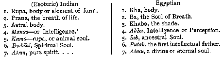
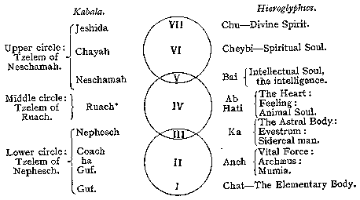

##### *The Secret Doctrine* by H. P. Blavatsky -- Vol. 2

------------------------------------------------------------------------

###### \[\[Vol. 2, Page\]\] 630 THE SECRET DOCTRINE.

\[\[Page continued from [previouis section](sd2-2-13)\]\]

### F.

#### **T**HE **S**EVEN **S**OULS OF THE **E**GYPTOLOGISTS.

If one turns to those wells of information, "*The Natural Genesis*" and
the *Lectures* of Mr. Gerald Massey, the proofs of the antiquity of the
doctrine under analysis become positively overwhelming. That the belief
of the author differs from ours can hardly invalidate the facts. He
views the symbol from a purely natural standpoint, one perhaps a trifle
too materialistic, because too much that of an ardent Evolutionist and
follower of the modern Darwinian dogmas. Thus he shows that "the student
of Bohme's books finds much in them concerning these Seven Fountain
Spirits and primary powers, treated as seven properties of nature in the
alchemistic and astrological phase of the mediaeval mysteries;"\* and
adds --

> "The followers of Bohme look on such matter as divine revelation of
> his inspired Seership. They know nothing of the natural genesis, the
> history and persistence of the Wisdom\*\* of the past (or of the
> broken links), and are unable to recognise the physical features of
> the ancient Seven Spirits beneath their modern metaphysical or
> alchemist mask. A second connecting link between the Theosophy of
> Bohme and the physical origins of Egyptian thought, is extant in the
> fragments of *Hermes Trismegistus.\*\*\** No matter whether these
> teachings are called Illuminatist, Buddhist, Kabalist, Gnostic,
> Masonic, or Christian, the elemental types can only be truly known in
> their beginnings.\*\*\*\* When the prophets or visionary showmen of
> cloudland come to us claiming original inspiration, and utter
> something new, we judge of its value by what it is in itself. But if
> we find they bring us the ancient matter which they cannot account
> for, and we can, it is natural that we should judge it by the primary
> significations rather than the latest pretensions.\*\*\*\*\* It is
> useless for us to read our

###### \[\[Footnote(s)\]\] -------------------------------------------------

\* The Natural Genesis, Vol. I.. pp, 318-319.

\*\* Yet there are some, who may know something of these, even outside
the author's lines, wide as they undeniably are.

\*\*\* This connecting link, like others, was pointed out by the present
writer nine years before the appearance of the work from which the above
is quoted, namely in *Isis* *Unveiled,* a work full of such guiding
links between ancient, mediaeval, and modern thought, but,
unfortunately, too loosely edited.

\*\*\*\* Ay; but how can the learned writer prove that these
"beginnings" were precisely in Egypt, and nowhere else; and only 50,000
years ago?

\*\*\*\*\* Precisely: and this is just what the Theosophists do. They
have never claimed," (original inspiration," not even as mediums, but
have always pointed, and do now point to the "primary signification" of
the symbols, which they trace to other \[\[Continued on next page\]\]

------------------------------------------------------------------------

###### \[\[Vol. 2, Page\]\] 631 THE SIDEREAL SEVEN.

> later thought into the earliest types of expression, and then say the
> ancients meant that.\* Subtilized interpretations which have become
> doctrines and dogmas in theosophy have now to be tested by their
> genesis in physical phenomena, in order that we may explode their
> false pretensions to supernatural origin or supernatural knowledge.\*

But the able author of the "Book of the Beginnings" and of "*The*
*Natural Genesis*" does -- very fortunately, for us -- quite the
reverse. He demonstrates most triumphantly our Esoteric (Buddhist)
teachings, by showing them identical with those of Egypt. Let the reader
judge from his learned lecture on "The Seven Souls of Man."\*\* Says the
author: --

"The first form of the mystical **S**EVEN was seen to be figured in
heaven by the Seven large stars of the *great Bear,* the constellation
assigned by the Egyptians to the Mother of Time, and of the Seven
Elemental Powers."

Just so, for the Hindus place in the *great Bear* their seven primitive
Rishis and call this constellation the abode of the *Saptarishi, Riksha*
and *Chitra-Sikhandinas.* But whether it is only an astronomical myth or
a primordial mystery, having a deeper meaning than it bears on its
surface, is what their adepts claim to know. We are also told that "the
Egyptians divided the face of the sky by night into seven parts. The
primary Heaven was seven-fold." So it was with the Aryans. One has but
read the Puranas about the beginnings of Brahma, and his "Egg" to see
it. Have the Aryans taken the idea from the Egyptians? -- "The earliest
forces," proceeds the lecturer, "recognized in nature were reckoned as
seven in number. These became seven elementals, devils (?) or later,
divinities. Seven properties were assigned to nature, as

###### \[\[Footnote(s)\]\] -------------------------------------------------

\[\[Continued from previous page\]\] countries, older even than Egypt;
*significations,* moreover, which emanate from a hierarchy (or
hierarchies, if preferred) of *living wise men*, mortals,
notwithstanding that Wisdom, who reject every approach to
*supernaturalism.*

\* But where is the proof that the ancients did not mean precisely that
which the theosophists claim? Records exist for what they say, just as
other records exist for what Mr. G. Massey says. His interpretations are
very correct, but equally one-sided. Surely nature has more than one
*physical aspect;* for astronomy, astrology, and so on, are all on the
physical, not the spiritual plane.

\*\* It is to be feared that Mr. Massey has not succeeded. We have our
followers as he has his followers, and materialistic Science steps in
and takes little account of both his and our speculations!

The fact that this learned Egyptologist does not recognise in the
doctrine of the "Seven Souls," as he terms our *principles,* or
"metaphysical concepts," but "the primitive biology or physiology of the
Soul," does not invalidate our argument. The lecturer touches on only
two keys, those that unlock the astronomical and the physiological
mysteries of esotericism, and leaves out the other five. Otherwise he
would have promptly understood that what he calls the *physiological*
divisions of the living Soul of man, are regarded by theosophists as
also psychological and spiritual.

------------------------------------------------------------------------

\[\[Vol. 2, Page\]\] 632 THE SECRET DOCTRINE.

matter, cohesion, fluxion, coagulation, accumulation, station, and
division and *seven elements or souls to man.*"

All this was taught in the esoteric doctrine, but it was interpreted and
its mysteries unlocked, as already stated, with *seven,* not two, or at
the utmost, three keys; hence the causes and their effects worked in
invisible or mystic as well as psychic nature, and were made referable
to metaphysics and psychology as much as to physiology. "The principle
of *sevening*" *--* as the author says -- "was introduced, and the
number seven supplied a sacred type *that could be used for manifold
purposes*"*;* and it was so used. For "the seven Souls of the Pharaoh
are often mentioned in the Egyptian texts. . . . *Seven Souls or
principles in man were* *identified by our British Druids*. . . . . The
Rabbins also ran the number of souls up to seven; so, likewise, do the
Karens of India. . . ."

And then, the author tabulates the two teachings -- the Esoteric and the
Egyptian, -- and shows that the latter had the same series and in the
same order.

Further on, the lecturer formulates these seven (Egyptian) souls, as (1)
The Soul of Blood -- the *formative*; (2) The Soul of Breath -- "that
*breathes*"; (3) The Shade or Covering Soul -- "that *envelopes*"; (4)
The Soul of Perception -- "that *perceives*;" (5) The Soul of Pubescence
"that *procreates*"; (6) The Intellectual Soul -- "that *reproduces
intellectually*"; and (7) The Spiritual Soul -- "that is *perpetuated
permanently.*"

From the exoteric and physiological standpoint this may be very correct;
it becomes less so from the esoteric point of view. To maintain this,
does not at all mean that the "Esoteric Buddhists" *resolve men into* *a
number of elementary Spirits,* as Mr. G. Massey, in the same lecture,
accuses them of maintaining. No "Esoteric Buddhist" has ever been guilty
of any such absurdity. Nor has it been ever imagined that these shadows
"become spiritual beings in another world," or "seven potential spirits
or elementaries of another life." What is maintained is simply that
every time the immortal *Ego* incarnates it becomes, as a total, a com-

###### \[\[Footnote(s)\]\] -------------------------------------------------

\* This is a great mistake made in the Esoteric enumeration. Manas is
the fifth, not the fourth; and *Manas* corresponds precisely with *Seb,*
the Egyptian fifth principle, for that portion of Manas, which follows
the two higher principles, is the ancestral soul, indeed, the bright,
immortal thread of the higher Ego, to which clings the Spiritual aroma
of all the lives or births.

------------------------------------------------------------------------

###### \[\[Vol. 2, Page\]\] 633 THE "PRINCIPLES" IN THE EGYPTIAN METAPHYSICS.

pound unit of Matter and Spirit, which together act on seven different
planes of being and consciousness. Elsewhere, Mr. G. Massey adds: --
"The seven souls (our "Principles") are often mentioned in the Egyptian
texts. The moon god, Taht-Esmun, or the later sun god, expressed the
seven nature-powers that were prior to himself, and were summed up in
him as his seven souls (we say "principles") . . . . The seven stars in
the hand of Christ in the Revelation, have the same significance," etc.

And a still greater one, as these stars represent also the *seven keys*
of the Seven Churches or the **S**ODALIAN **M**YSTERIES, cabalistically.
However, we will not stop to discuss, but add that other Egyptologists
have also found out that the septenary constitution of man was a
cardinal doctrine with the old Egyptians. In a series of remarkable
articles in the "Sphinx" (Munich) Herr Franz Lambert gives
incontrovertible proof of his conclusions from the "Book of the Dead"
and other Egyptian records. For details the reader must be referred to
the articles themselves, but the following diagram, summing up the
author's conclusions, is demonstrative evidence of the identity of
Egyptian psychology with the septenary division in "Esoteric Buddhism."

On the left hand side the Kabalistic names of the corresponding human
principles are placed, and on the right the hieroglyphic names with
their renderings as in the diagram of F. Lambert.

###### \[\[Footnote(s)\]\] -------------------------------------------------

\* There seems a confusion -- lasting for many centuries -- in the minds
of Western Kabalists. They call *Ruach* (Spirit) what we call
*Kama*-rupa; whereas, with us Ruach would be the "Spiritual Soul"
*Buddhi,* and *Nephesh* the 4th principle, the Vital, Animal Soul.
Eliphas Levi falls into the same error.

------------------------------------------------------------------------

###### \[\[Vol. 2, Page\]\] 634 THE SECRET DOCTRINE.

This is a very fair representation of the number of the "principles" of
Occultism, but much confused; and this is what we call the 7 principles
in man, and what Mr. Massey calls "Souls," giving the same name to the
Ego or the *Monad* which reincarnates and *resurrects,* so to speak, at
each rebirth, as the Egyptians did, namely -- "the Renewed." But how can
Ruach (Spirit) be lodged in Kama-rupa? What does Bohme, the Prince of
all the mediaeval Seers, say?

"We find Seven especial properties in nature whereby this only Mother
works all things" (which he calls -- fire, light, sound (the upper
three) and *desire, bitterness, anguish,* and *substantiality,* thus
analysing the lower in his own mystic way) . . . "whatever the six forms
are spiritually, that the seventh, the body (or substantiality), is
essentially." These are the seven forms of the Mother of all Beings from
whence all that is in this world is generated,\* and again in *Aurora
xxiv. p.* 27 (quoted in *Natural Genesis*) *--* "The Creator hath in the
body of this world generated himself as it were *creaturely* in his
qualifying Fountain Spirits, and all the stars are . . . God's powers,
and the whole body of the world consisteth in the seven qualifying or
Fountain Spirits."

This is rendering in mystical language our theosophical doctrine. . .
But how can we agree with Mr. G. Massey when he states that --

"The Seven *Races* of men that have been sublimated and made Planetary
(?) by Esoteric Buddhism,\*\* may be met with in the Bundahish as (1)
the earth-men; (2) water-men; (3) breast-eared men; (4) breast-eyed men;
(5) one-legged men; (6) bat-winged men; (7) men with tails." . . . Each
of these descriptions, allegorical and even perverted in their later
form -- is, nevertheless, an echo of the Secret Doctrine teaching. They
all refer to the pre-Human evolution of the water-men "terrible and bad"
by *unaided* Nature through millions of years, as previously described.
But we deny point blank the assertion made that "these were never real
races," and point to the Archaic Stanzas for our answer. It is easy to
infer and to say that our "instructors have mistaken these shadows of
the Past, for things human and spiritual"; but that "they are neither,
and never were either," it is less easy to prove. The assertion must
ever remain on a par with the Darwinian claim that man and the ape had a
common pithecoid ancestor. What the Lecturer takes for a "mode of
expression" and nothing more, in the Egyptian Ritual, we take as having
quite another and an important meaning. Here is one instance. Says the
Ritual, the "Book of the Dead" --

###### \[\[Footnote(s)\]\] -------------------------------------------------

*\* Signatura rerum* xiv. ps. 10, 15 *et seq.*

\*\* This is indeed news! It makes us fear that the Lecturer had never
read "Esoteric Buddhism" before criticising it, as there are too many
such misconceptions in his notices of it.

------------------------------------------------------------------------

###### \[\[Vol. 2, Page\]\] 635 MAN, THE PARENT OF ALL THE MAMMALS.

"I am the mouse." "I am the hawk." "I am the ape." . . . "*I am the
crocodile whose Soul Comes* FROM MEN." "*I am the Soul of the Gods.*" Of
these last two sentences, one: "whose soul comes from men" -- is
explained by the Lecturer, who says parenthetically, "*that is, as a
type* *of intelligence,*" and the other: "*I am the Soul of the Gods,*"
as meaning, "the Horus, or Christ, as the outcome of all."

The occult teaching answers: "It means far more." . . .

It gives first of all a corroboration of the teaching that, while the
human monad has passed on globe *A* and others, in the First Round,
through all the three kingdoms -- the mineral, the vegetable, and the
animal -- in this our Fourth Round, every mammal has sprung from Man if
the semi-ethereal, many-shaped creature with the *human* Monad in it, of
the first two races, can be regarded as Man. But it must be so called;
for, in the esoteric language, it is not the form of flesh, blood, and
bones, now referred to as Man, which is in any way the **M**AN, but the
inner divine **M**ONAD with its manifold principles or aspects.

The lecture referred to, however, much as it opposes "Esoteric Buddhism"
and its teachings, is an eloquent answer to those who have tried to
represent the whole as a newfangled doctrine. And there are many such,
in Europe, America, and even India. Yet, between the esotericism of the
old Arhats, and that which has now survived in India among the few
Brahmins who have seriously studied their Secret Philosophy, the
difference does not appear so very great. It seems centred in, and
limited to, the question of the order of the evolution of cosmic and
other principles, more than anything else. At all events it is no
greater divergence than the everlasting question of the *filioque*
dogma, which since the **XII**th. century has separated the Roman
Catholic from the older Greek Eastern Church. Yet, whatever the
differences in the forms in which the septenary dogma is presented, the
substance is there, and its presence and importance in the Brahminical
system may be judged by what one of India's learned metaphysicians and
Vedantic scholars says of it: --

"The real esoteric seven-fold classification is one of the most
important, if not the most important classification, which has received
its arrangement from the mysterious constitution of this eternal type. I
may also mention in this connection that the four-fold classification
claims the same origin. The light of life, as it were, seems to be
refracted by the treble-faced prism of Prakriti, having the three Gunams
for its three faces, and divided into seven rays, which develop in
course of time the seven principles of this classification. The progress
of development presents some points of similarity to the gradual
development of the rays of the spectrum. While the four-fold
classification is amply

------------------------------------------------------------------------

###### \[\[Vol. 2, Page\]\] 636 THE SECRET DOCTRINE.

sufficient for all practical purposes, this real seven-fold
classification is of great theoretical and scientific importance. It
will be necessary to adopt it to explain certain classes of phenomena
noticed by occultists; and it is perhaps better fitted to be the basis
of a perfect system of psychology. It is not the peculiar property of
'the trans-Himalayan esoteric doctrine.' In fact, it has a closer
connection with the Brahminical Logos than with the Buddhist Logos. In
order to make my meaning clear I may point out here that the Logos has
seven forms. In other words, there are seven kinds of Logoi in the
Cosmos. Each of these has become the central figure of one of the seven
main branches of the ancient Wisdom-religion. This classification is not
the seven-fold classification we have adopted. I make this assertion
without the slightest fear of contradiction. The real classification has
all the requisites of a scientific classification. It has seven distinct
principles, which correspond with seven distinct states of Pragna or
consciousness. It bridges the gulf between the objective and subjective,
and indicates the mysterious circuit through which ideation passes. The
seven principles are allied to seven states of matter, and to seven
forms of force. These principles are harmoniously arranged between two
poles, which define the limits of *human* consciousness."\*

The above is perfectly correct, save, perhaps, one point. The "sevenfold
classification" in the esoteric system has never been claimed (to the
writer's knowledge) by any one belonging to it, as "the peculiar
property of the Trans-Himalayan esoteric doctrine"; but only as having
survived in that old school alone. It is no more the property of the
*trans,* than it is of the *cis*-Himalayan esoteric doctrine, but is
simply the common inheritance of all such schools, left to the sages of
the Fifth Root Race by the great Siddhas\*\* of the Fourth. Let us
remember that the Atlanteans became the terrible sorcerers, now
celebrated in so many of the oldest **MSS**. of India, only toward their
fall, the submersion of their continent having been brought on by it.
What is claimed is simply the fact that the wisdom imparted by the
"Divine Ones" -- born through the *Kriyasakti powers* of the Third Race
before its Fall and Separation into sexes -- to the adepts of the early
Fourth Race, has remained in all its pristine purity in a certain
Brotherhood. The said

###### \[\[Footnote(s)\]\] -------------------------------------------------

*\* The Theosophist,* 1887 (Madras).

\*\* According to *Svetasvatara-Upanishad* (357) the Siddhas are those
who are possessed from birth of *superhuman* powers, as also of
"knowledge and indifference to the world." According to the Occult
teachings, however, Siddhas are the *Nirmanakayas* or the "spirits" (in
the sense of an individual, or *conscious* spirit) of great sages from
spheres on a higher plane than our own, who voluntarily incarnate in
mortal bodies in order to help the human race in its upward progress.
Hence their innate knowledge, wisdom and powers.

------------------------------------------------------------------------

###### \[\[Vol. 2, Page\]\] 637 AN ALLEGORY IN THE ANUGITA.

School or Fraternity being closely connected with a certain island of an
inland sea, believed in by both Hindus and Buddhists, but called
"mythical" by geographers and Orientalists, the less one talks of it,
the wiser he will be. Nor can one accept the said "sevenfold
classification" as having "a closer connection with the Brahminical
Logos than with the Buddhist Logos," since both are identical, whether
the one "Logos" is called *Eswara* or *Avalokiteswara,* Brahma or
Padmapani. These are, however, very small differences, more fanciful
than real, in fact. Brahmanism and Buddhism, both viewed from their
orthodox aspects, are as inimical and as irreconcilable as water and
oil. Each of these great bodies, however, has a vulnerable place in its
constitution. While even in their esoteric interpretation both can agree
but to disagree, once that their respective vulnerable points are
confronted, every disagreement must fall, for the two will find
themselves on common ground. The "heel of Achilles" of orthodox
Brahmanism is the Adwaita philosophy, whose followers are called by the
pious "Buddhists in disguise"; as that of orthodox Buddhism is Northern
mysticism, as represented by the disciples of the philosophies of
Aryasanga (the Yogacharya School) and Mahayana, who are twitted in their
turn by their correligionists as "Vedantins in disguise." The esoteric
philosophy of both these can be but one if carefully analysed and
compared, as Gautama Buddha and Sankaracharya are most closely
connected, if one believes tradition and certain esoteric teachings.
Thus every difference between the two will be found one of form rather
than of substance.

A most mystic discourse, full of septenary symbology, may be found in
the *Anugita.\** There the Brahmana narrates the bliss of having crossed
beyond the regions of illusion, "in which fancies are the gadflies and
mosquitoes, in which grief and joy are cold and heat, in which delusion
is the blinding darkness, avarice, the beasts of prey and reptiles, and
desire and anger are the obstructors." . . . . The sage describes the
entrance into and exit from the forest (a symbol for man's life-time)
and also that forest itself:\*\*

"In that forest are seven large trees (the Senses, Mind and
Understanding, or Manas and Buddhi included), seven fruits and seven
guests; seven hermitages, seven (forms of) concentration, and seven
(forms of) initiation. This is the description of the forest. That
forest is filled with trees producing splendid flowers and fruits of
five colours."

###### \[\[Footnote(s)\]\] -------------------------------------------------

\*" The Sacred Books of the East," vol. viii. *Anugita,* p. 284, *et
seq.*

\*\* I propose to follow here the text and the editor's commentaries,
who accepts Arjuna Misra and Nilakantha's *dead-letter explanations.*
Our Orientalists never trouble to think that if a native commentator is
a non-initiate, he could not explain correctly, and if an *Initiate,*
would not.

------------------------------------------------------------------------

###### \[\[Vol. 2, Page\]\] 638 THE SECRET DOCTRINE.

"The senses," says the commentator, "are called trees, as being
producers of the fruits . . . . pleasures and pains; the *guests* are
the powers of each sense personified -- they receive the fruits above
described; the hermitages are the trees, in which the guests take
shelter. The seven forms of concentration are the exclusion from the
self of the seven functions of the seven senses, etc., already referred
to; the seven forms of initiation refer to the initiation into the
higher life . . . by repudiating as not one's own the actions of each
member out of the group of seven." (See Khandagya, p. 219, and Com.)

The explanation is harmless, if unsatisfactory.

Says the Brahmana continuing his description: --

"That forest is filled with trees producing flowers and fruits of four
colours. That forest is filled with trees producing flowers and fruits
of three colours, and mixed. That forest is filled with trees producing
flowers and fruits of two colours, and of beautiful colours. That forest
is filled with trees producing flowers and fruits of one colour and
fragrant. That forest is filled (instead of seven) with two large trees
producing numerous flowers and fruits of undistinguished colours (*mind
and understanding -- the two higher senses,* or theosophically,
'Manas-Buddhi'). Here is one Fire (Self) here connected with the
Brahman\* and having a good mind (or *true knowledge,* according to
Arjuna Misra). And there is fuel here, namely, the five senses (or human
passions). The Seven (*forms of*) emancipation from them are the Seven
(*forms of*) initiation. The qualities are the fruits. . . . There, the
great Sages receive hospitality. And when they have been worshipped and
have disappeared, another forest shines forth, in which *intelligence is
the tree,* and emancipation the fruit, and which possesses shade (*in
the form of*) tranquillity, which depends on Knowledge, which has
contentment for its water, and the **K**SHETRAGNA (the "*Supreme*
**S**ELF," says Krishna, in the Bhagavad Gita, p. 102 *et seq.*) within
for the Sun."

Now, all the above is very plain, and no theosophist, even among the
least learned, could fail to understand the allegory. And yet, we see
great Orientalists making a perfect mess of it in their explanations.
The "great sages" who "receive hospitality" are explained as meaning
*the senses,* "which, having worked *as unconnected with the self* are
finally absorbed into it." But one fails to understand, if the senses
are "unconnected" with the "Higher Self," in what manner can they be

###### \[\[Footnote(s)\]\] -------------------------------------------------

\* The English editor explains here, saying, "I presume devoted to the
Brahman." This would be a very poor devotion, indeed, in the
accomplishment of the gradually emancipating process of Yoga. We venture
to say that the "Fire" or Self is the higher real **S**ELF "connected
with," that is to say *one with Brahma,* the One Deity. The "Self"
separates itself no longer from the universal Spirit.

------------------------------------------------------------------------

###### \[\[Vol. 2, Page\]\] 639 THE ALLEGORY EXPLAINED.

"absorbed into it." One would think, on the contrary, that just because
the personal senses gravitate and strive to be connected with the
*impersonal* Self, that the latter, which is **F**IRE, burns the lower
five and purifies thereby the higher two, "mind and understanding" or
the higher aspects of *Manas\** and *Buddhi.* This is quite apparent
from the text. The "great sages" *disappear* after having "been
worshipped." Worshipped by whom if they (the presumed senses) are
"unconnected with the self"? By **M**IND, of course; by Manas (in this
case merged in the *sixth sense*) which is not, and cannot be, the
Brahman, the **S**ELF, or Kshetragna -- the soul's spiritual sun. Into
the latter, in time, Manas itself must be absorbed. It has worshipped
"great sages" and given hospitality to *terrestrial* wisdom: but once
that "another forest shone forth" upon it, it is Intelligence (Buddhi,
the 7th sense, but 6th principle) which is transformed into *the* tree
-- that tree whose fruit is emancipation -- which finally destroys the
very roots of the Aswattha tree, the symbol of *life* and of its
illusive joys and pleasures. And therefore, those who attain to that
state of emancipation have, in the words of the above-cited sage, "no
fear afterwards." In this state "the end cannot be perceived because it
extends on all sides."

"There always dwell seven females there," he goes on to say, carrying
out the imagery. These females, who, according to Arjuna Misra, are the
Mahat, Ahamkara and five Tanmatras, have always their faces turned
downwards, as they are obstacles in the way of spiritual ascension.

" . . . . In that same (Brahman, the 'Self') the Seven perfect Sages,
together with their chiefs, abide and again emerge from the same. Glory,
brilliance and greatness, enlightenment, victory, perfection and power
-- these seven rays follow after this same Sun (Kshetragna, the Higher
Self). . . . Those whose wishes are reduced (unselfish). . . . whose
sins (passions) are burnt up by restraint, merging the Self in the
Self,t\*\*devote themselves to Brahman. Those people who understand the
forest of Knowledge (Brahman, or **S**ELF) praise tranquillity. And
aspiring to that forest, they are (re-) born so as not to lose courage.

###### \[\[Footnote(s)\]\] -------------------------------------------------

\* As Mahat (universal intelligence) is first born, or manifests, as
Vishnu, and then, when it falls into matter and develops
self-consciousness, it becomes Egoism, Selfishness, so *Manas* is of a
dual nature. It is respectively under the sun and moon, for as
Sankaracharya says "The moon is the mind, and the sun the
understanding." The sun and moon are the deities of our planetary
Macrocosmos, and therefore Sankara adds that "the mind and the
understanding are the respective deities of the (human) organs" (*vide*
Brihadaranyaka, pp. 521, *et seq*.) This is perhaps why Arjuna Misra
says that the moon and the *Fire* (the self, the sun) constitute the
universe.

\*\* "The body in the Soul," as Arjuna Misra is credited with saying, or
rather the "Soul in the Spirit," and on a still higher plane of
development: "the **S**ELF or Atman in the Universal Self."

------------------------------------------------------------------------

###### \[\[Vol. 2, Page\]\] 640 THE SECRET DOCTRINE.

Such indeed, is this holy forest . . . . and understanding it, they (the
Sages) act accordingly, being directed by the **K**SHETRAGNA. . . . "

No translator among the Western Orientalists has yet perceived in the
foregoing allegory anything higher than mysteries connected with
sacrificial ritualism, penance, or ascetic ceremonies, and *Hatha Yoga.*
But he who understands symbolical imagery, and hears the voice of
**S**ELF WITHIN **S**ELF, will see in this something far higher than
mere ritualism, however often he may err in minor details of the
philosophy.

And here, we must be allowed a last remark. No true theosophist, from
the most ignorant up to the most learned, ought to claim infallibility
for anything he may say or write upon occult matters. The chief point is
to admit that, in many a way, in the classification of either cosmic or
human principles, in addition to mistakes in the order of evolution, and
especially on metaphysical questions, those of us who pretend to teach
others more ignorant than ourselves -- are all liable to err. Thus
mistakes have been made in "Isis Unveiled," in "Esoteric Buddhism," in
"Man," in "Magic: White and Black," etc., etc.; and more than one
mistake is likely to be found in the present work. This cannot be
helped. For a large or even a small work on such abstruse subjects to be
entirely exempt from error and blunder, it would have to be written from
its first to its last page by a great adept, if not by an Avatar. Then
only should we say, "This is verily a work without sin or blemish in
it!" But, so long as the artist is imperfect, how can his work be
perfect? "Endless is the search for truth!" Let us love it and aspire to
it for its own sake, and not for the glory or benefit a minute portion
of its revelation may confer on us. For who of us can presume to have
the *whole* truth at his fingers' ends, even upon one minor teaching of
Occultism?

Our chief point in the present subject, however, was to show that the
Septenary doctrine, or division of the constitution of man, was a very
ancient one, and was not invented by us. This has been successfully
done, for we are supported in this, consciously and unconsciously, by a
number of ancient, mediaeval, and modern writers. What the former said,
was well said; what the latter repeated, was generally distorted. An
instance: Read the "Pythagorean Fragments," and compare the Septenary
man as given by the Rev. G. Oliver, the learned mason, in his
"Pythagorean Triangle" (ch. on "*Science of Numbers,*" p. 179).

He speaks as follows: --

"The Theosophic Philosophy counted SEVEN *properties* (or principles),
in Man, viz.: --

(1.) The divine golden Man;

(2.) The inward holy body from fire and light, like pure silver;

------------------------------------------------------------------------

\[\[Vol. 2, Page\]\] 641 HYPNOTISM IS -- SATANISM.

(3.) The elemental man;

(4.) The mercurial paradisiacal man;

(5.) The martial Soul-like man;

(6.) The passionate man of desires;

(7.) The Solar man; a witness to and inspector of the wonders of the
Universe. They had also *seven fountain* Spirits, or Powers of Nature."

Compare this jumbled account and distribution of Western theosophic
philosophy with the latest theosophic explanations by the Eastern School
of Theosophy, and then decide which is the more correct. Verily: --

> "Wisdom hath builded her house,  
> She hath hewn out her *seven pillars.*" *--* (*Prov. ix,* 1*.*)

As to the charge that our School has not adopted the Seven-fold
classification of the Brahmins, but has confused it, it is quite unjust.
To begin with, the "School" is one thing, its exponents (*to Europeans*)
quite another. The latter have first to learn the A B C of practical
Eastern Occultism, before they can be made to understand correctly the
tremendously abstruse classification based on the seven distinct states
of *Pragna* (consciousness); and, above all, to realize thoroughly *what
Pragna is,* in the Eastern metaphysics. To give a Western student that
classification is to try to make him suppose that he can account for the
origin of consciousness, by accounting for the process by which a
certain knowledge, through *only one of the states* of that
consciousness, came to him; in other words, it is to make him account
for something he knows on *this* plane, by something he knows nothing
about on the other planes; *i.e.*, to lead him from the spiritual and
the psychological, direct to the ontological. This is why the primary,
old, classification was adopted by the Theosophists, of which
classifications there are many.

To busy oneself, after such a tremendous number of independent witnesses
and proofs have been brought before the public, with an additional
enumeration from theological sources, would be quite useless. The seven
capital sins and seven virtues of the Christian scheme are far less
philosophical than even the Seven Liberal and the Seven Accursed
Sciences -- or the Seven Arts of enchantment of the Gnostics. For one of
the latter is now before the public, pregnant with danger in the present
as for the future. The modern name for it is **H**YPNOTISM. In the
ignorance of the seven principles, and used by scientific and ignorant
materialists, it will soon become **S**ATANISM in the full acceptation
of the term.

------

------------------------------------------------------------------------

[Next Section](sd2-3-01)

[Contents](sd2-0-co.htm#contents)
