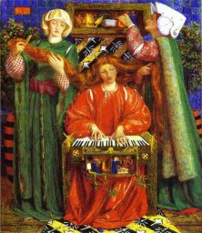

  
[Intangible Textual Heritage](../../index)  [Time](../index) 

------------------------------------------------------------------------

<table width="75%">
<colgroup>
<col style="width: 50%" />
<col style="width: 50%" />
</colgroup>
<tbody>
<tr class="odd">
<td width="50%" data-valign="TOP"></td>
<td width="50%" data-valign="CENTER"><h1 id="fifty-christmas-poems-for-children" data-align="CENTER">Fifty Christmas Poems for Children</h1>
<h2 id="by-florence-b.-hyett" data-align="CENTER">by Florence B. Hyett</h2>
<h4 id="section" data-align="CENTER">[1923]</h4></td>
</tr>
</tbody>
</table>

------------------------------------------------------------------------

[Contents](#contents)    [Start Reading](50x00)

------------------------------------------------------------------------

 [Title Page](50x00)  
[Index of Authors And Bibliography](50x01)  
[Old Carol](50x02)  
[The Lamb Child](50x03)  
[Christmas Day And Every Day](50x04)  
[The Christmas Child](50x05)  
[The Lamb](50x06)  
[Song](50x07)  
[The Holly](50x08)  
[Carol](50x09)  
[Shepherd's Song](50x10)  
[Verses From “The Cherry-Tree Carol”](50x11)  
[A Cradle Song](50x12)  
[The Birds](50x13)  
[Christmas Eve](50x14)  
[A Christmas Prayer](50x15)  
[Three Christmas Songs](50x16)  
[Cradle Hymn](50x17)  
[A Song For The Season](50x18)  
[In The Night](50x19)  
[“Mary Had a Little Lamb”](50x20)  
[Bethlehem](50x21)  
[Waiting For The Kings](50x22)  
[Behold A Silly Tender Babe](50x23)  
[A Christmas Carol](50x24)  
[Ex Ore Infantium](50x25)  
[A Song of Christmas](50x26)  
[The Holly And The Ivy](50x27)  
[A Cradle Hymn](50x28)  
[Before Dawn](50x29)  
[The Waits](50x30)  
[In Praesepio](50x31)  
[When Christ Was Born](50x32)  
[The Carol of the Poor Children](50x33)  
[Star of the East](50x34)  
[A Christmas Carol](50x35)  
[Yule-Tide Fires](50x36)  
[Six Green Singers](50x37)  
[That Holy Thing](50x38)  
[Christmas](50x39)  
[To His Saviour, A Child; A Present By A Child](50x40)  
[An Ode to the Birth of Our Saviour](50x41)  
[A Christmas Carol](50x42)  
[The Oxen](50x43)  
[I Saw Three Ships](50x44)  
[Noel](50x45)  
[Unto Us a Son Is Given](50x46)  
[Verses From the Shepherd's Hymn](50x47)  
[Verses From the Hymn on the Morning of Christ's Nativity](50x48)  
[From “In Memoriam”](50x49)  
