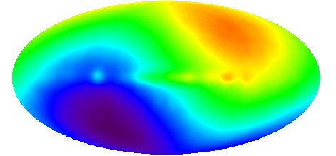

------------------------------------------------------------------------

  

[Sacred Time Index](../index)  [Judaism](../../jud/index) 
[Islam](../../isl/index)  [Esoteric](../../eso/index) 
[Wicca/Neo-Paganism](../../pag/index)  [Book of
Shadows](../../bos/index) 

------------------------------------------------------------------------

|                                                            |                                                          |
|------------------------------------------------------------|----------------------------------------------------------|
|  | Sacred Calendar Systems |

 

This section of sacred texts contains information about calendrical
systems and related data which have significance for religion and
esoteric beliefs.

About the Image: this is a map of cosmic background radiation, the
leftovers from the big bang, the zero-time point of our universe. The
yin-yang image is actually a doppler-effect artifact of the motion of
our galaxy projected into an elliptical sky map, which doesn't lessen
its sense of wonder. An image adjusted for the doppler effect can be
viewed [here](../cosmic.jpg).

------------------------------------------------------------------------

[Positions of the Planets](astro)  
[Phase of the Moon](pom)  
[Islamic Date](isldate)  
[Jewish Date](jdate)  
[Mayan Calendar](mayacal)  
