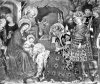

  
[Intangible Textual Heritage](../../index)  [Time](../index) 
[Index](index)  [Next](crt01) 

------------------------------------------------------------------------

[Buy this Book at
Amazon.com](https://www.amazon.com/exec/obidos/ASIN/0486233545/internetsacredte)

------------------------------------------------------------------------

*Christmas in Ritual and Tradition*, by Clement A. Miles, \[1912\], at
Intangible Textual Heritage

------------------------------------------------------------------------

#  Christmas In Ritual and Tradition,

# Christian and Pagan 

### by Clement A. Miles 

### Published by T. Fisher Unwin 1912

[  
Click to enlarge](img/image01.jpg)  
  

THE ADORATION OF THE MAGI (DETAIL).

GENTILE DA FABRIANO

(*Florence: Accademia*)

p. 5 

------------------------------------------------------------------------

------------------------------------------------------------------------

[Next: Preface](crt01)
