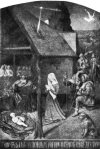
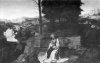

  
[Intangible Textual Heritage](../../index)  [Time](../index.md) 
[Index](index)  [Previous](crt05)  [Next](crt07.md) 

------------------------------------------------------------------------

[Buy this Book at
Amazon.com](https://www.amazon.com/exec/obidos/ASIN/0486233545/internetsacredte.md)

------------------------------------------------------------------------

*Christmas in Ritual and Tradition*, by Clement A. Miles, \[1912\], at
Intangible Textual Heritage

------------------------------------------------------------------------

## CHAPTER III

## CHRISTMAS POETRY (II)

> The French *Noël*—Latin Hymnody in Eighteenth-century France—Spanish
> Christmas Verse—Traditional Carols of Many Countries—Christmas
> Poetry in Protestant Germany—Post-Reformation Verse in
> England—Modern English Carols.

[  
Click to enlarge](img/image05.jpg.md)  
  

THE ADORATION OF THE SHEPHERDS.

*By Fouquet.*

(Musée Condé, Chantilly.)

The Reformation marks a change in the character of Christmas poetry in
England and the larger part of Germany, and, instead of following its
development under Protestantism, it will be well to break off and turn
awhile to countries where Catholic tradition remained unbroken. We shall
come back later to Post-Reformation England and Protestant Germany.

In French [3-1](crt22.htm#Note_3-1.md) there
is little or no Christmas poetry, religious in character, before the
fifteenth century; the earlier carols that have come down to us are
songs rather of feasting and worldly rejoicing than of sacred things.
The true *Noël* begins to appear in fifteenth-century manuscripts, but
it was not till the following century that it attained its fullest vogue
and was spread all over the country by the printing presses. Such
*Noëls* seem to have been written by clerks or recognized poets, either
for old airs or for specially composed music. “To a great extent,” says
Mr. Gregory Smith, “they anticipate the spirit which stimulated the
Reformers to turn the popular and often obscene songs into good and
godly ballads.” [3-2](crt22.htm#Note_3-2.md)

Some of the early *Noëls* are not unlike the English carols of the
period, and are often half in Latin, half in French. Here are a few such
“macaronic” verses:—

“Célébrons la naissance  
*Nostri Salvatoris*,p.
56   
Qui fait la complaisance  
*Dei sui Patris*.  
Cet enfant tout aimable,  
*In nocte mediâ*,  
Est né dans une étable,  
*De castâ Mariâ*.  

\*       \*       \*       \*       \*  

Mille esprits angéliques,  
*Juncti pastoribus*,  
Chantent dans leur musique,  
*Puer vobis natus*,  
Au Dieu par qui nous sommes,  
*Gloria in excelsis*,  
Et la paix soit aux hommes  
*Bonae voluntatis*.  

\*       \*       \*       \*       \*  

Qu'on ne soit insensible!  
*Adeamus omnes*  
A Dieu rendu passible,  
*Propter nos mortales*,  
Et tous, de compagnie,  
*Deprecemur eum*  
Qu’à la fin de la vie,  
*Det regnum beatum*.” [3-3](crt22.htm#Note_3-3.md)   

The sixteenth century is the most interesting *Noël* period; we find
then a conflict of tendencies, a conflict between Gallic realism and
broad humour and the love of refined language due to the study of the
ancient classics. There are many anonymous pieces of this time, but
three important *Noëlistes* stand out by name: Lucas le Moigne, Curé of
Saint Georges, Puy-la-Garde, near Poitiers; Jean Daniel, called “Maître
Mitou,” a priest-organist at Nantes; and Nicholas Denisot of Le Mans,
whose *Noëls* appeared posthumously under the pseudonym of “Comte
d'Alsinoys.”

Lucas le Moigne represents the *esprit gaulois*, the spirit that is
often called “Rabelaisian,” though it is only one side of the genius of
Rabelais. The good Curé was a contemporary of p.
57 the author of “Pantagruel.” His
“Chansons de Noëls nouvaulx” was published in 1520, and contains carols
in very varied styles, some naïve and pious, others hardly quotable at
the present day. One of his best-known pieces is a dialogue between the
Virgin and the singers of the carol: Mary is asked and answers questions
about the wondrous happenings of her life. Here are four verses about
the Nativity:—

“Or nous dites, Marie,  
Les neuf mois accomplis,  
Naquit le fruit de vie,  
Comme l'Ange avoit dit?  
—Oui, sans nulle peine  
Et sans oppression,  
Naquit de tout le monde  
La vraie Rédemption.  

Or nous dites, Marie,  
Du lieu impérial,  
Fut-ce en chambre parée,  
Ou en Palais royal?  
—En une pauvre étable  
Ouverte à l'environ  
Ou n'avait feu, ni flambe  
Ni latte, ni chevron.  

Or nous dites, Marie,  
Qui vous vint visiter;  
Les bourgeois de la ville  
Vous ont-ils confortée?  
—Oncque, homme ni femme  
N'en eut compassion,  
Non plus que d'un esclave  
D’étrange région.  

\*       \*       \*       \*       \*  

Or nous dites, Marie,  
Des pauvres pastoureaux  
Qui gardaient ès montagnes  
Leurs brebis & aigneaux.p.
58   
—Ceux-là m'ont visitée  
Par grande affection;  
Moult me fut agréable  
Leur visitation.” [3-4](crt22.htm#Note_3-4.md)   

The influence of the “Pléiade,” with its care for form, its respect for
classical models, its enrichment of the French tongue with new Latin
words, is shown by Jean Daniel, who also owes something to the poets of
the late fifteenth century. Two stanzas may be quoted from him:—

“C'est ung très grant mystère  
Qu'ung roy de si hault pris  
Vient naistre en lieu austère,  
En si meschant pourpris:  
Le Roy de tous les bons espritz,  
C'est Jésus nostre frère,  
Le Roy de tous les bons espritz,  
Duquel sommes apris.  

Saluons le doulx Jésuchrist,  
Notre Dieu, notre frère,  
Saluons le doulx Jésuchrist,  
Chantons Noel d'esprit!  

\*       \*       \*       \*       \*  

En luy faisant prière,  
Soyons de son party,  
Qu'en sa haulte emperière  
Ayons lieu de party;  
Comme il nous a droict apparty,  
Jésus nostre bon frère,  
Comme il nous a droict apparty  
Au céleste convy.  
Saluons, etc.  
Amen. Noel.” [3-5](crt22.htm#Note_3-5.md)   

As for Denisot, I may give two charming verses from one of his
pastorals:—

“Suz, Bergiez, en campaigne,  
Laissez là vos troppeaux,p.
59   
Avant qu'on s'accompaigne,  
Enflez vos chalumeaux.  

\*       \*       \*       \*       \*  

Enflez vos cornemuses,  
Dansez ensemblement,  
Et vos doucettes muses,  
Accollez doucement.” [3-6](crt22.htm#Note_3-6.md)   

One result of the Italian influences which came over France in the
sixteenth century was a fondness for diminutives. Introduced into
carols, these have sometimes a very graceful effect:—

“Entre le boeuf & le bouvet,  
Noel nouvellet,  
Voulust Jésus nostre maistre,  
En un petit hostelet,  
Noel nouvellet,  
En ce pauvre monde naistre,  
O Noel nouvellet!  

Ne couche, ne bercelet,  
Noel nouvellet,  
Ne trouvèrent en cette estre,  
Fors ung petit drappelet,  
Noel nouvellet,  
Pour envelopper le maistre,  
O Noel nouvellet!” [3-7](crt22.htm#Note_3-7.md)   

These diminutives are found again, though fewer, in a particularly
delightful carol:—

“Laissez paître vos bestes  
Pastoureaux, par monts et par vaux;  
Laissez paître vos bestes,  
Et allons chanter Nau.  

J'ai ouï chanter le rossignol,  
Qui chantoit un chant si nouveau,  
Si haut, si beau,  
Si résonneau,p. 60   

Il m'y rompoit la tête,  
Tant il chantoit et flageoloit:  
Adonc pris ma houlette  
Pour aller voir Naulet.  
Laissez paître, etc.” [3-8](crt22.htm#Note_3-8.md)   

The singer goes on to tell how he went with his fellow-shepherds and
shepherdesses to Bethlehem:—

“Nous dîmes tous une chanson  
Les autres en vinrent au son,  
Chacun prenant  
Son compagnon:  
Je prendrai Guillemette,  
Margot tu prendras gros Guillot;  
Qui prendra Péronelle?  
Ce sera Talebot.  
Laissez paître, etc.  

Ne chantons plus, nous tardons trop,  
Pensons d'aller courir le trot.  
Viens-tu, Margot?—  
J'attends Guillot.—  
J'ai rompu ma courette,  
Il faut ramancher mon sabot.—  
Or, tiens cette aiguillette,  
Elle y servira trop.  
Laissez paître, etc.  

\*       \*       \*       \*       \*  

Nous courumes de grand’ roideur  
Pour voir notre doux Rédempteur  
Et Créateur  
Et Formateur,  
Qui était tendre d'aage  
Et sans linceux en grand besoin,  
Il gisait en la crêche  
Sur un botteau de foin.  
Laissez paître, etc.p.
61   

Sa mère avecque lui était:  
Et Joseph si lui éclairait,  
Point ne semblait  
Au beau fillet,  
Il n’était point son père;  
Je l'aperçus bien au cameau (*visage*)  
Il semblait à sa mère,  
Encore est-il plus beau.  
Laissez paître, etc.”  

This is but one of a large class of French *Noëls* which make the
Nativity more real, more present, by representing the singer as one of a
company of worshippers going to adore the Child. Often these are
shepherds, but sometimes they are simply the inhabitants of a parish, a
town, a countryside, or a province, bearing presents of their own
produce to the little Jesus and His parents. Barrels of wine, fish,
fowls, sucking-pigs, pastry, milk, fruit, firewood, birds in a
cage—such are their homely gifts. Often there is a strongly satiric
note: the peculiarities and weaknesses of individuals are hit off; the
reputation of a place is suggested, a village whose people are famous
for their stinginess offers cider that is half rain-water; elsewhere the
inhabitants are so given to law-suits that they can hardly find time to
go to Bethlehem.

Such *Noëls* with their vivid local colour, are valuable pictures of the
manners of their time. They are, unfortunately, too long for quotation
here, but any reader who cares to follow up the subject will find some
interesting specimens in a little collection of French carols that can
be bought for ten *centimes*. [3-9](crt22.htm#Note_3-9.md) They are of various dates; some probably were
written as late as the eighteenth century. In that century, and indeed
in the seventeenth, the best Christmas verses are those of a provincial
and rustic character, and especially those in *patois*; the more
cultivated poets, with their formal classicism, can ill enter into the
spirit of the festival. Of the learned writers the best is a woman,
Françoise Paschal, of Lyons (b. about 1610); in spite of her Latinity
she shows a real feeling for her subjects. Some of her *Noëls* are
dialogues between the sacred personages; one presents p. 62 Joseph and Mary as
weary wayfarers seeking shelter at all the inns of Bethlehem and
everywhere refused by host or hostess:—

“*Saint Joseph.*  

Voyons la *Rose-Rouge*.  
Madame de céans,  
Auriez-vous quelque bouge  
Pour de petites gens?  

*L'Hôtesse.*  

Vous n'avez pas la mine  
D'avoir de grands trésors;  
Voyez chez ma voisine,  
Car, quant à moi, je dors.  

*Saint Joseph.*  

Monsieur des *Trois-Couronnes*,  
Avez-vous logement,  
Chez vous pour trois personnes,  
Quelque trou seulement.  

*L'Hôte.*  

Vous perdez votre peine,  
Vous venez un peu tard,  
Ma maison est fort pleine,  
Allez quelqu'autre
part.” [3-10](crt22.htm#Note_3-10.md)
  

The most remarkable of the *patois Noëlistes* of the seventeenth century
are the Provençal Saboly and the Burgundian La Monnoye, the one kindly
and tender, the other witty and sarcastic. Here is one of Saboly's
Provençal *Noëls*:—

“Quand la mièjonue sounavo,  
Ai sautà dóu liech au sòu;  
Ai vist un bèl ange que cantavo  
Milo fes pu dous qu'un roussignòu.  

Lei mastin dóu vesinage  
Se soun toutes atroupa;p.
63   
N'avien jamai vist aquéu visage  
Se soun tout-d'un-cop mes à japa.  

Lei pastre dessus la paio  
Dourmien coume de soucas;  
Quand an aussi lou bru dei sounaio  
Au cresegu qu'ero lou souiras.  

S'eron de gent resounable,  
Vendrien sèns èstre envita:  
Trouvarien dins un petit estable  
La lumiero emai la
verita.” [24](crt24.htm#Footnote_24.md) [3-11](crt22.htm#Note_3-11.md)   

As for La Monnoye, here is a translation of one of his satirical
verses:—“When in the time of frost Jesus Christ came into the world the
ass and ox warmed Him with their breath in the stable. How many asses
and oxen I know in this kingdom of Gaul! How many asses and oxen I know
who would not have done as much!” [3-12](crt22.htm#Note_3-12.md)

Apart from the rustic *Noëls*, the eighteenth century produced little
French Christmas poetry of any charm. Some of the carols most sung in
French churches to-day belong, however, to this period, *e.g.*, the
“Venez, divin Messie” of the Abbé
Pellegrin. [3-13](crt22.htm#Note_3-13.md)

One cannot leave the France of the seventeenth and eighteenth centuries
without some mention of its Latin hymnody. From a date near 1700,
apparently, comes the sweet and solemn “Adeste, fideles”; by its music
and its rhythm, perhaps, rather than by its actual words it has become
the best beloved of Christmas hymns. The present writer has heard it
sung with equal reverence and heartiness in English, German, French, and
Italian churches, and no other hymn seems so full of the spirit of
Christmas devotion—wonder, p. 64 awe, and tenderness, and the sense of reconciliation
between Heaven and earth. Composed probably in France, “Adeste, fideles”
came to be used in English as well as French Roman Catholic churches
during the eighteenth century. In 1797 it was sung at the chapel of the
Portuguese Embassy in London; hence no doubt its once common name of
“Portuguese hymn.” It was first used in an Anglican church in 1841, when
the Tractarian Oakley translated it for his congregation at Margaret
Street Chapel, London.

Another fine Latin hymn of the eighteenth-century French Church is
Charles Coffin's “Jam desinant
suspiria.” [3-14](crt22.htm#Note_3-14.md)
It appeared in the Parisian Breviary in 1736, and is well known in
English as “God from on high hath heard.”

The Revolution and the decay of Catholicism in France seem to have
killed the production of popular carols. The later nineteenth century,
however, saw a revival of interest in the *Noël* as a literary form. In
1875 the bicentenary of Saboly's death was celebrated by a competition
for a *Noël* in the Provençal tongue, and something of the same kind has
been done in Brittany. [3-15](crt22.htm#Note_3-15.md) The *Noël* has attracted by its aesthetic
charm even poets who are anything but devout; Théophile Gautier, for
instance, wrote a graceful Christmas carol, “Le ciel est noir, la terre
est blanche.”

On a general view of the vernacular Christmas poetry of France it must
be admitted that the devotional note is not very strong; there is indeed
a formal reverence, a courtly homage, paid to the Infant Saviour, and
the miraculous in the Gospel story is taken for granted; but there is
little sense of awe and mystery. In harmony with the realistic instincts
of the nation, everything is dramatically, very humanly conceived; at
times, indeed, the personages of the Nativity scenes quite lose their
sacred character, and the treatment degenerates into grossness. At its
best, however, the French *Noël* has a gaiety and a grace, joined to a
genuine, if not very deep, piety, that are extremely charming. Reading
these rustic songs, we are carried in imagination to French
countrysides; we think of the long walk through the snow to the Midnight
Mass, the cheerful *réveillon* spread on the p.
65 return, the family gathered round
the hearth, feasting on wine and chestnuts and *boudins*, and singing in
traditional strains the joys of *Noël*.

Across the Pyrenees, in Spain, the late sixteenth and early seventeenth
centuries saw a great output of Christmas verse. Among the chief writers
were Juan López de Ubeda, Francisco de Ocaña, and José de
Valdivielso. [3-16](crt22.htm#Note_3-16.md)
Their *villancicos* remind one of the paintings of Murillo; they have
the same facility, the same tender and graceful sentiment, without much
depth. They lack the homely flavour, the quaintness that make the French
and German folk-carols so delightful; they have not the rustic tang, and
yet they charm by their simplicity and sweetness.

Here are a few stanzas by Ocaña:—

“Dentro de un pobre pesebre  
y cobijado con heno  
yace Jesus Nazareno.  

En el heno yace echado  
el hijo de Dios eterno,  
para librar del infierno  
al hombre que hubo criado,  
y por matar el pecado  
el heno tiene por bueno  
nuestro Jesus Nazareno.  

Está entre dos animales  
que le calientan del frio,  
quien remedia nuestros males  
con su grande poderío:  
es su reino y señorío  
el mundo y el cielo sereno,  
y agora duerme en el heno.  

Tiene por bueno sufrir  
el frio y tanta fortuna,  
sin tener ropa ninguna  
con que se abrigar ni cubrir,p.
66   
y por darnos el vivir  
padeció frio en el heno,  
nuestro Jesus
Nazareno.” [25](crt24.htm#Footnote_25.md) [3-17](crt22.htm#Note_3-17.md)   

More of a peasant flavour is found in some snatches of Christmas carols
given by Fernan Caballero in her sketch, “La Noche de Navidad.”

“Ha nacido en un portal,  
Llenito de telarañas,  
Entre la mula y el buey  
El Redentor de las almas.  

\*       \*       \*       \*       \*  

En el portal de Belen  
Hay estrella, sol y luna:  
La Virgen y San José  
Y el niño que está en la cuna.  

En Belen tocan á fuego,  
Del portal sale la llama,  
Es una estrella del cielo,  
Que ha caido entre la paja.  

Yo soy un pobre gitano  
Que vengo de Egipto aquí,  
Y al niño de Dios le traigo  
Un gallo quiquiriquí  

Yo soy un pobre gallego  
Que vengo de la Galicia,  
Y al niño de Dios le traigo  
Lienzo para una camisa.p.
67   

Al niño recien nacido  
Todos le traen un don;  
Yo soy chico y nada tengo;  
Le traigo mi
corazon.” [26](crt24.htm#Footnote_26.md) [3-18](crt22.htm#Note_3-18.md)   

In nearly every western language one finds traditional Christmas carols.
Europe is everywhere alive with them; they spring up like wild flowers.
Some interesting Italian specimens are given by Signor de Gubernatis in
his “Usi Natalizi.” Here are a few stanzas from a Bergamesque
cradle-song of the Blessed Virgin:—

“Dormi, dormi, o bel bambin,  
Re divin.  
Dormi, dormi, o fantolin.  
Fa la nanna, o caro figlio,  
Re del Ciel,  
Tanto bel, grazioso giglio.  

Chiüdi i lümi, o mio tesor,  
Dolce amor,  
Di quest’ alma, almo Signor;  
Fa la nanna, o regio infante,  
Sopra il fien,  
Caro ben, celeste amante.  

Perchè piangi, o bambinell,  
Forse il giel  
Ti dà noia, o l'asinell?  
Fa la nanna, o paradiso  
Del mio cor,  
Redentor, ti bacio il
viso.” [27](crt24.htm#Footnote_27.md) [3-19](crt22.htm#Note_3-19.md)   

p. 68 With this
lullaby may be compared a singularly lovely and quite untranslatable
Latin cradle-song of unknown origin:—

“Dormi, fili, dormi! mater  
Cantat unigenito:  
Dormi, puer, dormi! pater,  
Nato clamat parvulo:  
Millies tibi laudes canimus  
Mille, mille, millies.  

Lectum stravi tibi soli,  
Dormi, nate bellule!  
Stravi lectum foeno molli:  
Dormi, mi animule.  
Millies tibi laudes canimus  
Mille, mille, millies.  

Ne quid desit, sternam rosis,  
Sternam foenum violis,  
Pavimentum hyacinthis  
Et praesepe liliis.  
Millies tibi laudes canimus  
Mille, mille, millies.p.
69   

Si vis musicam, pastores  
Convocabo protinus;  
Illis nulli sunt priores;  
Nemo canit castius.  
Millies tibi laudes canimus  
Mille, mille,
millies.” [3-21](crt22.htm#Note_3-21.md)
  

Curious little poems are found in Latin and other languages, making a
dialogue of the cries of animals at the news of Christ's
birth. [3-22](crt22.htm#Note_3-22.md) The
following French example is fairly typical:—

“Comme les bestes autrefois  
Parloient mieux latin que françois,  
Le coq, de loin voyant le fait,  
S’écria: *Christus natus est.*  
Le bœuf, d'un air tout ébaubi,  
Demande: *Ubi? Ubi? Ubi?*  
La chèvre, se tordant le groin,  
Répond que c'est à *Béthléem*.  
Maistre Baudet, *curiosus*  
De l'aller voir, dit: *Eamus*;  
Et, droit sur ses pattes, le veau  
Beugle deux fois: *Volo,
Volo!* ” [28](crt24.htm#Footnote_28.md) [3-23](crt22.htm#Note_3-23.md)   

In Wales, in the early nineteenth century, carol-singing was more
popular, perhaps, than in England; the carols were sung to the harp, in
church at the *Plygain* or early morning service on Christmas Day, in
the homes of the people, and at the doors of the houses by
visitors. [3-24](crt22.htm#Note_3-24.md) In
Ireland, too, the custom of carol-singing then
prevailed. [3-25](crt22.htm#Note_3-25.md)
Dr. Douglas Hyde, in his “Religious Songs of Connacht,” gives and
translates an interesting Christmas hymn in Irish, from which two verses
may be quoted. They set forth the great paradox of the Incarnation:—

“Little babe who art so great,  
Child so young who art so old,p.
70   
In the manger small his room,  
Whom not heaven itself could hold.  

Father—not more old than thou?  
Mother—younger, can it be?  
Older, younger is the Son,  
Younger, older, she than
he.” [3-27](crt22.htm#Note_3-27.md)
  

Even in dour Scotland, with its hatred of religious festivals, some kind
of carolling survived here and there among Highland folk, and a
remarkable and very “Celtic” Christmas song has been translated from the
Gaelic by Mr. J. A. Campbell. It begins:—

“Sing hey the Gift, sing ho the Gift,  
Sing hey the Gift of the Living,  
Son of the Dawn, Son of the Star,  
Son of the Planet, Son of the Far \[twice\],  
Sing hey the Gift, sing ho the
Gift.” [3-28](crt22.htm#Note_3-28.md)
  

[  
Click to enlarge](img/image06.jpg.md)  
  

THE FLIGHT INTO EGYPT: THE REST BY THE WAY

MASTER OF THE SEVEN SORROWS OF MARY

(ALSO ATTRIBUTED TO JOACHIM PATINIR)

(*Vienna: Imperial Gallery*)

[  
Click to enlarge](img/image07.jpg.md)  
  

SINGING “VOM HIMMEL HOCH” FROM A CHURCH TOWER AT CHRISTMAS.

*By Ludwig Richter.*

Before I close this study with a survey of Christmas poetry in England
after the Reformation, it may be interesting to follow the developments
in Protestant Germany. The Reformation gave a great impetus to German
religious song, and we owe to it some of the finest of Christmas hymns.
It is no doubt largely due to Luther, that passionate lover of music and
folk-poetry, that hymns have practically become the liturgy of German
Protestantism; yet he did but give typical expression to the natural
instincts of his countrymen for song. Luther, though a rebel, was no
Puritan; we can hardly call him an iconoclast; he had a conservative
mind, which only gradually became loosened from its old attachments. His
was an essentially artistic nature: “I would fain,” he said, “see all
arts, especially music, in the service of Him who has given and created
them,” and in the matter of hymnody he continued, in many respects, the
mediaeval German tradition. Homely, kindly, a lover of children, he had
a deep feeling for the festival of Christmas; and not only did he
translate into German “A solis ortus cardine” and “Veni, redemptor p. 71 gentium,” but he
wrote for his little son Hans one of the most delightful and touching of
all Christmas hymns—“Vom Himmel hoch, da komm ich her.”

“Vom Himmel hoch, da komm ich her,  
Ich bring euch gute neue Mär,  
Der guten Mär bring ich so viel,  
Davon ich singen und sagen will.  

Euch ist ein Kindlein heut gebor'n  
Von einer Jungfrau auserkor'n,  
Ein Kindelein so zart und fein,  
Das soll eu'r Freud und Wonne sein.  

\*       \*       \*       \*       \*  

Merk auf, mein Herz, und sich dort hin:  
Was liegt doch in dem Kripplein drin?  
Wess ist das schöne Kindelein?  
Es ist das liebe Jesulein.  

\*       \*       \*       \*       \*  

Ach Herr, du Schöpfer aller Ding,  
Wie bist du worden so gering,  
Dass du da liegst auf dürrem Gras,  
Davon ein Rind und Esel ass?  

\*       \*       \*       \*       \*  

Ach, mein herzliebes Jesulein,  
Mach dir ein rein sanft Bettelein,  
Zu ruhen in mein's Herzens Schrein,  
Dass ich nimmer vergesse dein.  

\*       \*       \*       \*       \*  

Davon ich allzeit fröhlich sei,  
Zu springen, singen immer frei  
Das rechte Lied dem Gottessohn  
Mit Herzenslust, den süssen
Ton.” [29](crt24.htm#Footnote_29.md) [3-29](crt22.htm#Note_3-29.md)   

p. 72 “Vom Himmel
hoch” has qualities of simplicity, directness, and warm human feeling
which link it to the less ornate forms of carol literature. Its first
verse is adapted from a secular song; its melody may, perhaps, have been
composed by Luther himself. There is another Christmas hymn of Luther's,
too—“Vom Himmel kam der Engel Schar”—written for use when “Vom Himmel
hoch” was thought too long, and he also composed additional verses for
the mediaeval “Gelobet seist du, Jesu Christ.”

“Gelobet seist du, Jesu Christ,  
Dass du Mensch geboren bist  
Von einer Jungfrau, das ist wahr,  
Des freuet sich der Engel Schar.  
*Kyrieleis!*  

Des ew'gen Vaters einig Kind  
Jetzt man in der Krippe find't,  
In unser armes Fleisch und Blut  
Verkleidet sich das ewig Gut.  
*Kyrieleis!*p. 73   

Den aller Weltkreis nie beschloss,  
Der lieget in Marie'n Schoss;  
Er ist ein Kindlein worden klein,  
Der alle Ding’ erhält allein.  
*Kyrieleis!* ” [30](crt24.htm#Footnote_30.md) [3-31](crt22.htm#Note_3-31.md)   

The first stanza alone is mediaeval, the remaining six of the hymn are
Luther's.

The Christmas hymns of Paul Gerhardt, the seventeenth-century Berlin
pastor, stand next to Luther's. They are more subjective, more finished,
less direct and forcible. Lacking the finest qualities of poetry, they
are nevertheless impressive by their dignity and heartiness. Made for
music, the words alone hardly convey the full power of these hymns. They
should be heard sung to the old chorales, massive, yet sweet, by the
lusty voices of a German congregation. To English people they are
probably best known through the verses introduced into the “Christmas
Oratorio,” where the old airs are given new beauty by Bach's marvellous
harmonies. The tone of devotion, one feels, in Gerhardt and Bach is the
same, immeasurably greater as is the genius of the composer; in both
there is a profound joy in the Redemption begun by the Nativity, a
robust faith joined to a deep sense of the mystery of suffering, and a
keen sympathy with childhood, a tender fondness for the Infant King.

p. 74 The finest
perhaps of Gerhardt's hymns is the Advent “Wie soll ich dich empfangen?”
(“How shall I fitly meet Thee?”), which comes early in the “Christmas
Oratorio.” More closely connected with the Nativity, however, are the
*Weihnachtslieder*, “Wir singen dir, Emanuel,” “O Jesu Christ, dein
Kripplein ist,” “Fröhlich soll mein Herze springen,” “Ich steh an deiner
Krippen hier,” and others. I give a few verses from the third:—

“Fröhlich soll mein Herze springen  
Dieser Zeit,  
Da für Freud  
Alle Engel singen.  
Hört, hört, wie mit vollen Choren  
Alle Luft  
Laute ruft:  
Christus ist geboren.  

\*       \*       \*       \*       \*  

Nun, er liegt in seiner Krippen,  
Ruft zu sich  
Mich und dich,  
Spricht mit süssen Lippen:  
Lasset fahrn, O lieben Brüder  
Was euch quält,  
Was euch fehlt;  
Ich bring alles wieder.  

\*       \*       \*       \*       \*  

Süsses Heil, lass dich umfangen;  
Lass mich dir,  
Meine Zier,  
Unverrückt anhangen.  
Du bist meines Lebens Leben;  
Nun kann ich  
Mich durch dich  
Wohl zufrieden
geben.” [31](crt24.htm#Footnote_31.md) [3-33](crt22.htm#Note_3-33.md)   

p. 75 One more
German Christmas hymn must be mentioned, Gerhard Tersteegen's “Jauchzet,
ihr Himmel, frohlocket, ihr englischen Chöre.” Tersteegen represents one
phase of the mystical and emotional reaction against the religious
formalism and indifference of the eighteenth century. In the Lutheran
Church the Pietists, though they never seceded, somewhat resembled the
English Methodists; the Moravians formed a separate community, while
from the “Reformed” or Calvinistic Church certain circles of
spiritually-minded people, who drew inspiration from the mediaeval
mystics and later writers like Böhme and Madame Guyon, gathered into
more or less independent groups for religious intercourse. Of these last
Tersteegen is a representative singer. Here are three verses from his
best known Christmas hymn:—

“Jauchzet, ihr Himmel, frohlocket, ihr englischen
Chöre,  
Singet dem Herrn, dem Heiland der Menschen, zur
Ehre:  
Sehet doch da!  
Gott will so freundlich und nah  
Zu den Verlornen sich kehren.p.
76   

König der Ehren, aus Liebe geworden zum Kinde,  
Dem ich auch wieder mein Herz in der Liebe
verbinde;  
Du sollst es sein,  
Den ich erwähle allein,  
Ewig entsag’ ich der Sünde.  

Treuer Immanuel, werd’ auch in mir neu
geboren;  
Komm doch, mein Heiland, und lass mich nicht länger
verloren;  
Wohne in mir,  
Mach mich ganz eines mit dir,  
Den du zum Leben
erkoren.” [32](crt24.htm#Footnote_32.md) [3-35](crt22.htm#Note_3-35.md)   

The note of personal religion, as distinguished from theological
doctrine, is stronger in German Christmas poetry than in that of any
other nation—the birth of Christ in the individual soul, not merely the
redemption of man in general, is a central idea.

We come back at last to England. The great carol period is, as has
already been said, the fifteenth, and the first half of the sixteenth,
century; after the Reformation the English domestic Christmas largely
loses its religious colouring, and the best carols of the late sixteenth
and early seventeenth centuries are songs of p.
77 feasting and pagan ceremonies rather
than of the Holy Child and His Mother. There is no lack of fine
Christmas verse in the Elizabethan and early Stuart periods, but for the
most part it belongs to the oratory and the chamber rather than the
hall. The Nativity has become a subject for private contemplation, for
individual devotion, instead of, as in the later Middle Ages, a matter
for common jubilation, a wonder-story that really happened, in which,
all alike and all together, the serious and the frivolous could rejoice,
something that, with all its marvel, could be taken as a matter of
course, like the return of the seasons or the rising of the sun on the
just and on the unjust.

English Christmas poetry after the mid-sixteenth century is, then,
individual rather than communal in its spirit; it is also a thing less
of the people, more of the refined and cultivated few. The Puritanism
which so deeply affected English religion was abstract rather than
dramatic in its conception of Christianity, it was concerned less with
the events of the Saviour's life than with Redemption as a transaction
between God and man; St. Paul and the Old Testament rather than the
gospels were its inspiration. Moreover, the material was viewed not as
penetrated by and revealing the spiritual, but as sheer impediment
blocking out the vision of spiritual things. Hence the extremer Puritans
were completely out of touch with the sensuous poetry of Christmas, a
festival which, as we shall see, they actually suppressed when they came
into power.

The singing of sacred carols by country people continued, indeed, but
the creative artistic impulse was lost. True carols after the
Reformation tend to be doggerel, and no doubt many of the traditional
pieces printed in such collections as Bramley and
Stainer's [33](crt24.htm#Footnote_33.md) [3-37](crt22.htm#Note_3-37.md) are debased survivals from the Middle Ages, or
perhaps new words written for old tunes. Such carols as “God rest you
merry, gentlemen,” have unspeakably delightful airs, and the words charm
us moderns by their quaintness and rusticity, but they are far from the
exquisite loveliness of the mediaeval p.
78 things. Gleams of great beauty are,
however, sometimes found amid matter that in the process of transmission
has almost ceased to be poetry. Here, for instance, are five stanzas
from the traditional “Cherry-tree Carol”:—

“As Joseph was a-walking,  
He heard an angel sing:  
‘This night shall be born  
Our heavenly King.  

‘He neither shall be born  
In housen nor in hall,  
Nor in the place of Paradise,  
But in an ox's stall.  

‘He neither shall be clothed  
In purple nor in pall,  
But all in fair linen  
As wear babies all.  

‘He neither shall be rocked  
In silver nor in gold,  
But in a wooden cradle  
That rocks on the mould.  

‘He neither shall be christened  
In white wine nor red,  
But with fair spring water  
With which we were christened.’”  

The old carols sung by country folk have often not much to do with the
Nativity; they are sometimes rhymed lives of Christ or legends of the
Holy Childhood. Of the latter class the strangest is “The Bitter Withy,”
discovered in Herefordshire by Mr. Frank Sidgwick. It tells how the
little Jesus asked three lads to play with Him at ball. But they
refused:—

“’O we are lords’ and ladies’ sons,  
Born in bower or in hall;  
And you are but a poor maid's child,  
Born in an oxen's stall.’p.
79   

‘If I am but a poor maid's child,  
Born in an oxen's stall,  
I will let you know at the very latter end  
That I am above you all.’  

So he built him a bridge with the beams of the
sun,  
And over the sea went he,  
And after followed the three jolly jerdins,  
And drowned they were all three.  

Then Mary mild called home her child,  
And laid him across her knee,  
And with a handful of green withy twigs  
She gave him slashes three.  

‘O the withy, O the withy, O bitter withy  
That causes me to smart!  
O the withy shall be the very first tree  
That perishes at the heart.’”  

From these popular ballads, mediaeval memories in the rustic mind, we
must return to the devotional verse of the late sixteenth and early
seventeenth centuries. Two of the greatest poets of the Nativity, the
Roman priests Southwell and Crashaw, are deeply affected by the wave of
mysticism which passed over Europe in their time. Familiar as is
Southwell's “The Burning Babe,” few will be sorry to find it here:—

“As I in hoary winter's night  
Stood shivering in the snow,  
Surprised I was with sudden heat,  
Which made my heart to glow;  
And lifting up a fearful eye  
To view what fire was near,  
A pretty Babe all burning bright  
Did in the air appear;  
Who, scorchèd with excessive heat,  
Such floods of tears did shed,  
As though His floods should quench His flames  
Which with His tears were fed.p.
80   
‘Alas!’ quoth He, ‘but newly born,  
In fiery heats I fry,  
Yet none approach to warm their hearts  
Or feel my fire, but I!  
My faultless breast the furnace is,  
The fuel, wounding thorns;  
Love is the fire, and sighs the smoke,  
The ashes, shame and scorns;  
The fuel Justice layeth on,  
And Mercy blows the coals,  
The metal in this furnace wrought  
Are men's defilèd souls,  
For which, as now on fire I am,  
To work them to their good,  
So will I melt into a bath,  
To wash them in my blood.’  
With this he vanished out of sight,  
And swiftly shrunk away:  
And straight I callèd unto mind  
That it was Christmas
Day.” [3-38](crt22.htm#Note_3-38.md)
  

As for Crashaw,

“That the great angel-blinding light should
shrink  
His blaze to shine in a poor shepherd's eye,  
That the unmeasured God so low should sink  
As Pris'ner in a few poor rags to lie,  
That from His mother's breast He milk should
drink  
Who feeds with nectar heaven's fair family,  
That a vile manger His low bed should prove  
Who in a throne of stars thunders above:  

That He, whom the sun serves, should faintly
peep  
Through clouds of infant flesh; that He the
old  
Eternal Word should be a Child and weep,  
That He who made the fire should fear the
cold:  
That heaven's high majesty His court should
keep  
In a clay cottage, by each blast controll'd:  
That glory's self should serve our griefs and
fears,  
And free Eternity submit to
years—” [3-39](crt22.htm#Note_3-39.md)
  

such are the wondrous paradoxes celebrated in his glowing imagery. The
contrast of the winter snow with the burning p.
81 heat of Incarnate Love, of the
blinding light of Divinity with the night's darkness, indeed the whole
paradox of the Incarnation—Infinity in extremest limitation—is nowhere
realized with such intensity as by him. Yet, magnificent as are his best
lines, his verse sometimes becomes too like the seventeenth-century
Jesuit churches, with walls overladen with decoration, with great
languorous pictures and air heavy with incense; and then we long for the
dewy freshness of the early carols.

The representative Anglican poets of the seventeenth century, Herbert
and Vaughan, scarcely rise to their greatest heights in their treatment
of Christmas, but with them as with the Romanists it is the mystical
note that is dominant. Herbert sings:—

“O Thou, whose glorious, yet contracted,
light,  
Wrapt in night's mantle, stole into a manger;  
Since my dark soul and brutish is Thy right,  
To man, of all beasts, be not Thou a stranger.  

Furnish and deck my soul, that thou may'st
have  
A better lodging than a rack or
grave.” [3-40](crt22.htm#Note_3-40.md)
  

And Vaughan:—

“I would I had in my best part  
Fit rooms for Thee! or that my heart  
Were so clean as  
Thy manger was!  
But I am all filth, and obscene:  
Yet, if Thou wilt, Thou canst make clean.  

Sweet Jesu! will then. Let no more  
This leper haunt and soil thy door!  
Cure him, ease him,  
O release him!  
And let once more, by mystic birth,  
The Lord of life be born in
earth.” [3-41](crt22.htm#Note_3-41.md)
  

In Herrick—how different a country parson from Herbert!—we find a sort
of pagan piety towards the Divine Infant which, p.
82 though purely English in its
expression, makes us think of some French *Noëliste* or some present-day
Italian worshipper of the *Bambino*:—

“Instead of neat enclosures  
Of interwoven osiers,  
Instead of fragrant posies  
Of daffodils and roses,  
Thy cradle, kingly Stranger,  
As gospel tells,  
Was nothing else  
But here a homely manger.  

But we with silks not crewels,  
With sundry precious jewels,  
And lily work will dress Thee;  
And, as we dispossess Thee  
Of clouts, we'll make a chamber,  
Sweet Babe, for Thee,  
Of ivory,  
And plaster'd round with
amber.” [3-42](crt22.htm#Note_3-42.md)
  

Poems such as Herrick's to the Babe of Bethlehem reveal in their writers
a certain childlikeness, an *insouciance* without irreverence, the
spirit indeed of a child which turns to its God quite simply and
naturally, which makes Him after its own child-image, and sees Him as a
friend who can be pleased with trifles—almost, in fact, as a glorious
playmate. Such a nature has no intense feeling of sin, but can ask for
forgiveness and then forget; religion for it is rather an outward ritual
to be duly and gracefully performed than an inward transforming power.
Herrick is a strange exception among the Anglican singers of Christmas.

Milton's great Nativity hymn, with its wondrous blending of pastoral
simplicity and classical conceits, is too familiar for quotation here;
it may be suggested, however, that this work of the poet's youth is far
more Anglican than Puritan in its spirit.

Sweet and solemn Spenserian echoes are these verses from Giles
Fletcher's “Christ's Victory in Heaven”:—p.
83 

“Who can forget—never to be forgot—  
The time, that all the world in slumber lies,  
When, like the stars, the singing angels shot  
To earth, and heaven awakèd all his eyes  
To see another sun at midnight rise  
On earth? Was never sight of pareil fame,  
For God before man like Himself did frame,  
But God Himself now like a mortal man became.  

A Child He was, and had not learnt to speak,  
That with His word the world before did make;  
His mother's arms Him bore, He was so weak,  
That with one hand the vaults of heaven could
shake,  
See how small room my infant Lord doth take,  
Whom all the world is not enough to hold!  
Who of His years, or of His age hath told?  
Never such age so young, never a child so
old.” [3-43](crt22.htm#Note_3-43.md)
  

The old lullaby tradition is continued by Wither, though the infant in
the cradle is an ordinary human child, who is rocked to sleep with the
story of his Lord:—

“A little Infant once was He,  
And strength in weakness then was laid  
Upon His virgin-mother's knee,  
That power to thee might be conveyed.  
Sweet baby, then, forbear to weep;  
Be still, my babe; sweet baby, sleep.  

\*       \*       \*       \*       \*  

Within a manger lodged thy Lord,  
Where oxen lay and asses fed;  
Warm rooms we do to thee afford,  
An easy cradle or a bed.  
Sweet baby, then, forbear to weep;  
Be still, my babe; sweet baby,
sleep.” [3-44](crt22.htm#Note_3-44.md)
  

When we come to the eighteenth century we find, where we might least
expect it, among the moral verses of Dr. Watts, a charming cradle-song
conceived in just the same way:—p. 84 

“Hush, my dear, lie still and slumber,  
Holy angels guard thy bed!  
Heavenly blessings without number  
Gently falling on thy head.  

\*       \*       \*       \*       \*  

Soft and easy is thy cradle;  
Coarse and hard thy Saviour lay.  
When His birthplace was a stable,  
And His softest bed was hay.  

\*       \*       \*       \*       \*  

Lo He slumbers in His manger  
Where the hornèd oxen fed;  
—Peace, my darling, here's no danger;  
Here's no ox a-near thy
bed.” [3-45](crt22.htm#Note_3-45.md)
  

It is to the eighteenth century that the three most popular of English
Christmas hymns belong. Nahum Tate's “While shepherds watched their
flocks by night”—one of the very few hymns (apart from metrical psalms)
in common use in the Anglican Church before the nineteenth century—is a
bald and apparently artless paraphrase of St. Luke which, by some
accident, has attained dignity, and is aided greatly by the simple and
noble tune now attached to it. Charles Wesley's “Hark, the herald angels
sing,” or—as it should be—“Hark, how all the welkin rings,” is much
admired by some, but to the present writer seems a mere piece of
theological rhetoric. Byrom's “Christians, awake, salute the happy
morn,” has the stiffness and formality or its period, but it is not
without a certain quaintness and dignity. One could hardly expect fine
Christmas poetry of an age whose religion was on the one hand staid,
rational, unimaginative, and on the other “Evangelical” in the narrow
sense, finding its centre in the Atonement rather than the Incarnation.

The revived mediaevalism, religious and aesthetic, of the nineteenth
century, produced a number of Christmas carols. Some, like Swinburne's
“Three damsels in the queen's chamber,” with p.
85 its exquisite verbal music and
delightful colour, and William Morris's less successful “Masters, in
this hall,” and “Outlanders, whence come ye last?” are the work of
unbelievers and bear witness only to the aesthetic charm of the
Christmas story; but there are others, mostly from Roman or
Anglo-Catholic sources, of real religious
inspiration. [34](crt24.htm#Footnote_34.md)
The most spontaneous are Christina Rossetti's, whose haunting rhythms
and delicate feeling are shown at their best in her songs of the Christ
Child. More studied and self-conscious are the austere Christmas verses
of Lionel Johnson and the graceful carols of Professor Selwyn Image. In
one poem Mr. Image strikes a deeper and stronger note than elsewhere;
its solemn music takes us back to an earlier century:—

“Consider, O my soul, what morn is this!  
Whereon the eternal Lord of all things made,  
For us, poor mortals, and our endless bliss,  
Came down from heaven; and, in a manger laid,  
The first, rich, offerings of our ransom paid:  
Consider, O my soul, what morn is
this!” [3-46](crt22.htm#Note_3-46.md)
  

Not a few contemporary poets have given us Christmas carols or poems.
Among the freshest and most natural are those of Katharine Tynan, while
Mr. Gilbert Chesterton has written some Christmas lyrics full of colour
and vitality, and with a true mystical quality. Singing of Christmas,
Mr. Chesterton is at his best; he has instinctive sympathy with the
spirit of the festival, its human kindliness, its democracy, its
sacramentalism, its exaltation of the child:—

“The thatch of the roof was as golden  
Though dusty the straw was and old;  
The wind had a peal as of trumpets,  
Though blowing and barren and cold.p. 86   

The mother's hair was a glory,  
Though loosened and torn;  
For under the eaves in the gloaming  
A child was born.” [3-47](crt22.htm#Note_3-47.md)   

Thus opens a fine poem on the Nativity as symbolizing miracle of birth,
of childhood with its infinite possibilities, eternal renewal of faith
and hope.

p. 87 p. 88 p. 89 

------------------------------------------------------------------------

------------------------------------------------------------------------

[Next: Chapter IV. Christmas in Liturgy and Popular Devotion](crt07.md)
