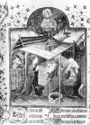
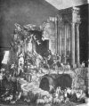
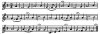
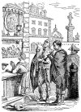
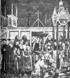
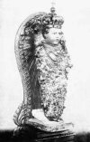

  
[Intangible Textual Heritage](../../index)  [Time](../index.md) 
[Index](index)  [Previous](crt06)  [Next](crt08.md) 

------------------------------------------------------------------------

[Buy this Book at
Amazon.com](https://www.amazon.com/exec/obidos/ASIN/0486233545/internetsacredte.md)

------------------------------------------------------------------------

*Christmas in Ritual and Tradition*, by Clement A. Miles, \[1912\], at
Intangible Textual Heritage

------------------------------------------------------------------------

## CHAPTER IV

## CHRISTMAS IN LITURGY AND POPULAR DEVOTION

> Advent and Christmas Offices of the Roman Church—The Three Masses of
> Christmas, their Origin and their Celebration in Rome—The Midnight
> Mass in Many Lands—Protestant Survivals of the Night
> Services—Christmas in the Greek Church—The Eastern Epiphany and the
> Blessing of the Waters—The *Presepio* or Crib, its Supposed
> Institution by St. Francis—Early Traces of the Crib—The Crib in
> Germany, Tyrol, &c.—Cradle-rocking in Mediaeval Germany—Christmas
> Minstrels in Italy and Sicily—The *Presepio* in Italy—Ceremonies
> with the *Culla* and the *Bambino* in Rome—Christmas in Italian
> London—The Spanish Christmas—Possible Survivals of the Crib in
> England.

[  
Click to enlarge](img/image08.jpg.md)  
  

THE NATIVITY.

From Add. MS. 32454 in the British Museum

(French, 15th century).

From a study of Christmas as reflected in lyric poetry, we now pass to
other forms of devotion in which the Church has welcomed the Redeemer at
His birth. These are of two kinds—liturgical and popular; and they
correspond in a large degree to the successive ways of apprehending the
meaning of Christmas which we traced in the foregoing chapters. Strictly
liturgical devotions are little understanded of the people: only the
clergy can fully join in them; for the mass of the lay folk they are
mysterious rites in an unknown tongue, to be followed with reverence, as
far as may be, but remote and little penetrated with humanity. Side by
side with these, however, are popular devotions, full of vivid colour,
highly anthropomorphic, bringing the mysteries of religion within the
reach of the simplest minds, and warm with human feeling. The austere
Latin hymns of the earlier centuries belong to liturgy; the vernacular
Christmas poetry of later ages is largely associated with popular
devotion.

p. 90 Liturgiology
is a vast and complicated, and except to the few, an unattractive,
subject. To attempt here a survey of the liturgies in their relation to
Christmas is obviously impossible; we must be content to dwell mainly
upon the present-day Roman offices, which, in spite of various
revisions, give some idea of the mediaeval services of Latin
Christianity, and to cast a few glances at other western rites, and at
those of the Greek Church.

Whatever may be his attitude towards Catholicism, or, indeed,
Christianity, no one sensitive to the music of words, or the suggestions
of poetic imagery, can read the Roman Breviary and Missal without
profound admiration for the amazing skill with which the noblest
passages of Hebrew poetry are chosen and fitted to the expression of
Christian devotion, and the gold of psalmists, prophets, and apostles is
welded into coronals for the Lord and His saints. The office-books of
the Roman Church are, in one aspect, the greatest of anthologies.

Few parts of the Roman Breviary have more beauty than the
Advent [35](crt24.htm#Footnote_35.md)
offices, where the Church has brought together the majestic imagery of
the Hebrew prophets, the fervent exhortation of the apostles, to prepare
the minds of the faithful for the coming of the Christ, for the
celebration of the Nativity.

Advent begins with a stirring call. If we turn to the opening service of
the Christian Year, the First Vespers of the First Sunday in Advent, we
shall find as the first words in the “Proper of the Season” the
trumpet-notes of St. Paul: “Brethren, it is high time to awake out of
sleep; for now is our salvation nearer than when we believed.” This, the
Little Chapter for the office, is followed by the ancient hymn, “Creator
alme siderum,” [4-1](crt22.htm#Note_4-1.md)
chanting in awful tones the two comings of p.
91 Christ, for redemption and for
judgment; and then are sung the words that strike the keynote of the
Advent services, and are heard again and again.

“*Rorate, coeli, desuper, et nubes pluant
Justum*  
(Drop down, ye heavens, from above, and let the skies
pour down the Righteous One).  
*Aperiatur terra et germinet Salvatorem*  
(Let the earth open, and let her bring forth the
Saviour).”  

*Rorate, coeli, desuper*—Advent is a time of longing expectancy. It is
a season of waiting patiently for the Lord, whose coming in great
humility is to be commemorated at Christmas, to whose coming again in
His glorious majesty to judge both the quick and the dead the Christian
looks forward with mingled hope and awe. There are four weeks in Advent,
and an ancient symbolical explanation interprets these as typifying four
comings of the Son of God: the first in the flesh, the second in the
hearts of the faithful through the Holy Spirit, the third at the death
of every man, and the fourth at the Judgment Day. The fourth week is
never completed (Christmas Eve is regarded as not part of Advent),
because the glory bestowed on the saints at the Last Coming will never
end.

The great Eucharistic hymn, “Gloria in excelsis,” is omitted in Advent,
in order, say the symbolists, that on Christmas night, when it was first
sung by the angels, it may be chanted with the greater eagerness and
devotion. The “Te Deum” at Matins too is left unsaid, because Christ is
regarded as not yet come. But “Alleluia” is not omitted, because Advent
is only half a time of penitence: there is awe at the thought of the
Coming for Judgment, but joy also in the hope of the Incarnation to be
celebrated at Christmas, and the glory in store for the
faithful. [4-3](crt22.htm#Note_4-3.md)

Looking forward is above all things the note of Advent; the Church seeks
to share the mood of the Old Testament saints, and she draws more now
than at any other season, perhaps, on the treasures of Hebrew prophecy
for her lessons, antiphons, versicles, and responds. Looking for the
glory that shall be revealed, she awaits, at this darkest time of the
year, the rising p. 92 of the Sun of Righteousness. *Rorate, coeli,
desuper*—the mood comes at times to all idealists, and even those
moderns who hope not for a supernatural Redeemer, but for the triumph of
social justice on this earth, must be stirred by the poetry of the
Advent offices.

It is at Vespers on the seven days before Christmas Eve that the
Church's longing finds its noblest expression—in the antiphons known as
the “Great O's,” sung before and after the “Magnificat,” one on each
day. “O Sapientia,” runs the first, “O Wisdom, which camest out of the
mouth of the Most High, and reachest from one end to another, mightily
and sweetly ordering all things: come and teach us the way of prudence.”
“O Adonai,” “O Root of Jesse,” “O Key of David,” “O Day-spring,
Brightness of Light Everlasting,” “O King of the Nations,” thus the
Church calls to her Lord, “O Emmanuel, our King and Lawgiver, the Desire
of all nations, and their Salvation: come and save us, O Lord our
God.” [4-4](crt22.htm#Note_4-4.md)

At last Christmas Eve is here, and at Vespers we feel the nearness of
the great Coming. “Lift up your heads: behold your redemption draweth
nigh,” is the antiphon for the last psalm. “To-morrow shall be done away
the iniquity of the earth,” is the versicle after the Office Hymn. And
before and after the “Magnificat” the Church sings: “When the sun shall
have risen, ye shall see the King of kings coming forth from the Father,
as a bridegroom out of his chamber.”

Yet only with the night office of Matins does the glory of the festival
begin. There is a special fitness at Christmas in the Church's keeping
watch by night, like the shepherds of Bethlehem, and the office is full
of the poetry of the season, full of exultant joy. To the “Venite,
exultemus Domino” a Christmas note is added by the oft-repeated
Invitatory, “Unto us the Christ is born: O come, let us adore Him.”
Psalms follow—among them the three retained by the Anglican Church in
her Christmas Matins—and lessons from the Old and New Testaments and
the homilies of the Fathers, interspersed with Responsories bringing
home to the faithful the wonders of the Holy Night. Some are almost
dramatic; this, for instance:—p. 93 

“Whom saw ye, O shepherds? speak; tell us who hath
appeared on the earth.  
We saw the new-born Child, and angels singing praise
unto the Lord.  
Speak, what saw ye? and tell us of the birth of
Christ.  
We saw the new-born Child, and angels singing praise
unto the Lord.”  

It is the wonder of the Incarnation, the marvel of the spotless Birth,
the song of the Angels, the coming down from heaven of true peace, the
daybreak of redemption and everlasting joy, the glory of the
Only-begotten, now beheld by men—the supernatural side, in fact, of the
festival, that the Church sets forth in her radiant words; there is
little thought of the purely human side, the pathos of Bethlehem.

It was customary at certain places, in mediaeval times, to lay on the
altar three veils, and remove one at each nocturn of Christmas Matins.
The first was black, and symbolised the time of darkness before the
Mosaic Law; the second white, typifying, it would seem, the faith of
those who lived under that Law of partial revelation; the third red,
showing the love of Christ's bride, the Church, in the time of grace
flowing from the Incarnation. [4-5](crt22.htm#Note_4-5.md)

A stately ceremony took place in England in the Middle Ages at the end
of Christmas Matins—the chanting of St. Matthew's genealogy of Christ.
The deacon, in his dalmatic, with acolytes carrying tapers, with
thurifer and cross-bearer, all in albs and unicles, went in procession
to the pulpit or the rood-loft, to sing this portion of the Gospel. If
the bishop were present, he it was who chanted it, and a rich
candlestick was held to light him. [36](crt24.htm#Footnote_36.md) Then followed the chanting of the “Te
Deum.” [4-6](crt22.htm#Note_4-6.md) The
ceremony does not appear in the ordinary Roman books, but it is still
performed by the Benedictines, as one may read in the striking account
of the monastic Christmas given by Huysmans in
“L'Oblat.” [4-7](crt22.htm#Note_4-7.md)

p. 94 Where, as in
religious communities, the offices of the Church are performed in their
full order, there follows on Matins that custom peculiar to Christmas,
the celebration of Midnight Mass. On Christmas morning every priest is
permitted to say three Masses, which should in strictness be celebrated
at midnight, at dawn, and in full daylight. Each has its own Collect,
Epistle, and Gospel, each its own Introit, Gradual, and other anthems.
In many countries the Midnight Mass is the distinctive Christmas
service, a great and unique event in the year, something which by its
strangeness gives to the feast of the Nativity a place by itself. Few
Catholic rites are more impressive than this Midnight Mass, especially
in country places; through the darkness and cold of the winter's night,
often for long distances, the faithful journey to worship the Infant
Saviour in the splendour of the lighted church. It is a re-enactment of
the visit of the shepherds to the cave at Bethlehem, aglow with
supernatural light.

Various symbolical explanations of the three Masses were given by
mediaeval writers. The midnight celebration was supposed to represent
mankind's condition before the Law of Moses, when thick darkness covered
the earth; the second, at dawn, the time of the Law and the Prophets
with its growing light; the third, in full daylight, the Christian era
of light and grace. Another interpretation, adopted by St. Thomas
Aquinas, is more mystical; the three Masses stand for the threefold
birth of Christ, the first typifying the dark mystery of the eternal
generation of the Son, the second the birth of Christ the morning-star
within the hearts of men, the third the bodily birth of the Son of
Mary. [4-8](crt22.htm#Note_4-8.md)

At the Christmas Masses the “Gloria in excelsis” resounds again. This
song of the angels was at first chanted only at Christmas; it was
introduced into Rome during the fifth century at Midnight Mass in
imitation of the custom of the Church of
Jerusalem. [4-9](crt22.htm#Note_4-9.md)

It is, indeed, from imitation of the services at Jerusalem and Bethlehem
that the three Roman Masses of Christmas seem to have sprung. From a
late fourth-century document known as p.
95 the “Peregrinatio Silviae,” the
narrative of a pilgrimage to the holy places of the east by a great lady
from southern Gaul, it appears that at the feast of the Epiphany—when
the Birth of Christ was commemorated in the Palestinian Church—two
successive “stations” were held, one at Bethlehem, the other at
Jerusalem. At Bethlehem the station was held at night on the eve of the
feast, then a procession was made to the church of the Anastasis or
Resurrection—where was the Holy Sepulchre—arriving “about the hour
when one man begins to recognise another, *i.e.*, near daylight, but
before the day has fully broken.” There a psalm was sung, prayers were
said, and the catechumens and faithful were blessed by the bishop.
Later, Mass was celebrated at the Great Church at Golgotha, and the
procession returned to the Anastasis, where another Mass was
said. [4-10](crt22.htm#Note_4-10.md)

At Bethlehem at the present time impressive services are held on the
Latin Christmas Day. The Patriarch comes from Jerusalem, with a troop of
cavalry and Kavasses in gorgeous array. The office lasts from 10 o'clock
on Christmas Eve until long after midnight. “At the reading of the
Gospel the clergy and as many of the congregation as can follow leave
the church, and proceed by a flight of steps and a tortuous rock-hewn
passage to the Grotto of the Nativity, an irregular subterranean
chamber, long and narrow. They carry with them a waxen image of an
infant—the *bambino*—wrap it in swaddling bands and lay it on the site
which is said to be that of the
manger.” [4-11](crt22.htm#Note_4-11.md)

The Midnight Mass appears to have been introduced into Rome in the first
half of the fifth century. It was celebrated by the Pope in the church
of Santa Maria Maggiore, while the second Mass was sung by him at Sant’
Anastasia—perhaps because of the resemblance of the name to the
Anastasis at Jerusalem—and the third at St.
Peter's. [4-12](crt22.htm#Note_4-12.md) On
Christmas Eve the Pope held a solemn “station” at Santa Maria Maggiore,
and two Vespers were sung, the first very simple, the second, at which
the Pope pontificated, with elaborate ceremonial. Before the second
Vespers, in the twelfth century, a good meal had to p. 96 be prepared for the
papal household by the Cardinal-Bishop of Albano. After Matins and
Midnight Mass at Santa Maria Maggiore, the Pope went in procession to
Sant’ Anastasia for Lauds and the Mass of the Dawn. The third Mass, at
St. Peter's, was an event of great solemnity, and at it took place in
the year 800 that profoundly significant event, the coronation of
Charlemagne by Leo III.—a turning-point in European
history. [4-13](crt22.htm#Note_4-13.md)

Later it became the custom for the Pope, instead of proceeding to St.
Peter's, to return to Santa Maria Maggiore for the third Mass. On his
arrival he was given a cane with a lighted candle affixed to it; with
this he had to set fire to some tow placed on the capitals of the
columns. [4-14](crt22.htm#Note_4-14.md) The
ecclesiastical explanation of this strange ceremony was that it
symbolised the end of the world by fire, but one may conjecture that
some pagan custom lay at its root. Since 1870 the Pope, as “the prisoner
of the Vatican,” has of course ceased to celebrate at Santa Maria
Maggiore or Sant’ Anastasia. The Missal, however, still shows a trace of
the papal visit to Sant’ Anastasia in a commemoration of this saint
which comes as a curious parenthesis in the Mass of the Dawn.

On Christmas Day in the Vatican the Pope blesses a hat and a sword, and
these are sent as gifts to some prince. The practice is said to have
arisen from the mediaeval custom for the Holy Roman Emperor or some
other sovereign to read one of the lessons at Christmas Matins, in the
papal chapel, with his sword drawn. [4-15](crt22.htm#Note_4-15.md)

Celebrated in countries as distant from one another, both geographically
and in character, as Ireland and Sicily, Poland and South America, the
Midnight Mass naturally varies greatly in its tone and setting.
Sometimes it is little more than a fashionable function, sometimes the
devotion of those who attend is shown by a tramp over miles of snow
through the darkness and the bitter wind.

In some charming memories of the Christmas of her childhood, Madame Th.
Bentzon thus describes the walk to the Midnight Mass in a French country
place about sixty years ago:—p. 97 

> “I can see myself as a little girl, bundled up to the tip of my nose
> in furs and knitted shawls, tiny wooden shoes on my feet, a lantern in
> my hand, setting out with my parents for the Midnight Mass of
> Christmas Eve.... We started off, a number of us, together in a stream
> of light.... Our lanterns cast great shadows on the white road, crisp
> with frost. As our little group advanced it saw others on their way,
> people from the farm and from the mill, who joined us, and once on the
> Place de l’Église we found ourselves with all the parishioners in a
> body. No one spoke—the icy north wind cut short our breath; but the
> voice of the chimes filled the silence.... We entered, accompanied by
> a gust of wind that swept into the porch at the same time we did; and
> the splendours of the altar, studded with lights, green with pine and
> laurel branches, dazzled us from the
> threshold.” [4-16](crt22.htm#Note_4-16.md) id="Nanchor_4-16">

In devout Tyrol, the scenes on Christmas Eve before the Midnight Mass
are often extremely impressive, particularly in narrow valleys where the
houses lie scattered on the mountain slopes. Long before midnight the
torches lighting the faithful on their way to Mass begin to twinkle;
downward they move, now hidden in pine-woods and ravines, now
reappearing on the open hill-side. More and more lights show themselves
and throw ruddy flashes on the snow, until at last, the floor of the
valley reached, they vanish, and only the church windows glow through
the darkness, while the solemn strains of the organ and chanting break
the silence of the night. [4-17](crt22.htm#Note_4-17.md)

Not everywhere has the great Mass been celebrated amid scenes so still
and devotional. In Madrid, says a writer of the early nineteenth
century, “the evening of the vigil is scarcely dark when numbers of men,
women, and boys are seen traversing the streets with torches, and many
of them supplied with tambourines, which they strike loudly as they move
along in a kind of Bacchanal procession. There is a tradition here that
the shepherds who visited Bethlehem on the day of the Nativity had
instruments of this sort upon which they expressed the sentiment of joy
that animated them when they received the intelligence that a Saviour
was born.” At the Midnight Mass crowds of people who, perhaps, had been
traversing the streets the whole night, came into the church p. 98 with their
tambourines and guitars, and accompanied the organ. The Mass over, they
began to dance in the very body of the
church. [4-18](crt22.htm#Note_4-18.md) A
later writer speaks of the Midnight Mass in Madrid as a fashionable
function to which many gay young people went in order to meet one
another. [4-19](crt22.htm#Note_4-19.md)
Such is the character of the service in the Spanish-American cities. In
Lima the streets on Christmas Eve are crowded with gaily dressed and
noisy folks, many of them masked, and everybody goes to the
Mass. [4-20](crt22.htm#Note_4-20.md) In
Paris the elaborate music attracts enormous and often not very serious
crowds. In Sicily there is sometimes extraordinary irreverence at the
midnight services: people take provisions with them to eat in church,
and from time to time go out to an inn for a drink, and between the
offices they imitate the singing of
birds. [4-21](crt22.htm#Note_4-21.md) We
may see in such things the licence of pagan festivals creeping within
the very walls of the sanctuary.

In the Rhineland Midnight Mass has been abolished, because the
conviviality of Christmas Eve led to unseemly behaviour at the solemn
service, but Mass is still celebrated very early—at four or five—and
great crowds of worshippers attend. It is a stirring thing, this first
Mass of Christmas, in some ancient town, when from the piercing cold,
the intense stillness of the early morning, one enters a great church
thronged with people, bright with candles, warm with human fellowship,
and hears the vast congregation break out into a slow solemn chorale,
full of devout joy that

“In Bethlehem geboren  
Ist uns ein Kindelein.”  

It is interesting to trace survivals of the nocturnal Christmas offices
in Protestant countries. In German “Evangelical” churches, midnight or
early morning services were common in the eighteenth century; but they
were forbidden in some places because of the riot and drunkenness which
accompanied them. The people seem to have regarded them as a part of
their Christmas revellings rather than as sacred functions; one writer
compares the congregation to a crowd of wild drunken sailors in a p. 99 tavern, another
gives disgusting particulars of disorders in a church where the only
sober man was the preacher. [4-22](crt22.htm#Note_4-22.md)

In Sweden the Christmas service is performed very early in the morning,
the chancel is lighted up with many candles, and the celebrant is vested
in a white chasuble with golden
orphreys. [4-23](crt22.htm#Note_4-23.md)

A Midnight Mass is now celebrated in many Anglican churches, but this is
purely a modern revival. The most distinct British *survival* is to be
found in Wales in the early service known as *Plygain* (dawn), sometimes
a celebration of the Communion. At Tenby at four o'clock on Christmas
morning it was customary for the young men of the town to escort the
rector with lighted torches from his house to the church. Extinguishing
their torches in the porch, they went in to the early service, and when
it was ended the torches were relighted and the procession returned to
the rectory. At St. Peter's Church, Carmarthen, an early service was
held, to the light of coloured candles brought by the congregation. At
St. Asaph, Caerwys, at 4 or 5 a.m., *Plygain*, consisting of carols sung
round the church in procession, was
held. [4-24](crt22.htm#Note_4-24.md) The
*Plygain* continued in Welsh churches until about the eighteen-fifties,
and, curiously enough, when the Established Church abandoned it, it was
celebrated in Nonconformist chapels. [4-25](crt22.htm#Note_4-25.md)

In the Isle of Man on Christmas Eve, or *Oiel Verry* (Mary's Eve), “a
number of persons used to assemble in each parish church and proceed to
shout carols or ‘Carvals.’ There was no unison or concert about the
chanting, but a single person would stand up with a lighted candle in
his or her hand, and chant in a dismal monotone verse after verse of
some old Manx ‘Carval,’ until the candle was burnt out. Then another
person would start up and go through a similar performance. No fresh
candles might be lighted after the clock had chimed
midnight.” [4-26](crt22.htm#Note_4-26.md)

One may conjecture that the common English practice of ringing bells
until midnight on Christmas Eve has also some connection with the
old-time Midnight Mass.

For the Greek Church Christmas is a comparatively unimportant festival
by the side of the Epiphany, the celebration of p.
100 Christ's Baptism; the Christmas
offices are, however, full of fine poetry. There is far less restraint,
far less adherence to the words of Scripture, far greater richness of
original composition, in the Greek than in the Roman service-books, and
while there is less poignancy there is more amplitude and splendour.
Christmas Day, with the Greeks, is a commemoration of the coming of the
Magi as well as of the Nativity and the adoration of the shepherds, and
the Wise Men are very prominent in the services. The following hymn of
St. Anatolius (fifth century), from the First Vespers of the feast, is
fairly typical of the character of the Christmas offices:—

“When Jesus Our Lord was born of Her,  
The Holy Virgin, all the universe  
Became enlightened.  
For as the shepherds watched their flocks,  
And as the Magi came to pray,  
And as the Angels sang their hymn  
Herod was troubled; for God in flesh appeared,  
The Saviour of our souls.  

Thy kingdom, Christ our God, the kingdom is  
Of all the worlds, and Thy dominion  
O'er every generation bears the sway,  
Incarnate of the Holy Ghost,  
Man of the Ever-Virgin Mary,  
By Thy presence, Christ our God,  
Thou hast shined a Light on us.  
Light of Light, the Brightness of the Father,  
Thou hast beamed on every creature.  
All that hath breath doth praise Thee,  
Image of the Father's glory.  
Thou who art, and wast before,  
God who shinedst from the Maid,  
Have mercy upon us.  

What gift shall we bring to Thee,  
O Christ, since Thou as Man on earth  
For us hast shewn Thyself?p.
101   
Since every creature made by Thee  
Brings to Thee its thanksgiving.  
The Angels bring their song,  
The Heavens bring their star,  
The Magi bring their gifts,  
The Shepherds bring their awe,  
Earth gives a cave, the wilderness a manger,  
And we the Virgin-Mother bring.  
God before all worlds, have mercy upon
us!” [4-27](crt22.htm#Note_4-27.md)
  

A beautiful rite called the “Peace of God” is performed in Slavonic
churches at the end of the “Liturgy” or Mass on Christmas morning—the
people kiss one another on both cheeks, saying, “Christ is born!” To
this the answer is made, “Of a truth He is born!” and the kisses are
returned. This is repeated till everyone has kissed and been kissed by
all present. [4-28](crt22.htm#Note_4-28.md)

We must pass rapidly over the feasts of saints within the Octave of the
western Christmas, St. Stephen (December 26), St. John the Evangelist
(December 27), the Holy Innocents (December 28), and St. Sylvester
(December 31). None of these, except the feast of the Holy Innocents,
have any special connection with the Nativity or the Infancy, and the
popular customs connected with them will come up for consideration in
our Second Part.

The commemoration of the Circumcision (“when eight days were
accomplished for the circumcising of the child”) falls naturally on
January 1, the Octave of Christmas. It is not of Roman origin, and was
not observed in Rome until it had long been established in the Byzantine
and Gallican Churches. [4-29](crt22.htm#Note_4-29.md) In Gaul, as is shown by a decree of the
Council of Tours in 567, a solemn fast was held on the Circumcision and
the two days following it, in order to turn away the faithful from the
pagan festivities of the Kalends. [4-30](crt22.htm#Note_4-30.md)

The feast of the Epiphany on January 6, as we have seen, is in the
eastern Church a commemoration of the Baptism of Christ. In the West it
has become primarily the festival of the adoration p. 102 of the Magi, the
manifestation of Christ to the Gentiles. Still in the Roman offices many
traces of the baptismal commemoration remain, and the memory of yet
another manifestation of Christ's glory appears in the antiphon at
“Magnificat” at the Second Vespers of the feast:—

> “We keep holy a day adorned by three wonders: to-day a star led the
> Magi to the manger; to-day at the marriage water was made wine; to-day
> for our salvation Christ was pleased to be baptized of John in Jordan.
> Alleluia.”

On the Octave of the Epiphany at Matins the Baptism is the central idea,
and the Gospel at Mass bears on the same subject. In Rome itself even
the Blessing of the Waters, the distinctive ceremony of the eastern
Epiphany rite, is performed in certain churches according to a Latin
ritual. [4-31](crt22.htm#Note_4-31.md) At
Sant’ Andrea della Valle, Rome, during the Octave of the Epiphany a
Solemn Mass is celebrated every morning in Latin, and afterwards, on
each of the days from January 7-13, there follows a Mass according to
one of the eastern rites: Greco-Slav, Armenian, Chaldean, Coptic,
Greco-Ruthenian, Greco-Melchite, and
Greek. [4-32](crt22.htm#Note_4-32.md) It is
a week of great opportunities for the liturgiologist and the lover of
strange ceremonial.

The Blessing of the Waters is an important event in all countries where
the Greek Church prevails. In Greece the “Great Blessing,” as it is
called, is performed in various ways according to the locality;
sometimes the sea is blessed, sometimes a river or reservoir, sometimes
merely water in a church. In seaport towns, where the people depend on
the water for their living, the celebration has much pomp and
elaborateness. At the Piraeus enormous and enthusiastic crowds gather,
and there is a solemn procession of the bishop and clergy to the
harbour, where the bishop throws a little wooden cross, held by a long
blue ribbon, into the water, withdraws it dripping wet, and sprinkles
the bystanders. This is done three times. At Nauplia and other places a
curious custom prevails: the archbishop throws a wooden cross into the
waters of the harbour, and the fishermen p.
103 of the place dive in after it and
struggle for its possession; he who wins it has the right of visiting
all the houses of the town and levying a collection, which often brings
in a large sum. In Samos all the women send to the church a vessel full
of water to be blessed by the priest; with this water the fields and the
trees are sprinkled. [4-33](crt22.htm#Note_4-33.md)

The sense attached to the ceremony by the Church is shown in this
prayer:—

> “Thou didst sanctify the streams of Jordan by sending from Heaven Thy
> Holy Spirit, and by breaking the heads of the dragons lurking there.
> Therefore, O King, Lover of men, be Thou Thyself present also now by
> the visitation of Thy Holy Spirit, and sanctify this water. Give also
> to it the grace of ransom, the blessing of Jordan: make it a fountain
> of incorruption; a gift of sanctification; a washing away of sins; a
> warding off of diseases; destruction to demons; repulsion to the
> hostile powers; filled with angelic strength; that all who take and
> receive of it may have it for purification of souls and bodies, for
> healing of sicknesses, for sanctification of houses, and meet for
> every need.” [4-34](crt22.htm#Note_4-34.md) id="Nanchor_4-34">

Though for the Church the immersion of the cross represents the Baptism
of Christ, and the blessings springing from that event are supposed to
be carried to the people by the sprinkling with the water, it is held by
some students that the whole practice is a Christianization of a
primitive rain-charm—a piece of sympathetic magic intended to produce
rain by imitating the drenching which it gives. An Epiphany song from
Imbros connects the blessing of rain with the Baptism of Christ, and
another tells how at the river Jordan “a dove came down, white and
feathery, and with its wings opened; it sent rain down on the Lord, and
again it rained and rained on our Lady, and again it rained and rained
on its wings.” [4-35](crt22.htm#Note_4-35.md)

The Blessing of the Waters is performed in the Greek church of St.
Sophia, Bayswater, London, on the morning of the Epiphany, which,
through the difference between the old and new “styles,” falls on our
19th of January. All is done within the church; the water to be blessed
is placed on a table under p. 104 the dome, and is sanctified by the immersion of a
small cross; afterwards it is sprinkled on everyone present, and some is
taken home by the faithful in little
vessels. [4-36](crt22.htm#Note_4-36.md)

In Moscow and St. Petersburg the Blessing is a function of great
magnificence, but it is perhaps even more interesting as performed in
Russian country places. Whatever may be the orthodox significance of the
rite, to the country people it is the chasing away of “forest demons,
sprites, and fairies, once the gods the peasants worshipped, but now
dethroned from their high estate,” who in the long dark winter nights
bewitch and vex the sons of men. A vivid and imaginative account of the
ceremony and its meaning to the peasants is given by Mr. F. H. E. Palmer
in his “Russian Life in Town and Country.” The district in which he
witnessed it was one of forests and of lakes frozen in winter. On one of
these lakes had been erected “a huge cross, constructed of blocks of
ice, that glittered like diamonds in the brilliant winter sunlight....
At length, far away could be heard the sound of human voices, singing a
strange, wild melody. Presently there was a movement in the snow among
the trees, and waving banners appeared as a procession approached,
headed by the pope in his vestments, and surrounded by the village
dignitaries, venerable, grey-bearded patriarchs.” A wide space in the
procession was left for “a strange and motley band of gnomes and
sprites, fairies and wood-nymphs,” who, as the peasants believed, had
been caught by the holy singing and the sacred sign on the waving
banner. The chanting still went on as the crowd formed a circle around
the glittering cross, and all looked on with awe while half a dozen
peasants with their axes cut a large hole in the ice. “And now the
priest's voice is heard, deep and sonorous, as he pronounces the words
of doom. Alas for the poor sprites! Into that yawning chasm they must
leap, and sink deep, deep below the surface of that ice-cold
water.” [4-37](crt22.htm#Note_4-37.md)

Following these eastern Epiphany rites we have wandered far from the
cycle of ideas generally associated with Christmas. We p. 105 must now pass to
those popular devotions to the Christ Child which, though they form no
part of the Church's liturgy, she has permitted and encouraged. It is in
the West that we shall find them; the Latin Church, as we have seen,
makes far more of Christmas than the Greek.

Rome is often condemned for using in her liturgy the dead language of
Latin, but it must not be forgotten that in every country she offers to
the faithful a rich store of devotional literature in their own tongue,
and that, supplementary to the liturgical offices, there is much public
prayer and praise in the vernacular. Nor, in that which appeals to the
eye, does she limit herself to the mysterious symbolism of the
sacraments and the ritual which surrounds them; she gives to the people
concrete, pictorial images to quicken their faith. How ritual grew in
mediaeval times into full-fledged drama we shall see in the next
chapter; here let us consider that cult of the Christ Child in which the
scene of Bethlehem is represented not by living actors but in plastic
art, often most simple and homely.

The use of the “crib” (French *crèche*, Italian *presepio*, German
*krippe*) at Christmas is now universally diffused in the Roman Church.
Most readers of this book must have seen one of these structures
representing the stable at Bethlehem, with the Child in the manger, His
mother and St. Joseph, the ox and the ass, and perhaps the shepherds,
the three kings, or worshipping angels. They are the delight of
children, who through the season of Christmas and Epiphany wander into
the open churches at all times of day to gaze wide-eyed on the life-like
scene and offer a prayer to their Little Brother. No one with anything
of the child-spirit can fail to be touched by the charm of the Christmas
crib. Faults of artistic taste there may often be, but these are wont to
be softened down by the flicker of tapers, the glow of ruby lights,
amidst the shades of some dim aisle or chapel, and the scene of tender
humanity, gently, mysteriously radiant, as though with “bright shoots of
everlastingness,” is full of religious and poetic suggestions.

The institution of the *presepio* is often ascribed to St. Francis of
Assisi, who in the year 1224 celebrated Christmas at Greccio p. 106 with a Bethlehem
scene with a real ox and ass. About fifteen days before the Nativity,
according to Thomas of Celano, the blessed Francis sent for a certain
nobleman, John by name, and said to him: “If thou wilt that we celebrate
the present festival of the Lord at Greccio, make haste to go before and
diligently prepare what I tell thee. For I would fain make memorial of
that Child who was born in Bethlehem, and in some sort behold with
bodily eyes His infant hardships; how He lay in a manger on the hay,
with the ox and the ass standing by.” The good man prepared all that the
Saint had commanded, and at last the day of gladness drew nigh. The
brethren were called from many convents; the men and women of the town
prepared tapers and torches to illuminate the night. Finding all things
ready, Francis beheld and rejoiced: the manger had been prepared, the
hay was brought, and the ox and ass were led in. “Thus Simplicity was
honoured, Poverty exalted, Humility commended, and of Greccio there was
made as it were a new Bethlehem. The night was lit up as the day, and
was delightsome to men and beasts.... The woodland rang with voices, the
rocks made answer to the jubilant throng.” Francis stood before the
manger, “overcome with tenderness and filled with wondrous joy”; Mass
was celebrated, and he, in deacon's vestments, chanted the Holy Gospel
in an “earnest, sweet, and loud-sounding voice.” Then he preached to the
people of “the birth of the poor King and the little town of Bethlehem.”
“Uttering the word ‘Bethlehem’ in the manner of a sheep bleating, he
filled his mouth with the sound,” and in naming the Child Jesus “he
would, as it were, lick his lips, relishing with happy palate and
swallowing the sweetness of that word.” At length, the solemn vigil
ended, each one returned with joy to his own
place. [4-38](crt22.htm#Note_4-38.md)

It has been suggested by Countess
Martinengo [4-39](crt22.htm#Note_4-39.md)
that this beautiful ceremony was “the crystallization of haunting
memories carried away by St. Francis from the real Bethlehem”; for he
visited the east in 1219-20, and the Greccio celebration took place in
1224. St. Francis and his followers may well have helped greatly to
popularize the use of the *presepio*, but it can be p. 107 traced back far
earlier than their time. In the liturgical drama known as the “Officium
Pastorum,” which probably took shape in the eleventh century, we find a
*praesepe* behind the altar as the centre of the
action [4-40](crt22.htm#Note_4-40.md) ; but
long before this something of the kind seems to have been in existence
in the church of Santa Maria Maggiore in Rome—at one time called “Beata
Maria ad praesepe.” Here Pope Gregory III. (731-41) placed “a golden
image of the Mother of God embracing God our Saviour, in various
gems.” [4-41](crt22.htm#Note_4-41.md)
According to Usener's views this church was founded by Pope Liberius
(352-66), and was intended to provide a special home for the new
festival of Christmas introduced by him, while an important part of the
early Christmas ritual there was the celebration of Mass over a “manger”
in which the consecrated Host was laid, as once the body of the Holy
Child in the crib at Bethlehem. [4-42](crt22.htm#Note_4-42.md) Further, an eastern homily of the late fourth
century suggests that the preacher had before his eyes a representation
of the Nativity. Such material representations, Usener conjectures, may
have arisen from the devotions of the faithful at the supposed actual
birthplace at Bethlehem, which would naturally be adorned with the
sacred figures of the Holy Night. [4-43](crt22.htm#Note_4-43.md)

In the fourteenth and fifteenth centuries the crib can be traced at
Milan, Parma, and Modena, and an Italian example carved in 1478 still
exists. [4-44](crt22.htm#Note_4-44.md) The
Bavarian National Museum at Munich has a fine collection of cribs of
various periods and from various lands—Germany, Tyrol, Italy, and
Sicily—showing what elaborate care has been bestowed upon the
preparation of these models. Among them is a great erection made at
Botzen in the first half of the nineteenth century, and large enough to
fill a fair-sized room. It represents the central square of a town, with
imposing buildings, including a great cathedral not unlike our St.
Paul's. Figures of various sizes were provided to suit the perspective,
and the crib itself was probably set up in the porch of the church,
while processions of puppets were arranged on the wide open square.
Another, made in Munich, shows the adoration of the shepherds in a sort
of ruined castle, while others, from Naples, lay the scene among remains
of classical temples. One Tyrolese crib has a wide landscape background
with a p. 108 village and mountains typical of the country. The
figures are often numerous, and, as their makers generally dressed them
in the costume of their contemporaries, are sometimes exceedingly
quaint. An angel with a wasp-waist, in a powdered wig, a hat trimmed
with big feathers, and a red velvet dress with heavy gold embroidery,
seems comic to us moderns, yet this is how the Ursuline nuns of
Innsbruck conceived the heavenly messenger. Many of the cribs and
figures, however, are of fine artistic quality, especially those from
Naples and Sicily, and to the student of costume the various types of
dress are of great interest. [4-45](crt22.htm#Note_4-45.md)

The use of the Christmas crib is by no means confined to churches; it is
common in the home in many Catholic regions, and in at least one
Protestant district, the Saxon
Erzgebirge. [4-46](crt22.htm#Note_4-46.md)
In Germany the *krippe* is often combined with the Christmas-tree; at
Treves, for instance, the present writer saw a magnificent tree covered
with glittering lights and ornaments, and underneath it the cave of the
Nativity with little figures of the holy persons. Thus have pagan and
Christian symbols met together.

There grew up in Germany, about the fourteenth century, the extremely
popular Christmas custom of “cradle-rocking,” a response to the people's
need of a life-like and homely presentation of Christianity. By the
*Kindelwiegen* the lay-folk were brought into most intimate touch with
the Christ Child; the crib became a cradle (*wiege*) that could be
rocked, and the worshippers were thus able to express in physical action
their devotion to the new-born Babe. The cradle-rocking seems to have
been done at first by priests, who impersonated the Virgin and St.
Joseph, and sang over the Child a duet:—

“Joseph, lieber neve mîn,  
Hilf mir wiegen daz kindelîn.  

Gerne, liebe muome mîn,  
Hilf ich dir wiegen dîn
kindelîn.” [37](crt24.htm#Footnote_37.md)  

[  
Click to enlarge](img/image09.jpg.md)  
  

A NEAPOLITAN “PRESEPIO.”

*Photo*\] \[*Meisenbach, Riffarth & Co., Munich*.

p. 109 The choir
and people took their part in the singing; and dancing, to the old
Germans a natural accompaniment of festive song, became common around
the cradle, which in time the people were allowed to rock with their own
hands. [4-47](crt22.htm#Note_4-47.md) “In
dulci jubilo” has the character of a dance, and the same is true of
another delightful old carol, “Lasst uns das Kindlein wiegen,” still
used, in a form modified by later editors, in the churches of the
Rhineland. The present writer has heard it sung, very slowly, in unison,
by vast congregations, and very beautiful is its mingling of solemnity,
festive joy, and tender sentiment:—

[  
Click to enlarge](img/image10.jpg.md)  
  

“Lasst uns das Kindlein wiegen,  
Das Herz zum Krippelein biegen!  
Lasst uns den Geist erfreuen,  
Das Kindlein benedeien:  
O Jesulein süss! O Jesulein süss!  

\*       \*       \*       \*       \*  

Lasst uns sein Händel und Füsse,  
Sein feuriges Herzlein grüssen!  
Und ihn demütiglich eren  
Als unsern Gott und Herren!  
O Jesulein süss! O Jesulein
süss!” [38](crt24.htm#Footnote_38.md) [4-48](crt22.htm#Note_4-48.md)   

Two Latin hymns, “Resonet in laudibus” and “Quem pastores
laudavere,” [4-49](crt22.htm#Note_4-49.md)
were also sung at the *Kindelwiegen*, and p.
110 a charming and quite
untranslatable German lullaby has come down to us:—

“Sausa ninne, gottes minne,  
Nu sweig und ru!  
Wen du wilt, so wellen wir deinen willen tun,  
Hochgelobter edler furst, nu schweig und wein auch
nicht,  
Tûste das, so wiss wir, dass uns wol
geschicht.” [4-50](crt22.htm#Note_4-50.md)
  

It was by appeals like this *Kindelwiegen* to the natural, homely
instincts of the folk that the Church gained a real hold over the
masses, making Christianity during the fifteenth, sixteenth, and
seventeenth centuries a genuinely popular religion in Germany. Dr.
Alexander Tille, the best historian of the German Christmas, has an
interesting passage on the subject: “In the dancing and jubilation
around the cradle,” he writes, “the religion of the Cross, however much
it might in its inmost character be opposed to the nature of the German
people and their essential healthiness, was felt no longer as something
alien. It had become naturalized, but had lost in the process its very
core. The preparation for a life after death, which was its Alpha and
Omega, had passed into the background. It was not joy at the promised
‘Redemption’ that expressed itself in the dance around the cradle; for
the German has never learnt to feel himself utterly vile and sinful: it
was joy at the simple fact that a human being, a particular human being
in peculiar circumstances, was born into the world.... The Middle Ages
showed in the cradle-rocking ‘a true German and most lovable
childlikeness.’ The Christ Child was the ‘universal little brother of
all children of earth,’ and they acted accordingly, they lulled Him to
sleep, they fondled and rocked Him, they danced before Him and leapt
around Him *in dulci jubilo*.” [4-51](crt22.htm#Note_4-51.md) There is much here that is true of the cult of
the Christ Child in other countries than Germany, though perhaps Dr.
Tille underestimates the religious feeling that is often joined to the
human sentiment.

The fifteenth century was the great period for the *Kindelwiegen*, the
time when it appears to have been practised in all the churches of
Germany; in the sixteenth it began to seem p.
111 irreverent to the stricter members
of the clergy, and the figure of the infant Jesus was in many places no
longer rocked in the cradle but enthroned on the
altar. [4-52](crt22.htm#Note_4-52.md) This
usage is described by Naogeorgus (1553):—

“A woodden childe in clowtes is on the aultar
set,  
About the which both boyes and gyrles do daunce and
trymly jet,  
And Carrols sing in prayse of Christ, and, for to helpe
them heare,  
The organs aunswere every verse with sweete and solemne
cheare.  
The priestes do rore aloude; and round about the
parentes stande  
To see the sport, and with their voyce do helpe them
and their hande.” [4-53](crt22.htm#Note_4-53.md)   

The placing of a “Holy Child” above the altar at Christmas is still
customary in many Roman Catholic churches.

Protestantism opposed the *Kindelwiegen*, on the grounds both of
superstition and of the disorderly proceedings that accompanied it, but
it was long before it was utterly extinguished even in the Lutheran
churches. In Catholic churches the custom did not altogether die out,
though the unseemly behaviour which often attended it—and the growth of
a pseudo-classical taste—caused its abolition in most
places. [4-54](crt22.htm#Note_4-54.md)

At Tübingen as late as 1830 at midnight on Christmas Eve an image of the
Christ Child was rocked on the tower of the chief church in a small
cradle surrounded with lights, while the spectators below sang a
cradle-song. [4-55](crt22.htm#Note_4-55.md)
According to a recent writer the “rocking” is still continued in the
Upper Innthal. [4-56](crt22.htm#Note_4-56.md) In the Tyrolese cathedral city of Brixen it
was once performed every day between Christmas and Candlemas by the
sacristan or boy-acolytes. That the proceedings had a tendency to be
disorderly is shown by an eighteenth-century instruction to the
sacristan: “Be sure to take a stick or a thong of ox-hide, for the boys
are often very ill-behaved.” [4-57](crt22.htm#Note_4-57.md)

There are records of other curious ceremonies in German or Austrian
churches. At St. Peter am Windberge in Mühlkreis in Upper Austria,
during the service on Christmas night a life-sized wooden figure of the
Holy Child was offered in p. 112 a basket to the congregation; each person
reverently kissed it and passed it on to his neighbour. This was done as
late as 1883. [4-58](crt22.htm#Note_4-58.md) At Crimmitschau in Saxony a boy, dressed as an
angel, used to be let down from the roof singing Luther's “Vom Himmel
hoch,” and the custom was only given up when the breaking of the rope
which supported the singer had caused a serious
accident. [4-59](crt22.htm#Note_4-59.md)

It is in Italy, probably, that the cult of the Christ Child is most
ardently practised to-day. No people have a greater love of children
than the Italians, none more of that dramatic instinct which such a form
of worship demands. “Easter,” says Countess Martinengo-Cesaresco, “is
the great popular feast in the eastern Church, Christmas in the
Latin—especially in Italy. One is the feast of the next world, and the
other of this. Italians are fond of this
world.” [4-60](crt22.htm#Note_4-60.md)
Christmas is for the poorer Italians a summing up of human birthdays, an
occasion for pouring out on the *Bambino* parental and fraternal
affection as well as religious worship.

In Rome, Christmas used to be heralded by the arrival, ten days before
the end of Advent, of the Calabrian minstrels or *pifferari* with their
sylvan pipes (*zampogne*), resembling the Scottish bagpipe, but less
harsh in sound. These minstrels were to be seen in every street in Rome,
playing their wild plaintive music before the shrines of the Madonna,
under the traditional notion of charming away her labour-pains. Often
they would stop at a carpenter's shop “per politezza al messer San
Giuseppe.” [4-61](crt22.htm#Note_4-61.md)
Since 1870 the *pifferari* have become rare in Rome, but some were seen
there by an English lady quite recently. At Naples, too, there are
*zampognari* before Christmas, though far fewer than there used to be;
for one *lira* they will pipe their rustic melodies before any
householder's street Madonna through a whole
*novena*. [4-62](crt22.htm#Note_4-62.md)

[  
Click to enlarge](img/image11.jpg.md)  
  

CALABRIAN SHEPHERDS PLAYING IN ROME AT CHRISTMAS.

*After an Etching by D. Allan.*

From Hone's “Every-day Book” (London, 1826).

In Sicily, too, men come down from the mountains nine days before
Christmas to sing a *novena* to a plaintive melody accompanied by ‘cello
and violin. “All day long,” writes Signora Caico about Montedoro in
Caltanissetta, “the melancholy dirge p.
113 was sung round the village, house
after house, always the same minor tune, the words being different every
day, so that in nine days the whole song was sung out.... I often looked
out of the window to see them at a short distance, grouped before a
house, singing their stanzas, well muffled in shawls, for the air is
cold in spite of the bright sunshine.... The flat, white houses all
round, the pure sky overhead, gave an Oriental setting to the scene.”

Another Christmas custom in the same place was the singing of a *novena*
not outside but within some of the village houses before a kind of altar
gaily decorated and bearing at the top a waxen image of the Child Jesus.
“Close to it the orchestra was grouped—a ’cello, two violins, a guitar,
and a tambourine. The kneeling women huddled in front of the altar. All
had on their heads their black *mantelline*. They began at once singing
the *novena* stanzas appointed for that day; the tune was primitive and
very odd: the first half of the stanza was quick and merry, the second
half became a wailing dirge.” A full translation of a long and very
interesting and pathetic *novena* is given by Signora
Caico. [39](crt24.htm#Footnote_39.md) [4-63](crt22.htm#Note_4-63.md)

The *presepio* both in Rome and at Naples is the special Christmas
symbol in the home, just as the lighted tree is in Germany. In Rome the
Piazza Navona is the great place for the sale of little clay figures of
the holy persons. (Is there perchance a survival here of the
*sigillaria*, the little clay dolls sold in Rome at the *Saturnalia*?)
These are bought in the market for two *soldi* each, and the *presepi*
or “Bethlehems” are made at home with cardboard and
moss. [4-64](crt22.htm#Note_4-64.md) The
home-made *presepi* at Naples are well described by Matilde Serao; they
are pasteboard models of the landscape of Bethlehem—a hill with the
sacred cave beneath it and two or three paths leading down to the
grotto, a little tavern, a shepherd's hut, a few trees, sometimes a
stream in glittering glass. The ground is made verdant with moss, and
there is p. 114 straw within the cave for the repose of the infant
Jesus; singing angels are suspended by thin wires, and the star of the
Wise Men hangs by an invisible thread. There is little attempt to
realize the scenery of the East; the Child is born and the Magi adore
Him in a Campanian or Calabrian
setting. [4-66](crt22.htm#Note_4-66.md)

Italian churches, as well as Italian homes, have their *presepi*.
“Thither come the people, bearing humble gifts of chestnuts, apples,
tomatoes, and the like, which they place as offerings in the hands of
the figures. These are very often life-size. Mary is usually robed in
blue satin, with crimson scarf and white head-dress. Joseph stands near
her dressed in the ordinary working-garb. The onlookers are got up like
Italian contadini. The Magi are always very prominent in their grand
clothes, with satin trains borne by black slaves, jewelled turbans, and
satin tunics all over jewels.” [4-67](crt22.htm#Note_4-67.md)

[  
Click to enlarge](img/image12.jpg.md)  
  

ST. FRANCIS INSTITUTES THE “PRESEPIO” AT GRECCIO.

*By Giotto.*

(Upper Church of St Francis, Assissi)

[  
Click to enlarge](img/image13.jpg.md)  
  

THE “BAMBINO” OF ARA COELI.

In Rome the two great centres of Christmas devotion are the churches of
Santa Maria Maggiore, where are preserved the relics of the cradle of
Christ, and Ara Coeli, the home of the most famous *Bambino* in the
world. A vivid picture of the scene at Santa Maria Maggiore in the early
nineteenth century is given by Lady Morgan. She entered the church at
midnight on Christmas Eve to wait for the procession of the *culla*, or
cradle. “Its three ample naves, separated by rows of Ionic columns of
white marble, produced a splendid vista. Thousands of wax tapers marked
their form, and contrasted their shadows; some blazed from golden
candlesticks on the superb altars of the lateral chapels.... Draperies
of gold and crimson decked the columns, and spread their shadows from
the inter-columniations over the marble pavement. In the midst of this
imposing display of church magnificence, sauntered or reposed a
population which displayed the most squalid misery. The haggard natives
of the mountains ... were mixed with the whole mendicity of Rome....
Some of these terrific groups lay stretched in heaps on the ground,
congregating for warmth; and as their dark eyes scowled from beneath the
mantle which half hid a sheepskin dress, they had the air of banditti
awaiting their prey; others with their wives and children knelt, half
asleep, p. 115 round the chapel of the *Santa Croce*.... In the
centre of the nave, multitudes of gay, gaudy, noisy persons, the petty
shopkeepers, laquais, and *popolaccio* of the city, strolled and
laughed, and talked loud.” About three o'clock the service began, with a
choral swell, blazing torches, and a crowded procession of priests of
every rank and order. It lasted for two hours; then began the procession
to the cell where the cradle lay, enshrined in a blaze of tapers and
guarded by groups of devotees. Thence it was borne with solemn chants to
the chapel of *Santa Croce*. A musical Mass followed, and the *culla*
being at last deposited on the High Altar, the wearied spectators issued
forth just as the dome of St. Peter's caught the first light of the
morning. [4-68](crt22.htm#Note_4-68.md)

Still to-day the scene in the church at the five o'clock High Mass on
Christmas morning is extraordinarily impressive, with the crowds of poor
people, the countless lights at which the children gaze in open-eyed
wonder, the many low Masses said in the side chapels, the imposing
procession and the setting of the silver casket on the High Altar. The
history of the relics of the *culla*—five long narrow pieces of
wood—is obscure, but it is admitted even by some orthodox Roman
Catholics that there is no sufficient evidence to connect them with
Bethlehem. [4-69](crt22.htm#Note_4-69.md)

The famous *Bambino* at the Franciscan church of Ara Coeli on the
citadel of Rome is “a flesh-coloured doll, tightly swathed in gold and
silver tissue, crowned, and sparkling with jewels,” no thing of beauty,
but believed to have miraculous powers. An inscription in the sacristy
of the church states that it was made by a devout Minorite of wood from
the Mount of Olives, and given flesh-colour by the interposition of God
Himself. It has its own servants and its own carriage in which it drives
out to visit the sick. There is a strange story of a theft of the
wonder-working image by a woman who feigned sickness, obtained
permission to have the *Bambino* left with her, and then sent back to
the friars another image dressed in its clothes. That night the
Franciscans heard great ringing of bells and knockings at the church
door, and found outside the true *Bambino*, naked in the wind and rain.
Since then it has never been allowed out
alone. [4-70](crt22.htm#Note_4-70.md)

p. 116 All through
the Christmas and Epiphany season Ara Coeli is crowded with visitors to
the *Bambino*. Before the *presepio*, where it lies, is erected a wooden
platform on which small boys and girls of all ranks follow one another
with little speeches—“preaching” it is called—in praise of the infant
Lord. “They say their pieces,” writes Countess Martinengo, “with an
infinite charm that raises half a smile and half a tear.” They have the
vivid dramatic gift, the extraordinary absence of self-consciousness,
typical of Italian children, and their “preaching” is anything but a
wooden repetition of a lesson learned by heart. Nor is there any irksome
constraint; indeed to northerners the scene in the church might seem
irreverent, for the children blow toy trumpets and their parents talk
freely on all manner of subjects. The church is approached by one
hundred and twenty-four steps, making an extraordinarily picturesque
spectacle at this season, when they are thronged by people ascending and
descending, and by vendors of all sorts of Christmas prints and images.
On the Octave of the Epiphany there is a great procession, ending with
the blessing of Rome by the Holy Child. The *Bambino* is carried out to
the space at the top of the giddy flight of marble steps, and a priest
raises it on high and solemnly blesses the Eternal
City. [4-71](crt22.htm#Note_4-71.md)

A glimpse of the southern Christmas may be had in London in the Italian
colony in and around Eyre Street Hill, off the Clerkenwell Road, a
little town of poor Italians set down in the midst of the metropolis.
The steep, narrow Eyre Street Hill, with its shops full of southern
wares, is dingy enough by day, but after dark on Christmas Eve it looks
like a bit of Naples. The windows are gay with lights and coloured
festoons, there are lantern-decked sweetmeat stalls, one old man has a
*presepio* in his room, other people have little altars or shrines with
candles burning, and bright pictures of saints adorn the walls. It is a
strangely pathetic sight, this *festa* of the children of the South,
this attempt to keep an Italian Christmas amid the cold damp dreariness
of a London slum. The colony has its own church, San Pietro, copied from
some Renaissance basilica at Rome, a building half tawdry, half
magnificent, which transports him who enters it far away to the South.
Like every Italian church, it is p. 117 at once the Palace of the Great King and the refuge
of the humblest—no other church in London is quite so intimately the
home of the poor. Towards twelve o'clock on Christmas Eve the deep-toned
bell of San Pietro booms out over the colony, and the people crowd to
the Midnight Mass, and pay their devotions at a great *presepio* set up
for the veneration of the faithful. When on the Octave of the
Epiphany [40](crt24.htm#Footnote_40.md) the
time comes to close the crib, an impressive and touching ceremony takes
place. The afternoon Benediction over, the priest, with the acolytes,
goes to the *presepio* and returns to the chancel with the *Bambino*.
Holding it on his arm, he preaches in Italian on the story of the Christ
Child. The sermon ended, the notes of “Adeste, fideles” are heard, and
while the Latin words are sung the faithful kneel at the altar rails and
reverently kiss the Holy Babe. It is their farewell to the *Bambino*
till next Christmas.

A few details may here be given about the religious customs at Christmas
in Spain. The Midnight Mass is there the great event of the festival.
Something has already been said as to its celebration in Madrid. The
scene at the midnight service in a small Andalusian country town is thus
described by an English traveller:—“The church was full; the service
orderly; the people of all classes. There were muleteers, wrapped in
their blue and white checked rugs; here, Spanish gentlemen, enveloped in
their graceful capas, or capes ... here, again, were crowds of the
commonest people,—miners, fruitsellers, servants, and the like,—the
women kneeling on the rush matting of the dimly-lit church, the men
standing in dark masses behind, or clustering in groups round every
pillar.... At last, from under the altar, the senior priest ... took out
the image of the Babe New-born, reverently and slowly, and held it up in
his hands for adoration. Instantly every one crossed himself, and fell
on his knees in silent worship.” [4-72](crt22.htm#Note_4-72.md) The crib is very popular in Spanish homes and
is the delight of children, as may be learnt from Fernan Caballero's
interesting sketch of Christmas Eve in Spain, “La Noche de
Navidad.” [4-73](crt22.htm#Note_4-73.md)

p. 118 In England
the Christmas crib is to be found nowadays in most Roman, and a few
Anglican, churches. In the latter it is of course an imitation, not a
survival. It is, however, possible that the custom of carrying dolls
about in a box at Advent or Christmas time, common in some parts of
England in the nineteenth century, is a survival, from the Middle Ages,
of something like the crib. The so-called “vessel-cup” was “a box
containing two dolls, dressed up to represent the Virgin and the infant
Christ, decorated with ribbons and surrounded by flowers and apples.”
The box had usually a glass lid, was covered by a white napkin, and was
carried from door to door by a woman. [4-74](crt22.htm#Note_4-74.md) It was esteemed very unlucky for any household
not to be visited by the “Advent images” before Christmas Eve, and the
bearers sang the well-known carol of the “Joys of
Mary.” [4-75](crt22.htm#Note_4-75.md) In
Yorkshire only one image was carried
about. [4-76](crt22.htm#Note_4-76.md) At
Gilmorton, Leicestershire, a friend of the present writer remembers that
the children used to carry round what they called a “Christmas Vase,” an
open box without lid in which lay three dolls side by side, with oranges
and sprigs of evergreen. Some people regarded these as images of the
Virgin, the Christ Child, and Joseph. [41](crt24.htm#Footnote_41.md)

In this study of the feast of the Nativity as represented in liturgy and
ceremonial we have already come close to what may strictly be called
drama; in the next chapter we shall cross the border line and consider
the religious plays of the Middle Ages and the relics of or parallels to
them found in later times.

p. 119 p. 120 p. 121 

------------------------------------------------------------------------

------------------------------------------------------------------------

[Next: Chapter V. Christmas Drama](crt08.md)
