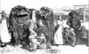

  
[Intangible Textual Heritage](../../index)  [Time](../index) 
[Index](index)  [Previous](crt09)  [Next](crt11) 

------------------------------------------------------------------------

[Buy this Book at
Amazon.com](https://www.amazon.com/exec/obidos/ASIN/0486233545/internetsacredte)

------------------------------------------------------------------------

*Christmas in Ritual and Tradition*, by Clement A. Miles, \[1912\], at
Intangible Textual Heritage

------------------------------------------------------------------------

## Part II—Pagan Survivals

p. 160 p. 161 

## CHAPTER VI

## PRE-CHRISTIAN WINTER FESTIVALS

> The Church and Superstition—Nature of Pagan Survivals—Racial
> Origins—Roman Festivals of the *Saturnalia* and Kalends—Was there a
> Teutonic Midwinter Festival?—The Teutonic, Celtic, and Slav New
> Year—Customs attracted to Christmas or January 1—The Winter Cycle of
> Festivals—*Rationale* of Festival Ritual: (*a*) Sacrifice and
> Sacrament, (*b*) the Cult of the Dead, (*c*) Omens and Charms for the
> New Year—Compromise in the Later Middle Ages—The Puritans and
> Christmas—Decay of Old Traditions.

[  
Click to enlarge](img/image17.jpg)  
  

NEW YEAR MUMMERS IN MANCHURIA.

An Asiatic example of animal masks.

We have now to leave the commemoration of the Nativity of Christ, and to
turn to the other side of Christmas—its many traditional observances
which, though sometimes coloured by Christianity, have nothing to do
with the Birth of the Redeemer. This class of customs has often,
especially in the first millennium of our era, been the object of
condemnations by ecclesiastics, and represents the old paganism which
Christianity failed to extinguish. The Church has played a double part,
a part of sheer antagonism, forcing heathen customs into the shade, into
a more or less surreptitious and unprogressive life, and a part of
adaptation, baptizing them into Christ, giving them a Christian name and
interpretation, and often modifying their form. The general effect of
Christianity upon pagan usages is well suggested by Dr. Karl Pearson:—

> “What the missionary could he repressed, the more as his church grew
> in strength; what he could not repress he adopted or simply left
> unregarded.... What the missionary tried to repress became mediaeval
> witchcraft; what he judiciously disregarded survives to this  id="page_162">p. 162 day in peasant
> weddings and in the folk-festivals at the great changes of
> season.” [7-1](crt22.htm#Note_7-1)

We find then many pagan practices concealed beneath a superficial
Christianity—often under the mantle of some saint—but side by side
with these are many usages never Christianized even in appearance, and
obviously identical with heathen customs against which the Church
thundered in the days of her youth. Grown old and tolerant—except of
novelties—she has long since ceased to attack them, and they have
themselves mostly lost all definite religious meaning. As the old pagan
faith decayed, they tended to become in a literal sense “superstition,”
something standing over, like shells from which the living occupant has
gone. They are now often mere “survivals” in the technical folk-lore
sense, pieces of custom separated from the beliefs that once gave them
meaning, performed only because in a vague sort of way they are supposed
to bring good luck. In many cases those who practise them would be quite
unable to explain how or why they work for good.

Mental inertia, the instinct to do and believe what has always been done
and believed, has sometimes preserved the animating faith as well as the
external form of these practices, but often all serious significance has
departed. What was once religious or magical ritual, upon the due
observance of which the welfare of the community was believed to depend,
has become mere pageantry and amusement, often a mere children's
game. [7-2](crt22.htm#Note_7-2)

Sometimes the spirit of a later age has worked upon these pagan customs,
revivifying and transforming them, giving them charm. Often, however,
one does not find in them the poetry, the warm humanity, the humour,
which mark the creations of popular Catholicism. They are fossils and
their interest is that of the fossil: they are records of a vanished
world and help us to an imaginative reconstruction of it. But further,
just as on a stratum of rock rich in fossils there may be fair meadows
and gardens and groves, depending for their life on the denudation of
the rock beneath, so have these ancient religious products largely
supplied the soil in which more spiritual and more p. 163 beautiful things
have flourished. Amid these, as has been well said, “they still emerge,
unchanged and unchanging, like the quaint outcrops of some ancient rock
formation amid rich vegetation and fragrant
flowers.” [7-3](crt22.htm#Note_7-3)

The survivals of pagan religion at Christian festivals relate not so
much to the worship of definite divinities—against this the
missionaries made their most determined efforts, and the names of the
old gods have practically disappeared—as to cults which preceded the
development of anthropomorphic gods with names and attributes. These
cults, paid to less personally conceived spirits, were of older standing
and no doubt had deeper roots in the popular mind. Fundamentally
associated with agricultural and pastoral life, they have in many cases
been preserved by the most conservative element in the population, the
peasantry.

Many of the customs we shall meet with are magical, rather than
religious in the proper sense; they are not directed to the conciliation
of spiritual beings, but spring from primitive man's belief “that in
order to produce the great phenomena of nature on which his life
depended he had only to imitate them.” [7-4](crt22.htm#Note_7-4) Even when they have a definitely religious
character, and are connected with some spirit, magical elements are
often found in them.

Before we consider these customs in detail it will be necessary to
survey the pagan festivals briefly alluded to in
 [I](crt04.htm#Chapter_I), to note the various ideas and practices that
characterized them, and to study the attitude of the Church towards
survivals of such practices while the conversion of Europe was in
progress, and also during the Middle Ages.

The development of religious custom and belief in Europe is a matter of
such vast complexity that I cannot in a book of this kind attempt more
than the roughest outline of the probable origins of the observances,
purely pagan or half-Christianized, clustering round Christmas. It is
difficult, in the present state of knowledge, to discern clearly the
contributions of different peoples to the traditional customs of Europe,
and even, in many cases, to say whether a given custom is “Aryan” or
pre-Aryan. The proportion of the Aryan military aristocracy to the
peoples whom they conquered was not uniform in all countries, and p. 164 probably was
often small. While the families of the conquerors succeeded in imposing
their languages, it by no means necessarily follows that the
folk-practices of countries now Aryan in speech came entirely or even
chiefly from Aryan sources. Religious tradition has a marvellous power
of persistence, and it must be remembered that the lands conquered by
men of Aryan speech had been previously occupied for immense
periods. [7-5](crt22.htm#Note_7-5)
Similarly, in countries like our own, which have been successively
invaded by Celts, Romans, Anglo-Saxons, Danes, and Normans, it is often
extraordinarily hard to say even to what *national* source a given
custom should be assigned.

It is but tentatively and with uncertain hands that scholars are trying
to separate the racial strains in the folk-traditions of Europe, and
here I can hardly do more than point out three formative elements in
Christian customs: the ecclesiastical, the classical (Greek and Roman),
and the barbarian, taking the last broadly and without a minute racial
analysis. So far, indeed, as ritual, apart from mythology, is concerned,
there seems to be a broad common ground of tradition among the
Aryan-speaking peoples. How far this is due to a common derivation we
need not here attempt to decide. The folk-lore of the whole world, it is
to be noted, “reveals for the same stages of civilization a wonderful
uniformity and homogeneity.... This uniformity is not, however, due to
necessary uniformity of origin, but to a great extent to the fact that
it represents the state of equilibrium arrived at between minds at a
certain level and their environment.” [7-6](crt22.htm#Note_7-6)

The scientific study of primitive religion is still almost in its
infancy, and a large amount of conjecture must necessarily enter into
any explanations of popular ritual that can be offered. In attempting to
account for Christmas customs we must be mindful, therefore, of the
tentative nature of the theories put forward. Again, it is important to
remember that ritual practices are far more enduring than the
explanations given to them. “The antique religions,” to quote the words
of Robertson Smith, “had for the most part no creed; they consisted
entirely of institutions and practices ... as a rule we find that while
the practice was p. 165 rigorously fixed, the meaning attached to it was
extremely vague, and the same rite was explained by different people in
different ways.” [7-7](crt22.htm#Note_7-7)

Thus if we can arrive at the significance of a rite at a given period,
it by no means follows that those who began it meant the same thing. At
the time of the conflict of the heathen religions with Christianity
elaborate structures of mythology had grown up around their traditional
ceremonial, assigning to it meanings that had often little to do with
its original purpose. Often, too, when the purpose was changed, new
ceremonies were added, so that a rite may look very unlike what it was
at first.

With these cautions and reservations we must now try to trace the
connection between present-day or recent goings-on about Christmas-time
and the festival practices of pre-Christian Europe.

Christmas, as we saw in  [I](crt04.htm#Chapter_I), has taken the date of
the *Natalis Invicti*. We need not linger over this feast, for it was
not attended by folk-customs, and there is nothing to connect it with
modern survivals. The Roman festivals that really count for our present
purpose are the Kalends of January and, probably, the *Saturnalia*. The
influence of the Kalends is strongest naturally in the Latin countries,
but is found also all over Europe. The influence of the *Saturnalia* is
less certain; the festival is not mentioned in ecclesiastical
condemnations after the institution of Christmas, and possibly its
popularity was not so widespread as that of the Kalends. There are,
however, some curiously interesting Christmas parallels to its usages.

The strictly religious feast of the
*Saturnalia* [7-8](crt22.htm#Note_7-8)
was held on December 17, but the festal customs were kept up for seven
days, thus lasting until the day before our Christmas Eve. Among them
was a fair called the *sigillariorum celebritas*, for the sale of little
images of clay or paste which were given away as
presents. [81](crt24.htm#Footnote_81)
Candles seem also to have been given away, perhaps p. 166 as symbols of, or
even charms to ensure, the return of the sun's power after the solstice.
The most remarkable and typical feature, however, of the *Saturnalia*
was the mingling of all classes in a common jollity. Something of the
character of the celebration (in a Hellenized form) may be gathered from
the “Cronia” or “Saturnalia” of Lucian, a dialogue between Cronus or
Saturn and his priest. We learn from it that the festivities were marked
by “drinking and being drunk, noise and games and dice, appointing of
kings and feasting of slaves, singing naked, clapping of tremulous
hands, an occasional ducking of corked faces in icy water,” and that
slaves had licence to revile their
lords. [7-9](crt22.htm#Note_7-9)

The spirit of the season may be judged from the legislation which Lucian
attributes to Cronosolon, priest and prophet of Cronus, much as a modern
writer might make Father Christmas or Santa Klaus lay down rules for the
due observance of Yule. Here are some of the laws:—

> “*All business, be it public or private, is forbidden during the feast
> days, save such as tends to sport and solace and delight. Let none
> follow their avocations saving cooks and bakers.*
>
> *All men shall be equal, slave and free, rich and poor, one with
> another.*
>
> *Anger, resentment, threats, are contrary to law.*
>
> *No discourse shall be either composed or delivered, except it be
> witty and lusty, conducing to mirth and jollity.* ”

There follow directions as to the sending of presents of money,
clothing, or vessels, by rich men to poor friends, and as to poor men's
gifts in return. If the poor man have learning, his return gift is to be
“an ancient book, but of good omen and festive humour, or a writing of
his own after his ability.... For the unlearned, let him send a garland
or grains of frankincense.” The “Cronosolon” closes with “Laws of the
Board,” of which the following are a few:—

> “*Every man shall take place as chance may direct; dignities and birth
> and wealth shall give no precedence.*p.
> 167 
>
> *All shall be served with the same wine.... Every man's portion of
> meat shall be alike.*
>
> *When the rich man shall feast his slaves, let his friends serve with
> him.* ” [7-11](crt22.htm#Note_7-11)

Over the whole festival brooded the thought of a golden age in the
distant past, when Saturn ruled, a just and kindly monarch, when all men
were good and all men were happy.

A striking feature of the *Saturnalia* was the choosing by lot of a mock
king, to preside over the revels. His word was law, and he was able to
lay ridiculous commands upon the guests; “one,” says Lucian, “must shout
out a libel on himself, another dance naked, or pick up the flute-girl
and carry her thrice round the house.” [7-12](crt22.htm#Note_7-12) This king may have been originally the
representative of the god Saturn himself. In the days of the classical
writers he is a mere “Lord of Misrule,” but Dr. Frazer has propounded
the very interesting theory that this time of privilege and gaiety was
once but the prelude to a grim sacrifice in which he had to die in the
character of the god, giving his life for the
world. [7-13](crt22.htm#Note_7-13) Dr.
Frazer's theory, dependent for its evidence upon the narrative of the
martyrdom of a fourth-century saint, Dasius by name, has been keenly
criticized by Dr. Warde Fowler. He holds that there is nothing whatever
to show that the “Saturn” who in the fourth century, according to the
story, was sacrificed by soldiers on the Danube, had anything to do with
the customs of ancient Rome. [7-14](crt22.htm#Note_7-14) Still, in whatever way the king of the
*Saturnalia* may be explained, it is interesting to note his existence
and compare him with the merry monarchs whom we shall meet at Christmas
and Twelfth Night.

How far the Saturnalian customs in general were of old Latin origin it
is difficult to say; the name Saturnus (connected with the root of
*serere*, to sow) and the date point to a real Roman festival of the
sowing of the crops, but this was heavily overlaid with Greek ideas and
practice. [7-15](crt22.htm#Note_7-15) It
is especially important to bear this in mind in considering Lucian's
statements.

The same is true of the festival of the January Kalends, a few days
after the *Saturnalia*. On January 1, the Roman New p. 168 Year's Day, the
new consuls were inducted into office, and for at least three days high
festival was kept. The houses were decorated with lights and
greenery—these, we shall find, may be partly responsible for the modern
Christmas-tree. As at the *Saturnalia* masters drank and gambled with
slaves. *Vota*, or solemn wishes of prosperity for the Emperor during
the New Year, were customary, and the people and the Senate were even
expected to present gifts of money to him. The Emperor Caligula excited
much disgust by publishing an edict requiring these gifts and by
standing in the porch of his palace to receive them in person. Such
gifts, not only presented to the Emperor, but frequently exchanged
between private persons, were called *strenae*, a name still surviving
in the French *étrennes* (New Year's
presents). [7-16](crt22.htm#Note_7-16)

An interesting and very full account of the Kalends celebrations is
given in two discourses of Libanius, the famous Greek sophist of the
fourth century:—

> “The festival of the Kalends,” he says, “is celebrated everywhere as
> far as the limits of the Roman Empire extend.... Everywhere may be
> seen carousals and well-laden tables; luxurious abundance is found in
> the houses of the rich, but also in the houses of the poor better food
> than usual is put upon the table. The impulse to spend seizes
> everyone. He who the whole year through has taken pleasure in saving
> and piling up his pence, becomes suddenly extravagant. He who
> erstwhile was accustomed and preferred to live poorly, now at this
> feast enjoys himself as much as his means will allow.... People are
> not only generous towards themselves, but also towards their
> fellow-men. A stream of presents pours itself out on all sides.... The
> highroads and footpaths are covered with whole processions of laden
> men and beasts.... As the thousand flowers which burst forth
> everywhere are the adornment of Spring, so are the thousand presents
> poured out on all sides, the decoration of the Kalends feast. It may
> justly be said that it is the fairest time of the year.... The Kalends
> festival banishes all that is connected with toil, and allows men to
> give themselves up to undisturbed enjoyment. From the minds of young
> people it removes two kinds of dread: the dread of the schoolmaster
> and the dread of the stern pedagogue. The slave also it allows, so far
> as possible, to breathe the air of freedom.... p.
> 169 Another great quality of the
> festival is that it teaches men not to hold too fast to their money,
> but to part with it and let it pass into other
> hands.” [7-17](crt22.htm#Note_7-17)

The resemblances here to modern Christmas customs are very striking. In
another discourse Libanius speaks of processions on the Eve of the
festival. Few people, he says, go to bed; most go about the streets with
singing and leaping and all sorts of mockery. The severest moralist
utters no blame on this occasion. When morning begins to dawn they
decorate their houses with laurels and other greenery, and at daybreak
may go to bed to sleep off their intoxication, for many deem it
necessary at this feast to follow the flowing bowl. On the 1st of
January money is distributed to the populace; on the 2nd no more
presents are given: it is customary to stay at home playing dice,
masters and slaves together. On the 3rd there is racing; on the 4th the
festivities begin to decline, but they are not altogether over on the
5th. [7-18](crt22.htm#Note_7-18)

Another feature of the Kalends, recorded not in the pages of classical
writers but in ecclesiastical condemnations, was the custom of dressing
up in the hides of animals, in women's clothes, and in masks of various
kinds. [7-19](crt22.htm#Note_7-19) Dr.
Tille [7-20](crt22.htm#Note_7-20)
regards this as Italian in origin, but it seems likely that it was a
native custom in Greece, Gaul, Germany, and other countries conquered by
the Romans. In Greece the skin-clad mummers may have belonged to the
winter festivals of Dionysus supplanted by the
*Kalendae*. [7-21](crt22.htm#Note_7-21)

The Church's denunciations of pagan festal practices in the winter
season are mainly directed against the Kalends celebrations, and show
into how many regions the keeping of the feast had spread. Complaints of
its continued observance abound in the writings of churchmen and the
decrees of councils. In the second volume of his “Mediaeval
Stage” [7-22](crt22.htm#Note_7-22) Mr.
Chambers has made an interesting collection of forty excerpts from such
denunciations, ranging in date from the fourth century to the eleventh,
and coming from Spain, Italy, Antioch, northern Africa, Constantinople,
Germany, England, and various districts of what is now France.

p. 170 As a
specimen I may translate a passage describing at some length the
practices condemned. It is from a sermon often ascribed to St. Augustine
of Hippo, but probably composed in the sixth century, very likely by
Caesarius of Arles in southern Gaul:—

> “On those days,” says the preacher, speaking of the Kalends of
> January, “the heathen, reversing the order of all things, dress
> themselves up in indecent deformities.... These miserable men, and
> what is worse, some who have been baptized, put on counterfeit forms
> and monstrous faces, at which one should rather be ashamed and sad.
> For what reasonable man would believe that any men in their senses
> would by making a stag (*cervulum*) turn themselves into the
> appearance of animals? Some are clothed in the hides of cattle; others
> put on the heads of beasts, rejoicing and exulting that they have so
> transformed themselves into the shapes of animals that they no longer
> appear to be men.... How vile, further, it is that those who have been
> born men are clothed in women's dresses, and by the vilest change
> effeminate their manly strength by taking on the forms of girls,
> blushing not to clothe their warlike arms in women's garments; they
> have bearded faces, and yet they wish to appear women.... There are
> some who on the Kalends of January practise auguries, and do not allow
> fire out of their houses or any other favour to anyone who asks. Also
> they both receive and give diabolical presents (*strenas*). Some
> country people, moreover, lay tables with plenty of things necessary
> for eating ... thinking that thus the Kalends of January will be a
> warranty that all through the year their feasting will be in like
> measure abundant. Now as for them who on those days observe any
> heathen customs, it is to be feared that the name of Christian will
> avail them nought. And therefore our holy fathers of old, considering
> that the majority of men on those days became slaves to gluttony and
> riotous living and raved in drunkenness and impious dancing,
> determined for the whole world that throughout the Churches a public
> fast should be proclaimed.... Let us therefore fast, beloved brethren,
> on those days.... For he who on the Kalends shows any civility to
> foolish men who are wantonly sporting, is undoubtedly a partaker of
> their sin.” [7-23](crt22.htm#Note_7-23) id="Nanchor_7-23">

There are several points to be noted here. First, the zeal of the Church
against the Kalends celebrations as impious relics of p. 171 heathenism: to
root them out she even made the first three days of the year a solemn
fast with litanies. [7-24](crt22.htm#Note_7-24) Next, the particular offences should be
observed. These are: first, the dressing up of men in the hides of
animals and the clothes of women; next, the New Year auguries and the
superstition about fire, the giving of presents, and the laying of
tables with good things; and last, drunkenness and riot in general. All
these we shall find fully represented in modern Christmas customs.

That Roman customs either spread to Germany, or were paralleled there,
is shown by a curious letter written in 742 by St. Boniface to Pope
Zacharias. The saint complained that certain Alamanni, Bavarians, and
Franks refused to give up various heathen practices because they had
seen such things done in the sacred city of Rome, close to St. Peter's,
and, as they deemed, with the sanction of the clergy. On New Year's Eve,
it was alleged, processions went through the streets of Rome, with
impious songs and heathen cries; tables of fortune were set up, and at
that time no one would lend fire or iron or any other article to his
neighbour. The Pope replied that these things were odious to him, and
should be so to all Christians; and next year all such practices at the
January Kalends were formally forbidden by the Council of
Rome. [7-25](crt22.htm#Note_7-25)

So much for Roman customs; if indeed such practices as beast-masking are
Roman, and not derived from the religion of peoples conquered by the
imperial legions. We must now turn to the winter festivals of the
barbarians with whom the Church began to come into contact soon after
the establishment of Christmas.

Much attention has been bestowed upon a supposed midwinter festival of
the ancient Germans. In the mid-nineteenth century it was customary to
speak of Christmas and the Twelve Nights as a continuation of the holy
season kept by our forefathers at the winter solstice. The festive fires
of Christmas were regarded as symbols of the sun, who then began his
upward journey in the heavens, while the name Yule was traced back to
the Anglo-Saxon word *hwéol* (wheel), and connected with the circular
p. 172 course of
the sun through the wheeling-points of the solstices and equinoxes. More
recent research, however, has thrown the gravest doubts upon the
existence of any Teutonic festival at the winter
solstice. [82](crt24.htm#Footnote_82) It
appears from philology and the study of surviving customs that the
Teutonic peoples had no knowledge of the solstices and equinoxes, and
until the introduction of the Roman Calendar divided their year not into
four parts but into two, three, and six, holding their New Year's Day
with its attendant festivities not at the end of December or beginning
of January, but towards the middle of November. At that time in Central
Europe the first snowfall usually occurred and the pastures were closed
to the flocks. A great slaughter of cattle would then take place, it
being impossible to keep the beasts in stall throughout the winter, and
this time of slaughter would naturally be a season of feasting and
sacrifice and religious observances. [83](crt24.htm#Footnote_83) [7-26](crt22.htm#Note_7-26)

The Celtic year, like the Teutonic, appears to have begun in November
with the feast of *Samhain*—a name that may mean either “summer-end” or
“assembly.” It appears to have been in origin a “pastoral and
agricultural festival, which in time came to be looked upon as affording
assistance to the powers of growth in their conflict with the powers of
blight,” and to have had many features in common with the Teutonic feast
at the same season, for instance animal sacrifice, commemoration of the
dead, and omens and charms for the New
Year. [7-27](crt22.htm#Note_7-27)

There is some reason also to believe that the New Year p. 173 festival of the
Slavs took place in the autumn and that its usages have been transferred
to the feast of the Nativity. [7-29](crt22.htm#Note_7-29) A description based on contemporary documents
cannot be given of these barbarian festivals; we have, rather, to
reconstruct them from survivals in popular custom. At the close of this
book, when such relics have been studied, we may have gained some idea
of what went on upon these pre-Christian holy-days. It is the Teutonic
customs that have been most fully recorded and discussed by scholars,
and these will loom largest in our review; at the same time Celtic and
Slav practices will be considered, and we shall find that they often
closely resemble those current in Teutonic lands.

The customs of the old New Year feasts have frequently wandered from
their original November date, and to this fact we owe whatever elements
of northern paganism are to be found in Christmas. Some practices seem
to have been put forward to Michaelmas; one side of the festivals, the
cult of the dead, is represented especially by All Saints’ and All
Souls’ days (November 1 and 2). St. Martin's Day (November 11) probably
marks as nearly as possible the old Teutonic date, and is still in
Germany an important folk-feast attended by many customs derived from
the beginning-of-winter festival. Other practices are found strewn over
various holy-days between Martinmas and Epiphany, and concentrated above
all on the Church's feast of the Nativity and the Roman New Year's Day,
January 1, both of which had naturally great power of
attraction. [7-30](crt22.htm#Note_7-30)

The progress of agriculture, as Dr. Tille points
out, [7-31](crt22.htm#Note_7-31) tended
to destroy the mid-November celebration. In the Carolingian period an
improvement took place in the cultivation of meadows, and the increased
quantity of hay made it possible to keep the animals fattening in stall,
instead of slaughtering them as soon as the pastures were closed. Thus
the killing-time, with its festivities, became later and later. St.
Andrew's Day (November 30) and St. Nicholas's (December 6) may mark
stages in its progress into the winter. In St. Nicholas's Day, indeed,
we find a feast that closely resembles Martinmas, and seems to be the
same folk-festival transferred to a later date. Again, as regards
England we p. 174 must remember the difference between its climate
and that of Central Europe. Mid-November would here not be a date beyond
which pasturing was impossible, and thus the slaughter and feast held
then by Angles and Saxons in their old German home would tend to be
delayed. [7-32](crt22.htm#Note_7-32)

Christmas, as will be gathered from the foregoing, cannot on its pagan
side be separated from the folk-feasts of November and December. The
meaning of the term will therefore here be so extended as to cover the
whole period between All Saints’ Day and Epiphany. That this is not too
violent a proceeding will be seen later on.

For the purposes of this book it seems best to treat the winter
festivals calendarially, so to speak: to start at the beginning of
November, and show them in procession, suggesting, as far as may be, the
probable origins of the customs observed. Thus we may avoid the
dismemberment caused by taking out certain practices from various
festivals and grouping them under their probable origins, a method which
would, moreover, be perilous in view of the very conjectural nature of
the theories offered.

Before we pass to our procession of festivals, something must be said
about the general nature and *rationale* of the customs associated with
them. For convenience these customs may be divided into three groups:—

I. *Sacrificial or Sacramental Practices.*  
II. *Customs connected with the Cult of the Dead and
the Family Hearth.*  
III. *Omens and Charms for the New Year.*  

Though these three classes overlap and it is sometimes difficult to
place a given practice exclusively in one of them, they will form a
useful framework for a brief account of the primitive ritual which
survives at the winter festivals.

### I. Sacrificial and Sacramental Practices.

To most people, probably, the word “sacrifice” suggests an offering,
something presented to a divinity in order to obtain his favour. Such
seems to have been the meaning generally given to p.
175 sacrificial rites in Europe when
Christianity came into conflict with paganism. It is, however, held by
many scholars that the original purpose of sacrifice was
sacramental—the partaking by the worshipper of the divine life,
conceived of as present in the victim, rather than the offering of a
gift to a divinity. [7-33](crt22.htm#Note_7-33)

The whole subject of sacred animals is obscure, and in regard,
especially, to totemism—defined by Dr.
Frazer [7-34](crt22.htm#Note_7-34) as
“belief in the kinship of certain families with certain species of
animals” and practices based upon that belief—the most divergent views
are held by scholars. The religious significance which some have seen in
totemistic customs is denied by others, while there is much disagreement
as to the probability of their having been widespread in Europe. Still,
whatever may be the truth about totemism, there is much that points to
the sometime existence in Europe of sacrifices that were not offerings,
but solemn feasts of communion in the flesh and blood of a worshipful
animal. [7-35](crt22.htm#Note_7-35) That
the idea of sacrificial communion preceded the sacrifice-gift is
suggested by the fact that in many customs which appear to be
sacrificial survivals the body of the victim has some kind of
sacramental efficacy; it conveys a blessing to that which is brought
into contact with it. The actual eating and drinking of the flesh and
blood is the most perfect mode of contact, but the same end seems to
have been aimed at in such customs as the sprinkling of worshippers with
blood, the carrying of the victim in procession from house to house, the
burying of flesh in furrows to make the crops grow, and the wearing of
hides, heads, or horns of sacrificed
beasts. [7-36](crt22.htm#Note_7-36) We
shall meet, during the Christmas season, with various practices that
seem to have originated either in a sacrificial feast or in some such
sacramental rites as have just been described. So peculiarly prominent
are animal masks, apparently derived from hide-, head-, and
horn-wearing, that we may dwell upon them a little at this point.

We have already seen how much trouble the Kalends custom of
beast-masking gave the ecclesiastics. Its probable origin is thus
suggested by Robertson Smith:—

> “It is ... appropriate that the worshipper should dress himself in
> p. 176 the skin
> of a victim, and so, as it were, envelop himself in its sanctity. To
> rude nations dress is not merely a physical comfort, but a fixed part
> of social religion, a thing by which a man constantly bears on his
> body the token of his religion, and which is itself a charm and a
> means of divine protection.... When the dress of sacrificial skin,
> which at once declared a man's religion and his sacred kindred, ceased
> to be used in ordinary life, it was still retained in holy and
> especially in piacular functions; ... examples are afforded by the
> Dionysiac mysteries and other Greek rites, and by almost every rude
> religion; while in later cults the old rite survives at least in the
> religious use of animal masks.” [84](crt24.htm#Footnote_84) id="FNanchor_84"> [7-37](crt22.htm#Note_7-37) id="Nanchor_7-37">

If we accept the animal-worship and sacrificial communion theory, many a
Christmas custom will carry us back in thought to a stage of religion
far earlier than the Greek and Roman classics or the Celtic and Teutonic
mythology of the conversion period: we shall be taken back to a time
before men had come to have anthropomorphic gods, when they were not
conscious of their superiority to the beasts of the field, but regarded
these beings, mysterious in their actions, extraordinary in their
powers, as incarnations of potent spirits. At this stage of thought, it
would seem, there were as yet no definite divinities with personal names
and characters, but the world was full of spirits immanent in animal or
plant or chosen human being, and able to pass from one incarnation to
another. Or indeed it may be that animal sacrifice originated at a stage
of religion before the idea of definite “spirits” had arisen, when man
was conscious rather of a vague force like the Melanesian *mana*, in
himself and in almost everything, and “constantly trembling on the verge
of personality.” [7-38](crt22.htm#Note_7-38) “*Mana* ” better than “god” or “spirit” may
express that with which the partaker in the communal feast originally
sought contact. “When you sacrifice,” to quote some words of Miss Jane
Harrison, “you build as it were a bridge between your *mana*, your will,
your desire, which is weak and impotent, and p.
177 that unseen outside *mana* which
you believe to be strong and efficacious. In the fruits of the earth
which grow by some unseen power there is much *mana*; you want that
*mana*. In the loud-roaring bull and the thunder is much *mana*; you
want that *mana*. It would be well to get some, to eat a piece of that
bull raw, but it is dangerous, not a thing to do unawares alone; so you
consecrate the first-fruits, you sacrifice the bull and then in safety
you—communicate.” [7-39](crt22.htm#Note_7-39) “Sanctity”—the quality of awfulness and
mystery—rather than divinity or personality, may have been what
primitive man saw in the beasts and birds which he venerated in “their
silent, aloof, goings, in the perfection of their limited
doings.” [7-40](crt22.htm#Note_7-40)
When we use the word “spirit” in connection with the pagan sacramental
practices of Christmastide, it is well to bear in mind the possibility
that at the origin of these customs there may have been no notion of
communion with strictly personal beings, but rather some such *mana*
idea as has been suggested above.

It is probable that animal-cults had their origin at a stage of human
life preceding agriculture, when man lived not upon cultivated plants or
tamed beasts, but upon roots and fruits and the products of the chase.
Some scholars, indeed, hold that the domestication of animals for
practical use was an outcome of the sacred, inviolable character of
certain creatures: they may originally have been spared not for reasons
of convenience but because it was deemed a crime to kill them—except
upon certain solemn occasions—and may have become friendly towards man
through living by his side. [7-41](crt22.htm#Note_7-41) On the other hand it is possible that totems
were originally staple articles of food, that they were sacred because
they were eaten with satisfaction, and that the very awe and respect
attached to them because of their life-giving powers tended to remove
them from common use and limit their consumption to rare ceremonial
occasions.

Closely akin to the worship of animals is that of plants, and especially
trees, and there is much evidence pointing to sacramental cults in
connection with the plant-world. [7-42](crt22.htm#Note_7-42) Some cakes and special vegetable dishes eaten
on festal days may be survivals of sacramental feasts parallel to those
upon the flesh and blood of p. 178 an animal victim. Benediction by external contact,
again, is suggested by the widespread use in various ways of branches or
sprigs or whole trees. The Christmas-tree and evergreen decorations are
the most obvious examples; we shall see others in the course of our
survey, and in connection with plants as well as with animals we shall
meet with processions intended to convey a blessing to every house by
carrying about the sacred elements—to borrow a term from Christian
theology. Even the familiar practice of going carol-singing may be a
Christianized form of some such perambulation.

It is possible that men and women had originally separate cults. The
cult of animals, according to a theory set forth by Mr. Chambers, would
at first belong to the men, who as hunters worshipped the beasts they
slew, apologizing to them, as some primitive people do to-day, for the
slaughter they were obliged to commit. Other animals, apparently, were
held too sacred to be slain, except upon rare and solemn occasions, and
hence, as we have seen, may have arisen domestication and the pastoral
life which, with its religious rites, was the affair of the men. To
women, on the other hand, belonged agriculture; the cult of Mother Earth
and the vegetation-spirits seems to have been originally theirs. Later
the two cults would coalesce, but a hint of the time when certain rites
were practised only by women may be found in that dressing up of men in
female garments which appears not merely in the old Kalends customs but
in some modern survivals. [85](crt24.htm#Footnote_85) [7-43](crt22.htm#Note_7-43)

Apart from any special theory of the origin of sacrifice, we may note
the association at Christmas of physical feasting with religious
rejoicing. In this the modern European is the heir of an agelong
tradition. “Everywhere,” says Robertson Smith, p.
179 “we find that a sacrifice
ordinarily involves a feast, and that a feast cannot be provided without
a sacrifice. For a feast is not complete without flesh, and in early
times the rule that all slaughter is sacrifice was not confined to the
Semites. The identity of religious occasions and festal seasons may
indeed be taken as the determining characteristic of the type of ancient
religion generally; when men meet their god they feast and are glad
together, and whenever they feast and are glad they desire that the god
should be of the party.” [7-45](crt22.htm#Note_7-45) To the paganism that preceded Christianity we
must look for the origin of that Christmas feasting which has not seldom
been a matter of scandal for the severer type of churchman.

> \[Transcriber's Note: The marker for note
>  [7-44](crt22.htm#Note_7-44) was not
> present in the page scan\]

A letter addressed in 601 by Pope Gregory the Great to Abbot Mellitus,
giving him instructions to be handed on to Augustine of Canterbury,
throws a vivid light on the process by which heathen sacrificial feasts
were turned into Christian festivals. “Because,” the Pope says of the
Anglo-Saxons, “they are wont to slay many oxen in sacrifices to demons,
some solemnity should be put in the place of this, so that on the day of
the dedication of the churches, or the nativities of the holy martyrs
whose relics are placed there, they may make for themselves tabernacles
of branches of trees around those churches which have been changed from
heathen temples, and may celebrate the solemnity with religious
feasting. Nor let them now sacrifice animals to the Devil, but to the
praise of God kill animals for their own eating, and render thanks to
the Giver of all for their abundance; so that while some outward joys
are retained for them, they may more readily respond to inward joys. For
from obdurate minds it is undoubtedly impossible to cut off everything
at once, because he who strives to ascend to the highest place rises by
degrees or steps and not by leaps.” [7-46](crt22.htm#Note_7-46)

We see here very plainly the mind of the ecclesiastical compromiser.
Direct sacrifice to heathen gods the Church of course could not dream of
tolerating; it had been the very centre of her attack since the days of
St. Paul, and refusal to take part in it had cost the martyrs their
lives. Yet the festivity and merrymaking to which it gave occasion were
to be left to the p. 180 people, for a time at all events. The policy had
its advantages, it made the Church festivals popular; but it had also
its dangers, it encouraged the intrusion of a pagan fleshly element into
their austere and chastened joys. A certain orgiastic licence crept in,
an unbridling of the physical appetites, which has ever been a source of
sorrow and anger to the most earnest Christians and even led the
Puritans of the seventeenth century to condemn all festivals as
diabolical.

Before we leave the subject of sacrificial survivals, it must be added
that certain Christmas customs may come, little as those who practise
them suspect it, from that darkest of religious rites, human sacrifice.
Reference has already been made to Dr. Frazer's view of the Saturnalian
king and his awful origin. We shall meet with various similar figures
during the Christmas season—the “King of the Bean,” for instance, and
the “Bishop of Fools.” If the theories about human sacrifice set forth
in “The Golden Bough” be accepted, we may regard these personages as
having once been mock kings chosen to suffer instead of the real kings,
who had at first to perish by a violent death in order to preserve from
the decay of age the divine life incarnate in them. Such mock monarchs,
according to Dr. Frazer, were exalted for a brief season to the glory
and luxury of kingship ere their doom fell upon
them; [7-47](crt22.htm#Note_7-47) in the
Christmas “kings” the splendour alone has survived, the dark side is
forgotten.

### II. The Cult of the Dead and the Family Hearth.

Round the winter festival cluster certain customs apparently connected
with distinctively domestic religion, rather than with such public and
communal cults as we have considered under the heading of Sacrifice and
Sacrament. A festival of the family—that is, perhaps, what Christmas
most prominently is to-day: it is the great season for gatherings “round
the old fireside”; it is a joyous time for the children of the house,
and the memory of the departed is vivid then, if unexpressed. Further,
by the Yule log customs and certain other ceremonies still practised in
the remoter corners of Europe, we are carried back to a stage of thought
at which the dead were conceived as hovering about or p. 181 visiting the
abodes of the living. Ancestral spirits, it seems, were once believed to
be immanent in the fire that burned on the hearth, and had to be
propitiated with libations, while elsewhere the souls of the dead were
thought to return to their old homes at the New Year, and meat and drink
had to be set out for them. The Church's establishment of All Souls’ Day
did much to keep practices of tendance of the departed to early
November, but sometimes these have wandered to later dates and
especially to Christmas. In folk-practices directed towards the dead two
tendencies are to be found: on the one hand affection or at all events
consideration for the departed persists, and efforts are made to make
them comfortable; on the other, they are regarded with dread, and the
sight of them is avoided by the living.

In the passage quoted from Caesarius of Arles there was mention of the
laying of tables with abundance of food at the Kalends. The same
practice is condemned by St. Jerome in the fifth century, and is by him
specially connected with Egypt. [7-48](crt22.htm#Note_7-48) He, like Caesarius and others, regards it as a
kind of charm to ensure abundance during the coming year, but it is very
possible that its real purpose was different, that the food was an
offering to supernatural beings, the guardians and representatives of
the dead. [7-49](crt22.htm#Note_7-49)
Burchardus of Worms in the early eleventh century says definitely that
in his time tables were laid with food and drink and three knives for
“those three Sisters whom the ancients in their folly called
*Parcae*.” [7-50](crt22.htm#Note_7-50)
The *Parcae* were apparently identified with the three “weird” Sisters
known in England and in other Teutonic regions, and seem to have some
connection with the fairies. As we shall see later on, it is still in
some places the custom to lay out tables for supernatural beings,
whether, as at All Souls’ tide, explicitly for the dead, or for Frau
Perchta, or for the Virgin or some other Christian figure. Possibly the
name *Modranicht* (night of mothers), which Bede gives to Christmas
Eve, [7-51](crt22.htm#Note_7-51) may be
connected with this practice.

Not remote, probably, in origin from a belief in “ghosts” is the driving
away of spirits that sometimes takes place about p.
182 Christmas-time. Many peoples, as
Dr. Frazer has shown, have an annual expulsion of goblins, ghosts,
devils, witches, and evil influences, commonly at the end of the Old or
beginning of the New Year. Sometimes the beings so driven away are
definitely the spirits of the departed. An appalling racket and a great
flare of torches are common features of these expulsions, and we shall
meet with similar customs during the Christmas season. Such
purifications, according to Dr. Frazer, are often preceded or followed
by periods of licence, for when the burden of evil is about to be, or
has just been, removed, it is felt that a little temporary freedom from
moral restraints may be allowed with
impunity. [7-52](crt22.htm#Note_7-52)
Hence possibly, in part, the licence which has often attended the
Christmas season.

### III. Omens and Charms for the New Year.

Customs of augury are to be met with at various dates, which may mark
the gradual shifting of the New Year festival from early November to
January 1, while actual charms to secure prosperity are commonest at
Christmas itself or at the modern New Year. Magical rather than
religious in character, they are attempts to discover or influence the
future by a sort of crude scientific method based on supposed analogies.
Beneath the charms lie the primitive ideas that like produces like and
that things which have once been in contact continue to act upon one
another after they are separated in
space. [7-53](crt22.htm#Note_7-53) The
same ideas obviously underlie many of the sacramental practices alluded
to a few pages back, and these are often of the nature of charms.
Probably, too, among New Year charms should be included such
institutions as the bonfires on Hallowe'en in Celtic countries, on Guy
Fawkes Day in England, and at Martinmas in Germany, for it would seem
that they are intended to secure by imitation a due supply of
sunshine. [7-54](crt22.htm#Note_7-54)
The principle that “well begun is well ended”—or, as the Germans have
it, “*Anfang gut, alles gut* ”—is fundamental in New Year practices:
hence the custom of giving presents as auguries of wealth during the
coming year; hence perhaps partly the heavy eating and drinking—a kind
of charm to ensure abundance.

p. 183 Enough has
already been said about the attitude of the early Church towards
traditional folk-customs. Of the position taken up by the later
mediaeval clergy we get an interesting glimpse in the “Largum Sero” of a
certain monk Alsso of Brĕvnov, an account of Christmas practices in
Bohemia written about the year 1400. It supplies a link between modern
customs and the Kalends prohibitions of the Dark Ages. Alsso tells of a
number of laudable Christmas Eve practices, gives elaborate Christian
interpretations of them, and contrasts them with things done by bad
Catholics with ungodly intention. Here are some of his complaints:—

> Presents, instead of being given, as they should be, in memory of
> God's great Gift to man, are sent because he who does not give freely
> will be unlucky in the coming year. Money, instead of being given to
> the poor, as is seemly, is laid on the table to augur wealth, and
> people open their purses that luck may enter. Instead of using fruit
> as a symbol of Christ the Precious Fruit, men cut it open to predict
> the future \[probably from the pips\]. It is a laudable custom to make
> great white loaves at Christmas as symbols of the True Bread, but evil
> men set out such loaves that the gods may eat of them.

Alsso's assumption is that the bad Catholics are diabolically perverting
venerable Christmas customs, but there can be little doubt that
precisely the opposite was really the case—the Christian symbolism was
merely a gloss upon pagan practices. In one instance Alsso admits that
the Church had adopted and transformed a heathen usage: the old
*calendisationes* or processions with an idol Bel had been changed into
processions of clergy and choir-boys with the crucifix. Round the
villages on the Eve and during the Octave of Christmas went these
messengers of God, robed in white raiment as befitted the servants of
the Lord of purity; they would chant joyful anthems of the Nativity, and
receive in return some money from the people—they were, in fact,
carol-singers. Moreover with their incense they would drive out the
Devil from every corner. [7-55](crt22.htm#Note_7-55)

Alsso's attitude is one of compromise, or at least many of the old
heathen customs are allowed by him, when reinterpreted in a p. 184 Christian sense.
Such seems to have been the general tendency of the later Catholic
Church, and also of Anglicanism in so far as it continued the Catholic
tradition. It will be seen, however, from what has already been said,
that the English Puritans were but following early Christian precedents
when they attacked the paganism that manifested itself at Christmas.

A strong Puritan onslaught is to be found in the “Anatomie of Abuses” by
the Calvinist, Philip Stubbes, first published in 1583. “Especially,” he
says, “in Christmas tyme there is nothing els vsed but cardes, dice,
tables, maskyng, mumming, bowling, and suche like fooleries; and the
reason is, that they think they haue a commission and prerogatiue that
tyme to doe what they list, and to followe what vanitie they will. But
(alas!) doe they thinke that they are preuiledged at that time to doe
euill? The holier the time is (if one time were holier than an other, as
it is not), the holier ought their exercises to bee. Can any tyme
dispence with them, or giue them libertie to sinne? No, no; the soule
which sinneth shall dye, at what tyme soeuer it offendeth....
Notwithstandyng, who knoweth not that more mischeef is that tyme
committed than in all the yere
besides?” [7-56](crt22.htm#Note_7-56)

When the Puritans had gained the upper hand they proceeded to the
suppression not only of abuses, but of the festival itself. An excellent
opportunity for turning the feast into a fast—as the early Church had
done, it will be remembered, with the Kalends festival—came in 1644. In
that year Christmas Day happened to fall upon the last Wednesday of the
month, a day appointed by the Lords and Commons for a Fast and
Humiliation. In its zeal against carnal pleasures Parliament published
the following “Ordinance for the better observation of the Feast of the
Nativity of Christ”:—

> “Whereas some doubts have been raised whether the next Fast shall be
> celebrated, because it falleth on the day which, heretofore, was
> usually called the Feast of the Nativity of our Saviour; the lords and
> commons do order and ordain that public notice be given, that the Fast
> appointed to be kept on the last Wednesday in every month, ought to be
> observed until it be otherwise ordered by both houses;  id="page_185">p. 185 and that this
> day particularly is to be kept with the more solemn humiliation
> because it may call to remembrance our sins and the sins of our
> forefathers, who have turned this Feast, pretending the memory of
> Christ, into an extreme forgetfulness of him, by giving liberty to
> carnal and sensual delights; being contrary to the life which Christ
> himself led here upon earth, and to the spiritual life of Christ in
> our souls; for the sanctifying and saving whereof Christ was pleased
> both to take a human life, and to lay it down
> again.” [7-57](crt22.htm#Note_7-57)

But the English people's love of Christmas could not be destroyed.
“These poor simple creatures are made after superstitious festivals,
after unholy holidays,” said a speaker in the House of Commons. “I have
known some that have preferred Christmas Day before the Lord's Day,”
said Calamy in a sermon to the Lords in Westminster Abbey, “I have known
those that would be sure to receive the Sacrament on Christmas Day
though they did not receive it all the year after. This was the
superstition of this day, and the profaneness was as great. There were
some that did not play cards all the year long, yet they must play at
Christmas.” Various protests were made against the suppression of the
festival. Though Parliament sat every Christmas Day from 1644 to 1656,
the shops in London in 1644 were all shut, and in 1646 the people who
opened their shops were so roughly used that next year they petitioned
Parliament to protect them in future. In 1647 the shops were indeed all
closed, but evergreen decorations were put up in the City, and the Lord
Mayor and City Marshal had to ride about setting fire to them. There
were even riots in country places, notably at Canterbury. With the
Restoration Christmas naturally came back to full recognition, though it
may be doubted whether it has ever been quite the same thing since the
Puritan Revolution. [7-58](crt22.htm#Note_7-58)

Protestantism, in proportion to its thoroughness and the strength of its
Puritan elements, has everywhere tended to destroy old pagan traditions
and the festivals to which they cling. Calvinism has naturally been more
destructive than Lutheranism, which in the Scandinavian countries has
left standing many of the externals of Catholicism and also many
Christmas customs that are purely pagan, while in Germany it has
tolerated and even hallowed the p. 186 ritual of the Christmas-tree. But more powerful
than religious influences, in rooting out the old customs, have been
modern education and the growth of modern industry, breaking up the old
traditional country life, and putting in its place the mobile, restless
life of the great town. Many of the customs we shall have to consider
belong essentially to the country, and have no relation to the life of
the modern city. When communal in their character, a man could not
perform them in separation from his rustic neighbours. Practices
domestic in their purpose may indeed be transferred to the modern city,
but it is the experience of folk-lorists that they seldom descend to the
second generation.

It is in regions like Bavaria, Tyrol, Styria, or the Slav parts of the
Austrian Empire, or Roumania and Servia, that the richest store of
festival customs is to be found nowadays. Here the old agricultural life
has been less interfered with, and at the same time the Church, whether
Roman or Greek, has succeeded in keeping modern ideas away from the
people and in maintaining a popular piety that is largely polytheistic
in its worship of the saints, and embodies a great amount of traditional
paganism. In our half-suburbanized England but little now remains of
these vestiges of primitive religion and magic whose interest and
importance were only realized by students in the later nineteenth
century, when the wave of “progress” was fast sweeping them away.

Old traditions have a way of turning up unexpectedly in remote corners,
and it is hard to say for certain that any custom is altogether extinct;
every year, however, does its work of destruction, and it may well be
that some of the practices here described in the present tense have
passed into the Limbo of discarded things.

p. 187 p. 188 p. 189 

------------------------------------------------------------------------

------------------------------------------------------------------------

[Next: Chapter VII. All Hallow Tide to Martinmas](crt11)
