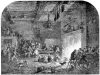

  
[Intangible Textual Heritage](../../index)  [Time](../index) 
[Index](index)  [Previous](crt12)  [Next](crt14) 

------------------------------------------------------------------------

[Buy this Book at
Amazon.com](https://www.amazon.com/exec/obidos/ASIN/0486233545/internetsacredte)

------------------------------------------------------------------------

*Christmas in Ritual and Tradition*, by Clement A. Miles, \[1912\], at
Intangible Textual Heritage

------------------------------------------------------------------------

## CHAPTER IX

## CHRISTMAS EVE AND THE TWELVE DAYS

> Christkind, Santa Klaus, and Knecht Ruprecht—Talking Animals and
> other Wonders of Christmas Eve—Scandinavian Beliefs about Trolls and
> the Return of the Dead—Traditional Christmas Songs in Eastern
> Europe—The Twelve Days, their Christian Origin and Pagan
> Superstitions—The Raging Host—Hints of Supernatural Visitors in
> England—The German *Frauen*—The Greek *Kallikantzaroi*.

[  
Click to enlarge](img/image18.jpg)  
  

CHRISTMAS EVE IN DEVONSHIRE—THE MUMMERS COMING IN

### Christmas Eve.

Christmas in the narrowest sense must be reckoned as beginning on the
evening of December 24. Though Christmas Eve is not much observed in
modern England, throughout the rest of Europe its importance so far as
popular customs are concerned is far greater than that of the Day
itself. Then in Germany the Christmas-tree is manifested in its glory;
then, as in the England of the past, the Yule log is solemnly lighted in
many lands; then often the most distinctive Christmas meal takes place.

We shall consider these and other institutions later; though they appear
first on Christmas Eve, they belong more or less to the Twelve Days as a
whole. Let us look first at the supernatural visitors, mimed by human
beings, who delight the minds of children, especially in Germany, on the
evening of December 24, and at the beliefs that hang around this most
solemn night of the year.

First of all, the activities of St. Nicholas are not confined to his own
festival; he often appears on Christmas Eve. We have already seen how he
is attended by various companions, including p.
230 Christ Himself, and how he comes
now vested as a bishop, now as a masked and shaggy figure. The names and
attributes of the Christmas and Advent visitors are rather confused, but
on the whole it may be said that in Protestant north Germany the
episcopal St. Nicholas and his Eve have been replaced by Christmas Eve
and the Christ Child, while the name Klas has become attached to various
unsaintly forms appearing at or shortly before Christmas.

We can trace a deliberate substitution of the Christ Child for St.
Nicholas as the bringer of gifts. In the early seventeenth century a
Protestant pastor is found complaining that parents put presents in
their children's beds and tell them that St. Nicholas has brought them.
“This,” he says, “is a bad custom, because it points children to the
saint, while yet we know that not St. Nicholas but the holy Christ Child
gives us all good things for body and soul, and He alone it is whom we
ought to call upon.” [10-1](crt22.htm#Note_10-1)

The ways in which the figure, or at all events the name, of Christ
Himself, is introduced into German Christmas customs, are often
surprising. The Christ Child, “Christkind,” so familiar to German
children, has now become a sort of mythical figure, a product of
sentiment and imagination working so freely as almost to forget the
sacred character of the original. Christkind bears little resemblance to
the Infant of Bethlehem; he is quite a tall child, and is often
represented by a girl dressed in white, with long fair hair. He hovers,
indeed, between the character of the Divine Infant and that of an angel,
and is regarded more as a kind of good fairy than as anything else.

In Alsace the girl who represents Christkind has her face “made up” with
flour, wears a crown of gold paper with lighted candles in it—a
parallel to the headgear of the Swedish Lussi; in one hand she holds a
silver bell, in the other, a basket of sweetmeats. She is followed by
the terrible Hans Trapp, dressed in a bearskin, with blackened face,
long beard, and threatening rod. He “goes for” the naughty children, who
are only saved by the intercession of
Christkind. [10-2](crt22.htm#Note_10-2)

In the Mittelmark the name of *de hêle* (holy) *Christ* is strangely
p. 231 given to a
skin- or straw-clad man, elsewhere called Knecht Ruprecht, Klas, or
Joseph. [10-3](crt22.htm#Note_10-3) In
the Ruppin district a man dresses up in white with ribbons, carries a
large pouch, and is called *Christmann* or *Christpuppe*. He is
accompanied by a *Schimmelreiter* and by other fellows who are attired
as women, have blackened faces, and are named *Feien* (we may see in
them a likeness to the Kalends maskers condemned by the early Church).
The procession goes round from house to house. The *Schimmelreiter* as
he enters has to jump over a chair; this done, the *Christpuppe* is
admitted. The girls present begin to sing, and the *Schimmelreiter*
dances with one of them. Meanwhile the *Christpuppe* makes the children
repeat some verse of Scripture or a hymn; if they know it well, he
rewards them with gingerbreads from his wallet; if not, he beats them
with a bundle filled with ashes. Then both he and the *Schimmelreiter*
dance and pass on. Only when they are gone are the *Feien* allowed to
enter; they jump wildly about and frighten the
children. [10-4](crt22.htm#Note_10-4)

Knecht Ruprecht, to whom allusion has already been made, is a prominent
figure in the German Christmas. On Christmas Eve in the north he goes
about clad in skins or straw and examines children; if they can say
their prayers perfectly he rewards them with apples, nuts and
gingerbreads; if not, he punishes them. In the Mittelmark, as we have
seen, a personage corresponding to him is sometimes called “the holy
Christ”; in Mecklenburg he is “rû Klas” (rough Nicholas—note his
identification with the saint); in Brunswick, Hanover, and Holstein
“Klas,” “Klawes,” “Klas Bûr” and “Bullerklas”; and in Silesia “Joseph.”
Sometimes he wears bells and carries a long staff with a bag of ashes at
the end—hence the name “Aschenklas” occasionally given to
him. [10-5](crt22.htm#Note_10-5) An
ingenious theory connects this aspect of him with the *polaznik* of the
Slavs, who on Christmas Day in Crivoscian farms goes to the hearth,
takes up the ashes of the Yule log and dashes them against the
cauldron-hook above so that sparks fly (see
 [X](crt14.htm#Chapter_X)). [10-6](crt22.htm#Note_10-6) As for the name “Ruprecht” the older
mythologists interpreted it as meaning “shining with glory,”
*hruodperaht*, and identified its owner with the god
Woden. [10-7](crt22.htm#Note_10-7) Dr.
Tille, however, regards him p. 232 as dating only from the seventeenth
century. [10-8](crt22.htm#Note_10-8) It
can hardly be said that any satisfactory account has as yet been given
of the origins of this personage, or of his relation to St. Nicholas,
Pelzmärte, and monstrous creatures like the *Klapperbock*.

In the south-western part of Lower Austria, both St. Nicholas—a proper
bishop with mitre, staff, and ring—and Ruprecht appear on Christmas
Eve, and there is quite an elaborate ceremonial. The children welcome
the saint with a hymn; then he goes to a table and makes each child
repeat a prayer and show his lesson-books. Meanwhile Ruprecht in a hide,
with glowing eyes and a long red tongue, stands at the door to overawe
the young people. Each child next kneels before the saint and kisses his
ring, whereupon Nicholas bids him put his shoes out-of-doors and look in
them when the clock strikes ten. After this the saint lays on the table
a rod dipped in lime, solemnly blesses the children, sprinkling them
with holy water, and noiselessly departs. The children steal out into
the garden, clear a space in the snow, and set out their shoes; when the
last stroke of ten has sounded they find them filled with nuts and
apples and all kinds of sweet things. [10-9](crt22.htm#Note_10-9)

In the Troppau district of Austrian Silesia, three figures go round on
Christmas Eve—Christkindel, the archangel Gabriel, and St. Peter—and
perform a little play before the presents they bring are given.
Christkindel announces that he has gifts for the good children, but the
bad shall feel the rod. St. Peter complains of the naughtiness of the
youngsters: they play about in the streets instead of going straight to
school; they tear up their lesson-books and do many other wicked things.
However, the children's mother pleads for them, and St. Peter relents
and gives out the presents. [10-10](crt22.htm#Note_10-10)

In the Erzgebirge appear St. Peter and Ruprecht, who is clad in skin and
straw, has a mask over his face, a rod, a chain round his body, and a
sack with apples, nuts, and other gifts; and a somewhat similar
performance is gone through. [10-11](crt22.htm#Note_10-11)

If we go as far east as Russia we find a parallel to the girl Christkind
in Kolyáda, a white-robed maiden driven about in a sledge from house to
house on Christmas Eve. The young people who attended her sang carols,
and presents were given p. 233 them in return. *Kolyáda* is the name for Christmas
and appears to be derived from *Kalendae*, which probably entered the
Slavonic languages by way of Byzantium. The maiden is one of those
beings who, like the Italian Befana, have taken their names from the
festival at which they appear. [10-12](crt22.htm#Note_10-12)

No time in all the Twelve Nights and Days is so charged with the
supernatural as Christmas Eve. Doubtless this is due to the fact that
the Church has hallowed the night of December 24-5 above all others in
the year. It was to the shepherds keeping watch over their flocks *by
night* that, according to the Third Evangelist, came the angelic message
of the Birth, and in harmony with this is the unique Midnight Mass of
the Roman Church, lending a peculiar sanctity to the hour of its
celebration. And yet many of the beliefs associated with this night show
a large admixture of paganism.

First, there is the idea that at midnight on Christmas Eve animals have
the power of speech. This superstition exists in various parts of
Europe, and no one can hear the beasts talk with impunity. The idea has
given rise to some curious and rather grim tales. Here is one from
Brittany:—

“Once upon a time there was a woman who starved her cat and dog. At
midnight on Christmas Eve she heard the dog say to the cat, ‘It is quite
time we lost our mistress; she is a regular miser. To-night burglars are
coming to steal her money; and if she cries out they will break her
head.’ ‘’Twill be a good deed,’ the cat replied. The woman in terror got
up to go to a neighbour's house; as she went out the burglars opened the
door, and when she shouted for help they broke her
head.” [10-13](crt22.htm#Note_10-13)

Again a story is told of a farm servant in the German Alps who did not
believe that the beasts could speak, and hid in a stable on Christmas
Eve to learn what went on. At midnight he heard surprising things. “We
shall have hard work to do this day week,” said one horse. “Yes, the
farmer's servant is heavy,” answered the other. “And the way to the
churchyard is long and steep,” said the first. The servant was buried
that day week. [10-14](crt22.htm#Note_10-14)

p. 234 It may well
have been the traditional association of the ox and ass with the
Nativity that fixed this superstition to Christmas Eve, but the
conception of the talking animals is probably pagan.

Related to this idea, but more Christian in form, is the belief that at
midnight all cattle rise in their stalls or kneel and adore the new-born
King. Readers of Mr. Hardy's “Tess” will remember how this is brought
into a delightful story told by a Wessex peasant. The idea is widespread
in England and on the Continent, [10-15](crt22.htm#Note_10-15) and has reached even the North American
Indians. Howison, in his “Sketches of Upper Canada,” relates that an
Indian told him that “on Christmas night all deer kneel and look up to
Great Spirit.” [10-16](crt22.htm#Note_10-16) A somewhat similar belief about bees was held
in the north of England: they were said to assemble on Christmas Eve and
hum a Christmas hymn. [10-17](crt22.htm#Note_10-17) Bees seem in folk-lore in general to be
specially near to humanity in their feelings.

It is a widespread idea that at midnight on Christmas Eve all water
turns to wine. A Guernsey woman once determined to test this; at
midnight she drew a bucket from the well. Then came a voice:—

“Toute l'eau se tourne en vin,  
Et tu es proche de ta fin.”  

She fell down with a mortal disease, and died before the end of the
year. In Sark the superstition is that the water in streams and wells
turns into blood, and if you go to look you will die within the
year. [10-18](crt22.htm#Note_10-18)

There is also a French belief that on Christmas Eve, while the genealogy
of Christ is being chanted at the Midnight Mass, hidden treasures are
revealed. [10-19](crt22.htm#Note_10-19)
In Russia all sorts of buried treasures are supposed to be revealed on
the evenings between Christmas and the Epiphany, and on the eves of
these festivals the heavens are opened, and the waters of springs and
rivers turn into wine. [10-20](crt22.htm#Note_10-20)

Another instance of the supernatural character of the night is found in
a Breton story of a blacksmith who went on working after the sacring
bell had rung at the Midnight Mass. To him p.
235 came a tall, stooping man with a
scythe, who begged him to put in a nail. He did so; and the visitor in
return bade him send for a priest, for this work would be his last. The
figure disappeared, the blacksmith felt his limbs fail him, and at
cock-crow he died. He had mended the scythe of the *Ankou*—Death the
reaper. [10-21](crt22.htm#Note_10-21)

In the Scandinavian countries simple folk have a vivid sense of the
nearness of the supernatural on Christmas Eve. On Yule night no one
should go out, for he may meet uncanny beings of all kinds. In Sweden
the Trolls are believed to celebrate Christmas Eve with dancing and
revelry. “On the heaths witches and little Trolls ride, one on a wolf,
another on a broom or a shovel, to their assemblies, where they dance
under their stones.... In the mount are then to be heard mirth and
music, dancing and drinking. On Christmas morn, during the time between
cock-crowing and daybreak, it is highly dangerous to be
abroad.” [10-22](crt22.htm#Note_10-22)

Christmas Eve is also in Scandinavian folk-belief the time when the dead
revisit their old homes, as on All Souls’ Eve in Roman Catholic lands.
The living prepare for their coming with mingled dread and desire to
make them welcome. When the Christmas Eve festivities are over, and
everyone has gone to rest, the parlour is left tidy and adorned, with a
great fire burning, candles lighted, the table covered with a festive
cloth and plentifully spread with food, and a jug of Yule ale ready.
Sometimes before going to bed people wipe the chairs with a clean white
towel; in the morning they are wiped again, and, if earth is found, some
kinsman, fresh from the grave, has sat there. Consideration for the dead
even leads people to prepare a warm bath in the belief that, like living
folks, the kinsmen will want a wash before their festal
meal. [96](crt24.htm#Footnote_96) Or
again beds were made ready for them while the living slept on straw. Not
always is it consciously the dead for whom these preparations are made,
sometimes they are said to be for the Trolls and sometimes even for
p. 236 the Saviour
and His angels. [10-24](crt22.htm#Note_10-24) (We may compare with this Christian idea the
Tyrolese custom of leaving some milk for the Christ Child and His
Mother [10-25](crt22.htm#Note_10-25) at
the hour of Midnight Mass, and a Breton practice of leaving food all
through Christmas night in case the Virgin should
come. [10-26](crt22.htm#Note_10-26) )

It is difficult to say how far the other supernatural beings—their name
is legion—who in Norway, Sweden, Denmark, and Iceland are believed to
come out of their underground hiding-places during the long dark
Christmas nights, were originally ghosts of the dead. Twenty years ago
many students would have accounted for them all in this way, but the
tendency now is strongly against the derivation of all supernatural
beings from ancestor-worship. Elves, trolls, dwarfs, witches, and other
uncanny folk—the beliefs about their Christmas doings are too many to
be treated here; readers of Danish will find a long and very interesting
chapter on this subject in Dr. Feilberg's
“Jul.” [10-27](crt22.htm#Note_10-27) I
may mention just one familiar figure of the Scandinavian Yule, Tomte
Gubbe, a sort of genius of the house corresponding very much to the
“drudging goblin” of Milton's “L'Allegro,” for whom the cream-bowl must
be duly set. He may perhaps be the spirit of the founder of the family.
At all events on Christmas Eve Yule porridge and new milk are set out
for him, sometimes with other things, such as a suit of small clothes,
spirits, or even tobacco. Thus must his goodwill be won for the coming
year. [10-28](crt22.htm#Note_10-28)

In one part of Norway it used to be believed that on Christmas Eve, at
rare intervals, the old Norse gods made war on Christians, coming down
from the mountains with great blasts of wind and wild shouts, and
carrying off any human being who might be about. In one place the memory
of such a visitation was preserved in the nineteenth century. The people
were preparing for their festivities, when suddenly from the mountains
came the warning sounds. “In a second the air became black, peals of
thunder echoed among the hills, lightning danced about the buildings,
and the inhabitants in the darkened rooms heard the clatter of hoofs and
the weird shrieks of the hosts of the
gods.” [10-29](crt22.htm#Note_10-29)

p. 237 The
Scandinavian countries, Protestant though they are, have retained many
of the outward forms of Catholicism, and the sign of the cross is often
used as a protection against uncanny visitors. The cross—perhaps the
symbol was originally Thor's hammer—is marked with chalk or tar or fire
upon doors and gates, is formed of straw or other material and put in
stables and cowhouses, or is smeared with the remains of the Yule candle
on the udders of the beasts—it is in fact displayed at every point open
to attack by a spirit of darkness. [10-30](crt22.htm#Note_10-30)

Christmas Eve is in Germany a time for auguries. Some of the methods
already noted on other days are practised upon it—for instance the
pouring of molten lead into water, the flinging of shoes, the pulling
out of pieces of wood, and the floating of nutshells—and there are
various others which it might be tedious to
describe. [10-31](crt22.htm#Note_10-31)

Among the southern Slavs if a girl wants to know what sort of husband
she will get, she covers the table on Christmas Eve, puts on it a white
loaf, a plate, and a knife, spoon, and fork, and goes to bed. At
midnight the spirit of her future husband will appear and fling the
knife at her. If it falls without injuring her she will get a good
husband and be happy, but if she is hurt she will die early. There is a
similar mode of divination for a young fellow. On Christmas Eve, when
everybody else has gone to church, he must, naked and in darkness, sift
ashes through a sieve. His future bride will then appear, pull him
thrice by the nose, and go away. [10-32](crt22.htm#Note_10-32)

In eastern Europe Christmas, and especially Christmas Eve, is the time
for the singing of carols called in Russian *Kolyádki*, and in other
Slav countries by similar names derived from
*Kalendae*. [10-33](crt22.htm#Note_10-33) More often than not these are without
connection with the Nativity; sometimes they have a Christian form and
tell of the doings of God, the Virgin and the saints, but frequently
they are of an entirely secular or even pagan character. Into some the
sun, moon, and stars and other natural objects are introduced, and they
seem to be based on myths to which a Christian appearance has been given
by a sprinkling of names of holy persons of the p.
238 Church. Here for instance is a
fragment from a Carpathian song:—

“A golden plough goes ploughing,  
And behind that plough is the Lord Himself.  
The holy Peter helps Him to drive,  
And the Mother of God carries the seed corn,  
Carries the seed corn, prays to the Lord God,  
‘Make, O Lord, the strong wheat to grow,  
The strong wheat and the vigorous corn!  
The stalks then shall be like
reeds!’” [10-34](crt22.htm#Note_10-34)
  

Often they contain wishes for the prosperity of the household and end
with the words, “for many years, for many years.” The Roumanian songs
are frequently very long, and a typical, oft-recurring refrain is:—

“This evening is a great evening,  
White flowers;  
Great evening of Christmas,  
White flowers.” [10-35](crt22.htm#Note_10-35)   

Sometimes they are ballads of the national life.

In Russia a carol beginning “Glory be to God in heaven, Glory!” and
calling down blessings on the Tsar and his people, is one of the most
prominent among the *Kolyádki*, and opens the singing of the songs
called *Podblyudnuiya*. “At the Christmas festival a table is covered
with a cloth, and on it is set a dish or bowl (*blyudo*) containing
water. The young people drop rings or other trinkets into the dish,
which is afterwards covered with a cloth, and then the *Podblyudnuiya*
Songs commence. At the end of each song one of the trinkets is drawn at
random, and its owner deduces an omen from the nature of the words which
have just been sung.” [10-36](crt22.htm#Note_10-36)

### The Twelve Days.

Whatever the limits fixed for the beginning and end of the Christmas
festival, its core is always the period between Christmas p. 239 Eve and the
Epiphany—the “Twelve Days.” [97](crt24.htm#Footnote_97) A cycle of feasts falls within this time, and
the customs peculiar to each day will be treated in calendarial order.
First, however, it will be well to glance at the character of the Twelve
Days as a whole, and at the superstitions which hang about the season.
So many are these superstitions, so “bewitched” is the time, that the
older mythologists not unnaturally saw in it a Teutonic festal season,
dating from pre-Christian days. In point of fact it appears to be simply
a creation of the Church, a natural linking together of Christmas and
Epiphany. It is first mentioned as a festal tide by the eastern Father,
Ephraem Syrus, at the end of the fourth century, and was declared to be
such by the western Council of Tours in
567. [10-37](crt22.htm#Note_10-37)

While Christmas Eve is the night *par excellence* of the supernatural,
the whole season of the Twelve Days is charged with it. It is hard to
see whence Shakespeare could have got the idea which he puts into the
mouth of Marcellus in “Hamlet”:—

“Some say that ever ‘gainst that season comes  
Wherein our Saviour's birth is celebrated,  
The bird of dawning singeth all night long;  
And then, they say, no spirit dare stir
abroad;  
The nights are wholesome; then no planets
strike,  
No fairy takes, nor witch hath power to charm,  
So hallow'd and so gracious is the
time.” [10-38](crt22.htm#Note_10-38)
  

Against this is the fact that in folk-lore Christmas is a quite
peculiarly uncanny time. Not unnatural is it that at this midwinter
season of darkness, howling winds, and raging storms, men should have
thought to see and hear the mysterious shapes and voices of dread beings
whom the living shun.

Throughout the Teutonic world one finds the belief in a “raging p. 240 host” or “wild
hunt” or spirits, rushing howling through the air on stormy nights. In
North Devon its name is “Yeth (heathen)
hounds”; [10-40](crt22.htm#Note_10-40)
elsewhere in the west of England it is called the “Wish
hounds.” [10-41](crt22.htm#Note_10-41)
It is the train of the unhappy souls of those who died unbaptized, or by
violent hands, or under a curse, and often Woden is their
leader. [10-42](crt22.htm#Note_10-42)
At least since the seventeenth century this “raging host” (*das wüthende
Heer*) has been particularly associated with Christmas in German
folk-lore, [10-43](crt22.htm#Note_10-43) and in Iceland it goes by the name of the
“Yule host.” [10-44](crt22.htm#Note_10-44)

In Guernsey the powers of darkness are supposed to be more than usually
active between St. Thomas's Day and New Year's Eve, and it is dangerous
to be out after nightfall. People are led astray then by Will o’ the
Wisp, or are preceded or followed by large black dogs, or find their
path beset by white rabbits that go hopping along just under their
feet. [10-45](crt22.htm#Note_10-45)

In England there are signs that supernatural visitors were formerly
looked for during the Twelve Days. First there was a custom of cleansing
the house and its implements with peculiar care. In Shropshire, for
instance, “the pewter and brazen vessels had to be made so bright that
the maids could see to put their caps on in them—otherwise the fairies
would pinch them, but if all was perfect, the worker would find a coin
in her shoe.” Again in Shropshire special care was taken to put away any
suds or “back-lee” for washing purposes, and no spinning might be done
during the Twelve Days. [10-46](crt22.htm#Note_10-46) It was said elsewhere that if any flax were
left on the distaff, the Devil would come and cut
it. [10-47](crt22.htm#Note_10-47)

The prohibition of spinning may be due to the Church's hallowing of the
season and the idea that all work then was wrong. This churchly
hallowing may lie also at the root of the Danish tradition that from
Christmas till New Year's Day nothing that runs round should be set in
motion, [10-48](crt22.htm#Note_10-48)
and of the German idea that no thrashing must be done during the Twelve
Days, or all the corn within hearing will spoil. The expectation of
uncanny visitors in the English traditions calls, however, for special
attention; it is perhaps because of their coming that the house must be
left spotlessly clean and with as little as possible about on which they
can work mischief. [10-49](crt22.htm#Note_10-49) Though I know of no distinct English belief
in the p. 241 return of the family dead at Christmas, it may be
that the fairies expected in Shropshire were originally ancestral
ghosts. Such a derivation of the elves and brownies that haunt the
hearth is very probable. [10-50](crt22.htm#Note_10-50)

The belief about the Devil cutting flax left on the distaff links the
English superstitions to the mysterious *Frau* with various names, who
in Germany is supposed to go her rounds during the Twelve Nights. She
has a special relation to spinning, often punishing girls who leave
their flax unspun. In central Germany and in parts of Austria she is
called Frau Holle or Holda, in southern Germany and Tyrol Frau Berchta
or Perchta, in the north down to the Harz Mountains Frau Freen or Frick,
or Fru Gode or Fru Harke, and there are other names
too. [10-51](crt22.htm#Note_10-51)
Attempts have been made to dispute her claim to the rank of an old
Teutonic goddess and to prove her a creation of the Middle Ages, a
representative of the crowd of ghosts supposed to be specially near to
the living at Christmastide. [10-52](crt22.htm#Note_10-52) It is questionable whether she can be thus
explained away, and at the back of the varying names, and much overlaid
no doubt with later superstitions, there may be a traditional goddess
corresponding to that old divinity Frigg to whom we owe the name of
Friday. The connection of Frick with Frigg is very probable, and Frick
shares characteristics with the other
*Frauen*. [10-53](crt22.htm#Note_10-53)

All are connected with spinning and spinsters (in the literal sense).
Fru Frick or Freen in the Uckermark and the northern Harz permits no
spinning during the time when she goes her rounds, and if there are lazy
spinsters she soils the unspun flax on their distaff. In like manner do
Holda, Harke, Berchta, and Gode punish lazy
girls. [10-54](crt22.htm#Note_10-54)

The characters of the *Frauen* can best be shown by the things told of
them in different regions. They are more dreaded than loved, but if
severe in their chastisements they are also generous in rewarding those
who do them service.

Frau Gaude (also called Gode, Gaue, or Wode) is said in Mecklenburg to
love to drive through the village streets on the Twelve Nights with a
train of dogs. Wherever she finds a street-door open she sends a little
dog in. Next morning he wags his p. 242 tail at the inmates and whines, and will not be
driven away. If killed, he turns into a stone by day; this, though it
may be thrown away, always returns and is a dog again by night. All
through the year he whines and brings ill luck upon the house; so people
are careful to keep their street-doors shut during the Twelve
Nights. [10-55](crt22.htm#Note_10-55)

Good luck, however, befalls those who do Frau Gaude a service. A man who
put a new pole to her carriage was brilliantly repaid—the chips that
fell from the pole turned to glittering gold. Similar stories of golden
chips are told about Holda and
Berchta. [10-56](crt22.htm#Note_10-56)

A train of dogs belongs not only to Frau Gaude but also to Frau Harke;
with these howling beasts they go raging through the air by
night. [10-57](crt22.htm#Note_10-57)
The *Frauen* in certain aspects are, indeed, the leaders of the “Wild
Host.”

Holda and Perchta, as some strange stories show, are the guides and
guardians of the *heimchen* or souls of children who have died
unbaptized. In the valley of the Saale, so runs a tale, Perchta, queen
of the *heimchen*, had her dwelling of old, and at her command the
children watered the fields, while she worked with her plough. But the
people of the place were ungrateful, and she resolved to leave their
land. One night a ferryman beheld on the bank of the Saale a tall,
stately lady with a crowd of weeping children. She demanded to be
ferried across, and the children dragged a plough into the boat, crying
bitterly. As a reward for the ferrying, Perchta, mending her plough,
pointed to the chips. The man grumblingly took three, and in the morning
they had turned to gold-pieces. [10-58](crt22.htm#Note_10-58)

Holda, whose name means “the kindly one,” is the most friendly of the
*Frauen*. In Saxony she brings rewards for diligent spinsters, and on
every New Year's Eve, between nine and ten o'clock, she drives in a
carriage full of presents through villages where respect has been shown
to her. At the crack of her whip the people come out to receive her
gifts. In Hesse and Thuringia she is imagined as a beautiful woman clad
in white with long golden hair, and, when it snows hard, people say,
“Frau Holle is shaking her
featherbed.” [10-59](crt22.htm#Note_10-59)

p. 243 More of a
bugbear on the whole is Berchte or Perchte (the name is variously
spelt). She is particularly connected with the Eve of the Epiphany, and
it is possible that her name comes from the old German *giper(c)hta
Na(c)ht*, the bright or shining night, referring to the manifestation of
Christ's glory. [10-60](crt22.htm#Note_10-60) In Carinthia the Epiphany is still called
*Berchtentag*. [10-61](crt22.htm#Note_10-61)

Berchte is sometimes a bogey to frighten children. In the mountains
round Traunstein children are told on Epiphany Eve that if they are
naughty she will come and cut their stomachs
open. [10-62](crt22.htm#Note_10-62) In
Upper Austria the girls must finish their spinning by Christmas; if Frau
Berch finds flax still on their distaffs she will be angered and send
them bad luck. [10-63](crt22.htm#Note_10-63)

In the Orlagau (between the Saale and the Orle) on the night before
Twelfth Day, Perchta examines the spinning-rooms and brings the spinners
empty reels with directions to spin them full within a very brief time;
if this is not done she punishes them by tangling and befouling the
flax. She also cuts open the body of any one who has not eaten *zemmede*
(fasting fare made of flour and milk and water) that day, takes out any
other food he has had, fills the empty space with straw and bricks, and
sews him up again. [10-64](crt22.htm#Note_10-64) And yet, as we have seen, she has a kindly
side—at any rate she rewards those who serve her—and in Styria at
Christmas she even plays the part of Santa Klaus, hearing children
repeat their prayers and rewarding them with nuts and
apples. [10-65](crt22.htm#Note_10-65)

There is a charming Tyrolese story about her. At midnight on Epiphany
Eve a peasant—not too sober—suddenly heard behind him “a sound of many
voices, which came on nearer and nearer, and then the Berchtl, in her
white clothing, her broken ploughshare in her hand, and all her train of
little people, swept clattering and chattering close past him. The least
was the last, and it wore a long shirt which got in the way of its
little bare feet, and kept tripping it up. The peasant had sense enough
left to feel compassion, so he took his garter off and bound it for a
girdle round the infant, and then set it again on its way. When the
Berchtl saw what he had done, she turned back and thanked him, and told
him that in return for his compassion his children should never come to
want.” [10-66](crt22.htm#Note_10-66)

p. 244 In Tyrol,
by the way, it is often said that the Perchtl is Pontius Pilate's wife,
Procula. [10-67](crt22.htm#Note_10-67)
In the Italian dialects of south Tyrol the German Frau Berchta has been
turned into *la donna Berta*. [10-68](crt22.htm#Note_10-68) If one goes further south, into Italy itself,
one meets with a similar being, the Befana, whose name is plainly
nothing but a corruption of *Epiphania*. She is so distinctly a part of
the Epiphany festival that we may leave her to be considered later.

Of all supernatural Christmas visitors, the most vividly realized and
believed in at the present day are probably the Greek *Kallikantzaroi*
or *Karkantzaroi*. [10-69](crt22.htm#Note_10-69) They are the terror of the Greek peasant
during the Twelve Days; in the soil of his imagination they flourish
luxuriantly, and to him they are a very real and living nuisance.

Traditions about the *Kallikantzaroi* vary from region to region, but in
general they are half-animal, half-human monsters, black, hairy, with
huge heads, glaring red eyes, goats’ or asses’ ears, blood-red tongues
hanging out, ferocious tusks, monkeys’ arms, and long curved nails, and
commonly they have the foot of some beast. “From dawn till sunset they
hide themselves in dark and dank places ... but at night they issue
forth and run wildly to and fro, rending and crushing those who cross
their path. Destruction and waste, greed and lust mark their course.”
When a house is not prepared against their coming, “by chimney and door
alike they swarm in, and make havoc of the home; in sheer wanton
mischief they overturn and break all the furniture, devour the Christmas
pork, befoul all the water and wine and food which remains, and leave
the occupants half dead with fright or violence.” Many like or far worse
pranks do they play, until at the crowing of the third cock they get
them away to their dens. The signal for their final departure does not
come until the Epiphany, when, as we saw in  [IV](crt07.htm#Chapter_IV),
the “Blessing of the Waters” takes place. Some of the hallowed water is
put into vessels, and with these and with incense the priests sometimes
make a round of the village, sprinkling the people and their houses. The
fear of the p. 245 *Kallikantzaroi* at this purification is expressed
in the following lines:—

“Quick, begone! we must begone,  
Here comes the pot-bellied priest,  
With his censer in his hand  
And his sprinkling-vessel too;  
He has purified the streams  
And he has polluted us.”  

Besides this ecclesiastical purification there are various Christian
precautions against the *Kallikantzaroi*—*e.g.*, to mark the house-door
with a black cross on Christmas Eve, the burning of incense and the
invocation of the Trinity—and a number of other means of aversion: the
lighting of the Yule log, the burning of something that smells strong,
and—perhaps as a peace-offering—the hanging of pork-bones, sweetmeats,
or sausages in the chimney.

Just as men are sometimes believed to become vampires temporarily during
their lifetime, so, according to one stream of tradition, do living men
become *Kallikantzaroi*. In Greece children born at Christmas are
thought likely to have this objectionable characteristic as a punishment
for their mothers’ sin in bearing them at a time sacred to the Mother of
God. In Macedonia [10-70](crt22.htm#Note_10-70) people who have a “light” guardian angel
undergo the hideous transformation.

Many attempts have been made to account for the *Kallikantzaroi*.
Perhaps the most plausible explanation of the outward form, at least, of
the uncanny creatures, is the theory connecting them with the
masquerades that formed part of the winter festival of Dionysus and are
still to be found in Greece at Christmastide. The hideous bestial
shapes, the noise and riot, may well have seemed demoniacal to simple
people slightly “elevated,” perhaps, by Christmas feasting, while the
human nature of the maskers was not altogether
forgotten. [10-71](crt22.htm#Note_10-71) Another theory of an even more prosaic
character has been propounded—“that the Kallikantzaroi are nothing more
than established nightmares, limited like indigestion to the twelve days
of feasting. This view is p. 246 taken by Allatius, who says that a Kallikantzaros
has all the characteristics of nightmare, rampaging abroad and jumping
on men's shoulders, then leaving them half senseless on the
ground.” [10-72](crt22.htm#Note_10-72)

Such theories are ingenious and suggestive, and may be true to a certain
degree, but they hardly cover all the facts. It is possible that the
*Kallikantzaroi* may have some connection with the departed; they
certainly appear akin to the modern Greek and Slavonic vampire, “a
corpse imbued with a kind of half-life,” and with eyes gleaming like
live coals. [10-73](crt22.htm#Note_10-73) They are, however, even more closely related
to the werewolf, a man who is supposed to change into a wolf and go
about ravening. It is to be noted that “man-wolves” (λυκανθρωποι) is the
very name given to the *Kallikantzaroi* in southern Greece, and that the
word *Kallikantzaros* itself has been conjecturally derived by Bernhard
Schmidt from two Turkish words meaning “black” and
“werewolf.” [10-74](crt22.htm#Note_10-74) The connection between Christmas and
werewolves is not confined to Greece. According to a belief not yet
extinct in the north and east of Germany, even where the real animals
have long ago been extirpated, children born during the Twelve Nights
become werewolves, while in Livonia and Poland that period is the
special season for the werewolf's
ravenings. [10-75](crt22.htm#Note_10-75)

Perhaps on no question connected with primitive religion is there more
uncertainty than on the ideas of early man about the nature of animals
and their relation to himself and the world. When we meet with
half-animal, half-human beings we must be prepared to find much that is
obscure.

With the *Kallikantzaroi* may be compared some goblins of the Celtic
imagination; especially like is the Manx *Fynnodderee* (lit. “the
hairy-dun one”), “something between a man and a beast, being covered
with black shaggy hair and having fiery eyes,” and prodigiously
strong. [10-76](crt22.htm#Note_10-76)
The Russian *Domovy* or house-spirit is also a hirsute
creature, [10-77](crt22.htm#Note_10-77)
and the Russian *Ljeschi*, goat-footed woodland sprites, are, like the
*Kallikantzaroi*, supposed to be got rid of by the “Blessing of the
Waters” at the Epiphany. [10-78](crt22.htm#Note_10-78) Some of the monstrous German figures already
dealt with here p. 247 bear strong resemblances to the Greek demons. And,
of course, on Greek ground one cannot help thinking of Pan and the
Satyrs and Centaurs. [98](crt24.htm#Footnote_98)

p. 248 p. 249 p. 250 p. 251 

------------------------------------------------------------------------

------------------------------------------------------------------------

[Next: Chapter X. The Yule Log](crt14)
