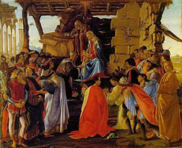

  
[Intangible Textual Heritage](../../index)  [Time](../index) 

------------------------------------------------------------------------

[Buy this Book at
Amazon.com](https://www.amazon.com/exec/obidos/ASIN/0486233545/internetsacredte)

------------------------------------------------------------------------

<table width="75%">
<colgroup>
<col style="width: 50%" />
<col style="width: 50%" />
</colgroup>
<tbody>
<tr class="odd">
<td width="50%" data-valign="TOP"></td>
<td width="50%" data-valign="CENTER"><h1 id="christmas-in-ritual-and-tradition" data-align="CENTER">Christmas in Ritual and Tradition</h1>
<h2 id="by-clement-a.-miles" data-align="CENTER">by Clement A. Miles</h2>
<h4 id="section" data-align="CENTER">[1912]</h4></td>
</tr>
</tbody>
</table>

------------------------------------------------------------------------

[Contents](#contents)    [Start Reading](crt00)

------------------------------------------------------------------------

|                                                                                                                           |
|---------------------------------------------------------------------------------------------------------------------------|
|  |

This is a study of the origin of modern Christmas in ancient pagan
traditions, how the festival was adopted by Christianity, and its
evolution through history. Miles includes descriptions of folk-lore
related to the Christmas season from a wide range of European countries,
including an extensive collection of folk songs. It is important to
learn about these traditions to remind ourselves that before Christmas
became a hyper-commercialized festival of consumption, it was a joyous
celebration of renewal and friendship.

------------------------------------------------------------------------

 [Title Page](crt00)  
[Preface](crt01)  
[Contents](crt02)  
[Illustrations](crt03)  
[Chapter I. Introduction](crt04)  

### Part I. The Christian Feast

[Chapter II. Christmas Poetry (I)](crt05)  
[Chapter III. Christmas Poetry (II)](crt06)  
[Chapter IV. Christmas in Liturgy and Popular Devotion](crt07)  
[Chapter V. Christmas Drama](crt08)  
[Postscript](crt09)  

### Part II. Pagan Survivals

[Chapter VI. Pre-Christian Winter Festivals](crt10)  
[Chapter VII. All Hallow Tide to Martinmas](crt11)  
[Chapter VIII. St. Clement to St. Thomas](crt12)  
[Chapter IX. Christmas Eve and the Twelve Days](crt13)  
[Chapter X. The Yule Log](crt14)  
[Chapter XI. The Christmas-Tree, Decorations, and Gifts](crt15)  
[Chapter XII. Christmas Feasting and Sacrificial Survivals](crt16)  
[Chapter XIII. Masking, the Mummers' Play, the Feast of Fools, and the
Boy Bishop](crt17)  
[Chapter XIV. St. Stephen's, St. Johns, and Holy Innocents'
Days](crt18)  
[Chapter XV. New Year's Day](crt19)  
[Chapter XVI. Epiphany to Candlemas](crt20)  
[Conclusion](crt21)  
[Notes and Bibliography](crt22)  
[Index](crt23)  
[Footnotes](crt24)  
