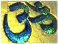

[Sacred Time index](index)  [Timeline of Sacred Texts](timeline) 

------------------------------------------------------------------------

# Origin of Major Religions

This table indicates the approximate date each of the twelve major world
religions began, along with the traditional dates for the birth and
death of its founder (if applicable). You can click on each religions'
link to start reading about it.

This list of twelve world religions is, of course, an
oversimplification. Also, keep in mind that there are religions (such as
the belief systems of Native American and Australian Aborigine peoples)
that go back much further than Hinduism, and there have been several
large religions that have started since Baha'i.

The 'Common Era' refers to 1 A.D. CE=Common Era, BCE=Before Common Era

date

Near East

India

China/Japan

1000+ BCE

[  
Judaism](../jud/index):  
Moses 1500-1350 BCE

[  
Hinduism](../hin/index):  
2000 BCE

 

600 BCE

[Zoroastrianism](../zor/index):  
Zoroaster 628-527 BCE

[Jainism](../jai/index):  
Mahavira 599-527 BCE  
[  
Buddhism](../bud/index):  
Buddha 563-483 BCE  

[  
Taoism](../tao/index):  
Lao Tse 580-500 BCE  
[Confucianism](../cfu/index):  
Confucius 551-479 BCE

100 CE

[  
Christianity](../chr/index):  
Jesus 1-33 CE

 

[  
Shinto](../shi/index):  
100 CE

600 CE

[  
Islam](../isl/index):  
Muhammad 570-632 CE

 

 

1500 CE

 

[Sikhism](../skh/index):  
Guru Nanak 1469-1538 CE

 

1900 CE

[Baha'i](../bhi/index):  
Baha'u'llah 1817-1892 CE

 

 

------------------------------------------------------------------------

This page © copyright J.B. Hare, 1997-2001.

[Collection copyright](../sect103) © 1997-2001 J.B. Hare. HTML markup
Copyright © 1997-2001 J.B. Hare except where noted. All files at this
site named **index.htm** or **index.html** are Copyright © 1997-2001
J.B. Hare except where noted. All graphics Copyright © 1997-2001 J.B.
Hare, all rights reserved (except where noted).
