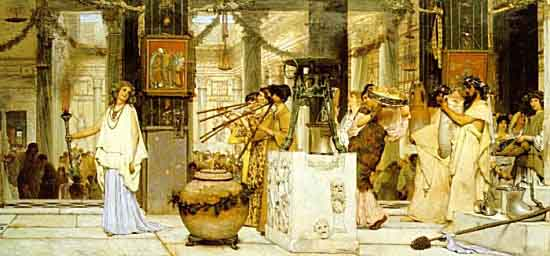

  
[Intangible Textual Heritage](../../index)  [Sacred Time](../index) 

------------------------------------------------------------------------

# The Stories of the Months and Days

## By Reginald C. Couzens

#### \[1923, Copyright not renewed\]

------------------------------------------------------------------------

[Title Page](smd00)  
[Contents](smd01)  
[Introduction](smd02)  
[Chapter I. January--The Month of Janus](smd03)  
[Chapter II. February--The Month of Purification](smd04)  
[Chapter III. March--The Month of Mars](smd05)  
[Chapter IV. April--The Month of Venus](smd06)  
[Chapter V. May--The Month of Maia](smd07)  
[Chapter VI. June--The Month of Juno](smd08)  
[Chapter VII. July--The Month of Julius Caesar](smd09)  
[Chapter VIII. August--The Month of Augustus](smd10)  
[Chapter IX. September--The Seventh Month](smd11)  
[Chapter X. October--The Eighth Month](smd12)  
[Chapter XI. November--The Ninth Month](smd13)  
[Chapter XII. December--The Tenth Month](smd14)  
[Chapter XIII. Stories of the Days](smd15)  
[Chapter XIV. Sunday--The Day of the Sun](smd16)  
[Chapter XV. Monday--The Day of the Moon](smd17)  
[Chapter XVI. Tuesday--The Day of Tiu](smd18)  
[Chapter XVII. Wednesday--The Day of Woden](smd19)  
[Chapter XVIII. Thursday--The Day of Thor](smd20)  
[Chapter XIX. Friday--The Day of Freya](smd21)  
[Chapter XX. Saturday--The Day of Saturn](smd22)  
[Chapter XXI. The Meaning of the Ancient Myths](smd23)  
[Chapter XXII. Notes on Certain Days](smd24)  
