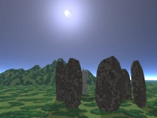

# Intangible Textual Heritage: Traditions

 

### Traditions

------------------------------------------------------------------------

[DNA](dna/index.md)  
[  
   ](neu/index)[Arthurian](neu/eng/index.htm#arthurian.md)  
   [  
   ](neu/celt/index)[Kalevala](neu/index.htm#finland.md)  
   

  
