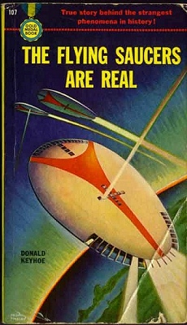

  
[Intangible Textual Heritage](../../index)  [UFOs](../index.md) 

------------------------------------------------------------------------

[Buy this Book at
Amazon.com](https://www.amazon.com/exec/obidos/ASIN/B002E9IO12/internetsacredte.md)

------------------------------------------------------------------------

<table width="75%">
<colgroup>
<col style="width: 50%" />
<col style="width: 50%" />
</colgroup>
<tbody>
<tr class="odd">
<td width="50%" data-valign="TOP"></td>
<td width="50%" data-valign="CENTER"><h1 id="the-flying-saucers-are-real" data-align="CENTER">The Flying Saucers Are Real</h1>
<h3 id="by-donald-keyhoe" data-align="CENTER">by Donald Keyhoe</h3>
<h3 id="section" data-align="CENTER">[1950]</h3></td>
</tr>
</tbody>
</table>

------------------------------------------------------------------------

[Contents](#contents)    [Start Reading](fsar00.md)    [Page
Index](pageidx)    [Text \[Zipped\]](fsar.txt.gz.md)

------------------------------------------------------------------------

|                                                                                                                           |
|---------------------------------------------------------------------------------------------------------------------------|
|  |

This was one of the first books published about the UFO phenomena. We
are fortunate that it ended up in the public domain.

It is a template for much of what would follow: the paranoia, the
government disinformation, the inescapable conclusion that the saucers
are *not of this earth*. Keyhoe, with his spare, matter of fact writing
style, which also conveys a profound sense of wonder, has to be the
prototype for the deadpan Fox Mulder of the X-Files.

On one hand we can see the birth of a key modern mythology. On the
other, there is a body of almost naive evidence in this text unpolluted
by that very mythology. The case studies are real. The witnesses were
highly reliable. These cases are still unexplained.

------------------------------------------------------------------------

 [Title Page](fsar00.md)  
[Author's Note](fsar01.md)  
[Chapter I](fsar02.md)  
[Chapter II](fsar03.md)  
[Chapter III](fsar04.md)  
[Chapter IV](fsar05.md)  
[Chapter V](fsar06.md)  
[Chapter VI](fsar07.md)  
[Chapter VII](fsar08.md)  
[Chapter VIII](fsar09.md)  
[Chapter IX](fsar10.md)  
[Chapter X](fsar11.md)  
[Chapter XI](fsar12.md)  
[Chapter XII](fsar13.md)  
[Chapter XIII](fsar14.md)  
[Chapter XIV](fsar15.md)  
[Chapter XV](fsar16.md)  
[Chapter XVI](fsar17.md)  
[Chapter XVII](fsar18.md)  
[Chapter XVIII](fsar19.md)  
[Chapter XIX](fsar20.md)  
[Chapter XX](fsar21.md)  
