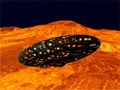

  
[Intangible Textual Heritage](../../index)  [UFOs](../index.md) 
[Index](index)  [Previous](idtc01)  [Next](idtc03.md) 

------------------------------------------------------------------------

  
*In Days To Come*, by Ashtar (Ethel P. Hill), \[1957\], at Intangible
Textual Heritage

------------------------------------------------------------------------

p. 17

### INTRODUCTION

*To Our Friends on the Planet Shan—Greetings!*

Our presence and our purpose grow increasingly clear to all unbiased and
unprejudiced people of your earth and thousands eagerly await our
visible appearance. While there is ample ground for the belief that we
are able to perform what to you appears as miracles, we wish it clearly
understood we have nothing in common with charlatans performing
legerdemain tricks, either for purposes of entertainment or to "prove"
our reality. Every move we make is in pursuance of a well considered
plan. I speak for all of us who have embarked upon this somewhat
thankless task of rendering assistance to beleaguered dwellers on the
planet Shan.

It would be quite a relief if we could make a simultaneous landing on
all portions of your globe (which I might remark is entirely feasible at
this very moment!) and, employing etheric forces in the use of which we
are experts, put an end to the jangle of incongruous and irreconcilable
factions now precluding all possibility of a united effort toward peace.
Our instructions and our principles prevent our taking such a course.

p. 18

A predominance of resolution by the inhabitants themselves must precede
our entrance on the scene en masse to use our superior powers in
augmenting those possessed by mortals at this time. Yes, I most
certainly do refer to the H-bomb (and other highly dangerous
explosives.) It is one thing to compound and to explode such a hellish
contrivance but where is the mortal who has solved the problem of
*preventing* its explosion or nullifying its deadly effect? No such
person exists on the planet Shan! How dare they release a force of such
magnitude without the slightest idea how to control it? None but an
infant intellect would conceive of such an insane procedure! Have they
seriously considered the resulting phenomena in Nature's vast domain?

Many otherwise intelligent mortals view the eccentricities exhibited by
the Nature forces as outside mortal jurisdiction, believing them to be
dictated by Divinity Itself! They constantly set waves of destructive
thoughts and feeling in motion. Joining like disturbing vibrations, they
travel untold distances always creating much havoc in the ethers. Do you
suppose these discords, generated by you and millions like you, have no
effect on inanimate forces? What you term "disasters" seldom occur on
our planets. We have eliminated the causes. When the preponderance of
desire and action is heavily weighted in favor of constituents
inevitably causing

p. 19

warfare in realms visible or invisible, how may those responsible hope
to escape its horrors? If you feel you have escaped this pitfall and
promoted peace in every way, I would ask you one question. In your quest
for peace (at any price?) have you trodden under foot principles which
are indispensable adjuncts of true Peace?

One thing I would make crystal clear! We Space Men, in whatever capacity
we may temporarily serve, are irrevocably pledged by the most solemn of
oaths to abide by those Universal Laws which alone can preserve life on
every level of conscious existence. To accept or condone any variance
from these fixed and unchangeable codes governing all honorable
behavior, would be to forfeit privileges we have earned through eons of
unremitting effort. We will have no part in any form of "synthetic
peace!" It must be genuine, unalloyed, incapable of dissimulation.

Before discontinuing I feel impelled to add one word of counsel. Make
your own life conform as nearly as possible with the matchless teachings
of One who humbled Himself to contact mortals in a physical
manifestation. Any likeness to Him will enable us to recognize your
legitimate claim to our special attention and assistance.

As future friends and co-workers in the service of your coming King of
Kings, we salute you and

p. 20

proffer our utmost devotion in your liberation from all who seek to
ensnare you and bind you to their fearsome juggernaut of destructive
domination.

 

WE COME AS YOUR DEFENDERS AND DELIVERERS!

WE COME AT THE URGENT REQUEST OF YOUR HEAVENLY FATHER TO RELEASE YOU
FROM INSUFFERABLE BONDAGE. MY LOVE AND MY BLESSINGS!

(Signed) ASHTAR

|                                                                                                   |
|---------------------------------------------------------------------------------------------------|
| Commander of ten million Space Men, now occupying bases established within range of your planet.. |

 

 

------------------------------------------------------------------------

[Next: Chapter I](idtc03.md)
