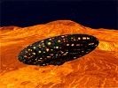

  
[Intangible Textual Heritage](../../index)  [UFOs](../index.md) 
[Index](index)  [Previous](idtc12)  [Next](idtc14.md) 

------------------------------------------------------------------------

  
*In Days To Come*, by Ashtar (Ethel P. Hill), \[1957\], at Intangible
Textual Heritage

------------------------------------------------------------------------

p. 65

### CHAPTER XI

A definite change has come over the minds and hearts of many people in
this and, to a lesser extent, other countries. Where, heretofore they
viewed the appearance of ourselves in our Space Ships in the light of a
curious phenomenon to be regarded with suspicion or shrugged off as
[irrelevant](errata.htm#13.md) to current affairs, they are now seriously
weighing our possible involvement in any coming conflict.

I am taking this means to advise you that most assuredly we shall
[intervene](errata.htm#14.md) to protect this or any country on the planet
Shan which places its trust in God Almighty and His Son who is His
personal representative on this globe.

We have been asked to explain the type of cooperation we ask of you. The
following suggestions may furnish a clue to our needs. Others will occur
to you as you ponder upon the situation in your locality.

Acquire as much information as possible from all reliable sources,
refusing to give credence to any doubts cast upon our sincerity and our
ability to carry out orders we receive from our Commander-in-Chief.

p. 66

Without being obtrusively insistent, pass on such information through
every channel open to you. It is imperative that the public be alerted
to our presence and its purpose. We might remark that treating it as
"news" rather than placing it in a religious category would avoid
disapproval in some quarters.

Use the telephone, private correspondence and casual conversations with
friends, or even strangers, to promote a wholesome interest in the
subject . . . tactfully leaving the impression that to deny our
existence or doubt our friendly purpose is out of date.

Encourage the forming of space clubs or small groups to meet at stated
intervals for discussion of the latest news available.

Stress the fact that our first urgent objective must be the removal of
the causes necessitating illegitimate use of newly apprehended forces
capable of completely disintegrating this planet and doing irreparable
damage to *all forms* of living substance in close proximity thereto. We
know the extremity reached in the downward course of power-crazed
potentates! Under no other circumstances would we have been entreated to
undertake our present mission or empowered to intervene and prevent the
extermination of the inhabitants of Shan.

As the opportunity occurs, let your friends know we do not come as
adventurers seeking excitement, nor

p. 67

as scientists in quest of fresh knowledge! What could we learn in your
laboratories with their passé equipment, or what satisfaction find in
the hurly-burly of senseless clashes in mental or physical arenas of
action?

Perhaps it would be well to again emphasize the fact that your inmost
thoughts and desires, as well as your acts, create either a very real
barrier, or point of contact, according as you reject our way of life
(based on the true Christ Principles) or harmonize with our concept of
constructive and progressive living. We have passed through a long and
tedious process of re-appraisal and re-evaluation of all Life has to
offer in the final analysis, since first we were favored with wise and
patient Teachers from "Outer Space."

What they did for us ages ago, we now offer to do for you! It is against
every tenet in our code of honor to attempt to force you to accept our
services in the capacity of Teachers. Yet this I can promise in all
sincerity! Should our offer of genuine, practical assistance be welcome
and the necessary preliminary steps be taken, we can and will joyfully
pass on to you the knowledge we possess. Not only will we do this, but
we will "loan" you many of our most expert and experienced teachers in
every branch of art and industry to initiate you into the secrets we
have tried out and proven one hundred percent effective in

p. 68

creating a world of incredible beauty and endless delight.

Until you have attained some reasonable concept of such a planet and
such a life, I fear it would be unwise to extend to you an invitation to
visit us in my home on Venus!

My Love!             
*ASHTAR*

------------------------------------------------------------------------

[Next: Chapter XII](idtc14.md)
