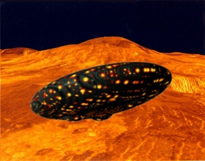

  
[Intangible Textual Heritage](../../index)  [UFOs](../index.md) 

------------------------------------------------------------------------

<table width="75%">
<colgroup>
<col style="width: 50%" />
<col style="width: 50%" />
</colgroup>
<tbody>
<tr class="odd">
<td width="50%" data-valign="TOP"> 
UFO Approaches Venus, Copyright © 2008 J.B. Hare, All Rights Reserved</td>
<td width="50%" data-valign="CENTER"><h1 id="in-days-to-come" data-align="CENTER">In Days To Come</h1>
<h2 id="by-ashtar-ethel-p.-hill" data-align="CENTER">by Ashtar (Ethel P. Hill)</h2>
<h4 id="section" data-align="CENTER">[1957]</h4></td>
</tr>
</tbody>
</table>

------------------------------------------------------------------------

[Contents](#contents)    [Start Reading](idtc00.md)    [Page
Index](pageidx)    [Text (Zipped)](idtctxt.zip.md)

------------------------------------------------------------------------

This is a series of messages from an extraterrestrial entity named
Ashtar, purportedly transmitted via 'automatic writing.' Ashtar was
apparently channeled by Ethel P. Hill, an early UFO contactee. Ashtar
claims to be the commander of *a vast army of spacemen*. He apparently
reports directly to Jesus Christ, who, it is implied, will return at
some point in a UFO.

Ashtar is a [desultory speller](errata.md), and sometimes slips into a
bogus King James Bible-style English. One giveaway is his use of the
word 'thyselves,' a neologism based on 'thyself.' The correct form of
the second person plural possessive has been 'yourselves' since Old
English.

Ashtar's message is both reassuring and vaguely terrifying. His constant
reassurances that he has come (or will come, 'real soon now') to fix our
problems, *not to conquer*, only deepen the concern. So, hedging my
bets, just in case Ashtar is listening out there, let me be the first to
*welcome Earth's new alien overlords...*

--J.B. Hare, 3/3/2008

------------------------------------------------------------------------

 [Title Page](idtc00.md)  
[Foreword](idtc01.md)  
[Introduction](idtc02.md)  
[Chapter I](idtc03.md)  
[Chapter II](idtc04.md)  
[Chapter III](idtc05.md)  
[Chapter IV](idtc06.md)  
[Chapter V](idtc07.md)  
[Chapter VI](idtc08.md)  
[Chapter VII](idtc09.md)  
[Chapter VII](idtc10.md)  
[Chapter IX](idtc11.md)  
[Chapter X](idtc12.md)  
[Chapter XI](idtc13.md)  
[Chapter XII](idtc14.md)  
[Chapter XIII](idtc15.md)  
[Chapter XIV](idtc16.md)  
[Chapter XV](idtc17.md)  
[Ads](idtc18.md)  
