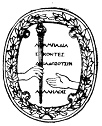

  
[Intangible Textual Heritage](../../index)  [UFOs](../index) 
[Mars](../mars/index)  [Index](index)  [Next](ipm01) 

------------------------------------------------------------------------

[Buy this Book at
Amazon.com](https://www.amazon.com/exec/obidos/ASIN/0691001014/internetsacredte)

------------------------------------------------------------------------

  
*From India to the Planet Mars*, by Théodore Flournoy; tr. Daniel B.
Vermilye, \[1900\], at Intangible Textual Heritage

------------------------------------------------------------------------

# FROM INDIA

###### TO

# THE PLANET MARS

## A STUDY OF A CASE OF SOMNAMBULISM

###### WITH GLOSSOLALIA

###### BY

### TH. (Théodore) FLOURNOY

###### PROFESSOR OF PSYCHOLOGY AT THE UNIVERSITY OF GENEVA

###### TRANSLATED BY

### DANIEL B. VERMILYE

 

#### HARPER & BROTHERS PUBLISHERS

#### NEW YORK AND LONDON

#### \[1900\]

Scanned, proofed and formatted by John Bruno Hare, at Intangible Textual
Heritage, April 2008. This text is in the public domain because it was
published prior to 1923.

  [  
Click to enlarge](img/title.jpg)  
Title Page  

  [  
Click to enlarge](img/verso.jpg)  
Verso and Inscription  

  [  
Click to enlarge](img/cover.jpg)  
Cover and Spine  

------------------------------------------------------------------------

[Next: Contents](ipm01)
