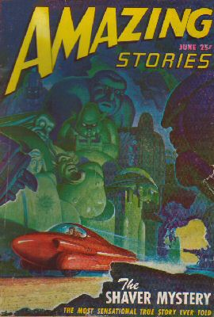

  
[Intangible Textual Heritage](../../index)  [UFOs](../index.md) 

------------------------------------------------------------------------

[Buy this Book at
Amazon.com](https://www.amazon.com/exec/obidos/ASIN/0932813631/internetsacredte.md)

------------------------------------------------------------------------

<table width="75%">
<colgroup>
<col style="width: 50%" />
<col style="width: 50%" />
</colgroup>
<tbody>
<tr class="odd">
<td width="50%" data-valign="TOP"></td>
<td width="50%" data-valign="CENTER"><h1 id="i-remember-lemuria" data-align="CENTER">I Remember Lemuria</h1>
<h6 id="and" data-align="CENTER">and</h6>
<h4 id="the-return-of-sathanas" data-align="CENTER">The return of Sathanas</h4>
<h2 id="by-richard-s.-shaver" data-align="CENTER">by Richard S. Shaver</h2>
<h4 id="section" data-align="CENTER">[1948]</h4></td>
</tr>
</tbody>
</table>

------------------------------------------------------------------------

[Contents](#contents)    [Start Reading](irl00.md)    [Page
Index](pageidx)    [Text (Zipped)](irltxt.zip.md)

------------------------------------------------------------------------

|                                                                                                                           |
|---------------------------------------------------------------------------------------------------------------------------|
|  |

Richard S. Shaver (b. 1907, d. 1975), discouraged art student and
sometime leftist fellow-traveler, was a welder in the early 1930s in a
noisy Ford factory in Wisconsin. He later claimed that this was where he
first started hearing the voices--voices warning him of vast caves under
the earth, where lurk the *dero:* prehistoric, devolved cannibals who
prey on our minds with ancient super-science. Also in the mix: lost
continents, hollow planets, starships the size of a moon, titanic
god-like races of beings, and ... sexy aliens. A heady combination of
pre-fabricated sci-fi memes, which would later become part of the
strange loop connecting UFOs, pop culture, fan-boy obsessions, the
occult, and conspiracy theories. It all started with one magazine:
Amazing Stories, and its editor, Ray Palmer.

In 1944, Shaver wrote a story which was the genesis of I Remember
Lemuria. This was later reworked by Palmer into the first story in this
book. It was published in the March 1945 issue of Amazing (as I Remember
Lemuria!). It was carefully triangulated by Palmer as both fiction and
'non-fiction,' and letters poured in from people who had seen or been
abducted by 'deros'. There were over twenty sequels set in the Shaver
universe, published between 1945 and 1948. The Return of Sathanas, the
second novella in this book, appeared originally in November 1946 (with
Satan as one part Ming the Merciless, one part interstellar procurer).
The book edition, titled I Remember Lemuria (dropping the !) was
published in a now very rare edition in 1948, not to reappear in print
until Adventures Unlimited reprinted it in 1999.

Some fans were appalled at the exploitation of Shaver's tall tale, a
drama which was played out in the letters page of Amazing. Finally in
December 1948, Palmer was pressured by management; Shaver was banned
from the magazine, and Palmer quit as editor of Amazing Stories in
solidarity. Shaver maintained to the last that his story was true.
Palmer, however, got a second act: he started Fate magazine. The very
first issue broke the Arnold flying saucer story, which started the UFO
craze. Shaver moved to Arkansas, continued self-publishing, and started
a rock shop. He remained friends with Palmer until they both died in
1975.

Taken at face value, this is a pretty good (but not great) pair of late
Golden Age sci-fi stories, albeit with more footnotes than one would
expect in the genre. The writing (or editing) is punchy. The plot drives
the story, rather than the need for constant exposition, as is too often
the case in texts like this. However, the real importance of these texts
is historic. The Shaver mythos had a huge tacit influence on 1950s and
successive UFO belief systems. For instance, Shavers' 'Nor,' blonde
demigods from outer space, suggest the 'Nordic' aliens of UFO lore. The
tunnels of the dero became subterranean alien bases. Embedded in this
short science fiction story were many of the themes which would later
become accepted UFO canon.

------------------------------------------------------------------------

 [Title Page](irl00.md)  
[Foreword](irl01.md)  

### I Remember Lemuria

[Chapter I. City of the Titans](irl02.md)  
[Chapter II. From Art to Embryology](irl03.md)  
[Chapter III. Terror in Tean City](irl04.md)  
[Chapter IV. Escape Into Space](irl05.md)  
[Chapter V, The Princess Vanue](irl06.md)  
[Chapter VI. Conclave of the Elders](irl07.md)  
[Chapter VII. A Wedding on Nor](irl08.md)  
[Chapter VIII. Return to Mu](irl09.md)  
[Chapter IX. The Abandondero](irl10.md)  
[Chapter X. Into the Tunnels of the Dero](irl11.md)  
[Chapter XI. Battle to the Death](irl12.md)  

### The Return of Sathanas

[Chapter I. Quest of the Darkome](irl13.md)  
[Chapter II. Whence Came Sathanas?](irl14.md)  
[Chapter III. Back on Mother Mu](irl15.md)  
[Chapter IV. Pact with the Aesir](irl16.md)  
[Chapter V. War Against the Jotuns](irl17.md)  
[Chapter VI. In the Hands of Sathanas](irl18.md)  
[Chapter VII. A Valuable Chunk of Meat](irl19.md)  
[Chapter VIII. Under The Pain Ray](irl20.md)  
[Chapter IX. Seizing the Satana](irl21.md)  
[Chapter X. A Satanic Hostage](irl22.md)  
[Chapter XI. Plot Against Pandral](irl23.md)  
[Chapter XII. Harald's Hostages](irl24.md)  

 

[Mr. Shaver's Lemurian Alphabet](irl25.md)  
